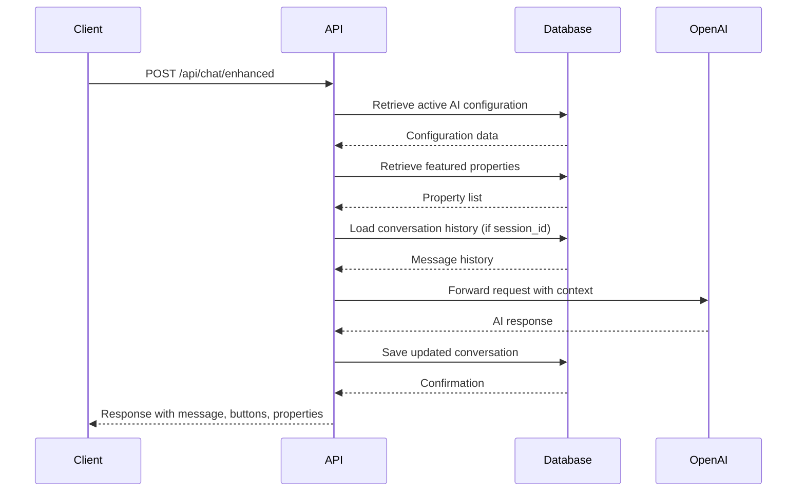
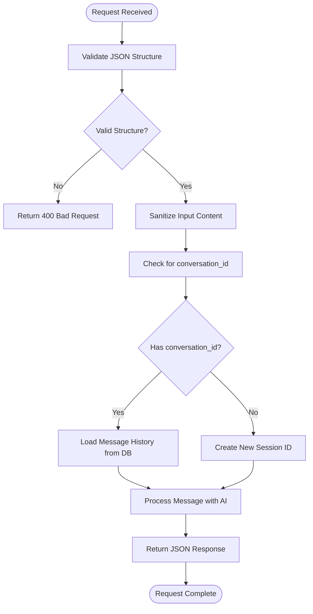
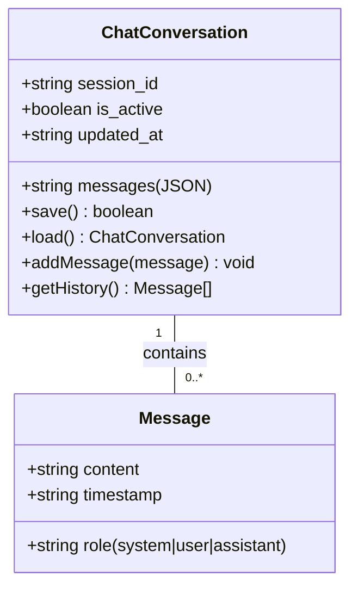

# Backend API Integration

<cite>
**Referenced Files in This Document**   
- [index.ts](file://src/worker/index.ts#L1671-L1870)
- [types.ts](file://src/shared/types.ts#L1-L50)
</cite>

## Table of Contents
1. [Introduction](#introduction)
2. [Chat API Endpoint](#chat-api-endpoint)
3. [Request Format and Validation](#request-format-and-validation)
4. [Authentication and Headers](#authentication-and-headers)
5. [Response Schema](#response-schema)
6. [Conversation Context Management](#conversation-context-management)
7. [Error Handling](#error-handling)
8. [Curl Examples](#curl-examples)
9. [Logging Mechanisms](#logging-mechanisms)
10. [Security Practices](#security-practices)
11. [Environment Variables](#environment-variables)

## Introduction
This document provides comprehensive documentation for the enhanced chatbot API endpoint in the Hono worker. The endpoint enables users to interact with an AI assistant powered by OpenAI's GPT-4o-mini model, with dynamic configuration and persistent conversation context. The system supports property discovery, booking assistance, and personalized recommendations through a secure, rate-limited interface.

**Section sources**
- [index.ts](file://src/worker/index.ts#L1671-L1870)

## Chat API Endpoint

The `/api/chat/enhanced` endpoint is a POST route that processes user messages and returns AI-generated responses with interactive elements. It leverages the Hono framework with Zod validation and integrates with OpenAI's API to deliver intelligent, context-aware replies.

The endpoint is designed to support conversational continuity by preserving message history through session identifiers. It dynamically configures the AI model based on database-stored settings, allowing administrators to modify behavior, personality, and system prompts without code changes.



**Diagram sources**
- [index.ts](file://src/worker/index.ts#L1671-L1870)

**Section sources**
- [index.ts](file://src/worker/index.ts#L1671-L1870)

## Request Format and Validation

The endpoint accepts JSON payloads validated using Zod through the `ChatRequestSchema`. The request must include a user message and may include a conversation identifier for context preservation.

**Request Structure:**
- **message**: User's input text (required)
- **conversation_id**: Session identifier for conversation continuity (optional)

```json
{
  "message": "What properties do you recommend for a family of 4?",
  "conversation_id": "session_12345"
}
```

The `ChatRequestSchema` enforces input validation:
- Message must be a non-empty string
- Conversation ID must be a string if provided
- Input is sanitized to prevent injection attacks



**Diagram sources**
- [index.ts](file://src/worker/index.ts#L1671-L1870)
- [types.ts](file://src/shared/types.ts#L1-L50)

**Section sources**
- [index.ts](file://src/worker/index.ts#L1671-L1870)
- [types.ts](file://src/shared/types.ts#L1-L50)

## Authentication and Headers

The enhanced chat endpoint does not require authentication for basic usage, allowing guest interactions. However, it supports session continuity through the `conversation_id` parameter.

**Required Headers:**
- **Content-Type**: Must be `application/json`
- **X-Session-ID**: Optional, for advanced session tracking

**CORS Configuration:**
- Allowed origins: `http://localhost:5173`, `https://*.habibistay.com`
- Allowed methods: GET, POST, PUT, DELETE, OPTIONS
- Allowed headers: Content-Type, Authorization, X-CSRF-Token, X-Session-ID
- Credentials: Enabled

The endpoint is protected by comprehensive security middleware that includes rate limiting, input validation, SQL injection protection, and suspicious activity monitoring.

**Section sources**
- [index.ts](file://src/worker/index.ts#L1671-L1870)

## Response Schema

The API returns a standardized JSON response structure containing the AI reply, conversation metadata, interactive elements, and property recommendations.

**Response Structure:**
```json
{
  "success": true,
  "data": {
    "message": "I recommend our family-friendly villa in Al Olaya...",
    "conversation_id": "session_abc123",
    "buttons": [
      {
        "id": "search_properties",
        "text": "🏠 Browse Properties",
        "action": "search",
        "style": "primary"
      }
    ],
    "featured_properties": [
      {
        "id": 1,
        "title": "Luxury Villa",
        "location": "Al Olaya",
        "price_per_night": 800,
        "max_guests": 6,
        "description": "Spacious family home with pool"
      }
    ]
  }
}
```

**Field Descriptions:**
- **message**: AI-generated response text
- **conversation_id**: Unique identifier for the conversation session
- **buttons**: Array of interactive action buttons
- **featured_properties**: List of recommended properties with key details

The response follows the `ApiResponse` type structure defined in the shared types, ensuring consistency across the API.

**Section sources**
- [index.ts](file://src/worker/index.ts#L1671-L1870)
- [types.ts](file://src/shared/types.ts#L1-L50)

## Conversation Context Management

The system preserves conversation context across requests using session identifiers and database storage. This enables multi-turn interactions where the AI remembers previous messages and maintains conversational continuity.

**Context Preservation Flow:**
1. Client sends request with optional `conversation_id`
2. Server checks for existing conversation in database
3. If found, loads message history and appends new message
4. If not found, creates new session with generated ID
5. AI processes complete message history
6. Server stores updated conversation (excluding system prompt)
7. Response includes current `conversation_id` for continuity

Message history is stored in the `chat_conversations` table with:
- **session_id**: Unique conversation identifier
- **messages**: JSON array of message objects (role, content)
- **is_active**: Flag for active conversations
- **updated_at**: Timestamp for session management

The system automatically generates session IDs when not provided, using a combination of timestamp and random string: `session_${timestamp}_${random}`.



**Diagram sources**
- [index.ts](file://src/worker/index.ts#L1671-L1870)

**Section sources**
- [index.ts](file://src/worker/index.ts#L1671-L1870)

## Error Handling

The endpoint implements comprehensive error handling for various failure scenarios, returning appropriate HTTP status codes and error messages.

**Error Types and Responses:**
- **400 Bad Request**: Invalid JSON or missing required fields
- **500 Internal Server Error**: OpenAI API failure or database errors
- **500 Internal Server Error**: Missing AI configuration

**Error Response Structure:**
```json
{
  "success": false,
  "error": "Failed to process chat message"
}
```

The system logs all errors with full stack traces for debugging purposes. Specific error handling includes:
- OpenAI API connection failures
- Database query errors
- Missing AI configuration
- Invalid message content

Error handling is wrapped in a try-catch block that ensures graceful degradation and prevents sensitive information leakage to clients.

**Section sources**
- [index.ts](file://src/worker/index.ts#L1671-L1870)

## Curl Examples

The following curl examples demonstrate how to interact with the enhanced chat API endpoint.

**Basic Message Request:**
```bash
curl -X POST https://api.habibistay.com/api/chat/enhanced \
  -H "Content-Type: application/json" \
  -d '{
    "message": "What are some good properties for a weekend getaway?"
  }'
```

**Request with Existing Conversation:**
```bash
curl -X POST https://api.habibistay.com/api/chat/enhanced \
  -H "Content-Type: application/json" \
  -d '{
    "message": "Can you show me more details about the villa?",
    "conversation_id": "session_abc123xyz"
  }'
```

**Expected Response:**
```json
{
  "success": true,
  "data": {
    "message": "I'd be happy to tell you more about our luxury villa in Al Olaya. It features...",
    "conversation_id": "session_abc123xyz",
    "buttons": [
      {
        "id": "check_availability",
        "text": "📅 Check Availability",
        "action": "availability",
        "style": "secondary"
      },
      {
        "id": "book_now",
        "text": "💳 Book Now",
        "action": "book",
        "style": "success"
      }
    ],
    "featured_properties": [
      {
        "id": 1,
        "title": "Luxury Villa",
        "location": "Al Olaya",
        "price_per_night": 800,
        "max_guests": 6,
        "description": "Spacious family home with private pool"
      }
    ]
  }
}
```

**Section sources**
- [index.ts](file://src/worker/index.ts#L1671-L1870)

## Logging Mechanisms

The system implements comprehensive logging for monitoring, debugging, and analytics purposes.

**Log Types:**
- **Request Logging**: Records all incoming requests with timestamps, IP addresses, and endpoints
- **Error Logging**: Captures detailed error information including stack traces
- **AI Interaction Logging**: Logs prompts and responses for quality monitoring
- **Security Logging**: Tracks suspicious activities and blocked requests

The `requestLoggingMiddleware` captures:
- Request method and URL
- Client IP address
- Response status code
- Processing time
- User agent (when available)

Error logs include:
- Full error message and stack trace
- Timestamp of occurrence
- Request details that triggered the error
- Relevant context information

All logs are written to standard output and can be collected by external monitoring systems. Sensitive information such as API keys and personal data are redacted from logs.

**Section sources**
- [index.ts](file://src/worker/index.ts#L1671-L1870)

## Security Practices

The chat API implements multiple security layers to protect against common web vulnerabilities.

**Security Measures:**
- **Input Validation**: Zod schema validation for all incoming data
- **Input Sanitization**: String sanitization to prevent injection attacks
- **Rate Limiting**: 1,000 requests per 15 minutes per IP
- **SQL Injection Protection**: Parameterized database queries
- **CORS Protection**: Restricted origin policy
- **Security Headers**: Standard security headers applied to all responses
- **Suspended Activity Monitoring**: Detection of suspicious patterns

The system uses parameterized queries to prevent SQL injection:
```typescript
const { results } = await c.env.DB.prepare(
  "SELECT * FROM properties WHERE is_featured = 1 AND is_active = 1 ORDER BY created_at DESC LIMIT ?"
).bind(2).all();
```

Rate limiting is implemented globally with 1,000 requests per 15-minute window, with additional limits on specific endpoints. The `inputValidationMiddleware` and `sqlInjectionMiddleware` provide additional protection against malicious payloads.

**Section sources**
- [index.ts](file://src/worker/index.ts#L1671-L1870)

## Environment Variables

The chat API requires specific environment variables for operation, particularly for AI service integration.

**Required Environment Variables:**
- **OPENAI_API_KEY**: API key for OpenAI service access
- **MOCHA_USERS_SERVICE_API_URL**: URL for user authentication service
- **MOCHA_USERS_SERVICE_API_KEY**: API key for user service access
- **MYFATOORAH_API_KEY**: Payment processing API key
- **MYFATOORAH_API_URL**: Payment gateway URL

The system uses the `OPENAI_API_KEY` both as a fallback and as the primary key when no custom API key is configured in the AI settings. Environment variables are accessed through the Hono context (`c.env`) and are never exposed in client responses.

Database connection and other infrastructure settings are also configured through environment variables, following the 12-factor app methodology.

**Section sources**
- [index.ts](file://src/worker/index.ts#L1671-L1870)