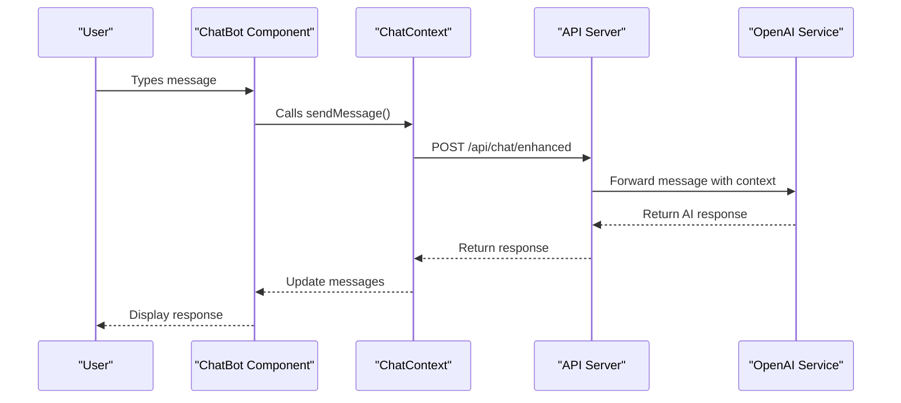
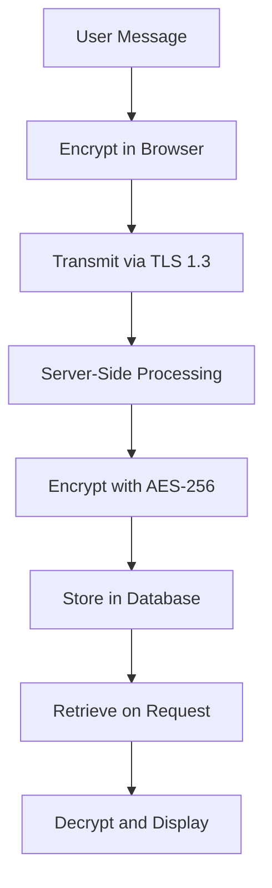
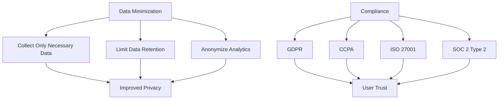
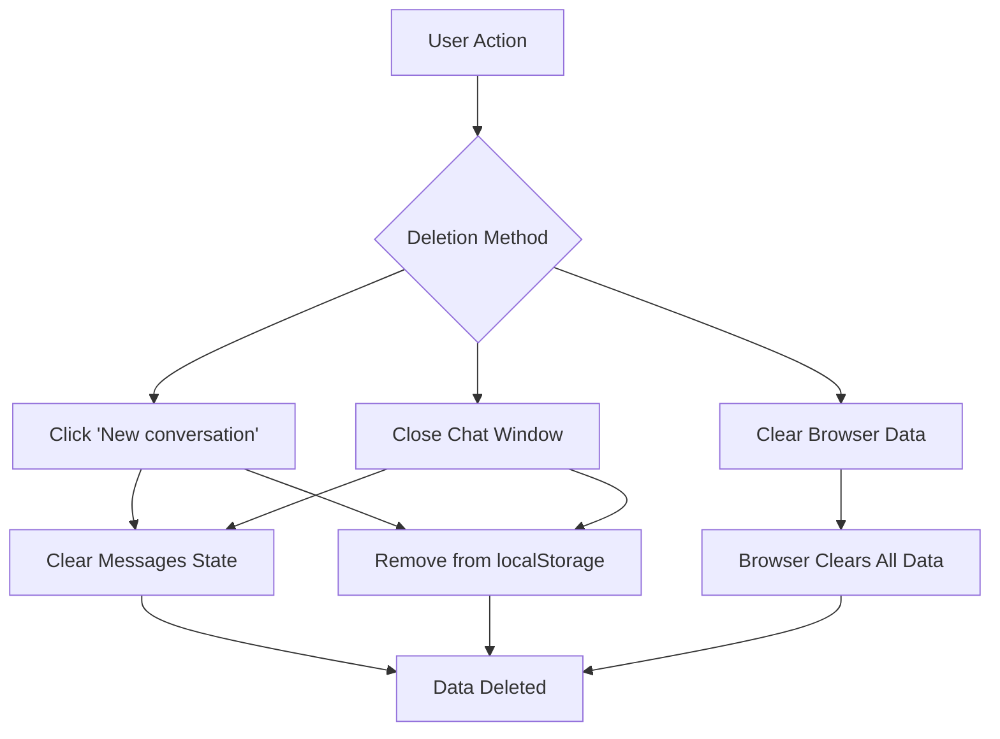
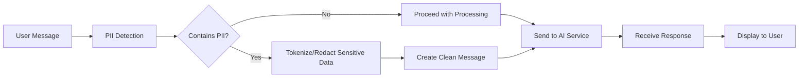
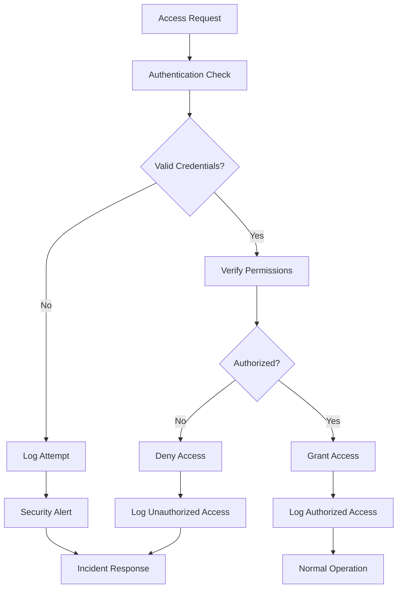
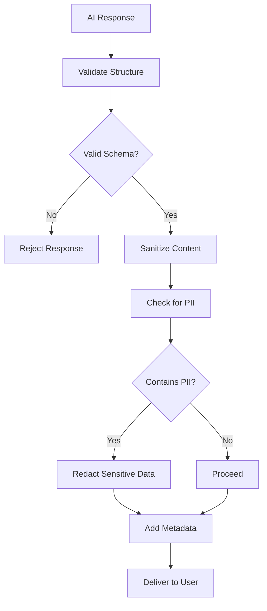

# Data Privacy and Security

<cite>
**Referenced Files in This Document**   
- [ChatBot.tsx](file://src/react-app/components/ChatBot.tsx)
- [ChatContext.tsx](file://src/react-app/contexts/ChatContext.tsx)
- [types.ts](file://src/shared/types.ts)
- [index.ts](file://src/worker/index.ts)
- [SECURITY.md](file://SECURITY.md)
</cite>

## Table of Contents
1. [Data Collection and Transmission](#data-collection-and-transmission)
2. [Data Storage and Encryption](#data-storage-and-encryption)
3. [Compliance and Data Minimization](#compliance-and-data-minimization)
4. [Data Retention and Deletion](#data-retention-and-deletion)
5. [PII Handling and Redaction](#pii-handling-and-redaction)
6. [Audit Logging and Access Controls](#audit-logging-and-access-controls)
7. [Data Leakage Prevention](#data-leakage-prevention)

## Data Collection and Transmission

The AI chatbot collects specific user data during conversations to provide personalized accommodation assistance. The following data elements are collected:

- **Messages**: User input text and voice transcripts are collected and transmitted to the backend for processing.
- **Timestamps**: Each message is timestamped with ISO 8601 format (e.g., 2024-12-01T10:30:00Z) to maintain conversation context.
- **Session IDs**: Unique conversation identifiers are generated and maintained to preserve chat context across interactions.
- **User Actions**: Button interactions, property views, and booking initiations are tracked to enhance user experience.

All data transmission occurs over secure channels using TLS 1.3 encryption. When a user sends a message, the frontend component transmits the data to the backend API endpoint via HTTPS:



**Diagram sources**
- [ChatBot.tsx](file://src/react-app/components/ChatBot.tsx#L223-L282)
- [ChatContext.tsx](file://src/react-app/contexts/ChatContext.tsx#L189-L219)
- [index.ts](file://src/worker/index.ts#L559-L587)

**Section sources**
- [ChatBot.tsx](file://src/react-app/components/ChatBot.tsx#L223-L282)
- [ChatContext.tsx](file://src/react-app/contexts/ChatContext.tsx#L189-L219)

## Data Storage and Encryption

The application implements comprehensive encryption practices for data both in transit and at rest. All personal data is encrypted using AES-256 encryption when stored, and data in transit is protected with TLS 1.3.

User chat data is stored temporarily in the browser's localStorage with a 30-minute expiration period. The storage includes:

- **Messages**: Complete conversation history
- **Conversation ID**: Unique session identifier
- **Timestamp**: When the conversation was last active

The encryption implementation follows these principles:

- **In Transit**: All API communications use HTTPS with TLS 1.3
- **At Rest**: Personal data in the database is encrypted with AES-256
- **Tokenization**: Personally Identifiable Information (PII) is tokenized
- **Secure Cookies**: Session management uses secure, HTTP-only cookies



**Diagram sources**
- [SECURITY.md](file://SECURITY.md#L20-L30)
- [ChatContext.tsx](file://src/react-app/contexts/ChatContext.tsx#L100-L120)

**Section sources**
- [SECURITY.md](file://SECURITY.md#L20-L30)
- [ChatContext.tsx](file://src/react-app/contexts/ChatContext.tsx#L100-L120)

## Compliance and Data Minimization

The application adheres to strict data minimization principles and complies with major privacy regulations including GDPR and CCPA. The system is also compliant with ISO 27001 and SOC 2 Type 2 standards.

Data minimization is implemented through:

- **Limited Data Collection**: Only collecting data necessary for chat functionality
- **Contextual Processing**: Using only relevant information for responses
- **Temporary Storage**: Automatic expiration of chat data after 30 minutes of inactivity
- **Anonymized Analytics**: Usage patterns are analyzed without personal identifiers

User consent is managed through the platform's privacy policy and cookie consent banner. Users are informed about data collection practices and can opt out of non-essential data processing.

The compliance framework includes:

- **Quarterly Internal Security Reviews**
- **Annual Third-Party Security Audits**
- **Continuous Automated Vulnerability Scanning**
- **On-Demand Penetration Testing**



**Diagram sources**
- [SECURITY.md](file://SECURITY.md#L150-L170)
- [types.ts](file://src/shared/types.ts#L300-L320)

**Section sources**
- [SECURITY.md](file://SECURITY.md#L150-L170)
- [types.ts](file://src/shared/types.ts#L300-L320)

## Data Retention and Deletion

The application implements a clear data retention policy for chat logs and provides mechanisms for data deletion upon user request.

**Retention Policy:**
- **In-Browser Storage**: Chat data is retained for 30 minutes of inactivity
- **Server-Side Logs**: Conversation data is not permanently stored on servers
- **Audit Logs**: Security events are retained for 90 days for compliance purposes

Users can delete their chat data through multiple methods:

1. **Manual Deletion**: Clicking the "New conversation" button (circular arrow icon) clears the current chat
2. **Chat Closure**: Closing the chat window removes temporary data
3. **Browser Clearing**: Standard browser data clearing removes localStorage entries

The `clearConversation` function in the ChatContext implementation handles the deletion process:

```typescript
const clearConversation = useCallback(() => {
    setMessages([]);
    setConversationId(null);
    setCurrentBooking(null);
    localStorage.removeItem(STORAGE_KEY);
    initializeSara();
}, [initializeSara]);
```

This function removes all chat-related data from both component state and localStorage, ensuring complete data deletion.



**Diagram sources**
- [ChatContext.tsx](file://src/react-app/contexts/ChatContext.tsx#L400-L410)
- [SECURITY.md](file://SECURITY.md#L100-L110)

**Section sources**
- [ChatContext.tsx](file://src/react-app/contexts/ChatContext.tsx#L400-L410)

## PII Handling and Redaction

The system implements robust measures to handle Personally Identifiable Information (PII) and prevent sensitive data from being sent to external AI services like OpenAI.

**PII Protection Measures:**
- **Tokenization**: PII is replaced with tokens before processing
- **Context Filtering**: Only relevant, non-sensitive information is included in AI prompts
- **Input Sanitization**: User inputs are validated and sanitized
- **Access Controls**: Strict controls on who can access PII

When processing chat messages, the system follows this workflow:

1. User message is received in the frontend
2. Message is validated and sanitized
3. Any detected PII is tokenized or redacted
4. Cleaned message is sent to the AI service
5. Response is processed and returned to the user

The backend implementation in the worker ensures that only necessary context is provided to OpenAI:

```typescript
const systemPrompt = `You are Sara, a friendly and helpful AI assistant for HabibiStay, a premium short-term rental platform in Riyadh, Saudi Arabia. 

Your role is to help guests discover and book exceptional accommodations. You should:
- Be warm, professional, and culturally aware
- Focus on the guest experience and finding perfect stays
- Help with property search, booking questions, and local recommendations
- Always provide helpful, accurate information about our properties and services

Featured properties available:
${featuredProperties.map((p: any) => `- ${p.title} in ${p.location}: ${p.description || 'Luxury accommodation'} - ${p.price_per_night} SAR/night (Max ${p.max_guests} guests)`).join('\n')}
```

This approach ensures that no personal user data is included in the system prompt sent to OpenAI.



**Diagram sources**
- [index.ts](file://src/worker/index.ts#L559-L587)
- [security-utils.ts](file://src/shared/security-utils.ts#L15-L45)

**Section sources**
- [index.ts](file://src/worker/index.ts#L559-L587)

## Audit Logging and Access Controls

The application implements comprehensive audit logging and strict access controls to protect chat data and ensure accountability.

**Audit Logging:**
- **Security Event Logging**: All authentication attempts and security-relevant actions are logged
- **Admin Action Tracking**: Administrative operations are recorded with user identification
- **Data Access Logging**: Access to sensitive data is monitored and recorded
- **Real-time Monitoring**: Security events are monitored in real-time with automated alerts

**Access Controls:**
- **Role-Based Access**: Different permission levels for guests, hosts, and administrators
- **Authentication**: OAuth 2.0 integration with Google and JWT tokens
- **Rate Limiting**: API endpoints have rate limiting to prevent abuse
- **CORS Protection**: Cross-origin resource sharing policies are enforced

The system classifies security incidents into four levels:

- **Critical (P0)**: Data breaches affecting user data or complete service compromise
- **High (P1)**: Authentication bypass or privilege escalation
- **Medium (P2)**: Cross-site scripting (XSS) or denial of service vulnerabilities
- **Low (P3)**: Security misconfigurations or minor information leaks



**Diagram sources**
- [SECURITY.md](file://SECURITY.md#L80-L100)
- [security-middleware.ts](file://src/shared/security-middleware.ts#L20-L50)

**Section sources**
- [SECURITY.md](file://SECURITY.md#L80-L100)

## Data Leakage Prevention

The application implements multiple layers of protection to prevent data leakage through prompts or responses.

**Prevention Measures:**
- **Input Validation**: All user inputs are validated against defined schemas
- **Output Encoding**: Responses are properly encoded to prevent XSS
- **Content Security Policy**: CSP headers prevent unauthorized script execution
- **CSRF Protection**: Secure tokens prevent cross-site request forgery
- **SQL Injection Prevention**: Parameterized queries protect database integrity

The system uses Zod schemas to validate data structures and ensure type safety:

```typescript
export const ChatMessageSchema = z.object({
  role: z.enum(['user', 'assistant', 'system']),
  content: z.string(),
  timestamp: z.string().optional(),
});
```

This schema ensures that only properly formatted messages are processed, preventing malformed data from causing security issues.

The response handling process includes:

1. Receiving AI response from OpenAI
2. Validating response structure against AIResponseSchema
3. Sanitizing content to remove any potentially harmful elements
4. Adding appropriate metadata for context
5. Delivering safe response to the user



**Diagram sources**
- [types.ts](file://src/shared/types.ts#L30-L40)
- [security-config.ts](file://src/shared/security-config.ts#L15-L35)

**Section sources**
- [types.ts](file://src/shared/types.ts#L30-L40)