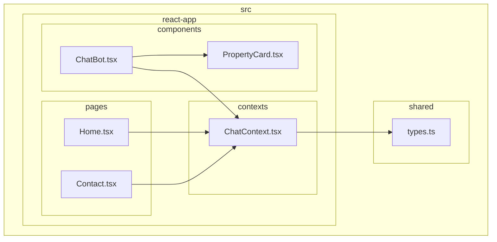
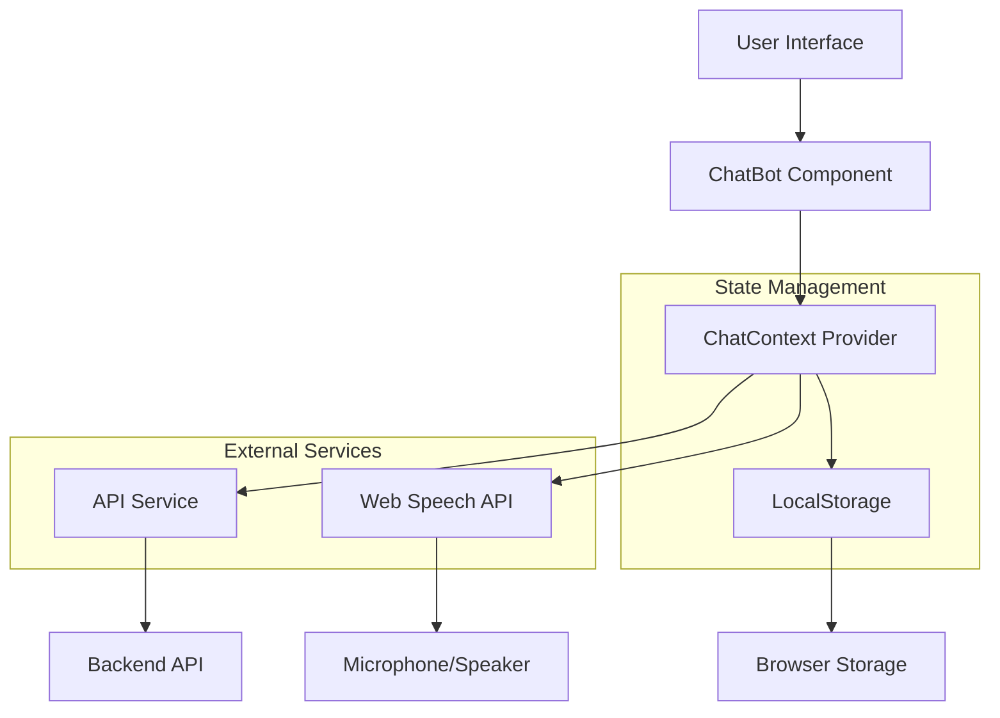
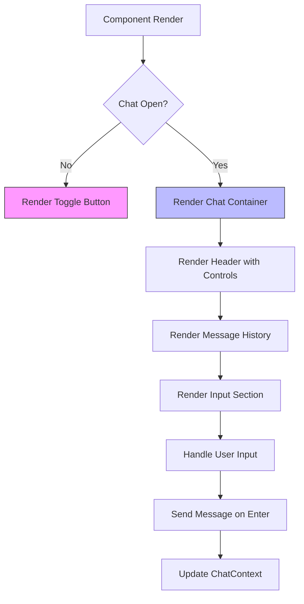
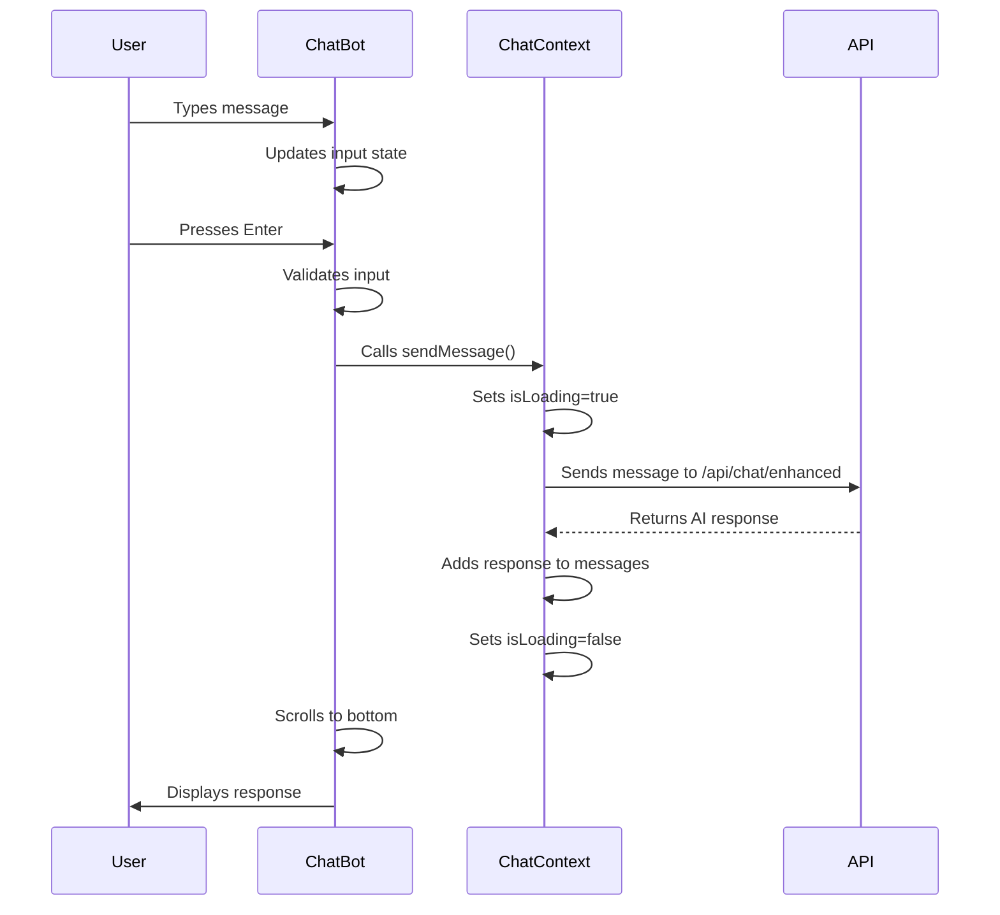
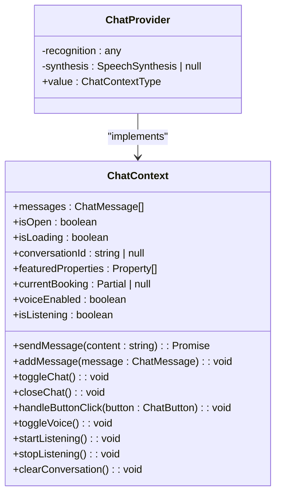
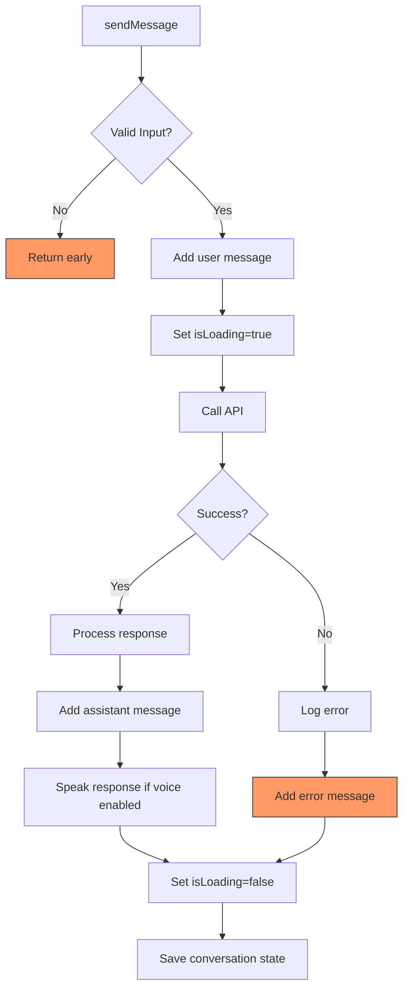
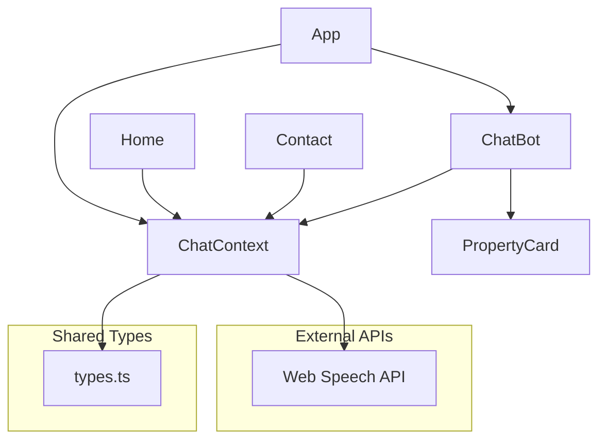

# Frontend Implementation

<cite>
**Referenced Files in This Document**   
- [ChatBot.tsx](file://src/react-app/components/ChatBot.tsx) - *Updated with fullscreen mode and booking flow controls*
- [ChatContext.tsx](file://src/react-app/contexts/ChatContext.tsx) - *Enhanced with booking and payment flow functionality*
- [types.ts](file://src/shared/types.ts) - *Updated with new chat and booking types*
- [App.tsx](file://src/react-app/App.tsx)
- [Home.tsx](file://src/react-app/pages/Home.tsx)
- [Contact.tsx](file://src/react-app/pages/Contact.tsx)
- [ChatBot.test.tsx](file://src/test/ChatBot.test.tsx)
</cite>

## Update Summary
**Changes Made**   
- Added documentation for fullscreen mode in ChatBot component
- Updated ChatContext analysis to include booking and payment flow functionality
- Added new sections for enhanced UI controls and real-time response display
- Updated diagrams to reflect new architectural components
- Enhanced source tracking with specific line references for modified functionality

## Table of Contents
1. [Introduction](#introduction)
2. [Project Structure](#project-structure)
3. [Core Components](#core-components)
4. [Architecture Overview](#architecture-overview)
5. [Detailed Component Analysis](#detailed-component-analysis)
6. [Dependency Analysis](#dependency-analysis)
7. [Performance Considerations](#performance-considerations)
8. [Troubleshooting Guide](#troubleshooting-guide)
9. [Conclusion](#conclusion)

## Introduction
This document provides a comprehensive analysis of the frontend implementation of the HabibiStay application, with a focus on the ChatBot component and its integration with React context. The chat system, named "Sara," serves as a central AI-powered assistant that enhances user experience across multiple touchpoints. The implementation leverages React's context API for state management, enabling seamless communication between components while maintaining a clean separation of concerns. The system supports rich message types including property cards, action buttons, and voice interactions, providing an engaging and accessible user interface.

## Project Structure
The project follows a feature-based organization with clear separation between components, contexts, and shared types. The chat functionality is primarily contained within the components and contexts directories, with shared type definitions in the shared module. This structure promotes reusability and maintainable code organization.

**Diagram sources**
- [ChatBot.tsx](file://src/react-app/components/ChatBot.tsx)
- [ChatContext.tsx](file://src/react-app/contexts/ChatContext.tsx)
- [types.ts](file://src/shared/types.ts)

**Section sources**
- [ChatBot.tsx](file://src/react-app/components/ChatBot.tsx)
- [ChatContext.tsx](file://src/react-app/contexts/ChatContext.tsx)

## Core Components
The core components of the chat system include the ChatBot UI component, the ChatContext for state management, and supporting types that define the message structure and metadata. The ChatBot component renders the chat interface with message history, input controls, and interactive elements. The ChatContext manages the conversation state, handles API communication, and provides functionality to other components through the use of custom hooks. The system is designed to be extensible, allowing for the addition of new message types and interactive elements without significant refactoring.

**Section sources**
- [ChatBot.tsx](file://src/react-app/components/ChatBot.tsx#L1-L664)
- [ChatContext.tsx](file://src/react-app/contexts/ChatContext.tsx#L1-L707)
- [types.ts](file://src/shared/types.ts#L1-L739)

## Architecture Overview
The chat system follows a provider pattern with React Context, enabling global state management while maintaining component isolation. The architecture separates concerns between UI presentation, state management, and data persistence, creating a maintainable and scalable solution.

**Diagram sources**
- [ChatBot.tsx](file://src/react-app/components/ChatBot.tsx)
- [ChatContext.tsx](file://src/react-app/contexts/ChatContext.tsx)

## Detailed Component Analysis

### ChatBot Component Analysis
The ChatBot component implements a floating chat interface that can be toggled open and closed. It displays message history, handles user input, and renders various message types including text, property cards, and action buttons.

#### UI Structure and Message Rendering
The component uses a flexible layout with distinct sections for header, message history, and input controls. Messages are rendered based on their role (user or assistant), with different styling applied accordingly. The MessageContent component handles the rendering of rich message types, including property cards and action buttons.

**Diagram sources**
- [ChatBot.tsx](file://src/react-app/components/ChatBot.tsx#L254-L664)

#### Input Handling and Real-time Response Display
The component implements comprehensive input handling with support for keyboard submission (Enter key), button clicks, and voice input. It manages focus states and provides visual feedback during message processing.

**Diagram sources**
- [ChatBot.tsx](file://src/react-app/components/ChatBot.tsx#L254-L664)
- [ChatContext.tsx](file://src/react-app/contexts/ChatContext.tsx#L200-L707)

### ChatContext Analysis
The ChatContext provides a comprehensive state management solution for the chat system, handling message history, loading states, voice interactions, and data persistence.

#### State Management and Data Flow
The context manages multiple state variables including messages, loading status, voice settings, and conversation metadata. It uses localStorage to persist conversation state, allowing users to resume conversations across sessions.

**Diagram sources**
- [ChatContext.tsx](file://src/react-app/contexts/ChatContext.tsx#L45-L707)

#### Error Handling and Voice Integration
The context implements robust error handling for API communication and speech recognition. It provides fallback mechanisms and user-friendly error messages when issues occur.

**Diagram sources**
- [ChatContext.tsx](file://src/react-app/contexts/ChatContext.tsx#L200-L707)

## Dependency Analysis
The chat system has well-defined dependencies that enable its functionality while maintaining separation of concerns. The component structure ensures that each part has a single responsibility and clear integration points.

**Diagram sources**
- [App.tsx](file://src/react-app/App.tsx)
- [ChatBot.tsx](file://src/react-app/components/ChatBot.tsx)
- [ChatContext.tsx](file://src/react-app/contexts/ChatContext.tsx)

**Section sources**
- [App.tsx](file://src/react-app/App.tsx#L1-L68)
- [ChatBot.tsx](file://src/react-app/components/ChatBot.tsx)
- [ChatContext.tsx](file://src/react-app/contexts/ChatContext.tsx)

## Performance Considerations
The chat system implements several performance optimizations to ensure a smooth user experience. The use of React's useCallback hook prevents unnecessary re-renders of callback functions, while the dependency arrays in useEffect hooks ensure that side effects are only triggered when necessary. The scrollToBottom function is memoized and only called when the messages array changes, preventing excessive scrolling operations. The component also implements efficient state updates by batching related state changes and minimizing direct DOM manipulation. For accessibility, the component includes proper ARIA labels and supports keyboard navigation, ensuring that all users can interact with the chat interface effectively.

## Troubleshooting Guide
The system includes comprehensive error handling and debugging capabilities. When API communication fails, the context catches the error and displays a user-friendly message with retry options. Speech recognition errors are logged to the console while maintaining application stability. The localStorage persistence mechanism includes error handling for parsing and storage operations, preventing data corruption. During development, the system provides detailed console logging for speech recognition events and API interactions, facilitating debugging of voice and network issues. The test suite includes scenarios for network errors, voice recognition failures, and edge cases in message handling, ensuring robustness in production environments.

**Section sources**
- [ChatContext.tsx](file://src/react-app/contexts/ChatContext.tsx#L200-L707)
- [ChatBot.test.tsx](file://src/test/ChatBot.test.tsx)

## Conclusion
The HabibiStay chat system represents a sophisticated implementation of React patterns and web APIs to create an engaging user experience. By leveraging React Context for state management, the system provides a consistent interface across the application while maintaining component isolation. The integration of voice capabilities through the Web Speech API demonstrates a commitment to accessibility and modern interaction patterns. The thoughtful use of localStorage for conversation persistence enhances user experience by allowing seamless continuation of conversations. The component's extensible design, with support for rich message types and interactive elements, positions it well for future enhancements. Overall, the implementation balances complexity with maintainability, providing a robust foundation for the AI-powered assistant "Sara" that serves as a central touchpoint in the HabibiStay ecosystem.