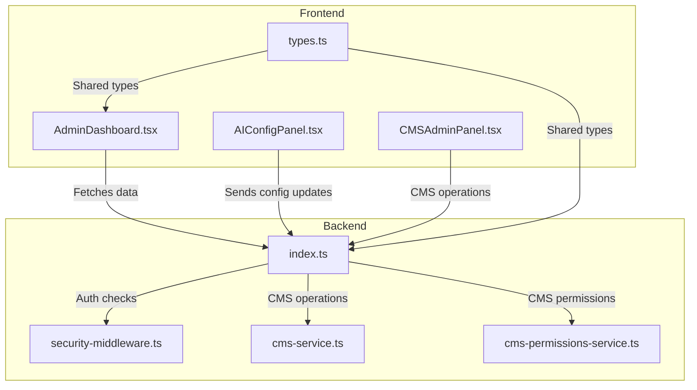
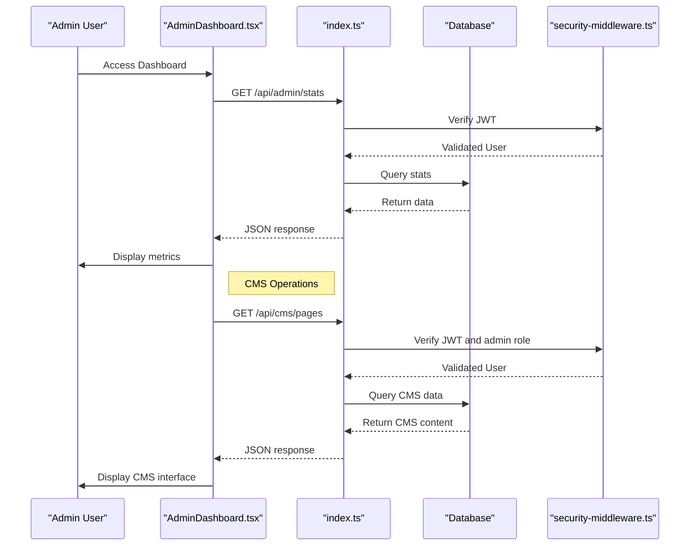
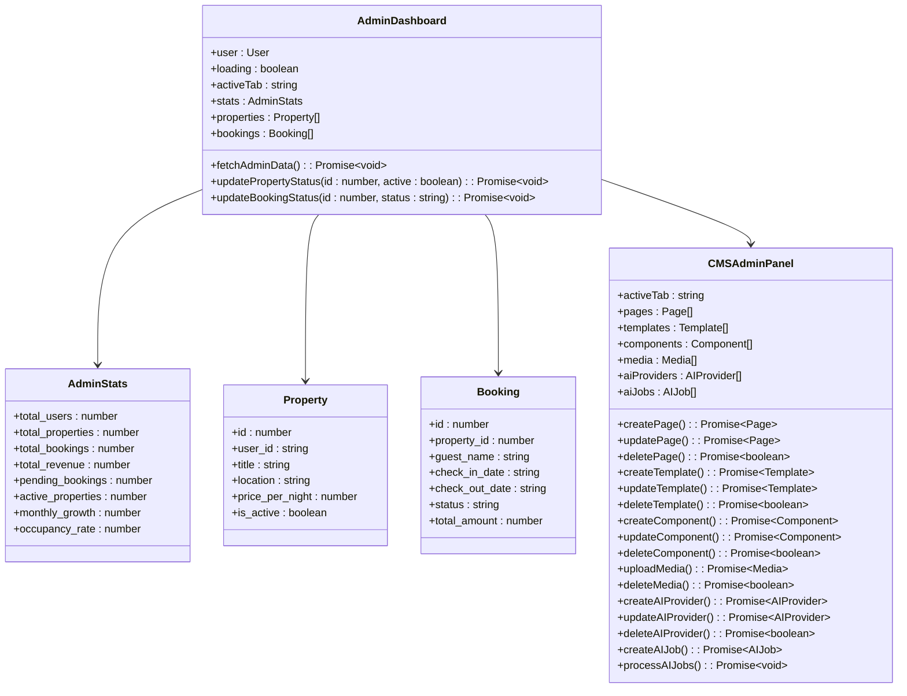
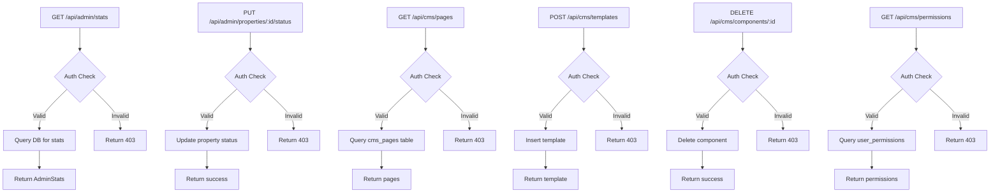
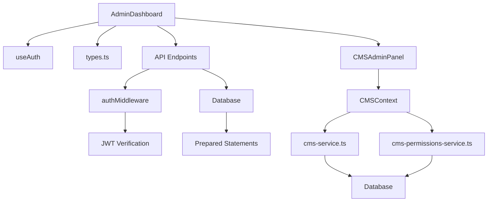

# Admin Dashboard

<cite>
**Referenced Files in This Document**   
- [AdminDashboard.tsx](file://src/react-app/pages/AdminDashboard.tsx#L1-L585) - *Updated with CMS integration*
- [CMSAdminPanel.tsx](file://src/react-app/components/admin/CMSAdminPanel.tsx#L1-L1140) - *Added in recent commit*
- [security-middleware.ts](file://src/shared/security-middleware.ts#L1-L386)
- [types.ts](file://src/shared/types.ts#L1-L600)
- [index.ts](file://src/worker/index.ts#L917-L1685)
- [CMSContext.tsx](file://src/react-app/contexts/CMSContext.tsx#L1-L527) - *CMS context implementation*
- [cms-service.ts](file://src/shared/cms-service.ts#L1-L350) - *Backend CMS service*
- [cms-permissions-service.ts](file://src/shared/cms-permissions-service.ts#L1-L132) - *CMS permissions management*
</cite>

## Update Summary
**Changes Made**   
- Added comprehensive documentation for the new Content Management System (CMS) tab in the Admin Dashboard
- Updated Core Components section to include CMS functionality
- Added detailed analysis of CMSAdminPanel component and its features
- Documented new backend API endpoints for CMS operations
- Enhanced dependency analysis to include CMS-related modules
- Added security considerations for CMS permissions

## Table of Contents
1. [Introduction](#introduction)
2. [Project Structure](#project-structure)
3. [Core Components](#core-components)
4. [Architecture Overview](#architecture-overview)
5. [Detailed Component Analysis](#detailed-component-analysis)
6. [Dependency Analysis](#dependency-analysis)
7. [Performance Considerations](#performance-considerations)
8. [Troubleshooting Guide](#troubleshooting-guide)
9. [Conclusion](#conclusion)

## Introduction
The Admin Dashboard is a central interface for platform administrators to monitor, manage, and configure the HabibiStay application. It provides comprehensive oversight of key metrics such as user growth, property inventory, booking activity, and revenue performance. The dashboard also enables administrative control over property listings, bookings, AI assistant configuration, and system settings. Built with React and integrated with a secure backend API, the dashboard enforces strict role-based access controls to ensure only authorized personnel can access sensitive data and functionality. Recent updates have added a comprehensive Content Management System (CMS) that allows administrators to manage website content, templates, components, and media.

## Project Structure
The Admin Dashboard is implemented as a React component within the `src/react-app/pages/AdminDashboard.tsx` file. It leverages shared types from `src/shared/types.ts` for consistent data modeling across the frontend and backend. The backend logic resides in `src/worker/index.ts`, which defines the API endpoints used by the dashboard. Security middleware in `src/shared/security-middleware.ts` ensures authentication and authorization are properly enforced. The new CMS functionality is implemented in the `CMSAdminPanel` component and supported by dedicated backend services.

**Diagram sources**
- [AdminDashboard.tsx](file://src/react-app/pages/AdminDashboard.tsx#L1-L585)
- [CMSAdminPanel.tsx](file://src/react-app/components/admin/CMSAdminPanel.tsx#L1-L1140)
- [index.ts](file://src/worker/index.ts#L917-L1685)
- [cms-service.ts](file://src/shared/cms-service.ts#L1-L350)
- [cms-permissions-service.ts](file://src/shared/cms-permissions-service.ts#L1-L132)

**Section sources**
- [AdminDashboard.tsx](file://src/react-app/pages/AdminDashboard.tsx#L1-L585)
- [index.ts](file://src/worker/index.ts#L917-L1685)

## Core Components
The Admin Dashboard consists of several core components:
- **AdminStats**: Aggregates platform-wide metrics including total users, properties, bookings, revenue, and occupancy rate.
- **Property Management**: Enables administrators to view, filter, and update the status (active/inactive) of property listings.
- **Booking Oversight**: Allows monitoring and modification of booking statuses (e.g., confirmed, pending, canceled).
- **AI Configuration Panel**: Provides a UI for adjusting AI assistant settings such as model provider, personality, and language.
- **Content Management System (CMS)**: A comprehensive panel for managing website content, templates, components, media, and AI-generated content.
- **System Settings**: Offers controls for platform-wide configurations like maintenance mode and support email.

These components interact with backend APIs that aggregate data from multiple sources and enforce admin-level permissions through middleware.

**Section sources**
- [AdminDashboard.tsx](file://src/react-app/pages/AdminDashboard.tsx#L1-L585)
- [CMSAdminPanel.tsx](file://src/react-app/components/admin/CMSAdminPanel.tsx#L1-L1140)
- [AIConfigPanel.tsx](file://src/react-app/components/admin/AIConfigPanel.tsx#L66-L136)

## Architecture Overview
The Admin Dashboard follows a client-server architecture where the frontend React application communicates with a backend API built using Hono. The backend exposes RESTful endpoints that are protected by authentication and authorization middleware. Data is stored in a database accessed via prepared statements to prevent SQL injection. The CMS functionality extends this architecture with dedicated endpoints for content management operations.

**Diagram sources**
- [AdminDashboard.tsx](file://src/react-app/pages/AdminDashboard.tsx#L1-L585)
- [index.ts](file://src/worker/index.ts#L917-L1685)
- [security-middleware.ts](file://src/shared/security-middleware.ts#L1-L386)

## Detailed Component Analysis

### Admin Dashboard Analysis
The AdminDashboard component serves as the main container for administrative functionality. It manages state for statistics, properties, and bookings, fetching data on mount and providing handlers for updating property and booking statuses. The component has been updated to include a new CMS tab that integrates the CMSAdminPanel for content management.

**Diagram sources**
- [AdminDashboard.tsx](file://src/react-app/pages/AdminDashboard.tsx#L1-L585)
- [CMSAdminPanel.tsx](file://src/react-app/components/admin/CMSAdminPanel.tsx#L1-L1140)
- [types.ts](file://src/shared/types.ts#L1-L600)

**Section sources**
- [AdminDashboard.tsx](file://src/react-app/pages/AdminDashboard.tsx#L1-L585)

### Backend API Endpoints
The backend provides several endpoints for the Admin Dashboard, all protected by authentication and role-based access control. These endpoints aggregate data from the database and return it in a structured format. The CMS functionality introduces new endpoints for managing content, templates, components, media, and permissions.

**Diagram sources**
- [index.ts](file://src/worker/index.ts#L917-L1685)
- [cms-service.ts](file://src/shared/cms-service.ts#L1-L350)
- [cms-permissions-service.ts](file://src/shared/cms-permissions-service.ts#L1-L132)

**Section sources**
- [index.ts](file://src/worker/index.ts#L917-L1685)

## Dependency Analysis
The Admin Dashboard depends on several key modules:
- **Authentication**: Uses `useAuth()` hook to verify user identity and role.
- **Shared Types**: Relies on `Property`, `Booking`, and CMS-related types from `types.ts` for type safety.
- **Security Middleware**: Backend endpoints use `authMiddleware` and `requireRole` for access control.
- **Database**: Backend queries a database to retrieve and update administrative data.
- **CMS Services**: The new CMS functionality depends on `cms-service.ts` and `cms-permissions-service.ts` for content and permission management.
- **CMS Context**: The frontend uses `CMSContext` to manage CMS state and provide data to components.

**Diagram sources**
- [AdminDashboard.tsx](file://src/react-app/pages/AdminDashboard.tsx#L1-L585)
- [security-middleware.ts](file://src/shared/security-middleware.ts#L1-L386)
- [types.ts](file://src/shared/types.ts#L1-L600)
- [index.ts](file://src/worker/index.ts#L917-L1685)
- [CMSContext.tsx](file://src/react-app/contexts/CMSContext.tsx#L1-L527)
- [cms-service.ts](file://src/shared/cms-service.ts#L1-L350)
- [cms-permissions-service.ts](file://src/shared/cms-permissions-service.ts#L1-L132)

**Section sources**
- [AdminDashboard.tsx](file://src/react-app/pages/AdminDashboard.tsx#L1-L585)
- [security-middleware.ts](file://src/shared/security-middleware.ts#L1-L386)
- [CMSContext.tsx](file://src/react-app/contexts/CMSContext.tsx#L1-L527)

## Performance Considerations
The Admin Dashboard loads multiple datasets on initialization using `Promise.all()` to parallelize requests, reducing overall load time. The backend uses prepared statements for efficient database queries. For large datasets, pagination should be implemented to avoid performance degradation. Caching strategies could be employed to reduce database load for frequently accessed statistics. The CMS functionality may require special attention to performance, particularly when loading large numbers of pages, templates, or media files.

## Troubleshooting Guide
Common issues and their solutions:
- **Access Denied (403)**: Ensure the user has admin privileges (email contains 'admin' or 'owner').
- **Data Not Loading**: Check network requests in browser dev tools; verify backend is running.
- **CSRF Errors**: Ensure x-session-id and x-csrf-token headers are included in POST/PUT requests.
- **SQL Injection Blocks**: Validate that input data does not contain SQL keywords or patterns.
- **CMS Content Not Saving**: Verify that the user has the appropriate CMS permissions (e.g., cms.pages.create, cms.pages.edit).
- **AI Content Generation Failing**: Check that AI providers are properly configured with valid API keys and URLs.

**Section sources**
- [security-middleware.ts](file://src/shared/security-middleware.ts#L1-L386)
- [index.ts](file://src/worker/index.ts#L917-L1685)
- [cms-permissions-service.ts](file://src/shared/cms-permissions-service.ts#L1-L132)

## Conclusion
The Admin Dashboard provides a comprehensive interface for managing the HabibiStay platform. It combines real-time analytics with administrative controls, all protected by robust security measures. The separation of concerns between frontend and backend, along with consistent type definitions, ensures maintainability and scalability. The recent addition of the Content Management System (CMS) significantly enhances the dashboard's capabilities, allowing administrators to manage website content, templates, components, and media directly from the admin interface. Future enhancements could include custom reporting, advanced filtering, integration with external analytics tools, and enhanced CMS features such as content versioning and workflow management.