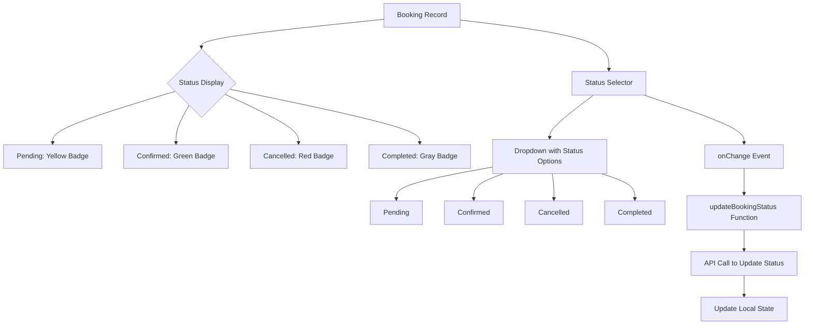
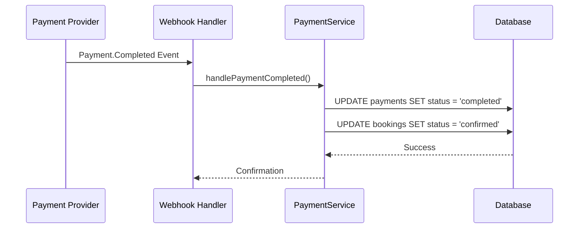
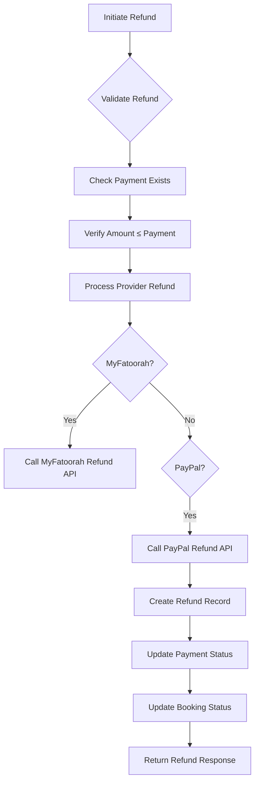

# Booking Oversight

<cite>
**Referenced Files in This Document**   
- [AdminDashboard.tsx](file://src/react-app/pages/AdminDashboard.tsx)
- [index.ts](file://src/worker/index.ts)
- [types.ts](file://src/shared/types.ts)
- [PaymentService.ts](file://src/server/services/PaymentService.ts)
</cite>

## Table of Contents
1. [Introduction](#introduction)
2. [Booking Management Interface](#booking-management-interface)
3. [Backend API Endpoints](#backend-api-endpoints)
4. [UI Components and Functionality](#ui-components-and-functionality)
5. [Booking Status and Payment Integration](#booking-status-and-payment-integration)
6. [Refund Processing and Reconciliation](#refund-processing-and-reconciliation)
7. [Troubleshooting Common Issues](#troubleshooting-common-issues)
8. [Integration Recommendations](#integration-recommendations)

## Introduction
The Booking Oversight functionality in the Admin Dashboard provides administrators with comprehensive tools to monitor, manage, and analyze all bookings across the HabibiStay platform. This system enables admins to view booking details, filter records, update statuses, and ensure data consistency between booking and payment states. The implementation includes both frontend UI components and backend API endpoints that retrieve booking data with joins to users, properties, and payments. This documentation details the complete workflow, from data retrieval to status management and financial reconciliation.

## Booking Management Interface

The Admin Dashboard provides a centralized interface for managing all bookings across the platform. Administrators can view booking details including guest information, property details, dates, pricing, and current status. The interface supports filtering and sorting capabilities to help admins quickly locate specific bookings.

Key features of the booking management interface include:
- **Booking Status Display**: Visual indicators show booking status with color-coded labels (confirmed, pending, cancelled, completed)
- **Guest Information**: Display of guest name and email associated with each booking
- **Property Details**: Reference to the property title and associated information
- **Date Range**: Check-in and check-out dates displayed in localized format
- **Pricing Information**: Total amount and currency (SAR) for each booking
- **Status Management**: Dropdown selectors allow admins to change booking status directly from the interface

The interface also includes a "Recent Bookings" section on the dashboard overview that displays the five most recent bookings with their status and financial information.

**Section sources**
- [AdminDashboard.tsx](file://src/react-app/pages/AdminDashboard.tsx#L266-L290)
- [AdminDashboard.tsx](file://src/react-app/pages/AdminDashboard.tsx#L431-L477)

## Backend API Endpoints

The booking oversight functionality is supported by a set of backend API endpoints that handle data retrieval and status updates. These endpoints are implemented using a serverless worker architecture with authentication and authorization middleware.

### GET /api/admin/bookings
Retrieves all bookings from the database with administrative privileges. The endpoint requires authentication and admin role verification.

**Request**
- Method: GET
- Authentication: Required (authMiddleware)
- Authorization: Admin role required (requireRole(['admin']))

**Response**
- Status: 200 OK (success) or 403 Forbidden (unauthorized)
- Body: JSON response with success flag and array of booking records

```typescript
app.get("/api/admin/bookings", authMiddleware, requireRole(['admin']), rateLimitMiddleware(100, 60 * 1000), async (c) => {
  const user = c.get("user");
  if (!user || (!user.email.includes('admin') && !user.email.includes('owner'))) {
    return c.json<ApiResponse>({
      success: false,
      error: "Unauthorized",
    }, 403);
  }

  const { results } = await c.env.DB.prepare(
    "SELECT * FROM bookings ORDER BY created_at DESC"
  ).all();

  return c.json<ApiResponse>({
    success: true,
    data: results,
  });
});
```

### PUT /api/admin/bookings/:bookingId/status
Updates the status of a specific booking. This endpoint allows administrators to change the booking status (e.g., from pending to confirmed or cancelled).

**Request**
- Method: PUT
- Path Parameter: bookingId
- Body: JSON object with status field
- Authentication: Required (authMiddleware)

**Response**
- Status: 200 OK (success) or 403 Forbidden (unauthorized)
- Body: JSON response with success flag and message

```typescript
app.put("/api/admin/bookings/:bookingId/status", authMiddleware, async (c) => {
  const user = c.get("user");
  if (!user || (!user.email.includes('admin') && !user.email.includes('owner'))) {
    return c.json<ApiResponse>({
      success: false,
      error: "Unauthorized",
    }, 403);
  }

  const bookingId = c.req.param("bookingId");
  const { status } = await c.req.json();

  const { success } = await c.env.DB.prepare(`
    UPDATE bookings SET status = ?, updated_at = CURRENT_TIMESTAMP
    WHERE id = ?
  `).bind(status, bookingId).run();

  return c.json<ApiResponse>({
    success,
    message: success ? "Booking status updated" : "Failed to update booking status",
  });
});
```

**Section sources**
- [index.ts](file://src/worker/index.ts#L900-L940)
- [index.ts](file://src/worker/index.ts#L959-L986)

## UI Components and Functionality

The booking oversight functionality is implemented through several key UI components that provide administrators with intuitive tools for managing bookings.

### Status Management Component
The status management component allows admins to update booking statuses directly from the dashboard interface. This is implemented as a dropdown selector with options for different booking states.



**Diagram sources**
- [AdminDashboard.tsx](file://src/react-app/pages/AdminDashboard.tsx#L431-L477)

### Status Update Functionality
The frontend implements a status update function that handles the API communication and state management when an admin changes a booking status.

```typescript
const updateBookingStatus = async (bookingId: number, status: string) => {
  try {
    const response = await fetch(`/api/admin/bookings/${bookingId}/status`, {
      method: 'PUT',
      headers: { 'Content-Type': 'application/json' },
      body: JSON.stringify({ status }),
    });
    
    if (response.ok) {
      setBookings(bookings => 
        bookings.map(b => b.id === bookingId ? { ...b, status } : b)
      );
    }
  } catch (error) {
    console.error('Error updating booking status:', error);
  }
};
```

This function performs the following steps:
1. Sends a PUT request to the API endpoint with the new status
2. On success, updates the local state to reflect the new status
3. Provides error handling for failed requests

The UI also includes visual feedback through color-coded badges that change based on the booking status:
- **Pending**: Yellow badge (bg-yellow-100 text-yellow-800)
- **Confirmed**: Green badge (bg-green-100 text-green-800)
- **Cancelled**: Red badge (bg-red-100 text-red-800)
- **Completed**: Gray badge (bg-gray-100 text-gray-800)

**Section sources**
- [AdminDashboard.tsx](file://src/react-app/pages/AdminDashboard.tsx#L87-L121)
- [AdminDashboard.tsx](file://src/react-app/pages/AdminDashboard.tsx#L431-L477)

## Booking Status and Payment Integration

The system maintains data consistency between booking and payment states through automated reconciliation processes. When a payment is completed, the associated booking status is automatically updated to "confirmed".

### Payment Status Mapping
The system defines specific payment statuses that correspond to booking states:

```typescript
export type PaymentStatus = 'pending' | 'processing' | 'completed' | 'failed' | 'refunded';
```

When a payment is successfully processed, the system triggers a status update for the associated booking:



**Diagram sources**
- [PaymentService.ts](file://src/server/services/PaymentService.ts#L715-L750)

The integration ensures that:
1. A booking cannot be confirmed without a completed payment
2. Payment status changes trigger corresponding booking status updates
3. Data consistency is maintained between the payments and bookings tables

When a payment is completed, the system automatically updates the booking status to "confirmed" through the `handlePaymentCompleted` method in the PaymentService:

```typescript
private async handlePaymentCompleted(transactionId: string, provider: string): Promise<void> {
  // Update payment status
  await this.db.run(`
    UPDATE payments 
    SET status = 'completed', updated_at = ?
    WHERE provider_transaction_id = ? AND provider = ?
  `, [new Date().toISOString(), transactionId, provider]);

  // Update booking status
  const payment = await this.db.get(`
    SELECT booking_id FROM payments 
    WHERE provider_transaction_id = ? AND provider = ?
  `, [transactionId, provider]);

  if (payment) {
    await this.db.run(`
      UPDATE bookings 
      SET status = 'confirmed', updated_at = ?
      WHERE id = ?
    `, [new Date().toISOString(), payment.booking_id]);
  }
}
```

This automated process prevents manual errors and ensures that booking and payment states remain synchronized.

**Section sources**
- [PaymentService.ts](file://src/server/services/PaymentService.ts#L715-L750)
- [PaymentService.ts](file://src/server/services/PaymentService.ts#L800-L820)

## Refund Processing and Reconciliation

The system provides comprehensive refund processing capabilities that coordinate between payment providers and booking statuses. The refund process is handled through the PaymentService class, which interfaces with external payment providers like MyFatoorah and PayPal.

### Refund Workflow
The refund process follows a structured workflow to ensure data consistency and proper financial reconciliation:



**Diagram sources**
- [PaymentService.ts](file://src/server/services/PaymentService.ts#L200-L400)

### Refund Implementation
The refund process is implemented in the `processRefund` method of the PaymentService class:

```typescript
async processRefund(paymentId: string, amount: number, reason?: string): Promise<RefundResponse> {
  try {
    // Get payment details
    const payment = await this.getPaymentRecord(paymentId);
    if (!payment) {
      throw new Error('Payment not found');
    }

    // Validate refund amount
    if (amount > payment.amount) {
      throw new Error('Refund amount cannot exceed payment amount');
    }

    let response: RefundResponse;

    if (payment.provider === 'myfatoorah') {
      response = await this.processMyFatoorahRefund(payment.provider_transaction_id, amount, reason);
    } else if (payment.provider === 'paypal') {
      response = await this.processPayPalRefund(payment.provider_transaction_id, amount, reason);
    } else {
      throw new Error(`Unsupported payment provider: ${payment.provider}`);
    }

    // Create refund record
    await this.createRefundRecord(paymentId, response, reason);

    return response;
  } catch (error) {
    throw new Error(`Failed to process refund: ${error.message}`);
  }
}
```

Key aspects of the refund process:
1. **Validation**: The system verifies that the payment exists and the refund amount does not exceed the original payment
2. **Provider Integration**: The refund is processed through the appropriate payment provider API (MyFatoorah or PayPal)
3. **Record Keeping**: A refund record is created in the database to maintain an audit trail
4. **Status Updates**: The payment and booking statuses are updated to reflect the refund

The system also handles webhook notifications from payment providers to automatically update refund statuses:

```typescript
private async handleRefundCompleted(refundId: string, provider: string): Promise<void> {
  // Update refund status
  await this.db.run(`
    UPDATE refunds 
    SET status = 'completed', updated_at = ?
    WHERE provider_refund_id = ?
  `, [new Date().toISOString(), refundId]);
}
```

This ensures that refund statuses are automatically synchronized with the payment provider, even if the initial refund request was processed outside the admin interface.

**Section sources**
- [PaymentService.ts](file://src/server/services/PaymentService.ts#L200-L400)
- [PaymentService.ts](file://src/server/services/PaymentService.ts#L800-L820)

## Troubleshooting Common Issues

This section provides guidance for resolving common booking-related issues that administrators may encounter.

### Booking Status Not Updating
**Symptom**: Booking status changes are not reflected in the UI or database.

**Possible Causes and Solutions**:
1. **API Authentication Failure**: Verify that the admin user has proper authentication credentials
   - Check that the user email contains 'admin' or 'owner' as required by the authMiddleware
   - Ensure the authentication token is valid and not expired

2. **Database Update Failure**: The UPDATE query may be failing silently
   - Check server logs for database errors
   - Verify that the booking ID exists in the database
   - Ensure the status value is one of the allowed values (pending, confirmed, cancelled, completed)

3. **State Synchronization Issue**: The frontend state may not be updating properly
   - Verify that the `updateBookingStatus` function is correctly updating the local state
   - Check for JavaScript errors in the browser console
   - Ensure the API response is successful before updating the state

### Payment and Booking Status Mismatch
**Symptom**: Payment status shows as "completed" but booking status remains "pending".

**Resolution Process**:
1. Check the webhook logs to verify that the payment completion event was received
2. Verify that the `handlePaymentCompleted` method executed successfully
3. Manually update the booking status through the admin interface if necessary
4. Investigate any errors in the webhook processing that may have prevented automatic status update

### Refund Processing Failures
**Symptom**: Refund requests are failing or not being processed.

**Troubleshooting Steps**:
1. **Verify Payment Provider Credentials**: Ensure that the API keys for MyFatoorah or PayPal are correctly configured in the environment variables
2. **Check Refund Amount**: Confirm that the refund amount does not exceed the original payment amount
3. **Review Provider API Status**: Check if there are any service outages with the payment provider
4. **Examine Error Logs**: Review the server logs for specific error messages from the payment provider API

### Data Consistency Issues
**Symptom**: Discrepancies between booking data and related entities (users, properties, payments).

**Prevention and Resolution**:
1. **Implement Database Constraints**: Use foreign key constraints to maintain referential integrity
2. **Add Validation Checks**: Implement validation in the API endpoints to verify that related records exist
3. **Create Reconciliation Reports**: Develop reports that identify and highlight data inconsistencies
4. **Establish Audit Logs**: Maintain comprehensive logs of all booking and payment changes for troubleshooting

**Section sources**
- [index.ts](file://src/worker/index.ts#L959-L986)
- [PaymentService.ts](file://src/server/services/PaymentService.ts#L200-L400)

## Integration Recommendations

To enhance the booking oversight functionality, consider the following integration recommendations:

### External Calendar Integration
Integrate with external calendar systems (Google Calendar, Outlook) to provide:
- Automatic calendar event creation for confirmed bookings
- Sync capabilities for property availability
- Visual calendar views in the admin dashboard
- Conflict detection for overlapping bookings

### Notification System Enhancement
Implement a comprehensive notification system that includes:
- Email notifications for booking status changes
- SMS alerts for critical events (last-minute cancellations)
- In-app notifications for administrators
- Webhook integrations for third-party services

### Automated Reconciliation Processes
Develop automated reconciliation processes that:
- Run periodic checks to verify data consistency between bookings and payments
- Generate reports of discrepancies for manual review
- Automatically correct minor inconsistencies based on business rules
- Alert administrators of significant discrepancies requiring intervention

### Advanced Reporting and Analytics
Implement enhanced reporting capabilities that provide:
- Booking trend analysis (seasonal patterns, occupancy rates)
- Financial performance metrics (revenue, refunds, cancellations)
- User behavior insights (booking lead times, cancellation reasons)
- Predictive analytics for demand forecasting

These integrations would enhance the booking oversight functionality by providing administrators with more comprehensive tools for monitoring and managing the platform's booking ecosystem.