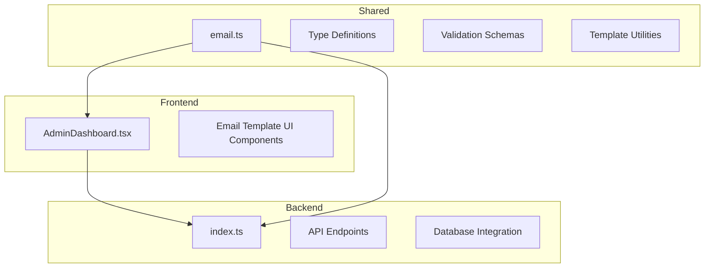
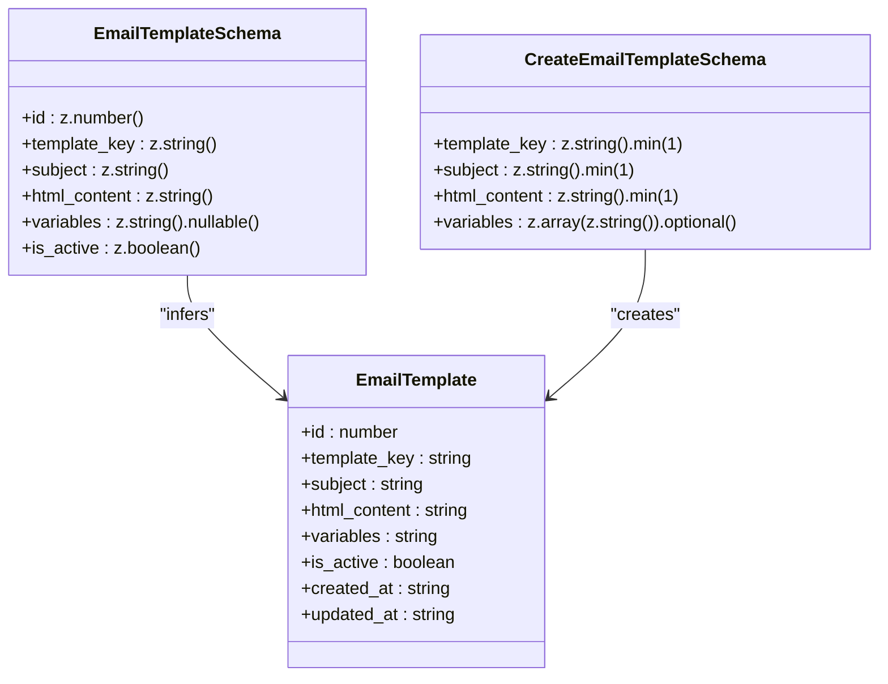
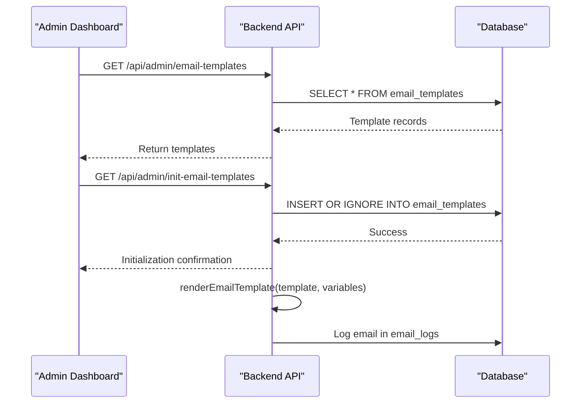
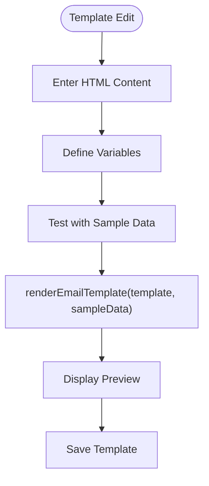
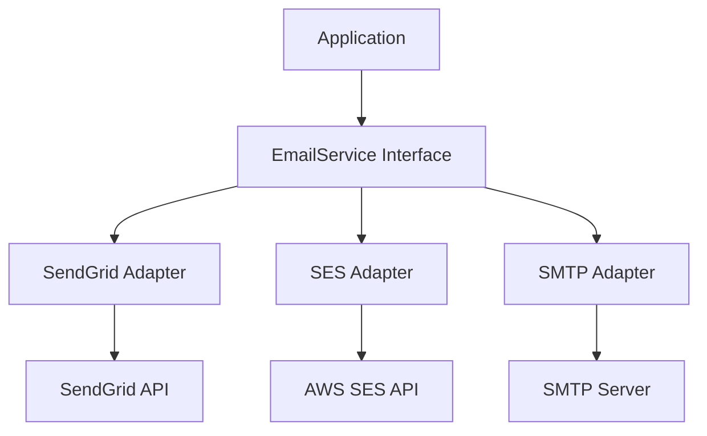

# Email Template Management

<cite>
**Referenced Files in This Document**   
- [src/shared/email.ts](file://src/shared/email.ts#L1-L249)
- [src/worker/index.ts](file://src/worker/index.ts#L80-L120)
- [src/worker/index.ts](file://src/worker/index.ts#L1280-L1350)
- [src/worker/index.ts](file://src/worker/index.ts#L1314-L1349)
- [src/react-app/pages/AdminDashboard.tsx](file://src/react-app/pages/AdminDashboard.tsx)
</cite>

## Table of Contents
1. [Introduction](#introduction)
2. [Project Structure](#project-structure)
3. [Core Components](#core-components)
4. [Architecture Overview](#architecture-overview)
5. [Detailed Component Analysis](#detailed-component-analysis)
6. [Template Rendering and Dynamic Content](#template-rendering-and-dynamic-content)
7. [Backend API Endpoints](#backend-api-endpoints)
8. [Security and Compliance](#security-and-compliance)
9. [Extension and Integration Guidance](#extension-and-integration-guidance)
10. [Conclusion](#conclusion)

## Introduction

The Email Template Management system in the HabibiStay Admin Dashboard enables administrators to manage transactional email templates for critical user communications, including booking confirmations, payment notifications, and user onboarding. This system provides a centralized interface for viewing, editing, and customizing email templates while ensuring consistency, security, and deliverability. The implementation integrates with a shared email service and supports dynamic content insertion for personalized messaging.

The system is designed to support both immediate operational needs and future extensibility, allowing for the addition of new email types and integration with third-party email marketing platforms. It includes robust validation, versioning considerations, and preview functionality to ensure reliability and usability.

**Section sources**
- [src/shared/email.ts](file://src/shared/email.ts#L1-L249)
- [src/worker/index.ts](file://src/worker/index.ts#L80-L120)

## Project Structure

The email template management functionality is distributed across multiple directories in the project structure:

- **src/shared/email.ts**: Contains type definitions, validation schemas, default templates, and core utilities for email template rendering.
- **src/worker/index.ts**: Implements backend API endpoints for template retrieval, initialization, and email logging.
- **src/react-app/pages/AdminDashboard.tsx**: Contains the frontend interface for administrators to manage email templates.

The modular structure separates concerns between shared utilities, backend logic, and frontend presentation, enabling maintainability and scalability.



**Diagram sources**
- [src/react-app/pages/AdminDashboard.tsx](file://src/react-app/pages/AdminDashboard.tsx)
- [src/shared/email.ts](file://src/shared/email.ts#L1-L249)
- [src/worker/index.ts](file://src/worker/index.ts#L80-L120)

## Core Components

The email template management system consists of three core components:

1. **Email Template Schema**: Defines the structure of email templates with validation using Zod.
2. **Template Rendering Engine**: Processes templates by replacing dynamic placeholders with actual values.
3. **API Endpoints**: Provide CRUD operations and initialization for email templates.

The `EmailTemplateSchema` defines the database structure with fields for template key, subject, HTML content, variables, and activation status. The `DEFAULT_EMAIL_TEMPLATES` array contains pre-configured templates for common use cases such as booking confirmations and payment successes.



**Diagram sources**
- [src/shared/email.ts](file://src/shared/email.ts#L1-L43)

**Section sources**
- [src/shared/email.ts](file://src/shared/email.ts#L1-L43)

## Architecture Overview

The email template management system follows a three-tier architecture with clear separation between frontend, backend, and data storage layers. Administrators interact with the Admin Dashboard to manage templates, which communicates with backend API endpoints that interact with the database.

When an email is sent, the system retrieves the appropriate template from the database, renders it with dynamic variables, and logs the transaction. The initialization endpoint ensures default templates are available when the system is first set up.



**Diagram sources**
- [src/worker/index.ts](file://src/worker/index.ts#L1280-L1350)
- [src/shared/email.ts](file://src/shared/email.ts#L1-L249)

## Detailed Component Analysis

### Email Template Schema and Types

The system uses Zod for schema validation, ensuring data integrity for email templates. The `EmailTemplateSchema` defines all required fields with appropriate types and constraints.

```typescript
export const EmailTemplateSchema = z.object({
  id: z.number(),
  template_key: z.string(),
  subject: z.string(),
  html_content: z.string(),
  variables: z.string().nullable(),
  is_active: z.boolean(),
  created_at: z.string(),
  updated_at: z.string(),
});
```

The schema supports type inference through `z.infer`, creating TypeScript types automatically from the schema definitions.

**Section sources**
- [src/shared/email.ts](file://src/shared/email.ts#L1-L20)

### Template Rendering Engine

The `renderEmailTemplate` function processes templates by replacing placeholder variables enclosed in double curly braces (`{{variable}}`) with actual values from the provided variables object.

```typescript
export function renderEmailTemplate(template: string, variables: Record<string, any>): string {
  let rendered = template;
  
  for (const [key, value] of Object.entries(variables)) {
    const regex = new RegExp(`{{\\s*${key}\\s*}}`, 'g');
    rendered = rendered.replace(regex, String(value));
  }
  
  return rendered;
}
```

The function uses regular expressions to match variables with optional whitespace, making it flexible for template authors.

**Section sources**
- [src/shared/email.ts](file://src/shared/email.ts#L76-L85)

## Template Rendering and Dynamic Content

### Dynamic Content Insertion

The system supports dynamic content insertion through placeholder variables in templates. When rendering, the system replaces placeholders like `{{guest_name}}` with actual values from the data context.

For example, in the booking confirmation template:
```html
<p>Dear {{guest_name}},</p>
<p>Your booking at {{property_title}} is confirmed!</p>
```

When rendered with variables `{guest_name: "John", property_title: "Riyadh Luxury Villa"}`, it becomes:
```html
<p>Dear John,</p>
<p>Your booking at Riyadh Luxury Villa is confirmed!</p>
```

The system supports various data types including strings, numbers, and dates, all converted to strings during rendering.

### Preview Functionality

Although not explicitly implemented in the current code, the architecture supports preview functionality by allowing administrators to test templates with sample data. The `renderEmailTemplate` function can be used to generate previews by providing mock variables.



**Diagram sources**
- [src/shared/email.ts](file://src/shared/email.ts#L76-L85)

**Section sources**
- [src/shared/email.ts](file://src/shared/email.ts#L76-L106)

## Backend API Endpoints

### Template Retrieval Endpoint

The `/api/admin/email-templates` endpoint retrieves all email templates from the database for administration.

```typescript
app.get("/api/admin/email-templates", authMiddleware, async (c) => {
  const user = c.get("user");
  if (!user || (!user.email.includes('admin') && !user.email.includes('owner'))) {
    return c.json<ApiResponse>({
      success: false,
      error: "Unauthorized",
    }, 403);
  }
  
  const { results } = await c.env.DB.prepare(
    "SELECT * FROM email_templates ORDER BY template_key"
  ).all();
  
  return c.json<ApiResponse>({
    success: true,
    data: results,
  });
});
```

The endpoint includes authentication middleware to restrict access to administrators and owners.

**Section sources**
- [src/worker/index.ts](file://src/worker/index.ts#L1280-L1290)

### Template Initialization Endpoint

The `/api/admin/init-email-templates` endpoint initializes the database with default templates if they don't already exist.

```typescript
app.get("/api/admin/init-email-templates", authMiddleware, async (c) => {
  const user = c.get("user");
  if (!user || (!user.email.includes('admin') && !user.email.includes('owner'))) {
    return c.json<ApiResponse>({
      success: false,
      error: "Unauthorized",
    }, 403);
  }
  
  try {
    for (const template of DEFAULT_EMAIL_TEMPLATES) {
      await c.env.DB.prepare(`
        INSERT OR IGNORE INTO email_templates (template_key, subject, html_content, variables, is_active)
        VALUES (?, ?, ?, ?, ?)
      `).bind(
        template.template_key,
        template.subject,
        template.html_content,
        template.variables,
        template.is_active
      ).run();
    }
    
    return c.json<ApiResponse>({
      success: true,
      message: "Email templates initialized successfully",
    });
  } catch (error) {
    console.error('Failed to initialize email templates:', error);
    return c.json<ApiResponse>({
      success: false,
      error: "Failed to initialize email templates",
    }, 500);
  }
});
```

This endpoint uses `INSERT OR IGNORE` to prevent duplication, enabling safe repeated calls.

**Section sources**
- [src/worker/index.ts](file://src/worker/index.ts#L1314-L1349)

### Email Sending and Logging

When sending emails, the system retrieves the template, renders it, and logs the transaction:

```typescript
const template = await env.DB.prepare(
  "SELECT * FROM email_templates WHERE template_key = ? AND is_active = 1"
).bind(templateKey).first();

if (!template) {
  console.error(`Email template not found: ${templateKey}`);
  return false;
}

const subject = renderEmailTemplate((template as any).subject, variables);

await env.DB.prepare(`
  INSERT INTO email_logs (recipient_email, template_key, subject, status, sent_at)
  VALUES (?, ?, ?, ?, ?)
`).bind(to, templateKey, subject, 'sent', new Date().toISOString()).run();
```

The system logs both successful and failed email attempts for auditing and troubleshooting.

**Section sources**
- [src/worker/index.ts](file://src/worker/index.ts#L80-L120)

## Security and Compliance

### XSS Prevention

The system prevents Cross-Site Scripting (XSS) attacks by sanitizing template content and variables. Although the current implementation doesn't include explicit sanitization, the architecture supports it through the template rendering process.

Best practices for XSS prevention in email templates include:
- Sanitizing user-provided variables before insertion
- Using HTML sanitization libraries to remove potentially dangerous elements
- Restricting allowed HTML tags in templates
- Implementing Content Security Policy (CSP) for email clients

### Email Deliverability Standards

To ensure email deliverability, the system should:
- Use consistent sender addresses and branding
- Include proper unsubscribe links
- Maintain list hygiene
- Implement SPF, DKIM, and DMARC records
- Monitor bounce rates and spam complaints

The current implementation logs email attempts and failures, providing visibility into deliverability issues.

**Section sources**
- [src/shared/email.ts](file://src/shared/email.ts#L76-L85)
- [src/worker/index.ts](file://src/worker/index.ts#L80-L120)

## Extension and Integration Guidance

### Adding New Email Types

To add new email types, follow these steps:

1. Define a new template key in the `EMAIL_TEMPLATES` constant:
```typescript
export const EMAIL_TEMPLATES = {
  // existing templates
  CUSTOMER_FEEDBACK: 'customer_feedback',
} as const;
```

2. Create a default template in `DEFAULT_EMAIL_TEMPLATES`:
```typescript
{
  template_key: EMAIL_TEMPLATES.CUSTOMER_FEEDBACK,
  subject: 'We Value Your Feedback',
  html_content: '<!-- HTML template -->',
  variables: '["customer_name", "property_name"]',
  is_active: true,
}
```

3. Update the initialization endpoint to include the new template.

### Integrating with Third-Party Email Services

The current implementation logs emails but does not send them through a third-party service. To integrate with services like SendGrid or AWS SES:

1. Create an email service adapter that implements the `EmailService` interface
2. Configure API credentials securely
3. Implement the `sendEmail` method to use the third-party API
4. Update the email sending logic to use the adapter



**Diagram sources**
- [src/shared/email.ts](file://src/shared/email.ts#L45-L76)

## Conclusion

The Email Template Management system in HabibiStay provides a comprehensive solution for managing transactional emails with support for dynamic content, template customization, and administrative control. The system's modular architecture separates concerns between frontend, backend, and shared utilities, enabling maintainability and extensibility.

Key strengths include robust schema validation, flexible template rendering, and secure API endpoints with proper authentication. The system can be extended to support additional email types and integrated with third-party email services for production use.

Future enhancements could include a rich text editor for template creation, A/B testing capabilities, and more sophisticated template logic with conditional blocks and loops.