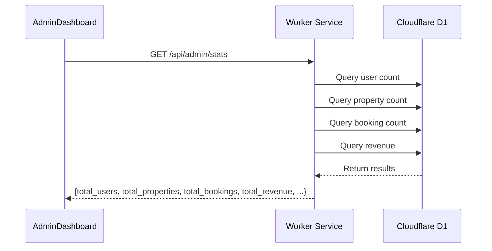
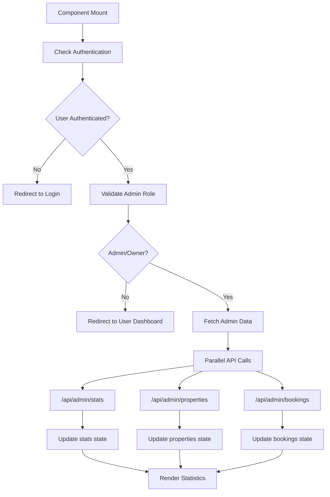
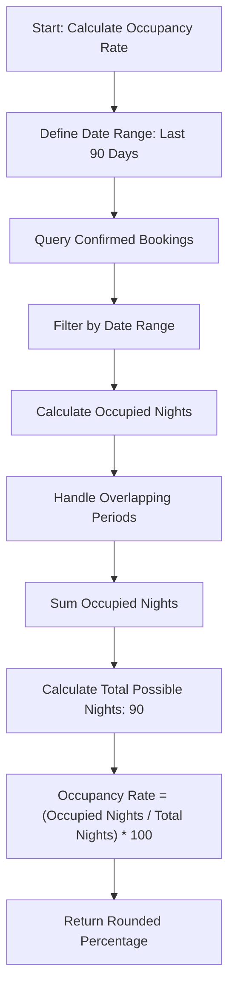

# Platform Statistics

<cite>
**Referenced Files in This Document**   
- [AdminDashboard.tsx](file://src/react-app/pages/AdminDashboard.tsx#L0-L579)
- [index.ts](file://src/worker/index.ts#L845-L1044)
- [BookingService.ts](file://src/server/services/BookingService.ts#L724-L786)
</cite>

## Table of Contents
1. [Platform Statistics](#platform-statistics)
2. [Data Aggregation and Backend Implementation](#data-aggregation-and-backend-implementation)
3. [Frontend Visualization Components](#frontend-visualization-components)
4. [Key Metric Calculations](#key-metric-calculations)
5. [Caching and Performance Optimization](#caching-and-performance-optimization)
6. [Data Accuracy and Edge Cases](#data-accuracy-and-edge-cases)
7. [Extensibility and Integration](#extensibility-and-integration)

## Platform Statistics

The Platform Statistics section of the Admin Dashboard provides administrators with a comprehensive overview of key performance indicators (KPIs) for the HabibiStay platform. This includes metrics such as total bookings, revenue generation, property occupancy rates, user growth, and monthly trends. The dashboard is designed to help administrators monitor platform health, identify trends, and make data-driven decisions.

The statistics are displayed through a series of visual components including counters, charts, and tables, organized across multiple tabs: Overview, Properties, Bookings, Users, AI Configuration, and Settings. The Overview tab presents the most critical metrics in a grid layout with visual indicators for performance trends.

**Section sources**
- [AdminDashboard.tsx](file://src/react-app/pages/AdminDashboard.tsx#L0-L579)

## Data Aggregation and Backend Implementation

The platform statistics are aggregated from the database through backend API endpoints implemented in the worker service. The primary endpoint for statistics is `GET /api/admin/stats`, which returns a JSON response containing multiple key metrics.

**Diagram sources**
- [index.ts](file://src/worker/index.ts#L845-L900)

The backend implementation uses Cloudflare Workers with D1 database to execute SQL queries that aggregate data from multiple tables. The endpoint is protected by authentication and role-based access control, ensuring only admin and owner users can access the data.

The key database queries used to calculate statistics are:

- **Total Users**: Counts distinct user IDs from both properties and bookings tables
- **Total Properties**: Counts all properties in the system
- **Active Properties**: Counts properties where `is_active = 1`
- **Total Bookings**: Counts all bookings regardless of status
- **Pending Bookings**: Counts bookings with status 'pending'
- **Total Revenue**: Sums the `total_amount` from completed bookings

**Section sources**
- [index.ts](file://src/worker/index.ts#L845-L900)

## Frontend Visualization Components

The frontend implementation of the Platform Statistics uses React components to display the aggregated data in a user-friendly format. The AdminDashboard component fetches data using the `fetchAdminData` function and stores it in React state.

**Diagram sources**
- [AdminDashboard.tsx](file://src/react-app/pages/AdminDashboard.tsx#L49-L85)

The visualization components include:

- **Stat Cards**: Display individual metrics with icons, values, and trend indicators
- **Data Tables**: Present detailed information about properties and bookings
- **Tab Navigation**: Organize content into logical sections
- **Loading States**: Show skeleton screens while data is being fetched

The stat cards use a consistent design pattern with the metric title, value, and a change indicator that shows performance relative to the previous period. The color coding (green for positive, yellow for neutral, red for negative) provides immediate visual feedback on performance trends.

**Section sources**
- [AdminDashboard.tsx](file://src/react-app/pages/AdminDashboard.tsx#L0-L579)

## Key Metric Calculations

### Occupancy Rate Calculation

The occupancy rate is calculated using a sophisticated algorithm that determines the percentage of available nights that are booked. While the current implementation in the admin stats endpoint uses mock data (85%), the actual calculation logic exists in the BookingService.

**Diagram sources**
- [BookingService.ts](file://src/server/services/BookingService.ts#L724-L786)

The actual implementation in `BookingService.calculateOccupancyRate()` uses a SQL query with a CASE statement to accurately calculate occupied nights, accounting for bookings that partially overlap with the analysis period. The function joins the bookings and properties tables and can filter by specific property or owner.

### Monthly Growth Calculation

The monthly growth metric displayed in the admin dashboard is currently implemented as mock data (12%) in the backend. However, the FinancialReporting component demonstrates the intended implementation pattern for growth calculations.

The growth calculation follows this formula:
- **Growth Rate** = ((Current Period Value - Previous Period Value) / Previous Period Value) * 100
- The result is formatted with a positive/negative indicator and rounded to one decimal place

The FinancialReporting component includes proper growth visualization with color-coded indicators (green for positive, red for negative) and directional icons, suggesting this is the intended pattern for all growth metrics in the platform.

**Section sources**
- [index.ts](file://src/worker/index.ts#L845-L900)
- [BookingService.ts](file://src/server/services/BookingService.ts#L724-L786)
- [FinancialReporting.tsx](file://src/react-app/components/admin/FinancialReporting.tsx#L189-L223)

## Caching and Performance Optimization

The platform implements several performance optimization strategies to ensure the statistics dashboard loads quickly and efficiently:

1. **Parallel API Requests**: The dashboard fetches stats, properties, and bookings data simultaneously using `Promise.all()`, reducing total load time.

2. **Rate Limiting**: The admin API endpoints include rate limiting middleware (`rateLimitMiddleware(100, 60 * 1000)`) to prevent abuse and ensure system stability.

3. **Loading States**: The UI displays a skeleton screen with animated placeholders while data is being fetched, providing immediate feedback to users.

4. **Efficient Database Queries**: The backend uses optimized SQL queries with appropriate indexing to minimize database load.

The current implementation does not include explicit caching mechanisms, but the architecture is conducive to adding caching layers. Potential caching strategies could include:

- **Redis Caching**: Store frequently accessed statistics with a TTL of 5-15 minutes
- **CDN Caching**: Cache static assets and potentially some API responses at the edge
- **Client-Side Caching**: Implement localStorage or IndexedDB caching for offline access

**Section sources**
- [AdminDashboard.tsx](file://src/react-app/pages/AdminDashboard.tsx#L49-L85)
- [index.ts](file://src/worker/index.ts#L845-L900)

## Data Accuracy and Edge Cases

The current implementation has several considerations regarding data accuracy and edge cases:

### Data Accuracy Issues
- **Occupancy Rate**: Currently uses mock data (85%) rather than actual calculations
- **Monthly Growth**: Uses mock data (12%) instead of actual period-over-period calculations
- **User Count**: Counts distinct user IDs from properties and bookings, but may double-count users who are both property owners and guests

### Edge Cases in Metric Calculation
- **Time Zone Handling**: Date calculations should account for the platform's time zone (likely Arabia/Riyadh)
- **Currency Conversion**: Revenue is displayed in SAR, but international payments may require conversion
- **Deleted Records**: The system should handle soft-deleted properties and bookings appropriately
- **Data Consistency**: Concurrent updates to booking status and property availability need transactional integrity

### Recommended Improvements
1. **Implement Real Occupancy Calculation**: Replace the mock occupancy rate with the actual implementation from BookingService
2. **Add Time Range Filtering**: Allow administrators to view statistics for custom date ranges
3. **Implement Data Validation**: Add server-side validation to ensure data integrity
4. **Add Error Handling**: Implement proper error handling for database query failures
5. **Include Data Freshness Indicators**: Show when statistics were last updated

**Section sources**
- [index.ts](file://src/worker/index.ts#L845-L900)
- [BookingService.ts](file://src/server/services/BookingService.ts#L724-L786)
- [AdminDashboard.tsx](file://src/react-app/pages/AdminDashboard.tsx#L0-L579)

## Extensibility and Integration

The Platform Statistics module can be extended in several ways to provide additional insights and functionality:

### Custom KPIs
New key performance indicators can be added by:
1. Extending the `AdminStats` interface in the frontend
2. Modifying the SQL queries in the `/api/admin/stats` endpoint
3. Updating the response schema to include new metrics

Example custom KPIs could include:
- Average booking value
- Customer acquisition cost
- Marketing channel performance
- Property turnover rate
- Guest satisfaction scores

### Third-Party Analytics Integration
The platform can be integrated with external analytics services such as:
- **Google Analytics**: Track user behavior and conversion funnels
- **Mixpanel**: Implement event tracking and user segmentation
- **Amplitude**: Analyze product usage patterns
- **Tableau/Power BI**: Create advanced data visualizations

Integration would involve:
1. Creating webhook endpoints to forward data to external services
2. Implementing API clients for analytics platforms
3. Adding configuration options in the Settings tab
4. Ensuring compliance with data privacy regulations

### Real-Time Updates
The current implementation uses a simple refresh on component mount. For real-time updates, the system could implement:
- **WebSocket connections**: Push updates to the dashboard when metrics change
- **Polling mechanism**: Regularly fetch updated statistics (e.g., every 30 seconds)
- **Server-Sent Events**: Stream updates from the server to connected clients

The SecurityAuditDashboard component already implements auto-refresh with `setInterval(loadSecurityData, 30000)`, providing a pattern that could be reused for the main statistics dashboard.

**Section sources**
- [AdminDashboard.tsx](file://src/react-app/pages/AdminDashboard.tsx#L0-L579)
- [index.ts](file://src/worker/index.ts#L845-L900)
- [SecurityAuditDashboard.tsx](file://src/react-app/components/admin/SecurityAuditDashboard.tsx#L68-L109)