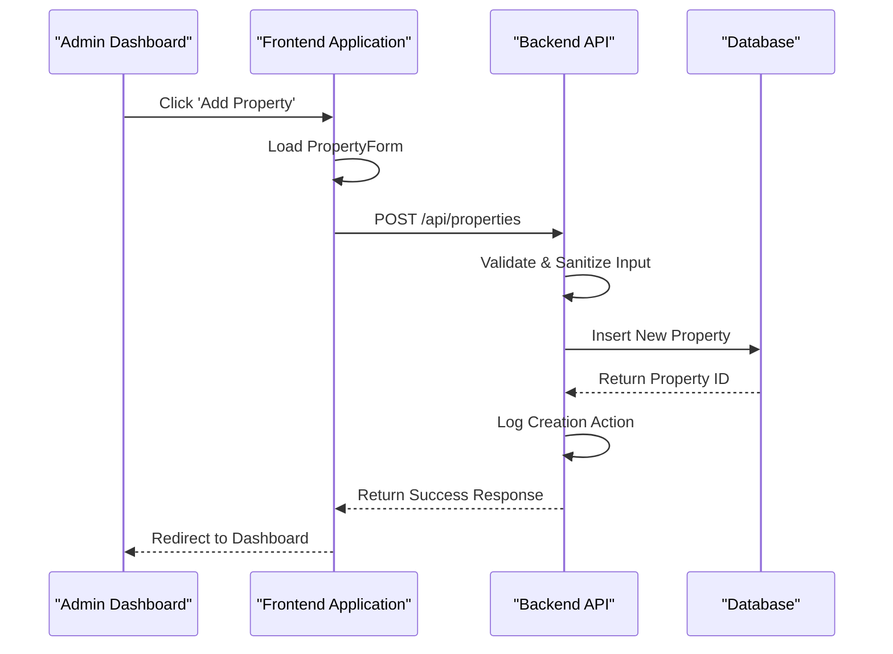
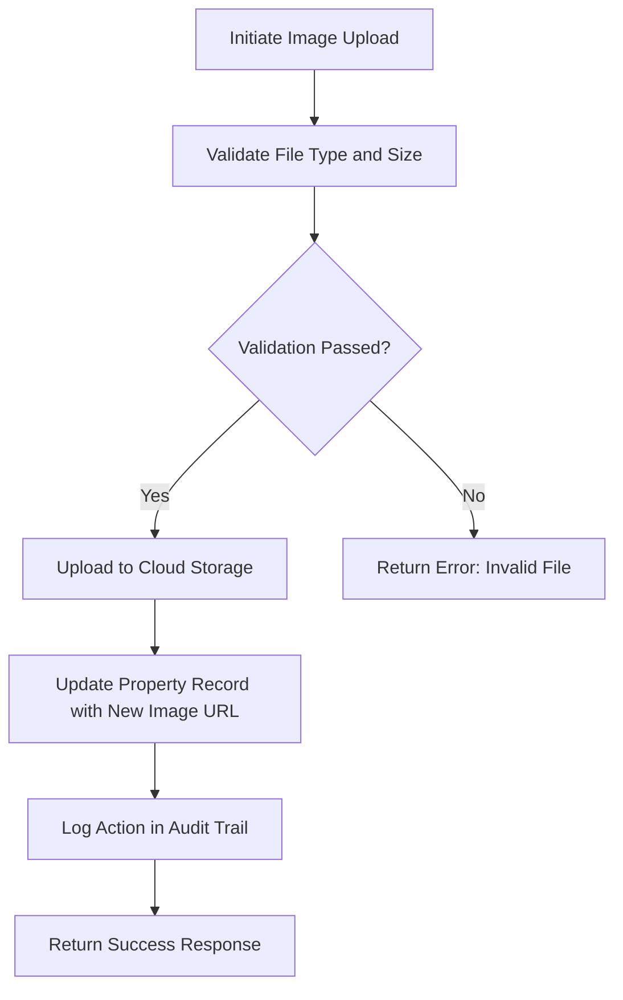
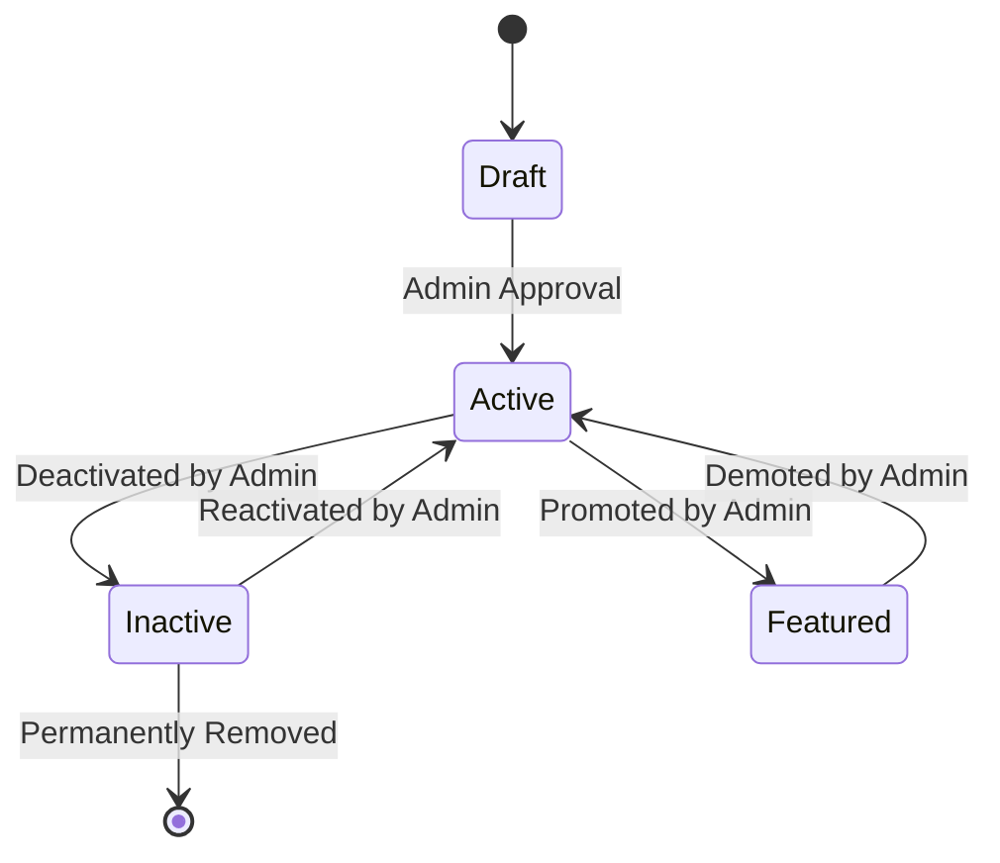
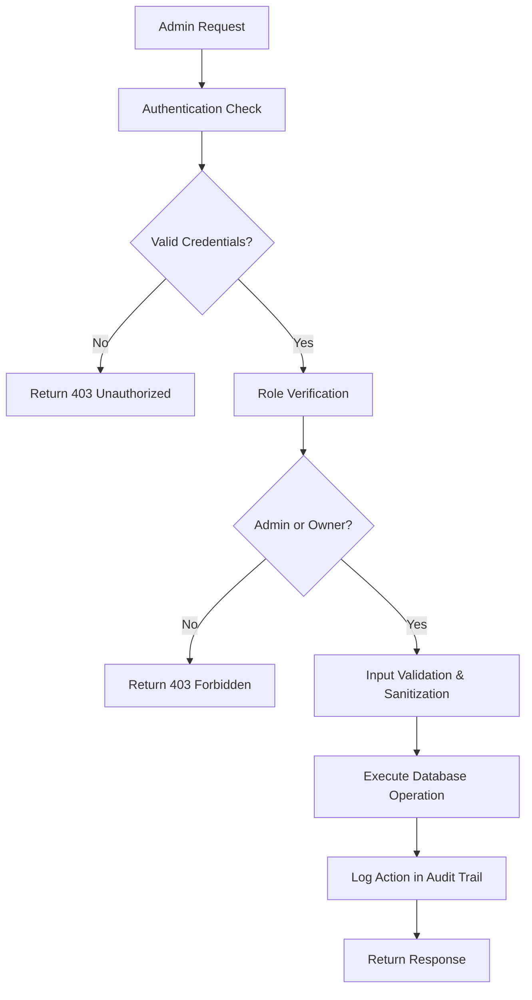

# Property Management Tools

<cite>
**Referenced Files in This Document**   
- [AdminDashboard.tsx](file://src/react-app/pages/AdminDashboard.tsx#L1-L579)
- [PropertyService.ts](file://src/server/services/PropertyService.ts#L1-L606)
- [index.ts](file://src/worker/index.ts#L879-L963)
- [types.ts](file://src/shared/types.ts#L1-L199)
</cite>

## Table of Contents
1. [Introduction](#introduction)
2. [UI Components for Property Management](#ui-components-for-property-management)
3. [Backend API Integration for CRUD Operations](#backend-api-integration-for-crud-operations)
4. [Moderation Workflow and Status Transitions](#moderation-workflow-and-status-transitions)
5. [Bulk Actions, Search, and Filtering](#bulk-actions-search-and-filtering)
6. [Database State and Audit Trails](#database-state-and-audit-trails)
7. [Security Considerations](#security-considerations)
8. [Extension Guidance](#extension-guidance)

## Introduction
The Property Management Tools in the Admin Dashboard provide administrators with comprehensive control over property listings within the HabibiStay platform. These tools enable admins to view, edit, approve, reject, or delete property listings through a user-friendly interface integrated with robust backend services. The system supports full CRUD (Create, Read, Update, Delete) operations on properties, includes validation rules, image handling, and a structured moderation workflow for new submissions. This document details the implementation of these features, covering UI components, API integrations, security mechanisms, and extensibility options.

## UI Components for Property Management

The Admin Dashboard provides a tab-based interface where administrators can manage various aspects of the platform, with dedicated sections for properties, bookings, users, AI configuration, and settings. The property management UI is accessible via the "Properties" tab and displays all listings in a table format with key information and action controls.

### Properties Table Interface
The properties table presents each listing with its title, owner ID, location, nightly price, status indicators, and action buttons. Each row includes:
- **Property Information**: Displayed with a thumbnail image, title, and guest capacity
- **Status Indicators**: Visual badges showing whether the property is "Active" or "Inactive", with an additional "Featured" badge if applicable
- **Action Buttons**: Two icons per listing:
  - **Eye Icon**: Links to the public property detail page for preview
  - **Settings Icon**: Toggles the active status of the property (active ↔ inactive)

### Add New Property Button
A prominent "Add Property" button allows admins to create new listings by navigating to the property creation form at `/properties/new`. This initiates the property creation flow handled by the frontend routing system.

**Section sources**
- [AdminDashboard.tsx](file://src/react-app/pages/AdminDashboard.tsx#L300-L398)

## Backend API Integration for CRUD Operations

The property management system integrates with backend APIs to perform CRUD operations securely and efficiently. These endpoints are protected by authentication and role-based access control.

### API Endpoints for Property Management
The following RESTful endpoints handle property operations:

| Endpoint | Method | Description |
|--------|--------|-------------|
| `/api/admin/properties` | GET | Retrieves all property listings |
| `/api/admin/properties/:propertyId/status` | PUT | Updates the status (active/inactive, featured) of a specific property |

### Property Creation and Update Flow
While the Admin Dashboard focuses on status management, property creation and editing are handled through a separate form interface. The backend service supports full CRUD operations:



**Diagram sources**
- [PropertyService.ts](file://src/server/services/PropertyService.ts#L34-L85)
- [types.ts](file://src/shared/types.ts#L1-L50)

### Validation Rules
The system enforces strict validation rules for property data to ensure data integrity:

**Property Validation Rules**
- **Title**: Minimum 5 characters
- **Description**: Minimum 20 characters
- **Location**: Required, minimum 3 characters
- **Property Type**: Required field
- **Max Guests**: Between 1 and 20
- **Price per Night**: Between 10 and 10,000 SAR

These rules are enforced in the `PropertyService.validatePropertyData` method before any database operation.

### Image Handling
The system supports image uploads for property listings with the following specifications:
- **File Size Limit**: 10MB per image
- **Allowed Formats**: JPEG, PNG, WebP
- **Storage**: Images are uploaded to cloud storage with URLs stored in the database as a JSON array
- **Operations**: Admins can upload new images or remove existing ones through dedicated service methods



**Diagram sources**
- [PropertyService.ts](file://src/server/services/PropertyService.ts#L446-L520)

**Section sources**
- [PropertyService.ts](file://src/server/services/PropertyService.ts#L520-L564)

## Moderation Workflow and Status Transitions

The system implements a moderation workflow for property listings with clear status transitions that control visibility and availability.

### Status Model
Properties have two primary status flags:
- **is_active**: Determines whether the property is visible and bookable
- **is_featured**: Indicates if the property should be highlighted in search results and featured sections

### Status Transition Workflow
The Admin Dashboard allows toggling the `is_active` status through the settings icon in the properties table. This triggers a PUT request to `/api/admin/properties/:propertyId/status` with the new status value.

When a property is created by an owner, it is automatically set to active (`is_active = true`) but not featured (`is_featured = false`). Admins can later feature properties they want to promote.

The status update process includes:
1. Authentication and authorization check
2. Database update of the status field
3. Client-side state update to reflect the change immediately
4. Audit log entry recording the action



**Diagram sources**
- [index.ts](file://src/worker/index.ts#L945-L963)
- [PropertyService.ts](file://src/server/services/PropertyService.ts#L300-L320)

**Section sources**
- [AdminDashboard.tsx](file://src/react-app/pages/AdminDashboard.tsx#L150-L170)

## Bulk Actions, Search, and Filtering

While the current implementation focuses on individual property management, the underlying service supports search and filtering capabilities that could be extended for bulk actions.

### Search and Filter Capabilities
The `PropertyService.searchProperties` method supports filtering by:
- **Location**: Text search in location, city, or country fields
- **Property Type**: Exact match filtering
- **Guest Capacity**: Minimum number of guests supported
- **Price Range**: Minimum and maximum price per night
- **Amenities**: Properties containing all specified amenities
- **Availability**: Date range-based availability checking
- **Owner**: Filter by specific owner ID

### Potential Bulk Actions
Although not currently implemented in the UI, the architecture supports potential bulk actions such as:
- Activate/deactivate multiple properties
- Feature multiple properties simultaneously
- Apply category changes to groups of properties
- Update pricing rules across multiple listings

These could be implemented by extending the current API to accept arrays of property IDs and applying the same validation and update logic in batch operations.

**Section sources**
- [PropertyService.ts](file://src/server/services/PropertyService.ts#L180-L280)

## Database State and Audit Trails

The system maintains a clear relationship between admin actions and database state, with comprehensive logging for accountability and debugging.

### Database Schema
The `properties` table contains all property data with fields for:
- Basic information (title, description, location)
- Capacity and pricing (max_guests, price_per_night)
- Amenities and images (stored as JSON strings)
- Status flags (is_active, is_featured)
- Timestamps (created_at, updated_at)

### Audit Trail Implementation
Every property-related action is logged in the `audit_logs` table through the `logPropertyAction` method. Logged actions include:
- Property creation
- Property updates
- Status changes
- Image uploads and removals
- Deletions

Each log entry captures:
- **User ID**: Who performed the action
- **Action Type**: What operation was performed
- **Details**: JSON payload with relevant data (property ID, changes made)
- **Timestamp**: When the action occurred

```mermaid
erDiagram
PROPERTY {
number id PK
string title
string description
string location
number price_per_night
number max_guests
string amenities JSON
string images JSON
boolean is_featured
boolean is_active
timestamp created_at
timestamp updated_at
}
AUDIT_LOG {
number id PK
string user_id FK
string action
string details JSON
timestamp timestamp
}
USER {
string id PK
string email
string role
}
PROPERTY ||--o{ AUDIT_LOG : "property_actions"
USER ||--o{ AUDIT_LOG : "user_actions"
USER ||--o{ PROPERTY : "owns"
```

**Diagram sources**
- [PropertyService.ts](file://src/server/services/PropertyService.ts#L580-L605)
- [index.ts](file://src/worker/index.ts#L945-L963)

**Section sources**
- [PropertyService.ts](file://src/server/services/PropertyService.ts#L565-L580)

## Security Considerations

The property management system implements multiple security layers to protect against unauthorized access and data manipulation.

### Role-Based Access Control
Access to property management features is restricted based on user roles:
- **Admin Check**: The system verifies if the user's email contains 'admin' or 'owner'
- **Ownership Validation**: Users can only modify properties they own unless they have admin privileges
- **Endpoint Protection**: All admin endpoints use `authMiddleware` and `requireRole(['admin'])` guards

### Input Sanitization
The system sanitizes user input to prevent XSS attacks:
- **HTML Sanitization**: The `sanitizeHtml` function is applied to title, description, and house rules fields
- **JSON Storage**: Amenities and images are stored as JSON strings to prevent direct script injection

### Data Validation
Beyond basic validation, the system includes:
- **File Validation**: Image uploads are checked for type and size before processing
- **SQL Injection Prevention**: Query parameters are bound using prepared statements
- **Rate Limiting**: Admin endpoints are protected by rate limiting middleware (100 requests per 10 minutes)



**Diagram sources**
- [index.ts](file://src/worker/index.ts#L879-L921)
- [PropertyService.ts](file://src/server/services/PropertyService.ts#L520-L564)

**Section sources**
- [index.ts](file://src/worker/index.ts#L879-L921)
- [PropertyService.ts](file://src/server/services/PropertyService.ts#L520-L564)

## Extension Guidance

The property management system is designed to be extensible, allowing for custom fields and automation features.

### Adding Custom Property Fields
To add custom property fields:
1. **Update Database Schema**: Add new columns to the `properties` table
2. **Extend Type Definitions**: Update the `Property`, `PropertyCreate`, and `PropertyUpdate` types in `shared/types.ts`
3. **Modify Validation**: Add validation rules in `PropertyService.validatePropertyData`
4. **Update UI Components**: Extend the PropertyForm to include new input fields
5. **Adjust Queries**: Update all relevant database queries to include the new fields

### Approval Automation
The current system requires manual status management, but could be extended with automated approval workflows:
- **AI-Based Review**: Integrate with the AI configuration panel to automatically flag suspicious listings
- **Rule-Based Approval**: Implement rules that automatically approve listings meeting certain criteria
- **Scheduled Publishing**: Allow owners to schedule property activation dates
- **Notification System**: Send email notifications when property status changes

### API Extension Example
To add a new endpoint for bulk property updates:

```typescript
app.put("/api/admin/properties/bulk-status", authMiddleware, async (c) => {
  const user = c.get("user");
  if (!user || (!user.email.includes('admin') && !user.email.includes('owner'))) {
    return c.json<ApiResponse>({ success: false, error: "Unauthorized" }, 403);
  }

  const { propertyIds, status } = await c.req.json();
  
  const placeholders = propertyIds.map(() => '?').join(',');
  const { success } = await c.env.DB.prepare(`
    UPDATE properties SET is_active = ?, updated_at = CURRENT_TIMESTAMP
    WHERE id IN (${placeholders})
  `).bind(status, ...propertyIds).run();

  return c.json<ApiResponse>({
    success,
    message: success ? `Updated ${propertyIds.length} properties` : "Failed to update properties",
  });
});
```

This extension would enable bulk operations while maintaining the same security and logging mechanisms as individual operations.

**Section sources**
- [PropertyService.ts](file://src/server/services/PropertyService.ts#L34-L606)
- [index.ts](file://src/worker/index.ts#L945-L963)