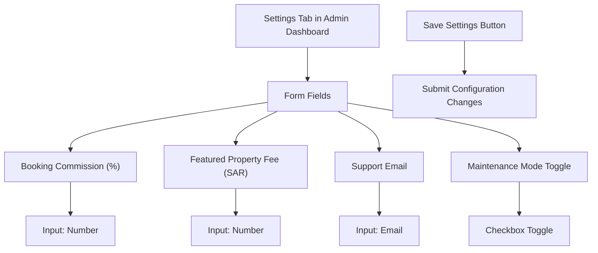
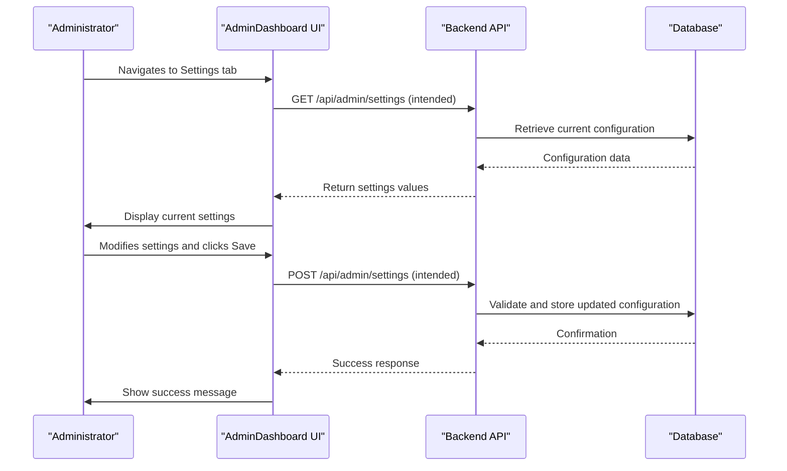
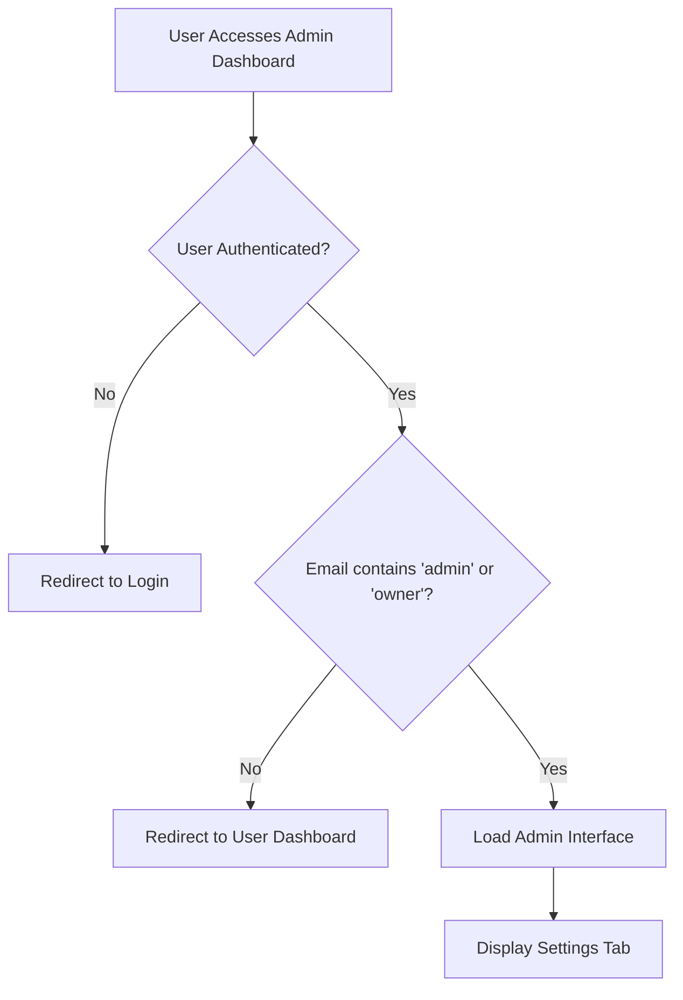
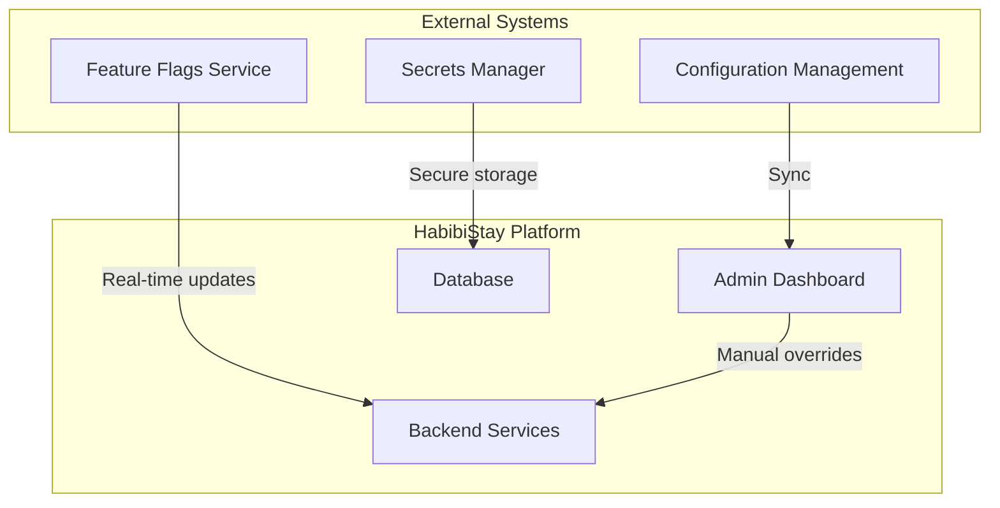

# Settings & Configuration

<cite>
**Referenced Files in This Document**   
- [AdminDashboard.tsx](file://src/react-app/pages/AdminDashboard.tsx#L400-L578)
- [PropertyService.ts](file://src/server/services/PropertyService.ts)
- [BookingService.ts](file://src/server/services/BookingService.ts)
- [PaymentService.ts](file://src/server/services/PaymentService.ts)
- [auth.ts](file://src/server/utils/auth.ts)
</cite>

## Table of Contents
1. [Introduction](#introduction)
2. [Settings UI Overview](#settings-ui-overview)
3. [Configuration Parameters](#configuration-parameters)
4. [Backend Integration and Persistence](#backend-integration-and-persistence)
5. [Security and Access Control](#security-and-access-control)
6. [Change Logging and Audit Trail](#change-logging-and-audit-trail)
7. [Extending the Settings Module](#extending-the-settings-module)
8. [Environment-Specific Configuration](#environment-specific-configuration)
9. [Best Practices and Recommendations](#best-practices-and-recommendations)

## Introduction
The Settings & Configuration module within the Admin Dashboard enables administrators to manage platform-wide operational parameters that govern booking policies, pricing rules, service fees, and system visibility. This document provides a comprehensive overview of the configuration system, detailing how settings are managed through the user interface, persisted in the backend, and enforced across services. The implementation supports both immediate UI updates and secure backend validation, ensuring consistency and reliability across the HabibiStay platform.

## Settings UI Overview
The Settings tab in the Admin Dashboard provides a centralized interface for modifying key platform parameters. Accessible only to authorized administrators, this section presents form-based controls for adjusting commission rates, service fees, contact information, and global system states such as maintenance mode.

**Diagram sources**
- [AdminDashboard.tsx](file://src/react-app/pages/AdminDashboard.tsx#L400-L578)

**Section sources**
- [AdminDashboard.tsx](file://src/react-app/pages/AdminDashboard.tsx#L400-L578)

## Configuration Parameters
The Settings module exposes several configurable parameters that directly impact platform behavior and revenue models:

### Booking Commission
- **Key**: `booking_commission_percent`
- **Type**: Number (percentage)
- **Default**: 10%
- **Purpose**: Determines the platform's cut from each booking transaction
- **Impact**: Affects payout calculations to property owners and overall revenue

### Featured Property Fee
- **Key**: `featured_property_fee_sar`
- **Type**: Number (SAR currency)
- **Default**: 500 SAR
- **Purpose**: Sets the cost for property owners to feature their listings
- **Impact**: Influences marketing revenue and property visibility dynamics

### Support Contact
- **Key**: `support_email`
- **Type**: Email address
- **Default**: support@habibistay.com
- **Purpose**: Designates the primary contact for user support inquiries
- **Impact**: Used in automated emails and displayed in customer-facing interfaces

### Maintenance Mode
- **Key**: `maintenance_mode_enabled`
- **Type**: Boolean
- **Default**: false
- **Purpose**: Enables temporary platform-wide downtime for updates or emergency fixes
- **Impact**: When enabled, restricts user access while allowing administrative operations

**Section sources**
- [AdminDashboard.tsx](file://src/react-app/pages/AdminDashboard.tsx#L400-L578)

## Backend Integration and Persistence
While the current implementation displays static default values in the settings form, the architecture is designed to support dynamic configuration persistence. The "Save Settings" button indicates an intended integration with backend services to store and retrieve configuration values.

**Diagram sources**
- [AdminDashboard.tsx](file://src/react-app/pages/AdminDashboard.tsx#L400-L578)
- [PropertyService.ts](file://src/server/services/PropertyService.ts)
- [BookingService.ts](file://src/server/services/BookingService.ts)

Although the current frontend implementation uses `defaultValue` attributes without active submission handlers, the presence of service modules in `/src/server/services/` suggests that API endpoints for configuration management are either planned or partially implemented. The existing services follow a pattern where business logic is encapsulated in dedicated service classes that interact with data storage layers.

**Section sources**
- [AdminDashboard.tsx](file://src/react-app/pages/AdminDashboard.tsx#L400-L578)
- [PropertyService.ts](file://src/server/services/PropertyService.ts)
- [BookingService.ts](file://src/server/services/BookingService.ts)
- [PaymentService.ts](file://src/server/services/PaymentService.ts)

## Security and Access Control
Access to the Settings module is protected through role-based authorization. The AdminDashboard component enforces access control by checking user credentials during initialization:

This simple authorization check, while functional for early-stage development, should be enhanced with proper role-based access control (RBAC) in production. The current implementation relies on email pattern matching rather than formal permission systems, which represents a security limitation.

**Diagram sources**
- [AdminDashboard.tsx](file://src/react-app/pages/AdminDashboard.tsx#L25-L50)
- [auth.ts](file://src/server/utils/auth.ts#L1-L20)

**Section sources**
- [AdminDashboard.tsx](file://src/react-app/pages/AdminDashboard.tsx#L25-L50)
- [auth.ts](file://src/server/utils/auth.ts)

## Change Logging and Audit Trail
Currently, the system does not implement explicit change logging for configuration updates. However, the architecture supports the addition of audit trails through the existing service layer. Future enhancements could include:

- **Configuration History**: Storing historical versions of settings with timestamps and editor information
- **Audit Logs**: Recording all configuration changes in a dedicated audit log table
- **Diff Tracking**: Providing visual comparison between current and previous configurations
- **Approval Workflows**: Requiring secondary approval for sensitive setting changes

These features would enhance accountability and provide recovery options in case of erroneous configuration updates.

## Extending the Settings Module
The Settings module can be extended to support additional configurable parameters and integration with external configuration management systems:

### Adding New Configuration Parameters
To add a new setting:
1. Update the frontend form with appropriate input controls
2. Extend the backend configuration schema
3. Implement validation rules
4. Update relevant business logic to consume the new setting

### External Configuration Integration
The system can be enhanced to integrate with external configuration management solutions:

This integration would enable advanced use cases such as:
- Environment-specific configurations
- A/B testing of platform parameters
- Gradual rollout of new features
- Centralized management of sensitive credentials

**Diagram sources**
- [AdminDashboard.tsx](file://src/react-app/pages/AdminDashboard.tsx)
- [PropertyService.ts](file://src/server/services/PropertyService.ts)

## Environment-Specific Configuration
The current implementation does not show explicit environment-specific configuration handling. However, best practices suggest implementing different configuration profiles for various deployment environments:

### Development Environment
- **Maintenance Mode**: Disabled
- **Commission Rate**: 0% (to encourage testing)
- **Support Email**: dev-support@habibistay.com
- **Logging**: Verbose

### Staging Environment
- **Maintenance Mode**: Optional
- **Commission Rate**: 5% (test rate)
- **Support Email**: staging-support@habibistay.com
- **Payment Processing**: Test mode

### Production Environment
- **Maintenance Mode**: Controlled access
- **Commission Rate**: 10% (business rate)
- **Support Email**: support@habibistay.com
- **Monitoring**: Full observability

These environment-specific settings ensure appropriate behavior across the deployment pipeline while maintaining data integrity and security.

## Best Practices and Recommendations
Based on the current implementation and industry standards, the following recommendations are provided:

### Immediate Improvements
- **Implement Form Submission**: Connect the "Save Settings" button to actual API endpoints
- **Add Input Validation**: Validate configuration values before submission
- **Implement Real-time Saving**: Provide feedback on save operations
- **Add Confirmation Dialogs**: Prevent accidental changes to critical settings

### Security Enhancements
- **Implement Proper RBAC**: Replace email-based checks with formal role management
- **Encrypt Sensitive Data**: Protect configuration values containing sensitive information
- **Add Two-factor Authentication**: Require additional verification for configuration changes
- **Implement IP-based Access Restrictions**: Limit configuration access to trusted networks

### Operational Improvements
- **Add Configuration Versioning**: Enable rollback to previous configurations
- **Implement Change Approval**: Require multiple administrators to approve critical changes
- **Add Configuration Export/Import**: Facilitate backup and migration of settings
- **Implement Health Checks**: Monitor configuration consistency across services

These recommendations would significantly enhance the reliability, security, and maintainability of the Settings & Configuration module.