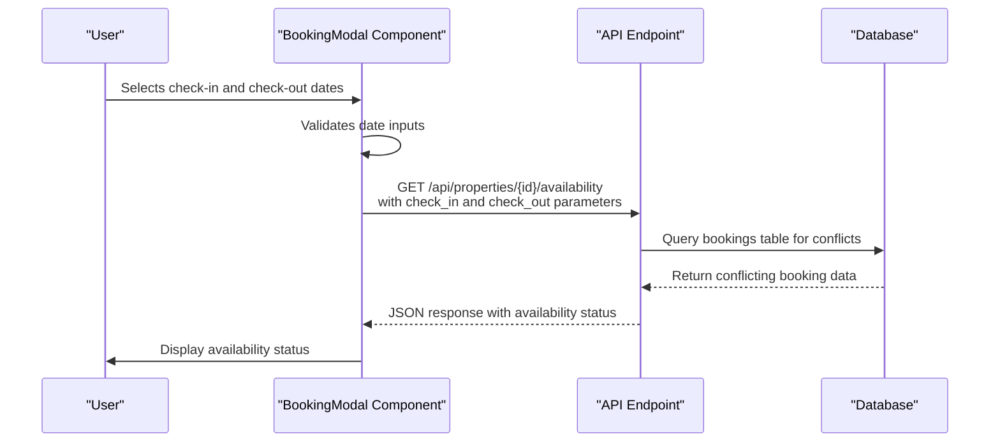
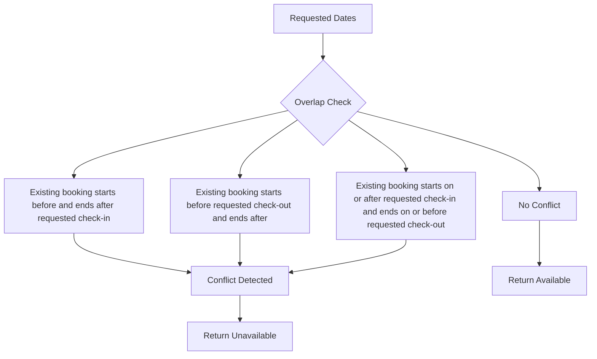

# Availability Checking

<cite>
**Referenced Files in This Document**   
- [BookingModal.tsx](file://src/react-app/components/BookingModal.tsx)
- [index.ts](file://src/worker/index.ts)
- [types.ts](file://src/shared/types.ts)
- [BookingService.ts](file://src/server/services/BookingService.ts)
- [performance-utils.ts](file://src/shared/performance-utils.ts)
- [9.sql](file://migrations/9.sql)
</cite>

## Table of Contents
1. [Introduction](#introduction)
2. [Frontend Implementation](#frontend-implementation)
3. [Backend API Endpoint](#backend-api-endpoint)
4. [Request Validation](#request-validation)
5. [Database Query Logic](#database-query-logic)
6. [Date Range Overlap Detection](#date-range-overlap-detection)
7. [Request and Response Examples](#request-and-response-examples)
8. [Error Handling](#error-handling)
9. [Performance Considerations](#performance-considerations)
10. [Caching Strategy](#caching-strategy)
11. [Troubleshooting Guide](#troubleshooting-guide)

## Introduction
The Availability Checking sub-feature of the HabibiStay Booking System enables users to verify if a property is available for their desired dates before proceeding with a booking. This functionality involves a coordinated interaction between the frontend and backend systems, where date range queries are sent from the client to the server to check for calendar conflicts. The system uses a combination of frontend validation, backend API processing, database queries, and caching mechanisms to provide accurate and efficient availability checks.

**Section sources**
- [BookingModal.tsx](file://src/react-app/components/BookingModal.tsx)
- [index.ts](file://src/worker/index.ts)

## Frontend Implementation

The BookingModal component in the React application serves as the user interface for initiating availability checks. When a user selects check-in and check-out dates, the component validates these inputs and prepares them for transmission to the backend.



**Diagram sources**
- [BookingModal.tsx](file://src/react-app/components/BookingModal.tsx)

**Section sources**
- [BookingModal.tsx](file://src/react-app/components/BookingModal.tsx)

## Backend API Endpoint

The availability checking functionality is handled by a specific route in the worker index file. This endpoint receives date range queries and returns whether a property is available for the specified dates.

```typescript
app.get("/api/properties/:id/availability", async (c) => {
  const propertyId = c.req.param("id");
  const checkIn = c.req.query("check_in");
  const checkOut = c.req.query("check_out");

  if (!checkIn || !checkOut) {
    return c.json<ApiResponse>({
      success: false,
      error: "Check-in and check-out dates are required",
    }, 400);
  }

  // Check for conflicting bookings
  const conflictingBooking = await c.env.DB.prepare(`
    SELECT id FROM bookings 
    WHERE property_id = ? 
    AND status NOT IN ('cancelled', 'rejected')
    AND (
      (check_in_date <= ? AND check_out_date > ?) OR
      (check_in_date < ? AND check_out_date >= ?) OR
      (check_in_date >= ? AND check_out_date <= ?)
    )
  `).bind(propertyId, checkIn, checkIn, checkOut, checkOut, checkIn, checkOut).first();

  return c.json<ApiResponse>({
    success: true,
    data: {
      available: !conflictingBooking,
      conflicting_booking: conflictingBooking?.id || null,
    },
  });
});
```

**Diagram sources**
- [index.ts](file://src/worker/index.ts#L1491-L1540)

**Section sources**
- [index.ts](file://src/worker/index.ts#L1491-L1540)

## Request Validation

The system implements validation at multiple levels to ensure data integrity. The frontend performs initial validation, while the backend verifies the presence of required parameters.

### Frontend Validation
The BookingModal component validates date inputs before allowing submission:

- Check-in date cannot be in the past
- Check-out date must be after check-in date
- Number of guests cannot exceed property maximum

### Backend Validation
The API endpoint checks for the presence of required query parameters:

```typescript
if (!checkIn || !checkOut) {
  return c.json<ApiResponse>({
    success: false,
    error: "Check-in and check-out dates are required",
  }, 400);
}
```

**Section sources**
- [BookingModal.tsx](file://src/react-app/components/BookingModal.tsx)
- [index.ts](file://src/worker/index.ts#L1495-L1502)

## Database Query Logic

The availability check uses D1 database queries to detect conflicting bookings. The query searches for existing bookings that overlap with the requested date range.

### Query Parameters
The query uses the following parameters:
- **property_id**: The ID of the property being checked
- **check_in**: The requested check-in date
- **check_out**: The requested check-out date

### SQL Query Structure
The query selects from the bookings table with conditions that check for overlapping date ranges:

```sql
SELECT id FROM bookings 
WHERE property_id = ? 
AND status NOT IN ('cancelled', 'rejected')
AND (
  (check_in_date <= ? AND check_out_date > ?) OR
  (check_in_date < ? AND check_out_date >= ?) OR
  (check_in_date >= ? AND check_out_date <= ?)
)
```

**Section sources**
- [index.ts](file://src/worker/index.ts#L1505-L1520)

## Date Range Overlap Detection

The system uses a comprehensive SQL query to detect all possible date range overlaps, including partial overlaps and same-day bookings.

### Overlap Scenarios Handled
The SQL query handles the following overlap scenarios:

1. **Partial Overlap (Start)**: Requested period starts during an existing booking
2. **Partial Overlap (End)**: Requested period ends during an existing booking  
3. **Complete Overlap**: Requested period completely encompasses an existing booking
4. **Same-day Booking**: Check-in and check-out on the same day



**Diagram sources**
- [index.ts](file://src/worker/index.ts#L1505-L1520)

**Section sources**
- [index.ts](file://src/worker/index.ts#L1505-L1520)

## Request and Response Examples

### Sample Request
```
GET /api/properties/123/availability?check_in=2024-01-15&check_out=2024-01-20
```

### Successful Response (Available)
```json
{
  "success": true,
  "data": {
    "available": true,
    "conflicting_booking": null
  }
}
```

### Successful Response (Unavailable)
```json
{
  "success": true,
  "data": {
    "available": false,
    "conflicting_booking": 456
  }
}
```

### Error Response
```json
{
  "success": false,
  "error": "Check-in and check-out dates are required"
}
```

**Section sources**
- [index.ts](file://src/worker/index.ts#L1491-L1540)

## Error Handling

The system implements error handling at multiple levels to provide meaningful feedback to users.

### Validation Errors
When required parameters are missing, the API returns a 400 Bad Request response with a descriptive error message.

### Database Errors
The system handles potential database errors gracefully, ensuring that the API returns appropriate HTTP status codes and error messages.

### Frontend Error Display
The BookingModal component displays validation errors to users when date inputs are invalid, preventing submission of malformed requests.

**Section sources**
- [BookingModal.tsx](file://src/react-app/components/BookingModal.tsx)
- [index.ts](file://src/worker/index.ts#L1495-L1502)

## Performance Considerations

The availability checking system incorporates several performance optimizations to ensure efficient operation, especially during high-frequency checks.

### Database Indexing
The database schema includes indexes on date columns to optimize query performance:

```sql
CREATE INDEX IF NOT EXISTS idx_bookings_dates ON bookings(check_in_date, check_out_date);
CREATE INDEX IF NOT EXISTS idx_bookings_property ON bookings(property_id);
CREATE INDEX IF NOT EXISTS idx_bookings_status ON bookings(status);
```

These indexes allow the database to quickly locate relevant records without scanning the entire table.

**Section sources**
- [9.sql](file://migrations/9.sql)

## Caching Strategy

To reduce database load during high-frequency availability checks, the system implements a caching strategy using the APICache class.

### Cache Implementation
The APICache class provides in-memory caching with configurable time-to-live (TTL):

```typescript
export class APICache {
  private cache = new Map<string, { data: any; timestamp: number; ttl: number }>();

  set(key: string, data: any, ttl: number = 5 * 60 * 1000) {
    this.cache.set(key, {
      data,
      timestamp: Date.now(),
      ttl
    });
  }

  get(key: string): any | null {
    const cached = this.cache.get(key);
    if (!cached) return null;

    if (Date.now() - cached.timestamp > cached.ttl) {
      this.cache.delete(key);
      return null;
    }

    return cached.data;
  }
}
```

### Cache Usage
The caching strategy:
- Stores availability results for 5 minutes by default
- Uses a composite key including property ID, check-in, and check-out dates
- Reduces database queries for identical requests within the TTL period
- Helps prevent rate limiting during rapid date selection

**Diagram sources**
- [performance-utils.ts](file://src/shared/performance-utils.ts#L155-L208)

**Section sources**
- [performance-utils.ts](file://src/shared/performance-utils.ts#L155-L208)

## Troubleshooting Guide

### Common Issues and Solutions

#### False Negatives in Availability Results
**Symptom**: Property shows as unavailable when it should be available
**Possible Causes**:
- Booking status not properly excluded (cancelled, rejected)
- Date format mismatch between client and server
- Timezone conversion issues

**Solutions**:
1. Verify the SQL query excludes cancelled and rejected bookings
2. Ensure date strings are in YYYY-MM-DD format
3. Check that both client and server use the same timezone

#### Timezone Mismatches
**Symptom**: Availability results vary based on user location
**Solution**:
- Standardize on UTC for all date storage and comparisons
- Convert client dates to UTC before sending to server
- Use ISO 8601 date format (YYYY-MM-DD) which is timezone-agnostic

#### Performance Degradation
**Symptom**: Slow response times during high traffic
**Solutions**:
1. Verify database indexes on date columns are in place
2. Increase cache TTL during peak periods
3. Monitor database query performance and optimize as needed

#### Validation Errors
**Symptom**: Requests failing with "Check-in and check-out dates are required"
**Solutions**:
1. Verify frontend is properly passing query parameters
2. Check that date inputs are not empty or invalid
3. Validate the API endpoint URL construction

**Section sources**
- [index.ts](file://src/worker/index.ts#L1491-L1540)
- [BookingModal.tsx](file://src/react-app/components/BookingModal.tsx)
- [performance-utils.ts](file://src/shared/performance-utils.ts#L155-L208)