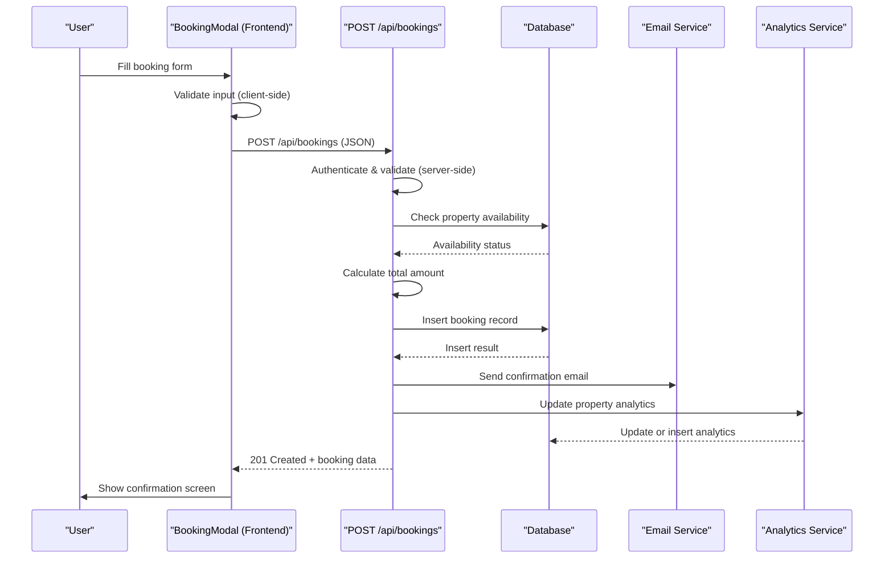
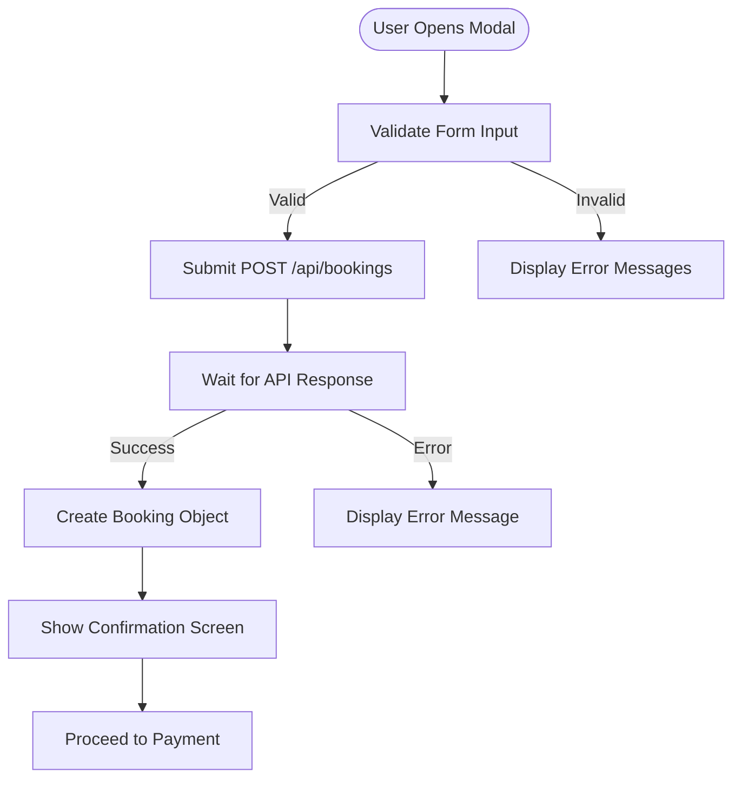
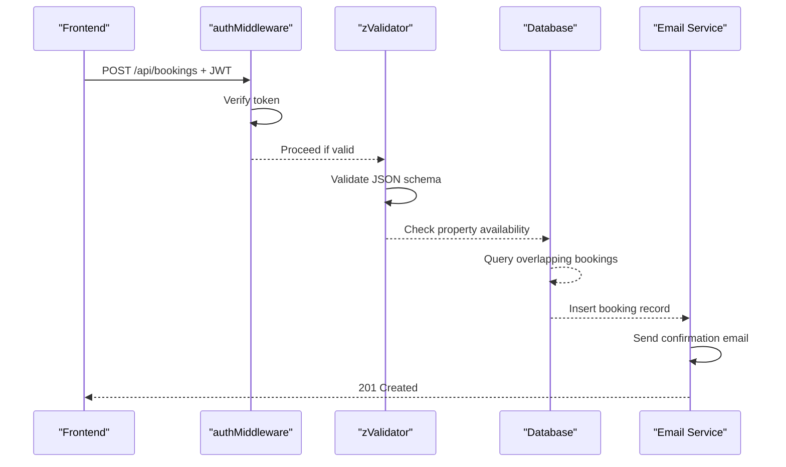
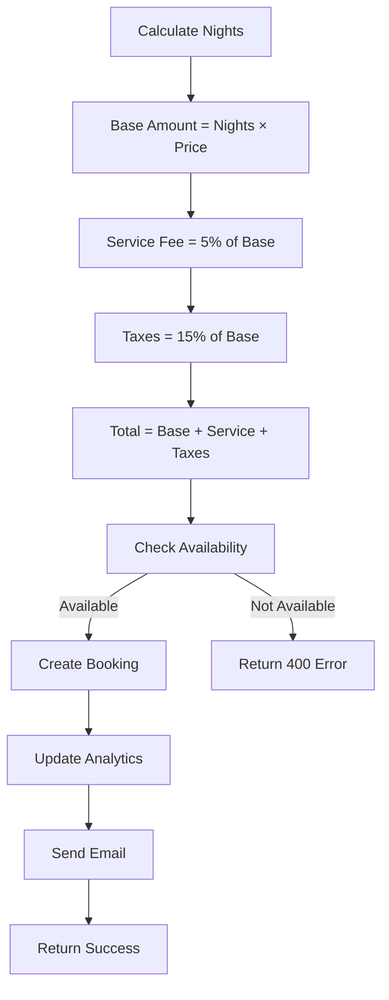
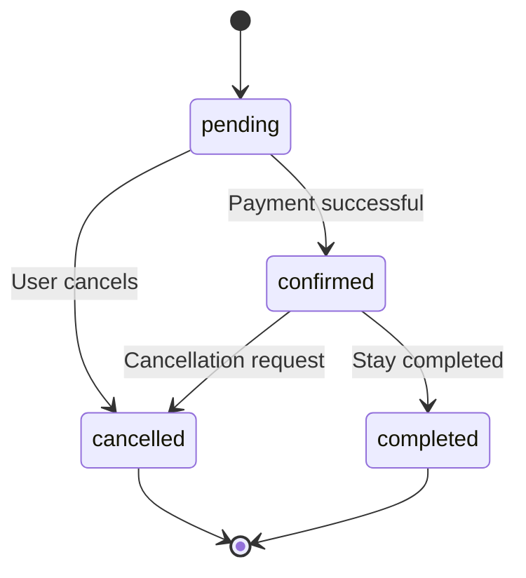

# Booking Creation

<cite>
**Referenced Files in This Document**   
- [BookingModal.tsx](file://src/react-app/components/BookingModal.tsx)
- [index.ts](file://src/worker/index.ts)
- [1.sql](file://migrations/1.sql)
- [BookingService.ts](file://src/server/services/BookingService.ts)
</cite>

## Table of Contents
1. [Booking Creation Flow Overview](#booking-creation-flow-overview)
2. [Frontend Implementation: BookingModal](#frontend-implementation-bookingmodal)
3. [Backend API Endpoint: POST /api/bookings](#backend-api-endpoint-post-apibookings)
4. [Database Schema and Constraints](#database-schema-and-constraints)
5. [Validation and Error Handling](#validation-and-error-handling)
6. [Pricing Calculation and Transaction Flow](#pricing-calculation-and-transaction-flow)
7. [Booking Status Lifecycle](#booking-status-lifecycle)
8. [Race Condition Prevention and Concurrency Control](#race-condition-prevention-and-concurrency-control)
9. [Payment Integration and Analytics Updates](#payment-integration-and-analytics-updates)
10. [Sample Request and Response Scenarios](#sample-request-and-response-scenarios)
11. [Debugging Failed Booking Attempts](#debugging-failed-booking-attempts)

## Booking Creation Flow Overview

The booking creation process in HabibiStay follows a structured flow from user interaction to persistent storage. Users initiate bookings through the **BookingModal** component, which collects guest details, dates, and special requests. Upon submission, the frontend sends a POST request to the **/api/bookings** endpoint, which validates data, checks availability, calculates pricing, and creates a booking record. The system ensures data consistency across bookings, payments, and analytics through transactional logic and atomic database operations.



**Diagram sources**
- [BookingModal.tsx](file://src/react-app/components/BookingModal.tsx)
- [index.ts](file://src/worker/index.ts)

**Section sources**
- [BookingModal.tsx](file://src/react-app/components/BookingModal.tsx#L1-L473)
- [index.ts](file://src/worker/index.ts#L440-L525)

## Frontend Implementation: BookingModal

The **BookingModal** component manages the user interface for booking creation. It collects guest information, validates input, calculates pricing, and submits data to the backend.

### Key Features:
- **Form Validation**: Client-side validation for required fields, email format, date range, and guest count.
- **Dynamic Pricing**: Real-time calculation of base amount, service fee (5%), taxes (15% VAT), and total.
- **Step-based Flow**: Three-step process (form → confirmation → payment).
- **Error Handling**: Displays validation errors and server response messages.



**Diagram sources**
- [BookingModal.tsx](file://src/react-app/components/BookingModal.tsx#L1-L473)

**Section sources**
- [BookingModal.tsx](file://src/react-app/components/BookingModal.tsx#L1-L473)

## Backend API Endpoint: POST /api/bookings

The **POST /api/bookings** endpoint in `src/worker/index.ts` handles booking creation requests with authentication, validation, and database operations.

### Endpoint Details:
- **URL**: `POST /api/bookings`
- **Authentication**: Requires JWT via `authMiddleware`
- **Rate Limiting**: 20 requests per minute per user
- **Request Validation**: Uses `zValidator` with `CreateBookingSchema`

### Request Body Structure:
```json
{
  "property_id": 123,
  "guest_name": "John Doe",
  "guest_email": "john@example.com",
  "guest_phone": "+966501234567",
  "check_in_date": "2024-01-15",
  "check_out_date": "2024-01-20",
  "total_guests": 2,
  "special_requests": "Late check-in"
}
```

### Processing Logic:
1. Validate JWT token
2. Check property existence and active status
3. Validate date range (positive duration)
4. Calculate pricing (base + 5% service fee + 15% VAT)
5. Check availability (no overlapping bookings)
6. Insert booking record
7. Send confirmation email
8. Update property analytics



**Diagram sources**
- [index.ts](file://src/worker/index.ts#L440-L525)

**Section sources**
- [index.ts](file://src/worker/index.ts#L440-L525)

## Database Schema and Constraints

The **bookings** table in the database stores all booking information with constraints to ensure data integrity.

### Table Structure:
```sql
CREATE TABLE bookings (
  id INTEGER PRIMARY KEY AUTOINCREMENT,
  user_id TEXT NOT NULL,
  property_id INTEGER NOT NULL,
  guest_name TEXT NOT NULL,
  guest_email TEXT NOT NULL,
  guest_phone TEXT,
  guest_count INTEGER NOT NULL,
  check_in_date DATE NOT NULL,
  check_out_date DATE NOT NULL,
  nights_count INTEGER NOT NULL,
  base_amount REAL NOT NULL,
  service_fee REAL DEFAULT 0,
  taxes REAL DEFAULT 0,
  total_amount REAL NOT NULL,
  status TEXT DEFAULT 'pending' CHECK (status IN ('pending', 'confirmed', 'cancelled', 'completed')),
  payment_status TEXT DEFAULT 'pending' CHECK (payment_status IN ('pending', 'processing', 'completed', 'failed', 'refunded')),
  payment_id TEXT,
  payment_method TEXT,
  special_requests TEXT,
  cancellation_reason TEXT,
  cancelled_at DATETIME,
  confirmed_at DATETIME,
  created_at DATETIME DEFAULT CURRENT_TIMESTAMP,
  updated_at DATETIME DEFAULT CURRENT_TIMESTAMP,
  FOREIGN KEY (user_id) REFERENCES users(id),
  FOREIGN KEY (property_id) REFERENCES properties(id)
);
```

### Key Constraints:
- **Foreign Keys**: Links to `users` and `properties` tables
- **Status Constraints**: Limited to predefined values
- **NOT NULL Fields**: Critical booking information
- **Default Values**: For optional fields like service fee and taxes

**Section sources**
- [1.sql](file://migrations/1.sql#L46-L74)

## Validation and Error Handling

The system implements comprehensive validation at both frontend and backend levels.

### Frontend Validation:
- **Required Fields**: Name, email, check-in/out dates
- **Email Format**: Regex validation (`/\S+@\S+\.\S+/`)
- **Date Validation**: 
  - Check-in cannot be in the past
  - Check-out must be after check-in
- **Guest Count**: Must not exceed property's `max_guests`

### Backend Validation:
- **Property Existence**: 404 if property not found
- **Date Range**: 400 if invalid (check-out ≤ check-in)
- **Availability**: 400 if conflicting booking exists
- **Schema Validation**: Using Zod for type safety

### Error Response Format:
```json
{
  "success": false,
  "error": "Property is not available for selected dates",
  "message": "Property is not available for selected dates"
}
```

**Section sources**
- [BookingModal.tsx](file://src/react-app/components/BookingModal.tsx#L50-L100)
- [index.ts](file://src/worker/index.ts#L440-L525)

## Pricing Calculation and Transaction Flow

The pricing system calculates costs dynamically based on property rates and duration.

### Pricing Formula:
```
nights = ceil((check_out - check_in) / (1000 * 60 * 60 * 24))
base_amount = nights × price_per_night
service_fee = round(base_amount × 0.05)  // 5%
taxes = round(base_amount × 0.15)         // 15% VAT
total_amount = base_amount + service_fee + taxes
```

### Transaction Flow:
1. Calculate pricing based on property rate and duration
2. Check for overlapping bookings using date range logic
3. Insert booking record with calculated total
4. Update property analytics atomically
5. Send confirmation email with booking details



**Diagram sources**
- [index.ts](file://src/worker/index.ts#L455-L465)

**Section sources**
- [index.ts](file://src/worker/index.ts#L440-L525)

## Booking Status Lifecycle

Bookings transition through multiple states during their lifecycle.

### Status States:
- **pending**: Booking created, payment not completed
- **confirmed**: Payment successful, reservation secured
- **cancelled**: Booking cancelled by user or system
- **completed**: Stay completed

### Payment Status States:
- **pending**: Awaiting payment
- **processing**: Payment in progress
- **completed**: Payment successful
- **failed**: Payment failed
- **refunded**: Payment refunded

### Transition Flow:


**Diagram sources**
- [1.sql](file://migrations/1.sql#L60-L61)

**Section sources**
- [1.sql](file://migrations/1.sql#L46-L74)

## Race Condition Prevention and Concurrency Control

The system prevents race conditions during concurrent booking attempts.

### Conflict Detection:
```sql
SELECT id FROM bookings 
WHERE property_id = ? 
AND status NOT IN ('cancelled', 'rejected')
AND (
  (check_in_date <= ? AND check_out_date > ?) OR
  (check_in_date < ? AND check_out_date >= ?) OR
  (check_in_date >= ? AND check_out_date <= ?)
)
```

### Mitigation Strategies:
- **Database-Level Locking**: Implicit row-level locking during INSERT operations
- **Atomic Operations**: Single transaction for booking creation and analytics update
- **Rate Limiting**: Prevents abuse and excessive concurrent requests
- **Availability Check**: Performed immediately before insertion

**Section sources**
- [index.ts](file://src/worker/index.ts#L468-L475)

## Payment Integration and Analytics Updates

The system integrates with payment processing and updates analytics upon booking creation.

### Payment Flow:
1. Booking created with `payment_status = 'pending'`
2. User redirected to payment modal
3. Payment processed through external gateway
4. Payment status updated to 'completed'
5. Booking status transitions to 'confirmed'

### Analytics Update:
```sql
INSERT INTO property_analytics (property_id, bookings, revenue, date) 
VALUES (?, 1, ?, ?)
ON CONFLICT(property_id, date) 
DO UPDATE SET 
  bookings = bookings + 1, 
  revenue = revenue + ?,
  updated_at = CURRENT_TIMESTAMP
```

### Email Notification:
- Sends booking confirmation to guest
- Includes booking ID, dates, total amount, and property details
- Provides link to property page

**Section sources**
- [index.ts](file://src/worker/index.ts#L505-L525)

## Sample Request and Response Scenarios

### Successful Booking Creation:
**Request:**
```json
POST /api/bookings
Content-Type: application/json
Authorization: Bearer <JWT_TOKEN>

{
  "property_id": 1,
  "guest_name": "Sarah Ahmed",
  "guest_email": "sarah@example.com",
  "check_in_date": "2024-02-10",
  "check_out_date": "2024-02-15",
  "total_guests": 2,
  "special_requests": "Early check-in"
}
```

**Response:**
```json
HTTP/1.1 201 Created
{
  "success": true,
  "message": "Booking created successfully",
  "data": {
    "booking_id": 1001,
    "total_amount": 2300,
    "base_amount": 2000,
    "service_fee": 100,
    "taxes": 200
  }
}
```

### Failed Booking - Unavailable Dates:
**Response:**
```json
HTTP/1.1 400 Bad Request
{
  "success": false,
  "error": "Property is not available for selected dates",
  "message": "Property is not available for selected dates"
}
```

### Failed Booking - Invalid Property:
**Response:**
```json
HTTP/1.1 404 Not Found
{
  "success": false,
  "error": "Property not found",
  "message": "Property not found"
}
```

**Section sources**
- [index.ts](file://src/worker/index.ts#L440-L525)

## Debugging Failed Booking Attempts

### Common Issues and Solutions:
- **400 Bad Request**: Check date format, ensure check-out > check-in, verify guest count
- **404 Not Found**: Confirm property ID exists and is active
- **500 Internal Error**: Check database connection, validate schema
- **Email Not Sent**: Verify email service configuration

### Data Integrity Checks:
1. Verify booking exists in database
2. Check `total_amount` matches calculation
3. Confirm analytics were updated
4. Validate email was sent to correct address

### Logging:
- Server logs capture all booking attempts
- Error messages include context for debugging
- Analytics track booking success/failure rates

**Section sources**
- [index.ts](file://src/worker/index.ts#L500-L525)
- [BookingModal.tsx](file://src/react-app/components/BookingModal.tsx#L120-L130)