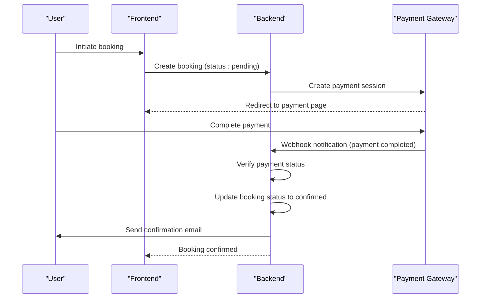
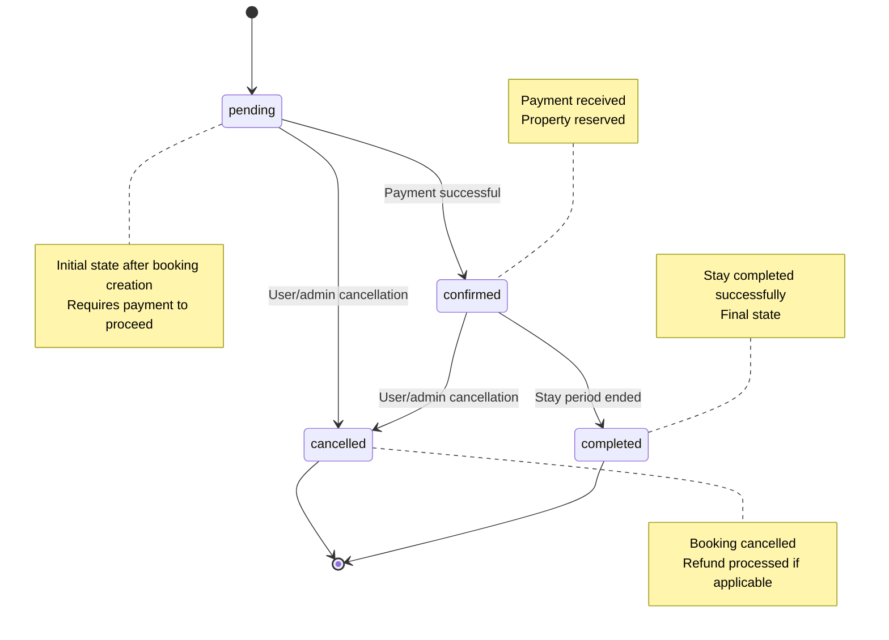

# Booking Status Management

<cite>
**Referenced Files in This Document**   
- [BookingService.ts](file://src/server/services/BookingService.ts)
- [PaymentService.ts](file://src/server/services/PaymentService.ts)
- [types.ts](file://src/shared/types.ts)
- [index.ts](file://src/worker/index.ts)
</cite>

## Table of Contents
1. [Introduction](#introduction)
2. [Booking Status Lifecycle](#booking-status-lifecycle)
3. [Status Transitions and Business Logic](#status-transitions-and-business-logic)
4. [Payment Integration and Status Updates](#payment-integration-and-status-updates)
5. [API Endpoints for Status Management](#api-endpoints-for-status-management)
6. [Database Schema and Data Model](#database-schema-and-data-model)
7. [State Transition Diagram](#state-transition-diagram)
8. [Refund Workflows and Cancellation Policies](#refund-workflows-and-cancellation-policies)
9. [Audit Logging and Monitoring](#audit-logging-and-monitoring)
10. [Edge Cases and Manual Overrides](#edge-cases-and-manual-overrides)

## Introduction
This document provides a comprehensive overview of the booking status management system in the HabibiStay platform. It details the complete lifecycle of booking states from creation to completion, including integration with payment processing, status transitions, and user/admin interactions. The system is designed to handle bookings through various states while maintaining data consistency, providing audit trails, and ensuring proper user notifications throughout the booking journey.

**Section sources**
- [BookingService.ts](file://src/server/services/BookingService.ts#L0-L822)

## Booking Status Lifecycle
The booking status lifecycle in HabibiStay follows a well-defined state machine pattern with clear transitions between states. The system tracks bookings through multiple stages from initial creation to final resolution.

### Booking Status Enum
The booking status is defined in the shared types system and includes the following states:

**BookingStatus**:
- `pending`: Initial state when a booking is created but payment is not yet completed
- `confirmed`: State after successful payment processing
- `cancelled`: State when a booking is cancelled by user or administrator
- `completed`: Final state when a booking period has ended successfully

These status values are used consistently across the frontend, backend, and database layers to ensure system-wide consistency.

### Lifecycle Overview
The booking lifecycle begins with a user creating a booking request, which enters the `pending` state. Upon successful payment, the status transitions to `confirmed`. Bookings can be cancelled by users or administrators, moving to the `cancelled` state. After the stay period ends, bookings are automatically or manually marked as `completed`.

The system ensures that only valid state transitions are allowed, preventing invalid status changes that could compromise data integrity.

**Section sources**
- [types.ts](file://src/shared/types.ts#L0-L599)

## Status Transitions and Business Logic
The booking status transitions are governed by strict business rules implemented in the BookingService class. These rules ensure data consistency and enforce business policies throughout the booking lifecycle.

### Create Booking Transition
When a new booking is created, it automatically enters the `pending` state. The system performs several validations before creating the booking:

- Property availability check for the requested dates
- Guest information validation (name, email, phone)
- Date validation (check-in cannot be in the past, check-out must be after check-in)
- Guest count validation (between 1 and 20 guests)

```typescript
async createBooking(bookingData: BookingCreate, userId?: string): Promise<Booking> {
  // Validate booking data
  await this.validateBookingData(bookingData);
  
  // Check property availability
  const availability = await this.checkAvailability(
    bookingData.property_id,
    bookingData.check_in_date,
    bookingData.check_out_date
  );
  
  if (!availability.isAvailable) {
    throw new Error('Property is not available for the selected dates');
  }
  
  // Create booking record with status = 'pending'
  const booking = await this.db.run(`
    INSERT INTO bookings (
      id, user_id, property_id, check_in_date, check_out_date, guests,
      total_amount, status, guest_name, guest_email, guest_phone,
      special_requests, created_at, updated_at
    ) VALUES (?, ?, ?, ?, ?, ?, ?, ?, ?, ?, ?, ?, ?, ?)
  `, [
    bookingId,
    userId || null,
    bookingData.property_id,
    bookingData.check_in_date,
    bookingData.check_out_date,
    bookingData.guests,
    pricing.totalAmount,
    'pending', // Initial status
    bookingData.guest_name,
    // ... other fields
  ]);
}
```

### Confirm Booking Transition
The transition from `pending` to `confirmed` occurs when payment is successfully processed. This transition is handled by the PaymentService, which updates the booking status upon payment completion.

### Cancel Booking Transition
Bookings can transition from `pending` or `confirmed` states to `cancelled`. The system enforces business rules during cancellation:

- Completed bookings cannot be cancelled
- Already cancelled bookings cannot be cancelled again
- Cancellation fees are calculated based on timing relative to check-in date

```typescript
async cancelBooking(bookingId: string, userId: string, reason?: string): Promise<Booking> {
  const booking = await this.getBookingById(bookingId);
  
  // Check if booking can be cancelled
  if (booking.status === 'cancelled') {
    throw new Error('Booking is already cancelled');
  }
  
  if (booking.status === 'completed') {
    throw new Error('Cannot cancel completed booking');
  }
  
  // Calculate cancellation fee based on policy
  const cancellationInfo = await this.calculateCancellationFee(bookingId);
  
  // Update booking status to cancelled
  await this.db.run(`
    UPDATE bookings 
    SET status = 'cancelled', 
        cancellation_reason = ?,
        cancellation_fee = ?,
        refund_amount = ?,
        updated_at = ?
    WHERE id = ?
  `, [
    reason || 'Cancelled by user',
    cancellationInfo.fee,
    cancellationInfo.refundAmount,
    new Date().toISOString(),
    bookingId
  ]);
}
```

**Section sources**
- [BookingService.ts](file://src/server/services/BookingService.ts#L0-L822)

## Payment Integration and Status Updates
The booking status system is tightly integrated with the payment processing workflow. The PaymentService handles communication with external payment gateways and updates booking statuses accordingly.

### Payment Success Flow
When a payment is successfully processed, the system automatically updates the booking status from `pending` to `confirmed`. This process is handled through webhook notifications from the payment provider.



**Diagram sources**
- [PaymentService.ts](file://src/server/services/PaymentService.ts#L0-L856)
- [index.ts](file://src/worker/index.ts#L0-L2443)

### Payment Failure Flow
If payment fails or is declined, the booking remains in the `pending` state. The system logs the failure and may notify the user to retry payment.

```typescript
private async handlePaymentFailed(transactionId: string, provider: string): Promise<void> {
  // Update payment status
  await this.db.run(`
    UPDATE payments 
    SET status = 'failed', updated_at = ?
    WHERE provider_transaction_id = ? AND provider = ?
  `, [new Date().toISOString(), transactionId, provider]);
}
```

### Worker Processing
The worker service in `src/worker/index.ts` handles payment callbacks and updates booking statuses accordingly. When a payment callback is received, the system verifies the payment status and updates both the payment and booking records.

```typescript
app.post("/api/payments/callback", zValidator("json", PaymentCallbackSchema), async (c) => {
  // Get payment status from MyFatoorah
  const statusResponse = await myfatoorah.getPaymentStatus(keyToUse);
  
  if (statusResponse.IsSuccess) {
    const paymentData = statusResponse.Data;
    const isSuccessful = paymentData.InvoiceStatus === 'Paid';
    
    // Update payment status
    await c.env.DB.prepare(`
      UPDATE payments SET 
        status = ?, 
        transaction_id = ?,
        payment_method = ?,
        metadata = ?,
        updated_at = CURRENT_TIMESTAMP
      WHERE id = ?
    `).bind(
      newStatus,
      paymentData.InvoiceTransactions[0]?.TransactionId || null,
      paymentData.InvoiceTransactions[0]?.PaymentGateway || null,
      JSON.stringify(paymentData),
      (payment as any).id
    ).run();
    
    // Update booking status
    const bookingStatus = isSuccessful ? 'confirmed' : 'pending';
    const paymentStatus = isSuccessful ? 'completed' : 'failed';
    
    await c.env.DB.prepare(`
      UPDATE bookings SET 
        status = ?, 
        payment_status = ?,
        updated_at = CURRENT_TIMESTAMP
      WHERE id = ?
    `).bind(bookingStatus, paymentStatus, (payment as any).booking_id).run();
  }
});
```

**Section sources**
- [PaymentService.ts](file://src/server/services/PaymentService.ts#L0-L856)
- [index.ts](file://src/worker/index.ts#L0-L2443)

## API Endpoints for Status Management
The system provides RESTful API endpoints for managing booking statuses with appropriate permission controls.

### User-Facing Endpoints
Users can interact with their bookings through the following endpoints:

- `POST /api/bookings` - Create a new booking (status: pending)
- `GET /api/bookings/my-bookings` - Retrieve user's bookings
- `PUT /api/bookings/:bookingId/status` - Update booking status (limited to cancellation)

### Admin-Facing Endpoints
Administrators have additional privileges to manage bookings:

```typescript
app.put("/api/admin/bookings/:bookingId/status", authMiddleware, async (c) => {
  const user = c.get("user");
  if (!user || (!user.email.includes('admin') && !user.email.includes('owner'))) {
    return c.json<ApiResponse>({
      success: false,
      error: "Unauthorized",
    }, 403);
  }

  const bookingId = c.req.param("bookingId");
  const { status } = await c.req.json();

  const { success } = await c.env.DB.prepare(`
    UPDATE bookings SET status = ?, updated_at = CURRENT_TIMESTAMP
    WHERE id = ?
  `).bind(status, bookingId).run();

  return c.json<ApiResponse>({
    success,
    message: success ? "Booking status updated" : "Failed to update booking status",
  });
});
```

### Permission Model
The system implements role-based access control for booking status management:

- **Guest users**: Can view their own bookings and cancel pending/confirmed bookings
- **Property owners**: Can view bookings for their properties and update statuses
- **Administrators**: Full access to all bookings and status modifications

All status update operations include authentication and authorization checks to prevent unauthorized access.

**Section sources**
- [index.ts](file://src/worker/index.ts#L0-L2443)

## Database Schema and Data Model
The booking status system is supported by a well-designed database schema that ensures data integrity and efficient querying.

### Bookings Table Structure
The core bookings table includes the following relevant fields:

**Bookings Table**:
- `id`: Unique booking identifier
- `user_id`: Reference to the user who made the booking
- `property_id`: Reference to the booked property
- `check_in_date`: Start date of the booking
- `check_out_date`: End date of the booking
- `guests`: Number of guests
- `total_amount`: Total booking amount
- `status`: Current booking status (pending, confirmed, cancelled, completed)
- `payment_status`: Payment status (pending, completed, failed)
- `cancellation_reason`: Reason for cancellation (if applicable)
- `cancellation_fee`: Fee applied for cancellation
- `refund_amount`: Amount refunded (if applicable)
- `created_at`: Creation timestamp
- `updated_at`: Last update timestamp

### Related Tables
The system uses several related tables to support booking management:

- **Payments**: Tracks payment transactions linked to bookings
- **Refunds**: Records refund transactions with status tracking
- **Audit_logs**: Logs all booking-related actions for auditing
- **Booking_pricing**: Stores detailed pricing breakdowns for bookings

### Schema Evolution
The database schema has been designed to support future enhancements, including:

- Support for partial refunds
- Multiple payment methods per booking
- Complex cancellation policies
- Automated status transitions (e.g., pending to expired)

**Section sources**
- [BookingService.ts](file://src/server/services/BookingService.ts#L0-L822)

## State Transition Diagram
The following diagram illustrates the valid state transitions for booking statuses in the HabibiStay system.



**Diagram sources**
- [BookingService.ts](file://src/server/services/BookingService.ts#L0-L822)
- [types.ts](file://src/shared/types.ts#L0-L599)

## Refund Workflows and Cancellation Policies
The system implements a comprehensive refund workflow that is triggered when bookings are cancelled.

### Cancellation Fee Calculation
Cancellation fees are calculated based on a flexible policy that considers the timing of cancellation relative to the check-in date:

```typescript
private async calculateCancellationFee(bookingId: string): Promise<{ fee: number; refundAmount: number }> {
  const booking = await this.getBookingById(bookingId);
  const checkInDate = new Date(booking.check_in_date);
  const now = new Date();
  const daysUntilCheckIn = Math.ceil((checkInDate.getTime() - now.getTime()) / (1000 * 60 * 60 * 24));

  let feePercentage = 0;

  // Flexible cancellation policy
  if (daysUntilCheckIn >= 7) {
    feePercentage = 0; // No fee
  } else if (daysUntilCheckIn >= 1) {
    feePercentage = 0.1; // 10% fee
  } else {
    feePercentage = 0.5; // 50% fee
  }

  const fee = Math.round(booking.total_amount * feePercentage);
  const refundAmount = booking.total_amount - fee;

  return { fee, refundAmount };
}
```

### Refund Processing
When a booking is cancelled, the system automatically processes refunds based on the cancellation policy:

```typescript
private async processRefund(bookingId: string, amount: number): Promise<void> {
  // Implement refund processing with payment gateway
  await this.paymentService.processRefund(bookingId, amount);
}
```

The refund process involves:

1. Calculating the refund amount based on cancellation timing
2. Processing the refund through the original payment gateway
3. Updating the booking record with refund details
4. Sending confirmation emails to the user

### Partial Refunds
The system supports partial refunds through the same refund workflow. Administrators can initiate partial refunds for specific amounts, which are processed through the payment gateway and recorded in the refunds table.

**Section sources**
- [BookingService.ts](file://src/server/services/BookingService.ts#L0-L822)
- [PaymentService.ts](file://src/server/services/PaymentService.ts#L0-L856)

## Audit Logging and Monitoring
The system maintains comprehensive audit logs to track all booking status changes and related activities.

### Audit Log Implementation
Every booking-related action is logged in the audit_logs table:

```typescript
private async logBookingAction(bookingId: string, userId: string, action: string, details: any): Promise<void> {
  await this.db.run(`
    INSERT INTO audit_logs (user_id, action, details, timestamp)
    VALUES (?, ?, ?, ?)
  `, [userId, `booking_${action}`, JSON.stringify({ bookingId, ...details }), new Date().toISOString()]);
}
```

The audit logs capture:
- User ID performing the action
- Action type (create, update, cancel, etc.)
- Detailed information about the action
- Timestamp of the action

### Monitoring and Alerting
The system provides administrative interfaces to monitor booking statuses and detect potential issues:

- Real-time dashboard showing booking statistics
- Alerts for bookings stuck in pending state
- Reports on cancellation rates and refund amounts
- Monitoring of payment success/failure rates

These monitoring capabilities help ensure data consistency and allow administrators to identify and resolve issues promptly.

**Section sources**
- [BookingService.ts](file://src/server/services/BookingService.ts#L0-L822)

## Edge Cases and Manual Overrides
The system handles various edge cases and provides mechanisms for manual status overrides by administrators.

### No-Show Handling
For bookings where guests do not arrive (no-shows), the system allows administrators to manually update the status:

```typescript
// Admin can manually update booking status
app.put("/api/admin/bookings/:bookingId/status", authMiddleware, async (c) => {
  const bookingId = c.req.param("bookingId");
  const { status } = await c.req.json();

  const { success } = await c.env.DB.prepare(`
    UPDATE bookings SET status = ?, updated_at = CURRENT_TIMESTAMP
    WHERE id = ?
  `).bind(status, bookingId).run();
});
```

Administrators can mark no-show bookings as `completed` or `cancelled` based on business policies.

### Manual Status Overrides
Administrators have the ability to manually override booking statuses in exceptional circumstances:

- Force confirmation of bookings with payment issues
- Reverse cancellations when appropriate
- Mark bookings as completed after stay period
- Resolve status inconsistencies

These manual overrides are logged in the audit trail for accountability.

### Data Synchronization
To ensure data synchronization across services, the system implements several safeguards:

- Database transactions for status updates
- Idempotent webhook handlers
- Regular consistency checks
- Reconciliation processes for payment-status mismatches

These mechanisms help prevent status inconsistencies that could arise from network issues or system failures.

**Section sources**
- [BookingService.ts](file://src/server/services/BookingService.ts#L0-L822)
- [index.ts](file://src/worker/index.ts#L0-L2443)