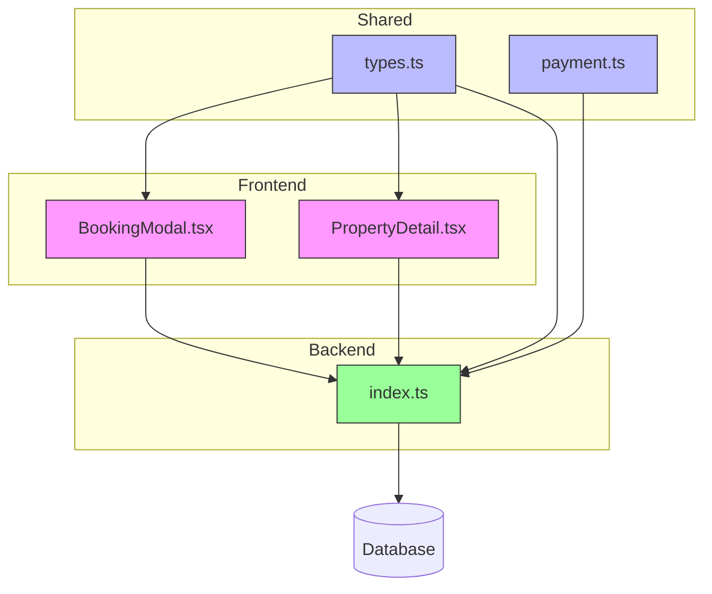
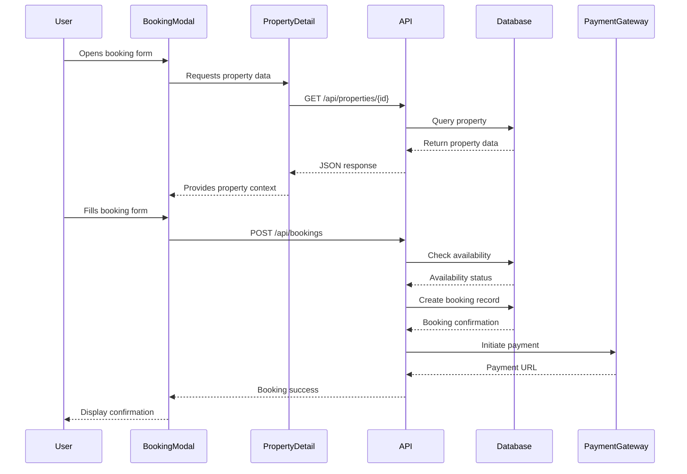
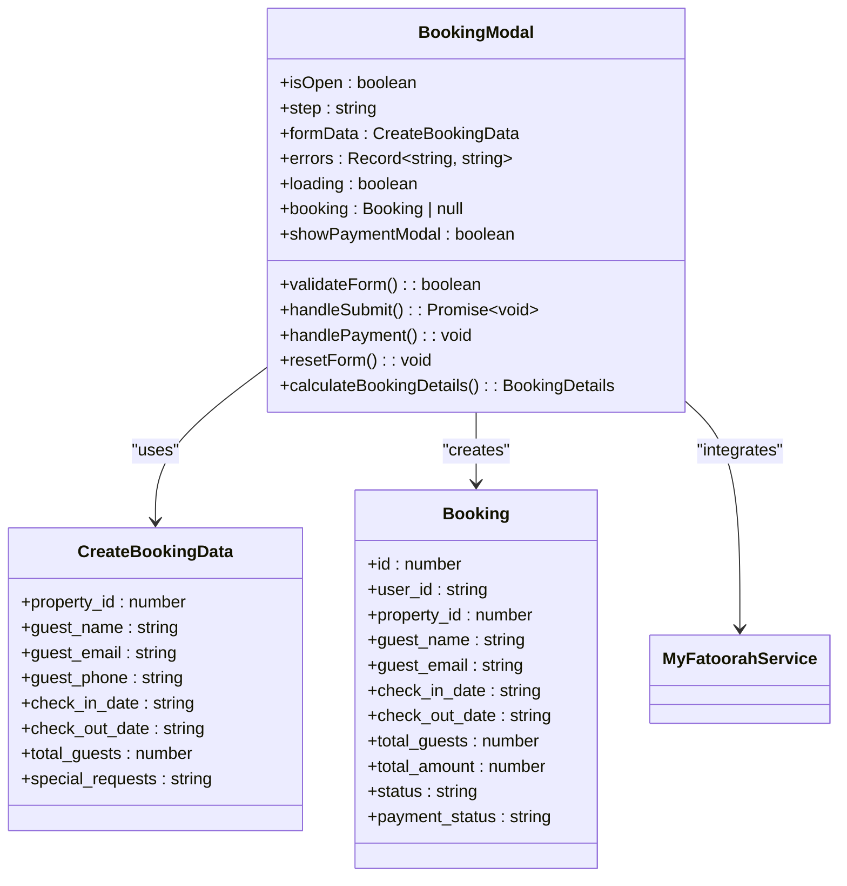
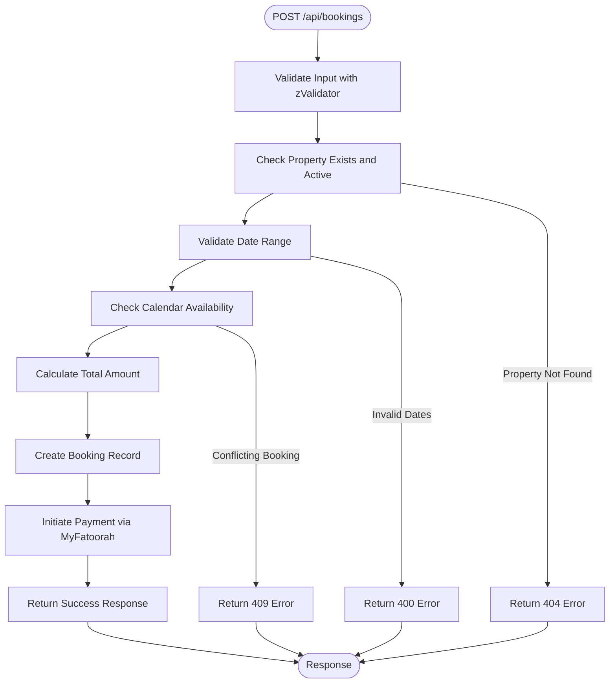
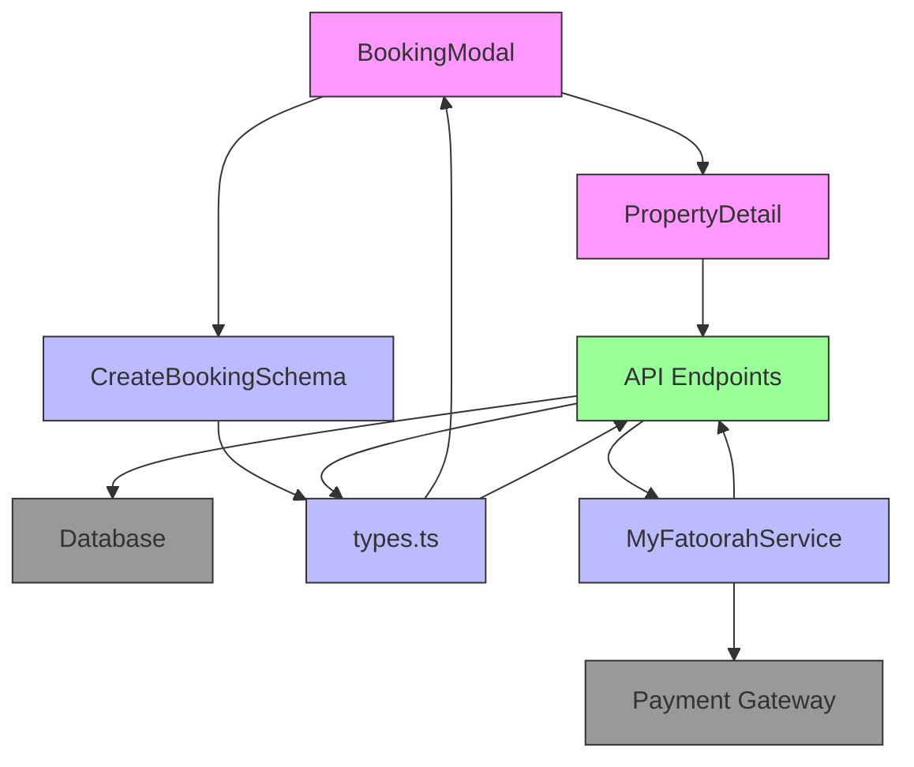

# Booking System

<cite>
**Referenced Files in This Document**   
- [BookingModal.tsx](file://src/react-app/components/BookingModal.tsx)
- [PropertyDetail.tsx](file://src/react-app/pages/PropertyDetail.tsx)
- [index.ts](file://src/worker/index.ts)
- [types.ts](file://src/shared/types.ts)
- [payment.ts](file://src/shared/payment.ts)
</cite>

## Table of Contents
1. [Introduction](#introduction)
2. [Project Structure](#project-structure)
3. [Core Components](#core-components)
4. [Architecture Overview](#architecture-overview)
5. [Detailed Component Analysis](#detailed-component-analysis)
6. [Dependency Analysis](#dependency-analysis)
7. [Performance Considerations](#performance-considerations)
8. [Troubleshooting Guide](#troubleshooting-guide)
9. [Conclusion](#conclusion)

## Introduction
The Booking System in HabibiStay enables users to select dates, check property availability, and create bookings with integrated payment processing. This document provides a comprehensive analysis of the system's implementation, covering frontend components, backend validation, API endpoints, state management, and integration with payment services. The system handles critical aspects such as date conflict detection, guest validation, real-time pricing calculations, and booking status transitions.

## Project Structure
The project follows a modular structure with clear separation between frontend, shared utilities, and backend worker components. The booking functionality is distributed across multiple directories:

- **Frontend Components**: React components for user interaction
- **Shared Types**: Centralized type definitions and validation schemas
- **Backend Worker**: API endpoints and database operations
- **Payment Integration**: External payment service handling



**Diagram sources**
- [BookingModal.tsx](file://src/react-app/components/BookingModal.tsx)
- [PropertyDetail.tsx](file://src/react-app/pages/PropertyDetail.tsx)
- [types.ts](file://src/shared/types.ts)
- [payment.ts](file://src/shared/payment.ts)
- [index.ts](file://src/worker/index.ts)

**Section sources**
- [BookingModal.tsx](file://src/react-app/components/BookingModal.tsx)
- [PropertyDetail.tsx](file://src/react-app/pages/PropertyDetail.tsx)
- [index.ts](file://src/worker/index.ts)
- [types.ts](file://src/shared/types.ts)
- [payment.ts](file://src/shared/payment.ts)

## Core Components
The booking system consists of several core components that work together to provide a seamless booking experience:

1. **BookingModal**: Interactive modal for collecting booking information
2. **PropertyDetail**: Page component that integrates the booking functionality
3. **CreateBookingSchema**: Validation schema for booking data
4. **MyFatoorahService**: Payment processing integration
5. **API Endpoints**: Backend routes for booking creation and validation

These components follow a unidirectional data flow pattern, with state managed in React components and validated against shared TypeScript types before being sent to the backend.

**Section sources**
- [BookingModal.tsx](file://src/react-app/components/BookingModal.tsx)
- [PropertyDetail.tsx](file://src/react-app/pages/PropertyDetail.tsx)
- [types.ts](file://src/shared/types.ts)
- [payment.ts](file://src/shared/payment.ts)
- [index.ts](file://src/worker/index.ts)

## Architecture Overview
The booking system follows a client-server architecture with React frontend components communicating with a backend API through RESTful endpoints. The architecture emphasizes type safety through shared TypeScript definitions and implements comprehensive validation at both client and server levels.



**Diagram sources**
- [BookingModal.tsx](file://src/react-app/components/BookingModal.tsx)
- [PropertyDetail.tsx](file://src/react-app/pages/PropertyDetail.tsx)
- [index.ts](file://src/worker/index.ts)

## Detailed Component Analysis

### Booking Modal Implementation
The BookingModal component provides a user-friendly interface for booking properties with step-by-step guidance and real-time validation.

#### Component Structure


**Diagram sources**
- [BookingModal.tsx](file://src/react-app/components/BookingModal.tsx)
- [types.ts](file://src/shared/types.ts)

### Backend Booking Creation
The backend implementation handles booking creation with comprehensive validation and database persistence.

#### API Endpoint Flow


**Diagram sources**
- [index.ts](file://src/worker/index.ts#L406-L445)

**Section sources**
- [index.ts](file://src/worker/index.ts#L406-L445)
- [types.ts](file://src/shared/types.ts)

## Dependency Analysis
The booking system has well-defined dependencies between components, ensuring loose coupling and maintainability.



**Diagram sources**
- [BookingModal.tsx](file://src/react-app/components/BookingModal.tsx)
- [PropertyDetail.tsx](file://src/react-app/pages/PropertyDetail.tsx)
- [index.ts](file://src/worker/index.ts)
- [types.ts](file://src/shared/types.ts)
- [payment.ts](file://src/shared/payment.ts)

**Section sources**
- [BookingModal.tsx](file://src/react-app/components/BookingModal.tsx)
- [PropertyDetail.tsx](file://src/react-app/pages/PropertyDetail.tsx)
- [index.ts](file://src/worker/index.ts)
- [types.ts](file://src/shared/types.ts)
- [payment.ts](file://src/shared/payment.ts)

## Performance Considerations
The booking system implements several performance optimizations:

1. **Client-side Validation**: Immediate feedback without server round-trips
2. **Type Safety**: Shared TypeScript types reduce runtime errors
3. **Efficient Database Queries**: Indexed fields for property and booking lookups
4. **Caching**: Property details are cached in the frontend
5. **Asynchronous Operations**: Non-blocking API calls improve responsiveness

The system handles high-concurrency scenarios through database-level constraints and careful transaction management, though explicit locking mechanisms are not implemented in the current codebase.

## Troubleshooting Guide
Common issues and their solutions in the booking system:

### Overlapping Date Conflicts
**Issue**: Multiple users attempting to book the same property for overlapping dates
**Solution**: The backend checks for conflicting bookings with the query:
```sql
SELECT id FROM bookings 
WHERE property_id = ? 
AND status NOT IN ('cancelled', 'rejected')
AND (
  (check_in_date <= ? AND check_out_date > ?) OR
  (check_in_date < ? AND check_out_date >= ?)
)
```

### Payment Integration Failures
**Issue**: Payment gateway timeouts or failures
**Solution**: Implement retry logic and proper error handling in the MyFatoorahService class, with user-friendly error messages.

### Timezone Handling
**Issue**: Date discrepancies between client and server
**Solution**: All dates are stored in ISO format (YYYY-MM-DD) without time components, minimizing timezone issues for check-in/check-out dates.

### Guest Count Validation
**Issue**: Guests exceeding property capacity
**Solution**: The CreateBookingSchema validates total_guests as a positive integer, and the backend should validate against the property's max_guests field.

**Section sources**
- [index.ts](file://src/worker/index.ts#L406-L445)
- [types.ts](file://src/shared/types.ts)
- [payment.ts](file://src/shared/payment.ts)

## Conclusion
The HabibiStay booking system provides a robust and user-friendly interface for property reservations with comprehensive validation and payment integration. The architecture follows modern web development practices with clear separation of concerns, type safety, and responsive design. Key strengths include real-time availability checking, transparent pricing calculations, and seamless payment processing. Future improvements could include enhanced concurrency control for high-demand properties and more sophisticated timezone handling for international users.