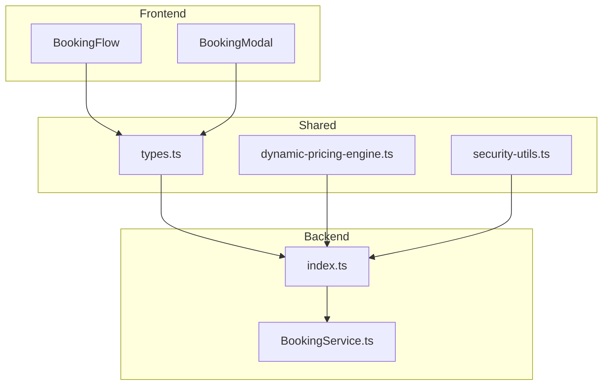
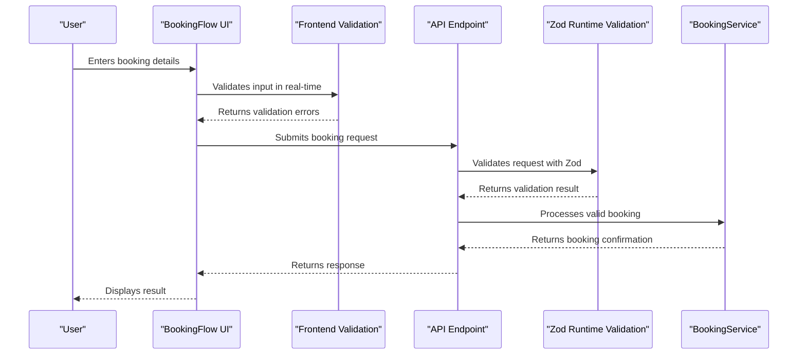
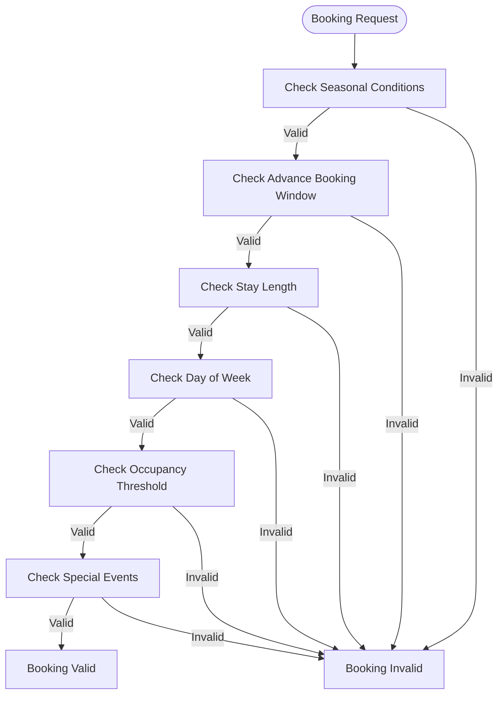
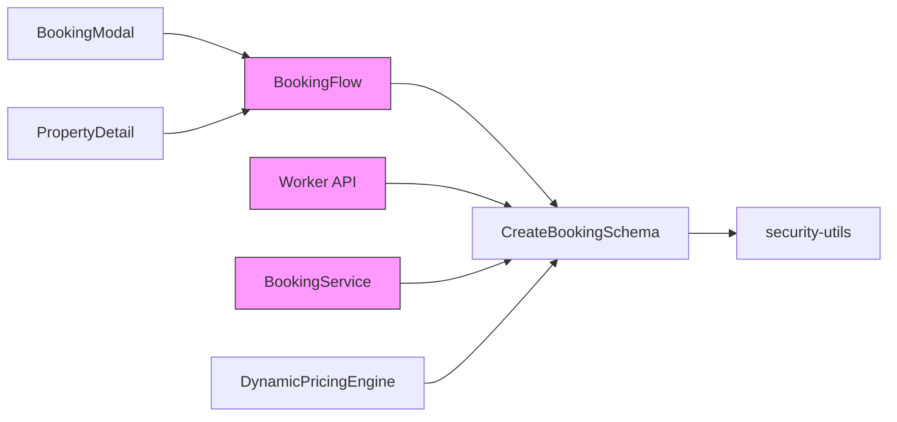

# Booking Validation Logic

<cite>
**Referenced Files in This Document**   
- [src/shared/types.ts](file://src/shared/types.ts)
- [src/worker/index.ts](file://src/worker/index.ts)
- [src/react-app/components/BookingFlow.tsx](file://src/react-app/components/BookingFlow.tsx)
- [src/server/services/BookingService.ts](file://src/server/services/BookingService.ts)
- [src/shared/dynamic-pricing-engine.ts](file://src/shared/dynamic-pricing-engine.ts)
- [src/shared/dynamic-pricing-types.ts](file://src/shared/dynamic-pricing-types.ts)
- [src/shared/security-utils.ts](file://src/shared/security-utils.ts)
</cite>

## Table of Contents
1. [Introduction](#introduction)
2. [Project Structure](#project-structure)
3. [Core Components](#core-components)
4. [Architecture Overview](#architecture-overview)
5. [Detailed Component Analysis](#detailed-component-analysis)
6. [Dependency Analysis](#dependency-analysis)
7. [Performance Considerations](#performance-considerations)
8. [Troubleshooting Guide](#troubleshooting-guide)
9. [Conclusion](#conclusion)

## Introduction
The Booking Validation Logic in HabibiStay ensures that all booking requests adhere to business rules and constraints before being processed. This system operates on both frontend and backend layers to provide real-time feedback and enforce data integrity. The validation framework leverages TypeScript interfaces for type safety, Zod schemas for runtime validation, and shared logic across components to maintain consistency. Key constraints include minimum/maximum stay duration, guest capacity limits, advance booking windows, blackout dates, and seasonal restrictions.

## Project Structure
The project follows a modular architecture with clear separation between frontend, shared utilities, and backend worker services. The booking validation logic is distributed across multiple directories:

- `src/react-app/components/`: Contains UI components like BookingFlow and BookingModal that handle user input and real-time validation.
- `src/shared/`: Houses shared types, validation utilities, and pricing engine logic used by both frontend and backend.
- `src/worker/`: Implements the backend API with Zod-based runtime validation.
- `src/server/services/`: Contains business logic services including booking validation.



**Diagram sources**
- [src/react-app/components/BookingFlow.tsx](file://src/react-app/components/BookingFlow.tsx)
- [src/shared/types.ts](file://src/shared/types.ts)
- [src/worker/index.ts](file://src/worker/index.ts)
- [src/server/services/BookingService.ts](file://src/server/services/BookingService.ts)

**Section sources**
- [src/react-app/components/BookingFlow.tsx](file://src/react-app/components/BookingFlow.tsx)
- [src/shared/types.ts](file://src/shared/types.ts)
- [src/worker/index.ts](file://src/worker/index.ts)

## Core Components
The booking validation system consists of several core components that work together to ensure data integrity and business rule compliance:

1. **CreateBookingSchema**: Defines the structure and constraints for booking payloads using Zod.
2. **BookingFlow Component**: Handles user input and provides real-time validation feedback.
3. **Zod Validator in Worker**: Enforces runtime validation on API endpoints.
4. **Dynamic Pricing Engine**: Applies custom validation rules based on seasonal and business conditions.
5. **Security Utilities**: Provides reusable validation schemas for common fields.

These components ensure that validation rules are consistent across the application stack while allowing for extensibility.

**Section sources**
- [src/shared/types.ts](file://src/shared/types.ts#L20-L35)
- [src/react-app/components/BookingFlow.tsx](file://src/react-app/components/BookingFlow.tsx#L93-L127)
- [src/worker/index.ts](file://src/worker/index.ts#L100-L110)

## Architecture Overview
The booking validation architecture follows a layered approach with validation occurring at multiple levels:



**Diagram sources**
- [src/react-app/components/BookingFlow.tsx](file://src/react-app/components/BookingFlow.tsx)
- [src/worker/index.ts](file://src/worker/index.ts)
- [src/server/services/BookingService.ts](file://src/server/services/BookingService.ts)

## Detailed Component Analysis

### Shared TypeScript Interfaces
The `src/shared/types.ts` file defines the `CreateBookingSchema` using Zod, which serves as the single source of truth for booking payload structure:

```typescript
export const CreateBookingSchema = z.object({
  property_id: z.number(),
  guest_name: z.string().min(1),
  guest_email: z.string().email(),
  guest_phone: z.string().optional(),
  check_in_date: z.string(),
  check_out_date: z.string(),
  total_guests: z.number().int().positive(),
  special_requests: z.string().optional(),
});
```

This schema enforces:
- **property_id**: Must be a number
- **guest_name**: Required string with minimum length of 1
- **guest_email**: Must be a valid email format
- **total_guests**: Positive integer
- **check_in_date/check_out_date**: Required date strings

**Section sources**
- [src/shared/types.ts](file://src/shared/types.ts#L20-L35)

### Zod Runtime Validation
The worker endpoint in `src/worker/index.ts` uses Zod validator middleware to enforce runtime validation:

```typescript
app.post("/api/bookings", authMiddleware, rateLimitMiddleware(20, 60 * 1000), zValidator("json", CreateBookingSchema), async (c) => {
  const data = c.req.valid("json");
  // Process valid data
});
```

The `zValidator("json", CreateBookingSchema)` middleware automatically:
1. Parses the request body as JSON
2. Validates against the CreateBookingSchema
3. Returns 400 error with detailed message if validation fails
4. Provides type-safe access to validated data via `c.req.valid("json")`

This approach ensures that only valid data reaches the business logic layer.

**Section sources**
- [src/worker/index.ts](file://src/worker/index.ts#L300-L310)

### Frontend Validation in BookingFlow
The `BookingFlow` component implements real-time validation with immediate user feedback:

```typescript
const validateStep = (step: string): boolean => {
  const newErrors: Record<string, string> = {};

  switch (step) {
    case 'dates':
      if (!formData.check_in_date) newErrors.check_in_date = 'Check-in date is required';
      if (!formData.check_out_date) newErrors.check_out_date = 'Check-out date is required';
      if (formData.guest_count < 1) newErrors.guest_count = 'At least 1 guest is required';
      if (formData.guest_count > property.max_guests) {
        newErrors.guest_count = `Maximum ${property.max_guests} guests allowed`;
      }
      // Additional date validation
      break;
  }

  setErrors(newErrors);
  return Object.keys(newErrors).length === 0;
};
```

Key features:
- Validates on step change rather than on every keystroke
- Provides field-specific error messages
- Uses visual indicators (red borders) for invalid fields
- Prevents form submission when validation fails

**Section sources**
- [src/react-app/components/BookingFlow.tsx](file://src/react-app/components/BookingFlow.tsx#L93-L127)

### Backend Business Logic Validation
The `BookingService` class implements additional business rule validation:

```typescript
if (checkIn < today) {
  throw new Error('Check-in date cannot be in the past');
}

if (checkOut <= checkIn) {
  throw new Error('Check-out date must be after check-in date');
}

if (!data.guests || data.guests < 1 || data.guests > 20) {
  throw new Error('Number of guests must be between 1 and 20');
}
```

This layer validates:
- Check-in date cannot be in the past
- Check-out date must be after check-in date
- Guest count between 1 and 20
- Valid guest contact information

**Section sources**
- [src/server/services/BookingService.ts](file://src/server/services/BookingService.ts#L569-L610)

### Custom Validation Rules
The dynamic pricing engine implements sophisticated validation rules for special constraints:



**Diagram sources**
- [src/shared/dynamic-pricing-engine.ts](file://src/shared/dynamic-pricing-engine.ts#L182-L225)
- [src/shared/dynamic-pricing-types.ts](file://src/shared/dynamic-pricing-types.ts#L19-L72)

The system supports various custom rules:
- **Seasonal restrictions**: Booking only allowed in specific seasons
- **Advance booking windows**: Minimum/maximum days in advance
- **Minimum/maximum stay duration**: Required night stays
- **Day of week restrictions**: Booking only on specific days
- **Occupancy thresholds**: Based on market demand
- **Special events**: Blackout dates during major events

Example from database:
```sql
INSERT OR IGNORE INTO special_events (name, date, duration_days, impact_radius_km, price_impact, adjustment_percentage, description) VALUES
('Saudi National Day', '2024-09-23', 3, 50, 'high', 25, 'National celebration affecting accommodation demand'),
('Riyadh Season', '2024-10-15', 120, 25, 'very_high', 40, 'Major entertainment season in Riyadh');
```

**Section sources**
- [src/shared/dynamic-pricing-engine.ts](file://src/shared/dynamic-pricing-engine.ts#L182-L225)
- [migrations/8.sql](file://migrations/8.sql#L84-L108)

### Error Message Standardization
The system standardizes error messages across frontend and backend:

**Frontend messages:**
- "Check-in date is required"
- "Check-out must be after check-in"
- "Maximum ${property.max_guests} guests allowed"

**Backend messages:**
- "Check-in date cannot be in the past"
- "Check-out date must be after check-in date"
- "Number of guests must be between 1 and 20"

The API returns standardized responses:
```typescript
return c.json<ApiResponse>({
  success: false,
  error: "Property is not available for selected dates",
}, 400);
```

This ensures a consistent user experience regardless of where validation occurs.

**Section sources**
- [src/react-app/components/BookingFlow.tsx](file://src/react-app/components/BookingFlow.tsx#L93-L127)
- [src/server/services/BookingService.ts](file://src/server/services/BookingService.ts#L569-L610)
- [src/worker/index.ts](file://src/worker/index.ts#L350-L360)

### Validation Extensibility
The system is designed for extensibility through several mechanisms:

1. **Zod Schemas**: New validation rules can be added to existing schemas without breaking changes:
```typescript
export const CreateBookingSchema = z.object({
  // existing fields
}).superRefine((data, ctx) => {
  // Add custom validation rules
  if (data.total_guests > 10 && !data.special_permission) {
    ctx.addIssue({
      code: z.ZodIssueCode.custom,
      message: "Large groups require special permission",
      path: ["total_guests"],
    });
  }
});
```

2. **Pricing Rules System**: Custom validation rules can be defined as pricing conditions:
```typescript
export interface PricingConditions {
  seasons?: string[];
  months?: number[];
  advance_days?: { min?: number; max?: number };
  stay_length?: { min_nights?: number; max_nights?: number };
  days_of_week?: number[];
  event_dates?: string[];
}
```

3. **Security Utilities**: Reusable validation schemas:
```typescript
export const emailSchema = z.string().email('Invalid email format').max(255);
export const passwordSchema = z.string().min(8, 'Password must be at least 8 characters');
```

This modular approach allows new constraints to be added without affecting existing functionality.

**Section sources**
- [src/shared/types.ts](file://src/shared/types.ts)
- [src/shared/security-utils.ts](file://src/shared/security-utils.ts)
- [src/shared/dynamic-pricing-types.ts](file://src/shared/dynamic-pricing-types.ts)

## Dependency Analysis
The booking validation system has the following dependencies:



**Diagram sources**
- [src/react-app/components/BookingFlow.tsx](file://src/react-app/components/BookingFlow.tsx)
- [src/shared/types.ts](file://src/shared/types.ts)
- [src/worker/index.ts](file://src/worker/index.ts)
- [src/server/services/BookingService.ts](file://src/server/services/BookingService.ts)

Key dependency relationships:
- All components depend on `CreateBookingSchema` for consistent validation
- The worker API and BookingService share validation logic
- Security utilities provide foundational validation rules
- Dynamic pricing engine extends basic validation with business rules

## Performance Considerations
The validation system is designed with performance in mind:

1. **Frontend Validation**: Lightweight checks that don't require server round-trips
2. **Zod Validation**: Efficient parsing and validation with minimal overhead
3. **Caching**: Property details are cached to avoid repeated database queries
4. **Batch Processing**: Multiple validation rules are processed in a single pass
5. **Early Exit**: Validation stops at the first failure for critical constraints

The system balances thorough validation with responsive user experience by:
- Performing basic validation on the client side
- Deferring complex business rule validation to the server
- Using efficient data structures and algorithms
- Minimizing database queries through caching

## Troubleshooting Guide
Common validation issues and solutions:

**Frontend-Backend Validation Mismatch**
- **Symptom**: Form validates on frontend but fails on backend
- **Cause**: Different validation rules or timing issues
- **Solution**: Ensure both layers use the same shared schema

**Date Validation Issues**
- **Symptom**: Valid dates rejected by backend
- **Cause**: Timezone differences or format mismatches
- **Solution**: Standardize on ISO 8601 date format (YYYY-MM-DD)

**Guest Count Validation Problems**
- **Symptom**: Guest count limit not enforced correctly
- **Cause**: Hardcoded limits vs. property-specific limits
- **Solution**: Use property.max_guests from API response

**Missing Error Messages**
- **Symptom**: Generic error messages instead of specific ones
- **Cause**: Error handling not properly propagated
- **Solution**: Ensure all validation errors are caught and returned

**Debugging Tips**
1. Check browser console for frontend validation errors
2. Inspect network requests to see API responses
3. Verify that shared schemas are up to date
4. Test with edge cases (minimum/maximum values)
5. Use consistent date formats across the application

**Section sources**
- [src/react-app/components/BookingFlow.tsx](file://src/react-app/components/BookingFlow.tsx)
- [src/worker/index.ts](file://src/worker/index.ts)
- [src/server/services/BookingService.ts](file://src/server/services/BookingService.ts)

## Conclusion
The Booking Validation Logic in HabibiStay provides a robust, extensible system for enforcing business rules during the booking process. By leveraging shared TypeScript interfaces and Zod schemas, the system ensures consistency between frontend and backend validation. Real-time feedback in the BookingFlow component enhances user experience, while comprehensive business rule validation protects data integrity. The architecture supports custom validation rules for seasonal restrictions, blackout dates, and other special constraints through the dynamic pricing engine. Error messages are standardized across the application for a consistent user experience. The system is designed for extensibility, allowing new validation rules to be added without breaking existing integrations. This comprehensive approach to validation ensures that all bookings meet business requirements while providing a smooth user experience.