# Core Features

<cite>
**Referenced Files in This Document**   
- [ChatBot.tsx](file://src/react-app/components/ChatBot.tsx) - *Updated with voice functions in commit b760da4*
- [BookingModal.tsx](file://src/react-app/components/BookingModal.tsx) - *Enhanced with chat integration in commit b760da4*
- [types.ts](file://src/shared/types.ts) - *Updated with voice interface types in commit b760da4*
- [ChatContext.tsx](file://src/react-app/contexts/ChatContext.tsx) - *Updated with voice functionality in commit b760da4*
- [useVoiceInterface.ts](file://src/react-app/hooks/useVoiceInterface.ts) - *Added in recent implementation*
- [PropertyDetail.tsx](file://src/react-app/pages/PropertyDetail.tsx)
- [index.ts](file://src/worker/index.ts)
- [1.sql](file://migrations/1.sql)
- [payment.ts](file://src/shared/payment.ts)
- [Dashboard.tsx](file://src/react-app/pages/Dashboard.tsx)
- [BookingFlow.tsx](file://src/react-app/components/BookingFlow.tsx) - *Enhanced with improved validation in commit 895d979*
- [PaymentModal.tsx](file://src/react-app/components/PaymentModal.tsx) - *Enhanced with secure processing in commit 895d979*
- [WishlistButton.tsx](file://src/react-app/components/WishlistButton.tsx) - *Enhanced with persistent storage in commit 895d979*
- [useWishlist.ts](file://src/react-app/hooks/useWishlist.ts) - *Hook for wishlist functionality*
- [AdminDashboard.tsx](file://src/react-app/pages/AdminDashboard.tsx) - *Added CMS integration in commit 6f011ccc*
- [CMSPage.tsx](file://src/react-app/pages/CMSPage.tsx) - *Added in commit 6f011ccc*
- [CMSAdminPanel.tsx](file://src/react-app/components/admin/CMSAdminPanel.tsx) - *Added in commit 6f011ccc*
- [CMSContext.tsx](file://src/react-app/contexts/CMSContext.tsx) - *Added in commit 6f011ccc*
</cite>

## Update Summary
**Changes Made**   
- Updated "Integrated Feature Overview" to include CMS functionality
- Added new "Content Management System" section detailing CMS architecture and components
- Enhanced "Feature Interdependencies" with CMS integration details
- Updated "Unique Differentiators" with CMS capabilities
- Added new "CMS Use Case Diagrams" section
- Updated section sources to reflect new and modified files
- Added comprehensive source tracking for CMS-related components

## Table of Contents
1. [Integrated Feature Overview](#integrated-feature-overview)
2. [Feature Interdependencies](#feature-interdependencies)
3. [End-to-End User Experience](#end-to-end-user-experience)
4. [Unique Differentiators](#unique-differentiators)
5. [Voice Interface Integration](#voice-interface-integration)
6. [Wishlist Functionality](#wishlist-functionality)
7. [Content Management System](#content-management-system)
8. [Use Case Diagrams](#use-case-diagrams)

## Integrated Feature Overview

HabibiStay integrates six core features—property management, booking system, payment processing, AI chatbot, user management, and content management system—into a seamless platform for short-term rentals in Riyadh. These features work together to deliver a comprehensive solution for property owners, guests, investors, and administrators.

The property management system allows hosts to list and manage their properties with detailed information including location, pricing, availability, and amenities. The booking system enables guests to search, check availability, and reserve properties based on their requirements. Payment processing is handled through MyFatoorah, a regional payment gateway that supports Saudi Riyal transactions. The AI chatbot "Sara" provides 24/7 assistance throughout the user journey. User management handles authentication, profiles, and role-based access for guests, hosts, and administrators. The content management system (CMS) enables administrators to create and manage website content, templates, and AI-generated content. The wishlist functionality enables users to save properties for future consideration with persistent storage.

These components are interconnected through a shared data model and API layer, ensuring consistency across the platform. The integration creates a cohesive experience where actions in one feature automatically trigger appropriate responses in others, such as booking confirmations updating property availability calendars.

**Section sources**
- [Dashboard.tsx](file://src/react-app/pages/Dashboard.tsx#L1-L484)
- [types.ts](file://src/shared/types.ts#L1-L599)

## Feature Interdependencies

The core features of HabibiStay are deeply interconnected, creating a system where data flows seamlessly between components to deliver a unified experience.

### Property Management and Booking System Integration

Property availability checks rely on both property data and calendar logic to prevent double bookings. When a guest attempts to book a property, the system performs an availability check by querying the database for conflicting bookings.

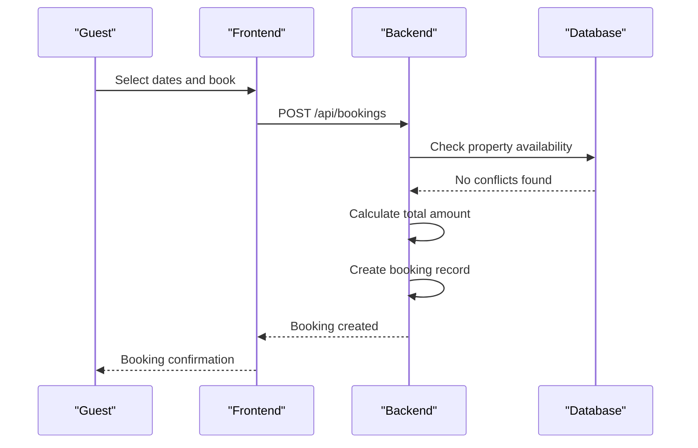

**Diagram sources**
- [index.ts](file://src/worker/index.ts#L406-L445)
- [1.sql](file://migrations/1.sql#L46-L74)

The booking creation process involves several interdependent steps:
1. Validate property existence and active status
2. Calculate stay duration in nights
3. Check for overlapping bookings using date range comparison
4. Calculate pricing including base amount, service fees, and taxes
5. Create booking record with pending status

This integration ensures that only available properties can be booked, maintaining data integrity across the system.

### Payment Processing and Booking System Integration

Payment status updates directly trigger booking confirmations, creating a critical dependency between the payment and booking systems. When a payment is successfully processed, the booking status transitions from "pending" to "confirmed."

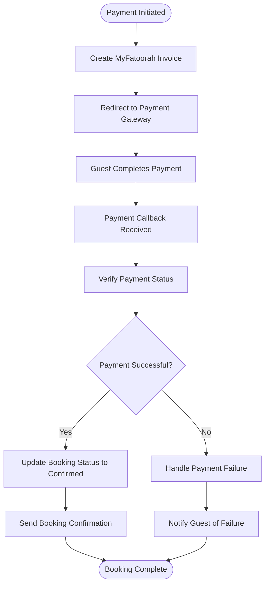

**Diagram sources**
- [payment.ts](file://src/shared/payment.ts#L1-L165)
- [index.ts](file://src/worker/index.ts#L406-L445)

The payment processing workflow uses the MyFatoorahService class to handle payment operations:
- **createInvoice**: Creates a payment invoice with amount, currency, and callback URLs
- **getPaymentStatus**: Checks the status of a payment by ID
- **getInvoiceStatus**: Retrieves the status of an invoice
- **cancelInvoice**: Cancels an existing invoice

Payment callbacks trigger updates to the booking record, ensuring that only paid bookings are confirmed.

**Section sources**
- [payment.ts](file://src/shared/payment.ts#L1-L165)
- [index.ts](file://src/worker/index.ts#L406-L445)

### CMS and Platform Integration

The content management system is integrated with the platform's core features through the CMSContext, enabling dynamic content creation and management. The CMS allows administrators to create pages, templates, and components that are used throughout the platform.

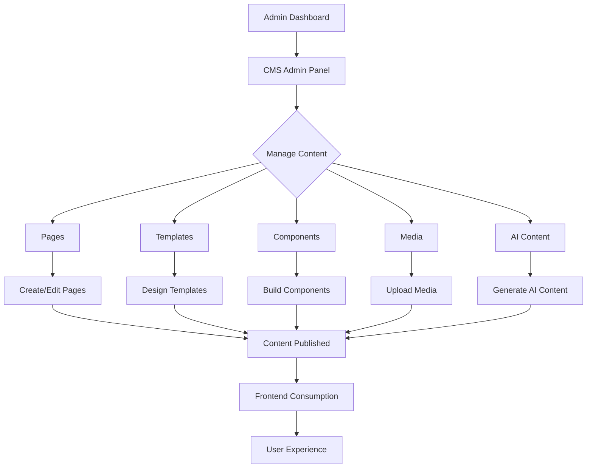

**Diagram sources**
- [CMSAdminPanel.tsx](file://src/react-app/components/admin/CMSAdminPanel.tsx#L1-L1141)
- [CMSContext.tsx](file://src/react-app/contexts/CMSContext.tsx#L1-L647)
- [CMSPage.tsx](file://src/react-app/pages/CMSPage.tsx#L1-L105)

The CMS integration enables:
- **Dynamic Content Creation**: Administrators can create and edit pages without developer intervention
- **Template Management**: Reusable templates ensure consistent design across the platform
- **Component Library**: Pre-built components streamline content creation
- **AI Content Generation**: Integration with AI providers enables automated content creation
- **Version Control**: Content versions allow rollback to previous states
- **Responsive Design**: Built-in responsive capabilities ensure content looks good on all devices

This integration allows the platform to maintain fresh, relevant content while reducing the technical burden on administrators.

**Section sources**
- [CMSAdminPanel.tsx](file://src/react-app/components/admin/CMSAdminPanel.tsx#L1-L1141)
- [CMSContext.tsx](file://src/react-app/contexts/CMSContext.tsx#L1-L647)
- [CMSPage.tsx](file://src/react-app/pages/CMSPage.tsx#L1-L105)

## End-to-End User Experience

The user journey on HabibiStay spans multiple features, creating a seamless experience from discovery to post-stay activities.

### Guest Journey

A typical guest journey begins with property discovery and ends with post-stay activities:

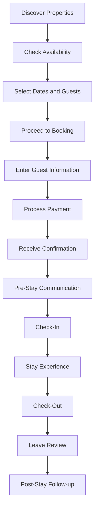

The journey is supported by integrated features:
- **Property Management**: Provides accurate property information and availability
- **Booking System**: Handles reservation creation and management
- **Payment Processing**: Secures transactions and confirms bookings
- **AI Chatbot**: Assists with inquiries and booking support
- **User Management**: Maintains guest profile and preferences
- **Wishlist**: Enables property saving for future consideration

### Host Journey

Property owners experience a different but equally integrated journey:

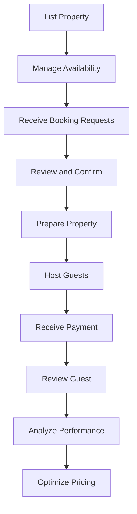

Hosts use the Dashboard to monitor their properties, bookings, and earnings across multiple tabs:
- **Overview**: Key metrics and quick actions
- **Properties**: List and manage all properties
- **Bookings**: View and manage reservations
- **Earnings**: Track financial performance

**Section sources**
- [Dashboard.tsx](file://src/react-app/pages/Dashboard.tsx#L1-L484)
- [PropertyDetail.tsx](file://src/react-app/pages/PropertyDetail.tsx#L146-L175)

## Unique Differentiators

HabibiStay distinguishes itself through three key differentiators: the AI assistant "Sara", its Riyadh-specific market focus, and its integrated content management system.

### AI Assistant "Sara"

The AI chatbot "Sara" is deeply integrated across the platform, providing personalized assistance throughout the user journey. Sara is implemented as a context-aware chat system that can handle property inquiries, booking assistance, and customer support.

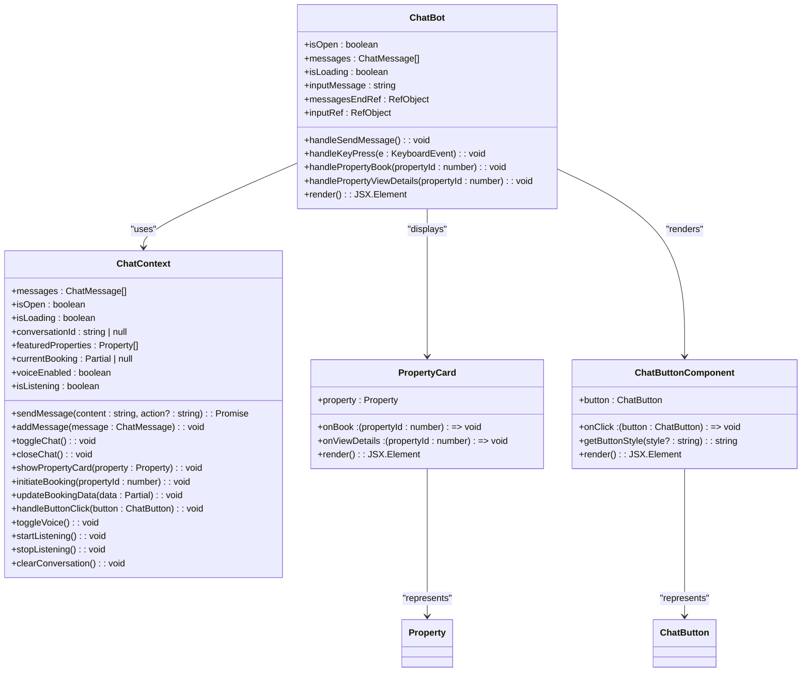

**Diagram sources**
- [ChatContext.tsx](file://src/react-app/contexts/ChatContext.tsx#L1-L452)
- [ChatBot.tsx](file://src/react-app/components/ChatBot.tsx#L1-L451)

Sara's capabilities include:
- **Property Recommendations**: Showcasing featured properties with interactive cards
- **Booking Initiation**: Guiding users through the booking process
- **Voice Interface**: Supporting voice input and speech synthesis
- **Context Awareness**: Maintaining conversation state and booking context
- **Action Buttons**: Providing interactive options for common tasks

The chatbot is accessible site-wide with a floating button and can be opened from any page, including the contact page where it's prominently featured as the primary support channel.

### Riyadh-Specific Market Focus

HabibiStay is specifically designed for the Riyadh market with several localization features:
- **Currency**: All transactions are in Saudi Riyal (SAR)
- **Payment Gateway**: Integration with MyFatoorah, a regional payment provider
- **Language**: Support for Arabic and English interfaces
- **Cultural Context**: Properties and descriptions tailored to local preferences
- **Regulatory Compliance**: Adherence to Saudi short-term rental regulations

The platform's focus on Riyadh allows for deeper market understanding and more relevant property offerings compared to global platforms.

### Integrated Content Management System

The CMS provides several unique capabilities that differentiate HabibiStay:
- **Visual Editor**: Drag-and-drop interface for creating and editing pages
- **Template System**: Reusable templates ensure design consistency
- **Component Library**: Pre-built components streamline content creation
- **AI Content Generation**: Integration with multiple AI providers for automated content creation
- **Version Control**: Content versioning allows rollback to previous states
- **Responsive Design**: Built-in responsive capabilities ensure content looks good on all devices
- **Permission Management**: Role-based access control for content management

These capabilities enable administrators to maintain fresh, relevant content without requiring technical expertise.

**Section sources**
- [ChatContext.tsx](file://src/react-app/contexts/ChatContext.tsx#L1-L452)
- [ChatBot.tsx](file://src/react-app/components/ChatBot.tsx#L1-L451)
- [types.ts](file://src/shared/types.ts#L1-L599)
- [CMSAdminPanel.tsx](file://src/react-app/components/admin/CMSAdminPanel.tsx#L1-L1141)
- [CMSContext.tsx](file://src/react-app/contexts/CMSContext.tsx#L1-L647)

## Voice Interface Integration

The voice interface functionality enhances Sara's capabilities by providing hands-free interaction through speech recognition and text-to-speech synthesis.

### Voice Input Implementation

The voice input system is implemented using the Web Speech API and provides the following features:
- **Speech Recognition**: Converts spoken words to text using the browser's SpeechRecognition interface
- **Real-time Feedback**: Displays interim transcripts as the user speaks
- **Confidence Scoring**: Provides confidence levels for recognized speech
- **Error Handling**: Gracefully handles recognition errors and network issues

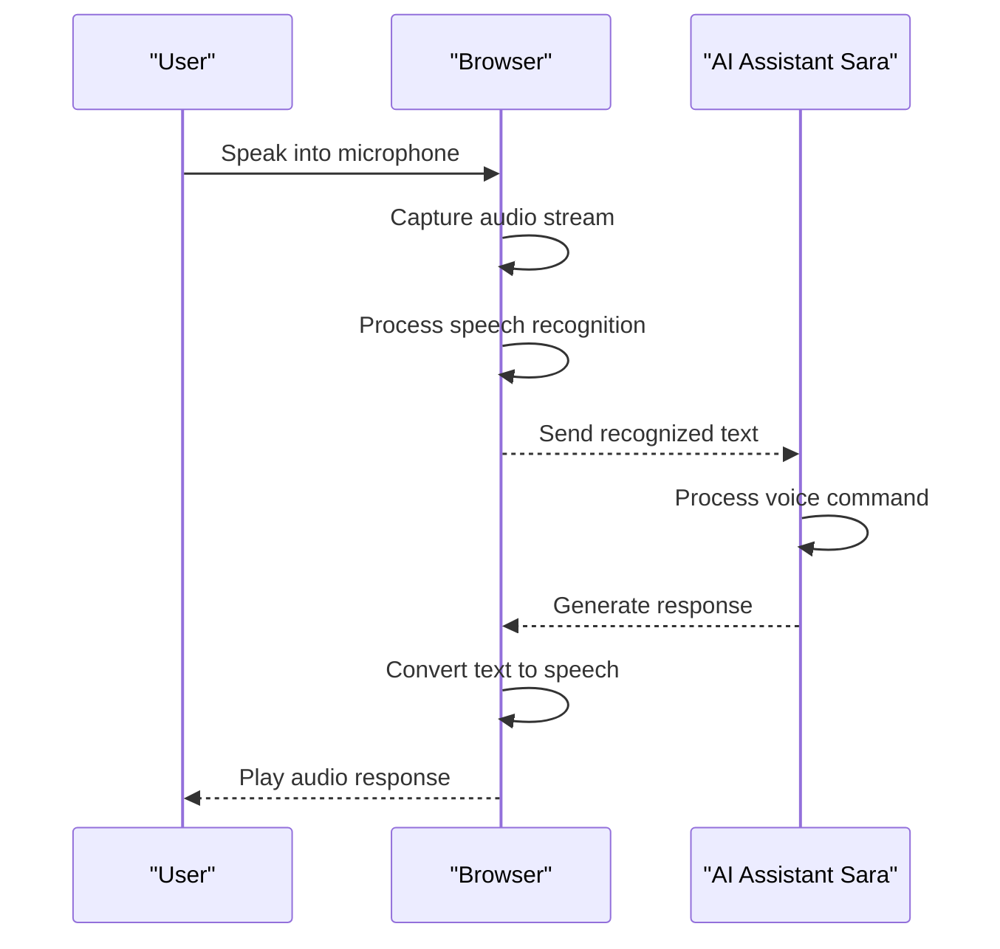

**Diagram sources**
- [useVoiceInterface.ts](file://src/react-app/hooks/useVoiceInterface.ts#L1-L287)
- [ChatContext.tsx](file://src/react-app/contexts/ChatContext.tsx#L1-L452)

### Voice Output Implementation

The voice output system provides text-to-speech capabilities with configurable parameters:
- **Speech Synthesis**: Converts text responses to audio using SpeechSynthesisUtterance
- **Voice Configuration**: Customizable rate, pitch, volume, and language settings
- **Voice Selection**: Support for different voice profiles based on user preferences
- **Concurrent Speech Handling**: Prevents overlapping audio playback

The voice interface is controlled through the following key components:
- **Voice Toggle**: Enables/disables voice functionality in the chat interface
- **Listen Button**: Initiates speech recognition when clicked
- **Status Indicators**: Visual feedback showing listening status and voice activity

**Section sources**
- [ChatBot.tsx](file://src/react-app/components/ChatBot.tsx#L1-L451)
- [useVoiceInterface.ts](file://src/react-app/hooks/useVoiceInterface.ts#L1-L287)
- [types.ts](file://src/shared/types.ts#L469-L482)

### Voice Configuration Options

The voice interface supports various configuration options through the VoiceConfig type:

**VoiceConfig Properties**
- **enabled**: Boolean flag to enable/disable voice functionality
- **language**: Language code for speech recognition and synthesis (e.g., 'en-US')
- **voice**: Specific voice profile to use for speech synthesis
- **rate**: Speech rate (0.1 to 2.0, where 1.0 is normal speed)
- **pitch**: Speech pitch (0.0 to 2.0, where 1.0 is normal pitch)
- **volume**: Audio volume (0.0 to 1.0)

These configuration options allow users to customize their voice interaction experience based on personal preferences and environmental conditions.

**Section sources**
- [types.ts](file://src/shared/types.ts#L469-L476)
- [useVoiceInterface.ts](file://src/react-app/hooks/useVoiceInterface.ts#L1-L287)

## Wishlist Functionality

The wishlist functionality enables users to save properties for future consideration with persistent storage and seamless integration across the platform.

### Persistent Storage Implementation

The wishlist system uses a combination of client-side state management and server-side persistence to ensure saved properties are available across sessions and devices.

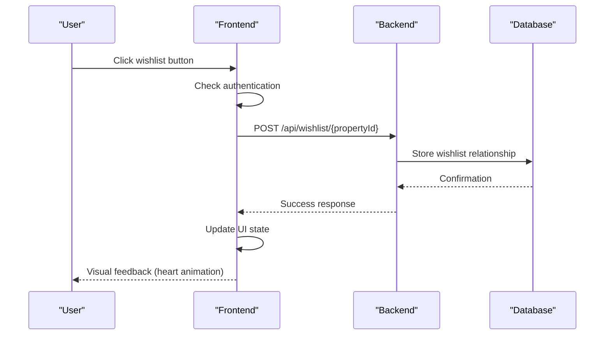

**Diagram sources**
- [WishlistButton.tsx](file://src/react-app/components/WishlistButton.tsx#L1-L118)
- [useWishlist.ts](file://src/react-app/hooks/useWishlist.ts#L1-L121)
- [PropertyDetail.tsx](file://src/react-app/pages/PropertyDetail.tsx#L75-L125)

### User Interaction Flow

The wishlist interaction provides a seamless experience with visual feedback and authentication handling:

1. **Authentication Check**: The system verifies user authentication before modifying wishlist state
2. **API Communication**: Secure API calls handle wishlist operations with error handling
3. **UI Feedback**: Visual animations provide immediate feedback on user actions
4. **State Synchronization**: Client and server states are kept in sync through the useWishlist hook

The wishlist functionality is accessible from multiple touchpoints:
- **Property Cards**: Heart icon on search results and property listings
- **Property Detail Page**: Prominent wishlist button in the booking section
- **User Dashboard**: Dedicated wishlist section with saved properties
- **Wishlist Page**: Dedicated view for managing all saved properties

**Section sources**
- [WishlistButton.tsx](file://src/react-app/components/WishlistButton.tsx#L1-L118)
- [useWishlist.ts](file://src/react-app/hooks/useWishlist.ts#L1-L121)
- [WishlistPage.tsx](file://src/react-app/pages/WishlistPage.tsx#L1-L137)

### Wishlist Management Features

The wishlist system supports several key features for user convenience:

**Core Features**
- **Persistent Storage**: Saved properties remain available across sessions
- **Cross-Device Sync**: Wishlist state is synchronized across all user devices
- **Visual Feedback**: Animation effects provide immediate response to user actions
- **Authentication Integration**: Seamless authentication handling with redirect
- **Sorting and Filtering**: Users can organize saved properties by various criteria

**User Benefits**
- **Property Comparison**: Save multiple options for side-by-side comparison
- **Future Planning**: Bookmark properties for future trips or consideration
- **Price Monitoring**: Track properties to monitor price changes over time
- **Quick Access**: Rapid access to previously viewed properties of interest

**Section sources**
- [useWishlist.ts](file://src/react-app/hooks/useWishlist.ts#L1-L121)
- [WishlistPage.tsx](file://src/react-app/pages/WishlistPage.tsx#L49-L77)
- [UserDashboard.tsx](file://src/react-app/pages/UserDashboard.tsx#L58-L86)

## Content Management System

The Content Management System (CMS) is a comprehensive platform for creating, managing, and publishing website content. It provides administrators with powerful tools to maintain fresh, relevant content without requiring technical expertise.

### CMS Architecture

The CMS is built on a modular architecture with several key components:

```mermaid
classDiagram
class CMSContext {
+pages : Page[]
+templates : Template[]
+components : Component[]
+media : Media[]
+aiProviders : AIProvider[]
+aiModels : AIModel[]
+aiJobs : AIContentJob[]
+loading : boolean
+error : string | null
+fetchPages() : Promise<void>
+fetchTemplates() : Promise<void>
+fetchComponents() : Promise<void>
+fetchMedia() : Promise<void>
+fetchAIProviders() : Promise<void>
+fetchAIModels(providerId : number) : Promise<void>
+fetchAIJobs() : Promise<void>
+refreshAIModels(providerId : number) : Promise<void>
+processAIJobs() : Promise<void>
+createPage(page : Omit<Page, 'id' | 'created_at' | 'updated_at'>) : Promise<Page | null>
+updatePage(id : number, page : Partial<Page>) : Promise<Page | null>
+deletePage(id : number) : Promise<boolean>
+createTemplate(template : Omit<Template, 'id' | 'created_at' | 'updated_at'>) : Promise<Template | null>
+updateTemplate(id : number, template : Partial<Template>) : Promise<Template | null>
+deleteTemplate(id : number) : Promise<boolean>
+createComponent(component : Omit<Component, 'id' | 'created_at' | 'updated_at'>) : Promise<Component | null>
+updateComponent(id : number, component : Partial<Component>) : Promise<Component | null>
+deleteComponent(id : number) : Promise<boolean>
+uploadMedia(media : Omit<Media, 'id' | 'created_at'>) : Promise<Media | null>
+deleteMedia(id : number) : Promise<boolean>
+createAIProvider(provider : Omit<AIProvider, 'id' | 'created_at' | 'updated_at'>) : Promise<AIProvider | null>
+updateAIProvider(id : number, provider : Partial<AIProvider>) : Promise<AIProvider | null>
+deleteAIProvider(id : number) : Promise<boolean>
+createAIModel(model : Omit<AIModel, 'id' | 'created_at'>) : Promise<AIModel | null>
+updateAIModel(id : number, model : Partial<AIModel>) : Promise<AIModel | null>
+deleteAIModel(id : number) : Promise<boolean>
+createAIJob(job : Omit<AIContentJob, 'id' | 'created_at' | 'status'>) : Promise<AIContentJob | null>
+updateAIJob(id : number, job : Partial<AIContentJob>) : Promise<AIContentJob | null>
+createContentVersion(version : Omit<ContentVersion, 'id' | 'created_at'>) : Promise<ContentVersion | null>
+getContentVersions(contentId : number, contentType : string) : Promise<ContentVersion[]>
+getUserPermissions() : Promise<string[]>
+getAllPermissions() : Promise<{name : string, description : string}[]>
+checkPermission(permission : string) : Promise<boolean>
+grantPermission(userId : string, permission : string) : Promise<void>
+revokePermission(userId : string, permission : string) : Promise<void>
+getUsersWithPermission(permission : string) : Promise<any[]>
}
class CMSAdminPanel {
+activeTab : 'pages' | 'templates' | 'components' | 'media' | 'ai' | 'permissions'
+showCreateForm : boolean
+editingItem : any
+showTemplateEditor : boolean
+editingTemplateId : number | null
+showVisualEditor : boolean
+editingPageId : number | null
+showAIContentCreator : boolean
+permissions : {name : string, description : string}[]
+userPermissions : string[]
+selectedUser : string
+selectedPermission : string
+usersWithPermission : any[]
+pageForm : {title : string, slug : string, template_id : number | null, content : string, metadata : string, status : 'draft' | 'published' | 'archived'}
+templateForm : {name : string, description : string, content_structure : string, preview_image : string, is_default : boolean}
+componentForm : {type : string, name : string, properties : string, styles : string}
+mediaForm : {filename : string, original_name : string, mime_type : string, size : number, url : string, alt_text : string, caption : string}
+aiProviderForm : {name : string, api_key : string, api_url : string, enabled : boolean, default_model : string}
+handleCreatePage(e : React.FormEvent) : void
+handleCreateTemplate(e : React.FormEvent) : void
+handleCreateComponent(e : React.FormEvent) : void
+handleUploadMedia(e : React.FormEvent) : void
+handleCreateAIProvider(e : React.FormEvent) : void
+handleTabChange(tab : 'pages' | 'templates' | 'components' | 'media' | 'ai' | 'permissions') : void
+render() : JSX.Element
}
class VisualEditor {
+activeTab : 'components' | 'settings' | 'versions'
+deviceView : 'desktop' | 'tablet' | 'mobile'
+selectedComponent : string | null
+draggedComponent : ComponentItem | null
+contentVersions : any[]
+selectedVersion : string | null
+activeStyleTab : 'general' | 'responsive'
+pageData : {title : string, slug : string, status : 'draft' | 'published' | 'archived', components : PageComponent[]}
+handleComponentSelect(component : ComponentItem) : void
+handleComponentDelete(componentId : string) : void
+handleComponentDuplicate(componentId : string) : void
+handleSave() : void
+handleRestoreVersion(version : any) : void
+updateComponentStyle(componentId : string, property : string, value : string) : void
+updateComponentResponsiveStyle(componentId : string, breakpoint : string, property : string, value : string) : void
+renderComponent(component : PageComponent) : JSX.Element
+render() : JSX.Element
}
class ComponentLibrary {
+activeCategory : string
+categories : string[]
+filteredComponents : ComponentItem[]
+onComponentSelect(component : ComponentItem) : void
+render() : JSX.Element
}
class AIContentCreator {
+selectedProvider : number | ''
+selectedModel : number | ''
+prompt : string
+generatedContent : string
+isGenerating : boolean
+generationHistory : any[]
+activeTab : 'create' | 'history'
+handleGenerateContent() : void
+handleInsertContent() : void
+handleSaveToHistory() : void
+render() : JSX.Element
}
CMSAdminPanel --> CMSContext : "uses"
VisualEditor --> CMSContext : "uses"
ComponentLibrary --> CMSContext : "uses"
AIContentCreator --> CMSContext : "uses"
```

**Diagram sources**
- [CMSContext.tsx](file://src/react-app/contexts/CMSContext.tsx#L1-L647)
- [CMSAdminPanel.tsx](file://src/react-app/components/admin/CMSAdminPanel.tsx#L1-L1141)
- [VisualEditor.tsx](file://src/react-app/components/cms/VisualEditor.tsx#L1-L849)
- [ComponentLibrary.tsx](file://src/react-app/components/cms/ComponentLibrary.tsx#L1-L317)
- [AIContentCreator.tsx](file://src/react-app/components/cms/AIContentCreator.tsx#L1-L351)

### Core CMS Components

The CMS consists of several key components that work together to provide a comprehensive content management solution:

**Pages**: The fundamental content units that can be created, edited, and published. Each page has a title, slug, template, content, metadata, and status (draft, published, or archived).

**Templates**: Reusable designs that define the structure and appearance of pages. Templates can have default content structures, design settings, and can inherit from parent templates.

**Components**: Reusable building blocks that can be combined to create pages. Components have types, names, properties, and styles, and can be customized for different device sizes.

**Media**: Images, videos, and other files that can be uploaded and used in content. Each media item has metadata including filename, MIME type, size, URL, alt text, and caption.

**AI Integration**: The CMS integrates with multiple AI providers (OpenAI, Anthropic, Google Gemini) to enable automated content generation. Administrators can create AI jobs to generate content based on prompts.

**Version Control**: The CMS maintains a history of content changes, allowing administrators to view previous versions and restore them if needed.

**Permission Management**: Role-based access control ensures that only authorized users can perform specific actions within the CMS.

**Section sources**
- [CMSContext.tsx](file://src/react-app/contexts/CMSContext.tsx#L1-L647)
- [types.ts](file://src/shared/types.ts#L650-L738)
- [CMSAdminPanel.tsx](file://src/react-app/components/admin/CMSAdminPanel.tsx#L1-L1141)

### CMS Workflow

The CMS provides a streamlined workflow for content creation and management:

1. **Content Creation**: Administrators can create new pages, templates, components, and media through intuitive forms.
2. **Visual Editing**: The Visual Editor allows drag-and-drop creation of pages using pre-built components.
3. **AI Content Generation**: Administrators can use AI to generate content based on prompts, which can then be edited and refined.
4. **Version Management**: All content changes are versioned, allowing rollback to previous states.
5. **Responsive Design**: Content can be previewed and edited for different device sizes (desktop, tablet, mobile).
6. **Publishing**: Content can be published, updated, or archived as needed.

This workflow enables non-technical users to create and manage professional-quality content without requiring coding skills.

**Section sources**
- [VisualEditor.tsx](file://src/react-app/components/cms/VisualEditor.tsx#L1-L849)
- [AIContentCreator.tsx](file://src/react-app/components/cms/AIContentCreator.tsx#L1-L351)
- [ComponentLibrary.tsx](file://src/react-app/components/cms/ComponentLibrary.tsx#L1-L317)

## Use Case Diagrams

### Property Booking Journey with Voice

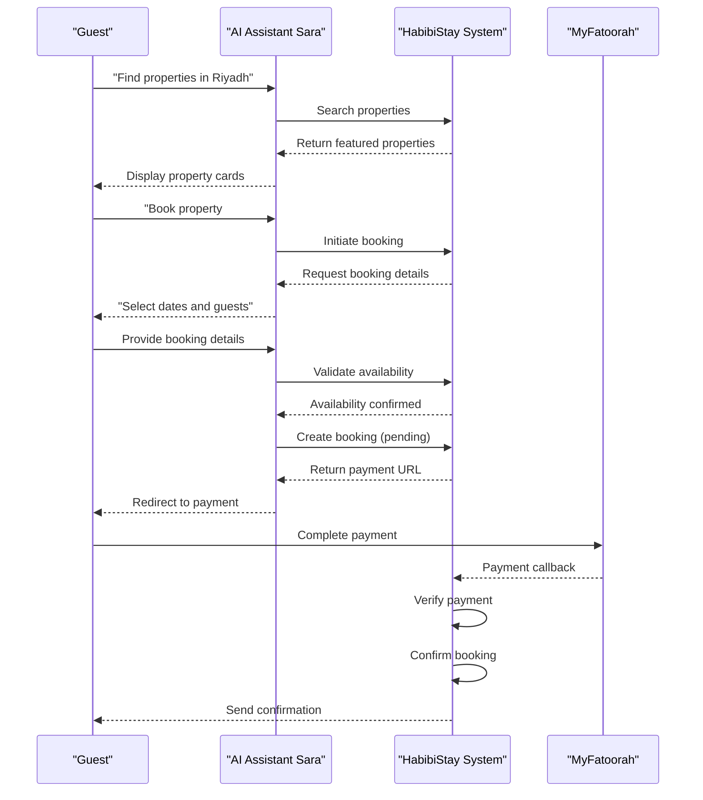

**Diagram sources**
- [ChatContext.tsx](file://src/react-app/contexts/ChatContext.tsx#L1-L452)
- [index.ts](file://src/worker/index.ts#L406-L445)
- [payment.ts](file://src/shared/payment.ts#L1-L165)

### Voice-Enabled Booking Journey

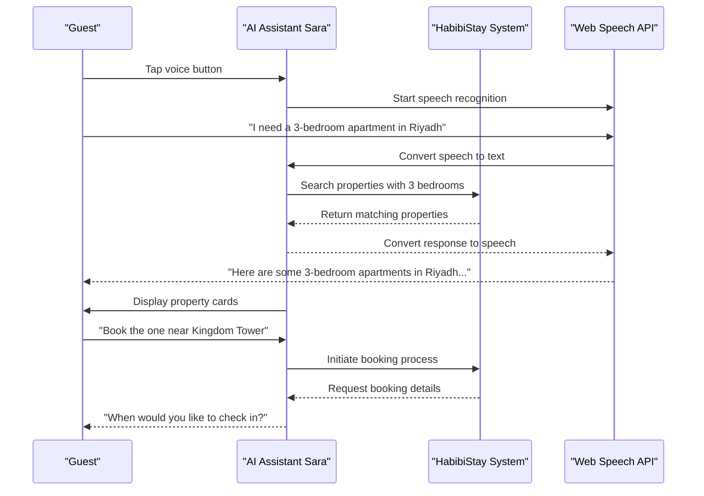

**Diagram sources**
- [ChatBot.tsx](file://src/react-app/components/ChatBot.tsx#L1-L451)
- [useVoiceInterface.ts](file://src/react-app/hooks/useVoiceInterface.ts#L1-L287)
- [ChatContext.tsx](file://src/react-app/contexts/ChatContext.tsx#L1-L452)

### Host Management Journey

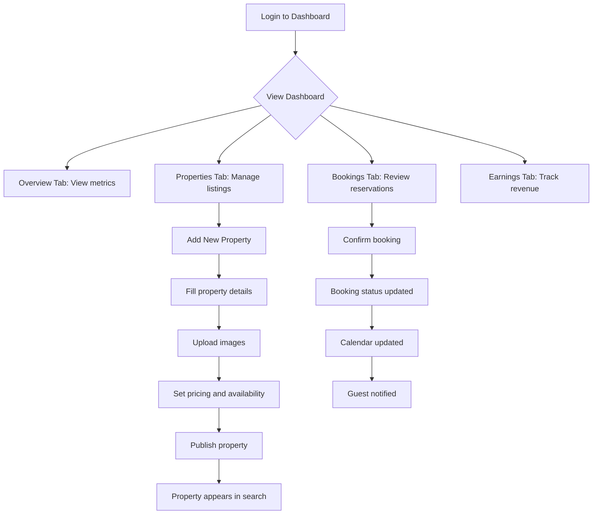

**Diagram sources**
- [Dashboard.tsx](file://src/react-app/pages/Dashboard.tsx#L1-L484)
- [types.ts](file://src/shared/types.ts#L1-L599)

### Wishlist Interaction Journey

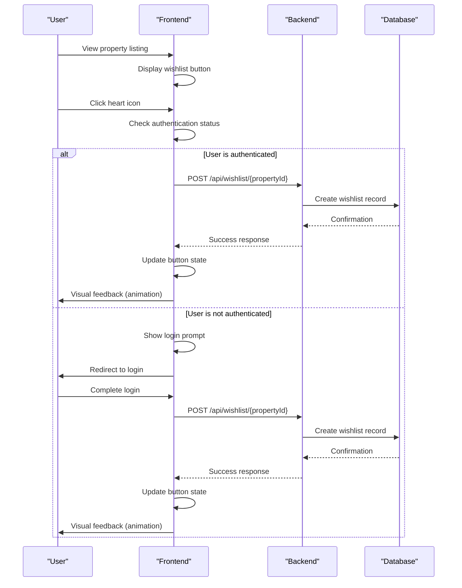

**Diagram sources**
- [WishlistButton.tsx](file://src/react-app/components/WishlistButton.tsx#L1-L118)
- [useWishlist.ts](file://src/react-app/hooks/useWishlist.ts#L1-L121)
- [PropertyDetail.tsx](file://src/react-app/pages/PropertyDetail.tsx#L75-L125)

### CMS Management Journey

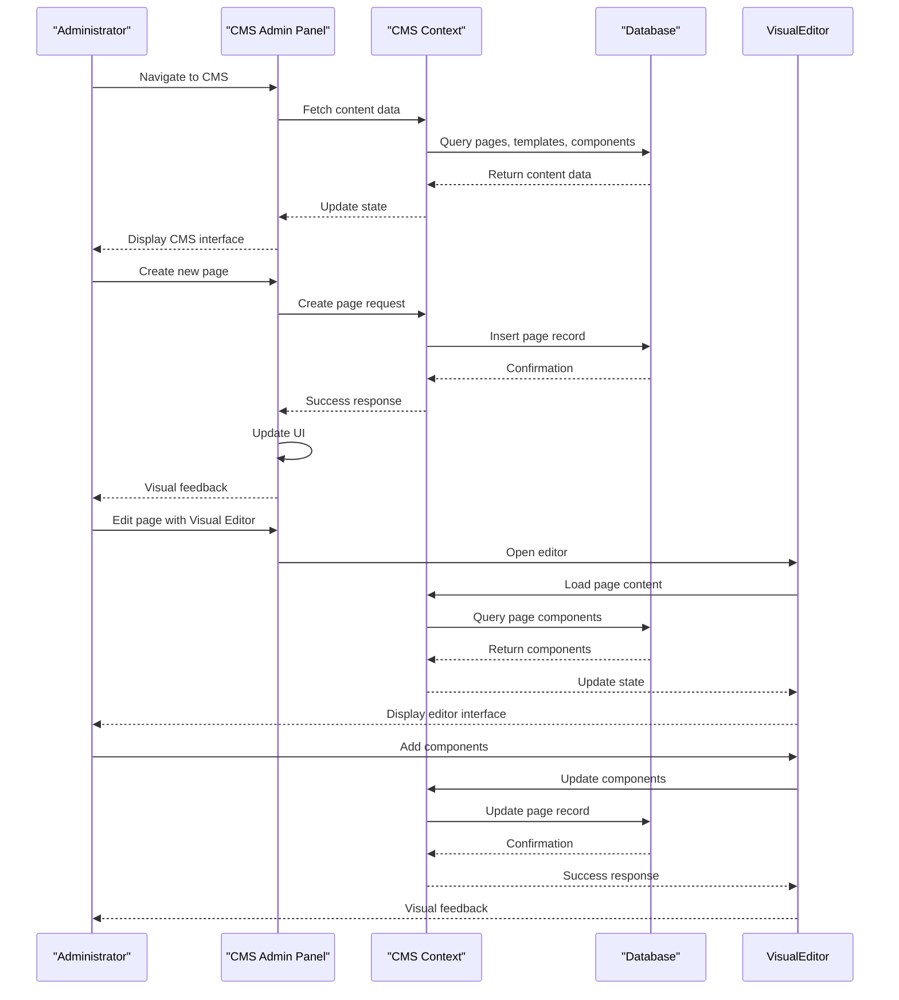

**Diagram sources**
- [CMSAdminPanel.tsx](file://src/react-app/components/admin/CMSAdminPanel.tsx#L1-L1141)
- [CMSContext.tsx](file://src/react-app/contexts/CMSContext.tsx#L1-L647)
- [VisualEditor.tsx](file://src/react-app/components/cms/VisualEditor.tsx#L1-L849)

### AI Content Generation Journey

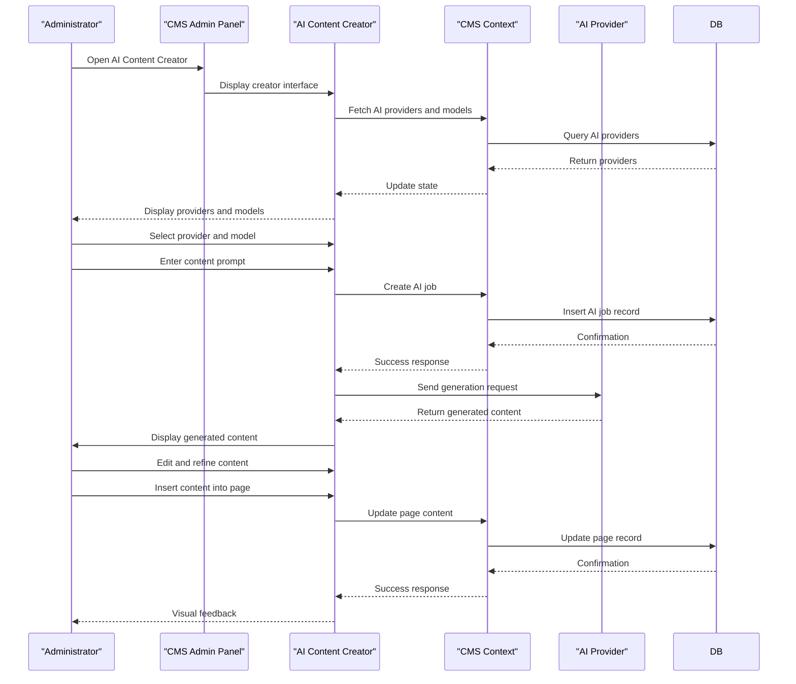

**Diagram sources**
- [CMSAdminPanel.tsx](file://src/react-app/components/admin/CMSAdminPanel.tsx#L1-L1141)
- [AIContentCreator.tsx](file://src/react-app/components/cms/AIContentCreator.tsx#L1-L351)
- [CMSContext.tsx](file://src/react-app/contexts/CMSContext.tsx#L1-L647)

These use case diagrams illustrate how users interact with multiple features simultaneously, demonstrating the integrated nature of the HabibiStay platform.