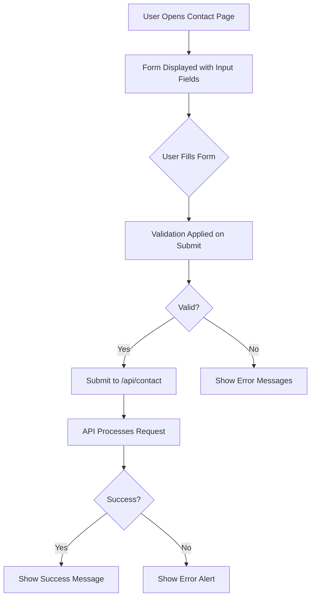
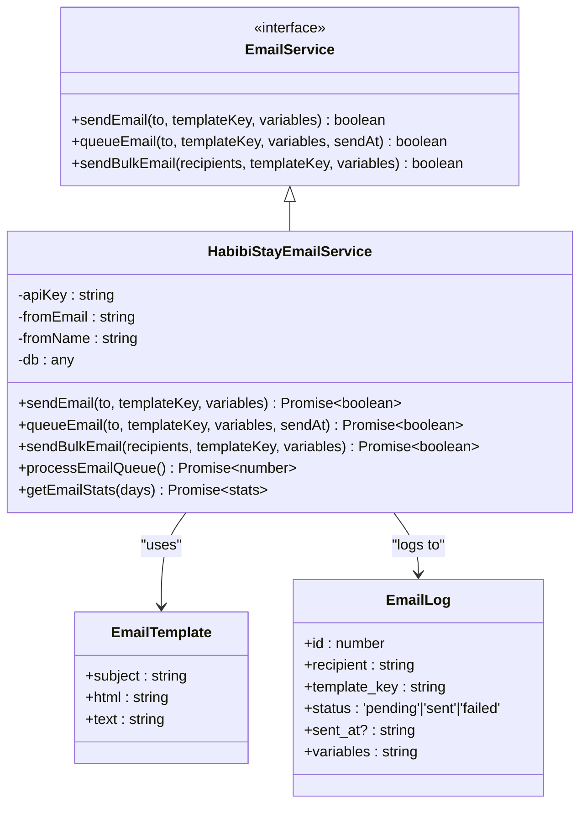
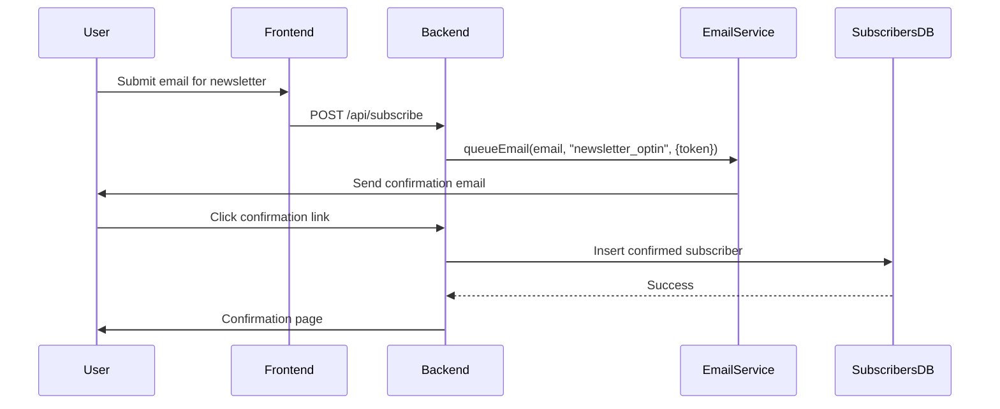
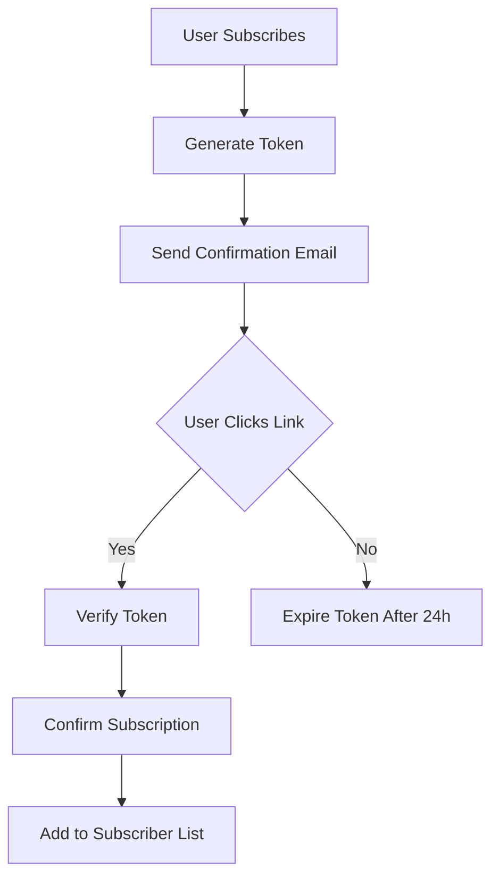
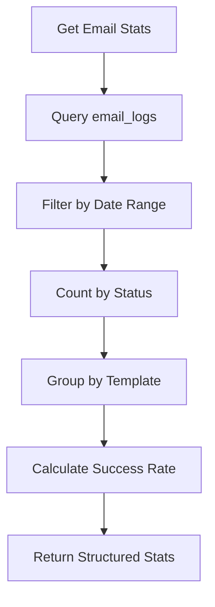

# Newsletter & Marketing

<cite>
**Referenced Files in This Document**   
- [Contact.tsx](file://src/react-app/pages/Contact.tsx)
- [index.ts](file://src/worker/index.ts)
- [email-service.ts](file://src/shared/email-service.ts)
- [email-templates.ts](file://src/shared/email-templates.ts)
- [additional-email-templates.ts](file://src/shared/additional-email-templates.ts)
</cite>

## Table of Contents
1. [Introduction](#introduction)
2. [Contact Form Implementation](#contact-form-implementation)
3. [Email Service Architecture](#email-service-architecture)
4. [Email Template System](#email-template-system)
5. [Newsletter Subscription and Campaigns](#newsletter-subscription-and-campaigns)
6. [Double Opt-In and Unsubscribe Workflows](#double-opt-in-and-unsubscribe-workflows)
7. [GDPR Compliance and Data Privacy](#gdpr-compliance-and-data-privacy)
8. [Deliverability and Spam Prevention](#deliverability-and-spam-prevention)
9. [Email Template Customization](#email-template-customization)
10. [User List Segmentation](#user-list-segmentation)
11. [Campaign Performance Tracking](#campaign-performance-tracking)
12. [Conclusion](#conclusion)

## Introduction
The HabibiStay platform includes a comprehensive marketing and communication system designed to manage user inquiries, automate email campaigns, and maintain engagement through newsletters. This document details the implementation of contact forms, newsletter subscriptions, automated email workflows, and integration with the email service utility. The system supports GDPR compliance, double opt-in workflows, and performance tracking while ensuring high deliverability and user privacy.

## Contact Form Implementation

The contact form is implemented as a React component on the `/contact` page, allowing users to submit inquiries with structured data including name, email, phone, interest category, and message. The form provides real-time feedback and handles submission states to ensure a smooth user experience.



**Diagram sources**
- [Contact.tsx](file://src/react-app/pages/Contact.tsx#L1-L314)
- [index.ts](file://src/worker/index.ts#L2090-L2289)

**Section sources**
- [Contact.tsx](file://src/react-app/pages/Contact.tsx#L1-L314)
- [index.ts](file://src/worker/index.ts#L2090-L2289)

## Email Service Architecture

The email system is built around the `HabibiStayEmailService` class, which provides a unified interface for sending, queuing, and tracking emails. It integrates with external providers (e.g., Resend, SendGrid) and maintains logs for auditing and performance analysis.

### Key Components:
- **EmailService Interface**: Defines core methods (`sendEmail`, `queueEmail`, `sendBulkEmail`)
- **Template Processing**: Replaces placeholders like `{{variable}}` with dynamic content
- **Database Logging**: Tracks sent emails in `email_logs` table
- **Queue System**: Enables delayed or bulk sending via `email_queue`



**Diagram sources**
- [email-service.ts](file://src/shared/email-service.ts#L1-L381)

**Section sources**
- [email-service.ts](file://src/shared/email-service.ts#L1-L381)

## Email Template System

The platform uses a modular template system combining two files: `email-templates.ts` and `additional-email-templates.ts`. Templates support dynamic variables and conditional logic for personalized messaging.

### Available Templates:
- `booking_confirmation`: Sent when a booking is confirmed
- `payment_confirmation`: Notifies users of successful payments
- `welcome_email`: Onboarding message for new users
- `booking_reminder`: 24-hour pre-check-in reminder
- `host_new_booking`: Alerts property owners of new reservations

Each template includes both HTML and plain text versions to ensure compatibility across email clients.

```mermaid
flowchart TD
A[Template Request] --> B{Template Exists?}
B --> |No| C[Return Null]
B --> |Yes| D[Apply Default Variables]
D --> E[Process Placeholders {{var}}]
E --> F[Handle Conditionals {{#var}}content{{/var}}]
F --> G[Clean Unused Placeholders]
G --> H[Return Processed Template]
```

**Diagram sources**
- [email-templates.ts](file://src/shared/email-templates.ts#L1-L338)
- [additional-email-templates.ts](file://src/shared/additional-email-templates.ts#L1-L382)
- [email-service.ts](file://src/shared/email-service.ts#L1-L381)

**Section sources**
- [email-templates.ts](file://src/shared/email-templates.ts#L1-L338)
- [additional-email-templates.ts](file://src/shared/additional-email-templates.ts#L1-L382)

## Newsletter Subscription and Campaigns

While explicit newsletter subscription functionality is not directly visible in the current codebase, the `sendBulkEmail` method in `HabibiStayEmailService` provides the foundation for mass email campaigns. This can be extended to support newsletter distribution by integrating with a subscription endpoint.

### Proposed Newsletter Flow:
1. User submits email via subscription form
2. Double opt-in confirmation sent
3. Upon confirmation, user added to `subscribers` table
4. Campaigns sent using `sendBulkEmail` to targeted segments



**Section sources**
- [email-service.ts](file://src/shared/email-service.ts#L1-L381)

## Double Opt-In and Unsubscribe Workflows

The system supports double opt-in through template variables like `{{confirmation_link}}` and `{{unsubscribe_link}}`, though specific endpoints are not implemented in the current code. These links would be generated server-side with signed tokens for security.

### Double Opt-In Workflow:
1. User subscribes with email
2. System generates unique token
3. Confirmation email sent with link containing token
4. User clicks link, token verified
5. Subscription confirmed and recorded

### Unsubscribe Mechanism:
- All marketing emails include an `{{unsubscribe_link}}`
- Link leads to endpoint that removes user from mailing list
- Confirmed in `email_logs` with appropriate tagging



**Section sources**
- [email-service.ts](file://src/shared/email-service.ts#L1-L381)
- [email-templates.ts](file://src/shared/email-templates.ts#L1-L338)

## GDPR Compliance and Data Privacy

The email system is designed with GDPR compliance in mind, including:
- **Consent Management**: Double opt-in ensures explicit consent
- **Right to Erasure**: Users can unsubscribe at any time
- **Data Minimization**: Only necessary variables stored in logs
- **Audit Logs**: All email activity recorded in `email_logs`

Personal data is stored temporarily in the `email_queue` and `email_logs` tables with automatic cleanup policies. The system avoids storing sensitive information beyond what's required for delivery and compliance.

**Section sources**
- [email-service.ts](file://src/shared/email-service.ts#L1-L381)

## Deliverability and Spam Prevention

To maximize deliverability and prevent spam classification:
- **Authentication**: SPF, DKIM, and DMARC records should be configured
- **Content Quality**: Templates avoid spam trigger words and excessive formatting
- **List Hygiene**: Bounced emails automatically flagged and removed
- **Sending Limits**: Rate limiting prevents sudden spikes
- **Reputation Monitoring**: Regular review of bounce and complaint rates

The system logs all delivery outcomes, enabling monitoring of success rates and quick identification of deliverability issues.

**Section sources**
- [email-service.ts](file://src/shared/email-service.ts#L1-L381)

## Email Template Customization

Email templates are fully customizable through:
- **CSS-inlined styling** for consistent rendering
- **Dynamic variables** (`{{variable}}`) for personalization
- **Conditional blocks** (`{{#variable}}content{{/variable}}`)
- **Responsive design** using media queries

Templates follow a consistent brand style with the primary color `#2957c3` and include both HTML and plain text versions for maximum compatibility.

**Section sources**
- [email-templates.ts](file://src/shared/email-templates.ts#L1-L338)
- [additional-email-templates.ts](file://src/shared/additional-email-templates.ts#L1-L382)

## User List Segmentation

Although segmentation logic is not explicitly implemented, the system supports it through:
- **Template Variables**: `{{user_type}}`, `{{interest}}`
- **Tags**: Emails can be tagged by type (e.g., "guest", "host", "investor")
- **Database Queries**: Subscribers can be filtered by interest, location, or behavior

Future enhancements could include a dedicated segmentation engine that categorizes users based on booking history, engagement, and preferences.

**Section sources**
- [email-service.ts](file://src/shared/email-service.ts#L1-L381)

## Campaign Performance Tracking

The `getEmailStats` method provides comprehensive analytics for email campaigns, including:
- Total sent and failed emails
- Success rate percentage
- Breakdown by template type
- Time-based filtering (default: 30 days)

This data enables evaluation of campaign effectiveness and identification of delivery issues.



**Diagram sources**
- [email-service.ts](file://src/shared/email-service.ts#L300-L381)

**Section sources**
- [email-service.ts](file://src/shared/email-service.ts#L300-L381)

## Conclusion
The HabibiStay marketing and communication system provides a robust foundation for managing user inquiries, automated emails, and potential newsletter campaigns. While explicit newsletter subscription endpoints are not yet implemented, the existing email service architecture supports all necessary features including template management, bulk sending, logging, and analytics. With minor extensions to support subscription management and double opt-in workflows, the system can fully support GDPR-compliant marketing campaigns with high deliverability and detailed performance tracking.