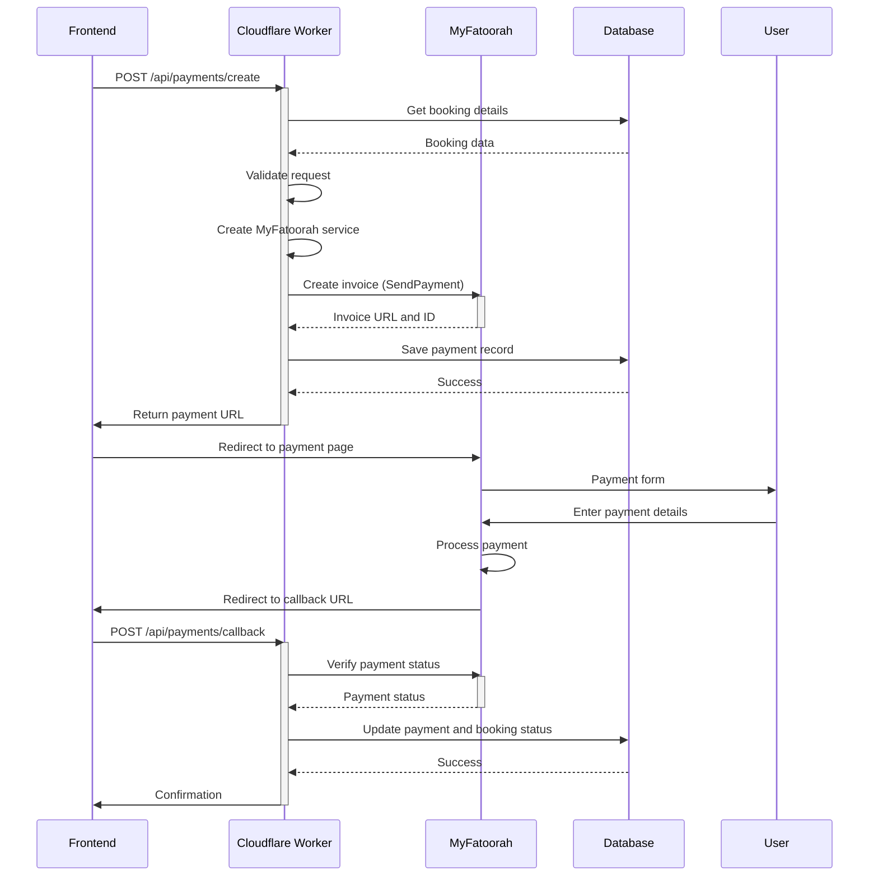
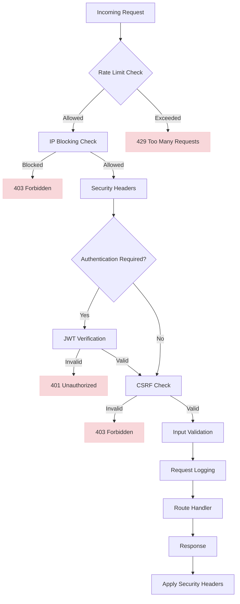

# Configuration and Security

<cite>
**Referenced Files in This Document**   
- [PaymentService.ts](file://src/server/services/PaymentService.ts)
- [payment.ts](file://src/shared/payment.ts)
- [index.ts](file://src/worker/index.ts)
- [wrangler.toml](file://wrangler.toml)
- [security-config.ts](file://src/shared/security-config.ts)
- [security-middleware.ts](file://src/shared/security-middleware.ts)
- [security-utils.ts](file://src/shared/security-utils.ts)
- [SECURITY.md](file://SECURITY.md)
</cite>

## Table of Contents
1. [Payment Configuration](#payment-configuration)
2. [Environment Variables and Injection Mechanism](#environment-variables-and-injection-mechanism)
3. [Cloudflare Workers Secrets Management](#cloudflare-workers-secrets-management)
4. [PCI Compliance and Data Handling](#pci-compliance-and-data-handling)
5. [Secure Payment Flow](#secure-payment-flow)
6. [Security Middleware and Route Protection](#security-middleware-and-route-protection)
7. [Logging and Audit Trails](#logging-and-audit-trails)
8. [Security Reviews and Best Practices](#security-reviews-and-best-practices)
9. [Secure Deployment Checklist](#secure-deployment-checklist)

## Payment Configuration

The HabibiStay platform integrates with MyFatoorah for payment processing, providing a secure and reliable payment gateway for users in the Middle East region. The payment configuration is implemented through a combination of shared utility classes and server-side services that abstract the MyFatoorah API integration.

The core payment functionality is defined in the `MyFatoorahService` class located in `src/shared/payment.ts`. This class encapsulates all interactions with the MyFatoorah API, providing methods for creating invoices, checking payment status, and canceling invoices. The service uses a clean interface that separates the business logic from the API implementation details.

```mermaid
classDiagram
class MyFatoorahService {
-apiKey : string
-baseUrl : string
+constructor(apiKey : string, baseUrl : string)
-makeRequest(endpoint : string, method : 'GET'|'POST', data? : any) : Promise~any~
+createInvoice(paymentData : PaymentRequest) : Promise~MyFatoorahCreateInvoiceResponse~
+getPaymentStatus(paymentId : string) : Promise~MyFatoorahPaymentStatusResponse~
+getInvoiceStatus(invoiceId : string) : Promise~MyFatoorahPaymentStatusResponse~
+cancelInvoice(invoiceId : string) : Promise~any~
}
class PaymentService {
-myFatoorahConfig : {apiKey : string, baseUrl : string, webhookSecret : string}
-paypalConfig : {clientId : string, clientSecret : string, mode : 'sandbox'|'live', webhookId : string}
+getPaymentProviders() : Promise~PaymentProvider[]~
+getPaymentMethods(provider : string, currency : string) : Promise~PaymentMethod[]~
+createPayment(request : PaymentRequest, provider : string) : Promise~PaymentResponse~
+verifyPayment(paymentId : string, provider : string) : Promise~PaymentResponse~
+processRefund(paymentId : string, amount : number, reason? : string) : Promise~RefundResponse~
+handleWebhook(payload : WebhookPayload) : Promise~void~
}
MyFatoorahService --> PaymentService : "used by"
```

**Diagram sources**
- [payment.ts](file://src/shared/payment.ts#L115-L164)
- [PaymentService.ts](file://src/server/services/PaymentService.ts#L71-L199)

**Section sources**
- [payment.ts](file://src/shared/payment.ts#L62-L164)
- [PaymentService.ts](file://src/server/services/PaymentService.ts#L108-L147)

## Environment Variables and Injection Mechanism

The MyFatoorah integration requires several environment variables to function correctly. These variables are injected into the application across different environments (development, staging, and production) through Cloudflare Workers' environment configuration.

The required environment variables for MyFatoorah integration are:

- **MYFATOORAH_API_KEY**: The API key provided by MyFatoorah for authentication
- **MYFATOORAH_BASE_URL**: The base URL for the MyFatoorah API (default: https://api.myfatoorah.com)
- **MYFATOORAH_WEBHOOK_SECRET**: Secret key for verifying webhook signatures
- **APP_URL**: The base URL of the application for callback URLs

These environment variables are accessed through the `process.env` object in the PaymentService constructor, where they are used to configure the MyFatoorah integration:

```typescript
this.myFatoorahConfig = {
  apiKey: process.env.MYFATOORAH_API_KEY || '',
  baseUrl: process.env.MYFATOORAH_BASE_URL || 'https://api.myfatoorah.com',
  webhookSecret: process.env.MYFATOORAH_WEBHOOK_SECRET || ''
};
```

The environment variables are injected differently across environments:

- **Development**: Loaded from local environment files or system environment variables
- **Staging**: Configured through Cloudflare Workers dashboard or wrangler CLI
- **Production**: Managed through Cloudflare Workers secrets system for enhanced security

The application also validates the presence of required environment variables through the `validateEnvironment` function in `security-config.ts`, which checks for critical security variables including `MYFATOORAH_API_KEY`.

**Section sources**
- [PaymentService.ts](file://src/server/services/PaymentService.ts#L71-L106)
- [security-config.ts](file://src/shared/security-config.ts#L200-L230)

## Cloudflare Workers Secrets Management

HabibiStay leverages Cloudflare Workers' secrets management system to securely store and access sensitive credentials, including the MyFatoorah API key. This approach ensures that sensitive information is never exposed in the codebase or version control.

The `wrangler.toml` configuration file defines the worker deployment settings but does not contain any secrets. Instead, secrets are managed through the Cloudflare dashboard or CLI using the `wrangler secret put` command:

```toml
name = "habibistay"
main = "src/worker/index.ts"
compatibility_date = "2024-03-06"

[[d1_databases]]
binding = "DB"
database_name = "habibistay"
database_id = "0198e085-9738-7b3f-a205-ec01ec5b130b"
```

In the worker code, the MyFatoorah service is instantiated using environment variables that are treated as secrets:

```typescript
function getMyFatoorahService(env: Env): MyFatoorahService {
  return new MyFatoorahService(
    env.MYFATOORAH_API_KEY,
    env.MYFATOORAH_API_URL || 'https://apitest.myfatoorah.com'
  );
}
```

The `env` parameter in Cloudflare Workers contains both regular environment variables and secrets, with secrets being encrypted at rest and only accessible at runtime. This separation ensures that even if the code is compromised, the actual API keys remain protected.

The security configuration also includes validation for required secrets:

```typescript
const required = [
  'JWT_SECRET',
  'OPENAI_API_KEY',
  'MYFATOORAH_API_KEY',
  'DATABASE_URL'
];
```

This validation ensures that the application cannot start without the necessary secrets being properly configured.

**Section sources**
- [wrangler.toml](file://wrangler.toml#L1-L8)
- [index.ts](file://src/worker/index.ts#L70-L75)
- [security-config.ts](file://src/shared/security-config.ts#L200-L230)

## PCI Compliance and Data Handling

HabibiStay maintains strict PCI DSS compliance by ensuring that no card data is handled or stored by the application. The payment architecture is designed to keep sensitive payment information out of the application's scope entirely.

According to the compliance configuration in `security-config.ts`:

```typescript
pciDss: {
  enabled: true,
  tokenizeCards: true,
  encryptTransmission: true,
  logCardAccess: true,
  requireStrongAuth: true
}
```

Key PCI compliance measures implemented:

- **Tokenization**: All card data is tokenized by MyFatoorah, with only payment tokens being processed by the application
- **No card data storage**: The application never stores full card numbers, CVV, or other sensitive cardholder data
- **Secure transmission**: All payment data is transmitted over HTTPS with HSTS enforcement
- **Minimal data access**: The application only receives payment status and transaction IDs, not detailed card information

The MyFatoorah API responses confirm this approach - while the `InvoiceTransactions` object includes a `CardNumber` field, this appears to be masked (e.g., "XXXX-XXXX-XXXX-1234") and is not stored by the application. The payment service only stores the transaction ID and invoice status in the database.

The security middleware also includes specific protections against data leakage:

```typescript
// Security headers prevent content sniffing and framing
'X-Content-Type-Options': 'nosniff',
'X-Frame-Options': 'DENY',
'Strict-Transport-Security': 'max-age=31536000; includeSubDomains; preload',
```

These headers ensure that payment-related content cannot be embedded in malicious sites or accessed through insecure channels.

**Section sources**
- [security-config.ts](file://src/shared/security-config.ts#L303-L336)
- [security-middleware.ts](file://src/shared/security-middleware.ts#L0-L63)
- [payment.ts](file://src/shared/payment.ts#L62-L113)

## Secure Payment Flow

The payment flow in HabibiStay follows a secure pattern that minimizes risk and ensures data protection throughout the transaction process. The flow involves coordinated interactions between the frontend, backend, and MyFatoorah payment gateway.



**Diagram sources**
- [index.ts](file://src/worker/index.ts#L1023-L1199)
- [payment.ts](file://src/shared/payment.ts#L115-L164)

**Section sources**
- [index.ts](file://src/worker/index.ts#L1023-L1199)
- [PaymentService.ts](file://src/server/services/PaymentService.ts#L315-L364)

The flow begins when the frontend requests payment creation, passing booking details and return URLs. The worker service then:

1. Retrieves booking details from the database
2. Creates a payment request with customer information and callback URLs
3. Calls MyFatoorah's SendPayment API to create an invoice
4. Stores the payment record with the invoice URL
5. Returns the payment URL to the frontend

After the user completes payment on MyFatoorah's secure page, they are redirected back to the application's callback endpoint. The callback handler then:

1. Verifies the payment status with MyFatoorah
2. Updates the payment and booking status in the database
3. Sends confirmation to the frontend

Throughout this process, sensitive data like the API key is protected by Cloudflare's secrets management, and all communication occurs over encrypted channels.

## Security Middleware and Route Protection

HabibiStay implements a comprehensive security middleware system to protect routes and prevent common web vulnerabilities. The middleware stack is applied to all API endpoints, with specific protections for payment-related routes.

The security middleware includes:

- **Rate limiting**: Prevents brute force attacks and API abuse
- **IP blocking**: Blocks suspicious IP addresses
- **Authentication**: JWT-based authentication for protected routes
- **CSRF protection**: Prevents cross-site request forgery
- **Input validation**: Sanitizes and validates all input data
- **Security headers**: Applies industry-standard security headers



**Diagram sources**
- [security-middleware.ts](file://src/shared/security-middleware.ts#L0-L199)
- [security-utils.ts](file://src/shared/security-utils.ts#L0-L200)

**Section sources**
- [security-middleware.ts](file://src/shared/security-middleware.ts#L0-L199)
- [security-utils.ts](file://src/shared/security-utils.ts#L0-L385)

The `authMiddleware` validates JWT tokens and stores user information in the request context:

```typescript
export const authMiddleware: MiddlewareHandler = async (c, next) => {
  const authHeader = c.req.header('Authorization');
  
  if (!authHeader || !authHeader.startsWith('Bearer ')) {
    return c.json({ error: 'Authentication required' }, 401);
  }
  
  const token = authHeader.substring(7);
  const payload = await verifyJWT(token);
  
  if (!payload) {
    return c.json({ error: 'Invalid or expired token' }, 401);
  }
  
  c.set('user', payload);
  c.set('userId', payload.sub);
  c.set('userRole', payload.role);
  
  await next();
};
```

Payment routes are protected by multiple layers of security, including rate limiting and input validation. The `inputValidationMiddleware` sanitizes request bodies to prevent XSS and other injection attacks:

```typescript
export const inputValidationMiddleware: MiddlewareHandler = async (c, next) => {
  if (['POST', 'PUT', 'PATCH'].includes(method)) {
    const body = await c.req.json();
    const sanitizedBody = sanitizeRequestBody(body);
    c.set('sanitizedBody', sanitizedBody);
  }
  await next();
};
```

## Logging and Audit Trails

HabibiStay implements comprehensive logging and audit trails to monitor security events and support incident investigation. The logging system captures important security-related events while ensuring sensitive data is properly redacted.

The audit logging is implemented through the `AuditLogger` class in `security-utils.ts`:

```typescript
export class AuditLogger {
  private logs: AuditLog[] = [];

  log(log: AuditLog): void {
    this.logs.push({
      ...log,
      timestamp: Date.now()
    });

    // Keep only last 10000 logs in memory
    if (this.logs.length > 10000) {
      this.logs = this.logs.slice(-10000);
    }

    // In production, send to external logging service
    console.log('AUDIT:', JSON.stringify(log));
  }
}
```

Key security events that are logged include:

- Authentication attempts (success and failure)
- Authorization decisions
- Rate limit violations
- Suspicious activity detection
- Payment processing events
- Configuration changes

The system logs sensitive events while redacting confidential information:

```typescript
auditLogger.log({
  userId: undefined,
  ip,
  action: 'INVALID_AUTH_TOKEN',
  resource: c.req.url,
  details: { token: token.substring(0, 10) + '...' },
  success: false
});
```

Note that even in error logs, only the first 10 characters of the token are included, followed by ellipsis, preventing full token exposure.

The `COMPLIANCE_CONFIG` specifies that card access should be logged:

```typescript
pciDss: {
  enabled: true,
  tokenizeCards: true,
  encryptTransmission: true,
  logCardAccess: true,
  requireStrongAuth: true
}
```

However, since the application does not handle card data directly, these logs would only record attempts to access payment information, not the card details themselves.

Administrative interfaces allow viewing security events and threats:

```typescript
app.get("/api/admin/security/events", authMiddleware, requireRole(['admin']), ...)
app.get("/api/admin/security/threats", authMiddleware, requireRole(['admin']), ...)
```

These endpoints provide administrators with visibility into security events while being protected by authentication and role-based access control.

**Section sources**
- [security-utils.ts](file://src/shared/security-utils.ts#L300-L385)
- [security-middleware.ts](file://src/shared/security-middleware.ts#L319-L385)
- [index.ts](file://src/worker/index.ts#L2355-L2419)

## Security Reviews and Best Practices

HabibiStay follows security best practices and conducts regular security reviews to maintain a high level of protection for user data and payment information.

The application implements several key security best practices:

### Input Validation and Sanitization
All user input is validated and sanitized using Zod schemas and sanitization functions:

```typescript
export const emailSchema = z.string().email('Invalid email format').max(255);
export const passwordSchema = z.string()
  .min(8, 'Password must be at least 8 characters')
  .regex(/^(?=.*[a-z])(?=.*[A-Z])(?=.*\d)(?=.*[@$!%*?&])/);
```

String sanitization removes potentially dangerous characters:

```typescript
export function sanitizeString(input: string): string {
  return input
    .trim()
    .replace(/[<>]/g, '')
    .replace(/['"]/g, '')
    .substring(0, 1000);
}
```

### Secure Configuration
The application validates environment configuration at startup:

```typescript
export function validateEnvironment(): { valid: boolean; errors: string[] } {
  const required = [
    'JWT_SECRET',
    'OPENAI_API_KEY',
    'MYFATOORAH_API_KEY',
    'DATABASE_URL'
  ];
  
  // Validate JWT secret length
  if (process.env.JWT_SECRET && process.env.JWT_SECRET.length < 32) {
    errors.push('JWT_SECRET must be at least 32 characters long');
  }
}
```

### Regular Security Reviews
The SECURITY.md file outlines procedures for security reviews, vulnerability reporting, and incident response. Key practices include:

- Regular dependency updates and vulnerability scanning
- Code reviews focusing on security implications
- Penetration testing for critical functionality
- Security training for development team members

### Data Protection
The application implements data protection measures including:

- Encryption in transit (HTTPS with HSTS)
- Sensitive data redaction in logs
- Role-based access control
- Session management with secure flags

### Monitoring and Alerting
The system monitors for suspicious activity and can automatically block IPs after multiple failed attempts:

```typescript
export class IPSecurity {
  private blockedIPs = new Set<string>();
  private suspiciousActivity = new Map<string, { count: number; lastAttempt: number }>();

  recordSuspiciousActivity(ip: string): boolean {
    // Block after 10 suspicious activities
    if (activity.count >= 10) {
      this.blockIP(ip);
      return true;
    }
    return false;
  }
}
```

**Section sources**
- [security-config.ts](file://src/shared/security-config.ts#L200-L336)
- [security-utils.ts](file://src/shared/security-utils.ts#L0-L385)
- [SECURITY.md](file://SECURITY.md)

## Secure Deployment Checklist

To ensure secure deployment of the HabibiStay application, follow this comprehensive checklist:

### Environment Configuration
- [ ] Set `NODE_ENV=production` in production environment
- [ ] Configure `JWT_SECRET` with at least 32 random characters
- [ ] Set `MYFATOORAH_API_KEY` using Cloudflare Workers secrets
- [ ] Configure `DATABASE_URL` with proper credentials
- [ ] Set `DOMAIN_NAME` for production deployment
- [ ] Configure SSL certificates if not using Cloudflare SSL

### Security Settings
- [ ] Enable HSTS header for HTTPS enforcement
- [ ] Configure Content Security Policy with appropriate directives
- [ ] Set up rate limiting appropriate for expected traffic
- [ ] Configure CORS with only trusted origins
- [ ] Enable database query logging only in development
- [ ] Ensure SSL is enabled for database connections

### Payment Configuration
- [ ] Verify MyFatoorah API key has appropriate permissions
- [ ] Set `MYFATOORAH_BASE_URL` to production endpoint
- [ ] Configure webhook URL in MyFatoorah dashboard
- [ ] Test payment flow in sandbox mode before production
- [ ] Set up payment notification emails
- [ ] Verify callback and error URLs are accessible

### Monitoring and Logging
- [ ] Configure external logging service for audit logs
- [ ] Set up monitoring for API error rates
- [ ] Configure alerts for security events (failed logins, etc.)
- [ ] Establish regular log review process
- [ ] Set up performance monitoring for payment endpoints

### Key Rotation Procedures
- [ ] Schedule regular rotation of `JWT_SECRET` (recommended: quarterly)
- [ ] Plan for MyFatoorah API key rotation (recommended: biannually)
- [ ] Document key rotation procedure for operations team
- [ ] Test key rotation in staging environment first
- [ ] Coordinate key rotation with MyFatoorah support if needed

### Backup and Recovery
- [ ] Verify database backups are configured and tested
- [ ] Document disaster recovery procedure
- [ ] Test restore procedure from backups
- [ ] Ensure payment data can be recovered if needed

Following this checklist will help ensure that the HabibiStay application is deployed securely with proper protection for payment information and user data.

**Section sources**
- [security-config.ts](file://src/shared/security-config.ts)
- [security-utils.ts](file://src/shared/security-utils.ts)
- [SECURITY.md](file://SECURITY.md)
- [wrangler.toml](file://wrangler.toml)