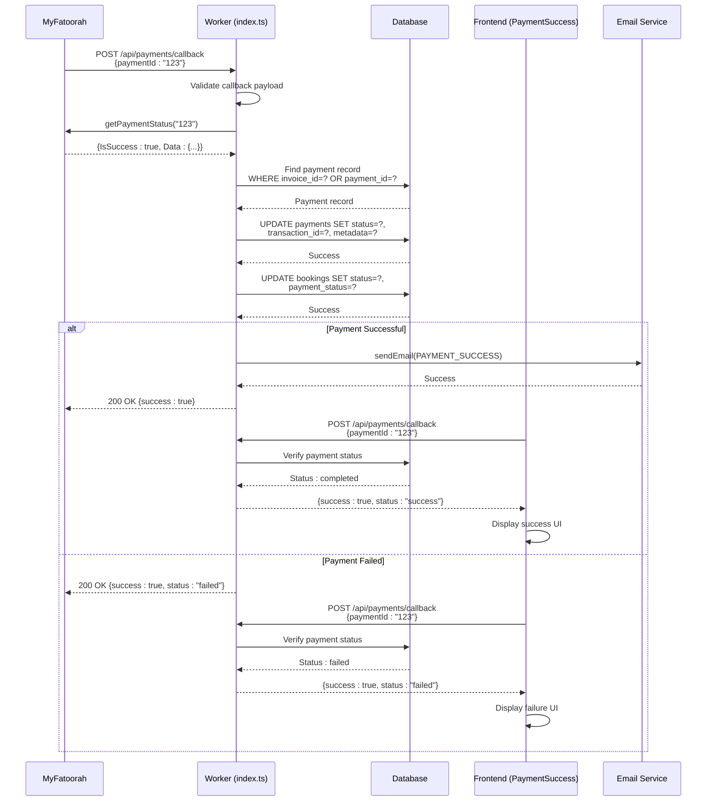

# Payment Callback Handling

<cite>
**Referenced Files in This Document**   
- [index.ts](file://src/worker/index.ts#L1113-L1309)
- [payment.ts](file://src/shared/payment.ts#L37-L41)
- [PaymentSuccess.tsx](file://src/react-app/pages/PaymentSuccess.tsx#L0-L222)
- [PaymentCancel.tsx](file://src/react-app/pages/PaymentCancel.tsx#L0-L114)
- [types.ts](file://src/shared/types.ts#L500-L550)
- [PaymentModal.tsx](file://src/react-app/components/PaymentModal.tsx#L0-L167)
</cite>

## Table of Contents
1. [Payment Callback Handling](#payment-callback-handling)
2. [Webhook Endpoint Definition](#webhook-endpoint-definition)
3. [Callback Verification Mechanism](#callback-verification-mechanism)
4. [Payment Status Synchronization](#payment-status-synchronization)
5. [Frontend Redirection Logic](#frontend-redirection-logic)
6. [Edge Case Handling](#edge-case-handling)
7. [Error Handling and Logging](#error-handling-and-logging)
8. [Sequence Diagram](#sequence-diagram)

## Webhook Endpoint Definition

The payment callback endpoint is defined in the worker application to receive payment status updates from MyFatoorah. The endpoint is configured to handle POST requests with JSON validation using Zod schema.

```typescript
app.post("/api/payments/callback", zValidator("json", PaymentCallbackSchema), async (c) => {
  const { paymentId, Id, InvoiceId } = c.req.valid("json");
  
  try {
    const myfatoorah = getMyFatoorahService(c.env);
    const keyToUse = paymentId || Id || InvoiceId;
    
    if (!keyToUse) {
      return c.json<ApiResponse>({
        success: false,
        error: "Missing payment identifier",
      }, 400);
    }
    
    // Get payment status from MyFatoorah
    const statusResponse = await myfatoorah.getPaymentStatus(keyToUse);
```

The `PaymentCallbackSchema` defines the expected structure of the callback payload, accepting three possible identifiers for payment lookup:

**PaymentCallbackSchema**
- `paymentId`: string (required)
- `Id`: string (optional)
- `InvoiceId`: string (optional)

This flexible identifier system allows the endpoint to process callbacks using any of the three identifiers that MyFatoorah might provide, ensuring compatibility with different callback scenarios and preventing missed updates due to identifier variations.

**Section sources**
- [index.ts](file://src/worker/index.ts#L1113-L1125)
- [payment.ts](file://src/shared/payment.ts#L37-L41)

## Callback Verification Mechanism

The payment callback system implements a robust verification mechanism to prevent spoofing and ensure the authenticity of incoming payment status updates. The verification process consists of multiple layers of validation and external verification.

When a callback is received, the system first validates the request payload using the `PaymentCallbackSchema`. After basic validation, the system uses the provided identifier to query the MyFatoorah API directly to verify the payment status, rather than trusting the callback data at face value.

```typescript
// Get payment status from MyFatoorah
const statusResponse = await myfatoorah.getPaymentStatus(keyToUse);

if (statusResponse.IsSuccess) {
  const paymentData = statusResponse.Data;
  const isSuccessful = paymentData.InvoiceStatus === 'Paid';
  
  // Find the payment record
  const payment = await c.env.DB.prepare(`
    SELECT * FROM payments WHERE invoice_id = ? OR payment_id = ?
  `).bind(paymentData.InvoiceId.toString(), keyToUse).first();
```

The verification process follows these steps:
1. Extract the payment identifier from the callback payload
2. Use the identifier to query MyFatoorah's API for the current payment status
3. Validate the API response for success
4. Cross-reference the payment details with the local database record
5. Update the local records only after external verification

This approach prevents attackers from spoofing payment success by directly calling the callback endpoint, as the system always verifies the payment status with MyFatoorah's API before updating any records.

**Section sources**
- [index.ts](file://src/worker/index.ts#L1127-L1145)

## Payment Status Synchronization

The payment callback handler synchronizes status between Payment and Booking records to maintain data consistency across the system. When a valid callback is received and verified, the system updates both the payment record and the associated booking record in a coordinated manner.

```typescript
// Update payment status
const newStatus = isSuccessful ? 'completed' : 'failed';
await c.env.DB.prepare(`
  UPDATE payments SET 
    status = ?, 
    transaction_id = ?,
    payment_method = ?,
    metadata = ?,
    updated_at = CURRENT_TIMESTAMP
  WHERE id = ?
`).bind(
  newStatus,
  paymentData.InvoiceTransactions[0]?.TransactionId || null,
  paymentData.InvoiceTransactions[0]?.PaymentGateway || null,
  JSON.stringify(paymentData),
  (payment as any).id
).run();

// Update booking status
const bookingStatus = isSuccessful ? 'confirmed' : 'pending';
const paymentStatus = isSuccessful ? 'completed' : 'failed';

await c.env.DB.prepare(`
  UPDATE bookings SET 
    status = ?, 
    payment_status = ?,
    updated_at = CURRENT_TIMESTAMP
  WHERE id = ?
`).bind(bookingStatus, paymentStatus, (payment as any).booking_id).run();
```

The synchronization logic follows these rules:
- **Successful payments**: Payment status becomes 'completed', booking status becomes 'confirmed'
- **Failed payments**: Payment status becomes 'failed', booking status remains 'pending'

For successful payments, the system also triggers a confirmation email to the guest with booking details and transaction information. This ensures that all stakeholders are notified of the payment outcome through multiple channels.

The status synchronization is atomic in nature, with both updates executed sequentially within the same request context, ensuring that the system remains in a consistent state even if one update succeeds and the other fails.

**Section sources**
- [index.ts](file://src/worker/index.ts#L1147-L1180)

## Frontend Redirection Logic

The frontend implements a sophisticated redirection logic that handles user feedback after payment processing. When users complete or cancel a payment through MyFatoorah, they are redirected to dedicated success or cancellation pages with appropriate query parameters.

The PaymentModal component initiates the payment process and specifies the return and cancel URLs:

```typescript
// PaymentModal.tsx
body: JSON.stringify({
  booking_id: booking.id,
  amount: booking.total_amount,
  currency: 'SAR',
  return_url: `${window.location.origin}/payment/success`,
  cancel_url: `${window.location.origin}/payment/cancel`,
}),
```

The PaymentSuccess page receives the callback parameters and processes them to display appropriate feedback:

```typescript
// PaymentSuccess.tsx
const processPaymentCallback = async (paymentIdentifier: string) => {
  try {
    const response = await fetch('/api/payments/callback', {
      method: 'POST',
      headers: {
        'Content-Type': 'application/json',
      },
      body: JSON.stringify({
        paymentId: paymentIdentifier,
      }),
    });

    const data = await response.json();

    if (data.success) {
      setPaymentStatus(data.data.status === 'success' ? 'success' : 'failed');
      setTransactionId(data.data.transaction_id);
    } else {
      setPaymentStatus('failed');
    }
  } catch (error) {
    console.error('Payment callback processing failed:', error);
    setPaymentStatus('failed');
  } finally {
    setProcessing(false);
  }
};
```

The redirection flow works as follows:
1. User completes payment on MyFatoorah's payment page
2. MyFatoorah redirects user to `/payment/success` with payment identifiers as query parameters
3. PaymentSuccess page extracts the payment identifier from URL parameters
4. Frontend calls the backend callback endpoint to verify payment status
5. User receives visual feedback based on the verified payment status

This two-step verification process ensures that the frontend displays accurate payment status even if users manipulate the URL parameters, as the final status is always verified with the backend.

**Section sources**
- [PaymentModal.tsx](file://src/react-app/components/PaymentModal.tsx#L45-L60)
- [PaymentSuccess.tsx](file://src/react-app/pages/PaymentSuccess.tsx#L15-L55)

## Edge Case Handling

The payment callback system includes comprehensive handling for various edge cases that may occur during the payment process, including delayed callbacks, duplicate notifications, and reconciliation scenarios.

### Delayed Callbacks
The system is designed to handle delayed callbacks by always verifying the current payment status with MyFatoorah's API rather than relying solely on the callback timing. This ensures that even if a callback is delayed due to network issues or MyFatoorah processing delays, the system will still process it correctly when it arrives.

### Duplicate Notifications
The callback endpoint is idempotent, meaning it can safely process the same callback multiple times without creating duplicate records or sending multiple confirmation emails. This is achieved through:

1. Using database constraints to prevent duplicate updates
2. Checking the current status before sending emails
3. Storing the full payment data in the metadata field for reconciliation

```typescript
// The system checks if payment exists before processing
const payment = await c.env.DB.prepare(`
  SELECT * FROM payments WHERE invoice_id = ? OR payment_id = ?
`).bind(paymentData.InvoiceId.toString(), keyToUse).first();

if (payment) {
  // Only update if status has changed
  const newStatus = isSuccessful ? 'completed' : 'failed';
  // Update logic here
}
```

### Reconciliation Strategies
For reconciliation, the system stores the complete MyFatoorah response in the payment metadata field as JSON. This allows administrators to manually verify payment details if discrepancies arise. Additionally, the system could implement a periodic reconciliation job that:

1. Queries MyFatoorah for all payments within a date range
2. Compares with local payment records
3. Identifies and resolves any discrepancies
4. Logs reconciliation results for audit purposes

The system also handles cases where the booking record might not exist by checking for the payment record first and only proceeding with booking updates if both records are found, preventing orphaned updates.

**Section sources**
- [index.ts](file://src/worker/index.ts#L1147-L1180)

## Error Handling and Logging

The payment callback system implements comprehensive error handling and logging to ensure reliability and facilitate troubleshooting. The error handling strategy follows a layered approach with both local and global error handling mechanisms.

The callback endpoint includes a try-catch block that captures and logs all errors:

```typescript
} catch (error) {
  console.error('Payment callback processing failed:', error);
  return c.json<ApiResponse>({
    success: false,
    error: "Failed to process payment callback",
  }, 500);
}
```

Key aspects of the error handling and logging strategy include:

**Error Types Handled:**
- Missing payment identifier (400 Bad Request)
- MyFatoorah API communication failures
- Database update failures
- Payment record not found
- Invalid callback data

**Logging Best Practices:**
- All errors are logged with full context using `console.error`
- The complete MyFatoorah response is stored in the payment metadata for debugging
- Email sending attempts are logged in the email_logs table
- Request processing is logged through the requestLoggingMiddleware

**Monitoring and Alerting Recommendations:**
1. Set up alerts for callback endpoint failures (5xx errors)
2. Monitor the frequency of callback processing errors
3. Implement a dead letter queue for failed callbacks that can be retried
4. Create dashboards showing payment success/failure rates
5. Set up alerts for discrepancies between MyFatoorah records and local records

The system should also implement retry logic for transient failures, with exponential backoff, to handle temporary issues with MyFatoorah's API or database connectivity.

**Section sources**
- [index.ts](file://src/worker/index.ts#L1195-L1209)

## Sequence Diagram

The following sequence diagram illustrates the complete payment callback flow from MyFatoorah notification to database update and user redirection:



**Diagram sources**
- [index.ts](file://src/worker/index.ts#L1113-L1309)
- [PaymentSuccess.tsx](file://src/react-app/pages/PaymentSuccess.tsx#L0-L222)