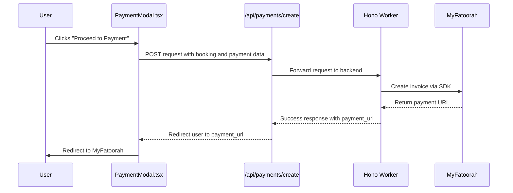

# Payment Initiation

<cite>
**Referenced Files in This Document**   
- [PaymentModal.tsx](file://src/react-app/components/PaymentModal.tsx)
- [index.ts](file://src/worker/index.ts)
- [payment.ts](file://src/shared/payment.ts)
- [PaymentSuccess.tsx](file://src/react-app/pages/PaymentSuccess.tsx)
- [PaymentCancel.tsx](file://src/react-app/pages/PaymentCancel.tsx)
</cite>

## Table of Contents
1. [Payment Initiation Overview](#payment-initiation-overview)
2. [Frontend Payment Flow](#frontend-payment-flow)
3. [Backend Payment Processing](#backend-payment-processing)
4. [Payment Request and Response Structure](#payment-request-and-response-structure)
5. [Error Handling and User Experience](#error-handling-and-user-experience)
6. [Security Practices](#security-practices)
7. [Payment Status Callback Flow](#payment-status-callback-flow)

## Payment Initiation Overview

The payment initiation process in HabibiStay enables users to securely complete bookings through integration with the MyFatoorah payment gateway. The flow begins when a user confirms a booking and triggers the `PaymentModal` component, which collects booking details and initiates a secure payment session. The backend, implemented using a Hono worker, handles the creation of a payment invoice via the MyFatoorah SDK and returns a redirect URL where the user completes the transaction. After payment, MyFatoorah redirects the user to success or cancellation pages, where the system processes the result and updates the booking status accordingly.

This document details the end-to-end payment flow, including frontend interaction, backend logic, API structure, error handling, and security practices.

## Frontend Payment Flow

The frontend payment initiation is managed by the `PaymentModal` component, which renders a secure interface for users to confirm their booking and proceed to payment.

### PaymentModal Component Analysis

The `PaymentModal` component displays a summary of the booking, including guest name, dates, number of guests, and total amount. It provides a "Proceed to Payment" button that triggers the payment creation API call.

Key features:
- **State Management**: Uses React `useState` hooks to manage processing state and error messages.
- **User Input Validation**: Relies on pre-validated booking data passed as props.
- **Secure Data Handling**: Sensitive data is not stored locally; only essential booking identifiers are sent to the backend.

```tsx
const handlePayment = async () => {
  setProcessing(true);
  setError(null);

  try {
    const response = await fetch('/api/payments/create', {
      method: 'POST',
      headers: { 'Content-Type': 'application/json' },
      body: JSON.stringify({
        booking_id: booking.id,
        amount: booking.total_amount,
        currency: 'SAR',
        return_url: `${window.location.origin}/payment/success`,
        cancel_url: `${window.location.origin}/payment/cancel`,
      }),
    });

    const data = await response.json();

    if (data.success) {
      window.location.href = data.data.payment_url;
    } else {
      setError(data.error || 'Failed to create payment');
    }
  } catch (error) {
    setError('Something went wrong. Please try again.');
  } finally {
    setProcessing(false);
  }
};
```

Upon successful response, the user is redirected to MyFatoorah's secure payment page.



**Diagram sources**
- [PaymentModal.tsx](file://src/react-app/components/PaymentModal.tsx#L25-L75)
- [index.ts](file://src/worker/index.ts#L1025-L1070)

**Section sources**
- [PaymentModal.tsx](file://src/react-app/components/PaymentModal.tsx#L1-L167)

## Backend Payment Processing

The backend logic for payment initiation is implemented in the Hono worker (`index.ts`) and uses the `MyFatoorahService` class to interface with the MyFatoorah API.

### Payment Creation Endpoint

The `/api/payments/create` endpoint validates incoming requests using `CreatePaymentSchema`, retrieves booking details from the database, and generates a payment session.

```ts
app.post("/api/payments/create", zValidator("json", CreatePaymentSchema), async (c) => {
  const { booking_id, amount, currency, return_url, cancel_url } = c.req.valid("json");
  
  const booking = await c.env.DB.prepare(`
    SELECT b.*, p.title as property_title 
    FROM bookings b 
    JOIN properties p ON b.property_id = p.id 
    WHERE b.id = ?
  `).bind(booking_id).first();
  
  if (!booking) {
    return c.json({ success: false, error: "Booking not found" }, 404);
  }
  
  if ((booking as any).payment_status === 'completed') {
    return c.json({ success: false, error: "Payment already completed" }, 400);
  }
  
  const myfatoorah = getMyFatoorahService(c.env);
  
  const paymentData = {
    InvoiceAmount: amount,
    CurrencyIso: currency,
    CustomerName: (booking as any).guest_name,
    CustomerEmail: (booking as any).guest_email,
    CustomerPhone: (booking as any).guest_phone || undefined,
    CallBackUrl: return_url,
    ErrorUrl: cancel_url,
    Language: 'en',
    DisplayCurrencyIso: currency,
    CustomerReference: `booking_${booking_id}`,
    UserDefinedField: JSON.stringify({ booking_id, property_title: (booking as any).property_title }),
  };
  
  const response = await myfatoorah.createInvoice(paymentData);
  
  if (response.IsSuccess) {
    await c.env.DB.prepare(`
      INSERT INTO payments (booking_id, payment_provider, invoice_id, amount, currency, payment_url, metadata)
      VALUES (?, ?, ?, ?, ?, ?, ?)
    `).bind(
      booking_id,
      'myfatoorah',
      response.Data.InvoiceId.toString(),
      amount,
      currency,
      response.Data.InvoiceURL,
      JSON.stringify(response.Data)
    ).run();
    
    await c.env.DB.prepare(`
      UPDATE bookings SET payment_status = 'pending', updated_at = CURRENT_TIMESTAMP WHERE id = ?
    `).bind(booking_id).run();
    
    return c.json({
      success: true,
      data: { payment_url: response.Data.InvoiceURL, invoice_id: response.Data.InvoiceId },
    });
  } else {
    throw new Error(response.Message);
  }
});
```

### Idempotency and Duplicate Prevention

The system prevents duplicate payments by:
- Checking the current `payment_status` of the booking before creating a new invoice.
- Using the booking ID as part of the `CustomerReference` field in the MyFatoorah request.
- Storing the `invoice_id` in the database to track payment attempts.

**Section sources**
- [index.ts](file://src/worker/index.ts#L1025-L1070)

## Payment Request and Response Structure

### Request Payload

The frontend sends the following JSON payload to `/api/payments/create`:

```json
{
  "booking_id": 123,
  "amount": 1500,
  "currency": "SAR",
  "return_url": "https://habibistay.com/payment/success",
  "cancel_url": "https://habibistay.com/payment/cancel"
}
```

Validated using `CreatePaymentSchema`:
```ts
export const CreatePaymentSchema = z.object({
  booking_id: z.number(),
  amount: z.number().positive(),
  currency: z.string().default('SAR'),
  return_url: z.string().url(),
  cancel_url: z.string().url(),
});
```

### Response Structure

Successful response:
```json
{
  "success": true,
  "data": {
    "payment_url": "https://myfatoorah.com/invoice/abc123",
    "invoice_id": 456
  }
}
```

Error response:
```json
{
  "success": false,
  "error": "Booking not found"
}
```

### MyFatoorah Integration Parameters

| Parameter | Value | Description |
|---------|-------|-------------|
| `InvoiceAmount` | `amount` | Total amount to charge |
| `CurrencyIso` | `currency` | Currency code (e.g., SAR) |
| `CustomerName` | Guest name from booking | Customer full name |
| `CustomerEmail` | Guest email from booking | Customer email |
| `CustomerPhone` | Optional guest phone | Customer contact number |
| `CallBackUrl` | `return_url` | Redirect on success |
| `ErrorUrl` | `cancel_url` | Redirect on cancellation/failure |
| `Language` | `"en"` | Interface language |
| `CustomerReference` | `"booking_123"` | Internal booking reference |
| `UserDefinedField` | JSON string | Additional metadata (booking ID, property title) |

**Section sources**
- [payment.ts](file://src/shared/payment.ts#L3-L35)
- [index.ts](file://src/worker/index.ts#L1045-L1065)

## Error Handling and User Experience

### Frontend Error Handling

The `PaymentModal` component handles errors during the API call:
- Network failures trigger a generic error message.
- Validation or business logic errors from the backend are displayed directly.
- A loading spinner prevents multiple submissions.

```tsx
{error && (
  <div className="bg-red-50 border border-red-200 rounded-lg p-3 mb-4">
    <p className="text-red-600 text-sm">{error}</p>
  </div>
)}
```

### Backend Error Handling

The backend uses structured error responses:
- **404 Not Found**: Booking does not exist.
- **400 Bad Request**: Invalid data or duplicate payment attempt.
- **500 Internal Server Error**: MyFatoorah API failure or database error.

Errors are logged for debugging:
```ts
console.error('Payment creation failed:', error);
```

### Post-Payment User Flow

After payment, MyFatoorah redirects to:
- **Success Page**: `/payment/success` — processes callback and displays confirmation.
- **Cancel Page**: `/payment/cancel` — informs user payment was cancelled.

```mermaid
flowchart TD
A[Payment Initiated] --> B{Payment Successful?}
B --> |Yes| C[/api/payments/callback]
B --> |No| D[PaymentCancel.tsx]
C --> E{Status = Paid?}
E --> |Yes| F[PaymentSuccess.tsx]
E --> |No| G[PaymentSuccess.tsx - Failed]
```

**Diagram sources**
- [PaymentSuccess.tsx](file://src/react-app/pages/PaymentSuccess.tsx#L1-L223)
- [PaymentCancel.tsx](file://src/react-app/pages/PaymentCancel.tsx#L1-L115)
- [index.ts](file://src/worker/index.ts#L1113-L1150)

**Section sources**
- [PaymentSuccess.tsx](file://src/react-app/pages/PaymentSuccess.tsx#L1-L223)
- [PaymentCancel.tsx](file://src/react-app/pages/PaymentCancel.tsx#L1-L115)

## Security Practices

### Environment-Based API Key Injection

The MyFatoorah API key is injected via environment variables, ensuring secrets are not hardcoded:

```ts
function getMyFatoorahService(env: Env): MyFatoorahService {
  return new MyFatoorahService(
    env.MYFATOORAH_API_KEY,
    env.MYFATOORAH_API_URL || 'https://apitest.myfatoorah.com'
  );
}
```

### Sensitive Data Sanitization

- Payment credentials are never stored in the frontend.
- The backend uses parameterized SQL queries to prevent injection.
- Personal data is handled through secure HTTP-only cookies.

### Secure Communication

- All payment-related endpoints use HTTPS.
- The `cors` middleware restricts origins to trusted domains.
- The `securityHeadersMiddleware` enforces secure HTTP headers.

```ts
app.use("*", cors({
  origin: ["http://localhost:5173", "https://*.habibistay.com"],
  credentials: true
}));
```

**Section sources**
- [index.ts](file://src/worker/index.ts#L25-L35)
- [payment.ts](file://src/shared/payment.ts#L107-L164)

## Payment Status Callback Flow

After the user completes or cancels payment on MyFatoorah's site, the system processes the result via the `/api/payments/callback` endpoint.

### Callback Request Structure

```json
{
  "paymentId": "pay_abc123",
  "Id": "inv_456",
  "InvoiceId": "inv_456"
}
```

Validated using `PaymentCallbackSchema`.

### Backend Callback Processing

The backend:
1. Validates the payment identifier.
2. Queries MyFatoorah for the latest status.
3. Updates the `payments` and `bookings` tables.
4. Sends a confirmation email if successful.

```ts
app.post("/api/payments/callback", zValidator("json", PaymentCallbackSchema), async (c) => {
  const { paymentId, Id, InvoiceId } = c.req.valid("json");
  const keyToUse = paymentId || Id || InvoiceId;

  const statusResponse = await myfatoorah.getPaymentStatus(keyToUse);

  if (statusResponse.IsSuccess) {
    const isSuccessful = statusResponse.Data.InvoiceStatus === 'Paid';
    
    // Update payment and booking records
    // Send email if successful
  }
});
```

This ensures the booking status is accurately reflected in the system.

**Section sources**
- [index.ts](file://src/worker/index.ts#L1113-L1150)
- [payment.ts](file://src/shared/payment.ts#L37-L41)