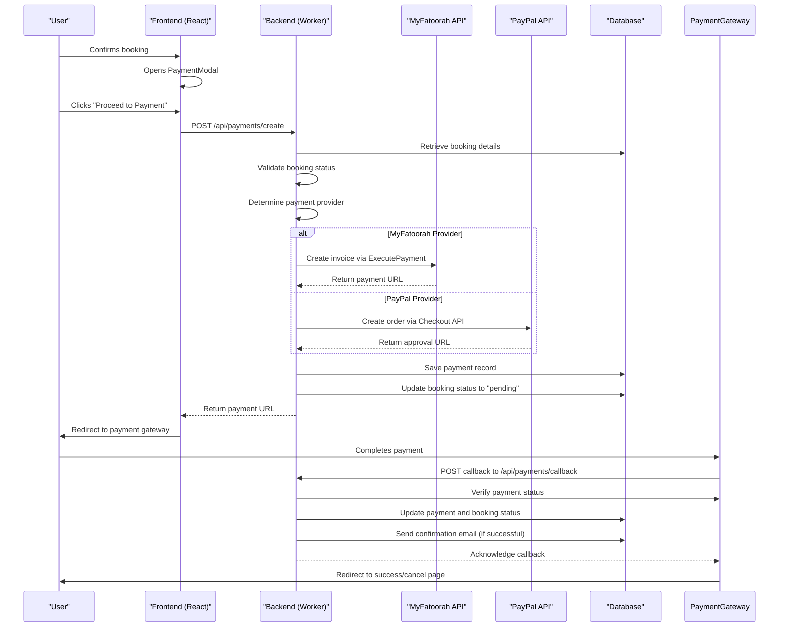
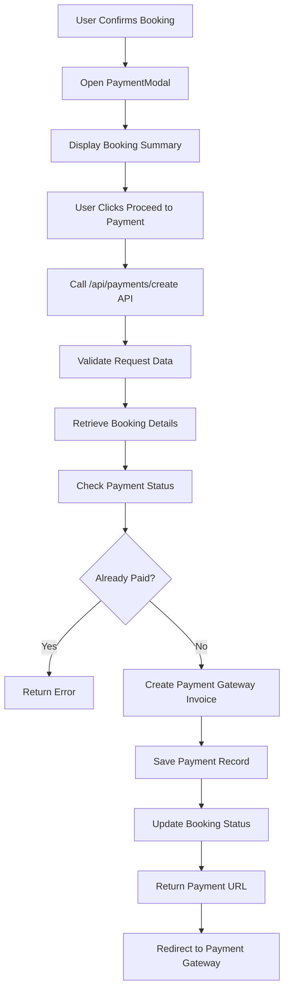
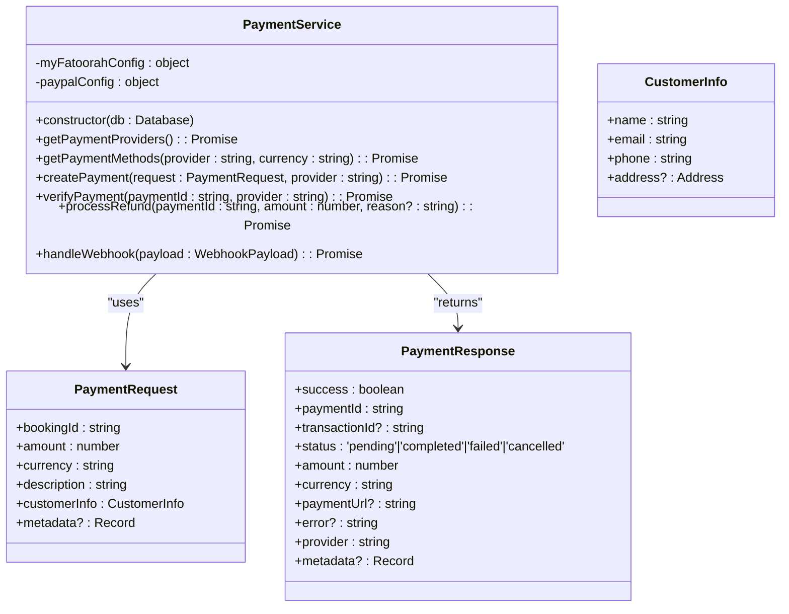
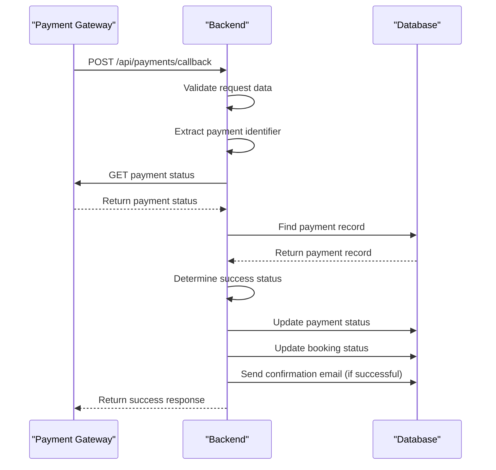
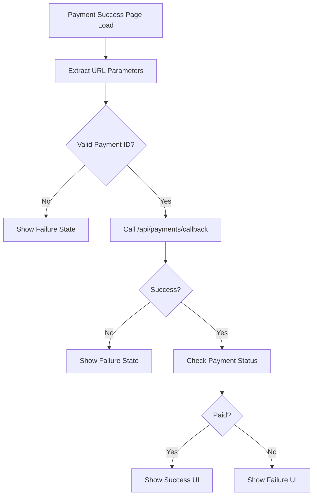
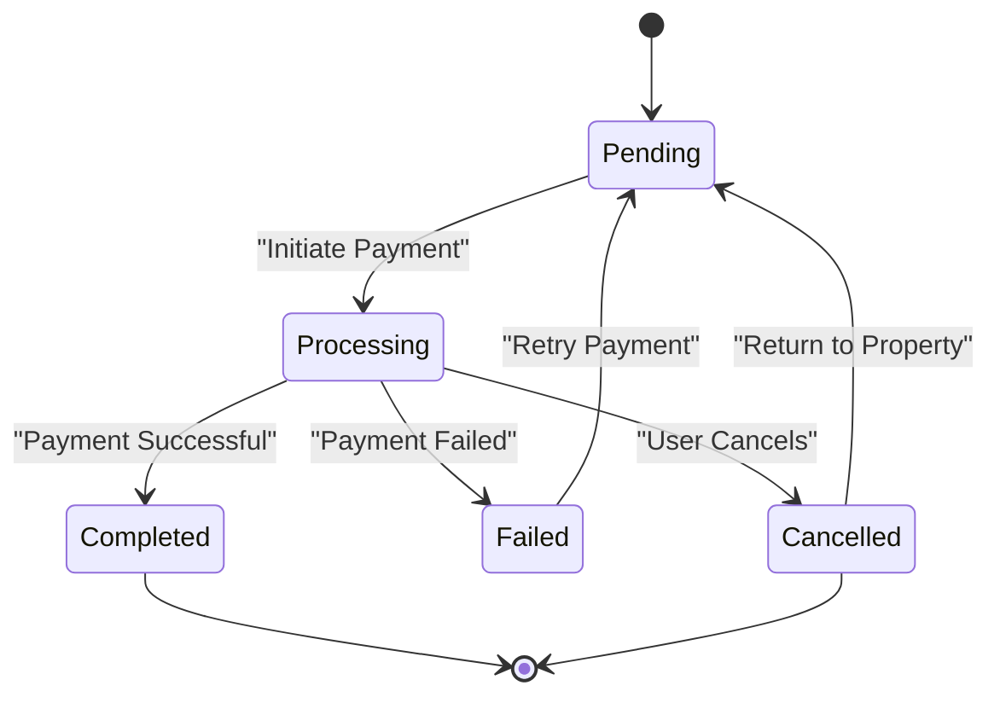

# Payment Processing

<cite>
**Referenced Files in This Document**   
- [PaymentModal.tsx](file://src/react-app/components/PaymentModal.tsx) - *Updated in recent commit*
- [PaymentSuccess.tsx](file://src/react-app/pages/PaymentSuccess.tsx)
- [PaymentCancel.tsx](file://src/react-app/pages/PaymentCancel.tsx)
- [payment.ts](file://src/shared/payment.ts)
- [index.ts](file://src/worker/index.ts)
- [PaymentService.ts](file://src/server/services/PaymentService.ts) - *Updated in recent commit*
</cite>

## Update Summary
**Changes Made**   
- Updated PaymentModal component documentation to reflect enhanced error handling, loading states, and security indicators
- Added information about PayPal integration and multi-provider support
- Updated configuration requirements to include PayPal environment variables
- Enhanced security and compliance section with webhook validation details
- Added refund processing and idempotency implementation details
- Updated code examples to reflect current implementation

## Table of Contents
1. [Payment Processing Overview](#payment-processing-overview)
2. [Payment Flow Architecture](#payment-flow-architecture)
3. [Payment Initiation](#payment-initiation)
4. [MyFatoorah Integration](#myfatoorah-integration)
5. [Callback Handling](#callback-handling)
6. [Payment Status Verification](#payment-status-verification)
7. [Error Handling and Reconciliation](#error-handling-and-reconciliation)
8. [Configuration Requirements](#configuration-requirements)
9. [Security and Compliance](#security-and-compliance)

## Payment Processing Overview

The payment processing system in HabibiStay facilitates secure transactions through multiple payment gateways, with MyFatoorah as the primary provider and PayPal as an additional option. The flow begins when a user confirms a booking and proceeds to payment. The system creates a payment session, redirects the user to the selected payment gateway's secure payment page, and handles the callback upon completion or cancellation. The architecture separates frontend components from backend services, ensuring secure handling of sensitive data while providing a seamless user experience.

The payment process involves several key components:
- **PaymentModal**: Collects payment initiation requests from users
- **Backend API endpoints**: Handle payment creation and callback processing
- **PaymentService**: Manages integration with payment providers
- **Database**: Stores payment records and updates booking statuses
- **Success and cancellation pages**: Handle post-payment user experiences

**Section sources**
- [PaymentModal.tsx](file://src/react-app/components/PaymentModal.tsx#L1-L167) - *Updated in recent commit*
- [PaymentSuccess.tsx](file://src/react-app/pages/PaymentSuccess.tsx#L1-L223)
- [PaymentCancel.tsx](file://src/react-app/pages/PaymentCancel.tsx#L1-L115)

## Payment Flow Architecture



**Diagram sources**
- [PaymentModal.tsx](file://src/react-app/components/PaymentModal.tsx#L45-L65) - *Updated in recent commit*
- [index.ts](file://src/worker/index.ts#L1000-L1076)
- [index.ts](file://src/worker/index.ts#L1078-L1117)
- [PaymentSuccess.tsx](file://src/react-app/pages/PaymentSuccess.tsx#L10-L30)
- [PaymentCancel.tsx](file://src/react-app/pages/PaymentCancel.tsx#L1-L115)

## Payment Initiation

The payment initiation process begins with the PaymentModal component, which collects user confirmation and triggers the payment workflow. When a user clicks "Proceed to Payment," the frontend sends a request to the backend API to create a payment session.

The PaymentModal displays booking details including guest name, check-in/check-out dates, number of guests, and total amount. It also shows accepted payment methods (Visa, Mastercard, Mada, Apple Pay, STC Pay, Tabby, and PayPal) and emphasizes SSL-secured processing.



**Section sources**
- [PaymentModal.tsx](file://src/react-app/components/PaymentModal.tsx#L45-L65) - *Updated in recent commit*
- [index.ts](file://src/worker/index.ts#L1000-L1076)

### PaymentModal Component

The PaymentModal component serves as the user interface for initiating payments. It accepts three props: `isOpen` (boolean), `onClose` (function), and `booking` (Booking object). When the modal is open, it displays a comprehensive booking summary and payment information.

The component manages its state with two React hooks: `processing` (boolean) to indicate when a payment request is being processed, and `error` (string or null) to display any error messages. The updated implementation includes enhanced loading states with a spinner animation and improved error handling with specific error messages.

```typescript
const handlePayment = async () => {
  setProcessing(true);
  setError(null);

  try {
    const response = await fetch('/api/payments/create', {
      method: 'POST',
      headers: {
        'Content-Type': 'application/json',
      },
      body: JSON.stringify({
        booking_id: booking.id,
        amount: booking.total_amount,
        currency: 'SAR',
        return_url: `${window.location.origin}/payment/success`,
        cancel_url: `${window.location.origin}/payment/cancel`,
      }),
    });

    const data = await response.json();

    if (data.success) {
      // Redirect to payment gateway
      window.location.href = data.data.payment_url;
    } else {
      setError(data.error || 'Failed to create payment');
    }
  } catch (error) {
    console.error('Payment error:', error);
    setError('Something went wrong. Please try again.');
  } finally {
    setProcessing(false);
  }
};
```

When the payment request is successful, the user is redirected to the payment gateway page via `window.location.href`. If an error occurs, it is displayed in the modal for user feedback. The component now includes a processing spinner during payment initiation and maintains disabled states on buttons to prevent duplicate submissions.

**Section sources**
- [PaymentModal.tsx](file://src/react-app/components/PaymentModal.tsx#L1-L167) - *Updated in recent commit*

## MyFatoorah Integration

The integration with MyFatoorah is handled through the PaymentService class, which provides a clean interface for interacting with multiple payment providers including MyFatoorah. The service is configured with API keys and base URLs from environment variables.

### PaymentService Class

The PaymentService class encapsulates all interactions with payment providers, providing methods for creating invoices, checking payment status, processing refunds, and handling webhooks.



**Diagram sources**
- [PaymentService.ts](file://src/server/services/PaymentService.ts#L81-L958) - *Updated in recent commit*

The service uses environment variables to configure payment providers and implements comprehensive error handling and logging for all operations.

### Payment Request Schema

The payment request data is validated using Zod schemas to ensure data integrity before sending to payment providers. The CreatePaymentSchema defines the required fields for creating a payment:

- **booking_id**: Numeric identifier for the booking
- **amount**: Positive number representing the payment amount
- **currency**: Currency code (default: 'SAR')
- **return_url**: URL to redirect on successful payment
- **cancel_url**: URL to redirect on payment cancellation or failure

The PaymentService also implements request validation to ensure all required fields are present and valid before processing payments.

**Section sources**
- [payment.ts](file://src/shared/payment.ts#L1-L41)
- [PaymentService.ts](file://src/server/services/PaymentService.ts#L400-L420) - *Updated in recent commit*

## Callback Handling

The callback handling system processes notifications from payment providers after a payment attempt, whether successful or failed. The backend endpoint `/api/payments/callback` receives the payment identifier and updates the system accordingly.

### Callback Endpoint Implementation



**Diagram sources**
- [index.ts](file://src/worker/index.ts#L1078-L1117)

The callback endpoint uses the PaymentCallbackSchema to validate incoming data and implements idempotency checks to prevent duplicate processing of the same webhook payload.

```typescript
app.post("/api/payments/callback", zValidator("json", PaymentCallbackSchema), async (c) => {
  const { paymentId, Id, InvoiceId } = c.req.valid("json");
  
  try {
    const myfatoorah = getMyFatoorahService(c.env);
    const keyToUse = paymentId || Id || InvoiceId;
    
    if (!keyToUse) {
      return c.json<ApiResponse>({
        success: false,
        error: "Missing payment identifier",
      }, 400);
    }
    
    // Get payment status from MyFatoorah
    const statusResponse = await myfatoorah.getPaymentStatus(keyToUse);
    
    if (statusResponse.IsSuccess) {
      const paymentData = statusResponse.Data;
      const isSuccessful = paymentData.InvoiceStatus === 'Paid';
      
      // Find the payment record
      const payment = await c.env.DB.prepare(`
        SELECT * FROM payments WHERE invoice_id = ? OR payment_id = ?
      `).bind(paymentData.InvoiceId.toString(), keyToUse).first();
      
      if (payment) {
        // Update payment status
        const newStatus = isSuccessful ? 'completed' : 'failed';
        await c.env.DB.prepare(`
          UPDATE payments SET 
            status = ?, 
            transaction_id = ?,
            payment_method = ?,
            metadata = ?,
            updated_at = CURRENT_TIMESTAMP
          WHERE id = ?
        `).bind(
          newStatus,
          paymentData.InvoiceTransactions[0]?.TransactionId || null,
          paymentData.InvoiceTransactions[0]?.PaymentGateway || null,
          JSON.stringify(paymentData),
          (payment as any).id
        ).run();
        
        // Update booking status
        const bookingStatus = isSuccessful ? 'confirmed' : 'pending';
        const paymentStatus = isSuccessful ? 'completed' : 'failed';
        
        await c.env.DB.prepare(`
          UPDATE bookings SET 
            status = ?, 
            payment_status = ?,
            updated_at = CURRENT_TIMESTAMP
          WHERE id = ?
        `).bind(bookingStatus, paymentStatus, (payment as any).booking_id).run();
        
        if (isSuccessful) {
          // Get booking details for email
          const booking = await c.env.DB.prepare(`
            SELECT b.*, p.title as property_title, p.location as property_location
            FROM bookings b 
            JOIN properties p ON b.property_id = p.id 
            WHERE b.id = ?
          `).bind((payment as any).booking_id).first();
          
          if (booking) {
            // Send payment success email
            await sendEmail(c.env, (booking as any).guest_email, EMAIL_TEMPLATES.PAYMENT_SUCCESS, {
              guest_name: (booking as any).guest_name,
              amount: (payment as any).amount,
              transaction_id: paymentData.InvoiceTransactions[0]?.TransactionId || 'N/A',
              payment_method: paymentData.InvoiceTransactions[0]?.PaymentGateway || 'Credit Card',
              payment_date: new Date().toLocaleDateString(),
            });
          }
        }
      }
      
      return c.json<ApiResponse>({
        success: true,
        data: {
          status: isSuccessful ? 'success' : 'failed',
          transaction_id: paymentData.InvoiceTransactions[0]?.TransactionId,
        },
      });
    } else {
      throw new Error(statusResponse.Message);
    }
  } catch (error) {
    console.error('Payment callback processing failed:', error);
    return c.json<ApiResponse>({
      success: false,
      error: "Failed to process payment callback",
    }, 500);
  }
});
```

After updating the payment and booking statuses, the system sends a confirmation email to the guest if the payment was successful, using the EMAIL_TEMPLATES.PAYMENT_SUCCESS template.

**Section sources**
- [index.ts](file://src/worker/index.ts#L1078-L1117)

## Payment Status Verification

The system implements multiple layers of payment status verification to ensure data consistency between HabibiStay's database and payment provider records.

### Real-time Verification

During the payment creation process, the system verifies the booking status before creating a payment session:

```typescript
if ((booking as any).payment_status === 'completed') {
  return c.json<ApiResponse>({
    success: false,
    error: "Payment already completed for this booking",
  }, 400);
}
```

This prevents duplicate payment attempts for already completed bookings.

### Post-payment Verification

After receiving a callback from a payment provider, the system verifies the payment status by checking the `InvoiceStatus` field in the response:

```typescript
const isSuccessful = paymentData.InvoiceStatus === 'Paid';
```

The system then updates both the payment record and the associated booking status in the database transactionally to maintain data consistency.

### Payment Success Page

The PaymentSuccess page implements client-side verification by processing the payment callback parameters and displaying appropriate content based on the result:

```typescript
useEffect(() => {
  const paymentId = searchParams.get('paymentId') || searchParams.get('Id');
  const invoiceId = searchParams.get('InvoiceId');
  
  if (paymentId || invoiceId) {
    processPaymentCallback(paymentId || invoiceId || '');
  } else {
    setPaymentStatus('failed');
    setProcessing(false);
  }
}, [searchParams]);
```

The page displays a loading state while processing the callback, then shows either a success or failure message with relevant details and next steps.



**Section sources**
- [PaymentSuccess.tsx](file://src/react-app/pages/PaymentSuccess.tsx#L10-L30)
- [index.ts](file://src/worker/index.ts#L1078-L1117)

## Error Handling and Reconciliation

The payment system implements comprehensive error handling at multiple levels to ensure reliability and data integrity.

### Frontend Error Handling

The PaymentModal component includes client-side error handling for network issues and API errors:

```typescript
try {
  // Payment request
} catch (error) {
  console.error('Payment error:', error);
  setError('Something went wrong. Please try again.');
} finally {
  setProcessing(false);
}
```

Error messages are displayed in the modal, providing immediate feedback to users. The updated implementation includes specific error states and maintains loading indicators during processing.

### Backend Error Handling

The backend implements structured error handling with appropriate HTTP status codes:

- **400 Bad Request**: Invalid or missing data
- **404 Not Found**: Booking not found
- **500 Internal Server Error**: System errors

```typescript
if (!booking) {
  return c.json<ApiResponse>({
    success: false,
    error: "Booking not found",
  }, 404);
}
```

The system also logs errors for monitoring and debugging:

```typescript
console.error('Payment creation failed:', error);
```

### Payment Cancellation Flow

When a user cancels a payment, they are redirected to the PaymentCancel page, which provides clear information and next steps:

- Reassures the user that no charges were applied
- Explains that the booking reservation is still held
- Provides options to return to the property, view the dashboard, or browse other properties
- Offers support contact options

The cancellation does not automatically void the booking; instead, it remains in a "pending" state, allowing the user to complete payment later.



**Section sources**
- [PaymentCancel.tsx](file://src/react-app/pages/PaymentCancel.tsx#L1-L115)
- [index.ts](file://src/worker/index.ts#L1000-L1076)

## Configuration Requirements

The payment system requires specific configuration to operate correctly, particularly for the payment provider integrations.

### Environment Variables

The system uses environment variables to store sensitive configuration data:

- **MYFATOORAH_API_KEY**: The API key for authenticating with MyFatoorah
- **MYFATOORAH_BASE_URL**: The base URL for the MyFatoorah API
- **MYFATOORAH_WEBHOOK_SECRET**: Secret for verifying webhook signatures
- **PAYPAL_CLIENT_ID**: Client ID for PayPal integration
- **PAYPAL_CLIENT_SECRET**: Client secret for PayPal integration
- **PAYPAL_MODE**: Environment mode (sandbox or live)
- **PAYPAL_WEBHOOK_ID**: Webhook ID for PayPal verification
- **APP_URL**: Base application URL for callback URLs

These variables are accessed through the Worker's environment bindings and passed to the payment service:

```typescript
function getPaymentService(env: Env): PaymentService {
  return new PaymentService(
    env.MYFATOORAH_API_KEY,
    env.MYFATOORAH_BASE_URL || 'https://api.myfatoorah.com',
    env.PAYPAL_CLIENT_ID,
    env.PAYPAL_CLIENT_SECRET,
    env.PAYPAL_MODE || 'sandbox'
  );
}
```

### API Endpoint Configuration

The payment system exposes several key API endpoints:

1. **POST /api/payments/create**: Creates a new payment session
2. **POST /api/payments/callback**: Handles callbacks from payment providers
3. **POST /api/payments/refund**: Processes payment refunds
4. **GET /api/payments/providers**: Retrieves available payment providers

These endpoints are protected by Zod validation to ensure data integrity:

```typescript
app.post("/api/payments/create", zValidator("json", CreatePaymentSchema), async (c) => {
  // Implementation
});
```

The CreatePaymentSchema validates the request data:

```typescript
export const CreatePaymentSchema = z.object({
  booking_id: z.number(),
  amount: z.number().positive(),
  currency: z.string().default('SAR'),
  return_url: z.string().url(),
  cancel_url: z.string().url(),
});
```

**Section sources**
- [index.ts](file://src/worker/index.ts#L41-L46)
- [payment.ts](file://src/shared/payment.ts#L30-L36)
- [PaymentService.ts](file://src/server/services/PaymentService.ts#L81-L958) - *Updated in recent commit*

## Security and Compliance

The payment system implements several security measures to protect sensitive data and comply with industry standards.

### PCI Compliance

The system follows PCI DSS guidelines by:

- **Not storing sensitive payment data**: Card details are handled entirely by payment providers
- **Using secure transmission**: All communication with payment providers uses HTTPS
- **Implementing proper authentication**: API keys are stored securely in environment variables
- **Validating input data**: Using Zod schemas to validate all incoming data

The PaymentModal explicitly states that payment processing is SSL-secured, providing transparency to users.

### Secure Token Handling

The system implements secure token handling practices:

- **API keys**: Stored in environment variables, never in code
- **Session tokens**: Handled by the authentication middleware
- **Payment identifiers**: Transmitted securely via HTTPS

The PaymentService ensures that API keys are included in the Authorization header for all requests:

```typescript
const headers: Record<string, string> = {
  'Authorization': `Bearer ${this.apiKey}`,
  'Content-Type': 'application/json',
};
```

### Idempotency

The payment creation process includes idempotency considerations by checking the booking's payment status before creating a new payment session:

```typescript
if ((booking as any).payment_status === 'completed') {
  return c.json<ApiResponse>({
    success: false,
    error: "Payment already completed for this booking",
  }, 400);
}
```

This prevents duplicate payments for the same booking. Additionally, the database schema includes unique constraints on payment records to prevent duplication. The webhook handling system also implements idempotency checks to prevent duplicate processing of the same webhook payload.

### Webhook Validation

The callback endpoint implements validation to ensure the integrity of incoming data:

- **Zod validation**: Validates the structure of the incoming JSON
- **Identifier verification**: Confirms that a valid payment identifier is provided
- **Database lookup**: Verifies that the payment record exists before updating
- **Signature verification**: Validates webhook signatures using HMAC-SHA256

The system also logs all callback processing attempts for audit and debugging purposes.

**Section sources**
- [payment.ts](file://src/shared/payment.ts#L115-L164)
- [index.ts](file://src/worker/index.ts#L1078-L1117)
- [PaymentModal.tsx](file://src/react-app/components/PaymentModal.tsx#L94-L129) - *Updated in recent commit*
- [PaymentService.ts](file://src/server/services/PaymentService.ts#L700-L750) - *Updated in recent commit*