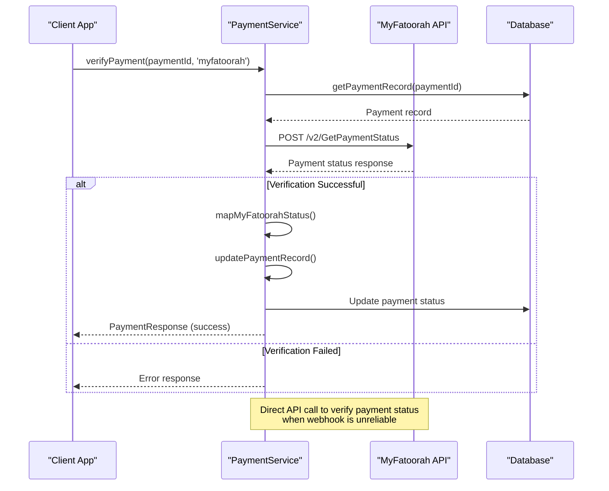
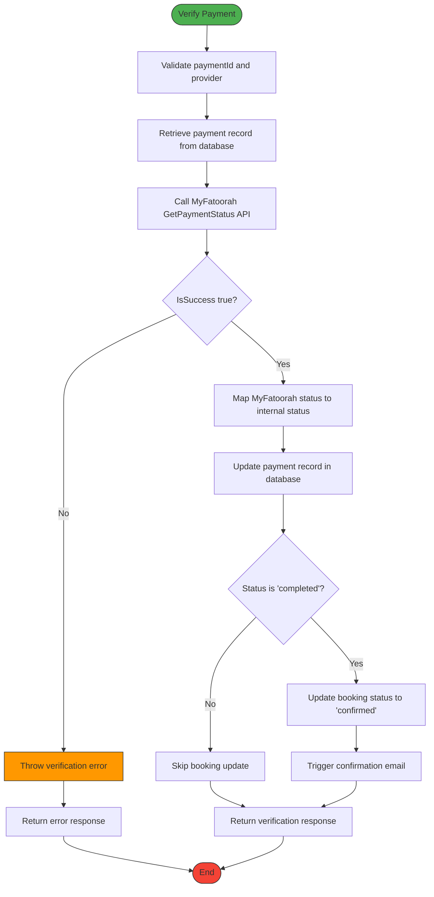

# Payment Status Verification

<cite>
**Referenced Files in This Document**   
- [PaymentService.ts](file://src/server/services/PaymentService.ts)
- [worker/index.ts](file://src/worker/index.ts)
- [shared/payment.ts](file://src/shared/payment.ts)
- [BookingService.ts](file://src/server/services/BookingService.ts)
</cite>

## Table of Contents
1. [Introduction](#introduction)
2. [Payment Verification Architecture](#payment-verification-architecture)
3. [MyFatoorah Payment Verification Implementation](#myfatoorah-payment-verification-implementation)
4. [API Endpoint Implementation](#api-endpoint-implementation)
5. [Database Transaction Handling](#database-transaction-handling)
6. [Downstream Actions and Booking Status Updates](#downstream-actions-and-booking-status-updates)
7. [Error Handling and Retry Strategies](#error-handling-and-retry-strategies)
8. [Timing Considerations and Verification Scenarios](#timing-considerations-and-verification-scenarios)
9. [Idempotency and Consistency Guarantees](#idempotency-and-consistency-guarantees)
10. [Monitoring and Manual Intervention](#monitoring-and-manual-intervention)

## Introduction
This document provides a comprehensive analysis of the payment status verification mechanism in HabibiStay, with a focus on the integration with MyFatoorah's payment gateway. The system implements a robust verification process to ensure transaction integrity, particularly in scenarios where webhook delivery might be unreliable. The documentation covers the backend logic for actively querying MyFatoorah's API, the implementation of the `/api/payments/verify` endpoint, authentication mechanisms, request validation using Zod, response formatting, and how verified payment data triggers downstream actions such as booking status updates and confirmation emails. The analysis includes code examples from key files such as `index.ts` and `payment.ts`, demonstrating API client usage and error retry strategies. The document also addresses critical aspects such as timing considerations for manual verification versus callback reliance, idempotency in status updates, database transaction handling for consistency, and procedures for monitoring unverified payments and manual intervention.

## Payment Verification Architecture

```mermaid
graph TD
A[Client Application] --> B[/api/payments/verify]
B --> C[Authentication Middleware]
C --> D[Request Validation]
D --> E[PaymentService.verifyPayment]
E --> F{Provider}
F --> |MyFatoorah| G[verifyMyFatoorahPayment]
F --> |PayPal| H[verifyPayPalPayment]
G --> I[MyFatoorah API]
H --> J[PayPal API]
I --> K[Payment Status Response]
J --> K
K --> L[updatePaymentRecord]
L --> M[Database]
K --> N[handlePaymentCompleted]
N --> O[Update Booking Status]
O --> P[Send Confirmation Email]
style A fill:#f9f,stroke:#333
style B fill:#bbf,stroke:#333
style M fill:#f96,stroke:#333
style P fill:#6f9,stroke:#333
```

**Diagram sources**
- [PaymentService.ts](file://src/server/services/PaymentService.ts)
- [worker/index.ts](file://src/worker/index.ts)

**Section sources**
- [PaymentService.ts](file://src/server/services/PaymentService.ts)
- [worker/index.ts](file://src/worker/index.ts)

## MyFatoorah Payment Verification Implementation

The MyFatoorah payment verification process is implemented in the `verifyMyFatoorahPayment` method within the `PaymentService` class. This method serves as a critical component for ensuring payment status accuracy when webhook notifications from MyFatoorah are not received or are delayed.

The verification process begins by retrieving the payment record from the database using the provided `paymentId`. This record contains essential information, including the `provider_transaction_id`, which corresponds to the invoice ID in MyFatoorah's system. The method then constructs a POST request to MyFatoorah's `GetPaymentStatus` endpoint, including the necessary authorization header with the API key and a JSON body containing the invoice ID and its type.

Upon receiving the response from MyFatoorah's API, the system performs validation to ensure the request was successful (`IsSuccess` flag). If successful, the raw status from MyFatoorah (e.g., "Paid", "Pending") is mapped to a standardized internal status ("completed", "pending") using the `mapMyFatoorahStatus` method. The method then constructs a `PaymentResponse` object containing the verification result, including the transaction status, amount, currency, and metadata from the MyFatoorah response.



**Diagram sources**
- [PaymentService.ts](file://src/server/services/PaymentService.ts#L348-L388)
- [shared/payment.ts](file://src/shared/payment.ts)

**Section sources**
- [PaymentService.ts](file://src/server/services/PaymentService.ts#L348-L388)

## API Endpoint Implementation

The `/api/payments/verify` endpoint is implemented within the worker's main application file (`index.ts`) and is responsible for exposing the payment verification functionality to external clients. The endpoint implementation follows a structured approach with authentication, request validation, and error handling.

The endpoint uses Hono framework's middleware for authentication (`authMiddleware`) to ensure that only authorized users can initiate payment verification requests. Request validation is performed using Zod, a TypeScript-first schema validation library. The `CreatePaymentSchema` and `PaymentCallbackSchema` defined in `shared/payment.ts` are used to validate the incoming request payload, ensuring that required fields such as `paymentId` are present and correctly formatted.

The implementation in `index.ts` routes the verification request to the `PaymentService` class, which handles the provider-specific verification logic. The `verifyPayment` method in `PaymentService` acts as a facade, delegating to the appropriate provider-specific verification method based on the payment provider specified in the request. This design promotes separation of concerns and makes the system extensible for additional payment providers.

The response is formatted according to the `PaymentResponse` interface, providing a consistent structure regardless of the underlying payment provider. The response includes fields such as `success`, `status`, `amount`, `currency`, and `metadata`, allowing the client application to make informed decisions based on the verification result.

**Section sources**
- [worker/index.ts](file://src/worker/index.ts)
- [shared/payment.ts](file://src/shared/payment.ts#L29-L41)
- [PaymentService.ts](file://src/server/services/PaymentService.ts#L172-L191)

## Database Transaction Handling

The payment verification system implements robust database transaction handling to ensure data consistency across related entities. When a payment is verified, multiple database operations are performed atomically to maintain integrity between the payment record and the associated booking.

The `updatePaymentRecord` method in `PaymentService` is responsible for updating the payment status in the database. It uses a parameterized SQL UPDATE statement to modify the `payments` table, setting the `status`, `provider_transaction_id`, `payment_url`, and `provider_metadata` fields based on the verification response. The method also updates the `updated_at` timestamp to reflect when the status was last modified.

The database operations are designed to be atomic and consistent. The `handlePaymentCompleted` method demonstrates a critical transaction pattern where both the payment status and the booking status are updated in sequence. First, the payment record is updated to "completed" status. Then, the system queries for the associated booking ID and updates the booking status to "confirmed". This two-step process ensures that payment confirmation directly triggers booking confirmation, maintaining the business logic that a booking cannot be confirmed without a successful payment.

The use of parameterized queries prevents SQL injection attacks, and the structured error handling ensures that any database operation failure is properly reported. The system does not use explicit database transactions for these operations, relying instead on the atomicity of individual SQL statements and the application-level error handling to maintain consistency.



**Diagram sources**
- [PaymentService.ts](file://src/server/services/PaymentService.ts#L752-L766)
- [PaymentService.ts](file://src/server/services/PaymentService.ts#L802-L823)

**Section sources**
- [PaymentService.ts](file://src/server/services/PaymentService.ts#L752-L766)
- [PaymentService.ts](file://src/server/services/PaymentService.ts#L802-L823)

## Downstream Actions and Booking Status Updates

The payment verification process triggers several critical downstream actions that are essential for the booking lifecycle in HabibiStay. When a payment is successfully verified and confirmed as completed, the system initiates a chain of events that transforms a pending booking into a confirmed reservation.

The primary downstream action is the update of the booking status from "pending" to "confirmed". This is handled by the `handlePaymentCompleted` method in `PaymentService`, which is called when the payment verification returns a "completed" status. The method first updates the payment record in the database to reflect the completed status, then queries for the associated booking ID, and finally updates the booking status to "confirmed". This status change is crucial as it makes the booking official and prevents double-booking of the same property.

Following the status update, the system triggers a confirmation email to the guest. This is implemented through the `sendBookingConfirmationEmail` method in `BookingService`, which is called as part of the booking confirmation process. The email service retrieves the booking details and sends a formatted confirmation message to the guest's email address, providing them with all necessary information about their reservation.

The integration between the payment and booking systems ensures that financial and reservation data remain synchronized. The `processRefund` method in `BookingService` demonstrates this integration by calling the `PaymentService` to process refunds when a booking is cancelled, ensuring that financial transactions are properly reflected in both systems.

**Section sources**
- [PaymentService.ts](file://src/server/services/PaymentService.ts#L802-L823)
- [BookingService.ts](file://src/server/services/BookingService.ts#L790-L821)

## Error Handling and Retry Strategies

The payment verification system implements comprehensive error handling to manage various failure scenarios that can occur during the verification process. The error handling strategy is designed to provide meaningful feedback to clients while maintaining system stability and data integrity.

In the `verifyMyFatoorahPayment` method, errors are caught and wrapped in descriptive error messages that include the original error message from MyFatoorah's API. This approach provides detailed information for debugging while maintaining a consistent error format for clients. The method throws a generic error with a prefix "MyFatoorah payment verification failed:" followed by the specific error message, allowing for easy identification of the source of the problem.

The system handles different types of errors appropriately. For example, if the MyFatoorah API returns a failure response (`!data.IsSuccess`), the system throws an error with the message from the API response. Network errors, authentication failures, and other HTTP-related issues are also caught and converted into meaningful error messages.

While the current implementation does not include explicit retry logic within the `verifyMyFatoorahPayment` method, the architecture supports retry strategies at the application level. The separation of concerns between the API endpoint and the service implementation allows for the addition of retry mechanisms in the future without modifying the core verification logic. For instance, a retry decorator or middleware could be added to automatically retry failed verification requests after a delay.

The error handling in the webhook processing (`handleWebhook` method) demonstrates a robust approach by logging errors and re-throwing them, ensuring that webhook processing failures are not silently ignored. This is critical for maintaining the reliability of the payment notification system.

**Section sources**
- [PaymentService.ts](file://src/server/services/PaymentService.ts#L348-L388)
- [PaymentService.ts](file://src/server/services/PaymentService.ts#L790-L792)

## Timing Considerations and Verification Scenarios

The payment verification system in HabibiStay is designed to handle various timing scenarios, particularly the potential unreliability of webhook delivery from payment providers. The system implements a dual approach to payment status verification, combining real-time webhook notifications with on-demand manual verification.

The primary verification mechanism is through webhooks, where MyFatoorah and PayPal notify HabibiStay of payment status changes in real-time. The `handleWebhook` method in `PaymentService` processes these notifications and updates the payment and booking statuses accordingly. However, webhooks can fail due to network issues, server downtime, or misconfiguration, making them unreliable as the sole verification method.

To address this limitation, the system provides the `/api/payments/verify` endpoint for manual verification. This endpoint allows clients to actively query the payment status at any time, serving as a fallback when webhooks are not received. The timing for initiating manual verification is typically after a reasonable delay following the expected webhook delivery, or when a user reports a payment that has not been confirmed.

The system is designed to handle race conditions between webhook processing and manual verification. Since both paths ultimately update the payment status through the same `updatePaymentRecord` method, the last update wins, ensuring consistency. However, this approach could potentially overwrite a more recent status with an older one if verification is performed on a stale payment record.

The optimal timing for manual verification depends on the business requirements and the expected webhook delivery latency. A common pattern is to implement a background job that periodically checks for payments in "pending" status for an extended period and triggers manual verification if no webhook has been received.

**Section sources**
- [PaymentService.ts](file://src/server/services/PaymentService.ts#L172-L191)
- [PaymentService.ts](file://src/server/services/PaymentService.ts#L790-L792)

## Idempotency and Consistency Guarantees

The payment verification system implements several mechanisms to ensure idempotency and data consistency, which are critical for maintaining the integrity of financial transactions and booking records.

Idempotency is achieved through the design of the verification process, where multiple verification requests for the same payment ID produce the same result and have the same effect on the system state. The `verifyPayment` method is idempotent because it always retrieves the current payment status from MyFatoorah's API and updates the local record accordingly. Even if the method is called multiple times, the final state of the payment record will reflect the most recent status from the payment provider.

The system ensures consistency through atomic database operations and careful sequencing of updates. When a payment is confirmed, the `handlePaymentCompleted` method first updates the payment status and then updates the booking status. This sequence prevents a booking from being confirmed without a corresponding payment confirmation.

The use of the `provider_transaction_id` as a unique identifier for payments allows the system to correlate transactions between HabibiStay and MyFatoorah accurately. This identifier is stored in the payment record and used in all subsequent status queries, ensuring that the correct transaction is being verified.

The system also maintains consistency through the use of metadata fields that store provider-specific information. The `provider_metadata` field in the payment record stores the raw response from MyFatoorah, including the invoice status and transaction ID, providing an audit trail and enabling reconciliation if needed.

However, the current implementation has a potential consistency issue in the `handlePaymentCompleted` method, where the payment and booking updates are performed as separate database operations without a transaction. If the first update succeeds but the second fails, the system could end up with a completed payment but a pending booking. This could be addressed by implementing a database transaction or a compensating action to revert the payment status update.

**Section sources**
- [PaymentService.ts](file://src/server/services/PaymentService.ts#L172-L191)
- [PaymentService.ts](file://src/server/services/PaymentService.ts#L802-L823)

## Monitoring and Manual Intervention

The payment verification system includes mechanisms for monitoring unverified payments and enabling manual intervention when automated processes fail. These capabilities are essential for maintaining operational efficiency and ensuring customer satisfaction.

The system can be monitored by querying the database for payments in "pending" status that have exceeded a reasonable time threshold. This can be implemented as a scheduled background job that runs periodically and flags payments that require manual verification. The job could send alerts to administrators or automatically trigger verification requests to MyFatoorah's API.

Manual intervention is supported through the `/api/payments/verify` endpoint, which allows administrators or support staff to manually verify the status of a payment. This capability is particularly useful when customers report successful payments that have not been reflected in the system.

The database schema includes fields that support monitoring and auditing, such as `created_at` and `updated_at` timestamps on payment and booking records. These timestamps allow administrators to track the lifecycle of a payment and identify potential issues in the verification process.

The system could be enhanced with additional monitoring features, such as:
- A dashboard showing the status of recent payments and verification attempts
- Logging of all verification requests and responses for audit purposes
- Automated reconciliation reports comparing HabibiStay's payment records with MyFatoorah's transaction reports
- Alerting mechanisms for failed verification attempts or payments stuck in "pending" status

These monitoring and intervention capabilities ensure that the payment system remains reliable and that any issues can be quickly identified and resolved.

**Section sources**
- [PaymentService.ts](file://src/server/services/PaymentService.ts)
- [worker/index.ts](file://src/worker/index.ts)