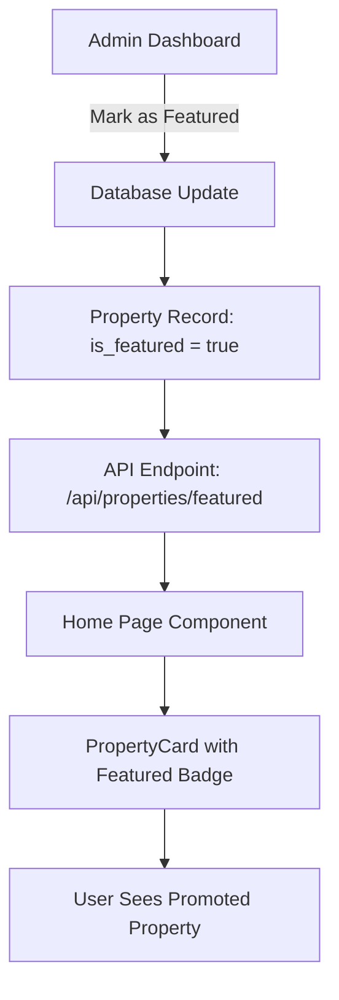
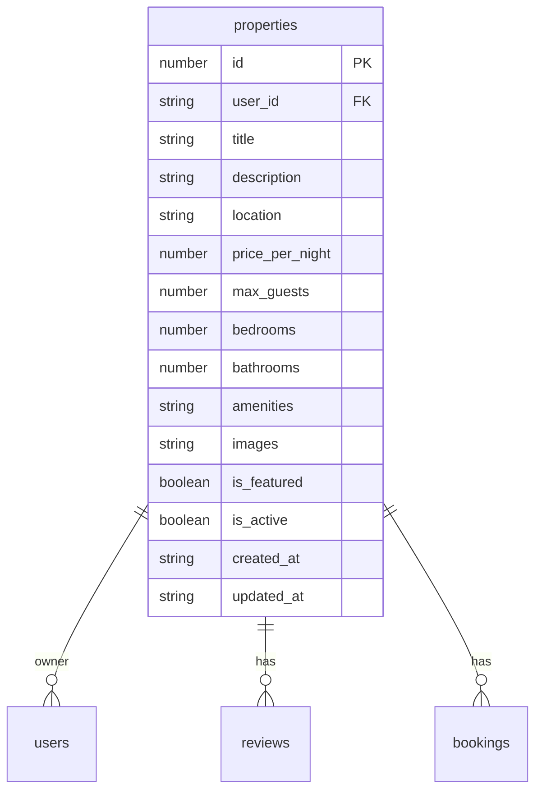
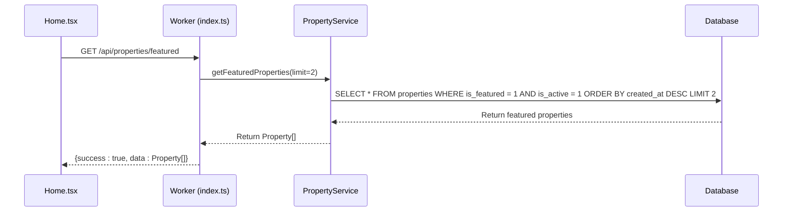
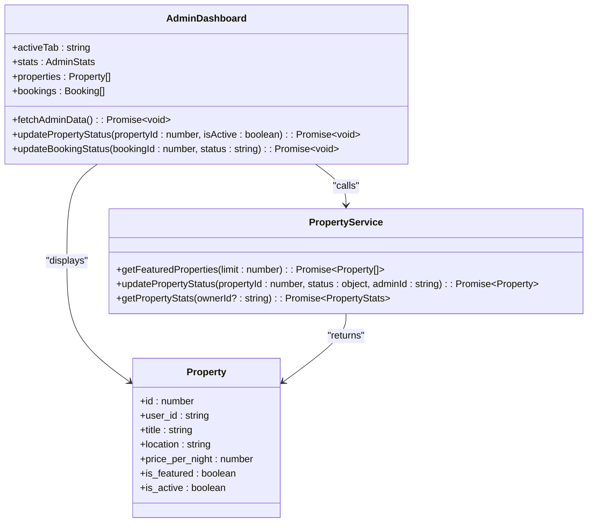
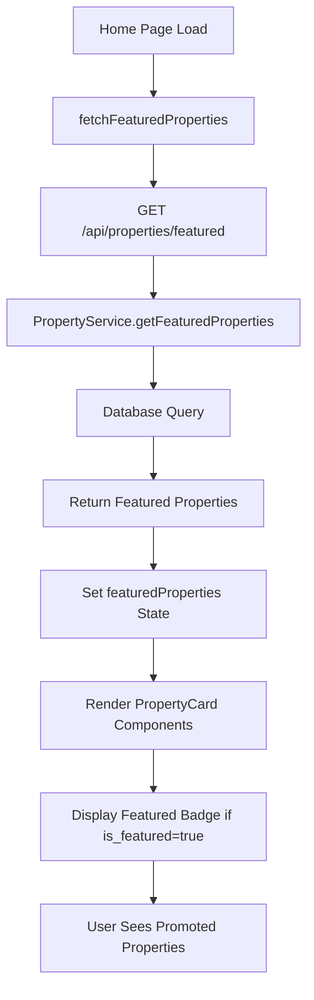

# Featured Properties

<cite>
**Referenced Files in This Document**   
- [PropertyService.ts](file://src/server/services/PropertyService.ts)
- [types.ts](file://src/shared/types.ts)
- [Home.tsx](file://src/react-app/pages/Home.tsx)
- [PropertyCard.tsx](file://src/react-app/components/PropertyCard.tsx)
- [AdminDashboard.tsx](file://src/react-app/pages/AdminDashboard.tsx)
- [index.ts](file://src/worker/index.ts)
</cite>

## Table of Contents
1. [Introduction](#introduction)
2. [Featured Properties Mechanism Overview](#featured-properties-mechanism-overview)
3. [Data Structure and Database Schema](#data-structure-and-database-schema)
4. [Backend Logic for Featured Properties](#backend-logic-for-featured-properties)
5. [Admin Dashboard Controls](#admin-dashboard-controls)
6. [Frontend Rendering and Display](#frontend-rendering-and-display)
7. [Configuration and Performance Monitoring](#configuration-and-performance-monitoring)
8. [Troubleshooting Guide](#troubleshooting-guide)

## Introduction
The Featured Properties mechanism in HabibiStay is designed to highlight premium accommodations on key entry points such as the Home page. This system enables administrators to promote select properties based on quality, performance, or strategic business goals. The implementation spans both frontend and backend components, with a clear data flow from database storage to user interface presentation. This document provides a comprehensive analysis of how properties are marked as featured, managed through administrative controls, and displayed to users with special styling.

## Featured Properties Mechanism Overview

The Featured Properties system operates through a combination of database flags, backend services, and frontend components that work together to promote select properties across the platform. The mechanism follows a straightforward workflow:

1. **Selection**: Administrators manually select properties to feature through the AdminDashboard interface
2. **Storage**: The featured status is stored as a boolean flag (`is_featured`) in the database
3. **Retrieval**: Backend services query for properties with the featured flag enabled
4. **Display**: Frontend components render featured properties with special badges and placement

This system is designed to be simple yet effective, allowing for immediate visibility changes without complex algorithms or automated selection processes. The featured status directly impacts property visibility, sorting behavior, and user engagement metrics.



**Diagram sources**
- [AdminDashboard.tsx](file://src/react-app/pages/AdminDashboard.tsx)
- [PropertyService.ts](file://src/server/services/PropertyService.ts)
- [index.ts](file://src/worker/index.ts)
- [Home.tsx](file://src/react-app/pages/Home.tsx)
- [PropertyCard.tsx](file://src/react-app/components/PropertyCard.tsx)

**Section sources**
- [PropertyService.ts](file://src/server/services/PropertyService.ts)
- [Home.tsx](file://src/react-app/pages/Home.tsx)

## Data Structure and Database Schema

The featured property functionality is built upon a well-defined data structure that includes a specific boolean field to indicate featured status. This field is part of the core Property schema and is consistently maintained across the application stack.

### Property Schema Definition

The `Property` type definition in the shared types module includes the `is_featured` field as a required boolean property:

```typescript
export const PropertySchema = z.object({
  id: z.number(),
  user_id: z.string(),
  title: z.string(),
  description: z.string().nullable(),
  location: z.string(),
  price_per_night: z.number(),
  max_guests: z.number(),
  bedrooms: z.number().nullable(),
  bathrooms: z.number().nullable(),
  amenities: z.string().nullable(),
  images: z.string().nullable(),
  is_featured: z.boolean(),
  is_active: z.boolean(),
  created_at: z.string(),
  updated_at: z.string(),
});
```

This schema is used throughout the application to ensure type safety and consistency when handling property data.

### Database Implementation

In the database, the `is_featured` field is implemented as a boolean column in the `properties` table. The field is initialized to `false` by default when new properties are created, ensuring that only intentionally promoted properties receive featured status.

When retrieving featured properties, the system queries for records where both `is_featured = true` and `is_active = true`, ensuring that only valid, active properties are promoted.



**Diagram sources**
- [types.ts](file://src/shared/types.ts)
- [PropertyService.ts](file://src/server/services/PropertyService.ts)

**Section sources**
- [types.ts](file://src/shared/types.ts)

## Backend Logic for Featured Properties

The backend implementation of the featured properties system is centered around the `PropertyService` class, which provides methods for retrieving, updating, and managing featured status.

### Featured Properties Retrieval

The system exposes a dedicated endpoint for retrieving featured properties, which is consumed by the Home page and other components:



**Diagram sources**
- [index.ts](file://src/worker/index.ts#L350-L352)
- [PropertyService.ts](file://src/server/services/PropertyService.ts#L345-L365)

**Section sources**
- [PropertyService.ts](file://src/server/services/PropertyService.ts#L345-L365)
- [index.ts](file://src/worker/index.ts#L350-L352)

The `getFeaturedProperties` method in `PropertyService` implements the core logic:

```typescript
async getFeaturedProperties(limit: number = 2): Promise<Property[]> {
  try {
    const properties = await this.db.all(`
      SELECT p.*, u.name as owner_name,
             COALESCE(AVG(r.rating), 0) as rating,
             COUNT(r.id) as review_count
      FROM properties p
      LEFT JOIN users u ON p.owner_id = u.id
      LEFT JOIN reviews r ON p.id = r.property_id
      WHERE p.is_featured = true AND p.is_active = true
      GROUP BY p.id
      ORDER BY p.created_at DESC
      LIMIT ?
    `, [limit]);

    return properties.map(property => ({
      ...property,
      amenities: JSON.parse(property.amenities || '[]'),
      images: JSON.parse(property.images || '[]')
    })) as Property[];
  } catch (error) {
    throw new Error(`Failed to get featured properties: ${error.message}`);
  }
}
```

### Status Update Logic

The `updatePropertyStatus` method allows administrators to modify both `is_active` and `is_featured` status flags:

```typescript
async updatePropertyStatus(propertyId: number, status: { is_active?: boolean; is_featured?: boolean }, adminId: string): Promise<Property> {
  try {
    // Verify admin permissions
    const admin = await this.db.get('SELECT role FROM users WHERE id = ?', [adminId]);
    if (!admin || admin.role !== 'admin') {
      throw new Error('Admin access required');
    }

    const updateFields = [];
    const updateValues = [];

    if (status.is_active !== undefined) {
      updateFields.push('is_active = ?');
      updateValues.push(status.is_active);
    }

    if (status.is_featured !== undefined) {
      updateFields.push('is_featured = ?');
      updateValues.push(status.is_featured);
    }

    if (updateFields.length === 0) {
      throw new Error('No status updates provided');
    }

    updateFields.push('updated_at = ?');
    updateValues.push(new Date().toISOString());
    updateValues.push(propertyId);

    await this.db.run(`
      UPDATE properties 
      SET ${updateFields.join(', ')}
      WHERE id = ?
    `, updateValues);

    // Log status update
    await this.logPropertyAction(propertyId, adminId, 'status_update', status);

    return await this.getPropertyById(propertyId);
  } catch (error) {
    throw new Error(`Failed to update property status: ${error.message}`);
  }
}
```

This method includes important security checks to ensure only users with the 'admin' role can modify property status, preventing unauthorized promotion of properties.

## Admin Dashboard Controls

The AdminDashboard provides a user interface for administrators to manage property status, including the ability to feature or unfeature properties.

### Interface Implementation

The property management table in the AdminDashboard displays the current status of each property, including visual indicators for active and featured status:

```tsx
<td className="py-3 px-4">
  <span className={`px-2 py-1 rounded-full text-xs ${
    property.is_active ? 'bg-green-100 text-green-800' : 'bg-gray-100 text-gray-800'
  }`}>
    {property.is_active ? 'Active' : 'Inactive'}
  </span>
  {property.is_featured && (
    <span className="ml-2 px-2 py-1 rounded-full text-xs bg-blue-100 text-blue-800">
      Featured
    </span>
  )}
</td>
```

### Status Toggle Functionality

When an administrator clicks the status toggle button, the `updatePropertyStatus` function is called with the appropriate parameters:

```typescript
const updatePropertyStatus = async (propertyId: number, isActive: boolean) => {
  try {
    const response = await fetch(`/api/admin/properties/${propertyId}/status`, {
      method: 'PUT',
      headers: { 'Content-Type': 'application/json' },
      body: JSON.stringify({ is_active: isActive }),
    });
    
    if (response.ok) {
      setProperties(props => 
        props.map(p => p.id === propertyId ? { ...p, is_active: isActive } : p)
      );
    }
  } catch (error) {
    console.error('Error updating property status:', error);
  }
};
```

Although the current implementation shown in the code focuses on the `is_active` status, the backend service supports updating both `is_active` and `is_featured` fields simultaneously, indicating that the frontend could be extended to provide separate controls for each status.



**Diagram sources**
- [AdminDashboard.tsx](file://src/react-app/pages/AdminDashboard.tsx)
- [PropertyService.ts](file://src/server/services/PropertyService.ts)
- [types.ts](file://src/shared/types.ts)

**Section sources**
- [AdminDashboard.tsx](file://src/react-app/pages/AdminDashboard.tsx)
- [PropertyService.ts](file://src/server/services/PropertyService.ts)

## Frontend Rendering and Display

The frontend implementation of the featured properties system focuses on visual presentation and user experience, ensuring that featured properties stand out to visitors.

### Home Page Integration

The Home page component retrieves featured properties on initial load and displays them in a dedicated section:

```typescript
export default function HomePage() {
  const [featuredProperties, setFeaturedProperties] = useState<Property[]>([]);
  const [loading, setLoading] = useState(true);

  useEffect(() => {
    fetchFeaturedProperties();
  }, []);

  const fetchFeaturedProperties = async () => {
    try {
      const response = await fetch('/api/properties/featured');
      const data = await response.json();
      if (data.success) {
        setFeaturedProperties(data.data);
      }
    } catch (error) {
      console.error('Error fetching featured properties:', error);
    } finally {
      setLoading(false);
    }
  };

  return (
    <section className="py-20 bg-white">
      <div className="max-w-7xl mx-auto px-4 sm:px-6 lg:px-8">
        <div className="text-center mb-16">
          <h2 className="text-3xl md:text-4xl font-bold text-gray-900 mb-4">
            Featured Properties
          </h2>
          <p className="text-xl text-gray-600">
            Discover our handpicked exceptional accommodations in Riyadh
          </p>
        </div>

        {loading ? (
          <div className="grid grid-cols-1 md:grid-cols-2 gap-8">
            {[1, 2].map((i) => (
              <div key={i} className="animate-pulse">
                <div className="bg-gray-300 h-64 rounded-lg mb-4"></div>
                <div className="h-4 bg-gray-300 rounded mb-2"></div>
                <div className="h-4 bg-gray-300 rounded w-2/3"></div>
              </div>
            ))}
          </div>
        ) : featuredProperties.length > 0 ? (
          <div className="grid grid-cols-1 md:grid-cols-2 gap-8">
            {featuredProperties.map((property) => (
              <PropertyCard key={property.id} property={property} />
            ))}
          </div>
        ) : (
          <div className="text-center py-12">
            <p className="text-gray-500 text-lg">No featured properties available at the moment.</p>
          </div>
        )}
      </div>
    </section>
  );
}
```

### Property Card Styling

The PropertyCard component is responsible for visually indicating featured status through a prominent badge:

```typescript
{/* Featured Badge */}
{property.is_featured && (
  <div className="absolute top-2 left-2 bg-[#2957c3] text-white px-2 py-1 rounded text-xs font-medium">
    Featured
  </div>
)}
```

This badge is positioned in the top-left corner of the property image, ensuring high visibility while not obstructing the main content. The blue color (#2957c3) matches the brand's primary color scheme, creating a cohesive visual identity.

The same featured badge appears in other contexts, such as the Wishlist page, maintaining consistency across the application:

```tsx
{/* Featured badge */}
{property.is_featured && (
  <div className="absolute top-3 left-3">
    <span className="bg-[#2957c3] text-white text-xs px-2 py-1 rounded-full font-medium">
      Featured
    </span>
  </div>
)}
```



**Diagram sources**
- [Home.tsx](file://src/react-app/pages/Home.tsx)
- [PropertyCard.tsx](file://src/react-app/components/PropertyCard.tsx)
- [index.ts](file://src/worker/index.ts)
- [PropertyService.ts](file://src/server/services/PropertyService.ts)

**Section sources**
- [Home.tsx](file://src/react-app/pages/Home.tsx)
- [PropertyCard.tsx](file://src/react-app/components/PropertyCard.tsx)

## Configuration and Performance Monitoring

The featured properties system includes mechanisms for performance monitoring and could be extended to support more sophisticated configuration options.

### Current Configuration

Currently, the system uses a simple manual selection process where administrators directly control which properties are featured. The API endpoint for featured properties returns results ordered by creation date in descending order:

```sql
SELECT * FROM properties WHERE is_featured = 1 AND is_active = 1 ORDER BY created_at DESC LIMIT 2
```

This means that when multiple properties are featured, the most recently created properties appear first.

### Potential Enhancements

The system could be extended with additional configuration options:

- **Time-based promotions**: Automatically feature properties for specific time periods
- **Rotation schedules**: Rotate featured properties on a daily or weekly basis
- **Performance-based selection**: Automatically feature properties based on metrics like booking rate or guest ratings
- **A/B testing**: Test different featured property selections to optimize conversion rates

### Performance Metrics

The system already collects relevant performance data through analytics tracking:

```typescript
// Track property view for analytics
async function trackPropertyView(env: Env, propertyId: number): Promise<void> {
  const today = new Date().toISOString().split('T')[0];
  
  await env.DB.prepare(`
    INSERT INTO property_analytics (property_id, views, date) 
    VALUES (?, 1, ?)
    ON CONFLICT(property_id, date) 
    DO UPDATE SET views = views + 1, updated_at = CURRENT_TIMESTAMP
  `).bind(propertyId, today).run();
}
```

Additional metrics that could be tracked for featured properties include:
- Click-through rates from the Home page
- Conversion rates (inquiries to bookings)
- Time spent viewing featured property details
- Comparison with non-featured properties

## Troubleshooting Guide

This section addresses common issues related to the featured properties system and provides solutions for each.

### Issue 1: Featured Property Not Displaying on Home Page

**Symptoms**: A property has `is_featured = true` in the database but does not appear on the Home page.

**Possible Causes and Solutions**:
1. **Property is not active**: The query requires both `is_featured = true` AND `is_active = true`. Verify the `is_active` status.
   ```sql
   UPDATE properties SET is_active = true WHERE id = [property_id];
   ```

2. **Caching issues**: The frontend or API might be caching results. Try clearing browser cache or restarting the application.

3. **API endpoint issues**: Test the API directly:
   ```bash
   curl http://localhost:8787/api/properties/featured
   ```

4. **Database synchronization**: Ensure the database transaction completed successfully and the change was committed.

### Issue 2: Featured Badge Not Appearing

**Symptoms**: The property data shows `is_featured = true` but the visual badge does not render.

**Possible Causes and Solutions**:
1. **Data fetching issue**: The property data might not include the `is_featured` field. Check the API response structure.
   ```typescript
   // Verify the field is included
   console.log(property.is_featured);
   ```

2. **Conditional rendering bug**: The conditional rendering logic might have an error. Verify the syntax:
   ```tsx
   {property.is_featured && (
     <div className="featured-badge">Featured</div>
   )}
   ```

3. **CSS conflicts**: Other styles might be hiding the badge. Inspect the element using browser developer tools.

### Issue 3: Unable to Feature a Property

**Symptoms**: The admin interface does not provide an option to feature properties.

**Possible Causes and Solutions**:
1. **Missing UI controls**: The current implementation may only expose `is_active` controls. The frontend needs to be updated to include `is_featured` controls.
   ```tsx
   // Add featured toggle
   <button onClick={() => updatePropertyStatus(property.id, property.is_active, !property.is_featured)}>
     {property.is_featured ? 'Unfeature' : 'Feature'}
   </button>
   ```

2. **Permission issues**: Verify the user has admin role privileges in the database.
   ```sql
   SELECT role FROM users WHERE id = [admin_id];
   ```

3. **API endpoint limitations**: The admin API endpoint might not support updating the `is_featured` field. Check the backend implementation.

### Issue 4: Performance Degradation with Many Featured Properties

**Symptoms**: The Home page loads slowly when multiple properties are featured.

**Possible Causes and Solutions**:
1. **Missing database index**: Add an index on the featured status columns:
   ```sql
   CREATE INDEX idx_properties_featured_active ON properties(is_featured, is_active);
   ```

2. **Excessive data retrieval**: The query might be fetching too much data. Implement field selection rather than `SELECT *`.

3. **Lack of caching**: Implement Redis or similar caching for the featured properties endpoint to reduce database load.