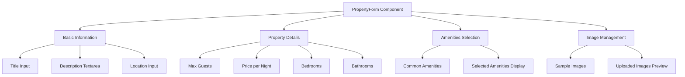
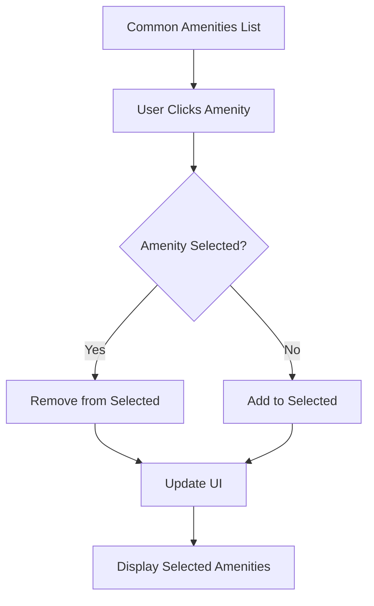
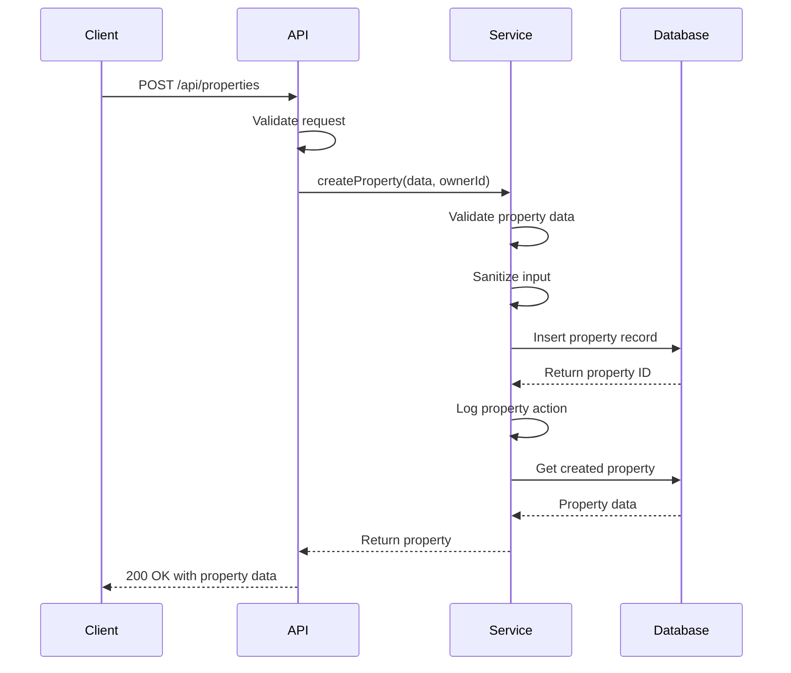
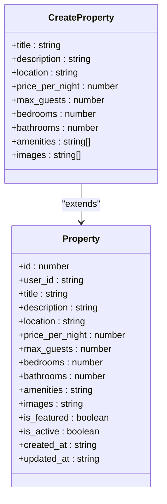
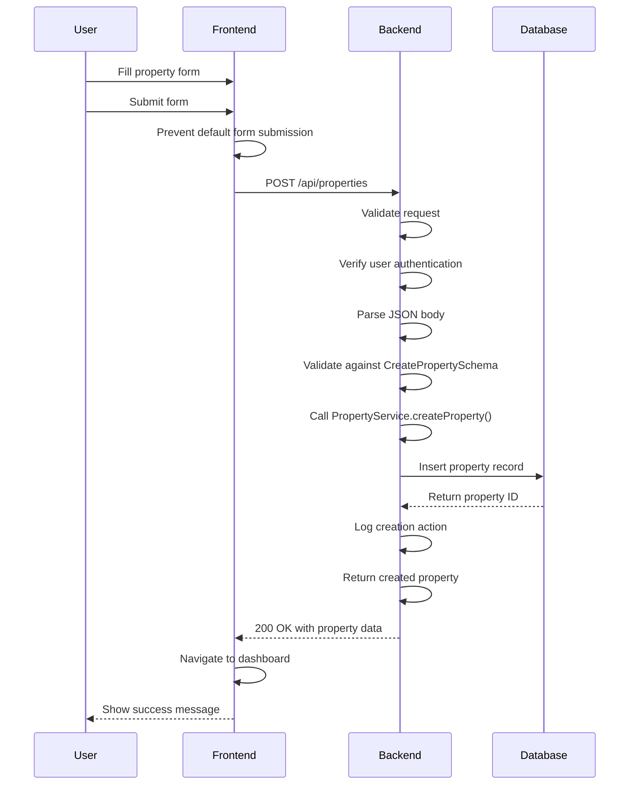
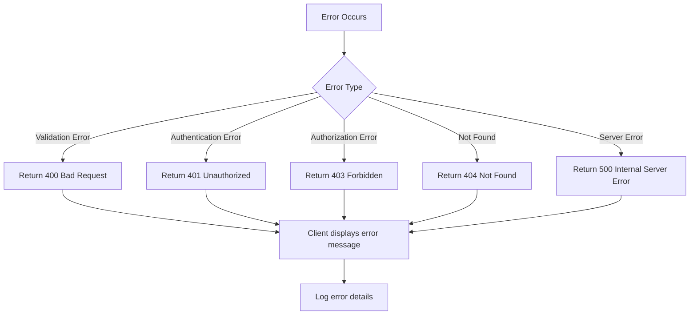
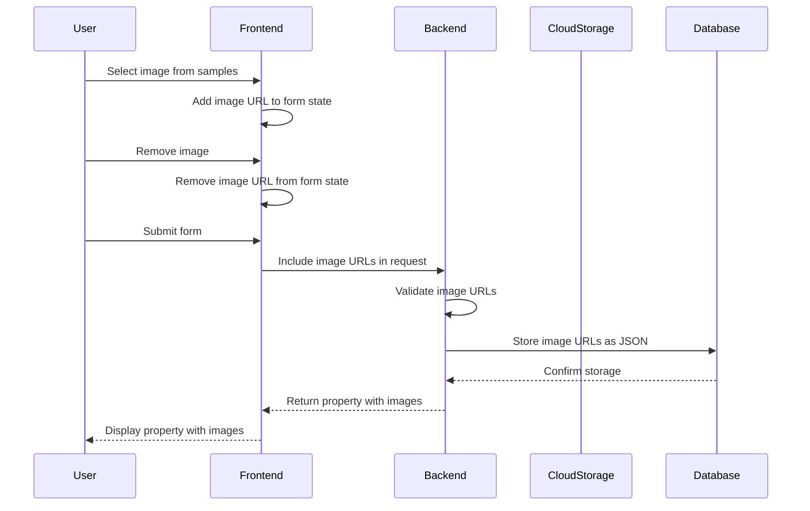
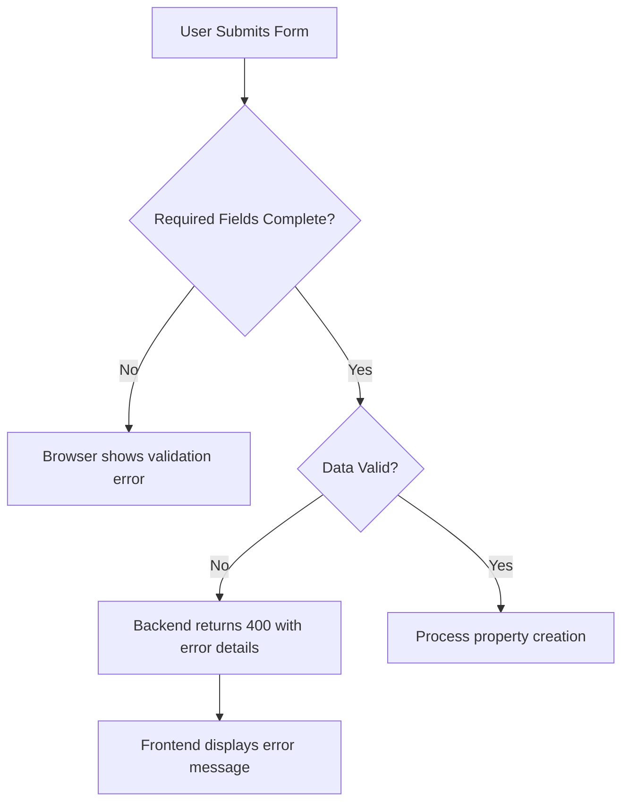
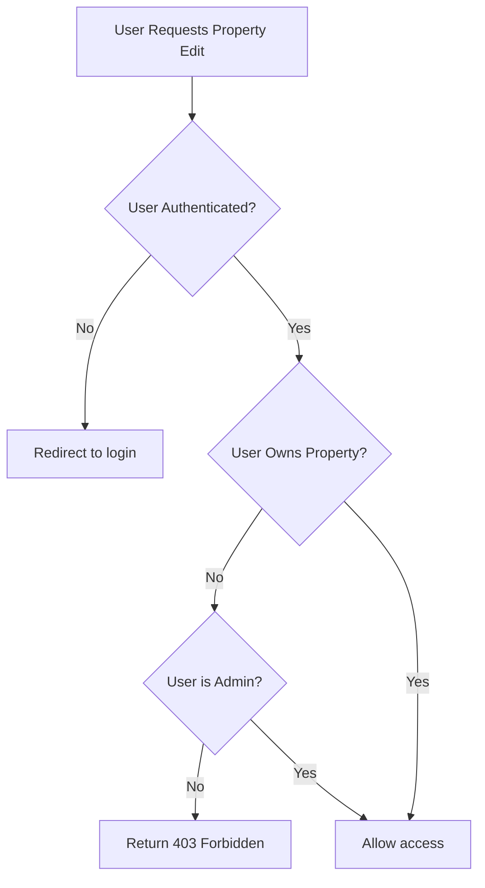
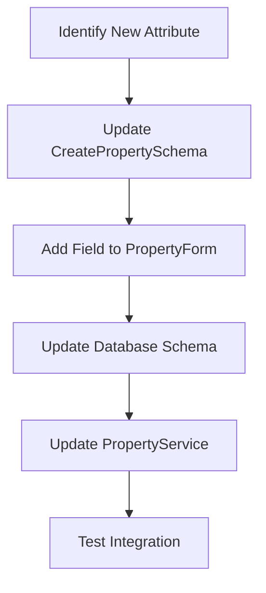

# Property Creation

<cite>
**Referenced Files in This Document**   
- [PropertyForm.tsx](file://src/react-app/pages/PropertyForm.tsx)
- [types.ts](file://src/shared/types.ts)
- [PropertyService.ts](file://src/server/services/PropertyService.ts)
- [index.ts](file://src/worker/index.ts)
</cite>

## Table of Contents
1. [Introduction](#introduction)
2. [Frontend Implementation](#frontend-implementation)
3. [Backend Implementation](#backend-implementation)
4. [Data Flow and Integration](#data-flow-and-integration)
5. [Validation and Error Handling](#validation-and-error-handling)
6. [Image Upload and Management](#image-upload-and-management)
7. [Security and Access Control](#security-and-access-control)
8. [Common Issues and Troubleshooting](#common-issues-and-troubleshooting)
9. [Extension and Customization](#extension-and-customization)

## Introduction
The Property Creation feature enables property owners to list new properties on the HabibiStay platform through a comprehensive form interface. This document details the implementation of both frontend and backend components, covering form structure, validation, image handling, and API integration. The system uses Zod for schema validation, implements secure ownership verification, and provides real-time preview functionality for property images.

## Frontend Implementation

### PropertyForm Component Structure
The PropertyForm component provides a user-friendly interface for property owners to create or edit property listings. The form is organized into logical sections with appropriate validation and interactive elements.



**Diagram sources**
- [PropertyForm.tsx](file://src/react-app/pages/PropertyForm.tsx#L0-L493)

**Section sources**
- [PropertyForm.tsx](file://src/react-app/pages/PropertyForm.tsx#L0-L493)

### Form State Management
The component uses React's useState hook to manage form data, with a CreateProperty type defining the structure of the form state:

```typescript
const [property, setProperty] = useState<CreateProperty>({
  title: '',
  description: '',
  location: '',
  price_per_night: 0,
  max_guests: 1,
  bedrooms: 1,
  bathrooms: 1,
  amenities: [],
  images: [],
});
```

The form supports both creation (POST) and editing (PUT) modes, determined by the presence of an ID parameter in the route.

### Amenities Selection Interface
The amenities section provides a user-friendly interface for selecting property features:



**Diagram sources**
- [PropertyForm.tsx](file://src/react-app/pages/PropertyForm.tsx#L0-L493)

## Backend Implementation

### Property Creation API Route
The backend implements a RESTful API for property creation and management, with routes for creating, reading, updating, and deleting properties.



**Diagram sources**
- [index.ts](file://src/worker/index.ts#L0-L2444)
- [PropertyService.ts](file://src/server/services/PropertyService.ts#L0-L606)

**Section sources**
- [index.ts](file://src/worker/index.ts#L0-L2444)
- [PropertyService.ts](file://src/server/services/PropertyService.ts#L0-L606)

### PropertyService Implementation
The PropertyService class handles the business logic for property operations, including creation, validation, and database interactions.

```typescript
async createProperty(propertyData: PropertyCreate, ownerId: string): Promise<Property> {
  // Validate and sanitize input data
  const sanitizedData = this.sanitizePropertyData(propertyData);
  await this.validatePropertyData(sanitizedData);
  
  // Insert property into database
  const propertyId = await this.db.run(`
    INSERT INTO properties (
      title, description, location, max_guests, bedrooms, bathrooms,
      price_per_night, amenities, images, owner_id, is_featured, is_active,
      created_at, updated_at
    ) VALUES (?, ?, ?, ?, ?, ?, ?, ?, ?, ?, ?, ?, ?, ?)
  `, [
    sanitizedData.title,
    sanitizedData.description,
    sanitizedData.location,
    sanitizedData.max_guests,
    sanitizedData.bedrooms,
    sanitizedData.bathrooms,
    sanitizedData.price_per_night,
    JSON.stringify(sanitizedData.amenities),
    JSON.stringify(sanitizedData.images || []),
    ownerId,
    false,
    true,
    new Date().toISOString(),
    new Date().toISOString()
  ]);

  // Return the created property
  return await this.getPropertyById(propertyId);
}
```

**Section sources**
- [PropertyService.ts](file://src/server/services/PropertyService.ts#L0-L606)

## Data Flow and Integration

### Frontend-Backend Data Mapping
The system maintains consistent data structures between frontend and backend through shared type definitions.



**Diagram sources**
- [types.ts](file://src/shared/types.ts#L0-L600)

**Section sources**
- [types.ts](file://src/shared/types.ts#L0-L600)

### Request Flow for Property Creation
The complete flow for creating a new property involves multiple steps from user interaction to database persistence.



**Diagram sources**
- [PropertyForm.tsx](file://src/react-app/pages/PropertyForm.tsx#L0-L493)
- [index.ts](file://src/worker/index.ts#L0-L2444)
- [PropertyService.ts](file://src/server/services/PropertyService.ts#L0-L606)

## Validation and Error Handling

### Zod Schema Validation
The system uses Zod for comprehensive validation of property data on both frontend and backend.

```typescript
export const CreatePropertySchema = z.object({
  title: z.string().min(1),
  description: z.string().optional(),
  location: z.string().min(1),
  price_per_night: z.number().positive(),
  max_guests: z.number().int().positive(),
  bedrooms: z.number().int().positive().optional(),
  bathrooms: z.number().int().positive().optional(),
  amenities: z.array(z.string()).optional(),
  images: z.array(z.string()).optional(),
});
```

**Section sources**
- [types.ts](file://src/shared/types.ts#L0-L600)

### Error Handling Strategies
The system implements comprehensive error handling at multiple levels:



**Diagram sources**
- [index.ts](file://src/worker/index.ts#L0-L2444)
- [PropertyService.ts](file://src/server/services/PropertyService.ts#L0-L606)

## Image Upload and Management

### Image Handling Workflow
The property creation system supports image management through URL-based references and cloud storage integration.



**Diagram sources**
- [PropertyForm.tsx](file://src/react-app/pages/PropertyForm.tsx#L0-L493)
- [PropertyService.ts](file://src/server/services/PropertyService.ts#L0-L606)

### Image Storage Implementation
The backend provides methods for uploading and managing property images:

```typescript
async uploadPropertyImages(propertyId: number, files: File[], userId: string): Promise<string[]> {
  // Validate property ownership
  await this.validatePropertyOwnership(propertyId, userId);
  
  const uploadedUrls: string[] = [];
  
  for (const file of files) {
    // Validate file
    const validation = validateFileUpload(file, {
      maxSize: 10 * 1024 * 1024, // 10MB
      allowedTypes: ['image/jpeg', 'image/png', 'image/webp']
    });
    
    if (!validation.isValid) {
      throw new Error(`Invalid file: ${validation.error}`);
    }
    
    // Upload to cloud storage
    const url = await this.uploadToCloudStorage(file, `properties/${propertyId}`);
    uploadedUrls.push(url);
  }
  
  // Update property images in database
  const currentProperty = await this.getPropertyById(propertyId);
  const updatedImages = [...(currentProperty.images || []), ...uploadedUrls];
  
  await this.db.run(`
    UPDATE properties 
    SET images = ?, updated_at = ?
    WHERE id = ?
  `, [JSON.stringify(updatedImages), new Date().toISOString(), propertyId]);
  
  return uploadedUrls;
}
```

**Section sources**
- [PropertyService.ts](file://src/server/services/PropertyService.ts#L0-L606)

## Security and Access Control

### Ownership Verification
The system implements strict ownership verification to prevent unauthorized property modifications:

```typescript
private async validatePropertyOwnership(propertyId: number, userId: string): Promise<void> {
  const property = await this.db.get('SELECT owner_id FROM properties WHERE id = ?', [propertyId]);
  
  if (!property) {
    throw new Error('Property not found');
  }
  
  const user = await this.db.get('SELECT role FROM users WHERE id = ?', [userId]);
  
  if (property.owner_id !== userId && user?.role !== 'admin') {
    throw new Error('Access denied: You do not own this property');
  }
}
```

**Section sources**
- [PropertyService.ts](file://src/server/services/PropertyService.ts#L0-L606)

### Input Sanitization
All user input is sanitized to prevent XSS and other injection attacks:

```typescript
private sanitizePropertyData(data: PropertyCreate | PropertyUpdate): any {
  const sanitized = { ...data };
  
  if (sanitized.title) {
    sanitized.title = sanitizeHtml(sanitized.title);
  }
  
  if (sanitized.description) {
    sanitized.description = sanitizeHtml(sanitized.description);
  }
  
  if (sanitized.house_rules) {
    sanitized.house_rules = sanitizeHtml(sanitized.house_rules);
  }
  
  return sanitized;
}
```

**Section sources**
- [PropertyService.ts](file://src/server/services/PropertyService.ts#L0-L606)

## Common Issues and Troubleshooting

### Incomplete Form Submission
When users submit incomplete forms, the system provides appropriate feedback:



**Diagram sources**
- [PropertyForm.tsx](file://src/react-app/pages/PropertyForm.tsx#L0-L493)
- [index.ts](file://src/worker/index.ts#L0-L2444)

### Unauthorized Access Attempts
The system prevents unauthorized access to property management functions:



**Diagram sources**
- [PropertyForm.tsx](file://src/react-app/pages/PropertyForm.tsx#L0-L493)
- [PropertyService.ts](file://src/server/services/PropertyService.ts#L0-L606)

### File Size and Type Restrictions
The image upload system enforces file size and type restrictions:

```typescript
const validation = validateFileUpload(file, {
  maxSize: 10 * 1024 * 1024, // 10MB
  allowedTypes: ['image/jpeg', 'image/png', 'image/webp']
});
```

**Section sources**
- [PropertyService.ts](file://src/server/services/PropertyService.ts#L0-L606)

## Extension and Customization

### Adding New Property Attributes
The form can be extended to support additional property attributes by modifying both frontend and backend components:



**Diagram sources**
- [types.ts](file://src/shared/types.ts#L0-L600)
- [PropertyForm.tsx](file://src/react-app/pages/PropertyForm.tsx#L0-L493)
- [PropertyService.ts](file://src/server/services/PropertyService.ts#L0-L606)

### Example: Adding Property Type Field
To add a property type field, update the CreatePropertySchema and PropertyForm component:

```typescript
// Update types.ts
export const CreatePropertySchema = z.object({
  // existing fields...
  property_type: z.string().optional(),
});

// Update PropertyForm.tsx
<div>
  <label htmlFor="property_type" className="block text-sm font-medium text-gray-700 mb-2">
    Property Type
  </label>
  <select
    id="property_type"
    value={property.property_type}
    onChange={(e) => setProperty({ ...property, property_type: e.target.value })}
    className="w-full px-4 py-3 border border-gray-300 rounded-lg focus:ring-2 focus:ring-[#2957c3] focus:border-transparent"
  >
    <option value="">Select property type</option>
    <option value="apartment">Apartment</option>
    <option value="house">House</option>
    <option value="villa">Villa</option>
  </select>
</div>
```

**Section sources**
- [types.ts](file://src/shared/types.ts#L0-L600)
- [PropertyForm.tsx](file://src/react-app/pages/PropertyForm.tsx#L0-L493)