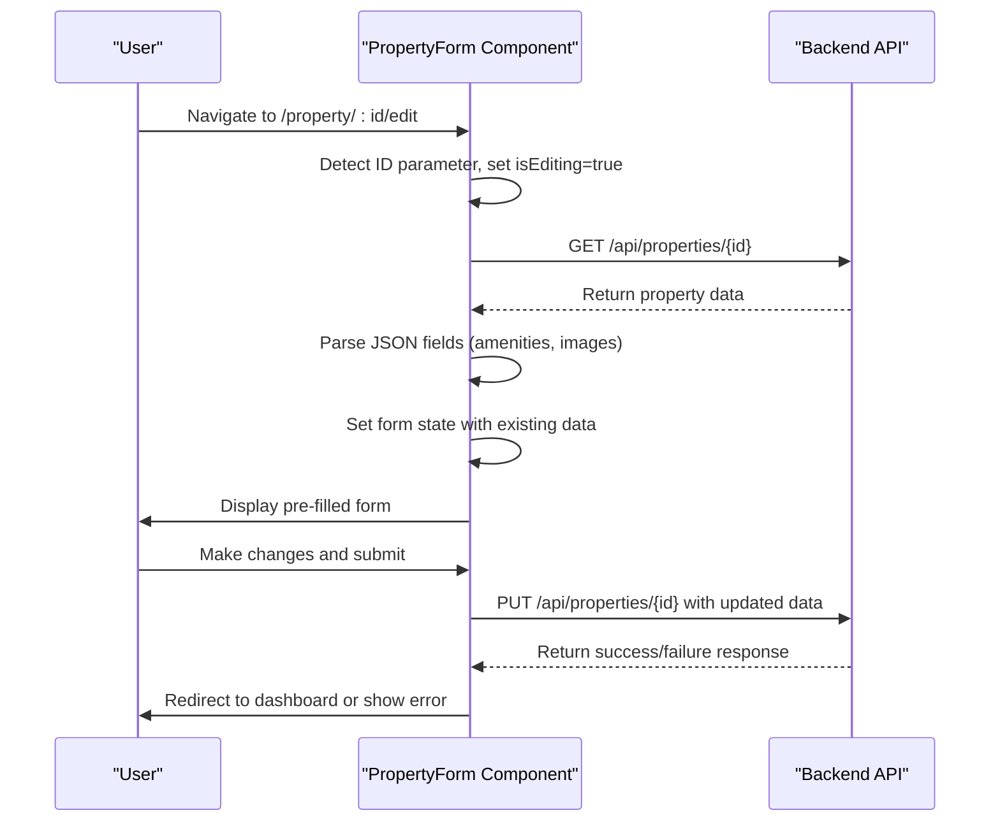
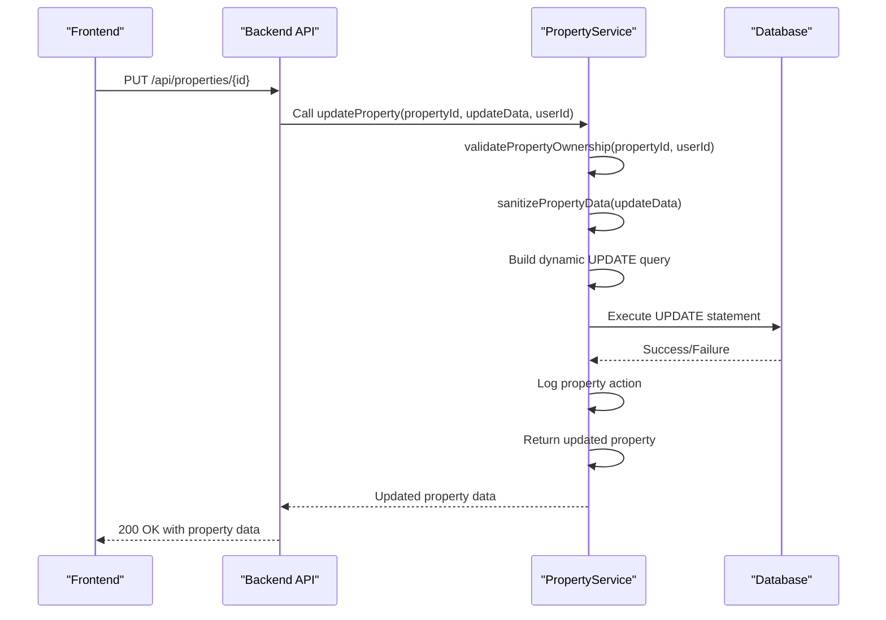
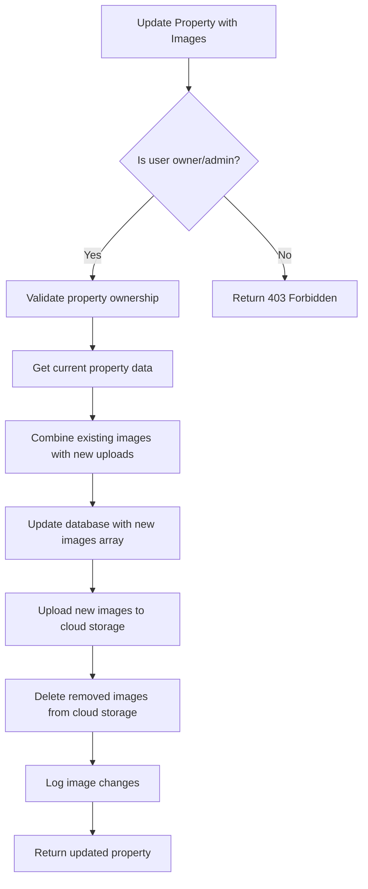
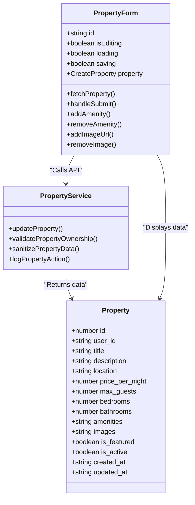

# Property Editing

<cite>
**Referenced Files in This Document**   
- [PropertyForm.tsx](file://src/react-app/pages/PropertyForm.tsx)
- [types.ts](file://src/shared/types.ts)
- [PropertyService.ts](file://src/server/services/PropertyService.ts)
- [PropertyDetail.tsx](file://src/react-app/pages/PropertyDetail.tsx)
</cite>

## Table of Contents
1. [Property Editing Overview](#property-editing-overview)
2. [PropertyForm Component Analysis](#propertyform-component-analysis)
3. [Backend Property Update Implementation](#backend-property-update-implementation)
4. [Image Management System](#image-management-system)
5. [State Management and Data Flow](#state-management-and-data-flow)
6. [Error Handling and Recovery](#error-handling-and-recovery)
7. [Common Issues and Solutions](#common-issues-and-solutions)

## Property Editing Overview
The Property Editing feature enables property owners to modify existing property listings through the PropertyForm component. When accessing a property with an ID parameter, the form enters edit mode, fetching the current property data from the API and pre-filling the form fields. The system supports partial updates through PUT requests, maintains ownership verification, and handles database transactions to ensure data integrity. The editing workflow includes comprehensive state management, validation, and error recovery mechanisms to provide a seamless user experience.

## PropertyForm Component Analysis

The PropertyForm component serves as the primary interface for property editing, adapting its behavior based on the presence of a property ID in the route parameters. When in edit mode, it automatically fetches existing property data and populates the form fields accordingly.



**Diagram sources**
- [PropertyForm.tsx](file://src/react-app/pages/PropertyForm.tsx#L42-L88)
- [PropertyForm.tsx](file://src/react-app/pages/PropertyForm.tsx#L100-L140)

**Section sources**
- [PropertyForm.tsx](file://src/react-app/pages/PropertyForm.tsx#L0-L493)

### Form Initialization and Data Fetching
The PropertyForm component initializes in edit mode by detecting the presence of an ID parameter in the URL. It uses the `useParams` hook to extract the property ID and sets the `isEditing` flag accordingly. The component then fetches the existing property data through an API call to `/api/properties/{id}`.

```typescript
const isEditing = !!id;

useEffect(() => {
  if (!user) {
    redirectToLogin();
    return;
  }

  if (isEditing) {
    fetchProperty();
  }
}, [user, id, isEditing, redirectToLogin]);

const fetchProperty = async () => {
  if (!id) return;
  
  setLoading(true);
  try {
    const response = await fetch(`/api/properties/${id}`);
    const data = await response.json();
    
    if (data.success) {
      const prop = data.data as Property;
      setProperty({
        title: prop.title,
        description: prop.description || '',
        location: prop.location,
        price_per_night: prop.price_per_night,
        max_guests: prop.max_guests,
        bedrooms: prop.bedrooms || 1,
        bathrooms: prop.bathrooms || 1,
        amenities: prop.amenities ? JSON.parse(prop.amenities) : [],
        images: prop.images ? JSON.parse(prop.images) : [],
      });
    }
  } catch (error) {
    console.error('Error fetching property:', error);
  } finally {
    setLoading(false);
  }
};
```

The data fetching process includes parsing of JSON fields such as amenities and images, which are stored as JSON strings in the database but used as arrays in the application. The component handles loading states and authentication requirements, redirecting unauthenticated users to the login page.

### Form State Management
The PropertyForm component maintains its state using React's `useState` hook, with the property data stored in a state variable that matches the `CreateProperty` type structure. The form handles various user interactions including adding/removing amenities and managing property images.

```typescript
const [property, setProperty] = useState<CreateProperty>({
  title: '',
  description: '',
  location: '',
  price_per_night: 0,
  max_guests: 1,
  bedrooms: 1,
  bathrooms: 1,
  amenities: [],
  images: [],
});
```

The component provides utility functions for modifying the property state:

```typescript
const addAmenity = (amenity: string) => {
  if (amenity && !property.amenities?.includes(amenity)) {
    setProperty(prev => ({
      ...prev,
      amenities: [...(prev.amenities || []), amenity]
    }));
  }
};

const removeAmenity = (amenity: string) => {
  setProperty(prev => ({
    ...prev,
    amenities: (prev.amenities || []).filter(a => a !== amenity)
  }));
};

const addImageUrl = (url: string) => {
  if (url && !property.images?.includes(url)) {
    setProperty(prev => ({
      ...prev,
      images: [...(prev.images || []), url]
    }));
  }
};

const removeImage = (url: string) => {
  setProperty(prev => ({
    ...prev,
    images: (prev.images || []).filter(img => img !== url)
  }));
};
```

These functions ensure that duplicate entries are prevented and maintain the integrity of the property data throughout the editing process.

## Backend Property Update Implementation

The backend implementation for property updates is handled by the PropertyService class, which provides a robust update mechanism with ownership verification, data sanitization, and transaction handling.



**Diagram sources**
- [PropertyService.ts](file://src/server/services/PropertyService.ts#L120-L164)
- [PropertyService.ts](file://src/server/services/PropertyService.ts#L160-L206)

**Section sources**
- [PropertyService.ts](file://src/server/services/PropertyService.ts#L120-L206)

### Ownership Verification
The system implements strict ownership verification to prevent unauthorized property modifications. The `validatePropertyOwnership` method checks whether the requesting user owns the property or has admin privileges.

```typescript
private async validatePropertyOwnership(propertyId: number, userId: string): Promise<void> {
  const property = await this.db.get('SELECT owner_id FROM properties WHERE id = ?', [propertyId]);
  
  if (!property) {
    throw new Error('Property not found');
  }

  const user = await this.db.get('SELECT role FROM users WHERE id = ?', [userId]);
  
  if (property.owner_id !== userId && user?.role !== 'admin') {
    throw new Error('Access denied: You do not own this property');
  }
}
```

This verification process ensures that only property owners or administrators can modify property listings, maintaining data security and integrity.

### Partial Update Support
The update mechanism supports partial updates by building a dynamic SQL query based on the provided update data. This allows clients to send only the fields they want to modify, rather than requiring a complete property object.

```typescript
async updateProperty(propertyId: number, updateData: PropertyUpdate, userId: string): Promise<Property> {
  try {
    // Check if user owns the property or is admin
    await this.validatePropertyOwnership(propertyId, userId);

    // Sanitize input data
    const sanitizedData = this.sanitizePropertyData(updateData);

    // Build dynamic update query
    const updateFields = [];
    const updateValues = [];

    for (const [key, value] of Object.entries(sanitizedData)) {
      if (value !== undefined && key !== 'id') {
        if (key === 'amenities' || key === 'images') {
          updateFields.push(`${key} = ?`);
          updateValues.push(JSON.stringify(value));
        } else {
          updateFields.push(`${key} = ?`);
          updateValues.push(value);
        }
      }
    }

    if (updateFields.length === 0) {
      throw new Error('No valid fields to update');
    }

    // Add updated_at field
    updateFields.push('updated_at = ?');
    updateValues.push(new Date().toISOString());
    updateValues.push(propertyId);

    await this.db.run(`
      UPDATE properties 
      SET ${updateFields.join(', ')}
      WHERE id = ?
    `, updateValues);
```

The dynamic query construction ensures that only non-undefined fields are included in the update operation, and special handling is applied to JSON fields (amenities and images) which are stringified before storage.

### Database Transaction Handling
The update operation is implemented as a single database transaction with proper error handling and logging. After successfully updating the property record, the system logs the action and returns the updated property data.

```typescript
// Log property update
await this.logPropertyAction(propertyId, userId, 'update', sanitizedData);

// Return updated property
return await this.getPropertyById(propertyId);
```

The transaction includes:
- Ownership verification
- Input data sanitization
- Dynamic query construction
- Database update execution
- Action logging
- Retrieval of updated property data

This comprehensive approach ensures data consistency and provides an audit trail for all property modifications.

## Image Management System

The property editing system includes a sophisticated image management system that allows property owners to add, remove, and organize property images. Images are stored as an array of URLs in the database and managed through dedicated service methods.

### Image Update Strategy
When updating property images, the system follows a retention strategy where existing images are preserved unless explicitly removed. New images are added to the existing array, and removed images are deleted from both the database and cloud storage.



**Diagram sources**
- [PropertyService.ts](file://src/server/services/PropertyService.ts#L446-L487)
- [PropertyService.ts](file://src/server/services/PropertyService.ts#L488-L520)

**Section sources**
- [PropertyService.ts](file://src/server/services/PropertyService.ts#L446-L520)

The `uploadPropertyImages` and `removePropertyImage` methods handle the complete image management workflow:

```typescript
async uploadPropertyImages(propertyId: number, files: File[], userId: string): Promise<string[]> {
  try {
    // Validate property ownership
    await this.validatePropertyOwnership(propertyId, userId);

    const uploadedUrls: string[] = [];

    for (const file of files) {
      // Validate file
      const validation = validateFileUpload(file, {
        maxSize: 10 * 1024 * 1024, // 10MB
        allowedTypes: ['image/jpeg', 'image/png', 'image/webp']
      });

      if (!validation.isValid) {
        throw new Error(`Invalid file: ${validation.error}`);
      }

      // Upload to cloud storage
      const url = await this.uploadToCloudStorage(file, `properties/${propertyId}`);
      uploadedUrls.push(url);
    }

    // Update property images
    const currentProperty = await this.getPropertyById(propertyId);
    const updatedImages = [...(currentProperty.images || []), ...uploadedUrls];

    await this.db.run(`
      UPDATE properties 
      SET images = ?, updated_at = ?
      WHERE id = ?
    `, [JSON.stringify(updatedImages), new Date().toISOString(), propertyId]);

    // Log image upload
    await this.logPropertyAction(propertyId, userId, 'images_upload', { count: files.length });

    return uploadedUrls;
  } catch (error) {
    throw new Error(`Failed to upload property images: ${error.message}`);
  }
}
```

The system validates each uploaded file for size and type, uploads it to cloud storage, and updates the property's images array in the database. When images are removed, they are deleted from both the database record and the cloud storage provider.

## State Management and Data Flow

The property editing feature implements a comprehensive state management system that coordinates data flow between the frontend and backend components.



**Diagram sources**
- [PropertyForm.tsx](file://src/react-app/pages/PropertyForm.tsx#L0-L493)
- [PropertyService.ts](file://src/server/services/PropertyService.ts#L120-L206)
- [types.ts](file://src/shared/types.ts#L3-L19)

**Section sources**
- [PropertyForm.tsx](file://src/react-app/pages/PropertyForm.tsx#L0-L493)
- [PropertyService.ts](file://src/server/services/PropertyService.ts#L120-L206)

### Data Flow During Edit Flow
The data flow during the property edit process follows a well-defined sequence:

1. **Initialization**: The component detects the property ID and sets `isEditing` to true
2. **Data Fetching**: The component calls `fetchProperty()` to retrieve existing data
3. **State Population**: The retrieved data is parsed and set as the component's state
4. **User Interaction**: The user modifies form fields, triggering state updates
5. **Submission**: The user submits the form, triggering the `handleSubmit()` function
6. **API Request**: The component sends a PUT request with the updated property data
7. **Response Handling**: The component processes the API response and updates the UI accordingly

### Response Handling Upon Save
The `handleSubmit` method implements comprehensive response handling to provide feedback to the user:

```typescript
const handleSubmit = async (e: React.FormEvent) => {
  e.preventDefault();
  setSaving(true);

  try {
    const url = isEditing ? `/api/properties/${id}` : '/api/properties';
    const method = isEditing ? 'PUT' : 'POST';
    
    const response = await fetch(url, {
      method,
      headers: { 'Content-Type': 'application/json' },
      body: JSON.stringify(property),
    });

    const data = await response.json();
    
    if (data.success) {
      navigate('/dashboard?tab=properties');
    } else {
      console.error('Error saving property:', data.error);
    }
  } catch (error) {
    console.error('Error saving property:', error);
  } finally {
    setSaving(false);
  }
};
```

The response handling includes:
- Setting a saving state to prevent multiple submissions
- Making the API request with appropriate method (PUT for edits, POST for creates)
- Processing the JSON response
- Redirecting on success
- Logging errors on failure
- Resetting the saving state in all cases

## Error Handling and Recovery

The property editing system implements robust error handling at both the frontend and backend levels to ensure data integrity and provide meaningful feedback to users.

### Frontend Error Handling
The frontend implements try-catch blocks around all asynchronous operations, with specific error handling for different scenarios:

```typescript
const fetchProperty = async () => {
  if (!id) return;
  
  setLoading(true);
  try {
    const response = await fetch(`/api/properties/${id}`);
    const data = await response.json();
    
    if (data.success) {
      // Success handling
    } else {
      console.error('Error fetching property:', data.error);
    }
  } catch (error) {
    console.error('Error fetching property:', error);
  } finally {
    setLoading(false);
  }
};
```

Key aspects of frontend error handling:
- Network error detection and logging
- API response error handling
- Loading state management
- User feedback through console logs
- Graceful degradation when errors occur

### Backend Error Handling
The backend implements comprehensive error handling with descriptive error messages and proper HTTP status codes:

```typescript
async updateProperty(propertyId: number, updateData: PropertyUpdate, userId: string): Promise<Property> {
  try {
    // Ownership verification
    await this.validatePropertyOwnership(propertyId, userId);

    // Data validation and update
    // ...

  } catch (error) {
    throw new Error(`Failed to update property: ${error.message}`);
  }
}
```

Backend error handling includes:
- Ownership verification failures
- Data validation errors
- Database operation failures
- File upload validation
- Comprehensive error logging

## Common Issues and Solutions

### Stale Data Conflicts
Stale data conflicts can occur when multiple users attempt to edit the same property simultaneously. The current implementation does not include versioning or optimistic locking, which could lead to data overwrites.

**Solution**: Implement version numbers or timestamps in the property data and include them in the update request. The backend should verify that the version matches before applying updates.

### Permission Denials
Permission denials occur when users attempt to edit properties they don't own. The system handles this through ownership verification.

**Example**: A user without ownership rights attempts to update a property:
```json
{
  "success": false,
  "error": "Access denied: You do not own this property"
}
```

**Solution**: Ensure proper error messaging and redirect users to appropriate pages when permissions are denied.

### Failed Updates Due to Validation
Updates can fail due to validation errors in the input data. The backend validates property data before updates:

```typescript
private async validatePropertyData(data: PropertyCreate): Promise<void> {
  if (!data.title || data.title.trim().length < 5) {
    throw new Error('Property title must be at least 5 characters long');
  }

  if (!data.description || data.description.trim().length < 20) {
    throw new Error('Property description must be at least 20 characters long');
  }

  if (!data.location || data.location.trim().length < 3) {
    throw new Error('Property location is required');
  }

  if (!data.max_guests || data.max_guests < 1 || data.max_guests > 20) {
    throw new Error('Max guests must be between 1 and 20');
  }

  if (!data.price_per_night || data.price_per_night < 10 || data.price_per_night > 10000) {
    throw new Error('Price per night must be between 10 and 10000');
  }
}
```

**Solution**: Implement client-side validation to catch errors before submission and provide clear error messages to users.

### Image Management Issues
Potential issues with image management include:
- Upload failures due to file size or type restrictions
- Deletion failures from cloud storage
- Incomplete updates when network issues occur

**Solution**: Implement retry mechanisms for cloud storage operations and provide clear feedback about upload progress and results.