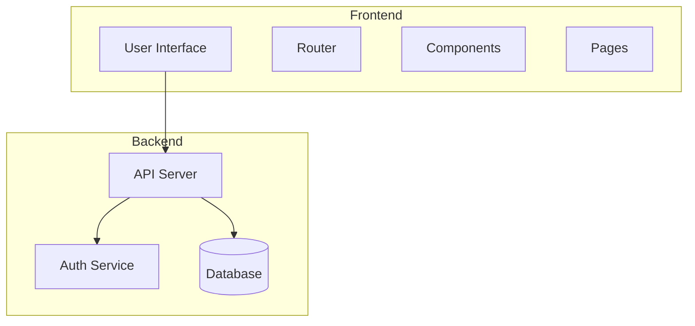
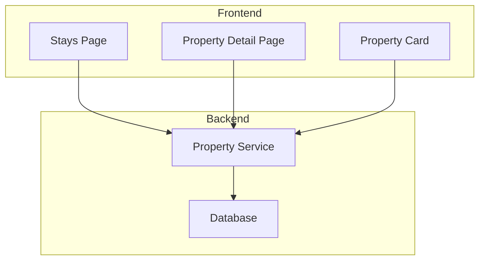
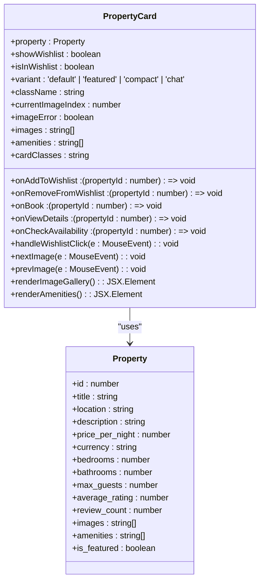
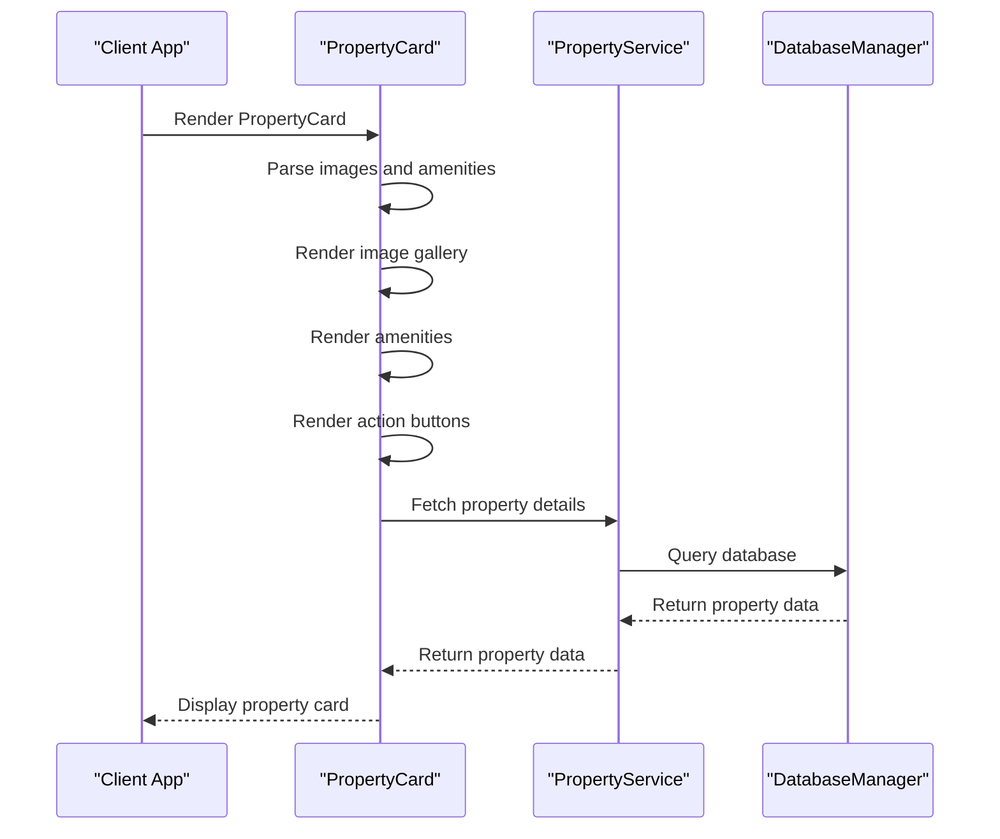
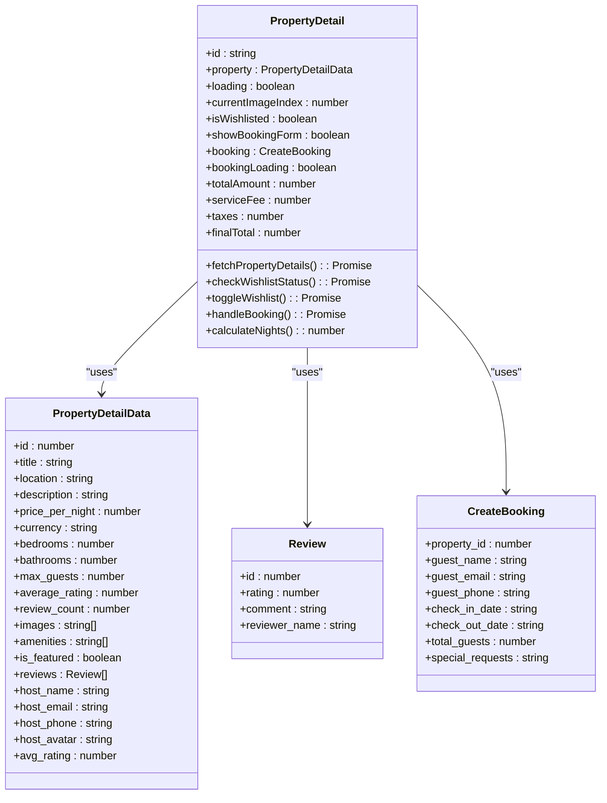
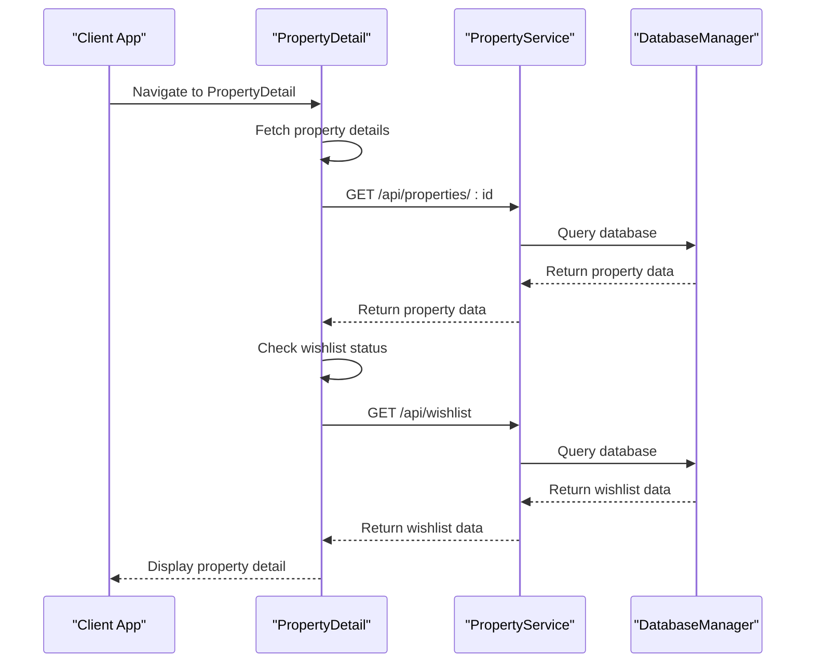
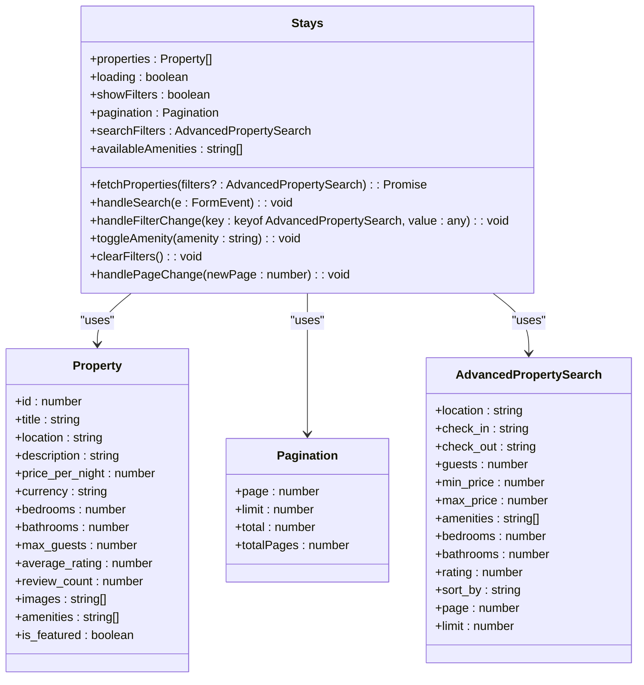
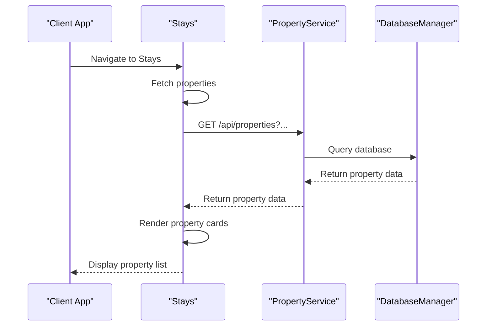
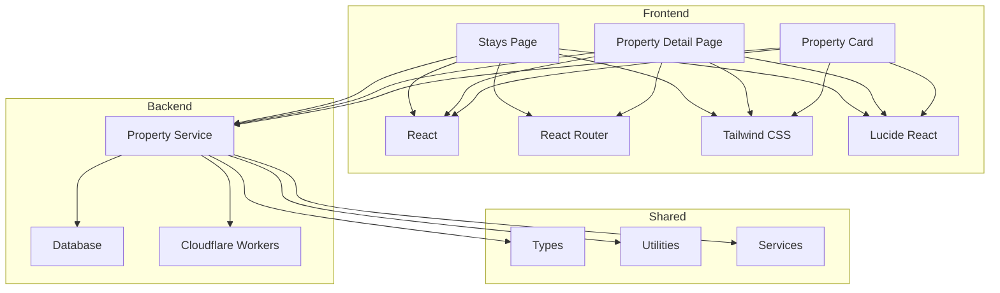

# Property Listing and Display

<cite>
**Referenced Files in This Document**   
- [PropertyCard.tsx](file://src/react-app/components/PropertyCard.tsx)
- [PropertyDetail.tsx](file://src/react-app/pages/PropertyDetail.tsx)
- [Stays.tsx](file://src/react-app/pages/Stays.tsx)
- [PropertyService.ts](file://src/server/services/PropertyService.ts)
- [index.ts](file://src/worker/index.ts)
</cite>

## Table of Contents
1. [Introduction](#introduction)
2. [Project Structure](#project-structure)
3. [Core Components](#core-components)
4. [Architecture Overview](#architecture-overview)
5. [Detailed Component Analysis](#detailed-component-analysis)
6. [Dependency Analysis](#dependency-analysis)
7. [Performance Considerations](#performance-considerations)
8. [Troubleshooting Guide](#troubleshooting-guide)
9. [Conclusion](#conclusion)

## Introduction
This document provides a comprehensive overview of the Property Listing and Display functionality in the HabibiStay application. It details how properties are fetched from the backend API and rendered on the Stays page using the PropertyCard component, including filtering, sorting, and pagination mechanisms. The implementation of the PropertyDetail page for showing comprehensive property information, availability calendar, and booking options is also covered. Backend GET routes for listing properties with query parameters for filters and retrieving individual property details are documented. Examples of data fetching with React Query or similar, loading states, and error handling are included. Performance considerations such as lazy loading, image optimization, and caching strategies are addressed, along with common issues like missing data, broken images, and slow load times.

## Project Structure
The project structure is organized into several key directories:
- `.qoder/quests`: Contains quest files for development tasks.
- `migrations`: Contains SQL migration files for database schema changes.
- `src`: The main source code directory.
  - `react-app`: Contains React components, pages, contexts, and the main application files.
  - `shared`: Contains shared utilities, types, and services.
  - `worker`: Contains the main server logic and API routes.
- Various configuration files such as `README.md`, `package.json`, `tailwind.config.js`, and `vite.config.ts`.

**Diagram sources**
- [App.tsx](file://src/react-app/App.tsx)
- [index.ts](file://src/worker/index.ts)

**Section sources**
- [App.tsx](file://src/react-app/App.tsx)
- [index.ts](file://src/worker/index.ts)

## Core Components
The core components of the Property Listing and Display functionality include:
- **PropertyCard**: A reusable component for displaying individual property listings.
- **PropertyDetail**: A page component for displaying detailed information about a specific property.
- **Stays**: A page component for listing and filtering properties.
- **PropertyService**: A service class for handling property-related operations on the backend.

**Section sources**
- [PropertyCard.tsx](file://src/react-app/components/PropertyCard.tsx)
- [PropertyDetail.tsx](file://src/react-app/pages/PropertyDetail.tsx)
- [Stays.tsx](file://src/react-app/pages/Stays.tsx)
- [PropertyService.ts](file://src/server/services/PropertyService.ts)

## Architecture Overview
The architecture of the Property Listing and Display functionality is designed to be modular and scalable. The frontend uses React for rendering components and managing state, while the backend uses a serverless architecture with Cloudflare Workers to handle API requests. The database is managed through SQL migrations, and the application is styled using Tailwind CSS.

**Diagram sources**
- [Stays.tsx](file://src/react-app/pages/Stays.tsx)
- [PropertyDetail.tsx](file://src/react-app/pages/PropertyDetail.tsx)
- [PropertyService.ts](file://src/server/services/PropertyService.ts)

## Detailed Component Analysis

### PropertyCard Analysis
The `PropertyCard` component is responsible for rendering individual property listings. It supports multiple variants (default, featured, compact, chat) and includes features such as image galleries, amenities, and action buttons.

#### Class Diagram

**Diagram sources**
- [PropertyCard.tsx](file://src/react-app/components/PropertyCard.tsx)
- [types.ts](file://src/shared/types.ts)

#### Sequence Diagram

**Diagram sources**
- [PropertyCard.tsx](file://src/react-app/components/PropertyCard.tsx)
- [PropertyService.ts](file://src/server/services/PropertyService.ts)

### PropertyDetail Analysis
The `PropertyDetail` component displays detailed information about a specific property, including images, amenities, host information, reviews, and a booking form.

#### Class Diagram

**Diagram sources**
- [PropertyDetail.tsx](file://src/react-app/pages/PropertyDetail.tsx)
- [types.ts](file://src/shared/types.ts)

#### Sequence Diagram

**Diagram sources**
- [PropertyDetail.tsx](file://src/react-app/pages/PropertyDetail.tsx)
- [PropertyService.ts](file://src/server/services/PropertyService.ts)

### Stays Analysis
The `Stays` component is responsible for listing and filtering properties. It includes a search form, advanced filters, and a grid of property cards.

#### Class Diagram

**Diagram sources**
- [Stays.tsx](file://src/react-app/pages/Stays.tsx)
- [types.ts](file://src/shared/types.ts)

#### Sequence Diagram

**Diagram sources**
- [Stays.tsx](file://src/react-app/pages/Stays.tsx)
- [PropertyService.ts](file://src/server/services/PropertyService.ts)

## Dependency Analysis
The Property Listing and Display functionality depends on several key components and services:
- **Frontend**: React, React Router, Tailwind CSS, Lucide React icons.
- **Backend**: Cloudflare Workers, SQLite database.
- **Shared**: Types, utilities, and services.

**Diagram sources**
- [Stays.tsx](file://src/react-app/pages/Stays.tsx)
- [PropertyDetail.tsx](file://src/react-app/pages/PropertyDetail.tsx)
- [PropertyCard.tsx](file://src/react-app/components/PropertyCard.tsx)
- [PropertyService.ts](file://src/server/services/PropertyService.ts)

**Section sources**
- [Stays.tsx](file://src/react-app/pages/Stays.tsx)
- [PropertyDetail.tsx](file://src/react-app/pages/PropertyDetail.tsx)
- [PropertyCard.tsx](file://src/react-app/components/PropertyCard.tsx)
- [PropertyService.ts](file://src/server/services/PropertyService.ts)

## Performance Considerations
The application includes several performance optimizations:
- **Lazy Loading**: Images are loaded only when they are in the viewport.
- **Image Optimization**: Images are served in optimized formats and sizes.
- **Caching**: Data is cached to reduce the number of API requests.
- **Debouncing**: Search and filter inputs are debounced to reduce the number of API requests.

**Section sources**
- [PropertyCard.tsx](file://src/react-app/components/PropertyCard.tsx)
- [Stays.tsx](file://src/react-app/pages/Stays.tsx)
- [performance-utils.ts](file://src/shared/performance-utils.ts)

## Troubleshooting Guide
Common issues and their solutions:
- **Missing Data**: Ensure that the property data is correctly formatted and includes all required fields.
- **Broken Images**: Check the image URLs and ensure they are accessible.
- **Slow Load Times**: Optimize images and use caching to reduce load times.

**Section sources**
- [PropertyCard.tsx](file://src/react-app/components/PropertyCard.tsx)
- [PropertyDetail.tsx](file://src/react-app/pages/PropertyDetail.tsx)
- [Stays.tsx](file://src/react-app/pages/Stays.tsx)

## Conclusion
The Property Listing and Display functionality in the HabibiStay application is well-structured and modular. It provides a seamless user experience for browsing and booking properties, with robust backend support for data management and performance optimization. The use of React and Cloudflare Workers ensures a scalable and maintainable architecture.