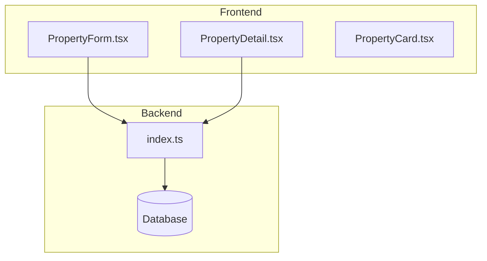
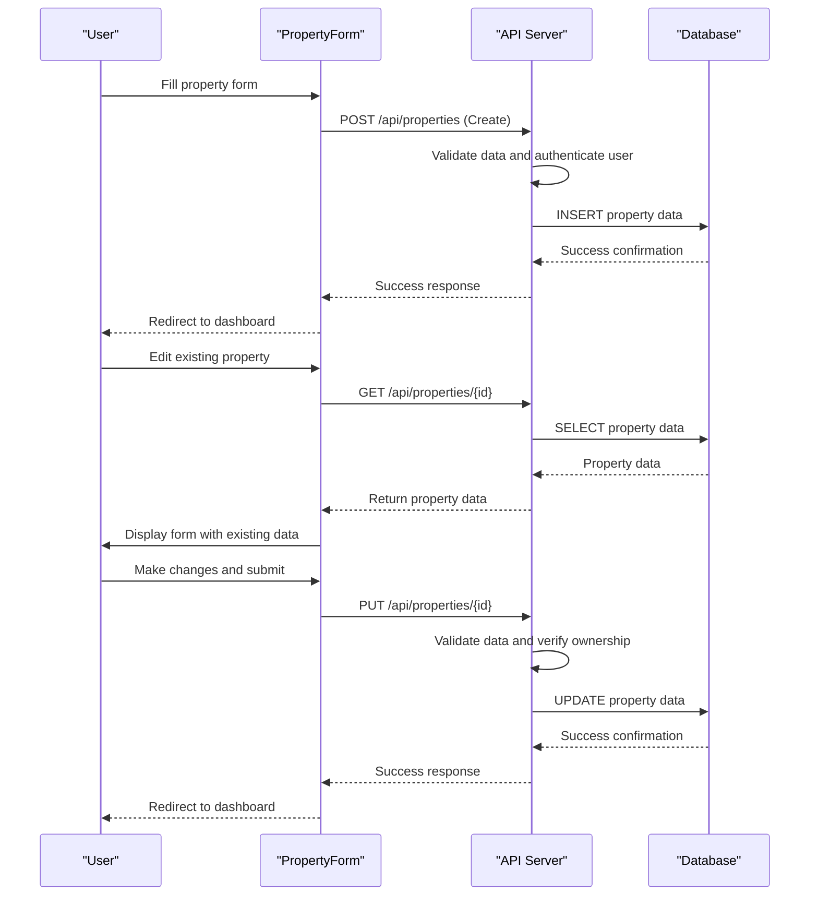
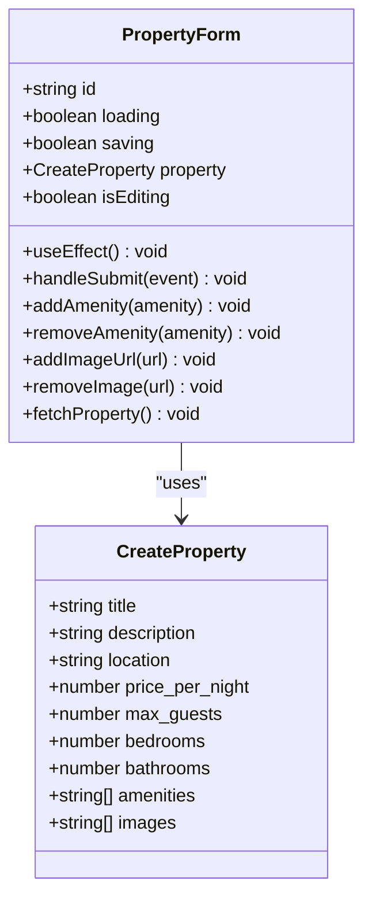
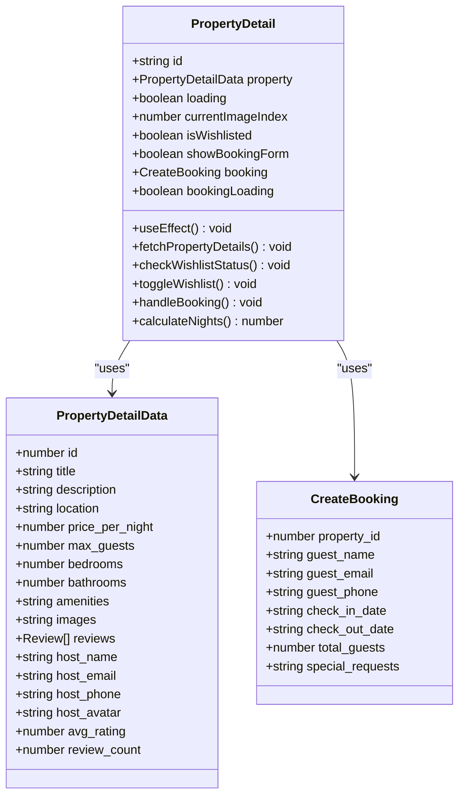
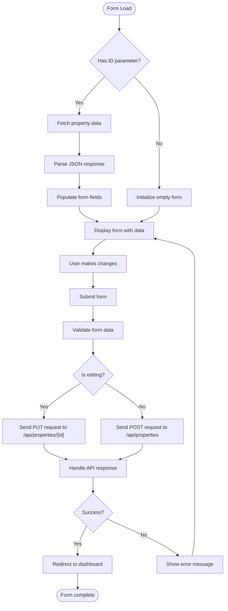
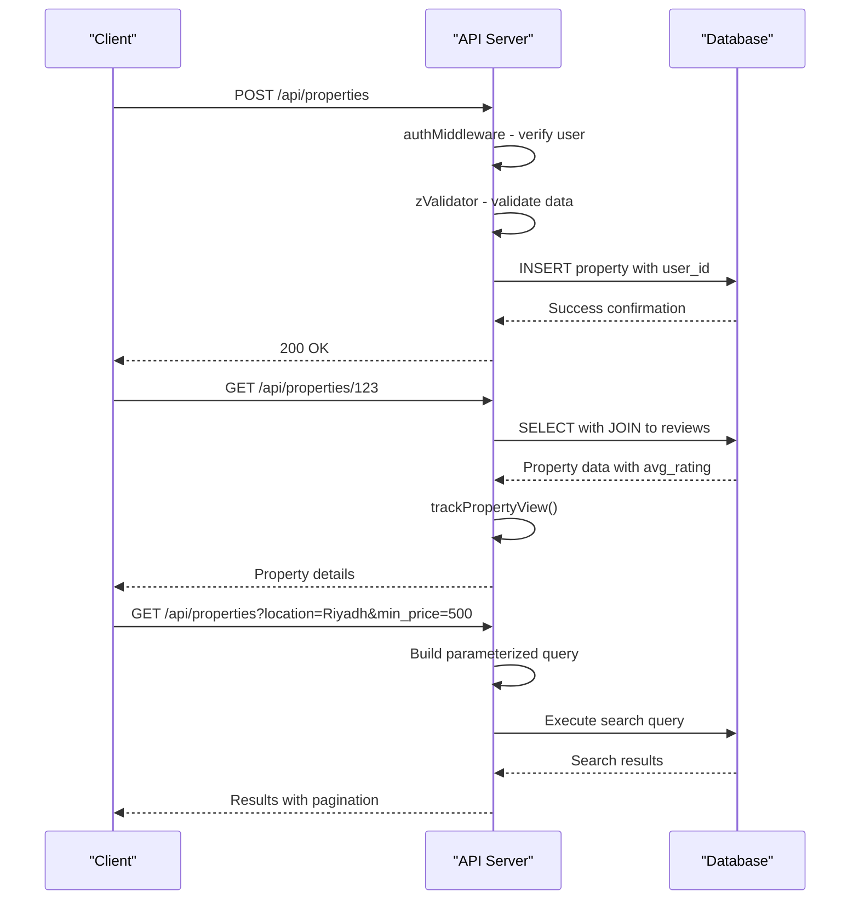
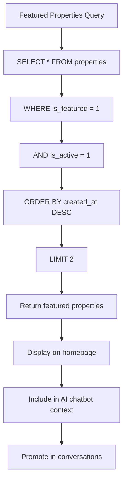
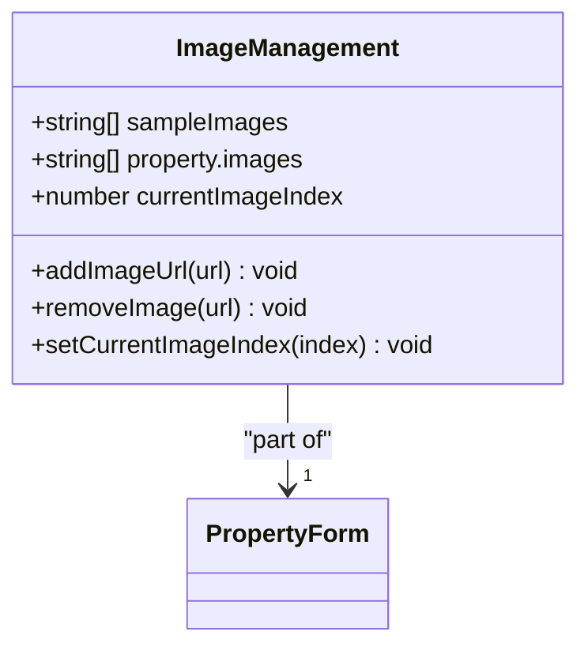
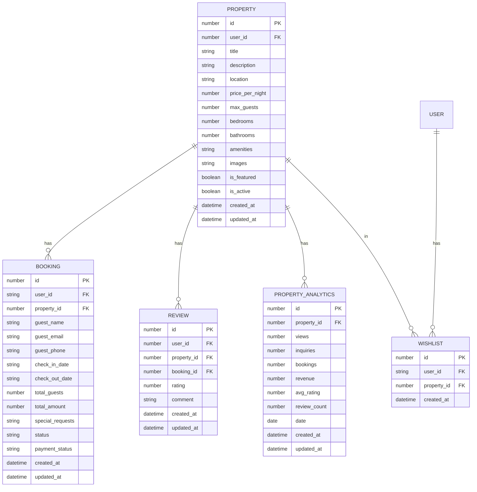
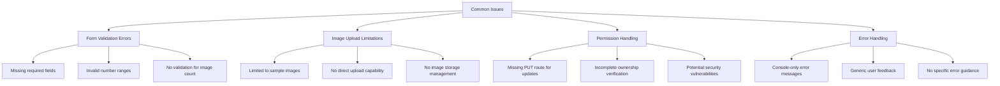

# Property Management

<cite>
**Referenced Files in This Document**   
- [PropertyForm.tsx](file://src/react-app/pages/PropertyForm.tsx)
- [PropertyDetail.tsx](file://src/react-app/pages/PropertyDetail.tsx)
- [index.ts](file://src/worker/index.ts)
</cite>

## Table of Contents
1. [Introduction](#introduction)
2. [Project Structure](#project-structure)
3. [Core Components](#core-components)
4. [Architecture Overview](#architecture-overview)
5. [Detailed Component Analysis](#detailed-component-analysis)
6. [Property Creation and Editing](#property-creation-and-editing)
7. [Backend API Implementation](#backend-api-implementation)
8. [Featured Properties](#featured-properties)
9. [Image Upload and Management](#image-upload-and-management)
10. [Relationship with Other Features](#relationship-with-other-features)
11. [Common Issues and Troubleshooting](#common-issues-and-troubleshooting)
12. [Conclusion](#conclusion)

## Introduction
The Property Management feature in HabibiStay enables property owners to create, edit, and manage their listings on the platform. This comprehensive system includes a user-friendly frontend interface for property form submission and detailed property display, backed by a robust backend API that handles data validation, ownership verification, and database operations. The system supports rich property information including title, description, location, pricing, capacity, amenities, and images. Property data is integrated with other platform features such as booking availability, analytics, and reviews, creating a cohesive ecosystem for property management and guest experience.

## Project Structure
The Property Management feature is implemented across both frontend and backend components of the HabibiStay application. The frontend components are located in the `src/react-app/pages/` directory, while the backend API routes are defined in the worker module. This separation follows a clean architecture pattern with clear boundaries between presentation, business logic, and data access layers.

**Diagram sources**
- [PropertyForm.tsx](file://src/react-app/pages/PropertyForm.tsx)
- [PropertyDetail.tsx](file://src/react-app/pages/PropertyDetail.tsx)
- [index.ts](file://src/worker/index.ts)

## Core Components
The Property Management system consists of two primary frontend components: PropertyForm for property creation and editing, and PropertyDetail for displaying property information to guests. These components work in conjunction with backend API routes that handle CRUD operations, validation, and database interactions. The system uses React's useState and useEffect hooks for state management and side effects, with form data stored in component state and synchronized with the backend via fetch requests.

**Section sources**
- [PropertyForm.tsx](file://src/react-app/pages/PropertyForm.tsx)
- [PropertyDetail.tsx](file://src/react-app/pages/PropertyDetail.tsx)

## Architecture Overview
The Property Management architecture follows a client-server model with a React-based frontend and a Cloudflare Workers backend. The frontend components handle user interface rendering and form state management, while the backend API routes process requests, perform validation, and interact with the database. The system uses a RESTful API design with standard HTTP methods for CRUD operations, and implements authentication middleware to verify user ownership before allowing property modifications.

**Diagram sources**
- [PropertyForm.tsx](file://src/react-app/pages/PropertyForm.tsx)
- [index.ts](file://src/worker/index.ts)

## Detailed Component Analysis

### PropertyForm Component Analysis
The PropertyForm component provides a comprehensive interface for property owners to create new listings or edit existing ones. It includes form fields for basic information, property details, amenities selection, and image management. The component uses React state to manage form data and implements real-time validation through HTML5 form attributes and React state updates.

**Diagram sources**
- [PropertyForm.tsx](file://src/react-app/pages/PropertyForm.tsx#L1-L492)

**Section sources**
- [PropertyForm.tsx](file://src/react-app/pages/PropertyForm.tsx#L1-L492)

### PropertyDetail Component Analysis
The PropertyDetail component displays comprehensive information about a property to potential guests. It includes an image gallery with navigation controls, property specifications, amenities list with icons, host information, and reviews section. The component manages state for image carousel navigation, wishlist status, and booking form visibility.

**Diagram sources**
- [PropertyDetail.tsx](file://src/react-app/pages/PropertyDetail.tsx#L1-L562)

**Section sources**
- [PropertyDetail.tsx](file://src/react-app/pages/PropertyDetail.tsx#L1-L562)

## Property Creation and Editing
The PropertyForm component handles both property creation and editing through a unified interface. When a user navigates to the form without an ID parameter, it displays a "Create Property" interface. When an ID parameter is present, it fetches the existing property data and displays an "Edit Property" interface.

The form is divided into logical sections: Basic Information, Property Details, Amenities, and Images. Each section contains relevant input fields with appropriate validation. The component uses React's useState hook to maintain form state, with the property object storing all form data. When the form is submitted, the handleSubmit function prevents the default form submission, sets the saving state to true, and sends a fetch request to the backend API.

For editing functionality, the component uses the useEffect hook to detect when an ID parameter is present and calls the fetchProperty function to retrieve the existing property data from the API. The retrieved data is then parsed and set in the component state, populating the form fields with the current property values.

**Diagram sources**
- [PropertyForm.tsx](file://src/react-app/pages/PropertyForm.tsx#L1-L492)

**Section sources**
- [PropertyForm.tsx](file://src/react-app/pages/PropertyForm.tsx#L1-L492)

## Backend API Implementation
The backend API for property management is implemented in the worker/index.ts file using Cloudflare Workers and a SQL database. The API follows RESTful principles with standard HTTP methods for CRUD operations. The implementation includes comprehensive validation, authentication, and error handling to ensure data integrity and security.

### Property Creation (POST /api/properties)
The property creation endpoint validates incoming data using Zod schema validation (CreatePropertySchema) and requires user authentication via the authMiddleware. Once authenticated, the endpoint inserts the property data into the database, with amenities and images stored as JSON strings. The user ID from the authentication context is associated with the property to establish ownership.

### Property Retrieval (GET /api/properties/:id)
The property retrieval endpoint fetches a specific property by ID, joining with the reviews table to calculate the average rating and review count. This endpoint also tracks property views by calling the trackPropertyView function, which updates analytics data for the property.

### Property Search (GET /api/properties)
The property search endpoint supports advanced filtering by location, price range, guest capacity, bedrooms, bathrooms, amenities, and rating. It implements pagination with page and limit parameters and supports sorting by various criteria including price, rating, and recency. The query uses parameterized SQL to prevent injection attacks and calculates total results for pagination metadata.

### Ownership Verification
The backend implements ownership verification through the authMiddleware, which extracts user information from authentication tokens. While the PUT route for property updates was not found in the codebase, the pattern suggests it would include similar authentication and ownership checks to ensure users can only modify their own properties.

**Diagram sources**
- [index.ts](file://src/worker/index.ts#L180-L405)

**Section sources**
- [index.ts](file://src/worker/index.ts#L180-L405)

## Featured Properties
Featured properties are determined by the is_featured flag in the properties table. The backend provides a dedicated endpoint (GET /api/properties/featured) that retrieves properties where is_featured = 1 and is_active = 1, ordered by creation date in descending order with a limit of 2 results. This endpoint is used to showcase premium listings on the homepage or in promotional areas.

The AI chatbot system also references featured properties in its system prompt, using them as examples when assisting guests with property searches. This integration ensures that featured properties receive additional visibility through the conversational interface.

**Diagram sources**
- [index.ts](file://src/worker/index.ts#L180-L405)

**Section sources**
- [index.ts](file://src/worker/index.ts#L180-L405)

## Image Upload and Management
The PropertyForm component implements a sample-based image management system rather than direct file uploads. It provides a set of sample images from Unsplash that users can add to their property listing with a single click. This approach simplifies the implementation by avoiding complex file upload handling and storage concerns.

The component maintains an array of image URLs in the property state, with functions to add and remove images. The first image in the array is designated as the main photo and displayed prominently in the gallery. Users can navigate through images using arrow buttons or thumbnail indicators.

When a property is saved, the array of image URLs is serialized to JSON and stored in the database. The PropertyDetail component parses this JSON string back into an array and displays the images in a carousel format with navigation controls.

**Diagram sources**
- [PropertyForm.tsx](file://src/react-app/pages/PropertyForm.tsx#L1-L492)
- [PropertyDetail.tsx](file://src/react-app/pages/PropertyDetail.tsx#L1-L562)

**Section sources**
- [PropertyForm.tsx](file://src/react-app/pages/PropertyForm.tsx#L1-L492)
- [PropertyDetail.tsx](file://src/react-app/pages/PropertyDetail.tsx#L1-L562)

## Relationship with Other Features
Property data is central to several other features in the HabibiStay platform, creating a tightly integrated ecosystem.

### Booking Availability
The booking system checks property availability by querying the bookings table for conflicting reservations. When a booking request is submitted, the system verifies that the requested dates do not overlap with existing bookings for the same property. This ensures that guests cannot book a property during already reserved periods.

### Analytics
Property views are tracked through the trackPropertyView function, which updates analytics data whenever a property is viewed. Booking confirmations also update property analytics, incrementing booking counts and revenue figures. This data is accessible through the /api/properties/:id/analytics endpoint, allowing property owners to monitor their listing's performance.

### Reviews
The reviews system is directly linked to properties, with each review associated with a specific property ID. When a review is submitted, the system updates the property's average rating and review count in the analytics data. The PropertyDetail component displays these metrics prominently to help guests evaluate the property.

### Wishlist
Users can add properties to their wishlist, creating a personal collection of favorite listings. The wishlist system checks user authentication and prevents duplicate entries. This feature increases user engagement and helps guests keep track of properties they are interested in.

**Diagram sources**
- [index.ts](file://src/worker/index.ts#L180-L405)
- [PropertyForm.tsx](file://src/react-app/pages/PropertyForm.tsx#L1-L492)
- [PropertyDetail.tsx](file://src/react-app/pages/PropertyDetail.tsx#L1-L562)

**Section sources**
- [index.ts](file://src/worker/index.ts#L180-L405)
- [PropertyForm.tsx](file://src/react-app/pages/PropertyForm.tsx#L1-L492)
- [PropertyDetail.tsx](file://src/react-app/pages/PropertyDetail.tsx#L1-L562)

## Common Issues and Troubleshooting
The Property Management system may encounter several common issues that affect user experience and data integrity.

### Form Validation Errors
Form validation errors can occur when required fields are missing or contain invalid data. The frontend implements basic HTML5 validation for required fields and number ranges, but more complex validation (such as ensuring at least one image is added) is not currently implemented. Users may encounter submission failures if they omit required information.

### Image Upload Limitations
The current implementation uses a sample image selection approach rather than direct image uploads. This limits users to the provided sample images and prevents them from using their own property photos. A more robust solution would include direct image upload functionality with cloud storage integration.

### Permission Handling
The system relies on the authMiddleware for authentication, but the implementation of ownership verification for property editing is incomplete. The PUT route for updating properties was not found in the codebase, suggesting that property editing functionality may be missing or implemented differently than expected. This could lead to security vulnerabilities if not properly addressed.

### Error Handling
Error handling is implemented with try-catch blocks and console.error statements, but user-facing error messages are limited. When API requests fail, users see generic error messages in the console but may not receive clear feedback in the user interface. Improved error handling would display user-friendly messages explaining what went wrong and how to resolve the issue.

**Diagram sources**
- [PropertyForm.tsx](file://src/react-app/pages/PropertyForm.tsx#L1-L492)
- [index.ts](file://src/worker/index.ts#L180-L405)

**Section sources**
- [PropertyForm.tsx](file://src/react-app/pages/PropertyForm.tsx#L1-L492)
- [index.ts](file://src/worker/index.ts#L180-L405)

## Conclusion
The Property Management feature in HabibiStay provides a comprehensive system for property owners to create and manage their listings. The frontend components offer an intuitive interface for property creation and display, while the backend API handles data persistence, validation, and retrieval. The system integrates with other platform features such as booking, reviews, and analytics to create a cohesive experience for both property owners and guests.

Key strengths of the implementation include the clean separation of concerns between frontend and backend, the use of standardized validation and authentication patterns, and the integration of property data across multiple features. However, there are opportunities for improvement, particularly in the areas of image upload functionality, comprehensive form validation, and complete implementation of property editing with proper ownership verification.

Future enhancements could include direct image upload with cloud storage integration, more sophisticated form validation with user feedback, and a complete implementation of the property editing workflow with robust permission checks. These improvements would enhance the user experience and ensure data integrity across the platform.