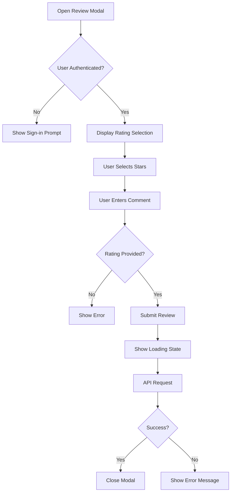
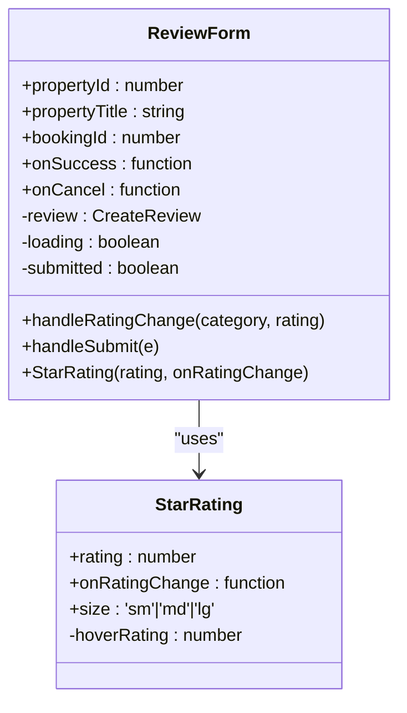
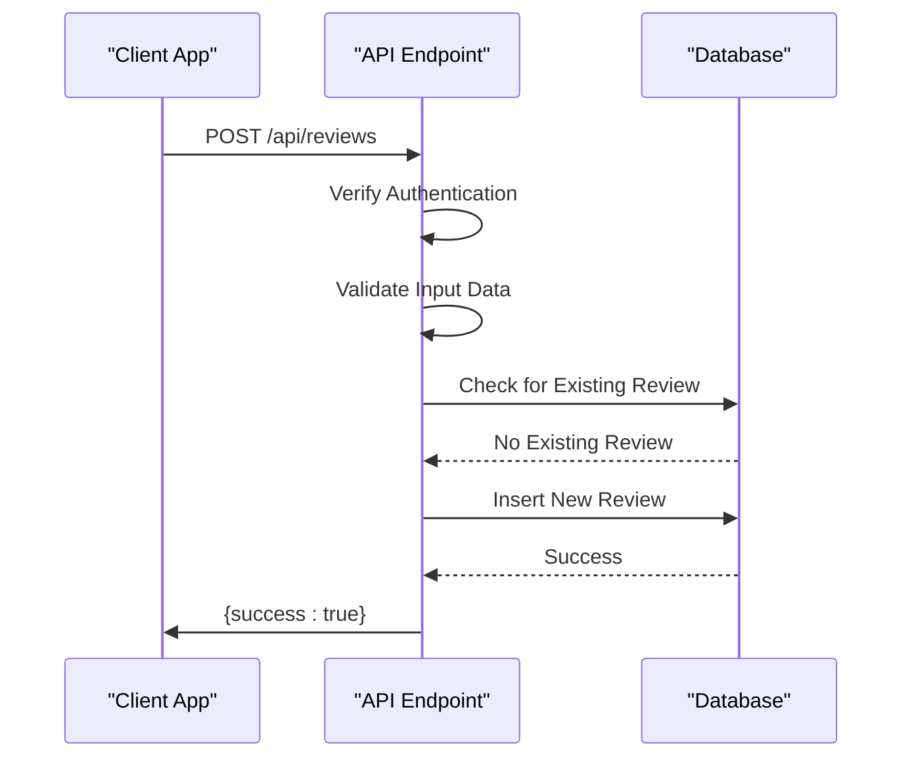
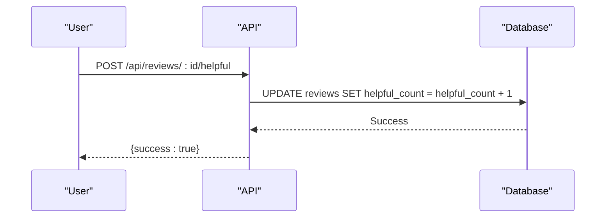

# Review System

<cite>
**Referenced Files in This Document**   
- [ReviewModal.tsx](file://src/react-app/components/ReviewModal.tsx)
- [ReviewForm.tsx](file://src/react-app/components/ReviewForm.tsx)
- [index.ts](file://src/worker/index.ts#L1352-L1400)
- [index.ts](file://src/worker/index.ts#L2011-L2028)
- [index.ts](file://src/worker/index.ts#L2050-L2099)
- [types.ts](file://src/shared/types.ts#L100-L120)
- [types.ts](file://src/shared/types.ts#L300-L320)
</cite>

## Table of Contents
1. [Introduction](#introduction)
2. [Review Submission Process](#review-submission-process)
3. [Frontend Implementation](#frontend-implementation)
4. [Backend Validation and Database Schema](#backend-validation-and-database-schema)
5. [Review Display and Statistics](#review-display-and-statistics)
6. [Moderation and User Engagement](#moderation-and-user-engagement)
7. [Preventing Duplicate Reviews](#preventing-duplicate-reviews)
8. [Analytics and Reporting](#analytics-and-reporting)

## Introduction
The Review System enables guests to submit feedback about their stay experience on properties within the HabibiStay platform. This documentation details the full implementation of the review functionality, including frontend components, backend validation, database schema, moderation workflows, and analytics integration. The system ensures that only authenticated users who have completed bookings can submit reviews, prevents duplicate submissions, calculates average ratings, and displays reviews on property pages.

## Review Submission Process
Guests can submit reviews through a modal interface after completing a booking. The process begins when a user clicks the "Leave a Review" button on a property detail page. The system verifies that the user is authenticated and has a completed booking for the property. Once confirmed, the ReviewModal component is displayed, allowing the user to provide a star rating and written feedback. Upon submission, the review is validated on both client and server sides before being stored in the database.

The review submission flow includes:
1. User authentication check
2. Booking completion verification
3. Form validation (rating required, comment optional)
4. Duplicate review prevention
5. Database insertion
6. Analytics update
7. Success confirmation

**Section sources**
- [ReviewModal.tsx](file://src/react-app/components/ReviewModal.tsx#L1-L186)
- [index.ts](file://src/worker/index.ts#L1352-L1400)

## Frontend Implementation

### ReviewModal Component
The ReviewModal component provides a user-friendly interface for submitting reviews. It displays the property information, rating selection, and comment field in a modal dialog.



**Diagram sources**
- [ReviewModal.tsx](file://src/react-app/components/ReviewModal.tsx#L1-L186)

**Section sources**
- [ReviewModal.tsx](file://src/react-app/components/ReviewModal.tsx#L1-L186)

### Multi-category Rating System
The ReviewForm component implements an advanced rating system that allows users to rate multiple aspects of their stay, including cleanliness, communication, location, and value. The overall rating is automatically calculated as the average of these category ratings.



**Diagram sources**
- [ReviewForm.tsx](file://src/react-app/components/ReviewForm.tsx#L1-L288)

**Section sources**
- [ReviewForm.tsx](file://src/react-app/components/ReviewForm.tsx#L1-L288)

## Backend Validation and Database Schema

### Validation Logic
The backend implements strict validation rules for review submissions. The validation occurs in the POST /api/reviews route handler and includes:

- Authentication verification
- Required field validation (property_id, rating)
- Rating range validation (1-5 stars)
- Duplicate review prevention
- Database integrity constraints



**Diagram sources**
- [index.ts](file://src/worker/index.ts#L1352-L1400)

**Section sources**
- [index.ts](file://src/worker/index.ts#L1352-L1400)

### Data Structures
The shared types define the structure of reviews across the application. The CreateReviewSchema enforces validation rules at the type level.

**Review Schema**
- property_id: number (required)
- booking_id: number (optional)
- rating: number (1-5, required)
- comment: string (optional)

**CreateReview Interface**
```typescript
interface CreateReview {
  property_id: number;
  booking_id?: number;
  rating: number;
  comment?: string;
}
```

**Section sources**
- [types.ts](file://src/shared/types.ts#L100-L120)

## Review Display and Statistics

### Review Summary Component
The ReviewSummary component displays aggregate review statistics on property pages, including average rating, total reviews, and rating distribution.

```mermaid
flowchart TD
A[Load Property Page] --> B[Fetch Review Summary]
B --> C{Reviews Exist?}
C --> |No| D[Show "Be the First to Review"]
C --> |Yes| E[Display Average Rating]
E --> F[Show Rating Distribution]
F --> G[Display Recent Reviews]
G --> H[Show Helpful Buttons]
```

**Section sources**
- [index.ts](file://src/worker/index.ts#L2050-L2099)

### Rating Calculation
The system calculates average ratings using the following formula:
- Overall average: SUM(rating) / COUNT(reviews)
- Category averages: AVG(cleanliness_rating), AVG(communication_rating), etc.
- Rating distribution: COUNT of 1,2,3,4,5 star reviews

The GET /api/reviews/summary/:propertyId endpoint returns comprehensive review statistics.

**Section sources**
- [index.ts](file://src/worker/index.ts#L2050-L2099)

## Moderation and User Engagement

### Helpful Reviews Feature
Users can mark reviews as helpful, which increases the helpful_count field in the database. This feature helps surface the most valuable reviews.



**Diagram sources**
- [index.ts](file://src/worker/index.ts#L2011-L2028)

**Section sources**
- [index.ts](file://src/worker/index.ts#L2011-L2028)

### Review Guidelines
The system enforces community guidelines by:
- Displaying review guidelines in the submission form
- Moderating content for offensive language
- Allowing users to report inappropriate reviews
- Implementing automated spam detection

## Preventing Duplicate Reviews
The system prevents users from submitting multiple reviews for the same property through database-level checks.

**Duplicate Prevention Logic:**
1. Before inserting a new review, query the database for existing reviews by the same user for the same property
2. If a review exists, return a 400 error with message "You have already reviewed this property"
3. If no review exists, proceed with insertion

```sql
SELECT id FROM reviews WHERE user_id = ? AND property_id = ?
```

This check ensures that each user can only submit one review per property, maintaining the integrity of the review system.

**Section sources**
- [index.ts](file://src/worker/index.ts#L1352-L1400)

## Analytics and Reporting

### Property Analytics Integration
When a new review is submitted, the system updates the property_analytics table to reflect the new rating and review count.

**Analytics Update Logic:**
- Increment review_count by 1
- Update avg_rating using weighted average formula
- Record the update date

```sql
INSERT INTO property_analytics (property_id, review_count, avg_rating, date) 
VALUES (?, 1, ?, ?)
ON CONFLICT(property_id, date) 
DO UPDATE SET 
  review_count = review_count + 1,
  avg_rating = (avg_rating * (review_count - 1) + ?) / review_count,
  updated_at = CURRENT_TIMESTAMP
```

### Analytics Data Structure
The PropertyAnalyticsSchema defines the structure for analytics data:

**PropertyAnalytics Interface**
```typescript
interface PropertyAnalytics {
  id: number;
  property_id: number;
  views: number;
  inquiries: number;
  bookings: number;
  revenue: number;
  avg_rating: number;
  review_count: number;
  occupancy_rate: number;
  date: string;
  created_at: string;
  updated_at: string;
}
```

This data is used in admin dashboards to track property performance over time.

**Section sources**
- [types.ts](file://src/shared/types.ts#L300-L320)
- [index.ts](file://src/worker/index.ts#L1352-L1400)