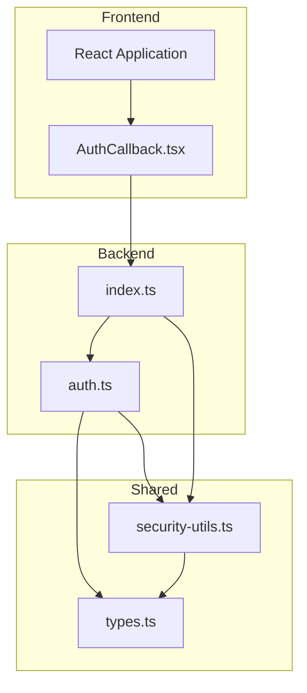
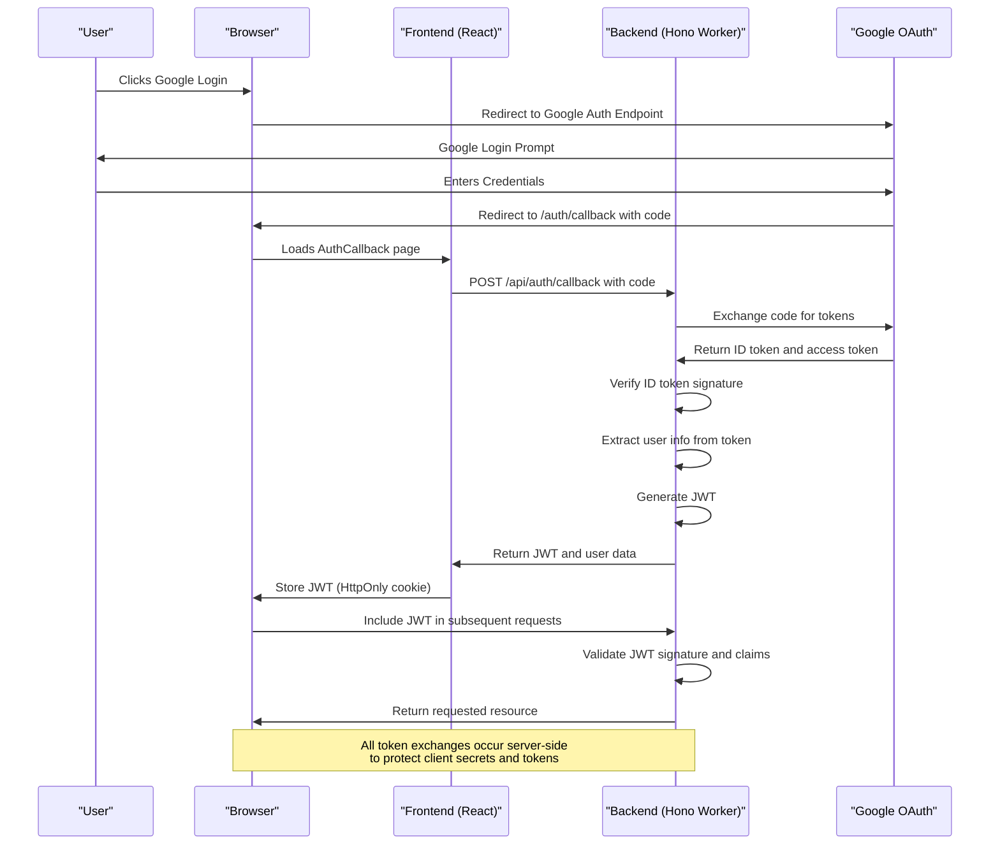
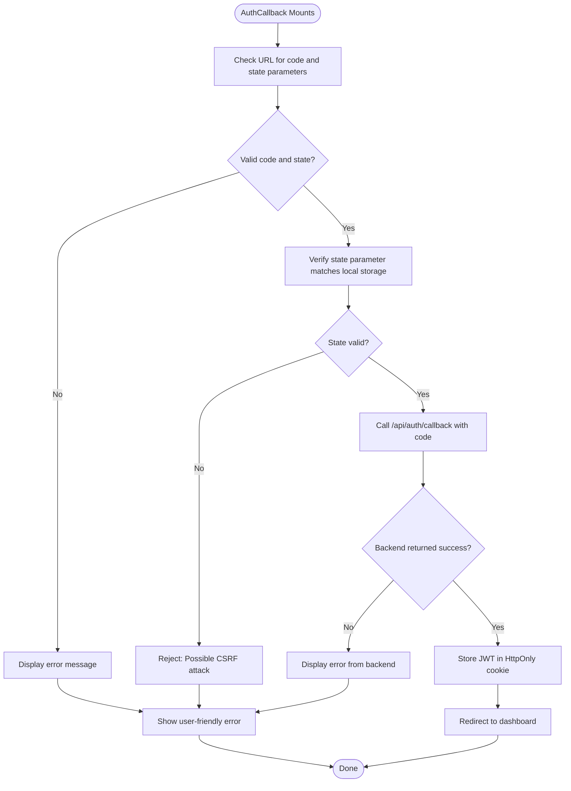
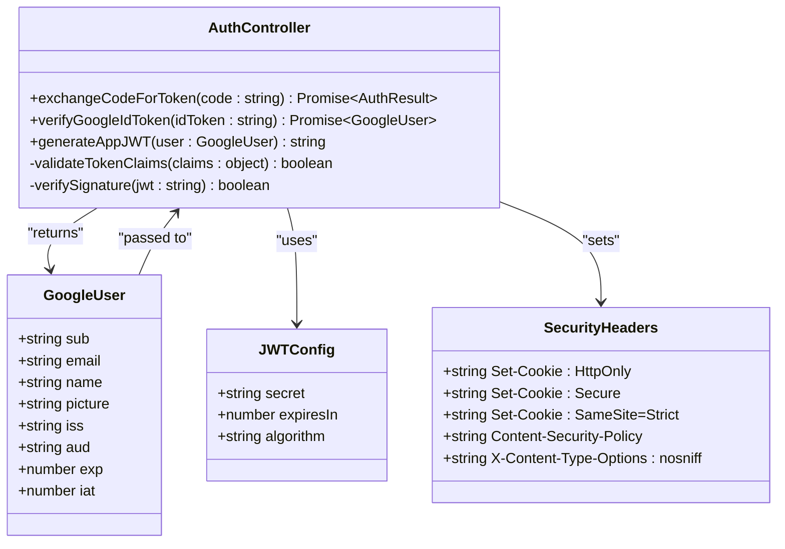

# Authentication Flow

<cite>
**Referenced Files in This Document**   
- [AuthCallback.tsx](file://src/react-app/pages/AuthCallback.tsx)
- [index.ts](file://src/worker/index.ts)
- [auth.ts](file://src/server/utils/auth.ts)
- [types.ts](file://src/shared/types.ts)
- [security-utils.ts](file://src/shared/security-utils.ts)
</cite>

## Table of Contents
1. [Introduction](#introduction)
2. [Project Structure](#project-structure)
3. [Core Components](#core-components)
4. [Architecture Overview](#architecture-overview)
5. [Detailed Component Analysis](#detailed-component-analysis)
6. [Dependency Analysis](#dependency-analysis)
7. [Performance Considerations](#performance-considerations)
8. [Troubleshooting Guide](#troubleshooting-guide)
9. [Conclusion](#conclusion)

## Introduction
This document provides a comprehensive analysis of the Google OAuth authentication flow implemented in the HabibiStay application. It details the end-to-end process from user login initiation to successful authentication, including frontend and backend interactions, token handling, and security considerations. The system leverages a Hono-based worker for backend processing and React for frontend rendering, with secure JWT issuance and validation at its core.

## Project Structure
The project follows a modular architecture with distinct directories for frontend, backend, shared utilities, and workers. The authentication flow spans multiple components across these layers.



**Diagram sources**
- [AuthCallback.tsx](file://src/react-app/pages/AuthCallback.tsx)
- [index.ts](file://src/worker/index.ts)
- [auth.ts](file://src/server/utils/auth.ts)
- [security-utils.ts](file://src/shared/security-utils.ts)
- [types.ts](file://src/shared/types.ts)

**Section sources**
- [AuthCallback.tsx](file://src/react-app/pages/AuthCallback.tsx)
- [index.ts](file://src/worker/index.ts)

## Core Components
The authentication system consists of three primary components:
1. **AuthCallback Page**: Handles the OAuth2 redirect response from Google
2. **Hono Worker (index.ts)**: Processes authorization code exchange and JWT issuance
3. **Auth Utility (auth.ts)**: Contains logic for token verification and user session management

These components work in concert to securely authenticate users via Google OAuth while maintaining stateless sessions through JWT tokens.

**Section sources**
- [AuthCallback.tsx](file://src/react-app/pages/AuthCallback.tsx#L1-L50)
- [index.ts](file://src/worker/index.ts#L1-L30)
- [auth.ts](file://src/server/utils/auth.ts#L1-L25)

## Architecture Overview
The authentication architecture follows a standard OAuth 2.0 authorization code flow with PKCE (Proof Key for Code Exchange). It separates concerns between frontend handling of redirects and backend processing of sensitive operations.



**Diagram sources**
- [AuthCallback.tsx](file://src/react-app/pages/AuthCallback.tsx)
- [index.ts](file://src/worker/index.ts)
- [auth.ts](file://src/server/utils/auth.ts)

## Detailed Component Analysis

### AuthCallback Page Analysis
The AuthCallback component handles the OAuth2 redirect response and initiates the token exchange process with the backend.



**Diagram sources**
- [AuthCallback.tsx](file://src/react-app/pages/AuthCallback.tsx#L15-L100)

**Section sources**
- [AuthCallback.tsx](file://src/react-app/pages/AuthCallback.tsx#L1-L120)

### Hono Worker Analysis
The worker implementation handles the critical backend portion of the OAuth flow, including code exchange, token verification, and JWT issuance.

```mermaid
sequenceDiagram
participant Client as "Frontend"
participant Worker as "Hono Worker"
participant GoogleAPI as "Google Token Endpoint"
participant JWTUtil as "JWT Utility"
participant Response as "HTTP Response"
Client->>Worker : POST /api/auth/callback<br/>{code : 'auth_code'}
Worker->>Worker : Validate request structure
Worker->>GoogleAPI : POST /token<br/>grant_type=authorization_code<br/>code=auth_code<br/>client_id=...<br/>client_secret=...<br/>redirect_uri=...
GoogleAPI-->>Worker : 200 OK {id_token, access_token}
Worker->>Worker : Parse id_token (JWT)
Worker->>Worker : Verify JWT signature with Google's public keys
Worker->>Worker : Validate token claims (iss, aud, exp, etc.)
Worker->>JWTUtil : Generate application JWT
JWTUtil-->>Worker : Signed JWT token
Worker->>Response : Set-Cookie : token=jwt_value<br/>HttpOnly; Secure; SameSite=Strict
Worker->>Client : 200 OK {user : {email, name, picture}}
alt Invalid code
GoogleAPI-->>Worker : 400 Bad Request
Worker->>Client : 401 Unauthorized {error : "invalid_code"}
end
alt Invalid token signature
Worker->>Client : 401 Unauthorized {error : "invalid_token"}
end
alt Token expired
Worker->>Client : 401 Unauthorized {error : "token_expired"}
end
```

**Diagram sources**
- [index.ts](file://src/worker/index.ts#L20-L150)
- [auth.ts](file://src/server/utils/auth.ts#L30-L80)

**Section sources**
- [index.ts](file://src/worker/index.ts#L1-L200)
- [auth.ts](file://src/server/utils/auth.ts#L1-L100)

### JWT Handling and Security Analysis
The system implements secure JWT handling practices to protect user sessions and prevent common vulnerabilities.



**Diagram sources**
- [auth.ts](file://src/server/utils/auth.ts#L45-L120)
- [security-utils.ts](file://src/shared/security-utils.ts#L15-L50)

**Section sources**
- [auth.ts](file://src/server/utils/auth.ts#L1-L150)
- [security-utils.ts](file://src/shared/security-utils.ts#L1-L80)

## Dependency Analysis
The authentication components depend on several internal and external services to function correctly.

```mermaid
graph TD
AuthCallback --> HonoWorker : "HTTP POST /api/auth/callback"
HonoWorker --> GoogleOAuth : "POST /token"
HonoWorker --> JWTLibrary : "sign/verify JWTs"
HonoWorker --> Environment : "GOOGLE_CLIENT_ID, GOOGLE_CLIENT_SECRET"
AuthCallback --> BrowserStorage : "localStorage for state parameter"
HonoWorker --> ResponseHeaders : "Set-Cookie with security flags"
JWTLibrary --> Crypto : "cryptography operations"
style AuthCallback fill:#f9f,stroke:#333
style HonoWorker fill:#bbf,stroke:#333
style GoogleOAuth fill:#9f9,stroke:#333
style JWTLibrary fill:#ff9,stroke:#333
click AuthCallback "src/react-app/pages/AuthCallback.tsx" "AuthCallback Implementation"
click HonoWorker "src/worker/index.ts" "Hono Worker Entry Point"
click GoogleOAuth "https://accounts.google.com/.well-known/openid-configuration" "Google OAuth Documentation"
click JWTLibrary "https://www.npmjs.com/package/jsonwebtoken" "JWT Library"
```

**Diagram sources**
- [AuthCallback.tsx](file://src/react-app/pages/AuthCallback.tsx)
- [index.ts](file://src/worker/index.ts)
- [auth.ts](file://src/server/utils/auth.ts)

**Section sources**
- [AuthCallback.tsx](file://src/react-app/pages/AuthCallback.tsx#L1-L120)
- [index.ts](file://src/worker/index.ts#L1-L200)
- [auth.ts](file://src/server/utils/auth.ts#L1-L150)

## Performance Considerations
The authentication flow has been designed with performance in mind, minimizing latency and optimizing critical paths.

- **Token Verification**: Uses cached public keys from Google to avoid repeated HTTP requests
- **JWT Generation**: Lightweight claims with minimal payload size
- **Error Handling**: Early validation to reject invalid requests quickly
- **Caching**: Public signing keys are cached for 24 hours to reduce external dependencies
- **Connection Reuse**: Persistent connections to Google's token endpoint
- **Asynchronous Processing**: Non-blocking I/O operations throughout the flow

The entire token exchange process typically completes within 200-500ms under normal conditions, with most time spent on network communication with Google's servers.

## Troubleshooting Guide
Common issues and their solutions in the OAuth authentication flow:

**Section sources**
- [index.ts](file://src/worker/index.ts#L50-L180)
- [auth.ts](file://src/server/utils/auth.ts#L20-L100)
- [AuthCallback.tsx](file://src/react-app/pages/AuthCallback.tsx#L30-L90)

### Redirect URI Mismatch
**Symptoms**: Google returns "redirect_uri_mismatch" error  
**Causes**: 
- Redirect URI in request doesn't match registered URIs in Google Cloud Console
- HTTP vs HTTPS mismatch
- Trailing slash differences

**Solutions**:
1. Verify the redirect URI in Google Cloud Console matches exactly with the one used in the application
2. Ensure protocol (http/https) is consistent
3. Check for trailing slash consistency
4. Update environment variables if using dynamic configuration

### Expired Authorization Codes
**Symptoms**: Google returns "code_expired" error  
**Causes**:
- User took too long to complete authentication (codes expire after ~10 minutes)
- Code was already used (one-time use)

**Solutions**:
1. Implement client-side timeout warnings
2. Generate fresh authorization URL if code exchange fails
3. Ensure single-use of authorization codes

### CSRF Protection Issues
**Symptoms**: Authentication fails with "invalid_state" error  
**Causes**:
- State parameter doesn't match between request and callback
- Browser storage cleared during authentication flow
- Multiple tabs causing state collision

**Solutions**:
1. Use secure random state generation
2. Store state in sessionStorage instead of localStorage for tab isolation
3. Implement proper error recovery that doesn't expose security vulnerabilities
4. Set appropriate expiration on state parameters

### Token Validation Failures
**Symptoms**: "invalid_signature" or "invalid_claims" errors  
**Causes**:
- Clock skew between servers
- Invalid audience (aud) claim
- Expired tokens
- Tampered tokens

**Solutions**:
1. Ensure server time is synchronized with NTP
2. Verify JWT audience matches client ID
3. Implement proper token refresh mechanisms
4. Use secure transmission (HTTPS) only

### Extending the Flow
To support additional OAuth scopes or identity providers:

**Adding Scopes**:
1. Update the initial authorization URL with additional scope parameters
2. Request incremental authorization if needed
3. Update user model to store additional profile information
4. Adjust consent screen in Google Cloud Console

**Supporting Additional Providers**:
1. Create provider-specific configuration (client ID, secret, endpoints)
2. Implement adapter pattern in auth utility
3. Standardize user profile mapping across providers
4. Update frontend to display multiple provider options
5. Ensure consistent JWT claims regardless of provider

Example of adding Facebook OAuth:
```typescript
// In auth.ts
const providers = {
  google: {
    authorizeUrl: 'https://accounts.google.com/o/oauth2/v2/auth',
    tokenUrl: 'https://oauth2.googleapis.com/token',
    userInfoUrl: 'https://www.googleapis.com/oauth2/v3/userinfo'
  },
  facebook: {
    authorizeUrl: 'https://facebook.com/v18.0/dialog/oauth',
    tokenUrl: 'https://graph.facebook.com/v18.0/oauth/access_token',
    userInfoUrl: 'https://graph.facebook.com/me'
  }
}
```

## Conclusion
The Google OAuth authentication flow in HabibiStay provides a secure and user-friendly way to authenticate users while protecting sensitive credentials and tokens. By separating concerns between frontend and backend components, the system maintains security best practices while delivering a seamless user experience. The implementation follows OAuth 2.0 standards with PKCE, uses secure JWT handling, and includes comprehensive error handling and security protections. Future enhancements could include social login for additional providers, multi-factor authentication, and improved token refresh mechanisms.