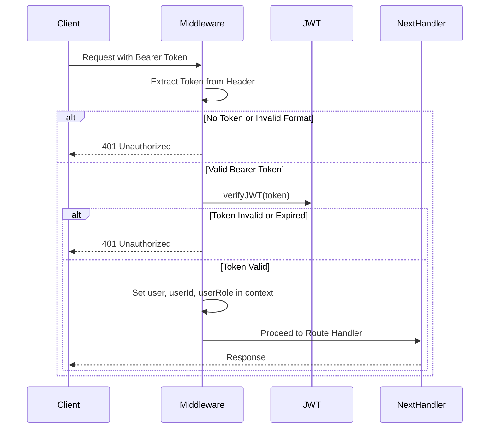
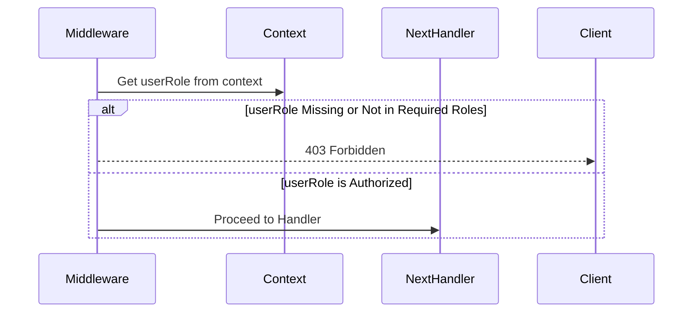
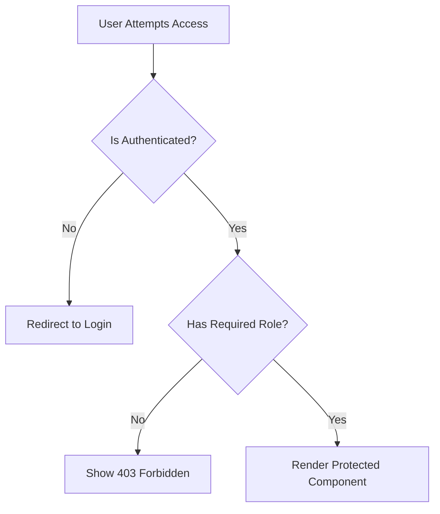
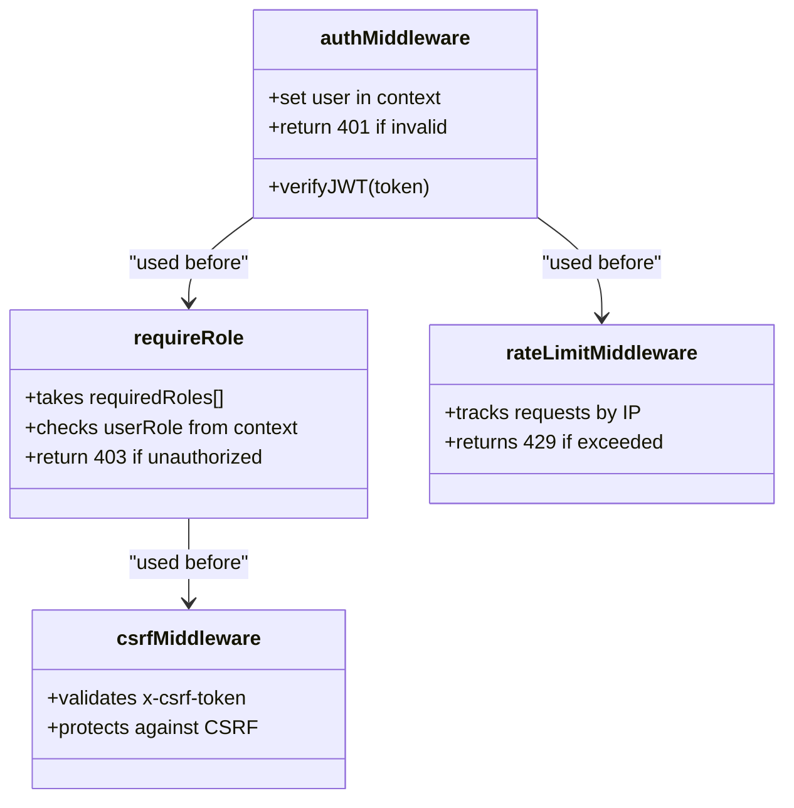

# Protected Routes and Access Control

<cite>
**Referenced Files in This Document**   
- [security-middleware.ts](file://src/shared/security-middleware.ts#L65-L181)
- [App.tsx](file://src/react-app/App.tsx)
- [AdminDashboard.tsx](file://src/react-app/pages/AdminDashboard.tsx)
- [Dashboard.tsx](file://src/react-app/pages/Dashboard.tsx)
- [Profile.tsx](file://src/react-app/pages/Profile.tsx)
</cite>

## Table of Contents
1. [Introduction](#introduction)
2. [Frontend Authentication State Management](#frontend-authentication-state-management)
3. [Backend Access Control Enforcement](#backend-access-control-enforcement)
4. [Protected Routes Implementation](#protected-routes-implementation)
5. [Role-Based Access Control](#role-based-access-control)
6. [API Endpoint Protection](#api-endpoint-protection)
7. [Common Issues and Solutions](#common-issues-and-solutions)
8. [Reusable Access Control Utilities](#reusable-access-control-utilities)
9. [Conclusion](#conclusion)

## Introduction
This document provides a comprehensive overview of the protected routes and role-based access control (RBAC) system in the HabibiStay application. It covers both frontend and backend implementations, detailing how authentication state is managed, how protected routes are enforced, and how user roles determine access permissions. The system uses JSON Web Tokens (JWT) for authentication and a middleware-based approach for authorization, ensuring secure and scalable access control across the platform.

## Frontend Authentication State Management
The frontend determines the authentication state primarily through the presence and validity of a JWT stored in the browser's session or local storage. Upon successful login, the token is stored and used for subsequent API requests. The React application uses context or global state management to propagate the authentication state across components.

When the app initializes or refreshes, it checks for an existing token and may validate it with the backend via a silent refresh or introspection endpoint. Based on this check, the app conditionally renders protected pages such as **Profile**, **Dashboard**, and **AdminDashboard**.

Protected pages are wrapped with logic that redirects unauthenticated users to the login page. This mechanism prevents unauthorized access even if a user manually navigates to a protected route.

**Section sources**
- [App.tsx](file://src/react-app/App.tsx)

## Backend Access Control Enforcement
The backend enforces access control through a layered middleware system defined in `security-middleware.ts`. This includes JWT verification, role-based authorization, CSRF protection, rate limiting, and IP blocking.

### JWT Verification
The `authMiddleware` function verifies the presence and validity of a Bearer token in the `Authorization` header. If the token is missing or invalid, it returns a 401 Unauthorized response. Upon successful verification, the decoded JWT payload is stored in the request context, making user information (such as `sub`, `email`, and `role`) available to downstream handlers.



**Diagram sources**
- [security-middleware.ts](file://src/shared/security-middleware.ts#L65-L90)

### Role-Based Authorization
The `requireRole` middleware enforces role-based access by checking the `userRole` stored in the request context against a list of required roles. If the user’s role is not included in the allowed roles, a 403 Forbidden response is returned.



**Diagram sources**
- [security-middleware.ts](file://src/shared/security-middleware.ts#L116-L135)

## Protected Routes Implementation
Although no explicit `ProtectedRoute` component was found in the codebase, protected routes are likely implemented through conditional rendering and navigation guards within the routing configuration in `App.tsx`.

For example, when rendering routes like `/dashboard`, `/profile`, or `/admin`, the app checks the authentication state before rendering the component. If the user is not authenticated, they are redirected to the login page.

```tsx
// Example pattern (inferred from standard practices)
<Route path="/dashboard" element={isAuthenticated ? <Dashboard /> : <Navigate to="/login" />} />
```

This approach ensures that only authenticated users can access protected pages, even if they attempt to navigate directly via URL.

**Section sources**
- [App.tsx](file://src/react-app/App.tsx)
- [Dashboard.tsx](file://src/react-app/pages/Dashboard.tsx)
- [Profile.tsx](file://src/react-app/pages/Profile.tsx)

## Role-Based Access Control
The system supports role-based permissions for different user types, including **guest**, **owner**, and **admin**. These roles are encoded in the JWT during login and validated on each protected request.

- **Guest**: Unauthenticated users with read-only access to public pages (Home, About, PropertyDetail).
- **Owner**: Authenticated property owners with access to dashboard, property management, and booking insights.
- **Admin**: Full access to administrative features, including financial reporting, security audits, and AI configuration.

The `requireRole` middleware is used to protect admin-specific routes and API endpoints. For example, the `AdminDashboard` page would require the `admin` role.



**Diagram sources**
- [security-middleware.ts](file://src/shared/security-middleware.ts#L116-L181)
- [AdminDashboard.tsx](file://src/react-app/pages/AdminDashboard.tsx)

## API Endpoint Protection
Protected API endpoints use the `authMiddleware` and `requireRole` middlewares to enforce access control. For example:

- `GET /api/user/profile` → Protected by `authMiddleware` (requires authentication)
- `POST /api/properties` → Protected by `authMiddleware` and may require `owner` role
- `GET /api/admin/reports` → Protected by `authMiddleware` and `requireRole(['admin'])`

These endpoints validate the JWT and check user roles before processing the request, ensuring that only authorized users can perform sensitive operations.

Example usage in route definition:
```ts
app.get('/api/admin/reports', 
  authMiddleware, 
  requireRole(['admin']), 
  handleReportRequest
);
```

**Section sources**
- [security-middleware.ts](file://src/shared/security-middleware.ts#L65-L181)

## Common Issues and Solutions
### Race Conditions During Authentication Checks
A potential race condition occurs when multiple components simultaneously check authentication state during app initialization. This can be mitigated by centralizing auth state in a context provider and using a loading state until the initial check completes.

### Handling Unauthorized Access Attempts
The backend logs all unauthorized access attempts (401, 403) using an audit logger, capturing IP, user ID (if available), action, and resource. This enables monitoring and detection of suspicious activity.

### Maintaining Consistent State
To maintain consistency between frontend and backend authorization:
- The frontend should not assume long-lived authentication; always handle 401 responses by redirecting to login.
- Use silent token refresh mechanisms to extend sessions without user interaction.
- Synchronize role changes by invalidating tokens or forcing re-authentication when roles are updated.

## Reusable Access Control Utilities
The `security-middleware.ts` file provides reusable middleware functions:
- `authMiddleware`: Enforces JWT-based authentication
- `requireRole(roles)`: Enforces role-based access
- `rateLimitMiddleware`: Prevents abuse through rate limiting
- `csrfMiddleware`: Protects against CSRF attacks
- `ipBlockingMiddleware`: Blocks known malicious IPs

These utilities can be composed and applied to any route, enabling consistent and modular access control across the application.



**Diagram sources**
- [security-middleware.ts](file://src/shared/security-middleware.ts#L0-L181)

## Conclusion
The HabibiStay application implements a robust and layered access control system combining frontend route protection with backend middleware enforcement. Authentication is managed via JWT, and authorization is enforced through role-based middleware. The system ensures that protected routes and API endpoints are accessible only to authorized users, with comprehensive logging and security measures in place. By leveraging reusable middleware utilities, the architecture promotes consistency, security, and maintainability across the codebase.