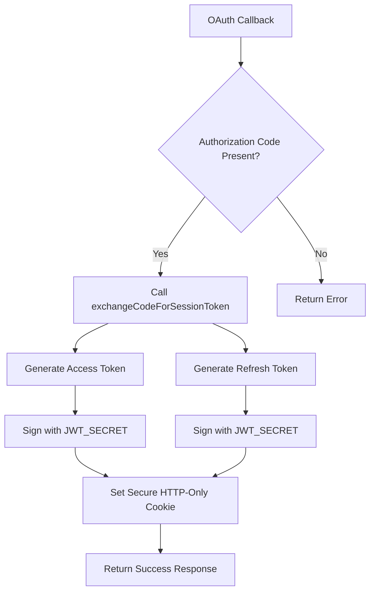
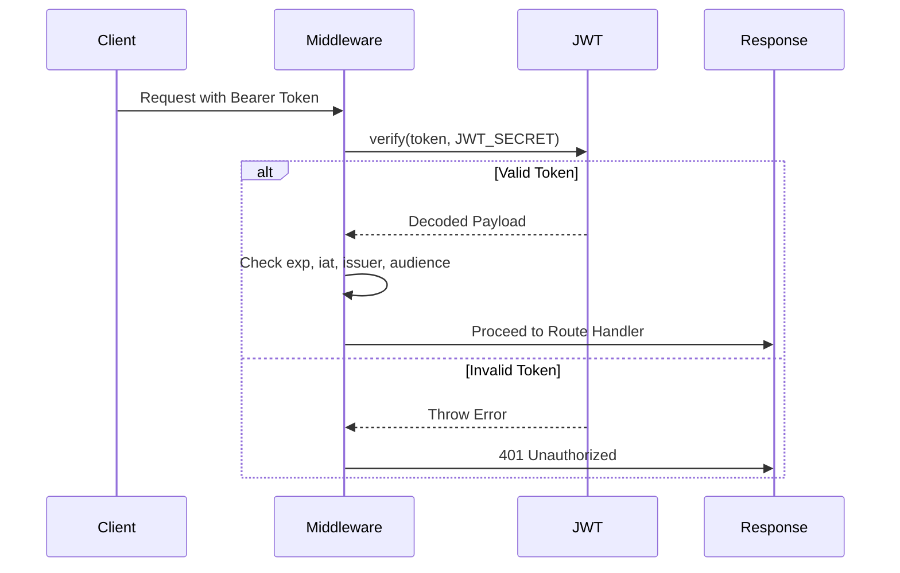
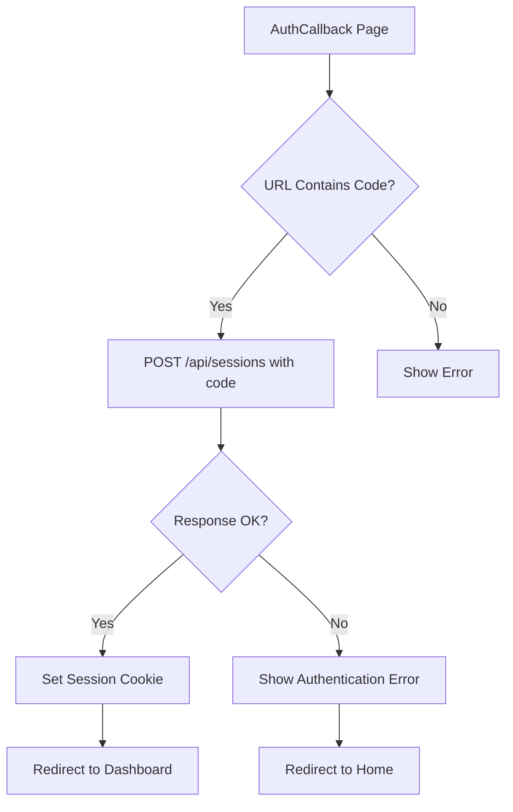
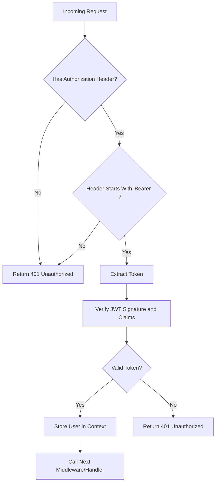
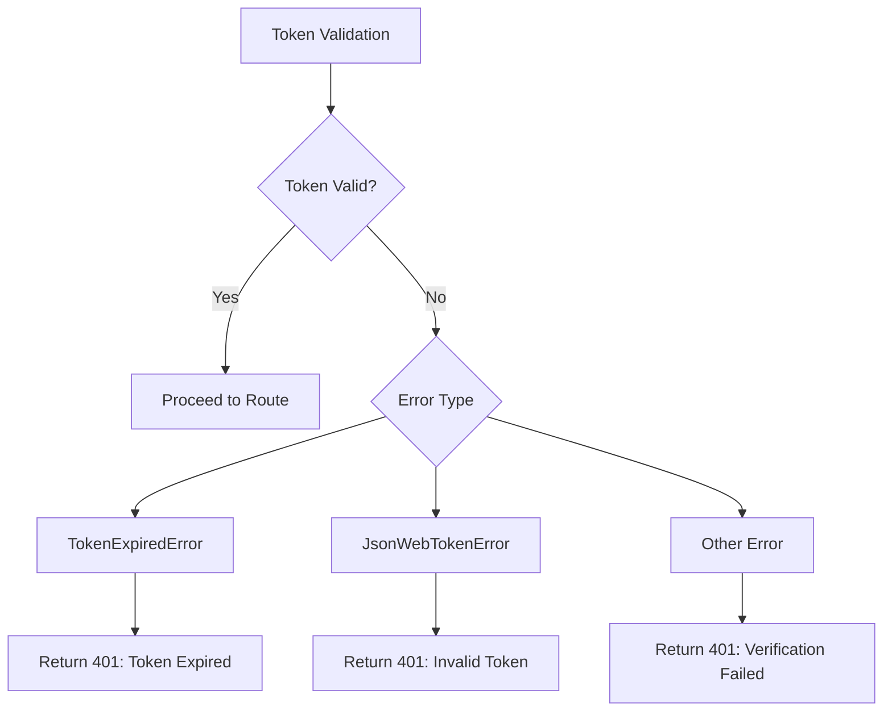
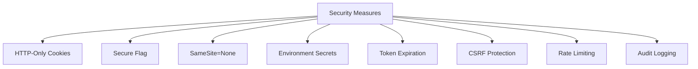
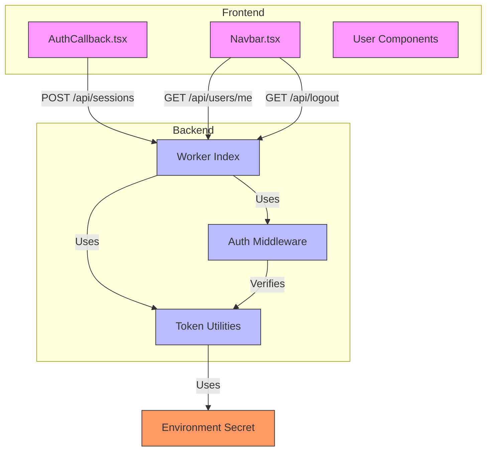

# Session and Token Management

<cite>
**Referenced Files in This Document**   
- [AuthCallback.tsx](file://src/react-app/pages/AuthCallback.tsx)
- [Navbar.tsx](file://src/react-app/components/Navbar.tsx)
- [index.ts](file://src/worker/index.ts)
- [auth.ts](file://src/server/utils/auth.ts)
- [security-middleware.ts](file://src/shared/security-middleware.ts)
</cite>

## Table of Contents
1. [Introduction](#introduction)
2. [Token Generation and Signing](#token-generation-and-signing)
3. [Token Validation and Verification](#token-validation-and-verification)
4. [Token Refresh Strategy](#token-refresh-strategy)
5. [Frontend Session Handling](#frontend-session-handling)
6. [API Route Protection](#api-route-protection)
7. [Token Payload Structure](#token-payload-structure)
8. [Error Handling for Invalid Tokens](#error-handling-for-invalid-tokens)
9. [Security Best Practices](#security-best-practices)
10. [Token Revocation and Logout](#token-revocation-and-logout)
11. [Token Lifetime Management](#token-lifetime-management)
12. [Architecture Overview](#architecture-overview)

## Introduction
This document provides a comprehensive overview of the session and JWT token management system in the HabibiStay application. The system is designed to securely authenticate users, manage sessions, and protect API routes using industry-standard practices. The backend worker handles token generation, validation, and session lifecycle, while the frontend manages token storage and user interface state. The implementation uses environment secrets for cryptographic operations and enforces strict expiration policies to enhance security.

## Token Generation and Signing
The token generation process in HabibiStay is handled by the backend worker using environment secrets and secure cryptographic algorithms. When a user successfully authenticates via OAuth, the system generates both access and refresh tokens to enable secure, long-lived sessions.



**Diagram sources**
- [index.ts](file://src/worker/index.ts#L174-L208)
- [auth.ts](file://src/server/utils/auth.ts#L107-L154)

**Section sources**
- [index.ts](file://src/worker/index.ts#L174-L208)
- [auth.ts](file://src/server/utils/auth.ts#L107-L154)

The token generation process uses the following configuration from environment variables:
- **JWT_SECRET**: Secret key for signing tokens (fallback provided)
- **JWT_EXPIRES_IN**: Access token expiration (default: 7 days)
- **REFRESH_TOKEN_EXPIRES_IN**: Refresh token expiration (default: 30 days)

The `generateAuthTokens` function creates both access and refresh tokens, calculating the expiration time for the access token to include in the response payload.

## Token Validation and Verification
Token validation is performed using middleware that verifies the JWT signature, expiration, and other claims before allowing access to protected routes. The system uses the `jsonwebtoken` library to verify tokens against the environment secret.



**Diagram sources**
- [security-middleware.ts](file://src/shared/security-middleware.ts#L65-L114)
- [auth.ts](file://src/server/utils/auth.ts#L107-L154)

**Section sources**
- [security-middleware.ts](file://src/shared/security-middleware.ts#L65-L114)

The verification process includes checking:
- **Signature validity**: Ensures the token hasn't been tampered with
- **Expiration time (exp)**: Validates the token is not expired
- **Issued at time (iat)**: Confirms the token was issued in the past
- **Issuer (iss)**: Verifies the token was issued by HabibiStay
- **Audience (aud)**: Confirms the token is intended for the correct audience

## Token Refresh Strategy
HabibiStay implements a token refresh strategy using refresh tokens to maintain user sessions without requiring frequent re-authentication. When an access token expires, the client can use a refresh token to obtain a new access token.

The refresh token verification process is implemented in the `verifyRefreshToken` function, which validates the token with specific issuer and audience claims:

```typescript
export const verifyRefreshToken = (token: string): RefreshTokenPayload => {
  try {
    return jwt.verify(token, JWT_SECRET, {
      issuer: 'habibistay',
      audience: 'habibistay-refresh'
    }) as RefreshTokenPayload;
  } catch (error) {
    if (error instanceof jwt.TokenExpiredError) {
      throw new Error('Refresh token expired');
    } else if (error instanceof jwt.JsonWebTokenError) {
      throw new Error('Invalid refresh token');
    } else {
      throw new Error('Refresh token verification failed');
    }
  }
};
```

**Section sources**
- [auth.ts](file://src/server/utils/auth.ts#L107-L154)

The refresh token contains a token version number that can be used to invalidate all tokens for a user when necessary (e.g., password change, security event).

## Frontend Session Handling
The frontend handles session management through the authentication callback page and navigation components that respond to user authentication state.



**Diagram sources**
- [AuthCallback.tsx](file://src/react-app/pages/AuthCallback.tsx#L0-L106)

**Section sources**
- [AuthCallback.tsx](file://src/react-app/pages/AuthCallback.tsx#L0-L106)
- [Navbar.tsx](file://src/react-app/components/Navbar.tsx#L0-L200)

The `AuthCallbackPage` component processes the OAuth callback by:
1. Extracting the authorization code from URL parameters
2. Sending the code to the `/api/sessions` endpoint
3. Handling success or error responses
4. Redirecting the user appropriately

The `Navbar` component displays user-specific content when authenticated and provides logout functionality.

## API Route Protection
API routes are protected using middleware that validates JWT tokens before allowing access to sensitive endpoints. The `authMiddleware` function is applied to routes that require authentication.



**Diagram sources**
- [security-middleware.ts](file://src/shared/security-middleware.ts#L65-L114)
- [index.ts](file://src/worker/index.ts#L174-L208)

**Section sources**
- [security-middleware.ts](file://src/shared/security-middleware.ts#L65-L114)

Protected routes in the application include:
- `/api/users/me`: Returns current user information
- `/api/wishlist`: Manages user wishlist
- `/api/users/profile`: Manages user profile data
- `/api/properties/my-properties`: Returns user's properties
- `/api/bookings/my-bookings`: Returns user's bookings

## Token Payload Structure
The JWT tokens in HabibiStay contain specific claims that provide user identity and session information. The structure differs between access and refresh tokens.

### Access Token Payload
```json
{
  "userId": "string",
  "email": "string",
  "role": "string",
  "sessionId": "string",
  "iat": "number",
  "exp": "number"
}
```

### Refresh Token Payload
```json
{
  "userId": "string",
  "sessionId": "string",
  "tokenVersion": "number",
  "iat": "number",
  "exp": "number"
}
```

**Section sources**
- [auth.ts](file://src/server/utils/auth.ts#L0-L54)

The payload includes:
- **userId**: Unique identifier for the user
- **email**: User's email address
- **role**: User role (e.g., 'host', 'admin', 'guest')
- **sessionId**: Unique session identifier
- **tokenVersion**: Version number for token invalidation
- **iat**: Issued at timestamp (seconds since epoch)
- **exp**: Expiration timestamp (seconds since epoch)

## Error Handling for Invalid Tokens
The system provides comprehensive error handling for invalid or expired tokens, returning appropriate HTTP status codes and error messages.



**Diagram sources**
- [auth.ts](file://src/server/utils/auth.ts#L107-L154)
- [security-middleware.ts](file://src/shared/security-middleware.ts#L65-L114)

**Section sources**
- [auth.ts](file://src/server/utils/auth.ts#L107-L154)

The error handling process:
1. Catches JWT verification exceptions
2. Differentiates between token expiration and other validation errors
3. Returns appropriate error messages
4. Logs security events for audit purposes

## Security Best Practices
HabibiStay implements several security best practices to protect user sessions and prevent common attacks.

### Security Measures Implemented
- **HTTP-Only Cookies**: Session tokens are stored in HTTP-only cookies to prevent XSS attacks
- **Secure Flag**: Cookies are marked as secure, requiring HTTPS
- **SameSite=None**: Allows cross-origin requests from trusted domains
- **Environment Secrets**: JWT signing keys are stored in environment variables
- **Token Expiration**: Both access and refresh tokens have limited lifetimes
- **CSRF Protection**: CSRF tokens are generated and validated
- **Rate Limiting**: API endpoints are rate-limited to prevent brute force attacks
- **Audit Logging**: Authentication events are logged for security monitoring



**Section sources**
- [index.ts](file://src/worker/index.ts#L174-L208)
- [auth.ts](file://src/server/utils/auth.ts#L0-L54)
- [security-middleware.ts](file://src/shared/security-middleware.ts#L65-L114)

## Token Revocation and Logout
The system implements proper token revocation and logout functionality to terminate user sessions securely.

### Logout Implementation
When a user logs out, the system:
1. Calls the `/api/logout` endpoint
2. Deletes the session on the authentication service
3. Clears the session cookie by setting it to empty with maxAge=0
4. Returns a success response

```typescript
app.get('/api/logout', async (c) => {
  const sessionToken = getCookie(c, MOCHA_SESSION_TOKEN_COOKIE_NAME);

  if (typeof sessionToken === 'string') {
    await deleteSession(sessionToken, {
      apiUrl: c.env.MOCHA_USERS_SERVICE_API_URL,
      apiKey: c.env.MOCHA_USERS_SERVICE_API_KEY,
    });
  }

  setCookie(c, MOCHA_SESSION_TOKEN_COOKIE_NAME, '', {
    httpOnly: true,
    path: '/',
    sameSite: 'none',
    secure: true,
    maxAge: 0,
  });

  return c.json({ success: true }, 200);
});
```

**Section sources**
- [index.ts](file://src/worker/index.ts#L174-L208)

The logout process ensures that:
- The session is invalidated on the server-side
- The cookie is cleared from the client
- No sensitive data remains in browser storage
- The user cannot reuse the token for future requests

## Token Lifetime Management
HabibiStay uses a dual-token strategy with different lifetimes for access and refresh tokens to balance security and user experience.

### Token Lifetime Configuration
| Token Type | Environment Variable | Default Value | Purpose |
|-----------|---------------------|-------------|--------|
| Access Token | JWT_EXPIRES_IN | 7d | Short-term API access |
| Refresh Token | REFRESH_TOKEN_EXPIRES_IN | 30d | Long-term session persistence |

The system could be enhanced with:
- **Short-lived access tokens** (e.g., 15-30 minutes) for higher security
- **Refresh token rotation** to detect token theft
- **Refresh token revocation** on logout or suspicious activity
- **Token binding** to specific client characteristics
- **Adaptive token lifetimes** based on user role or risk level

**Section sources**
- [auth.ts](file://src/server/utils/auth.ts#L0-L54)

## Architecture Overview
The session and token management system follows a clean separation of concerns between frontend and backend components.



**Diagram sources**
- [index.ts](file://src/worker/index.ts#L174-L208)
- [AuthCallback.tsx](file://src/react-app/pages/AuthCallback.tsx#L0-L106)
- [Navbar.tsx](file://src/react-app/components/Navbar.tsx#L0-L200)
- [security-middleware.ts](file://src/shared/security-middleware.ts#L65-L114)
- [auth.ts](file://src/server/utils/auth.ts#L0-L54)

The architecture demonstrates:
- Clear separation between frontend session handling and backend token management
- Use of middleware for consistent authentication across routes
- Secure storage of secrets in environment variables
- Proper HTTP cookie settings for security
- Comprehensive error handling and logging