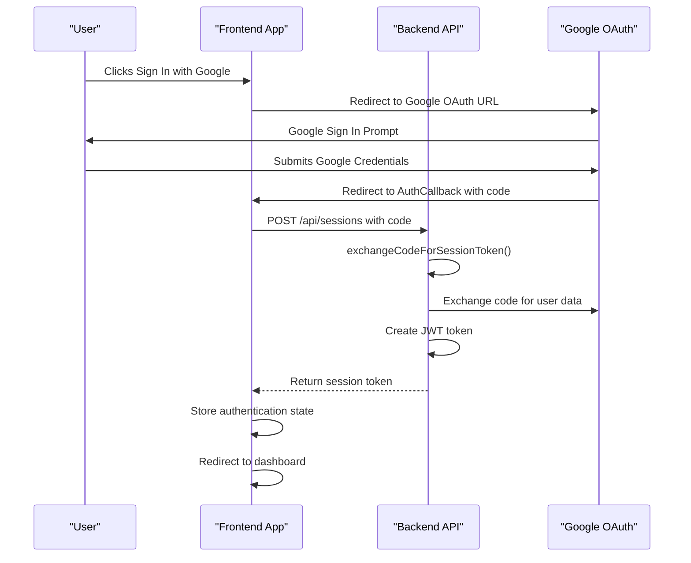
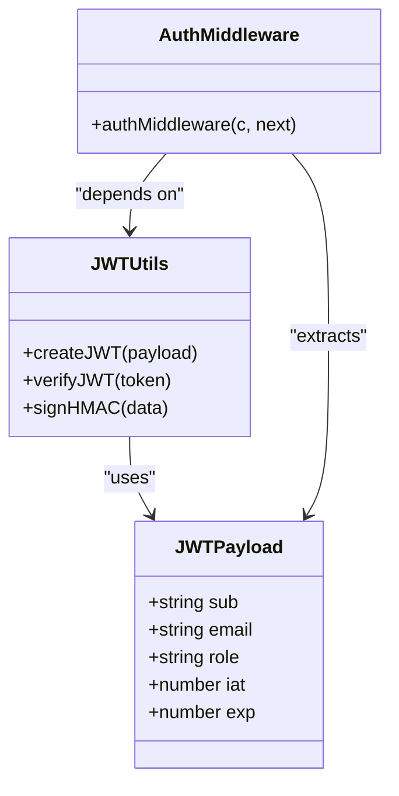
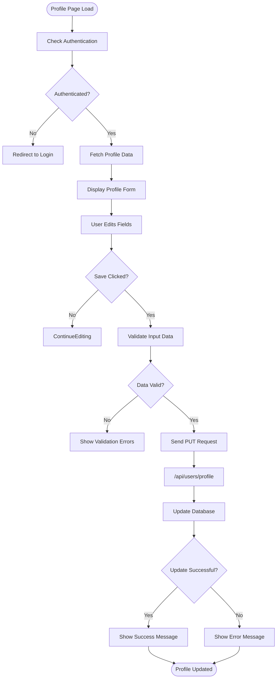
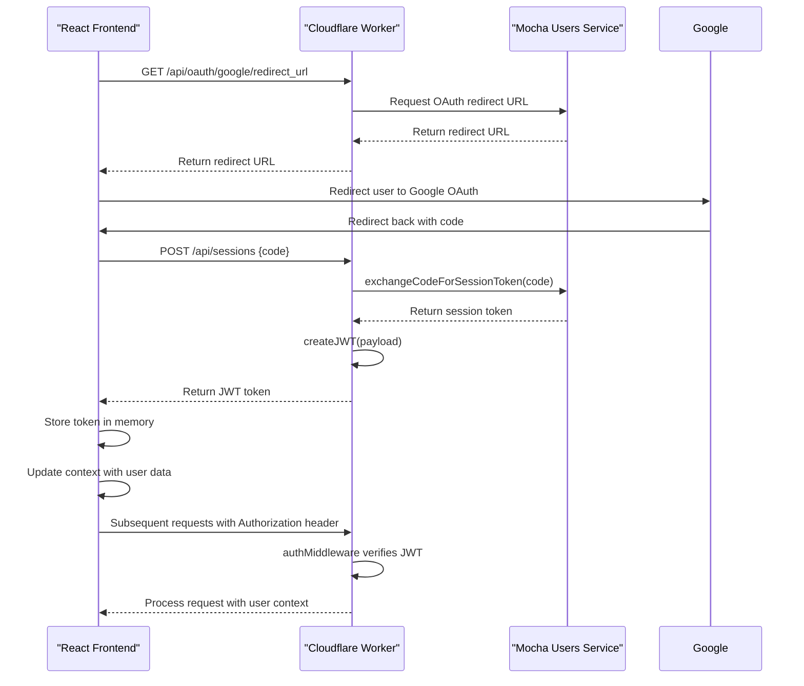
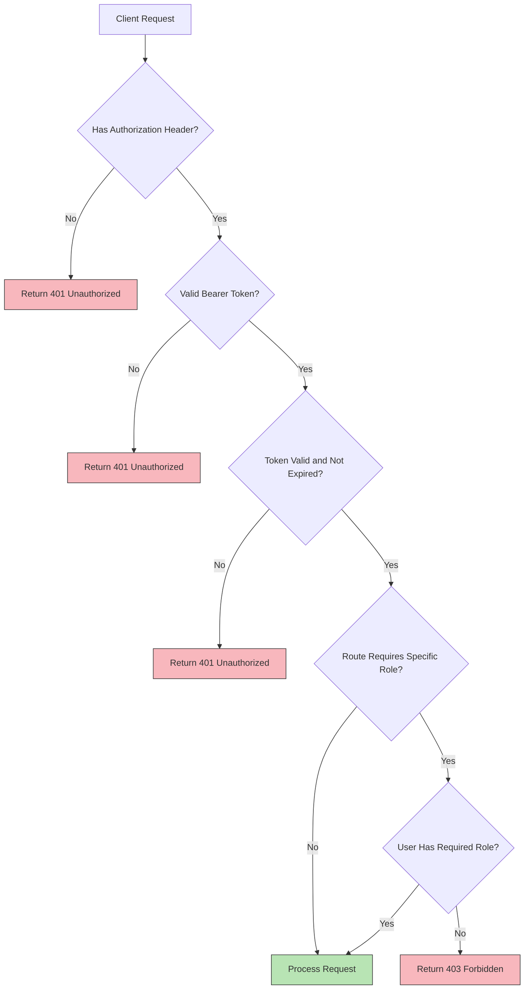
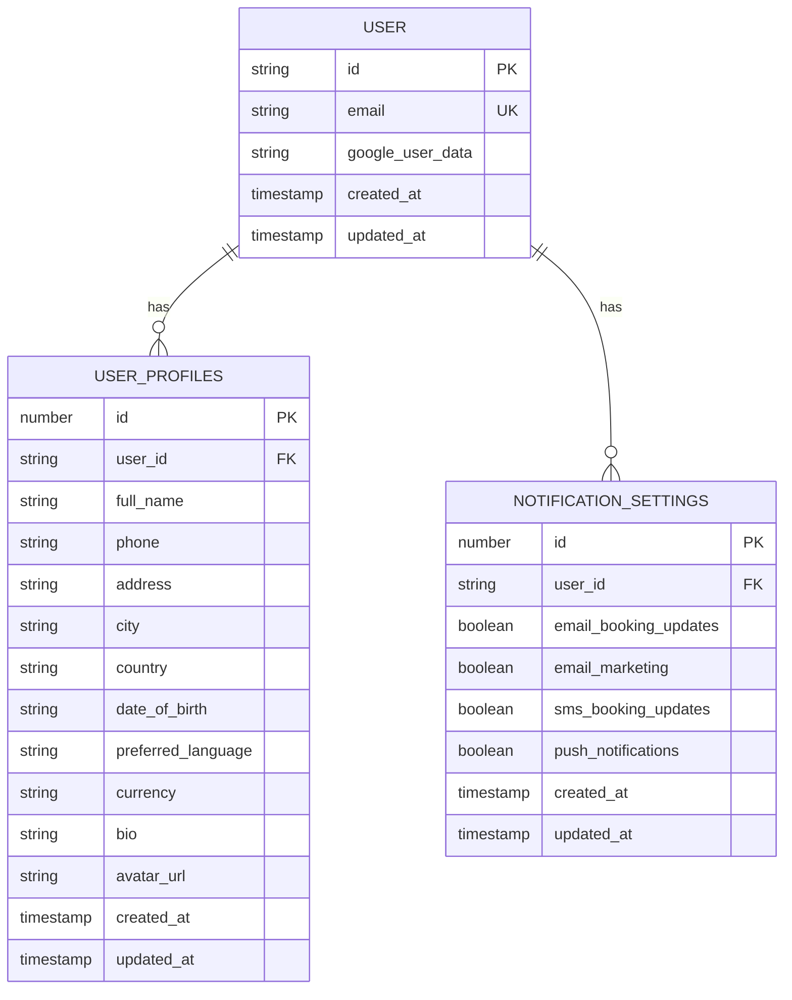

# User Management

<cite>
**Referenced Files in This Document**   
- [AuthCallback.tsx](file://src/react-app/pages/AuthCallback.tsx)
- [security-utils.ts](file://src/shared/security-utils.ts)
- [security-middleware.ts](file://src/shared/security-middleware.ts)
- [Profile.tsx](file://src/react-app/pages/Profile.tsx)
- [index.ts](file://src/worker/index.ts)
</cite>

## Table of Contents
1. [Introduction](#introduction)
2. [Google OAuth Authentication Flow](#google-oauth-authentication-flow)
3. [JWT Token Management](#jwt-token-management)
4. [User Profile Creation and Preferences Storage](#user-profile-creation-and-preferences-storage)
5. [Session Handling and Authentication State](#session-handling-and-authentication-state)
6. [Protected Routes and Role-Based Access Control](#protected-routes-and-role-based-access-control)
7. [User Data Synchronization](#user-data-synchronization)
8. [Common Authentication Issues](#common-authentication-issues)
9. [Extensibility and Advanced Security](#extensibility-and-advanced-security)

## Introduction
The User Management system in HabibiStay implements a secure authentication and authorization framework centered around Google OAuth integration. The system handles user identity verification, session management, profile data persistence, and access control across the application. This document details the implementation of the authentication flow, token management, user preferences, and security mechanisms that ensure a robust and user-friendly experience.

## Google OAuth Authentication Flow

The Google OAuth authentication flow in HabibiStay follows the standard authorization code grant pattern, with a dedicated callback handler that processes the authentication response and establishes a user session.



**Diagram sources**
- [AuthCallback.tsx](file://src/react-app/pages/AuthCallback.tsx)
- [index.ts](file://src/worker/index.ts)

**Section sources**
- [AuthCallback.tsx](file://src/react-app/pages/AuthCallback.tsx#L1-L106)
- [index.ts](file://src/worker/index.ts#L118-L172)

The authentication flow begins when a user clicks the "Sign In with Google" button, which redirects them to Google's OAuth authorization endpoint. Upon successful authentication, Google redirects the user back to the application's `AuthCallback` page with an authorization code. The `AuthCallbackPage` component extracts this code and sends it to the backend via a POST request to `/api/sessions`.

The backend exchanges the authorization code for user data through the Mocha Users Service, then creates a session token. This process is handled by the `exchangeCodeForSessionToken` function, which communicates with the external authentication service using API credentials stored in environment variables.

If authentication succeeds, the frontend redirects the user to their dashboard with a success message. If the process fails or is canceled, the user receives an error message and is redirected back to the home page after a brief delay.

## JWT Token Management

HabibiStay implements a custom JWT-based token management system for stateless authentication. The system handles token creation, verification, and expiration to ensure secure access to protected resources.



**Diagram sources**
- [security-utils.ts](file://src/shared/security-utils.ts#L188-L236)
- [security-middleware.ts](file://src/shared/security-middleware.ts#L65-L114)

**Section sources**
- [security-utils.ts](file://src/shared/security-utils.ts#L137-L336)
- [security-middleware.ts](file://src/shared/security-middleware.ts#L65-L114)

The JWT implementation includes a `JWTPayload` interface that defines the token structure with standard claims:
- **sub**: User ID
- **email**: User email address
- **role**: User role for authorization
- **iat**: Issued at timestamp
- **exp**: Expiration timestamp

The `createJWT` function generates tokens with a 24-hour expiration period, using HMAC-SHA256 for signature generation. The function constructs the JWT by:
1. Creating a header with algorithm and token type
2. Building a payload with user data and timestamps
3. Encoding header and payload using Base64
4. Generating a signature using HMAC
5. Combining all parts with dots

The `verifyJWT` function validates tokens by:
1. Splitting the token into its three parts
2. Recalculating the signature and comparing it with the provided signature
3. Decoding the payload and checking expiration
4. Returning the payload if valid, or null if invalid

Token verification is integrated into the authentication middleware, which extracts the token from the Authorization header and validates it on each request to protected endpoints.

## User Profile Creation and Preferences Storage

User profiles in HabibiStay include personal information, notification preferences, and privacy settings. The system provides a comprehensive interface for users to manage their account details.



**Diagram sources**
- [Profile.tsx](file://src/react-app/pages/Profile.tsx)
- [index.ts](file://src/worker/index.ts)

**Section sources**
- [Profile.tsx](file://src/react-app/pages/Profile.tsx#L0-L551)
- [index.ts](file://src/worker/index.ts#L729-L807)

The Profile page component manages user profile data through several state variables:
- **profile**: Personal information including name, contact details, and preferences
- **notifications**: Notification settings for different communication channels
- **activeTab**: Current section being viewed (profile, notifications, privacy, security)

When the profile page loads, it first checks if the user is authenticated. If not, it redirects to the login page. For authenticated users, it fetches profile data from the `/api/users/profile` endpoint, which returns both profile information and notification settings.

The profile data is stored in a database with the following structure:
- **user_profiles table**: Stores personal information with fields for full name, phone, address, city, country, date of birth, language preferences, currency, bio, and avatar URL
- **notification_settings table**: Stores user preferences for email booking updates, marketing emails, SMS updates, and push notifications

Users can update their profile information through a form interface with validation. When the save button is clicked, the updated data is sent to the backend via a PUT request to `/api/users/profile`. The backend uses an UPSERT operation (INSERT ... ON CONFLICT) to either create a new profile or update existing data.

## Session Handling and Authentication State

The authentication state in HabibiStay is managed through a combination of JWT tokens and client-side state, with integration between the frontend and backend systems.



**Diagram sources**
- [AuthCallback.tsx](file://src/react-app/pages/AuthCallback.tsx)
- [security-middleware.ts](file://src/shared/security-middleware.ts)
- [index.ts](file://src/worker/index.ts)

**Section sources**
- [AuthCallback.tsx](file://src/react-app/pages/AuthCallback.tsx#L1-L106)
- [security-middleware.ts](file://src/shared/security-middleware.ts#L65-L114)
- [index.ts](file://src/worker/index.ts#L118-L172)

The frontend uses the `useAuth` hook from the `@getmocha/users-service/react` package to manage authentication state. This hook provides access to the current user object and authentication methods like `redirectToLogin` and `logout`.

When a user is authenticated, the user object contains:
- **google_user_data**: Information from Google OAuth (name, email, picture)
- **email**: User email address
- **created_at**: Account creation timestamp
- **id**: User identifier

The authentication state is shared across components through React's context system, allowing components like Navbar, Dashboard, and Profile to access user information without prop drilling.

On the backend, the authentication middleware extracts the JWT token from the Authorization header and verifies it. If valid, it stores the user information in the request context, making it available to downstream handlers. This allows route handlers to access the authenticated user's ID, email, and role without re-validating the token.

## Protected Routes and Role-Based Access Control

HabibiStay implements a comprehensive authorization system with protected routes and role-based access control to ensure that users can only access resources they are permitted to use.



**Diagram sources**
- [security-middleware.ts](file://src/shared/security-middleware.ts#L65-L181)
- [index.ts](file://src/worker/index.ts#L2319-L2354)

**Section sources**
- [security-middleware.ts](file://src/shared/security-middleware.ts#L65-L181)
- [index.ts](file://src/worker/index.ts#L2319-L2354)

The system uses two primary middleware functions for access control:
1. **authMiddleware**: Verifies JWT tokens and authenticates requests
2. **requireRole**: Enforces role-based access control

The `authMiddleware` ensures that all requests to protected endpoints include a valid JWT token in the Authorization header. If the token is missing or invalid, the request is rejected with a 401 Unauthorized status.

The `requireRole` middleware provides role-based access control by checking if the authenticated user has one of the required roles. It's used to protect administrative endpoints, such as:
- `/api/admin/security/metrics` - Accessible only to users with 'admin' role
- `/api/admin/security/block-ip` - Accessible only to users with 'admin' role

These middleware functions are applied to routes using composition. For example, the security metrics endpoint uses both authentication and role-based middleware:

```typescript
app.get("/api/admin/security/metrics", authMiddleware, requireRole(['admin']), async (c) => {
  // Handler logic here
});
```

This layered approach ensures that only authenticated users with the appropriate roles can access sensitive administrative functionality.

## User Data Synchronization

User data in HabibiStay is synchronized between Google OAuth, the application database, and the frontend client to ensure consistency across the system.



**Diagram sources**
- [types.ts](file://src/shared/types.ts#L137-L166)
- [index.ts](file://src/worker/index.ts#L729-L807)

**Section sources**
- [types.ts](file://src/shared/types.ts#L137-L166)
- [index.ts](file://src/worker/index.ts#L729-L807)

The data synchronization process works as follows:
1. On initial authentication, Google OAuth data is stored in the user record
2. Profile data is fetched from the user_profiles table, with Google data used as defaults if no profile exists
3. Notification settings are fetched from the notification_settings table, with application defaults if no settings exist
4. Changes made in the frontend are sent to the backend and persisted in the database
5. Updated data is reflected in the frontend through state updates

The system uses a hybrid approach for data storage:
- Core identity information (email, Google profile data) is stored in the main user table
- Extended profile information is stored in a separate user_profiles table
- Notification preferences are stored in a dedicated notification_settings table

This separation allows for flexible schema evolution and efficient querying of specific data types. The UPSERT pattern used in profile updates ensures that data is created or updated atomically, preventing race conditions.

## Common Authentication Issues

The HabibiStay authentication system addresses several common issues that can arise in OAuth-based applications.

### Token Expiration
JWT tokens have a 24-hour expiration period, after which users must re-authenticate. The system handles token expiration gracefully:
- The frontend detects 401 responses from API calls
- Users are redirected to the login page with a message explaining the session expiration
- The AuthCallback page handles the re-authentication flow transparently

### Account Linking
While the current implementation focuses on Google OAuth, the architecture supports account linking through the Mocha Users Service. The service can potentially connect multiple identity providers to a single user account, though this functionality is not currently exposed in the frontend.

### Profile Updates
Profile updates are handled through a robust API endpoint that:
- Validates input data using Zod schemas
- Uses database transactions to ensure data consistency
- Implements UPSERT semantics to handle both creation and updates
- Returns appropriate success or error responses

The frontend provides immediate feedback on save operations, with loading states during the request and success/error messages afterward. Input validation is performed both on the client side (for user experience) and server side (for security).

## Extensibility and Advanced Security

The authentication system in HabibiStay is designed with extensibility in mind, supporting future enhancements to security and authentication methods.

### Additional Authentication Providers
While currently using only Google OAuth, the architecture can support additional providers through the Mocha Users Service. The service appears to support multiple OAuth providers, as evidenced by the `getOAuthRedirectUrl` function that accepts a provider parameter. To add new providers, the frontend would need:
- New login buttons for each provider
- Provider-specific configuration in the backend
- Potential UI adjustments to handle different data structures from various providers

### Multi-Factor Authentication
The system includes support for two-factor authentication (2FA), indicated by the "Enable 2FA" button in the security settings. While the implementation details are not visible in the provided code, the architecture likely stores 2FA status in the user record and requires additional verification during the login process for users who have enabled it.

The security status component suggests additional security features:
- Password age tracking
- Email verification status
- Login location monitoring
- Security score calculation

These features contribute to a comprehensive security posture that goes beyond basic authentication to provide ongoing protection for user accounts.

The modular middleware architecture makes it easy to add new security layers, such as:
- Biometric authentication
- Device fingerprinting
- Behavioral analysis
- Adaptive authentication based on risk assessment

These enhancements could be implemented without major changes to the existing authentication flow, demonstrating the system's flexibility and scalability.