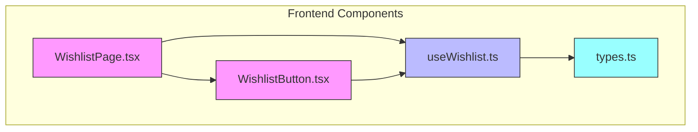
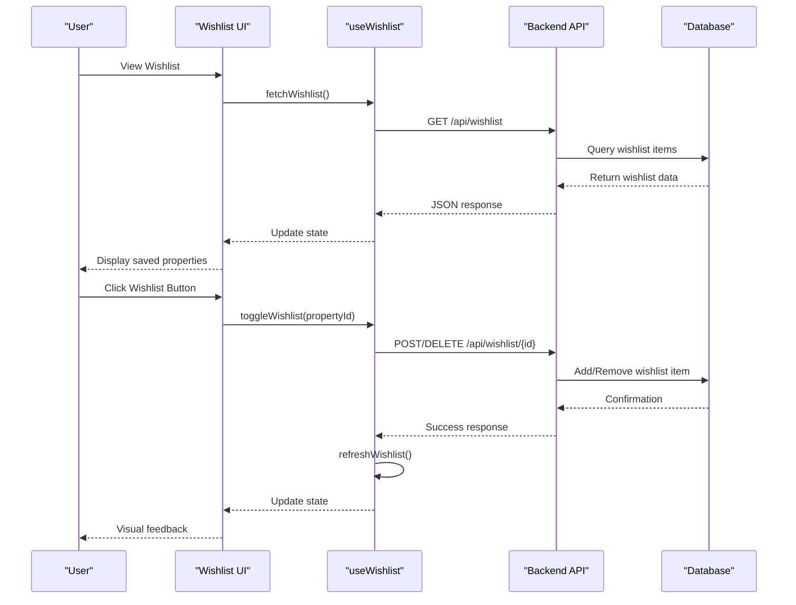
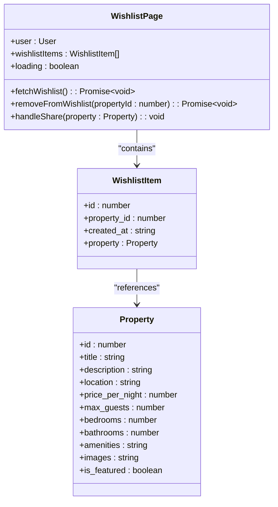
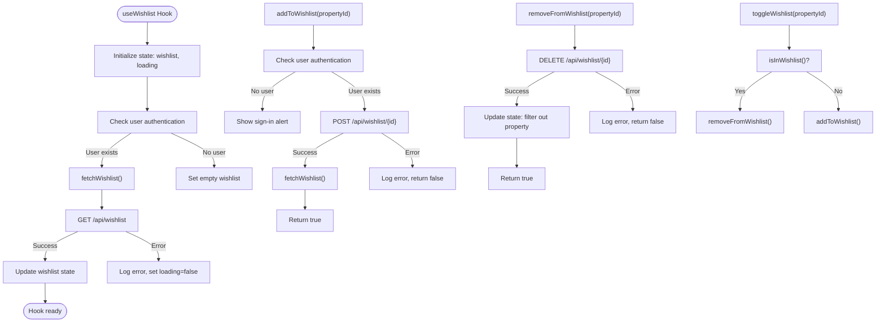
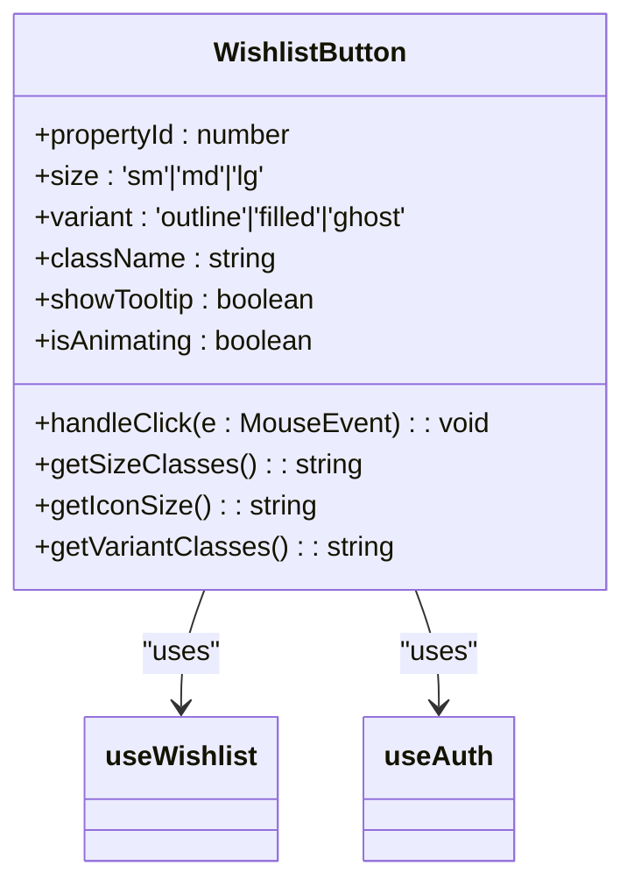
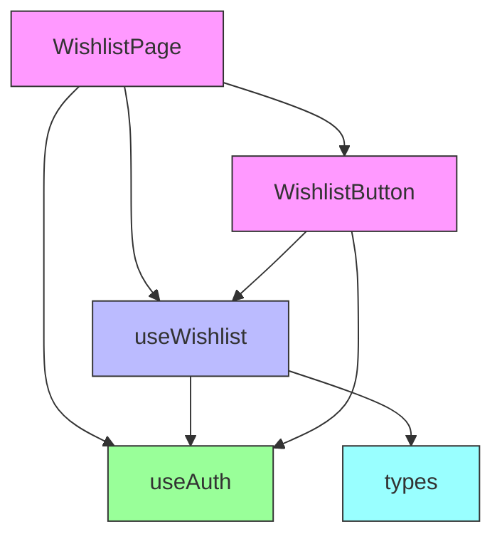

# Wishlist Functionality

<cite>
**Referenced Files in This Document**   
- [Wishlist.tsx](file://src/react-app/pages/Wishlist.tsx) - *Updated in recent commit*
- [useWishlist.ts](file://src/react-app/hooks/useWishlist.ts) - *Updated in recent commit*
- [WishlistButton.tsx](file://src/react-app/components/WishlistButton.tsx) - *Enhanced with authentication checks and animation feedback*
- [types.ts](file://src/shared/types.ts) - *Shared types for wishlist functionality*
</cite>

## Update Summary
**Changes Made**   
- Updated documentation for WishlistButton component to reflect enhanced authentication checks and animation feedback
- Added details about visual feedback and user interaction patterns
- Enhanced description of authentication handling in wishlist operations
- Updated code examples to reflect current implementation
- Improved explanation of state management and UI updates

## Table of Contents
1. [Introduction](#introduction)
2. [Project Structure](#project-structure)
3. [Core Components](#core-components)
4. [Architecture Overview](#architecture-overview)
5. [Detailed Component Analysis](#detailed-component-analysis)
6. [Dependency Analysis](#dependency-analysis)
7. [Performance Considerations](#performance-considerations)
8. [Troubleshooting Guide](#troubleshooting-guide)
9. [Conclusion](#conclusion)

## Introduction
The Wishlist functionality in HabibiStay enables users to save properties they are interested in for future reference and booking. This document provides a comprehensive analysis of the implementation, covering the frontend components, state management, API interactions, and user experience patterns. The system is designed to provide real-time feedback, support concurrent modifications, and maintain consistency across devices through server-side synchronization.

## Project Structure
The Wishlist functionality is implemented across multiple directories in the application, following a modular architecture that separates concerns between UI components, business logic, and shared data structures. The key components are organized as follows:

- **src/react-app/pages**: Contains the main Wishlist page component
- **src/react-app/components**: Houses reusable UI elements like the WishlistButton
- **src/react-app/hooks**: Contains the custom useWishlist hook for state management
- **src/shared**: Stores shared types and interfaces used across the application

**Diagram sources**
- [Wishlist.tsx](file://src/react-app/pages/Wishlist.tsx)
- [WishlistButton.tsx](file://src/react-app/components/WishlistButton.tsx)
- [useWishlist.ts](file://src/react-app/hooks/useWishlist.ts)
- [types.ts](file://src/shared/types.ts)

**Section sources**
- [Wishlist.tsx](file://src/react-app/pages/Wishlist.tsx)
- [WishlistButton.tsx](file://src/react-app/components/WishlistButton.tsx)
- [useWishlist.ts](file://src/react-app/hooks/useWishlist.ts)
- [types.ts](file://src/shared/types.ts)

## Core Components
The Wishlist functionality is built around three core components that work together to provide a seamless user experience:

1. **WishlistPage**: The main page component that displays all saved properties
2. **WishlistButton**: A reusable component that allows users to add/remove properties from their wishlist
3. **useWishlist**: A custom React hook that manages the wishlist state and API interactions

These components follow the React hooks pattern for state management and leverage TypeScript for type safety throughout the application.

**Section sources**
- [Wishlist.tsx](file://src/react-app/pages/Wishlist.tsx)
- [WishlistButton.tsx](file://src/react-app/components/WishlistButton.tsx)
- [useWishlist.ts](file://src/react-app/hooks/useWishlist.ts)

## Architecture Overview
The Wishlist architecture follows a client-server model with a clear separation between presentation, business logic, and data layers. The frontend components interact with a custom hook that handles all API communications and state management.

**Diagram sources**
- [Wishlist.tsx](file://src/react-app/pages/Wishlist.tsx#L26-L83)
- [useWishlist.ts](file://src/react-app/hooks/useWishlist.ts#L20-L50)

## Detailed Component Analysis

### Wishlist Page Component
The WishlistPage component serves as the main interface for viewing and managing saved properties. It handles user authentication, loading states, and displays properties in a responsive grid layout.

**Diagram sources**
- [Wishlist.tsx](file://src/react-app/pages/Wishlist.tsx#L10-L199)

**Section sources**
- [Wishlist.tsx](file://src/react-app/pages/Wishlist.tsx)

### useWishlist Custom Hook
The useWishlist hook is the central piece of the wishlist functionality, managing state, API interactions, and providing a clean interface for components to interact with the wishlist.

**Diagram sources**
- [useWishlist.ts](file://src/react-app/hooks/useWishlist.ts#L0-L121)

**Section sources**
- [useWishlist.ts](file://src/react-app/hooks/useWishlist.ts)

### WishlistButton Component
The WishlistButton component provides a consistent, reusable interface for adding and removing properties from the wishlist across different parts of the application. The component has been enhanced with authentication checks, animation feedback, and improved user interaction patterns.

When a user clicks the wishlist button, the component first checks authentication status. If the user is not authenticated, they are redirected to the login page. For authenticated users, the button provides visual feedback through animations when adding or removing properties from the wishlist.

The component supports different sizes ('sm', 'md', 'lg') and variants ('outline', 'filled', 'ghost') to accommodate various design requirements. It also includes a tooltip that appears on hover, showing the current action (add to or remove from wishlist).

**Updated** Enhanced with authentication checks, animation feedback, and improved user interaction patterns

**Diagram sources**
- [WishlistButton.tsx](file://src/react-app/components/WishlistButton.tsx#L0-L118) - *Enhanced with authentication checks and animation feedback*

**Section sources**
- [WishlistButton.tsx](file://src/react-app/components/WishlistButton.tsx#L13-L118) - *Updated with enhanced authentication and animation features*

## Dependency Analysis
The Wishlist components have well-defined dependencies that follow React best practices for separation of concerns and reusability.

**Diagram sources**
- [Wishlist.tsx](file://src/react-app/pages/Wishlist.tsx)
- [useWishlist.ts](file://src/react-app/hooks/useWishlist.ts)
- [WishlistButton.tsx](file://src/react-app/components/WishlistButton.tsx)

**Section sources**
- [Wishlist.tsx](file://src/react-app/pages/Wishlist.tsx)
- [useWishlist.ts](file://src/react-app/hooks/useWishlist.ts)
- [WishlistButton.tsx](file://src/react-app/components/WishlistButton.tsx)

## Performance Considerations
The Wishlist implementation includes several performance optimizations:

1. **State Management**: The useWishlist hook uses useCallback to memoize functions and prevent unnecessary re-renders
2. **Loading States**: Skeleton loading screens provide immediate feedback while data is being fetched
3. **Efficient Updates**: When removing items, the component uses state filtering rather than refetching the entire wishlist
4. **Conditional Rendering**: The UI adapts based on authentication status and wishlist content

For large wishlists, additional optimizations could include:
- Implementing pagination or infinite scrolling
- Adding client-side caching with localStorage
- Using virtualized lists to improve rendering performance
- Implementing debounced search functionality

**Section sources**
- [Wishlist.tsx](file://src/react-app/pages/Wishlist.tsx)
- [useWishlist.ts](file://src/react-app/hooks/useWishlist.ts)

## Troubleshooting Guide
Common issues and solutions for the Wishlist functionality:

1. **Wishlist not loading**: 
   - Check user authentication status
   - Verify API endpoint availability
   - Inspect network requests for errors

2. **Add/Remove operations failing**:
   - Ensure user is authenticated
   - Check property ID validity
   - Verify API endpoint permissions

3. **State synchronization issues**:
   - The useWishlist hook automatically refreshes after mutations
   - Manual refresh can be triggered with refreshWishlist()
   - Ensure proper error handling in API calls

4. **Visual feedback not working**:
   - Check animation classes and CSS
   - Verify event propagation is properly handled
   - Ensure isAnimating state is correctly managed

**Section sources**
- [useWishlist.ts](file://src/react-app/hooks/useWishlist.ts)
- [WishlistButton.tsx](file://src/react-app/components/WishlistButton.tsx)

## Conclusion
The Wishlist functionality in HabibiStay provides a robust and user-friendly way for users to save and manage properties of interest. The implementation follows modern React patterns with a clear separation of concerns between components, hooks, and shared types. The system handles authentication, provides real-time feedback, and maintains data consistency through server-side synchronization. Future enhancements could include sharing capabilities, price change notifications, and improved performance optimizations for large wishlists.