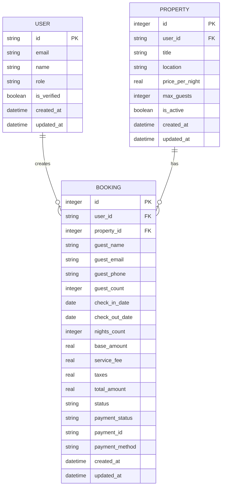
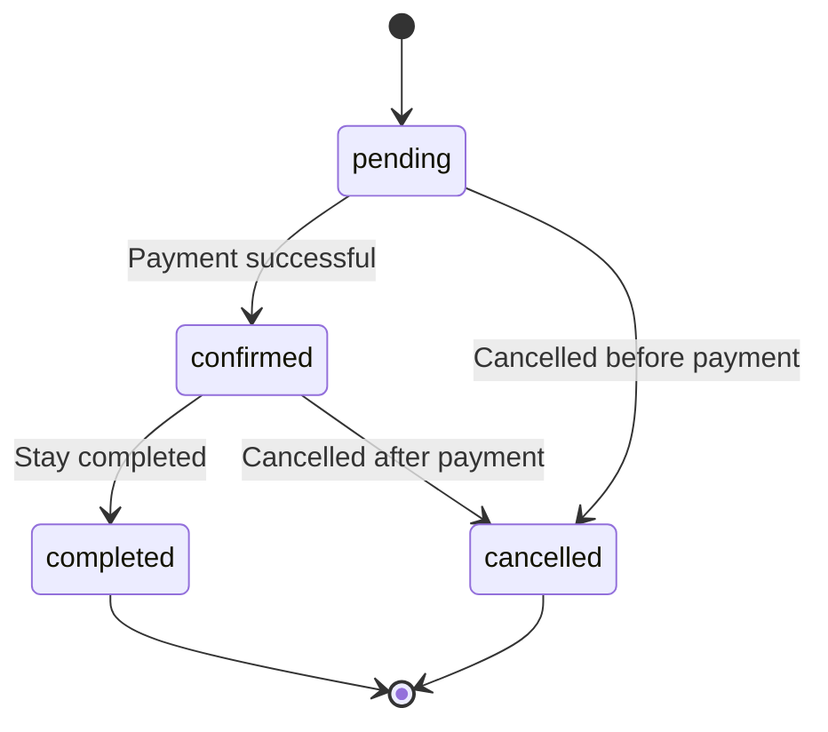
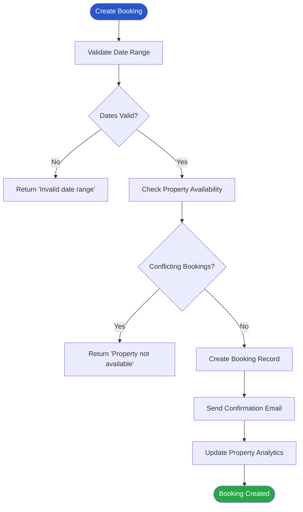
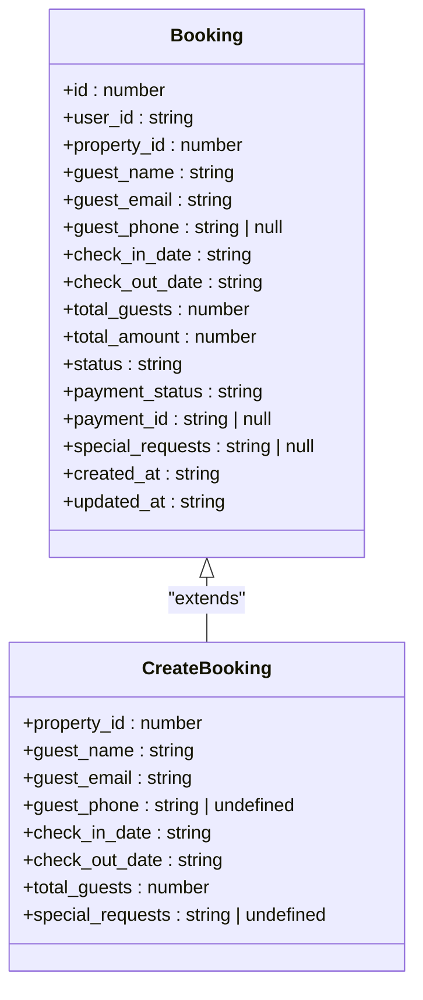
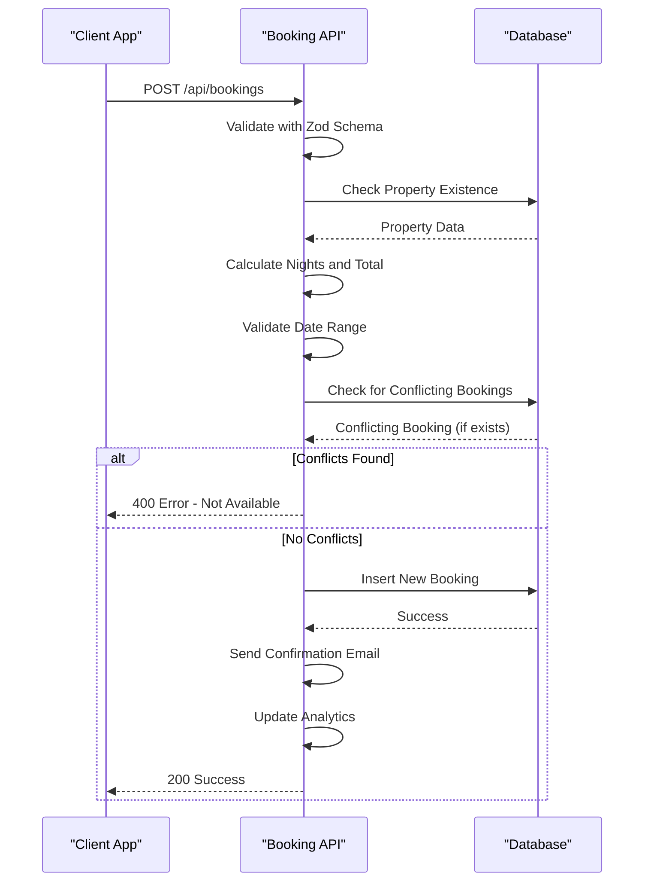
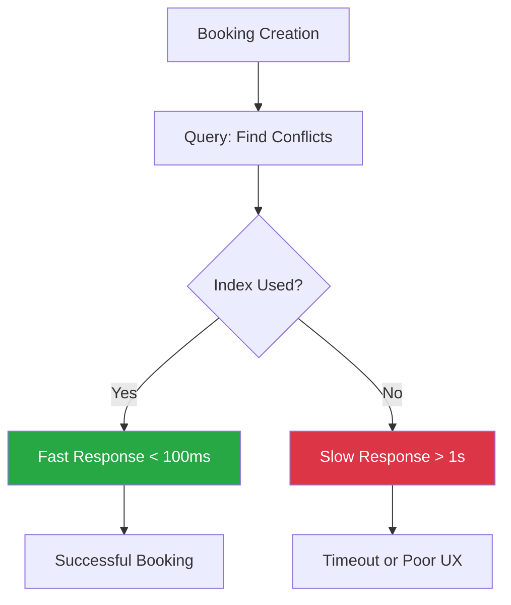
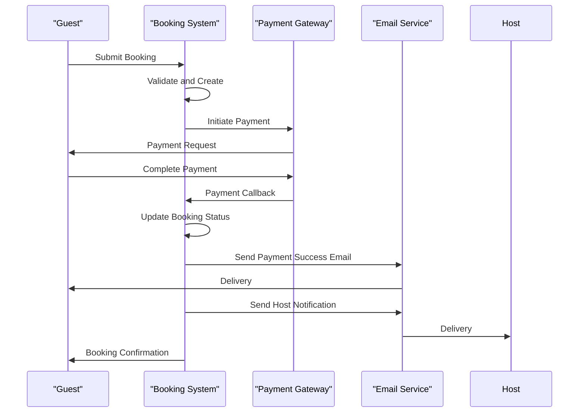

# Booking Model

<cite>
**Referenced Files in This Document**   
- [migrations/1.sql](file://migrations/1.sql#L46-L74)
- [src/shared/types.ts](file://src/shared/types.ts#L14-L599)
- [src/worker/index.ts](file://src/worker/index.ts#L406-L445)
- [src/worker/index.ts](file://src/worker/index.ts#L1114-L1148)
- [migrations/6.sql](file://migrations/6.sql#L63-L94)
- [src/shared/email.ts](file://src/shared/email.ts#L131-L163)
- [src/shared/additional-email-templates.ts](file://src/shared/additional-email-templates.ts#L159-L204)
</cite>

## Table of Contents
1. [Introduction](#introduction)
2. [Booking Data Model](#booking-data-model)
3. [Referential Integrity and Relationships](#referential-integrity-and-relationships)
4. [Status Lifecycle and Business Rules](#status-lifecycle-and-business-rules)
5. [Date Validation and Availability Checks](#date-validation-and-availability-checks)
6. [TypeScript Interface Mapping](#typescript-interface-mapping)
7. [API Validation and Overlapping Booking Prevention](#api-validation-and-overlapping-booking-prevention)
8. [Indexing Strategy for Performance](#indexing-strategy-for-performance)
9. [Payment and Notification Workflows](#payment-and-notification-workflows)
10. [Sample Booking Records](#sample-booking-records)

## Introduction
The Booking model is a central component of the HabibiStay platform, serving as the foundation for managing reservations between guests and properties. This document provides a comprehensive overview of the booking system, including its data structure, business logic, validation rules, and integration with payment and notification systems. The model ensures data integrity through referential constraints, enforces business rules via API validation, and supports a seamless user experience through automated workflows.

**Section sources**
- [migrations/1.sql](file://migrations/1.sql#L46-L74)
- [src/shared/types.ts](file://src/shared/types.ts#L14-L599)

## Booking Data Model
The Booking data model defines the structure and attributes of a reservation within the HabibiStay system. It captures essential information about the booking, guest details, pricing, and status.

### Field Definitions
The following fields are defined in the Booking model:

**:id**  
- Type: INTEGER  
- Description: Primary key with auto-increment  
- Constraints: PRIMARY KEY, AUTOINCREMENT  

**:user_id**  
- Type: TEXT  
- Description: Reference to the user who made the booking  
- Constraints: NOT NULL, FOREIGN KEY to users(id)  

**:property_id**  
- Type: INTEGER  
- Description: Reference to the booked property  
- Constraints: NOT NULL, FOREIGN KEY to properties(id)  

**:guest_name**  
- Type: TEXT  
- Description: Full name of the guest  
- Constraints: NOT NULL  

**:guest_email**  
- Type: TEXT  
- Description: Email address of the guest  
- Constraints: NOT NULL  

**:guest_phone**  
- Type: TEXT  
- Description: Phone number of the guest  
- Constraints: NULLable  

**:guest_count**  
- Type: INTEGER  
- Description: Number of guests for the booking  
- Constraints: NOT NULL  

**:check_in_date**  
- Type: DATE  
- Description: Check-in date for the reservation  
- Constraints: NOT NULL  

**:check_out_date**  
- Type: DATE  
- Description: Check-out date for the reservation  
- Constraints: NOT NULL  

**:nights_count**  
- Type: INTEGER  
- Description: Calculated number of nights for the stay  
- Constraints: NOT NULL  

**:base_amount**  
- Type: REAL  
- Description: Base cost calculated from nightly rate and duration  
- Constraints: NOT NULL  

**:service_fee**  
- Type: REAL  
- Description: Service fee (5% of base amount)  
- Constraints: DEFAULT 0  

**:taxes**  
- Type: REAL  
- Description: Tax amount (15% VAT)  
- Constraints: DEFAULT 0  

**:total_amount**  
- Type: REAL  
- Description: Total cost including base, fees, and taxes  
- Constraints: NOT NULL  

**:status**  
- Type: TEXT  
- Description: Current status of the booking  
- Constraints: DEFAULT 'pending', CHECK constraint for valid values  

**:payment_status**  
- Type: TEXT  
- Description: Current status of payment processing  
- Constraints: DEFAULT 'pending', CHECK constraint for valid values  

**:payment_id**  
- Type: TEXT  
- Description: External payment gateway transaction ID  
- Constraints: NULLable  

**:payment_method**  
- Type: TEXT  
- Description: Payment method used (e.g., credit card, PayPal)  
- Constraints: NULLable  

**:special_requests**  
- Type: TEXT  
- Description: Guest's special requests or notes  
- Constraints: NULLable  

**:cancellation_reason**  
- Type: TEXT  
- Description: Reason provided when booking is cancelled  
- Constraints: NULLable  

**:cancelled_at**  
- Type: DATETIME  
- Description: Timestamp when booking was cancelled  
- Constraints: NULLable  

**:confirmed_at**  
- Type: DATETIME  
- Description: Timestamp when booking was confirmed  
- Constraints: NULLable  

**:created_at**  
- Type: DATETIME  
- Description: Timestamp when booking was created  
- Constraints: DEFAULT CURRENT_TIMESTAMP  

**:updated_at**  
- Type: DATETIME  
- Description: Timestamp when booking was last updated  
- Constraints: DEFAULT CURRENT_TIMESTAMP  

**Section sources**
- [migrations/1.sql](file://migrations/1.sql#L46-L74)

## Referential Integrity and Relationships
The Booking model maintains referential integrity through foreign key constraints that link to the User and Property tables.

### Foreign Key Constraints
```sql
FOREIGN KEY (user_id) REFERENCES users(id)
FOREIGN KEY (property_id) REFERENCES properties(id)
```

### Relationship Behavior
When a property is removed from the system, all associated bookings are automatically deleted due to the cascading delete behavior defined in the database schema. This ensures data consistency by preventing orphaned booking records.

The relationship between Booking and User is also enforced, ensuring that every booking is associated with a valid user account. This linkage enables personalized experiences, booking history tracking, and secure authentication.



**Diagram sources**
- [migrations/1.sql](file://migrations/1.sql#L46-L74)

**Section sources**
- [migrations/1.sql](file://migrations/1.sql#L46-L74)

## Status Lifecycle and Business Rules
The Booking model implements a well-defined status lifecycle that tracks the progression of a reservation from creation to completion.

### Status Values
The **status** field has a CHECK constraint that restricts values to:
- **pending**: Initial state after booking creation, awaiting payment confirmation
- **confirmed**: Booking is confirmed after successful payment
- **cancelled**: Booking was cancelled by guest or host
- **completed**: Stay has been completed

The **payment_status** field has a CHECK constraint that restricts values to:
- **pending**: Payment initiation in progress
- **processing**: Payment is being processed
- **completed**: Payment has been successfully processed
- **failed**: Payment attempt failed
- **refunded**: Payment was refunded

### State Transitions
The typical lifecycle begins with a **pending** status and **pending** payment status. Upon successful payment, both statuses transition to **confirmed** and **completed** respectively. Bookings can be cancelled at any time before completion, which updates the status to **cancelled**.



**Diagram sources**
- [src/worker/index.ts](file://src/worker/index.ts#L1114-L1148)

**Section sources**
- [migrations/1.sql](file://migrations/1.sql#L46-L74)
- [src/worker/index.ts](file://src/worker/index.ts#L1114-L1148)

## Date Validation and Availability Checks
The system enforces strict date validation and availability checks to ensure booking integrity.

### Date Validation Rules
- Check-out date must be after check-in date
- Date range must be valid (positive number of nights)
- Dates must be in the future (not in the past)
- Maximum stay duration is enforced based on property settings

### Availability Check Logic
The system prevents double bookings by checking for overlapping reservations when creating a new booking. The availability check uses the following SQL query:

```sql
SELECT id FROM bookings 
WHERE property_id = ? 
AND status NOT IN ('cancelled', 'rejected')
AND (
  (check_in_date <= ? AND check_out_date > ?) OR
  (check_in_date < ? AND check_out_date >= ?) OR
  (check_in_date >= ? AND check_out_date <= ?)
)
```

This query identifies any existing bookings that overlap with the requested date range, using three conditions to cover all possible overlap scenarios.



**Diagram sources**
- [src/worker/index.ts](file://src/worker/index.ts#L406-L445)

**Section sources**
- [src/worker/index.ts](file://src/worker/index.ts#L406-L445)

## TypeScript Interface Mapping
The Booking model is represented in TypeScript with a well-defined interface that ensures type safety across the application.

### Booking Interface
```typescript
export const BookingSchema = z.object({
  id: z.number(),
  user_id: z.string(),
  property_id: z.number(),
  guest_name: z.string(),
  guest_email: z.string(),
  guest_phone: z.string().nullable(),
  check_in_date: z.string(),
  check_out_date: z.string(),
  total_guests: z.number(),
  total_amount: z.number(),
  status: z.string(),
  payment_status: z.string(),
  payment_id: z.string().nullable(),
  special_requests: z.string().nullable(),
  created_at: z.string(),
  updated_at: z.string(),
});
```

### Create Booking Interface
```typescript
export const CreateBookingSchema = z.object({
  property_id: z.number(),
  guest_name: z.string().min(1),
  guest_email: z.string().email(),
  guest_phone: z.string().optional(),
  check_in_date: z.string(),
  check_out_date: z.string(),
  total_guests: z.number().int().positive(),
  special_requests: z.string().optional(),
});
```

The interfaces use Zod for runtime type validation, ensuring data integrity when processing API requests and responses.



**Diagram sources**
- [src/shared/types.ts](file://src/shared/types.ts#L14-L599)

**Section sources**
- [src/shared/types.ts](file://src/shared/types.ts#L14-L599)

## API Validation and Overlapping Booking Prevention
The booking API implements comprehensive validation to ensure data integrity and prevent overlapping reservations.

### API Endpoint
```typescript
app.post("/api/bookings", zValidator("json", CreateBookingSchema), async (c) => {
  // Validation and processing logic
});
```

### Validation Process
1. **Schema Validation**: Uses Zod to validate incoming JSON against CreateBookingSchema
2. **Property Existence**: Verifies the requested property exists and is active
3. **Date Validation**: Ensures check-out is after check-in and dates are valid
4. **Availability Check**: Queries for conflicting bookings before creation
5. **Price Calculation**: Computes base amount, service fee, taxes, and total

### Overlapping Booking Prevention
The system uses a comprehensive SQL query to detect overlapping bookings by checking three conditions:
- Existing booking starts before and ends during the new booking
- Existing booking starts during and ends after the new booking
- Existing booking is completely contained within the new booking period

This ensures that no two bookings can occupy the same property during overlapping time periods.



**Diagram sources**
- [src/worker/index.ts](file://src/worker/index.ts#L406-L445)

**Section sources**
- [src/worker/index.ts](file://src/worker/index.ts#L406-L445)

## Indexing Strategy for Performance
Although explicit index creation statements are not present in the migration files, the system relies on strategic indexing for optimal performance.

### Recommended Indexes
Based on query patterns and access requirements, the following indexes should be created:

**:property_id**  
- Purpose: Accelerate queries that filter bookings by property
- Use Case: Property availability checks, host dashboard views
- Performance Impact: Critical for preventing overlapping bookings

**:check_in_date and check_out_date**  
- Purpose: Optimize date range queries
- Use Case: Availability checks, calendar views, reporting
- Performance Impact: Essential for efficient date-based filtering

**:user_id**  
- Purpose: Speed up user-specific booking queries
- Use Case: Guest booking history, user dashboard
- Performance Impact: Important for personalized experiences

**:status**  
- Purpose: Improve filtering by booking status
- Use Case: Admin dashboard, reporting, workflow management
- Performance Impact: Beneficial for status-based operations

A composite index on **(property_id, check_in_date, check_out_date)** would provide optimal performance for the availability check query, which is one of the most critical operations in the booking system.



**Section sources**
- [src/worker/index.ts](file://src/worker/index.ts#L406-L445)

## Payment and Notification Workflows
The booking system triggers automated payment and notification workflows to ensure a seamless user experience.

### Payment Workflow
When a payment is processed successfully, the system updates both the payment and booking records:

```typescript
// Update payment status
await c.env.DB.prepare(`
  UPDATE payments SET 
    status = ?, 
    transaction_id = ?,
    payment_method = ?,
    metadata = ?,
    updated_at = CURRENT_TIMESTAMP
  WHERE id = ?
`);

// Update booking status
await c.env.DB.prepare(`
  UPDATE bookings SET 
    status = ?, 
    payment_status = ?,
    updated_at = CURRENT_TIMESTAMP
  WHERE id = ?
`);
```

Successful payments transition the booking status from **pending** to **confirmed** and the payment status from **pending** to **completed**.

### Notification System
The system sends automated emails to guests and hosts at key points in the booking lifecycle.

#### Booking Confirmation Email
Sent when a booking is created:
- Template: `booking_confirmation`
- Recipient: Guest
- Content: Booking details, property information, total amount

#### Payment Success Email
Sent when payment is successfully processed:
- Template: `payment_success`
- Recipient: Guest
- Content: Payment details, transaction ID, confirmation message

#### Host Notification Email
Sent when a new booking is received:
- Template: `new_booking_host`
- Recipient: Property owner
- Content: Guest information, booking details, action buttons



**Diagram sources**
- [src/worker/index.ts](file://src/worker/index.ts#L1114-L1148)
- [migrations/6.sql](file://migrations/6.sql#L63-L94)
- [src/shared/email.ts](file://src/shared/email.ts#L131-L163)
- [src/shared/additional-email-templates.ts](file://src/shared/additional-email-templates.ts#L159-L204)

**Section sources**
- [src/worker/index.ts](file://src/worker/index.ts#L1114-L1148)
- [migrations/6.sql](file://migrations/6.sql#L63-L94)
- [src/shared/email.ts](file://src/shared/email.ts#L131-L163)
- [src/shared/additional-email-templates.ts](file://src/shared/additional-email-templates.ts#L159-L204)

## Sample Booking Records
The following examples illustrate typical booking records in the system.

### Sample Booking 1: Pending Status
```json
{
  "id": 1001,
  "user_id": "user_123",
  "property_id": 201,
  "guest_name": "Ahmed Al-Farsi",
  "guest_email": "ahmed@example.com",
  "guest_phone": "+966501234567",
  "guest_count": 2,
  "check_in_date": "2024-01-15",
  "check_out_date": "2024-01-20",
  "nights_count": 5,
  "base_amount": 2500,
  "service_fee": 125,
  "taxes": 375,
  "total_amount": 3000,
  "status": "pending",
  "payment_status": "pending",
  "special_requests": "High floor if possible",
  "created_at": "2024-01-10T14:30:00Z",
  "updated_at": "2024-01-10T14:30:00Z"
}
```

### Sample Booking 2: Confirmed Status
```json
{
  "id": 1002,
  "user_id": "user_456",
  "property_id": 205,
  "guest_name": "Sarah Johnson",
  "guest_email": "sarah@example.com",
  "guest_phone": "+1234567890",
  "guest_count": 4,
  "check_in_date": "2024-02-01",
  "check_out_date": "2024-02-08",
  "nights_count": 7,
  "base_amount": 4900,
  "service_fee": 245,
  "taxes": 735,
  "total_amount": 5880,
  "status": "confirmed",
  "payment_status": "completed",
  "payment_id": "pay_789",
  "payment_method": "credit_card",
  "confirmed_at": "2024-01-15T09:15:00Z",
  "created_at": "2024-01-15T09:10:00Z",
  "updated_at": "2024-01-15T09:15:00Z"
}
```

### Sample Booking 3: Cancelled Status
```json
{
  "id": 1003,
  "user_id": "user_789",
  "property_id": 210,
  "guest_name": "Mohammed Al-Saud",
  "guest_email": "mohammed@example.com",
  "guest_phone": "+966559876543",
  "guest_count": 3,
  "check_in_date": "2024-03-10",
  "check_out_date": "2024-03-15",
  "nights_count": 5,
  "base_amount": 3000,
  "service_fee": 150,
  "taxes": 450,
  "total_amount": 3600,
  "status": "cancelled",
  "payment_status": "refunded",
  "cancellation_reason": "Travel plans changed",
  "cancelled_at": "2024-01-20T16:45:00Z",
  "created_at": "2024-01-18T11:20:00Z",
  "updated_at": "2024-01-20T16:45:00Z"
}
```

These sample records demonstrate the various states a booking can be in and the corresponding data that is captured and updated throughout the booking lifecycle.

**Section sources**
- [src/shared/types.ts](file://src/shared/types.ts#L14-L599)
- [migrations/1.sql](file://migrations/1.sql#L46-L74)