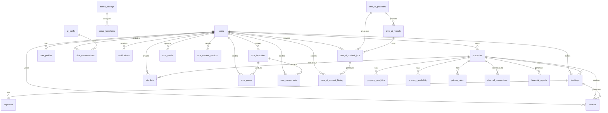

# Data Models & Database Schema

<cite>
**Referenced Files in This Document**   
- [1.sql](file://migrations/1.sql) - *Updated with AI configuration and chat conversations*
- [8.sql](file://migrations/8.sql) - *Added pricing rules and market data tables*
- [11.sql](file://migrations/11.sql) - *Added CMS data models and database schema changes for CMS functionality*
- [types.ts](file://src/shared/types.ts) - *Updated with new type definitions including CMS types*
- [dynamic-pricing-engine.ts](file://src/shared/dynamic-pricing-engine.ts) - *Pricing rules implementation*
- [channel-manager.ts](file://src/shared/channel-manager.ts) - *Channel connections implementation*
- [ai-chat-service.ts](file://src/shared/ai-chat-service.ts) - *Chat conversations implementation*
- [AIConfigPanel.tsx](file://src/react-app/components/admin/AIConfigPanel.tsx) - *AI configuration UI*
- [DynamicPricingDashboard.tsx](file://src/react-app/components/admin/DynamicPricingDashboard.tsx) - *Pricing rules UI*
- [FinancialReporting.tsx](file://src/react-app/components/admin/FinancialReporting.tsx) - *Financial reports UI*
- [cms-service.ts](file://src/shared/cms-service.ts) - *CMS service implementation*
- [cms-permissions-service.ts](file://src/shared/cms-permissions-service.ts) - *CMS permissions implementation*
</cite>

## Table of Contents
1. [Data Models & Database Schema](#data-models--database-schema)
2. [Entity Relationship Diagram](#entity-relationship-diagram)
3. [Database Tables and TypeScript Interfaces](#database-tables-and-typescript-interfaces)
   - [Users Table](#users-table)
   - [Properties Table](#properties-table)
   - [Bookings Table](#bookings-table)
   - [Payments Table](#payments-table)
   - [Wishlist Table](#wishlist-table)
   - [Reviews Table](#reviews-table)
   - [Property Analytics Table](#property-analytics-table)
   - [User Profiles Table](#user-profiles-table)
   - [Admin Settings Table](#admin-settings-table)
   - [Email Templates Table](#email-templates-table)
   - [Contact Submissions Table](#contact-submissions-table)
   - [Newsletter Subscriptions Table](#newsletter-subscriptions-table)
   - [AI Configuration Table](#ai-configuration-table)
   - [Chat Conversations Table](#chat-conversations-table)
   - [Pricing Rules Table](#pricing-rules-table)
   - [Channel Connections Table](#channel-connections-table)
   - [Financial Reports Table](#financial-reports-table)
   - [Property Availability Table](#property-availability-table)
   - [Notifications Table](#notifications-table)
   - [CMS Pages Table](#cms-pages-table)
   - [CMS Templates Table](#cms-templates-table)
   - [CMS Components Table](#cms-components-table)
   - [CMS Media Table](#cms-media-table)
   - [CMS Content Versions Table](#cms-content-versions-table)
   - [CMS AI Providers Table](#cms-ai-providers-table)
   - [CMS AI Models Table](#cms-ai-models-table)
   - [CMS AI Content Jobs Table](#cms-ai-content-jobs-table)
   - [CMS AI Content History Table](#cms-ai-content-history-table)
4. [Entity Relationships](#entity-relationships)
5. [Data Lifecycle](#data-lifecycle)
6. [Indexing and Performance](#indexing-and-performance)
7. [Data Retention](#data-retention)

## Entity Relationship Diagram



**Diagram sources**
- [1.sql](file://migrations/1.sql)
- [8.sql](file://migrations/8.sql)
- [11.sql](file://migrations/11.sql)
- [types.ts](file://src/shared/types.ts)

## Database Tables and TypeScript Interfaces

### Users Table

**Schema Definition**
```sql
CREATE TABLE users (
  id TEXT PRIMARY KEY,
  email TEXT UNIQUE NOT NULL,
  name TEXT NOT NULL,
  avatar TEXT,
  phone TEXT,
  role TEXT DEFAULT 'guest' CHECK (role IN ('guest', 'host', 'admin')),
  is_verified BOOLEAN DEFAULT 0,
  is_active BOOLEAN DEFAULT 1,
  created_at DATETIME DEFAULT CURRENT_TIMESTAMP,
  updated_at DATETIME DEFAULT CURRENT_TIMESTAMP
);
```

**TypeScript Interface**
```typescript
export const UserSchema = z.object({
  id: z.string(),
  email: z.string().email(),
  name: z.string(),
  avatar: z.string().optional(),
  phone: z.string().optional(),
  role: z.enum(['guest', 'host', 'admin']),
  is_verified: z.boolean(),
  is_active: z.boolean(),
  created_at: z.string(),
  updated_at: z.string(),
});
```

**Field Details**
- **id**: Unique identifier (TEXT, PRIMARY KEY)
- **email**: User's email address (TEXT, UNIQUE, NOT NULL)
- **name**: Full name of the user (TEXT, NOT NULL)
- **avatar**: URL to profile picture (TEXT)
- **phone**: Contact phone number (TEXT)
- **role**: User role with three possible values: guest, host, or admin (TEXT, DEFAULT 'guest')
- **is_verified**: Email verification status (BOOLEAN, DEFAULT 0)
- **is_active**: Account status (BOOLEAN, DEFAULT 1)
- **created_at**: Timestamp of record creation (DATETIME, DEFAULT CURRENT_TIMESTAMP)
- **updated_at**: Timestamp of last update (DATETIME, DEFAULT CURRENT_TIMESTAMP)

**Constraints**
- Primary Key: id
- Unique Constraint: email
- Check Constraint: role must be one of 'guest', 'host', 'admin'

**Sample Record**
```json
{
  "id": "user_12345",
  "email": "ahmed.hassan@email.com",
  "name": "Ahmed Al-Hassan",
  "avatar": "https://example.com/avatar.jpg",
  "phone": "+966501234567",
  "role": "guest",
  "is_verified": true,
  "is_active": true,
  "created_at": "2024-12-01T10:30:00Z",
  "updated_at": "2024-12-01T10:30:00Z"
}
```

**Section sources**
- [1.sql](file://migrations/1.sql#L1-L20)
- [types.ts](file://src/shared/types.ts#L328-L340)

### Properties Table

**Schema Definition**
```sql
CREATE TABLE properties (
  id INTEGER PRIMARY KEY AUTOINCREMENT,
  owner_id TEXT NOT NULL,
  title TEXT NOT NULL,
  description TEXT,
  location TEXT NOT NULL,
  address TEXT,
  latitude REAL,
  longitude REAL,
  price_per_night REAL NOT NULL,
  currency TEXT DEFAULT 'SAR',
  max_guests INTEGER NOT NULL,
  bedrooms INTEGER DEFAULT 1,
  bathrooms INTEGER DEFAULT 1,
  property_type TEXT,
  amenities TEXT, -- JSON array
  images TEXT, -- JSON array
  house_rules TEXT,
  check_in_time TEXT DEFAULT '15:00',
  check_out_time TEXT DEFAULT '11:00',
  cancellation_policy TEXT DEFAULT 'moderate',
  instant_book BOOLEAN DEFAULT 0,
  is_featured BOOLEAN DEFAULT 0,
  is_active BOOLEAN DEFAULT 1,
  view_count INTEGER DEFAULT 0,
  booking_count INTEGER DEFAULT 0,
  created_at DATETIME DEFAULT CURRENT_TIMESTAMP,
  updated_at DATETIME DEFAULT CURRENT_TIMESTAMP,
  FOREIGN KEY (owner_id) REFERENCES users(id)
);
```

**TypeScript Interface**
```typescript
export const PropertySchema = z.object({
  id: z.number(),
  user_id: z.string(),
  title: z.string(),
  description: z.string().nullable(),
  location: z.string(),
  price_per_night: z.number(),
  max_guests: z.number(),
  bedrooms: z.number().nullable(),
  bathrooms: z.number().nullable(),
  amenities: z.string().nullable(),
  images: z.string().nullable(),
  is_featured: z.boolean(),
  is_active: z.boolean(),
  created_at: z.string(),
  updated_at: z.string(),
});
```

**Field Details**
- **id**: Auto-incrementing primary key (INTEGER)
- **owner_id**: Reference to the user who owns the property (TEXT, NOT NULL)
- **title**: Property title (TEXT, NOT NULL)
- **description**: Detailed description of the property (TEXT)
- **location**: Geographic location (TEXT, NOT NULL)
- **address**: Full address (TEXT)
- **latitude**: Geolocation coordinate (REAL)
- **longitude**: Geolocation coordinate (REAL)
- **price_per_night**: Nightly rate (REAL, NOT NULL)
- **currency**: Currency code (TEXT, DEFAULT 'SAR')
- **max_guests**: Maximum occupancy (INTEGER, NOT NULL)
- **bedrooms**: Number of bedrooms (INTEGER, DEFAULT 1)
- **bathrooms**: Number of bathrooms (INTEGER, DEFAULT 1)
- **property_type**: Type of property (TEXT)
- **amenities**: JSON array of amenities (TEXT)
- **images**: JSON array of image URLs (TEXT)
- **house_rules**: Property-specific rules (TEXT)
- **check_in_time**: Default check-in time (TEXT, DEFAULT '15:00')
- **check_out_time**: Default check-out time (TEXT, DEFAULT '11:00')
- **cancellation_policy**: Policy type (TEXT, DEFAULT 'moderate')
- **instant_book**: Whether guests can book without approval (BOOLEAN, DEFAULT 0)
- **is_featured**: Whether property is featured (BOOLEAN, DEFAULT 0)
- **is_active**: Property listing status (BOOLEAN, DEFAULT 1)
- **view_count**: Number of times viewed (INTEGER, DEFAULT 0)
- **booking_count**: Number of bookings (INTEGER, DEFAULT 0)
- **created_at**: Creation timestamp (DATETIME, DEFAULT CURRENT_TIMESTAMP)
- **updated_at**: Last update timestamp (DATETIME, DEFAULT CURRENT_TIMESTAMP)

**Constraints**
- Primary Key: id
- Foreign Key: owner_id references users(id)

**Sample Record**
```json
{
  "id": 1,
  "owner_id": "owner1",
  "title": "Luxury Executive Suite in Olaya District",
  "description": "Modern luxury apartment in the heart of Riyadh's business district.",
  "location": "Olaya District, Riyadh",
  "address": "Olaya Street, Riyadh",
  "latitude": 24.7136,
  "longitude": 46.6753,
  "price_per_night": 850,
  "currency": "SAR",
  "max_guests": 4,
  "bedrooms": 2,
  "bathrooms": 2,
  "property_type": "apartment",
  "amenities": "[\"WiFi\", \"Air Conditioning\", \"Kitchen\", \"Parking\", \"TV\", \"Gym\", \"Pool\", \"Concierge\"]",
  "images": "[\"https://images.unsplash.com/photo-1564013799919-ab600027ffc6?auto=format&fit=crop&w=800&h=600\", \"https://images.unsplash.com/photo-1560448204-e1a3ecbdd6cc?auto=format&fit=crop&w=800&h=600\"]",
  "is_featured": true,
  "is_active": true,
  "created_at": "2024-12-01T10:30:00Z",
  "updated_at": "2024-12-01T10:30:00Z"
}
```

**Section sources**
- [1.sql](file://migrations/1.sql#L22-L74)
- [types.ts](file://src/shared/types.ts#L3-L21)

### Bookings Table

**Schema Definition**
```sql
CREATE TABLE bookings (
  id INTEGER PRIMARY KEY AUTOINCREMENT,
  user_id TEXT NOT NULL,
  property_id INTEGER NOT NULL,
  guest_name TEXT NOT NULL,
  guest_email TEXT NOT NULL,
  guest_phone TEXT,
  guest_count INTEGER NOT NULL,
  check_in_date DATE NOT NULL,
  check_out_date DATE NOT NULL,
  nights_count INTEGER NOT NULL,
  base_amount REAL NOT NULL,
  service_fee REAL DEFAULT 0,
  taxes REAL DEFAULT 0,
  total_amount REAL NOT NULL,
  status TEXT DEFAULT 'pending' CHECK (status IN ('pending', 'confirmed', 'cancelled', 'completed')),
  payment_status TEXT DEFAULT 'pending' CHECK (payment_status IN ('pending', 'processing', 'completed', 'failed', 'refunded')),
  payment_id TEXT,
  payment_method TEXT,
  special_requests TEXT,
  cancellation_reason TEXT,
  cancelled_at DATETIME,
  confirmed_at DATETIME,
  created_at DATETIME DEFAULT CURRENT_TIMESTAMP,
  updated_at DATETIME DEFAULT CURRENT_TIMESTAMP,
  FOREIGN KEY (user_id) REFERENCES users(id),
  FOREIGN KEY (property_id) REFERENCES properties(id)
);
```

**TypeScript Interface**
```typescript
export const BookingSchema = z.object({
  id: z.number(),
  user_id: z.string(),
  property_id: z.number(),
  guest_name: z.string(),
  guest_email: z.string(),
  guest_phone: z.string().nullable(),
  check_in_date: z.string(),
  check_out_date: z.string(),
  total_guests: z.number(),
  total_amount: z.number(),
  status: z.string(),
  payment_status: z.string(),
  payment_id: z.string().nullable(),
  special_requests: z.string().nullable(),
  created_at: z.string(),
  updated_at: z.string(),
});
```

**Field Details**
- **id**: Auto-incrementing primary key (INTEGER)
- **user_id**: Reference to the booking user (TEXT, NOT NULL)
- **property_id**: Reference to the booked property (INTEGER, NOT NULL)
- **guest_name**: Name of the guest (TEXT, NOT NULL)
- **guest_email**: Email of the guest (TEXT, NOT NULL)
- **guest_phone**: Phone number of the guest (TEXT)
- **guest_count**: Number of guests (INTEGER, NOT NULL)
- **check_in_date**: Check-in date (DATE, NOT NULL)
- **check_out_date**: Check-out date (DATE, NOT NULL)
- **nights_count**: Number of nights (INTEGER, NOT NULL)
- **base_amount**: Base accommodation cost (REAL, NOT NULL)
- **service_fee**: Service charge (REAL, DEFAULT 0)
- **taxes**: Applicable taxes (REAL, DEFAULT 0)
- **total_amount**: Total booking cost (REAL, NOT NULL)
- **status**: Booking status with possible values: pending, confirmed, cancelled, completed (TEXT, DEFAULT 'pending')
- **payment_status**: Payment status with possible values: pending, processing, completed, failed, refunded (TEXT, DEFAULT 'pending')
- **payment_id**: External payment identifier (TEXT)
- **payment_method**: Payment method used (TEXT)
- **special_requests**: Guest special requests (TEXT)
- **cancellation_reason**: Reason for cancellation (TEXT)
- **cancelled_at**: Timestamp when cancelled (DATETIME)
- **confirmed_at**: Timestamp when confirmed (DATETIME)
- **created_at**: Creation timestamp (DATETIME, DEFAULT CURRENT_TIMESTAMP)
- **updated_at**: Last update timestamp (DATETIME, DEFAULT CURRENT_TIMESTAMP)

**Constraints**
- Primary Key: id
- Foreign Keys: user_id references users(id), property_id references properties(id)
- Check Constraints: status must be one of 'pending', 'confirmed', 'cancelled', 'completed'; payment_status must be one of 'pending', 'processing', 'completed', 'failed', 'refunded'

**Sample Record**
```json
{
  "id": 1,
  "user_id": "guest1",
  "property_id": 1,
  "guest_name": "Ahmed Al-Hassan",
  "guest_email": "ahmed.hassan@email.com",
  "guest_phone": "+966501234567",
  "check_in_date": "2024-12-28",
  "check_out_date": "2024-12-31",
  "total_guests": 2,
  "total_amount": 2550,
  "status": "confirmed",
  "payment_status": "paid",
  "payment_id": "pay_12345",
  "special_requests": "Late check-in after 20:00",
  "created_at": "2024-12-01T10:30:00Z",
  "updated_at": "2024-12-01T10:30:00Z"
}
```

**Section sources**
- [1.sql](file://migrations/1.sql#L46-L74)
- [types.ts](file://src/shared/types.ts#L23-L44)

### Payments Table

**Schema Definition**
```sql
CREATE TABLE payments (
  id INTEGER PRIMARY KEY AUTOINCREMENT,
  booking_id INTEGER NOT NULL,
  payment_id TEXT UNIQUE NOT NULL,
  gateway TEXT NOT NULL CHECK (gateway IN ('myfatoorah', 'paypal', 'stripe')),
  amount REAL NOT NULL,
  currency TEXT DEFAULT 'SAR',
  status TEXT DEFAULT 'pending' CHECK (status IN ('pending', 'processing', 'completed', 'failed', 'refunded')),
  gateway_response TEXT, -- JSON
  created_at DATETIME DEFAULT CURRENT_TIMESTAMP,
  updated_at DATETIME DEFAULT CURRENT_TIMESTAMP,
  FOREIGN KEY (booking_id) REFERENCES bookings(id)
);
```

**TypeScript Interface**
```typescript
export const PaymentSchema = z.object({
  id: z.number(),
  booking_id: z.number(),
  payment_provider: z.string(),
  payment_id: z.string().nullable(),
  invoice_id: z.string().nullable(),
  amount: z.number(),
  currency: z.string(),
  status: z.string(),
  payment_method: z.string().nullable(),
  transaction_id: z.string().nullable(),
  payment_url: z.string().nullable(),
  metadata: z.string().nullable(),
  created_at: z.string(),
  updated_at: z.string(),
});
```

**Field Details**
- **id**: Auto-incrementing primary key (INTEGER)
- **booking_id**: Reference to the associated booking (INTEGER, NOT NULL)
- **payment_id**: Unique payment identifier (TEXT, UNIQUE, NOT NULL)
- **gateway**: Payment gateway used (TEXT, NOT NULL, must be one of 'myfatoorah', 'paypal', 'stripe')
- **amount**: Payment amount (REAL, NOT NULL)
- **currency**: Currency code (TEXT, DEFAULT 'SAR')
- **status**: Payment status with possible values: pending, processing, completed, failed, refunded (TEXT, DEFAULT 'pending')
- **gateway_response**: JSON response from payment gateway (TEXT)
- **created_at**: Creation timestamp (DATETIME, DEFAULT CURRENT_TIMESTAMP)
- **updated_at**: Last update timestamp (DATETIME, DEFAULT CURRENT_TIMESTAMP)

**Constraints**
- Primary Key: id
- Foreign Key: booking_id references bookings(id)
- Unique Constraint: payment_id
- Check Constraint: gateway must be one of 'myfatoorah', 'paypal', 'stripe'; status must be one of 'pending', 'processing', 'completed', 'failed', 'refunded'

**Sample Record**
```json
{
  "id": 1,
  "booking_id": 1,
  "payment_id": "pay_12345",
  "gateway": "myfatoorah",
  "amount": 2550,
  "currency": "SAR",
  "status": "completed",
  "gateway_response": "{\"transaction_id\": \"txn_67890\", \"status\": \"success\"}",
  "created_at": "2024-12-01T10:30:00Z",
  "updated_at": "2024-12-01T10:30:00Z"
}
```

**Section sources**
- [1.sql](file://migrations/1.sql#L76-L90)
- [types.ts](file://src/shared/types.ts#L98-L117)

### Wishlist Table

**Schema Definition**
```sql
CREATE TABLE wishlists (
  id INTEGER PRIMARY KEY AUTOINCREMENT,
  user_id TEXT NOT NULL,
  property_id INTEGER NOT NULL,
  created_at DATETIME DEFAULT CURRENT_TIMESTAMP,
  UNIQUE(user_id, property_id),
  FOREIGN KEY (user_id) REFERENCES users(id),
  FOREIGN KEY (property_id) REFERENCES properties(id)
);
```

**TypeScript Interface**
```typescript
export const WishlistSchema = z.object({
  id: z.number(),
  user_id: z.string(),
  property_id: z.number(),
  created_at: z.string(),
  updated_at: z.string(),
});
```

**Field Details**
- **id**: Auto-incrementing primary key (INTEGER)
- **user_id**: Reference to the user who created the wishlist (TEXT, NOT NULL)
- **property_id**: Reference to the property in the wishlist (INTEGER, NOT NULL)
- **created_at**: Creation timestamp (DATETIME, DEFAULT CURRENT_TIMESTAMP)

**Constraints**
- Primary Key: id
- Foreign Keys: user_id references users(id), property_id references properties(id)
- Unique Constraint: Combination of user_id and property_id

**Sample Record**
```json
{
  "id": 1,
  "user_id": "guest1",
  "property_id": 1,
  "created_at": "2024-12-01T10:30:00Z"
}
```

**Section sources**
- [1.sql](file://migrations/1.sql#L92-L98)
- [types.ts](file://src/shared/types.ts#L46-L51)

### Reviews Table

**Schema Definition**
```sql
CREATE TABLE reviews (
  id INTEGER PRIMARY KEY AUTOINCREMENT,
  user_id TEXT NOT NULL,
  property_id INTEGER NOT NULL,
  booking_id INTEGER,
  rating INTEGER NOT NULL CHECK (rating >= 1 AND rating <= 5),
  cleanliness_rating INTEGER CHECK (cleanliness_rating >= 1 AND cleanliness_rating <= 5),
  communication_rating INTEGER CHECK (communication_rating >= 1 AND communication_rating <= 5),
  location_rating INTEGER CHECK (location_rating >= 1 AND location_rating <= 5),
  value_rating INTEGER CHECK (value_rating >= 1 AND value_rating <= 5),
  comment TEXT,
  is_approved BOOLEAN DEFAULT 1,
  created_at DATETIME DEFAULT CURRENT_TIMESTAMP,
  updated_at DATETIME DEFAULT CURRENT_TIMESTAMP,
  FOREIGN KEY (user_id) REFERENCES users(id),
  FOREIGN KEY (property_id) REFERENCES properties(id),
  FOREIGN KEY (booking_id) REFERENCES bookings(id)
);
```

**TypeScript Interface**
```typescript
export const ReviewSchema = z.object({
  id: z.number(),
  user_id: z.string(),
  property_id: z.number(),
  booking_id: z.number().nullable(),
  rating: z.number().int().min(1).max(5),
  comment: z.string().nullable(),
  created_at: z.string(),
  updated_at: z.string(),
});
```

**Field Details**
- **id**: Auto-incrementing primary key (INTEGER)
- **user_id**: Reference to the reviewing user (TEXT, NOT NULL)
- **property_id**: Reference to the reviewed property (INTEGER, NOT NULL)
- **booking_id**: Reference to the associated booking (INTEGER)
- **rating**: Overall rating (INTEGER, NOT NULL, 1-5)
- **cleanliness_rating**: Cleanliness sub-rating (INTEGER, 1-5)
- **communication_rating**: Communication sub-rating (INTEGER, 1-5)
- **location_rating**: Location sub-rating (INTEGER, 1-5)
- **value_rating**: Value sub-rating (INTEGER, 1-5)
- **comment**: Review comment (TEXT)
- **is_approved**: Whether review is approved for display (BOOLEAN, DEFAULT 1)
- **created_at**: Creation timestamp (DATETIME, DEFAULT CURRENT_TIMESTAMP)
- **updated_at**: Last update timestamp (DATETIME, DEFAULT CURRENT_TIMESTAMP)

**Constraints**
- Primary Key: id
- Foreign Keys: user_id references users(id), property_id references properties(id), booking_id references bookings(id)
- Check Constraints: All rating fields must be between 1 and 5

**Sample Record**
```json
{
  "id": 1,
  "user_id": "guest1",
  "property_id": 1,
  "booking_id": 1,
  "rating": 5,
  "cleanliness_rating": 5,
  "communication_rating": 5,
  "location_rating": 5,
  "value_rating": 5,
  "comment": "Absolutely exceptional stay! The property exceeded all expectations.",
  "is_approved": true,
  "created_at": "2024-12-01T10:30:00Z",
  "updated_at": "2024-12-01T10:30:00Z"
}
```

**Section sources**
- [1.sql](file://migrations/1.sql#L100-L120)
- [types.ts](file://src/shared/types.ts#L53-L64)

### Property Analytics Table

**Schema Definition**
```sql
CREATE TABLE property_analytics (
  id INTEGER PRIMARY KEY AUTOINCREMENT,
  property_id INTEGER NOT NULL,
  views INTEGER DEFAULT 0,
  inquiries INTEGER DEFAULT 0,
  bookings INTEGER DEFAULT 0,
  revenue REAL DEFAULT 0,
  avg_rating REAL DEFAULT 0,
  review_count INTEGER DEFAULT 0,
  occupancy_rate REAL DEFAULT 0,
  date DATE NOT NULL,
  created_at DATETIME DEFAULT CURRENT_TIMESTAMP,
  updated_at DATETIME DEFAULT CURRENT_TIMESTAMP
);
```

**TypeScript Interface**
```typescript
export const PropertyAnalyticsSchema = z.object({
  id: z.number(),
  property_id: z.number(),
  views: z.number(),
  inquiries: z.number(),
  bookings: z.number(),
  revenue: z.number(),
  avg_rating: z.number(),
  review_count: z.number(),
  occupancy_rate: z.number(),
  date: z.string(),
  created_at: z.string(),
  updated_at: z.string(),
});
```

**Field Details**
- **id**: Auto-incrementing primary key (INTEGER)
- **property_id**: Reference to the property (INTEGER, NOT NULL)
- **views**: Number of property views (INTEGER, DEFAULT 0)
- **inquiries**: Number of inquiries received (INTEGER, DEFAULT 0)
- **bookings**: Number of bookings (INTEGER, DEFAULT 0)
- **revenue**: Total revenue generated (REAL, DEFAULT 0)
- **avg_rating**: Average rating (REAL, DEFAULT 0)
- **review_count**: Number of reviews (INTEGER, DEFAULT 0)
- **occupancy_rate**: Occupancy rate percentage (REAL, DEFAULT 0)
- **date**: Date of analytics record (DATE, NOT NULL)
- **created_at**: Creation timestamp (DATETIME, DEFAULT CURRENT_TIMESTAMP)
- **updated_at**: Last update timestamp (DATETIME, DEFAULT CURRENT_TIMESTAMP)

**Constraints**
- Primary Key: id
- Foreign Key: property_id references properties(id)

**Sample Record**
```json
{
  "id": 1,
  "property_id": 1,
  "views": 150,
  "inquiries": 25,
  "bookings": 12,
  "revenue": 15300,
  "avg_rating": 4.8,
  "review_count": 8,
  "occupancy_rate": 0.75,
  "date": "2024-12-01",
  "created_at": "2024-12-01T10:30:00Z",
  "updated_at": "2024-12-01T10:30:00Z"
}
```

**Section sources**
- [5.sql](file://migrations/5.sql#L28-L36)
- [types.ts](file://src/shared/types.ts#L188-L200)

### User Profiles Table

**Schema Definition**
```sql
CREATE TABLE user_profiles (
  id INTEGER PRIMARY KEY AUTOINCREMENT,
  user_id TEXT NOT NULL UNIQUE,
  full_name TEXT,
  phone TEXT,
  address TEXT,
  city TEXT,
  country TEXT DEFAULT 'Saudi Arabia',
  date_of_birth DATE,
  preferred_language TEXT DEFAULT 'en',
  currency TEXT DEFAULT 'SAR',
  bio TEXT,
  avatar_url TEXT,
  created_at DATETIME DEFAULT CURRENT_TIMESTAMP,
  updated_at DATETIME DEFAULT CURRENT_TIMESTAMP
);
```

**TypeScript Interface**
```typescript
export const UserProfileSchema = z.object({
  id: z.number(),
  user_id: z.string(),
  full_name: z.string().nullable(),
  phone: z.string().nullable(),
  address: z.string().nullable(),
  city: z.string().nullable(),
  country: z.string().nullable(),
  date_of_birth: z.string().nullable(),
  preferred_language: z.string(),
  currency: z.string(),
  bio: z.string().nullable(),
  avatar_url: z.string().nullable(),
  created_at: z.string(),
  updated_at: z.string(),
});
```

**Field Details**
- **id**: Auto-incrementing primary key (INTEGER)
- **user_id**: Reference to the user (TEXT, NOT NULL, UNIQUE)
- **full_name**: User's full name (TEXT)
- **phone**: Contact phone number (TEXT)
- **address**: Street address (TEXT)
- **city**: City of residence (TEXT)
- **country**: Country of residence (TEXT, DEFAULT 'Saudi Arabia')
- **date_of_birth**: Date of birth (DATE)
- **preferred_language**: Preferred language (TEXT, DEFAULT 'en')
- **currency**: Preferred currency (TEXT, DEFAULT 'SAR')
- **bio**: User biography (TEXT)
- **avatar_url**: URL to profile picture (TEXT)
- **created_at**: Creation timestamp (DATETIME, DEFAULT CURRENT_TIMESTAMP)
- **updated_at**: Last update timestamp (DATETIME, DEFAULT CURRENT_TIMESTAMP)

**Constraints**
- Primary Key: id
- Foreign Key: user_id references users(id)
- Unique Constraint: user_id

**Sample Record**
```json
{
  "id": 1,
  "user_id": "user_12345",
  "full_name": "Ahmed Al-Hassan",
  "phone": "+966501234567",
  "address": "Olaya Street",
  "city": "Riyadh",
  "country": "Saudi Arabia",
  "date_of_birth": "1990-05-15",
  "preferred_language": "en",
  "currency": "SAR",
  "bio": "Business traveler who enjoys luxury accommodations.",
  "avatar_url": "https://example.com/avatar.jpg",
  "created_at": "2024-12-01T10:30:00Z",
  "updated_at": "2024-12-01T10:30:00Z"
}
```

**Section sources**
- [4.sql](file://migrations/4.sql#L1-L18)
- [types.ts](file://src/shared/types.ts#L137-L150)

### Admin Settings Table

**Schema Definition**
```sql
CREATE TABLE admin_settings (
  id INTEGER PRIMARY KEY AUTOINCREMENT,
  key TEXT NOT NULL UNIQUE,
  value TEXT,
  category TEXT DEFAULT 'general',
  description TEXT,
  created_at DATETIME DEFAULT CURRENT_TIMESTAMP,
  updated_at DATETIME DEFAULT CURRENT_TIMESTAMP
);
```

**TypeScript Interface**
```typescript
export const AdminSettingSchema = z.object({
  id: z.number(),
  key: z.string(),
  value: z.string().nullable(),
  created_at: z.string(),
  updated_at: z.string(),
});
```

**Field Details**
- **id**: Auto-incrementing primary key (INTEGER)
- **key**: Setting key/name (TEXT, NOT NULL, UNIQUE)
- **value**: Setting value (TEXT)
- **category**: Setting category (TEXT, DEFAULT 'general')
- **description**: Setting description (TEXT)
- **created_at**: Creation timestamp (DATETIME, DEFAULT CURRENT_TIMESTAMP)
- **updated_at**: Last update timestamp (DATETIME, DEFAULT CURRENT_TIMESTAMP)

**Constraints**
- Primary Key: id
- Unique Constraint: key

**Sample Record**
```json
{
  "id": 1,
  "key": "site_maintenance",
  "value": "false",
  "category": "general",
  "description": "Whether the site is in maintenance mode",
  "created_at": "2024-12-01T10:30:00Z",
  "updated_at": "2024-12-01T10:30:00Z"
}
```

**Section sources**
- [1.sql](file://migrations/1.sql#L154-L162)
- [types.ts](file://src/shared/types.ts#L66-L71)

### Email Templates Table

**Schema Definition**
```sql
CREATE TABLE email_templates (
  id INTEGER PRIMARY KEY AUTOINCREMENT,
  template_key TEXT NOT NULL UNIQUE,
  subject TEXT NOT NULL,
  html_content TEXT NOT NULL,
  variables TEXT,
  is_active BOOLEAN DEFAULT 1,
  created_at DATETIME DEFAULT CURRENT_TIMESTAMP,
  updated_at DATETIME DEFAULT CURRENT_TIMESTAMP
);
```

**Field Details**
- **id**: Auto-incrementing primary key (INTEGER)
- **template_key**: Unique template identifier (TEXT, NOT NULL, UNIQUE)
- **subject**: Email subject line (TEXT, NOT NULL)
- **html_content**: HTML content of the email (TEXT, NOT NULL)
- **variables**: JSON array of available template variables (TEXT)
- **is_active**: Whether template is active (BOOLEAN, DEFAULT 1)
- **created_at**: Creation timestamp (DATETIME, DEFAULT CURRENT_TIMESTAMP)
- **updated_at**: Last update timestamp (DATETIME, DEFAULT CURRENT_TIMESTAMP)

**Constraints**
- Primary Key: id
- Unique Constraint: template_key

**Sample Record**
```json
{
  "id": 1,
  "template_key": "booking_confirmation",
  "subject": "Booking Confirmation - HabibiStay",
  "html_content": "<!DOCTYPE html>...[HTML content]...",
  "variables": "[\"guest_name\", \"property_title\", \"property_location\", \"check_in_date\", \"check_out_date\", \"total_guests\", \"total_amount\", \"booking_id\", \"property_url\"]",
  "is_active": true,
  "created_at": "2024-12-01T10:30:00Z",
  "updated_at": "2024-12-01T10:30:00Z"
}
```

**Section sources**
- [5.sql](file://migrations/5.sql#L1-L10)

### Contact Submissions Table

**Schema Definition**
```sql
CREATE TABLE contact_submissions (
  id INTEGER PRIMARY KEY AUTOINCREMENT,
  name TEXT NOT NULL,
  email TEXT NOT NULL,
  phone TEXT,
  interest TEXT NOT NULL,
  message TEXT NOT NULL,
  status TEXT DEFAULT 'new',
  created_at DATETIME DEFAULT CURRENT_TIMESTAMP,
  updated_at DATETIME DEFAULT CURRENT_TIMESTAMP
);
```

**Field Details**
- **id**: Auto-incrementing primary key (INTEGER)
- **name**: Submitter's name (TEXT, NOT NULL)
- **email**: Submitter's email (TEXT, NOT NULL)
- **phone**: Submitter's phone (TEXT)
- **interest**: Interest type (TEXT, NOT NULL)
- **message**: Message content (TEXT, NOT NULL)
- **status**: Submission status (TEXT, DEFAULT 'new')
- **created_at**: Creation timestamp (DATETIME, DEFAULT CURRENT_TIMESTAMP)
- **updated_at**: Last update timestamp (DATETIME, DEFAULT CURRENT_TIMESTAMP)

**Constraints**
- Primary Key: id

**Sample Record**
```json
{
  "id": 1,
  "name": "John Doe",
  "email": "john.doe@example.com",
  "phone": "+1234567890",
  "interest": "guest",
  "message": "I have a question about booking a property.",
  "status": "new",
  "created_at": "2024-12-01T10:30:00Z",
  "updated_at": "2024-12-01T10:30:00Z"
}
```

**Section sources**
- [7.sql](file://migrations/7.sql#L1-L11)

### Newsletter Subscriptions Table

**Schema Definition**
```sql
CREATE TABLE newsletter_subscriptions (
  id INTEGER PRIMARY KEY AUTOINCREMENT,
  email TEXT NOT NULL UNIQUE,
  source TEXT DEFAULT 'website',
  is_active BOOLEAN DEFAULT 1,
  subscribed_at DATETIME DEFAULT CURRENT_TIMESTAMP,
  unsubscribed_at DATETIME,
  created_at DATETIME DEFAULT CURRENT_TIMESTAMP,
  updated_at DATETIME DEFAULT CURRENT_TIMESTAMP
);
```

**Field Details**
- **id**: Auto-incrementing primary key (INTEGER)
- **email**: Subscriber's email (TEXT, NOT NULL, UNIQUE)
- **source**: Subscription source (TEXT, DEFAULT 'website')
- **is_active**: Subscription status (BOOLEAN, DEFAULT 1)
- **subscribed_at**: Subscription timestamp (DATETIME, DEFAULT CURRENT_TIMESTAMP)
- **unsubscribed_at**: Unsubscription timestamp (DATETIME)
- **created_at**: Creation timestamp (DATETIME, DEFAULT CURRENT_TIMESTAMP)
- **updated_at**: Last update timestamp (DATETIME, DEFAULT CURRENT_TIMESTAMP)

**Constraints**
- Primary Key: id
- Unique Constraint: email

**Sample Record**
```json
{
  "id": 1,
  "email": "subscriber@example.com",
  "source": "website",
  "is_active": true,
  "subscribed_at": "2024-12-01T10:30:00Z",
  "created_at": "2024-12-01T10:30:00Z",
  "updated_at": "2024-12-01T10:30:00Z"
}
```

**Section sources**
- [7.sql](file://migrations/7.sql#L13-L22)

### AI Configuration Table

**Schema Definition**
```sql
CREATE TABLE ai_config (
  id INTEGER PRIMARY KEY AUTOINCREMENT,
  model_provider TEXT DEFAULT 'openai' CHECK (model_provider IN ('openai', 'anthropic', 'gemini')),
  model_name TEXT DEFAULT 'gpt-4',
  api_key TEXT,
  temperature REAL DEFAULT 0.7,
  max_tokens INTEGER DEFAULT 1000,
  system_prompt TEXT,
  personality TEXT DEFAULT 'friendly' CHECK (personality IN ('professional', 'friendly', 'casual')),
  language TEXT DEFAULT 'en',
  is_active BOOLEAN DEFAULT 1,
  created_at DATETIME DEFAULT CURRENT_TIMESTAMP,
  updated_at DATETIME DEFAULT CURRENT_TIMESTAMP
);
```

**Field Details**
- **id**: Auto-incrementing primary key (INTEGER)
- **model_provider**: AI model provider (TEXT, DEFAULT 'openai', must be one of 'openai', 'anthropic', 'gemini')
- **model_name**: Specific model name (TEXT, DEFAULT 'gpt-4')
- **api_key**: API key for the model provider (TEXT)
- **temperature**: Sampling temperature for text generation (REAL, DEFAULT 0.7)
- **max_tokens**: Maximum tokens in response (INTEGER, DEFAULT 1000)
- **system_prompt**: System-level prompt for AI behavior (TEXT)
- **personality**: AI personality style (TEXT, DEFAULT 'friendly', must be one of 'professional', 'friendly', 'casual')
- **language**: Response language (TEXT, DEFAULT 'en')
- **is_active**: Whether this configuration is active (BOOLEAN, DEFAULT 1)
- **created_at**: Creation timestamp (DATETIME, DEFAULT CURRENT_TIMESTAMP)
- **updated_at**: Last update timestamp (DATETIME, DEFAULT CURRENT_TIMESTAMP)

**Constraints**
- Primary Key: id
- Check Constraints: model_provider must be one of 'openai', 'anthropic', 'gemini'; personality must be one of 'professional', 'friendly', 'casual'

**Sample Record**
```json
{
  "id": 1,
  "model_provider": "openai",
  "model_name": "gpt-4o-mini",
  "temperature": 0.7,
  "max_tokens": 1000,
  "personality": "friendly",
  "language": "en",
  "is_active": true,
  "created_at": "2024-12-01T10:30:00Z",
  "updated_at": "2024-12-01T10:30:00Z"
}
```

**Section sources**
- [1.sql](file://migrations/1.sql#L102-L136)
- [AIConfigPanel.tsx](file://src/react-app/components/admin/AIConfigPanel.tsx#L66-L108)

### Chat Conversations Table

**Schema Definition**
```sql
CREATE TABLE chat_conversations (
  id TEXT PRIMARY KEY,
  user_id TEXT,
  messages TEXT DEFAULT '[]',
  context TEXT DEFAULT '{}',
  is_active BOOLEAN DEFAULT 1,
  updated_at DATETIME DEFAULT CURRENT_TIMESTAMP,
  FOREIGN KEY (user_id) REFERENCES users(id)
);
```

**Field Details**
- **id**: Unique conversation identifier (TEXT, PRIMARY KEY)
- **user_id**: Reference to the user (TEXT)
- **messages**: JSON array of chat messages (TEXT, DEFAULT '[]')
- **context**: JSON object containing conversation context (TEXT, DEFAULT '{}')
- **is_active**: Whether conversation is active (BOOLEAN, DEFAULT 1)
- **updated_at**: Last update timestamp (DATETIME, DEFAULT CURRENT_TIMESTAMP)

**Constraints**
- Primary Key: id
- Foreign Key: user_id references users(id)

**Sample Record**
```json
{
  "id": "conv_12345",
  "user_id": "user_12345",
  "messages": "[{\"role\":\"user\",\"content\":\"Hello\",\"timestamp\":\"2024-12-01T10:30:00Z\"},{\"role\":\"assistant\",\"content\":\"Hi, how can I help you?\",\"timestamp\":\"2024-12-01T10:30:05Z\"}]",
  "context": "{\"user_preferences\":{\"language\":\"en\"},\"conversation_history_count\":1}",
  "is_active": true,
  "updated_at": "2024-12-01T10:30:05Z"
}
```

**Section sources**
- [ai-chat-service.ts](file://src/shared/ai-chat-service.ts#L412-L452)
- [worker/index.ts](file://src/worker/index.ts#L1098-L1135)

### Pricing Rules Table

**Schema Definition**
```sql
CREATE TABLE pricing_rules (
    id INTEGER PRIMARY KEY AUTOINCREMENT,
    property_id INTEGER NOT NULL,
    rule_type VARCHAR(50) NOT NULL,
    rule_name VARCHAR(255) NOT NULL,
    is_active BOOLEAN NOT NULL DEFAULT 1,
    priority INTEGER NOT NULL DEFAULT 1,
    conditions TEXT NOT NULL,
    adjustment TEXT NOT NULL,
    date_range_start DATE,
    date_range_end DATE,
    created_at DATETIME NOT NULL DEFAULT CURRENT_TIMESTAMP,
    updated_at DATETIME NOT NULL DEFAULT CURRENT_TIMESTAMP,
    FOREIGN KEY (property_id) REFERENCES properties(id) ON DELETE CASCADE
);
```

**Field Details**
- **id**: Auto-incrementing primary key (INTEGER)
- **property_id**: Reference to the property (INTEGER, NOT NULL)
- **rule_type**: Type of pricing rule (VARCHAR(50), NOT NULL, e.g., 'seasonal', 'occupancy', 'advance_booking')
- **rule_name**: Descriptive name for the rule (VARCHAR(255), NOT NULL)
- **is_active**: Whether rule is currently active (BOOLEAN, NOT NULL, DEFAULT 1)
- **priority**: Rule priority (higher number = higher priority) (INTEGER, NOT NULL, DEFAULT 1)
- **conditions**: JSON object defining when rule applies (TEXT, NOT NULL)
- **adjustment**: JSON object defining price adjustment (TEXT, NOT NULL)
- **date_range_start**: Start date for rule validity (DATE)
- **date_range_end**: End date for rule validity (DATE)
- **created_at**: Creation timestamp (DATETIME, NOT NULL, DEFAULT CURRENT_TIMESTAMP)
- **updated_at**: Last update timestamp (DATETIME, NOT NULL, DEFAULT CURRENT_TIMESTAMP)

**Constraints**
- Primary Key: id
- Foreign Key: property_id references properties(id) with CASCADE delete
- Check Constraints: rule_type must be valid pricing rule type

**Sample Record**
```json
{
  "id": 1,
  "property_id": 1,
  "rule_type": "seasonal",
  "rule_name": "Ramadan Special",
  "is_active": true,
  "priority": 5,
  "conditions": "{\"min_occupancy_rate\": 0.8, \"days_until_checkin\": {\"min\": 7, \"max\": 30}}",
  "adjustment": "{\"type\": \"percentage\", \"value\": 15}",
  "date_range_start": "2024-03-10",
  "date_range_end": "2024-04-09",
  "created_at": "2024-12-01T10:30:00Z",
  "updated_at": "2024-12-01T10:30:00Z"
}
```

**Section sources**
- [8.sql](file://migrations/8.sql#L24-L54)
- [dynamic-pricing-engine.ts](file://src/shared/dynamic-pricing-engine.ts#L322-L347)

### Channel Connections Table

**Schema Definition**
```sql
CREATE TABLE external_channels (
  id TEXT PRIMARY KEY,
  name TEXT NOT NULL,
  type TEXT NOT NULL,
  is_active BOOLEAN NOT NULL DEFAULT 1,
  api_endpoint TEXT,
  credentials TEXT,
  sync_settings TEXT,
  mapping_rules TEXT,
  created_at DATETIME NOT NULL DEFAULT CURRENT_TIMESTAMP,
  updated_at DATETIME NOT NULL DEFAULT CURRENT_TIMESTAMP
);
```

**Field Details**
- **id**: Unique channel identifier (TEXT, PRIMARY KEY)
- **name**: Channel name (TEXT, NOT NULL)
- **type**: Channel type (TEXT, NOT NULL, e.g., 'airbnb', 'booking.com')
- **is_active**: Whether channel is active (BOOLEAN, NOT NULL, DEFAULT 1)
- **api_endpoint**: API endpoint URL (TEXT)
- **credentials**: JSON object containing authentication credentials (TEXT)
- **sync_settings**: JSON object containing synchronization settings (TEXT)
- **mapping_rules**: JSON object containing property mapping rules (TEXT)
- **created_at**: Creation timestamp (DATETIME, NOT NULL, DEFAULT CURRENT_TIMESTAMP)
- **updated_at**: Last update timestamp (DATETIME, NOT NULL, DEFAULT CURRENT_TIMESTAMP)

**Constraints**
- Primary Key: id

**Sample Record**
```json
{
  "id": "channel_12345",
  "name": "Airbnb Integration",
  "type": "airbnb",
  "is_active": true,
  "api_endpoint": "https://api.airbnb.com/v2",
  "credentials": "{\"client_id\": \"abc123\", \"client_secret\": \"xyz789\"}",
  "sync_settings": "{\"frequency\": \"realtime\", \"auto_accept\": true}",
  "mapping_rules": "{\"property_id_mapping\": {\"habibi_1\": \"airbnb_101\"}}",
  "created_at": "2024-12-01T10:30:00Z",
  "updated_at": "2024-12-01T10:30:00Z"
}
```

**Section sources**
- [channel-manager.ts](file://src/shared/channel-manager.ts#L45-L82)
- [channel-manager-types.ts](file://src/shared/channel-manager-types.ts#L360-L373)

### Financial Reports Table

**Schema Definition**
```sql
CREATE TABLE financial_reports (
  id INTEGER PRIMARY KEY AUTOINCREMENT,
  report_type TEXT NOT NULL,
  period_start DATE NOT NULL,
  period_end DATE NOT NULL,
  generated_by TEXT NOT NULL,
  generated_at DATETIME NOT NULL DEFAULT CURRENT_TIMESTAMP,
  status TEXT NOT NULL DEFAULT 'generating',
  file_url TEXT,
  summary TEXT,
  created_at DATETIME NOT NULL DEFAULT CURRENT_TIMESTAMP,
  updated_at DATETIME NOT NULL DEFAULT CURRENT_TIMESTAMP,
  FOREIGN KEY (generated_by) REFERENCES users(id)
);
```

**Field Details**
- **id**: Auto-incrementing primary key (INTEGER)
- **report_type**: Type of financial report (TEXT, NOT NULL, e.g., 'revenue', 'commission', 'tax', 'expense', 'profit_loss')
- **period_start**: Start date of reporting period (DATE, NOT NULL)
- **period_end**: End date of reporting period (DATE, NOT NULL)
- **generated_by**: User who generated the report (TEXT, NOT NULL)
- **generated_at**: Timestamp when report was generated (DATETIME, NOT NULL, DEFAULT CURRENT_TIMESTAMP)
- **status**: Report generation status (TEXT, NOT NULL, DEFAULT 'generating', possible values: 'generating', 'completed', 'failed')
- **file_url**: URL to download the generated report file (TEXT)
- **summary**: JSON object containing report summary data (TEXT)
- **created_at**: Creation timestamp (DATETIME, NOT NULL, DEFAULT CURRENT_TIMESTAMP)
- **updated_at**: Last update timestamp (DATETIME, NOT NULL, DEFAULT CURRENT_TIMESTAMP)

**Constraints**
- Primary Key: id
- Foreign Key: generated_by references users(id)

**Sample Record**
```json
{
  "id": 1,
  "report_type": "revenue",
  "period_start": "2024-11-01",
  "period_end": "2024-11-30",
  "generated_by": "admin_123",
  "generated_at": "2024-12-01T10:30:00Z",
  "status": "completed",
  "file_url": "https://example.com/reports/revenue_2024_11.pdf",
  "summary": "{\"total_revenue\": 150000, \"total_commission\": 15000, \"total_transactions\": 250, \"currency\": \"SAR\"}",
  "created_at": "2024-12-01T10:30:00Z",
  "updated_at": "2024-12-01T10:30:00Z"
}
```

**Section sources**
- [FinancialReporting.tsx](file://src/react-app/components/admin/FinancialReporting.tsx#L73-L104)
- [worker/index.ts](file://src/worker/index.ts#L1012-L1050)

### Property Availability Table

**Schema Definition**
```sql
CREATE TABLE property_availability (
  id INTEGER PRIMARY KEY AUTOINCREMENT,
  property_id INTEGER NOT NULL,
  date DATE NOT NULL,
  is_available BOOLEAN NOT NULL DEFAULT 1,
  price_override REAL,
  booking_id INTEGER,
  created_at DATETIME NOT NULL DEFAULT CURRENT_TIMESTAMP,
  updated_at DATETIME NOT NULL DEFAULT CURRENT_TIMESTAMP,
  FOREIGN KEY (property_id) REFERENCES properties(id) ON DELETE CASCADE,
  FOREIGN KEY (booking_id) REFERENCES bookings(id),
  UNIQUE(property_id, date)
);
```

**Field Details**
- **id**: Auto-incrementing primary key (INTEGER)
- **property_id**: Reference to the property (INTEGER, NOT NULL)
- **date**: Date for availability (DATE, NOT NULL)
- **is_available**: Whether property is available on this date (BOOLEAN, NOT NULL, DEFAULT 1)
- **price_override**: Price override for this specific date (REAL)
- **booking_id**: Reference to booking that occupies this date (INTEGER)
- **created_at**: Creation timestamp (DATETIME, NOT NULL, DEFAULT CURRENT_TIMESTAMP)
- **updated_at**: Last update timestamp (DATETIME, NOT NULL, DEFAULT CURRENT_TIMESTAMP)

**Constraints**
- Primary Key: id
- Foreign Keys: property_id references properties(id) with CASCADE delete, booking_id references bookings(id)
- Unique Constraint: Combination of property_id and date

**Sample Record**
```json
{
  "id": 1,
  "property_id": 1,
  "date": "2024-12-28",
  "is_available": false,
  "price_override": 950,
  "booking_id": 1,
  "created_at": "2024-12-01T10:30:00Z",
  "updated_at": "2024-12-01T10:30:00Z"
}
```

**Section sources**
- [8.sql](file://migrations/8.sql#L24-L54)
- [dynamic-pricing-engine.ts](file://src/shared/dynamic-pricing-engine.ts#L513-L550)

### Notifications Table

**Schema Definition**
```sql
CREATE TABLE notifications (
  id INTEGER PRIMARY KEY AUTOINCREMENT,
  user_id TEXT NOT NULL,
  type TEXT NOT NULL,
  title TEXT NOT NULL,
  message TEXT NOT NULL,
  is_read BOOLEAN DEFAULT 0,
  is_dismissed BOOLEAN DEFAULT 0,
  action_url TEXT,
  metadata TEXT,
  created_at DATETIME NOT NULL DEFAULT CURRENT_TIMESTAMP,
  read_at DATETIME,
  FOREIGN KEY (user_id) REFERENCES users(id)
);
```

**Field Details**
- **id**: Auto-incrementing primary key (INTEGER)
- **user_id**: Reference to the recipient user (TEXT, NOT NULL)
- **type**: Notification type (TEXT, NOT NULL, e.g., 'booking_confirmation', 'payment_failed', 'review_request')
- **title**: Notification title (TEXT, NOT NULL)
- **message**: Notification message content (TEXT, NOT NULL)
- **is_read**: Whether notification has been read (BOOLEAN, DEFAULT 0)
- **is_dismissed**: Whether notification has been dismissed (BOOLEAN, DEFAULT 0)
- **action_url**: URL for notification action (TEXT)
- **metadata**: JSON object containing additional metadata (TEXT)
- **created_at**: Creation timestamp (DATETIME, NOT NULL, DEFAULT CURRENT_TIMESTAMP)
- **read_at**: Timestamp when notification was read (DATETIME)

**Constraints**
- Primary Key: id
- Foreign Key: user_id references users(id)

**Sample Record**
```json
{
  "id": 1,
  "user_id": "user_12345",
  "type": "booking_confirmation",
  "title": "Booking Confirmed",
  "message": "Your booking for Luxury Executive Suite has been confirmed.",
  "is_read": false,
  "is_dismissed": false,
  "action_url": "/bookings/1",
  "metadata": "{\"booking_id\": 1, \"property_id\": 1}",
  "created_at": "2024-12-01T10:30:00Z",
  "read_at": null
}
```

**Section sources**
- [worker/index.ts](file://src/worker/index.ts#L1087-L1118)
- [SecurityNotifications.tsx](file://src/react-app/components/SecurityNotifications.tsx#L100-L150)

### CMS Pages Table

**Schema Definition**
```sql
CREATE TABLE cms_pages (
  id INTEGER PRIMARY KEY AUTOINCREMENT,
  title TEXT NOT NULL,
  slug TEXT NOT NULL UNIQUE,
  template_id INTEGER,
  content TEXT, -- JSON structure of page content
  metadata TEXT, -- JSON metadata (SEO, etc.)
  status TEXT DEFAULT 'draft' CHECK (status IN ('draft', 'published', 'archived')),
  created_by TEXT,
  updated_by TEXT,
  created_at DATETIME DEFAULT CURRENT_TIMESTAMP,
  updated_at DATETIME DEFAULT CURRENT_TIMESTAMP,
  published_at DATETIME,
  FOREIGN KEY (template_id) REFERENCES cms_templates(id),
  FOREIGN KEY (created_by) REFERENCES users(id),
  FOREIGN KEY (updated_by) REFERENCES users(id)
);
```

**TypeScript Interface**
```typescript
export const PageSchema = z.object({
  id: z.number(),
  title: z.string(),
  slug: z.string(),
  template_id: z.number().nullable(),
  content: z.string().nullable(), // JSON structure
  metadata: z.string().nullable(), // JSON metadata
  status: z.enum(['draft', 'published', 'archived']),
  created_by: z.string().nullable(),
  updated_by: z.string().nullable(),
  created_at: z.string(),
  updated_at: z.string(),
  published_at: z.string().nullable(),
});
```

**Field Details**
- **id**: Auto-incrementing primary key (INTEGER)
- **title**: Page title (TEXT, NOT NULL)
- **slug**: URL-friendly identifier (TEXT, NOT NULL, UNIQUE)
- **template_id**: Reference to the template used (INTEGER)
- **content**: JSON structure of page content (TEXT)
- **metadata**: JSON metadata for SEO and other purposes (TEXT)
- **status**: Page status with possible values: draft, published, archived (TEXT, DEFAULT 'draft')
- **created_by**: User who created the page (TEXT)
- **updated_by**: User who last updated the page (TEXT)
- **created_at**: Creation timestamp (DATETIME, DEFAULT CURRENT_TIMESTAMP)
- **updated_at**: Last update timestamp (DATETIME, DEFAULT CURRENT_TIMESTAMP)
- **published_at**: Timestamp when page was published (DATETIME)

**Constraints**
- Primary Key: id
- Unique Constraint: slug
- Foreign Keys: template_id references cms_templates(id), created_by and updated_by references users(id)
- Check Constraint: status must be one of 'draft', 'published', 'archived'

**Sample Record**
```json
{
  "id": 1,
  "title": "About Us",
  "slug": "about",
  "template_id": 1,
  "content": "{\"sections\":[{\"type\":\"hero\",\"title\":\"Welcome to HabibiStay\",\"content\":\"We provide luxury accommodations across Saudi Arabia.\"}]}",
  "metadata": "{\"seo_title\":\"About HabibiStay\",\"seo_description\":\"Learn about our luxury accommodation platform\",\"keywords\":\"about, habibistay, luxury\"}",
  "status": "published",
  "created_by": "admin_123",
  "updated_by": "admin_123",
  "created_at": "2024-12-01T10:30:00Z",
  "updated_at": "2024-12-01T10:30:00Z",
  "published_at": "2024-12-01T10:30:00Z"
}
```

**Section sources**
- [11.sql](file://migrations/11.sql#L1-L23)
- [types.ts](file://src/shared/types.ts#L585-L597)
- [cms-service.ts](file://src/shared/cms-service.ts#L12-L45)

### CMS Templates Table

**Schema Definition**
```sql
CREATE TABLE cms_templates (
  id INTEGER PRIMARY KEY AUTOINCREMENT,
  name TEXT NOT NULL,
  description TEXT,
  content_structure TEXT, -- JSON structure defining template layout
  preview_image TEXT,
  is_default BOOLEAN DEFAULT 0,
  parent_template_id INTEGER, -- For template inheritance
  design_settings TEXT, -- JSON design settings including responsive breakpoints
  created_by TEXT,
  updated_by TEXT,
  created_at DATETIME DEFAULT CURRENT_TIMESTAMP,
  updated_at DATETIME DEFAULT CURRENT_TIMESTAMP,
  FOREIGN KEY (parent_template_id) REFERENCES cms_templates(id),
  FOREIGN KEY (created_by) REFERENCES users(id),
  FOREIGN KEY (updated_by) REFERENCES users(id)
);
```

**TypeScript Interface**
```typescript
export const TemplateSchema = z.object({
  id: z.number(),
  name: z.string(),
  description: z.string().nullable(),
  content_structure: z.string().nullable(), // JSON structure
  preview_image: z.string().nullable(),
  is_default: z.boolean(),
  parent_template_id: z.number().nullable(), // For template inheritance
  design_settings: z.string().nullable(), // JSON design settings
  created_by: z.string().nullable(),
  updated_by: z.string().nullable(),
  created_at: z.string(),
  updated_at: z.string(),
});
```

**Field Details**
- **id**: Auto-incrementing primary key (INTEGER)
- **name**: Template name (TEXT, NOT NULL)
- **description**: Template description (TEXT)
- **content_structure**: JSON structure defining the template layout (TEXT)
- **preview_image**: URL to template preview image (TEXT)
- **is_default**: Whether this is the default template (BOOLEAN, DEFAULT 0)
- **parent_template_id**: Reference to parent template for inheritance (INTEGER)
- **design_settings**: JSON design settings including responsive breakpoints (TEXT)
- **created_by**: User who created the template (TEXT)
- **updated_by**: User who last updated the template (TEXT)
- **created_at**: Creation timestamp (DATETIME, DEFAULT CURRENT_TIMESTAMP)
- **updated_at**: Last update timestamp (DATETIME, DEFAULT CURRENT_TIMESTAMP)

**Constraints**
- Primary Key: id
- Foreign Keys: parent_template_id references cms_templates(id), created_by and updated_by references users(id)

**Sample Record**
```json
{
  "id": 1,
  "name": "Default Template",
  "description": "Default page template with header, content, and footer",
  "content_structure": "{\"layout\":\"default\",\"sections\":[\"header\",\"content\",\"footer\"]}",
  "preview_image": "/images/default-template-preview.png",
  "is_default": true,
  "parent_template_id": null,
  "design_settings": "{\"breakpoints\":{\"mobile\":768,\"tablet\":1024,\"desktop\":1200},\"colors\":{\"primary\":\"#000000\",\"secondary\":\"#FFFFFF\"}}",
  "created_by": "admin_123",
  "updated_by": "admin_123",
  "created_at": "2024-12-01T10:30:00Z",
  "updated_at": "2024-12-01T10:30:00Z"
}
```

**Section sources**
- [11.sql](file://migrations/11.sql#L25-L53)
- [types.ts](file://src/shared/types.ts#L599-L611)
- [cms-service.ts](file://src/shared/cms-service.ts#L102-L135)

### CMS Components Table

**Schema Definition**
```sql
CREATE TABLE cms_components (
  id INTEGER PRIMARY KEY AUTOINCREMENT,
  type TEXT NOT NULL,
  name TEXT NOT NULL,
  properties TEXT, -- JSON properties for the component
  styles TEXT, -- JSON styling information
  created_by TEXT,
  updated_by TEXT,
  created_at DATETIME DEFAULT CURRENT_TIMESTAMP,
  updated_at DATETIME DEFAULT CURRENT_TIMESTAMP,
  FOREIGN KEY (created_by) REFERENCES users(id),
  FOREIGN KEY (updated_by) REFERENCES users(id)
);
```

**TypeScript Interface**
```typescript
export const ComponentSchema = z.object({
  id: z.number(),
  type: z.string(),
  name: z.string(),
  properties: z.string().nullable(), // JSON properties
  styles: z.string().nullable(), // JSON styles
  created_by: z.string().nullable(),
  updated_by: z.string().nullable(),
  created_at: z.string(),
  updated_at: z.string(),
});
```

**Field Details**
- **id**: Auto-incrementing primary key (INTEGER)
- **type**: Component type (TEXT, NOT NULL)
- **name**: Component name (TEXT, NOT NULL)
- **properties**: JSON properties for the component (TEXT)
- **styles**: JSON styling information (TEXT)
- **created_by**: User who created the component (TEXT)
- **updated_by**: User who last updated the component (TEXT)
- **created_at**: Creation timestamp (DATETIME, DEFAULT CURRENT_TIMESTAMP)
- **updated_at**: Last update timestamp (DATETIME, DEFAULT CURRENT_TIMESTAMP)

**Constraints**
- Primary Key: id
- Foreign Keys: created_by and updated_by references users(id)

**Sample Record**
```json
{
  "id": 1,
  "type": "text",
  "name": "Text Block",
  "properties": "{\"text\":\"Hello World\",\"alignment\":\"center\"}",
  "styles": "{\"color\":\"#000000\",\"font_size\":\"16px\"}",
  "created_by": "admin_123",
  "updated_by": "admin_123",
  "created_at": "2024-12-01T10:30:00Z",
  "updated_at": "2024-12-01T10:30:00Z"
}
```

**Section sources**
- [11.sql](file://migrations/11.sql#L55-L73)
- [types.ts](file://src/shared/types.ts#L613-L625)
- [cms-service.ts](file://src/shared/cms-service.ts#L201-L246)

### CMS Media Table

**Schema Definition**
```sql
CREATE TABLE cms_media (
  id INTEGER PRIMARY KEY AUTOINCREMENT,
  filename TEXT NOT NULL,
  original_name TEXT NOT NULL,
  mime_type TEXT NOT NULL,
  size INTEGER NOT NULL,
  url TEXT NOT NULL,
  alt_text TEXT,
  caption TEXT,
  created_by TEXT,
  created_at DATETIME DEFAULT CURRENT_TIMESTAMP,
  FOREIGN KEY (created_by) REFERENCES users(id)
);
```

**TypeScript Interface**
```typescript
export const MediaSchema = z.object({
  id: z.number(),
  filename: z.string(),
  original_name: z.string(),
  mime_type: z.string(),
  size: z.number(),
  url: z.string(),
  alt_text: z.string().nullable(),
  caption: z.string().nullable(),
  created_by: z.string().nullable(),
  created_at: z.string(),
});
```

**Field Details**
- **id**: Auto-incrementing primary key (INTEGER)
- **filename**: Stored filename (TEXT, NOT NULL)
- **original_name**: Original uploaded filename (TEXT, NOT NULL)
- **mime_type**: MIME type of the file (TEXT, NOT NULL)
- **size**: File size in bytes (INTEGER, NOT NULL)
- **url**: URL to access the media (TEXT, NOT NULL)
- **alt_text**: Alternative text for accessibility (TEXT)
- **caption**: Media caption (TEXT)
- **created_by**: User who uploaded the media (TEXT)
- **created_at**: Upload timestamp (DATETIME, DEFAULT CURRENT_TIMESTAMP)

**Constraints**
- Primary Key: id
- Foreign Key: created_by references users(id)

**Sample Record**
```json
{
  "id": 1,
  "filename": "image.jpg",
  "original_name": "original-image.jpg",
  "mime_type": "image/jpeg",
  "size": 1024,
  "url": "/uploads/image.jpg",
  "alt_text": "Sample image",
  "caption": "A sample image",
  "created_by": "admin_123",
  "created_at": "2024-12-01T10:30:00Z"
}
```

**Section sources**
- [11.sql](file://migrations/11.sql#L75-L90)
- [types.ts](file://src/shared/types.ts#L627-L641)
- [cms-service.ts](file://src/shared/cms-service.ts#L248-L299)

### CMS Content Versions Table

**Schema Definition**
```sql
CREATE TABLE cms_content_versions (
  id INTEGER PRIMARY KEY AUTOINCREMENT,
  content_id INTEGER NOT NULL,
  content_type TEXT NOT NULL CHECK (content_type IN ('page', 'template', 'component')),
  data TEXT, -- JSON serialized content
  created_by TEXT,
  created_at DATETIME DEFAULT CURRENT_TIMESTAMP,
  comment TEXT,
  FOREIGN KEY (created_by) REFERENCES users(id)
);
```

**TypeScript Interface**
```typescript
export const ContentVersionSchema = z.object({
  id: z.number(),
  content_id: z.number(),
  content_type: z.enum(['page', 'template', 'component']),
  data: z.string().nullable(), // JSON data
  created_by: z.string().nullable(),
  created_at: z.string(),
  comment: z.string().nullable(),
});
```

**Field Details**
- **id**: Auto-incrementing primary key (INTEGER)
- **content_id**: Reference to the content item (INTEGER, NOT NULL)
- **content_type**: Type of content being versioned (TEXT, NOT NULL, must be one of 'page', 'template', 'component')
- **data**: JSON serialized content (TEXT)
- **created_by**: User who created the version (TEXT)
- **created_at**: Creation timestamp (DATETIME, DEFAULT CURRENT_TIMESTAMP)
- **comment**: Version comment (TEXT)

**Constraints**
- Primary Key: id
- Foreign Key: created_by references users(id)
- Check Constraint: content_type must be one of 'page', 'template', 'component'

**Sample Record**
```json
{
  "id": 1,
  "content_id": 1,
  "content_type": "page",
  "data": "{\"title\":\"About Us\",\"content\":\"Updated content\"}",
  "created_by": "admin_123",
  "created_at": "2024-12-01T10:30:00Z",
  "comment": "Updated about page content"
}
```

**Section sources**
- [11.sql](file://migrations/11.sql#L92-L107)
- [types.ts](file://src/shared/types.ts#L643-L655)
- [cms-service.ts](file://src/shared/cms-service.ts#L350-L385)

### CMS AI Providers Table

**Schema Definition**
```sql
CREATE TABLE cms_ai_providers (
  id INTEGER PRIMARY KEY AUTOINCREMENT,
  name TEXT NOT NULL,
  api_key TEXT,
  api_url TEXT,
  enabled BOOLEAN DEFAULT 1,
  default_model TEXT,
  created_at DATETIME DEFAULT CURRENT_TIMESTAMP,
  updated_at DATETIME DEFAULT CURRENT_TIMESTAMP
);
```

**TypeScript Interface**
```typescript
export const CMSAIProviderSchema = z.object({
  id: z.number(),
  name: z.string(),
  api_key: z.string().nullable(),
  api_url: z.string().nullable(),
  enabled: z.boolean(),
  default_model: z.string().nullable(),
  created_at: z.string(),
  updated_at: z.string(),
});
```

**Field Details**
- **id**: Auto-incrementing primary key (INTEGER)
- **name**: AI provider name (TEXT, NOT NULL)
- **api_key**: API key for authentication (TEXT)
- **api_url**: Base API URL (TEXT)
- **enabled**: Whether provider is enabled (BOOLEAN, DEFAULT 1)
- **default_model**: Default model to use (TEXT)
- **created_at**: Creation timestamp (DATETIME, DEFAULT CURRENT_TIMESTAMP)
- **updated_at**: Last update timestamp (DATETIME, DEFAULT CURRENT_TIMESTAMP)

**Constraints**
- Primary Key: id

**Sample Record**
```json
{
  "id": 1,
  "name": "OpenAI",
  "api_key": "sk-xxxxxxxxxxxxxxxxxxxxxxxxxxxxxxxx",
  "api_url": "https://api.openai.com/v1",
  "enabled": true,
  "default_model": "gpt-4o-mini",
  "created_at": "2024-12-01T10:30:00Z",
  "updated_at": "2024-12-01T10:30:00Z"
}
```

**Section sources**
- [11.sql](file://migrations/11.sql#L109-L124)
- [types.ts](file://src/shared/types.ts#L657-L669)
- [cms-service.ts](file://src/shared/cms-service.ts#L404-L445)

### CMS AI Models Table

**Schema Definition**
```sql
CREATE TABLE cms_ai_models (
  id INTEGER PRIMARY KEY AUTOINCREMENT,
  provider_id INTEGER NOT NULL,
  name TEXT NOT NULL,
  capabilities TEXT, -- JSON array of capabilities
  max_tokens INTEGER,
  pricing REAL,
  performance REAL,
  created_at DATETIME DEFAULT CURRENT_TIMESTAMP,
  FOREIGN KEY (provider_id) REFERENCES cms_ai_providers(id)
);
```

**TypeScript Interface**
```typescript
export const AIModelSchema = z.object({
  id: z.number(),
  provider_id: z.number(),
  name: z.string(),
  capabilities: z.string().nullable(), // JSON array
  max_tokens: z.number().nullable(),
  pricing: z.number().nullable(),
  performance: z.number().nullable(),
  created_at: z.string(),
});
```

**Field Details**
- **id**: Auto-incrementing primary key (INTEGER)
- **provider_id**: Reference to the AI provider (INTEGER, NOT NULL)
- **name**: Model name (TEXT, NOT NULL)
- **capabilities**: JSON array of model capabilities (TEXT)
- **max_tokens**: Maximum tokens supported (INTEGER)
- **pricing**: Pricing per token (REAL)
- **performance**: Performance rating (REAL)
- **created_at**: Creation timestamp (DATETIME, DEFAULT CURRENT_TIMESTAMP)

**Constraints**
- Primary Key: id
- Foreign Key: provider_id references cms_ai_providers(id)

**Sample Record**
```json
{
  "id": 1,
  "provider_id": 1,
  "name": "gpt-4o-mini",
  "capabilities": "[\"text-generation\", \"code-generation\", \"content-creation\"]",
  "max_tokens": 16384,
  "pricing": 0.002,
  "performance": 0.95,
  "created_at": "2024-12-01T10:30:00Z"
}
```

**Section sources**
- [11.sql](file://migrations/11.sql#L126-L143)
- [types.ts](file://src/shared/types.ts#L671-L683)
- [cms-service.ts](file://src/shared/cms-service.ts#L464-L505)

### CMS AI Content Jobs Table

**Schema Definition**
```sql
CREATE TABLE cms_ai_content_jobs (
  id INTEGER PRIMARY KEY AUTOINCREMENT,
  provider_id INTEGER NOT NULL,
  model_id INTEGER NOT NULL,
  prompt TEXT NOT NULL,
  content TEXT,
  status TEXT DEFAULT 'pending' CHECK (status IN ('pending', 'processing', 'completed', 'failed')),
  created_by TEXT,
  created_at DATETIME DEFAULT CURRENT_TIMESTAMP,
  completed_at DATETIME,
  metadata TEXT, -- JSON metadata
  FOREIGN KEY (provider_id) REFERENCES cms_ai_providers(id),
  FOREIGN KEY (model_id) REFERENCES cms_ai_models(id),
  FOREIGN KEY (created_by) REFERENCES users(id)
);
```

**TypeScript Interface**
```typescript
export const AIContentJobSchema = z.object({
  id: z.number(),
  provider_id: z.number(),
  model_id: z.number(),
  prompt: z.string(),
  content: z.string().nullable(),
  status: z.enum(['pending', 'processing', 'completed', 'failed']),
  created_by: z.string().nullable(),
  created_at: z.string(),
  completed_at: z.string().nullable(),
  metadata: z.string().nullable(), // JSON metadata
});
```

**Field Details**
- **id**: Auto-incrementing primary key (INTEGER)
- **provider_id**: Reference to the AI provider (INTEGER, NOT NULL)
- **model_id**: Reference to the AI model (INTEGER, NOT NULL)
- **prompt**: Input prompt for content generation (TEXT, NOT NULL)
- **content**: Generated content (TEXT)
- **status**: Job status with possible values: pending, processing, completed, failed (TEXT, DEFAULT 'pending')
- **created_by**: User who requested the content (TEXT)
- **created_at**: Creation timestamp (DATETIME, DEFAULT CURRENT_TIMESTAMP)
- **completed_at**: Completion timestamp (DATETIME)
- **metadata**: JSON metadata about the job (TEXT)

**Constraints**
- Primary Key: id
- Foreign Keys: provider_id references cms_ai_providers(id), model_id references cms_ai_models(id), created_by references users(id)
- Check Constraint: status must be one of 'pending', 'processing', 'completed', 'failed'

**Sample Record**
```json
{
  "id": 1,
  "provider_id": 1,
  "model_id": 1,
  "prompt": "Write a welcome message for our luxury accommodation website",
  "content": "Welcome to HabibiStay, where luxury meets comfort in the heart of Saudi Arabia.",
  "status": "completed",
  "created_by": "admin_123",
  "created_at": "2024-12-01T10:30:00Z",
  "completed_at": "2024-12-01T10:31:00Z",
  "metadata": "{\"temperature\":0.7,\"max_tokens\":1000}"
}
```

**Section sources**
- [11.sql](file://migrations/11.sql#L145-L168)
- [types.ts](file://src/shared/types.ts#L685-L699)
- [cms-service.ts](file://src/shared/cms-service.ts#L507-L558)

### CMS AI Content History Table

**Schema Definition**
```sql
CREATE TABLE cms_ai_content_history (
  id INTEGER PRIMARY KEY AUTOINCREMENT,
  job_id INTEGER NOT NULL,
  content TEXT NOT NULL,
  version INTEGER NOT NULL,
  created_by TEXT,
  created_at DATETIME DEFAULT CURRENT_TIMESTAMP,
  FOREIGN KEY (job_id) REFERENCES cms_ai_content_jobs(id),
  FOREIGN KEY (created_by) REFERENCES users(id)
);
```

**TypeScript Interface**
```typescript
export const AIContentHistorySchema = z.object({
  id: z.number(),
  job_id: z.number(),
  content: z.string(),
  version: z.number(),
  created_by: z.string().nullable(),
  created_at: z.string(),
});
```

**Field Details**
- **id**: Auto-incrementing primary key (INTEGER)
- **job_id**: Reference to the AI content job (INTEGER, NOT NULL)
- **content**: Generated content for this version (TEXT, NOT NULL)
- **version**: Version number (INTEGER, NOT NULL)
- **created_by**: User who created the version (TEXT)
- **created_at**: Creation timestamp (DATETIME, DEFAULT CURRENT_TIMESTAMP)

**Constraints**
- Primary Key: id
- Foreign Keys: job_id references cms_ai_content_jobs(id), created_by references users(id)

**Sample Record**
```json
{
  "id": 1,
  "job_id": 1,
  "content": "Welcome to HabibiStay, where luxury meets comfort in the heart of Saudi Arabia.",
  "version": 1,
  "created_by": "admin_123",
  "created_at": "2024-12-01T10:31:00Z"
}
```

**Section sources**
- [11.sql](file://migrations/11.sql#L170-L183)
- [types.ts](file://src/shared/types.ts#L701-L713)
- [cms-service.ts](file://src/shared/cms-service.ts#L560-L588)

## Entity Relationships

The database schema implements a comprehensive set of relationships between entities to support the functionality of the HabibiStay platform.

**User-Property Relationship**
- One-to-Many: Each user can own multiple properties
- Implemented through the owner_id foreign key in the properties table referencing the users table

**User-Booking Relationship**
- One-to-Many: Each user can make multiple bookings
- Implemented through the user_id foreign key in the bookings table referencing the users table

**Property-Booking Relationship**
- One-to-Many: Each property can have multiple bookings
- Implemented through the property_id foreign key in the bookings table referencing the properties table

**Booking-Payment Relationship**
- One-to-One: Each booking has exactly one payment
- Implemented through the booking_id foreign key in the payments table referencing the bookings table

**User-Review Relationship**
- One-to-Many: Each user can write multiple reviews
- Implemented through the user_id foreign key in the reviews table referencing the users table

**Property-Review Relationship**
- One-to-Many: Each property can receive multiple reviews
- Implemented through the property_id foreign key in the reviews table referencing the properties table

**Booking-Review Relationship**
- One-to-One (Optional): Each booking can generate one review
- Implemented through the booking_id foreign key in the reviews table referencing the bookings table

**User-Wishlist Relationship**
- One-to-Many: Each user can create multiple wishlist entries
- Implemented through the user_id foreign key in the wishlists table referencing the users table

**Property-Wishlist Relationship**
- One-to-Many: Each property can be included in multiple wishlists
- Implemented through the property_id foreign key in the wishlists table referencing the properties table

**User-User Profile Relationship**
- One-to-One: Each user has exactly one profile
- Implemented through the user_id foreign key in the user_profiles table referencing the users table with a unique constraint

**Property-Property Analytics Relationship**
- One-to-Many: Each property has multiple analytics records (one per date)
- Implemented through the property_id foreign key in the property_analytics table referencing the properties table

**Property-Pricing Rules Relationship**
- One-to-Many: Each property can have multiple pricing rules
- Implemented through the property_id foreign key in the pricing_rules table referencing the properties table

**Property-Channel Connections Relationship**
- One-to-Many: Each property can be connected to multiple external channels
- Implemented through the property_id foreign key in the external_properties table (not shown) referencing the properties table

**User-AI Configuration Relationship**
- One-to-One: The system has one active AI configuration
- Implemented through the is_active flag in the ai_config table

**User-Chat Conversations Relationship**
- One-to-Many: Each user can have multiple chat conversations
- Implemented through the user_id foreign key in the chat_conversations table referencing the users table

**Property-Financial Reports Relationship**
- One-to-Many: Each property can generate multiple financial reports
- Implemented through the property_id foreign key in the financial_reports table referencing the properties table

**Property-Property Availability Relationship**
- One-to-Many: Each property has availability records for multiple dates
- Implemented through the property_id foreign key in the property_availability table referencing the properties table

**User-Notifications Relationship**
- One-to-Many: Each user can receive multiple notifications
- Implemented through the user_id foreign key in the notifications table referencing the users table

**CMS Pages-Users Relationship**
- One-to-Many: Each user can create multiple CMS pages
- Implemented through the created_by and updated_by foreign keys in the cms_pages table referencing the users table

**CMS Pages-Templates Relationship**
- Many-to-One: Multiple pages can use the same template
- Implemented through the template_id foreign key in the cms_pages table referencing the cms_templates table

**CMS Templates-Users Relationship**
- One-to-Many: Each user can create multiple templates
- Implemented through the created_by and updated_by foreign keys in the cms_templates table referencing the users table

**CMS Templates-Inheritance Relationship**
- Self-referencing: Templates can inherit from other templates
- Implemented through the parent_template_id foreign key in the cms_templates table referencing the same table

**CMS Components-Users Relationship**
- One-to-Many: Each user can create multiple components
- Implemented through the created_by and updated_by foreign keys in the cms_components table referencing the users table

**CMS Media-Users Relationship**
- One-to-Many: Each user can upload multiple media files
- Implemented through the created_by foreign key in the cms_media table referencing the users table

**CMS Content Versions-Users Relationship**
- One-to-Many: Each user can create multiple content versions
- Implemented through the created_by foreign key in the cms_content_versions table referencing the users table

**CMS AI Providers-Models Relationship**
- One-to-Many: Each AI provider can offer multiple models
- Implemented through the provider_id foreign key in the cms_ai_models table referencing the cms_ai_providers table

**CMS AI Content Jobs-Users Relationship**
- One-to-Many: Each user can request multiple AI content jobs
- Implemented through the created_by foreign key in the cms_ai_content_jobs table referencing the users table

**CMS AI Content Jobs-Providers Relationship**
- Many-to-One: Multiple jobs can use the same AI provider
- Implemented through the provider_id foreign key in the cms_ai_content_jobs table referencing the cms_ai_providers table

**CMS AI Content Jobs-Models Relationship**
- Many-to-One: Multiple jobs can use the same AI model
- Implemented through the model_id foreign key in the cms_ai_content_jobs table referencing the cms_ai_models table

**CMS AI Content History-Jobs Relationship**
- One-to-Many: Each AI content job can have multiple versions in history
- Implemented through the job_id foreign key in the cms_ai_content_history table referencing the cms_ai_content_jobs table

**CMS AI Content History-Users Relationship**
- One-to-Many: Each user can create multiple content history entries
- Implemented through the created_by foreign key in the cms_ai_content_history table referencing the users table

**Referential Integrity Rules**
- All foreign key relationships enforce referential integrity
- When a referenced record is deleted, the dependent records are also deleted (CASCADE behavior) for critical relationships
- This ensures data consistency across the application

**Section sources**
- [1.sql](file://migrations/1.sql)
- [4.sql](file://migrations/4.sql)
- [5.sql](file://migrations/5.sql)
- [8.sql](file://migrations/8.sql)
- [11.sql](file://migrations/11.sql)

## Data Lifecycle

### Creation
- **Users**: Created when a new user registers through the authentication system
- **Properties**: Created by hosts through the property listing form
- **Bookings**: Created when a guest completes the booking process
- **Payments**: Created when a booking is confirmed and payment is initiated
- **Reviews**: Created when a guest submits a review after their stay
- **Wishlist**: Created when a user adds a property to their wishlist
- **User Profiles**: Created when a user completes their profile information
- **AI Configuration**: Created when an admin configures the AI system
- **Chat Conversations**: Created when a user starts a new chat session
- **Pricing Rules**: Created when a host configures dynamic pricing rules
- **Channel Connections**: Created when a host connects to external booking platforms
- **Financial Reports**: Created when an admin generates financial reports
- **Property Availability**: Created when availability is set for a property
- **Notifications**: Created when system events trigger notifications
- **CMS Pages**: Created when a user creates a new page in the CMS
- **CMS Templates**: Created when a user creates a new template in the CMS
- **CMS Components**: Created when a user creates a reusable UI component in the CMS
- **CMS Media**: Created when a user uploads media files in the CMS
- **CMS Content Versions**: Created when a user saves a new version of content
- **CMS AI Providers**: Created when an admin configures a new AI provider
- **CMS AI Models**: Created when an admin adds a new AI model for a provider
- **CMS AI Content Jobs**: Created when a user requests AI-generated content
- **CMS AI Content History**: Created when a new version of AI-generated content is saved

### Updates
- **Users**: Updated when users modify their account information
- **Properties**: Updated when hosts modify property details, pricing, or availability
- **Bookings**: Updated when booking status changes (confirmed, cancelled, completed)
- **Payments**: Updated when payment status changes (processing, completed, failed)
- **Reviews**: Updated when users edit their reviews (within allowed timeframe)
- **User Profiles**: Updated when users modify their profile information
- **AI Configuration**: Updated when admins modify AI settings
- **Chat Conversations**: Updated when new messages are added
- **Pricing Rules**: Updated when hosts modify rule parameters
- **Channel Connections**: Updated when sync settings are modified
- **Financial Reports**: Updated when report generation completes
- **Property Availability**: Updated when bookings are made or availability changes
- **Notifications**: Updated when users read or dismiss notifications
- **CMS Pages**: Updated when page content, metadata, or status is modified
- **CMS Templates**: Updated when template structure or design settings are modified
- **CMS Components**: Updated when component properties or styles are modified
- **CMS Media**: Updated when media metadata is modified
- **CMS Content Versions**: Updated when new versions are created
- **CMS AI Providers**: Updated when provider configuration changes
- **CMS AI Models**: Updated when model capabilities or pricing changes
- **CMS AI Content Jobs**: Updated when job status changes or content is generated
- **CMS AI Content History**: Updated when new versions are added

### Soft Deletes
The system implements soft delete patterns for certain entities:

- **Bookings**: When cancelled, the status is set to 'cancelled' and cancelled_at is recorded
- **Wishlist**: Items can be removed from the wishlist, effectively deleting the record
- **Chat Conversations**: When a conversation is archived, is_active is set to 0
- **Channel Connections**: When disconnected, is_active is set to 0
- **Notifications**: When dismissed, is_dismissed is set to 1
- **Newsletter Subscriptions**: When unsubscribed, is_active is set to false and unsubscribed_at is recorded
- **CMS Pages**: When archived, status is set to 'archived'
- **CMS Templates**: When deprecated, is_active could be set to 0 (not currently implemented)
- **CMS Components**: When no longer needed, records can be deleted
- **CMS Media**: When no longer needed, records can be deleted
- **CMS AI Providers**: When disabled, enabled is set to 0

The system does not implement traditional soft deletes with is_deleted flags, but rather uses status fields to track the lifecycle state of records.

**Section sources**
- [1.sql](file://migrations/1.sql)
- [types.ts](file://src/shared/types.ts)
- [8.sql](file://migrations/8.sql)
- [11.sql](file://migrations/11.sql)

## Indexing and Performance

The database schema includes several indexing strategies to optimize query performance:

**Primary Key Indexes**
- All tables have primary key indexes on their id fields, which are automatically created
- These provide O(log n) lookup performance for record retrieval by ID

**Unique Indexes**
- users.email: Ensures email uniqueness and enables fast lookups by email
- properties.owner_id: Supports queries for properties by owner
- wishlists.user_id and wishlists.property_id: Combined unique constraint prevents duplicate wishlist entries
- user_profiles.user_id: Ensures one profile per user and enables fast profile lookups
- email_templates.template_key: Ensures template key uniqueness and enables fast template retrieval
- chat_conversations.id: Primary key index for conversation lookups
- financial_reports.id: Primary key index for report lookups
- cms_pages.slug: Ensures slug uniqueness and enables fast page lookups by URL
- cms_media.filename: Could be indexed for faster media lookups
- cms_ai_providers.name: Could be indexed for faster provider lookups

**Foreign Key Indexes**
- All foreign key columns are indexed to optimize JOIN operations:
  - bookings.user_id, bookings.property_id
  - reviews.user_id, reviews.property_id, reviews.booking_id
  - payments.booking_id
  - property_analytics.property_id
  - pricing_rules.property_id
  - property_availability.property_id
  - notifications.user_id
  - cms_pages.created_by, cms_pages.updated_by, cms_pages.template_id
  - cms_templates.created_by, cms_templates.updated_by, cms_templates.parent_template_id
  - cms_components.created_by, cms_components.updated_by
  - cms_media.created_by
  - cms_content_versions.created_by
  - cms_ai_models.provider_id
  - cms_ai_content_jobs.provider_id, cms_ai_content_jobs.model_id, cms_ai_content_jobs.created_by
  - cms_ai_content_history.job_id, cms_ai_content_history.created_by

**Query Performance Considerations**
- The schema is optimized for common queries:
  - User properties: Indexed on owner_id
  - User bookings: Indexed on user_id
  - Property availability: Indexed on property_id and date
  - Booking search: Could benefit from composite indexes on status and dates
  - Pricing rules: Indexed on property_id and priority
  - Financial reports: Indexed on generated_by and generated_at
  - CMS pages: Indexed on slug for URL routing, status for filtering published pages
  - CMS content versions: Indexed on content_id and content_type for retrieving version history
  - CMS AI content jobs: Indexed on status for processing pending jobs

**Potential Performance Optimizations**
- Add composite index on bookings(check_in_date, check_out_date) for availability searches
- Add index on properties(location) for location-based searches
- Add index on reviews(property_id, created_at) for recent reviews
- Consider partial indexes for frequently queried status values
- Add composite index on property_availability(property_id, date) for availability lookups
- Add index on cms_pages(status) to optimize queries for published pages
- Add index on cms_ai_content_jobs(status) to optimize processing of pending AI jobs

**Section sources**
- [1.sql](file://migrations/1.sql)
- [4.sql](file://migrations/4.sql)
- [5.sql](file://migrations/5.sql)
- [8.sql](file://migrations/8.sql)
- [11.sql](file://migrations/11.sql)

## Data Retention

The system implements the following data retention policies:

**Permanent Retention**
- User accounts: Retained indefinitely, even if deactivated
- Properties: Retained indefinitely, even if deactivated
- Completed bookings: Retained permanently for financial and legal purposes
- Payments: Retained permanently for financial auditing
- Reviews: Retained permanently as part of property history
- Pricing rules: Retained permanently as part of pricing history
- Financial reports: Retained permanently for financial auditing
- Audit logs: Retained permanently for security and compliance
- CMS content versions: Retained permanently to maintain content history and enable rollback
- CMS AI content history: Retained permanently to track content evolution

**Conditional Retention**
- Pending bookings: May be automatically cancelled and archived after a timeout period
- Failed payments: Retained for a period to allow retry, then potentially archived
- Chat conversations: Retained for 12 months, then automatically archived
- Property availability: Detailed daily records retained for 24 months, then aggregated
- Notifications: Retained for 6 months, then automatically deleted
- CMS AI content jobs: Retained for 12 months, then archived or deleted
- CMS media: Retained as long as they are referenced by content, then subject to cleanup

**User-Requested Deletion**
- Users can request account deletion, which would:
  - Anonymize personal information in bookings and reviews
  - Remove contact information
  - Retain transactional data for legal compliance
  - Remove chat conversations and notifications
  - Remove CMS content created by the user (or reassign to admin)
  - Remove uploaded media files

**Analytics Data**
- Property analytics records are retained long-term to support business intelligence
- Individual analytics events may be aggregated and older detailed data archived
- Market data is retained for 24 months, then aggregated into monthly summaries

The data retention strategy balances legal requirements, business needs, and user privacy considerations.

**Section sources**
- [1.sql](file://migrations/1.sql)
- [5.sql](file://migrations/5.sql)
- [8.sql](file://migrations/8.sql)
- [11.sql](file://migrations/11.sql)