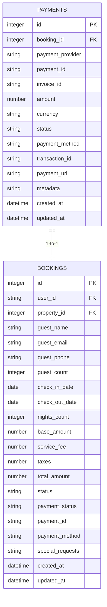
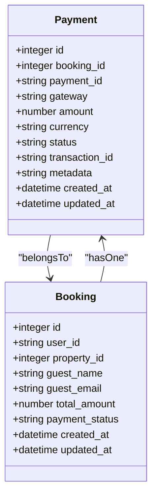
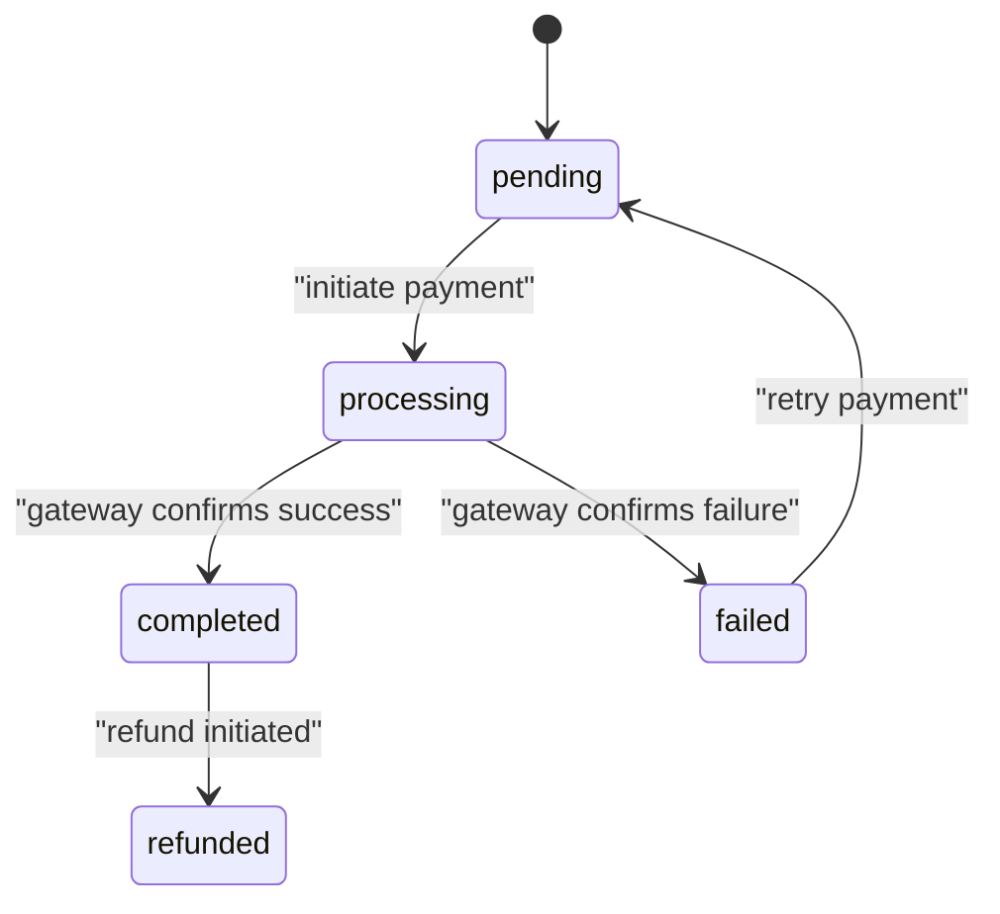
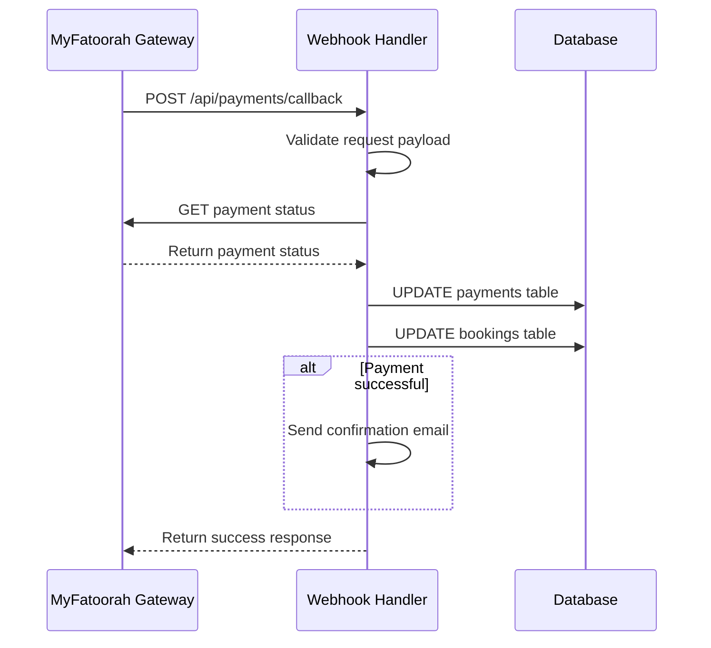
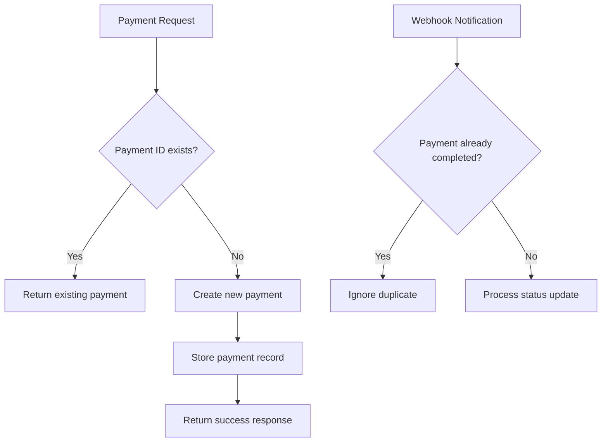
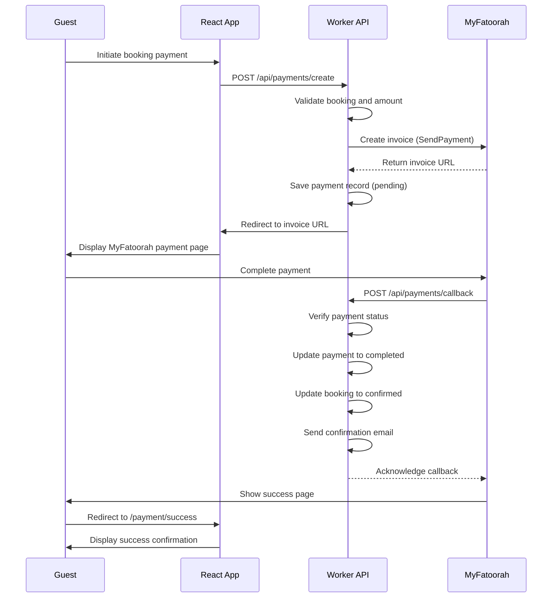
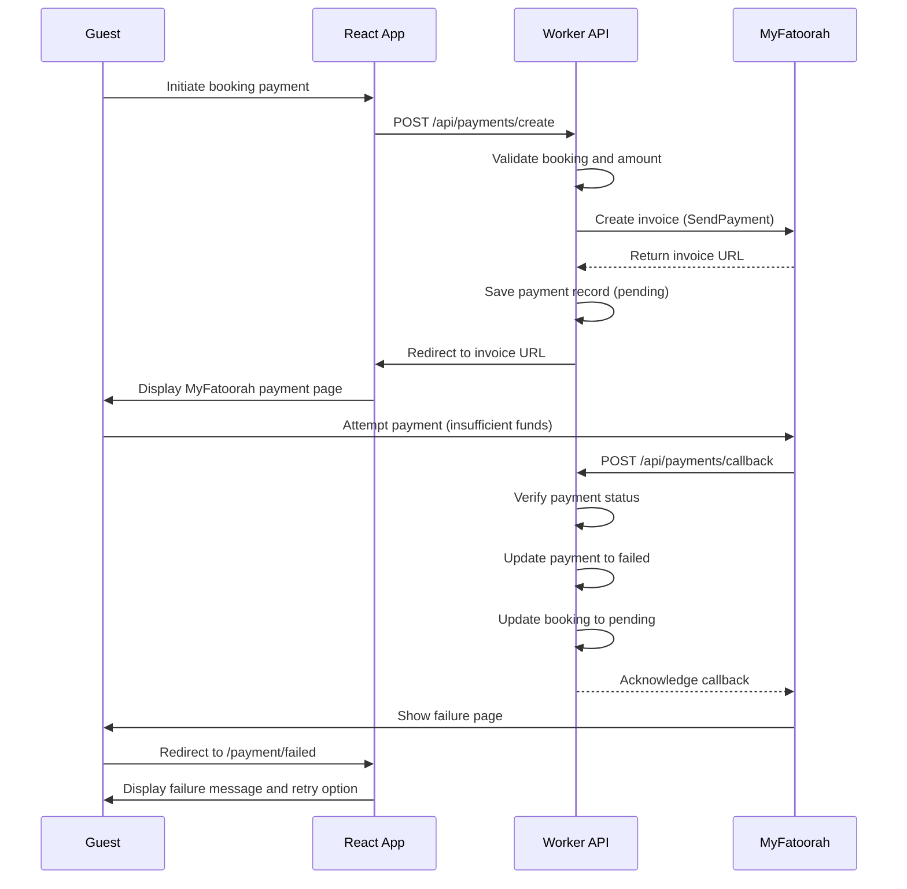
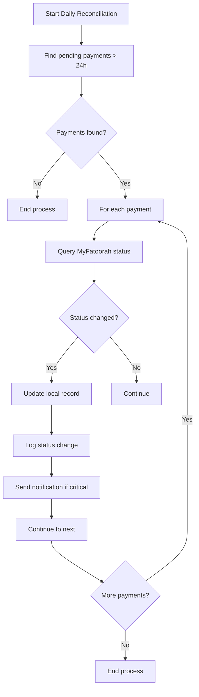

# Payment Model

<cite>
**Referenced Files in This Document**   
- [types.ts](file://src/shared/types.ts#L200-L250)
- [payment.ts](file://src/shared/payment.ts#L0-L165)
- [index.ts](file://src/worker/index.ts#L1078-L1174)
- [1.sql](file://migrations/1.sql#L100-L130)
</cite>

## Table of Contents
1. [Payment Model Overview](#payment-model-overview)
2. [Database Schema and Relationships](#database-schema-and-relationships)
3. [Payment Status Lifecycle](#payment-status-lifecycle)
4. [External Payment Gateway Integration](#external-payment-gateway-integration)
5. [Webhook Handling and Asynchronous Updates](#webhook-handling-and-asynchronous-updates)
6. [Idempotency and Duplicate Prevention](#idempotency-and-duplicate-prevention)
7. [Validation Rules and Constraints](#validation-rules-and-constraints)
8. [Payment Flows](#payment-flows)
9. [Reconciliation Processes](#reconciliation-processes)

## Payment Model Overview

The Payment model represents a financial transaction associated with a booking in the HabibiStay system. It serves as the central entity for managing payment lifecycle, integrating with external payment gateways, and maintaining transactional integrity.

**Key Fields:**
- **id**: Unique identifier for the payment record
- **booking_id**: Reference to the associated booking
- **amount**: Transaction amount in numeric format
- **currency**: Currency code (default: SAR)
- **status**: Current state of the payment (pending, processing, completed, failed, refunded)
- **transaction_id**: External transaction identifier from the payment gateway
- **provider**: Payment gateway provider (MyFatoorah)
- **timestamps**: created_at and updated_at for audit and tracking

The model ensures data consistency through database constraints and application-level validation. It maintains a one-to-one relationship with the Booking entity, ensuring each booking has exactly one payment record.



**Diagram sources**
- [1.sql](file://migrations/1.sql#L100-L130)

**Section sources**
- [types.ts](file://src/shared/types.ts#L200-L250)
- [1.sql](file://migrations/1.sql#L100-L130)

## Database Schema and Relationships

The Payment entity is implemented as a relational database table with strict constraints to ensure data integrity and enforce business rules.

**Table Definition:**
```sql
CREATE TABLE payments (
  id INTEGER PRIMARY KEY AUTOINCREMENT,
  booking_id INTEGER NOT NULL,
  payment_id TEXT UNIQUE NOT NULL,
  gateway TEXT NOT NULL CHECK (gateway IN ('myfatoorah', 'paypal', 'stripe')),
  amount REAL NOT NULL,
  currency TEXT DEFAULT 'SAR',
  status TEXT DEFAULT 'pending' CHECK (status IN ('pending', 'processing', 'completed', 'failed', 'refunded')),
  gateway_response TEXT,
  created_at DATETIME DEFAULT CURRENT_TIMESTAMP,
  updated_at DATETIME DEFAULT CURRENT_TIMESTAMP,
  FOREIGN KEY (booking_id) REFERENCES bookings(id)
);
```

**Key Constraints:**
- **Primary Key**: `id` - Auto-incrementing integer
- **Foreign Key**: `booking_id` references `bookings.id` with cascading integrity
- **Unique Constraint**: `payment_id` ensures each payment has a unique identifier
- **Check Constraints**: 
  - `gateway` restricted to supported providers (myfatoorah, paypal, stripe)
  - `status` restricted to defined states (pending, processing, completed, failed, refunded)
  - `amount` must be positive

**One-to-One Relationship with Booking:**
The Payment entity maintains a strict one-to-one relationship with the Booking entity. This is enforced through:
1. Foreign key constraint from `payments.booking_id` to `bookings.id`
2. Application logic that creates a payment record when a booking is created
3. Atomic updates that synchronize payment and booking statuses



**Diagram sources**
- [1.sql](file://migrations/1.sql#L100-L130)

**Section sources**
- [1.sql](file://migrations/1.sql#L100-L130)

## Payment Status Lifecycle

The Payment entity implements a state machine pattern with well-defined status transitions that ensure data consistency and prevent invalid state changes.

**Status States:**
- **pending**: Initial state when payment is created but not yet processed
- **processing**: Payment is being processed by the external gateway
- **completed**: Payment successfully completed and funds are secured
- **failed**: Payment attempt failed due to insufficient funds, declined card, etc.
- **refunded**: Payment was successfully completed but has been refunded

**State Transition Rules:**
- `pending` → `processing` → `completed` (successful flow)
- `pending` → `processing` → `failed` (unsuccessful flow)
- `completed` → `refunded` (refund flow)
- No backward transitions allowed (e.g., cannot go from `completed` to `pending`)

**Atomic State Changes:**
All payment state changes are atomic and occur within a single transaction to ensure consistency between the Payment and Booking entities. When a payment status changes, the corresponding booking status is updated simultaneously:



**Section sources**
- [types.ts](file://src/shared/types.ts#L420-L460)
- [1.sql](file://migrations/1.sql#L100-L130)

## External Payment Gateway Integration

The system integrates with MyFatoorah as the primary payment gateway through a dedicated service layer that handles all external communication.

**Integration Architecture:**
- **MyFatoorahService Class**: Encapsulates all interactions with the MyFatoorah API
- **Environment Configuration**: API key and base URL injected via environment variables
- **HTTP Client**: Fetch-based implementation with proper error handling
- **Request/Response Validation**: Zod schemas for all API contracts

**Key Integration Points:**
1. **Invoice Creation**: Initiates a payment request with MyFatoorah
2. **Status Verification**: Checks the status of a payment or invoice
3. **Payment Processing**: Handles the complete payment workflow

```typescript
export class MyFatoorahService {
  private apiKey: string;
  private baseUrl: string;
  
  constructor(apiKey: string, baseUrl: string = 'https://apitest.myfatoorah.com') {
    this.apiKey = apiKey;
    this.baseUrl = baseUrl;
  }
  
  async createInvoice(paymentData: PaymentRequest): Promise<MyFatoorahCreateInvoiceResponse> {
    return this.makeRequest('/v2/SendPayment', 'POST', paymentData);
  }
  
  async getPaymentStatus(paymentId: string): Promise<MyFatoorahPaymentStatusResponse> {
    return this.makeRequest(`/v2/getPaymentStatus`, 'POST', {
      Key: paymentId,
      KeyType: 'PaymentId'
    });
  }
}
```

**Payment Request Schema:**
```typescript
export const PaymentRequestSchema = z.object({
  InvoiceAmount: z.number().positive(),
  CurrencyIso: z.string().default('SAR'),
  CustomerName: z.string(),
  CustomerEmail: z.string().email(),
  CallBackUrl: z.string().url(),
  ErrorUrl: z.string().url(),
});
```

**Diagram sources**
- [payment.ts](file://src/shared/payment.ts#L0-L60)

**Section sources**
- [payment.ts](file://src/shared/payment.ts#L0-L165)

## Webhook Handling and Asynchronous Updates

The system implements a webhook endpoint to receive asynchronous payment status updates from MyFatoorah, ensuring payment states are accurately reflected even when users don't complete the browser redirect flow.

**Webhook Endpoint:**
- **Route**: `POST /api/payments/callback`
- **Validation**: Uses Zod schema to validate incoming payload
- **Idempotency**: Handles duplicate notifications safely
- **Atomic Updates**: Updates both payment and booking records in a consistent manner

**Processing Flow:**
1. Receive payment identifier (paymentId, Id, or InvoiceId)
2. Query MyFatoorah API for current payment status
3. Update local payment record with latest status and transaction details
4. Update associated booking status accordingly
5. Send confirmation email for successful payments



**Code Implementation:**
```typescript
app.post("/api/payments/callback", zValidator("json", PaymentCallbackSchema), async (c) => {
  const { paymentId, Id, InvoiceId } = c.req.valid("json");
  const keyToUse = paymentId || Id || InvoiceId;
  
  // Get payment status from MyFatoorah
  const statusResponse = await myfatoorah.getPaymentStatus(keyToUse);
  
  if (statusResponse.IsSuccess) {
    const paymentData = statusResponse.Data;
    const isSuccessful = paymentData.InvoiceStatus === 'Paid';
    
    // Update payment status
    await c.env.DB.prepare(`
      UPDATE payments SET 
        status = ?, 
        transaction_id = ?,
        payment_method = ?,
        metadata = ?,
        updated_at = CURRENT_TIMESTAMP
      WHERE id = ?
    `).run();
    
    // Update booking status atomically
    await c.env.DB.prepare(`
      UPDATE bookings SET 
        status = ?, 
        payment_status = ?,
        updated_at = CURRENT_TIMESTAMP
      WHERE id = ?
    `).run();
  }
});
```

**Diagram sources**
- [index.ts](file://src/worker/index.ts#L1078-L1174)

**Section sources**
- [index.ts](file://src/worker/index.ts#L1078-L1174)

## Idempotency and Duplicate Prevention

The payment system implements multiple layers of idempotency to prevent duplicate processing of payments, ensuring financial integrity.

**Idempotency Mechanisms:**

1. **Database Constraints**:
   - Unique constraint on `payment_id` field
   - Foreign key relationship with Booking ensures one-to-one mapping

2. **Application-Level Checks**:
   - Payment creation endpoint verifies booking doesn't already have a payment
   - Webhook handler checks existing payment status before updating

3. **Idempotency Key Pattern**:
   - Each payment request can include an idempotency key
   - Server tracks processed requests by key to prevent duplicates
   - Returns the original response for duplicate keys

**Duplicate Prevention Flow:**


**Key Implementation Details:**
- The `payment_id` field from MyFatoorah is stored and used as a unique identifier
- The webhook handler first checks if a payment record already exists before creating updates
- Status transitions are designed to be idempotent (multiple updates to the same state have the same effect)

**Section sources**
- [index.ts](file://src/worker/index.ts#L1078-L1174)
- [payment.ts](file://src/shared/payment.ts#L0-L165)

## Validation Rules and Constraints

The Payment model implements comprehensive validation at multiple levels to ensure data quality and business rule compliance.

**Schema Validation (Zod):**
```typescript
export const EnhancedPaymentSchema = z.object({
  id: z.number(),
  booking_id: z.number(),
  payment_id: z.string(),
  gateway: z.enum(['myfatoorah', 'paypal', 'stripe']),
  amount: z.number(),
  currency: z.string(),
  status: z.enum(['pending', 'processing', 'completed', 'failed', 'refunded']),
  created_at: z.string(),
  updated_at: z.string(),
});
```

**Key Validation Rules:**
- **Amount Validation**: Must be a positive number
- **Currency Validation**: Must be a supported currency code (SAR, USD, EUR, GBP)
- **Status Validation**: Restricted to predefined states
- **Gateway Validation**: Limited to supported providers
- **Required Fields**: booking_id, payment_id, amount, and gateway are mandatory

**Business Rule Constraints:**
- Payment amount must match the booking total amount
- Currency must be consistent between payment and booking
- Payment cannot be created for cancelled bookings
- Only pending payments can be retried

**Error Handling:**
- Validation errors return 400 Bad Request with specific error messages
- Server errors return 500 Internal Server Error
- Payment-specific errors include descriptive messages for troubleshooting

**Section sources**
- [types.ts](file://src/shared/types.ts#L420-L460)
- [payment.ts](file://src/shared/payment.ts#L0-L40)

## Payment Flows

### Successful Payment Flow


### Failed Payment Flow


**Section sources**
- [index.ts](file://src/worker/index.ts#L1078-L1174)
- [payment.ts](file://src/shared/payment.ts#L0-L165)

## Reconciliation Processes

The payment system includes reconciliation mechanisms to ensure data consistency between internal records and external payment gateway records.

**Daily Reconciliation Process:**
1. Query all payments with status 'pending' for more than 24 hours
2. Verify status with MyFatoorah API
3. Update local records with actual status
4. Log discrepancies for manual review

**Automated Reconciliation Flow:**


**Key Reconciliation Features:**
- **Status Verification**: Regular polling of external gateway for pending payments
- **Discrepancy Logging**: Records any differences between internal and external states
- **Notification System**: Alerts administrators of significant discrepancies
- **Manual Override**: Admin interface to resolve reconciliation issues

**Data Integrity Checks:**
- Total payment amounts should match booking totals
- Payment currency should match booking currency
- Transaction timestamps should be consistent across systems
- Refund amounts should not exceed original payment

**Section sources**
- [index.ts](file://src/worker/index.ts#L1078-L1174)
- [payment.ts](file://src/shared/payment.ts#L0-L165)