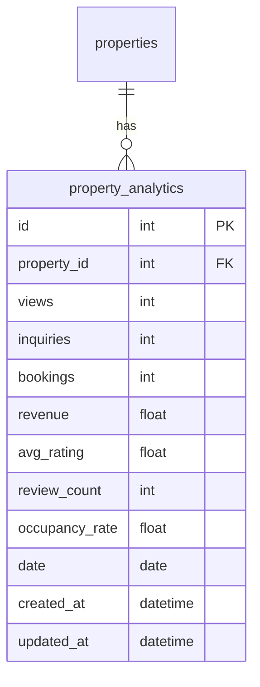
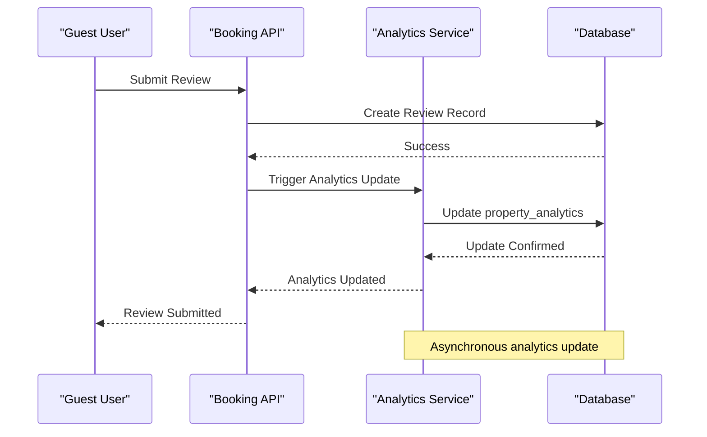
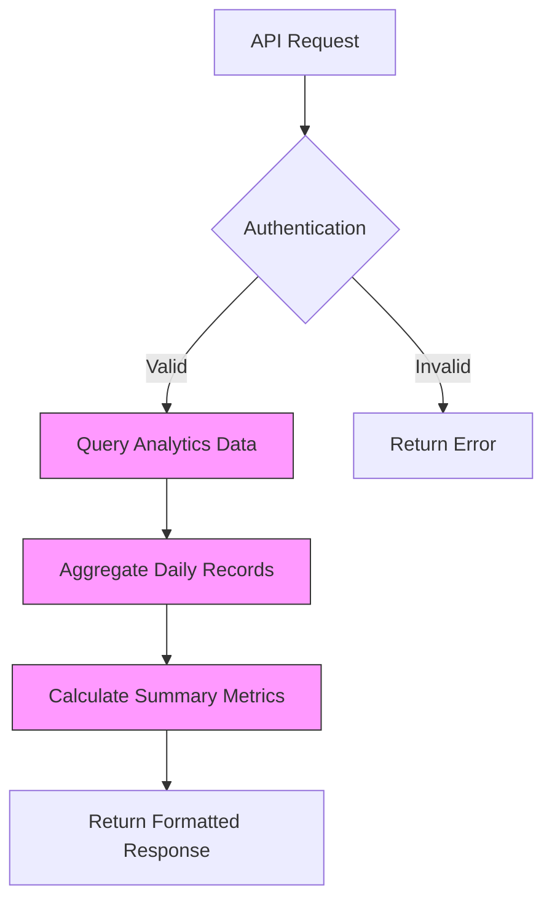
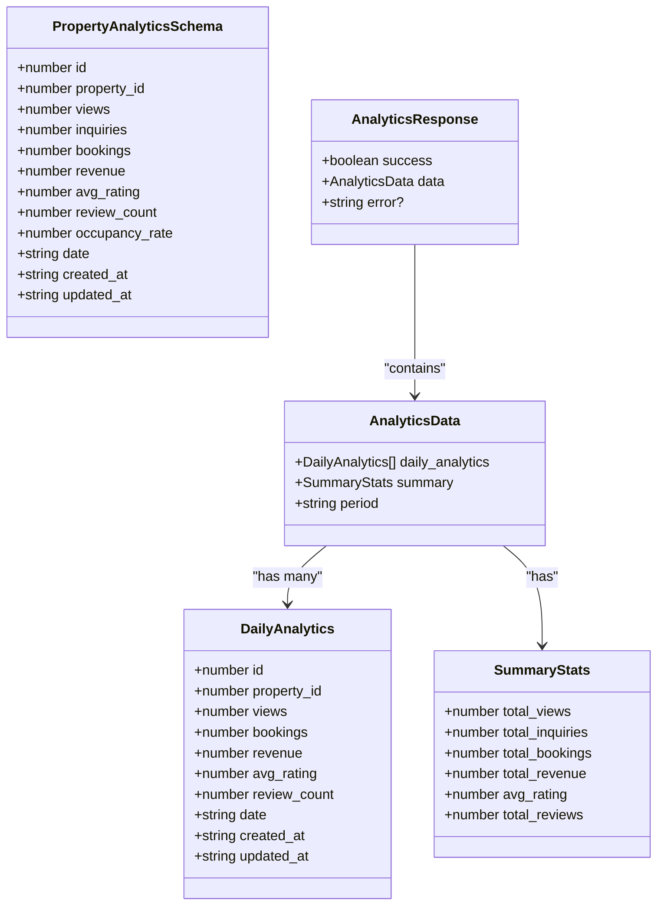
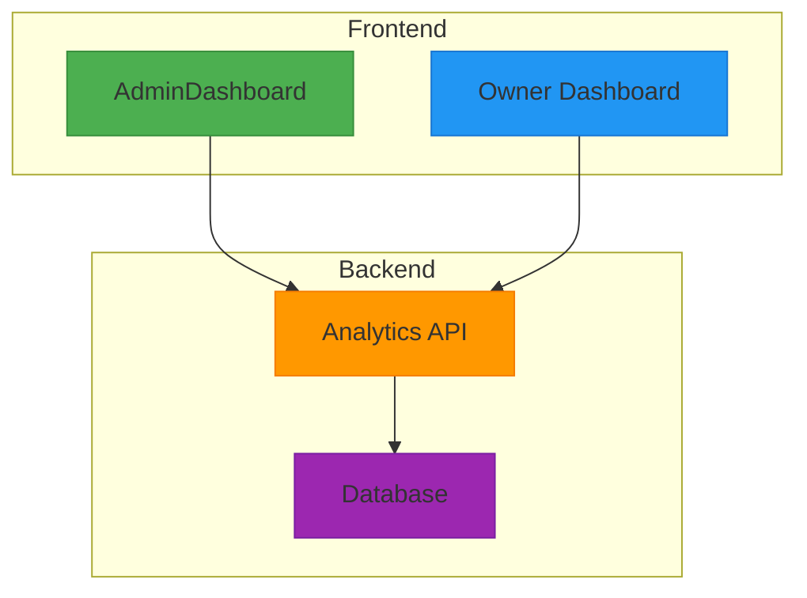
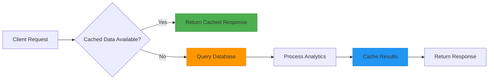

# Property Analytics Model

<cite>
**Referenced Files in This Document**   
- [migrations/5.sql](file://migrations/5.sql#L23-L37)
- [src/shared/types.ts](file://src/shared/types.ts#L168-L200)
- [src/worker/index.ts](file://src/worker/index.ts#L1211-L1410)
- [src/worker/index.ts](file://src/worker/index.ts#L1410-L1609)
- [src/react-app/pages/AdminDashboard.tsx](file://src/react-app/pages/AdminDashboard.tsx#L0-L578)
- [src/react-app/pages/Dashboard.tsx](file://src/react-app/pages/Dashboard.tsx#L0-L484)
</cite>

## Table of Contents
1. [Introduction](#introduction)
2. [Property Analytics Data Model](#property-analytics-data-model)
3. [Analytics Update Mechanism](#analytics-update-mechanism)
4. [Read-Optimized Design](#read-optimized-design)
5. [Aggregation Strategies](#aggregation-strategies)
6. [Analytics Interfaces](#analytics-interfaces)
7. [Data Access Patterns](#data-access-patterns)
8. [Performance Considerations](#performance-considerations)
9. [Data Retention Policies](#data-retention-policies)

## Introduction
The Property Analytics Model in HabibiStay is designed to track and measure the performance of rental properties across various metrics. This model captures key performance indicators such as views, bookings, revenue, and ratings, providing valuable insights to both property owners and administrators. The analytics system is built to support asynchronous updates triggered by user interactions and background jobs, ensuring data consistency while maintaining optimal performance for dashboard displays. This document details the structure, functionality, and implementation of the property analytics system, including its integration with the frontend interfaces and performance optimization strategies.

## Property Analytics Data Model
The property analytics data model is implemented as a dedicated table that captures daily performance metrics for each property. The model is designed to support time-series analysis and trend tracking over time.



**Diagram sources**
- [migrations/5.sql](file://migrations/5.sql#L23-L37)

The property_analytics table contains the following fields:

- **id**: Primary key identifier for the analytics record
- **property_id**: Foreign key reference to the properties table
- **views**: Count of property view events
- **inquiries**: Count of inquiry or contact form submissions
- **bookings**: Count of confirmed bookings
- **revenue**: Total revenue generated (in SAR)
- **avg_rating**: Average rating from guest reviews
- **review_count**: Number of reviews received
- **occupancy_rate**: Percentage of available nights occupied
- **date**: Date of the analytics record (enables daily aggregation)
- **created_at**: Timestamp of record creation
- **updated_at**: Timestamp of last record update

The model uses a daily granularity approach, with one record per property per day. This design enables efficient time-series analysis and trend identification while keeping the data structure simple and query-efficient.

**Section sources**
- [migrations/5.sql](file://migrations/5.sql#L23-L37)
- [src/shared/types.ts](file://src/shared/types.ts#L168-L200)

## Analytics Update Mechanism
The analytics system updates metrics asynchronously through triggers and background jobs that respond to key user actions such as bookings and reviews. This event-driven architecture ensures data consistency while decoupling analytics updates from user-facing operations.



**Diagram sources**
- [src/worker/index.ts](file://src/worker/index.ts#L1410-L1609)

When a guest submits a review, the system processes the review and then updates the corresponding property analytics. The update logic handles both new reviews and rating adjustments:

```typescript
// Update property analytics with new review
const today = new Date().toISOString().split('T')[0];
await c.env.DB.prepare(`
  INSERT INTO property_analytics (property_id, review_count, avg_rating, date) 
  VALUES (?, 1, ?, ?)
  ON CONFLICT(property_id, date) 
  DO UPDATE SET 
    review_count = review_count + 1,
    avg_rating = (avg_rating * (review_count - 1) + ?) / review_count,
    updated_at = CURRENT_TIMESTAMP
`).bind(property_id, rating, today, rating).run();
```

This upsert operation uses SQLite's ON CONFLICT clause to either insert a new daily record or update an existing one. The average rating calculation uses a weighted formula that incorporates the new rating while maintaining historical accuracy.

For booking events, the analytics system updates the bookings and revenue metrics. Although the specific booking trigger code is not visible in the provided files, the data model suggests similar upsert logic would be applied to increment the bookings counter and add to the revenue total for the relevant date.

The authentication middleware ensures that only authorized users (property owners or administrators) can access analytics data, maintaining data privacy and security.

**Section sources**
- [src/worker/index.ts](file://src/worker/index.ts#L1410-L1609)

## Read-Optimized Design
The property analytics model is designed with read optimization in mind, particularly for dashboard displays that require quick access to performance metrics. The design prioritizes fast retrieval of aggregated data for visualization purposes.



**Diagram sources**
- [src/worker/index.ts](file://src/worker/index.ts#L1211-L1410)

The API endpoint `/api/properties/:id/analytics` implements a read-optimized query pattern that retrieves both detailed daily analytics and pre-aggregated summary statistics in a single request:

```typescript
const [analytics, totalStats] = await Promise.all([
  c.env.DB.prepare(`
    SELECT * FROM property_analytics 
    WHERE property_id = ? AND date >= ?
    ORDER BY date DESC
  `).bind(propertyId, thirtyDaysAgo).all(),
  c.env.DB.prepare(`
    SELECT 
      SUM(views) as total_views,
      SUM(inquiries) as total_inquiries,
      SUM(bookings) as total_bookings,
      SUM(revenue) as total_revenue,
      AVG(avg_rating) as avg_rating,
      SUM(review_count) as total_reviews
    FROM property_analytics 
    WHERE property_id = ?
  `).bind(propertyId).first()
]);
```

This approach minimizes database round-trips by using Promise.all to execute both queries concurrently. The first query retrieves daily analytics for the last 30 days, while the second calculates lifetime summary statistics. The response combines both datasets, providing clients with comprehensive analytics data in a single API call.

The query for daily analytics includes a date filter (`date >= ?`) and orders results by date in descending order, optimizing for the most common use case of viewing recent performance. The summary query uses aggregate functions (SUM, AVG) to calculate totals across all available data.

**Section sources**
- [src/worker/index.ts](file://src/worker/index.ts#L1211-L1410)

## Aggregation Strategies
The property analytics system employs multiple aggregation strategies to support different reporting needs and performance requirements. These strategies balance data granularity with query efficiency.

The primary aggregation strategy is daily aggregation, where metrics are collected and stored at the day level. This approach provides sufficient granularity for trend analysis while keeping the dataset size manageable. For longer-term analysis, the system can aggregate daily data into weekly or monthly summaries.

The analytics API implements server-side aggregation for summary statistics, calculating totals and averages directly in the database query:

```sql
SELECT 
  SUM(views) as total_views,
  SUM(inquiries) as total_inquiries,
  SUM(bookings) as total_bookings,
  SUM(revenue) as total_revenue,
  AVG(avg_rating) as avg_rating,
  SUM(review_count) as total_reviews
FROM property_analytics 
WHERE property_id = ?
```

This strategy offloads computation to the database, which is optimized for such operations and can leverage indexes for improved performance. The use of SQL aggregate functions ensures accurate calculations even with large datasets.

For time-based aggregations, the system can filter data by date ranges. The current implementation supports a 30-day view, but the design allows for flexible date filtering to support different reporting periods (e.g., weekly, monthly, quarterly).

The data model also supports incremental aggregation through the use of upsert operations. When new events occur, the system updates existing daily records rather than creating new ones, ensuring that aggregations remain current without requiring full recalculations.

These aggregation strategies enable the system to provide both detailed daily insights and high-level performance summaries, catering to different user needs and analytical requirements.

## Analytics Interfaces
The property analytics data is exposed through TypeScript interfaces that define the structure of the analytics data for type safety and consistency across the application.



**Diagram sources**
- [src/shared/types.ts](file://src/shared/types.ts#L168-L200)

The `PropertyAnalyticsSchema` defined in types.ts provides a Zod schema for validating analytics data:

```typescript
export const PropertyAnalyticsSchema = z.object({
  id: z.number(),
  property_id: z.number(),
  views: z.number(),
  inquiries: z.number(),
  bookings: z.number(),
  revenue: z.number(),
  avg_rating: z.number(),
  review_count: z.number(),
  occupancy_rate: z.number(),
  date: z.string(),
  created_at: z.string(),
  updated_at: z.string(),
});
```

This schema ensures that analytics data conforms to the expected structure and data types throughout the application. The use of Zod provides runtime type checking and validation, preventing type-related errors.

The analytics response structure includes both detailed daily analytics and aggregated summary statistics, providing a comprehensive view of property performance. This design reduces the number of API calls needed to retrieve complete analytics information.

The interfaces support the various consumer needs, from detailed daily analysis to high-level performance summaries, ensuring that both property owners and administrators have access to the metrics that matter most to them.

**Section sources**
- [src/shared/types.ts](file://src/shared/types.ts#L168-L200)

## Data Access Patterns
The property analytics data is accessed by both the AdminDashboard and owner views through dedicated API endpoints, with different access patterns reflecting the distinct needs of these user roles.



**Diagram sources**
- [src/react-app/pages/AdminDashboard.tsx](file://src/react-app/pages/AdminDashboard.tsx#L0-L578)
- [src/react-app/pages/Dashboard.tsx](file://src/react-app/pages/Dashboard.tsx#L0-L484)

The AdminDashboard accesses analytics data through the `/api/admin/stats` endpoint, which provides aggregated platform-wide metrics:

```typescript
interface AdminStats {
  total_users: number;
  total_properties: number;
  total_bookings: number;
  total_revenue: number;
  pending_bookings: number;
  active_properties: number;
  monthly_growth: number;
  occupancy_rate: number;
}
```

These metrics are displayed in a comprehensive overview dashboard that provides administrators with insights into the overall health and performance of the platform.

Property owners access their analytics through the `/api/properties/:id/analytics` endpoint, which returns property-specific performance data. The owner dashboard displays key metrics such as earnings, completed bookings, and average rating:

```typescript
const totalEarnings = bookings
  .filter(b => b.status === 'completed')
  .reduce((sum, b) => sum + b.total_amount, 0);

const completedBookings = bookings.filter(b => b.status === 'completed').length;
const averageRating = 4.8; // This would come from reviews in real implementation
```

The owner view focuses on financial performance and guest satisfaction metrics that are most relevant to property management. The dashboard presents these metrics in an easily digestible format with visual indicators of performance trends.

Both interfaces implement similar patterns for data retrieval, using useEffect hooks to fetch data when the component mounts and displaying loading states during retrieval. The authentication system ensures that users can only access analytics data for properties they own or have administrative access to.

**Section sources**
- [src/react-app/pages/AdminDashboard.tsx](file://src/react-app/pages/AdminDashboard.tsx#L0-L578)
- [src/react-app/pages/Dashboard.tsx](file://src/react-app/pages/Dashboard.tsx#L0-L484)

## Performance Considerations
The property analytics system incorporates several performance optimizations to ensure responsive dashboard displays and efficient data processing, particularly when handling real-time versus cached metrics.

For real-time metrics, the system uses asynchronous updates to avoid blocking user operations. When a booking is confirmed or a review is submitted, the analytics update occurs in the background, ensuring that the primary user action completes quickly. This decoupling prevents analytics processing from impacting the user experience.

The read operations are optimized through strategic indexing and query design. Although specific indexes are not visible in the provided migration files, best practices suggest that indexes on property_id and date columns would significantly improve query performance for the most common access patterns.



For high-frequency dashboard views, implementing a caching layer would further improve performance. The current implementation could be enhanced with Redis or a similar in-memory store to cache frequently accessed analytics data, reducing database load and improving response times.

The API design minimizes round-trips by returning both detailed and summary data in a single response. This approach reduces network overhead and improves perceived performance, especially on mobile connections.

The system also considers performance in its data aggregation strategy. By pre-aggregating metrics at the daily level, the system reduces the computational overhead of calculating statistics on-the-fly. This design choice trades storage space for query performance, a common optimization in analytics systems.

For large datasets, the system could implement additional optimizations such as materialized views for common aggregations or partitioning the analytics table by date range to improve query performance on historical data.

## Data Retention Policies
The property analytics system does not have explicit data retention policies defined in the provided code, but the current implementation suggests a long-term retention approach that preserves historical performance data.

The analytics model is designed to maintain daily records indefinitely, allowing for comprehensive historical analysis and trend identification over extended periods. This approach supports business intelligence needs by preserving the complete performance history of each property.

The use of a daily granularity model creates a predictable data growth pattern, with one record added per property per day. For a platform with thousands of properties, this could result in millions of records over several years, necessitating appropriate database scaling and optimization strategies.

While the current implementation appears to retain all analytics data, a production system would likely implement data retention policies to manage storage costs and query performance. Potential retention strategies could include:

- Tiered storage: Moving older data to cheaper, slower storage while keeping recent data on high-performance storage
- Data aggregation: Converting detailed daily records to weekly or monthly summaries after a certain period
- Archival: Moving historical data to archive tables or separate databases
- Purging: Removing data older than a specified period (e.g., 5 years) in compliance with data protection regulations

The absence of explicit retention policies in the code suggests that data is currently retained indefinitely, which maximizes analytical capabilities but may require monitoring of storage usage and query performance as the dataset grows over time.

The system's design supports future implementation of retention policies through the use of standard SQL operations that could be scheduled as periodic maintenance tasks.