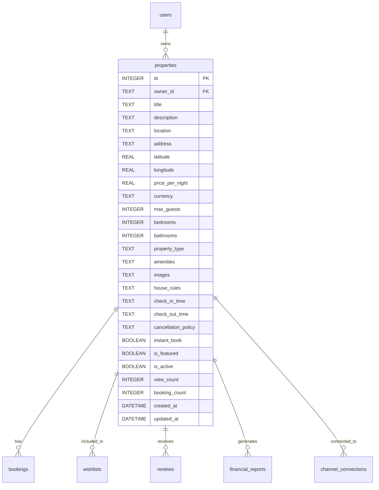
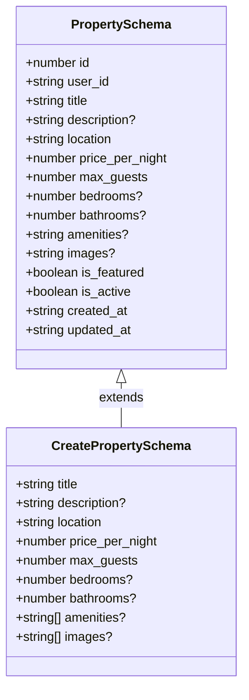
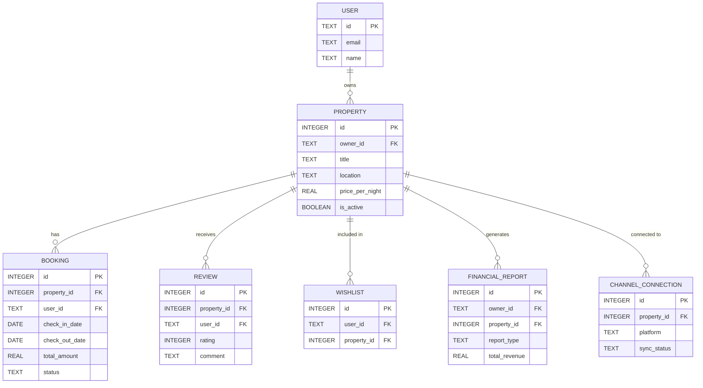
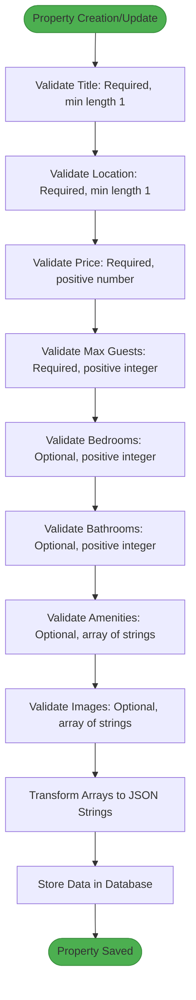
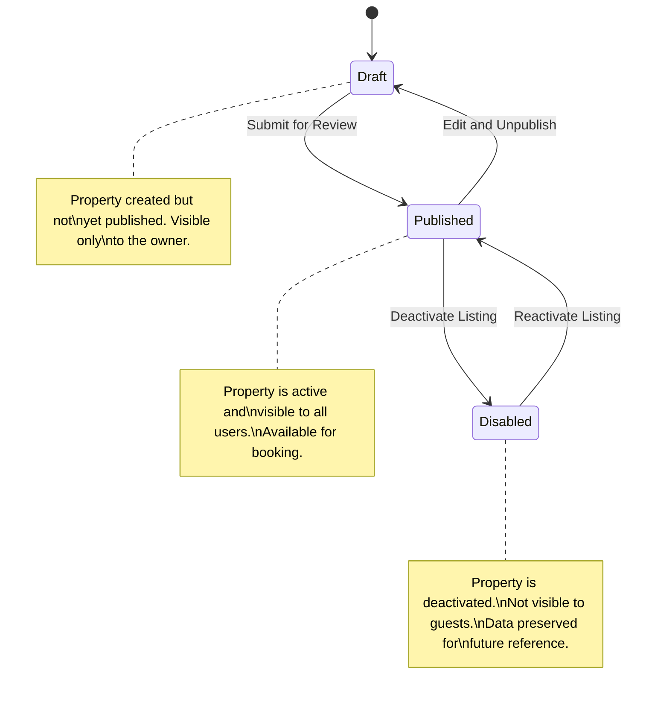
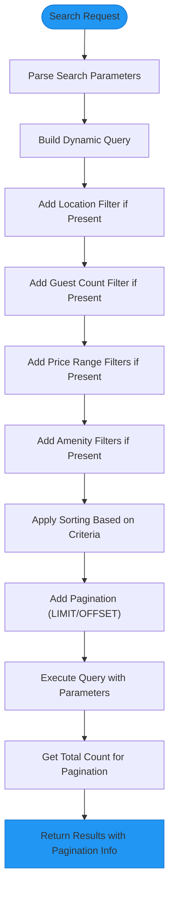

# Property Model

<cite>
**Referenced Files in This Document**   
- [1.sql](file://migrations/1.sql#L9-L44)
- [types.ts](file://src/shared/types.ts#L3-L31)
- [index.ts](file://src/worker/index.ts#L300-L350)
- [index.ts](file://src/worker/index.ts#L897-L945)
</cite>

## Table of Contents
1. [Property Entity Overview](#property-entity-overview)
2. [Database Schema](#database-schema)
3. [TypeScript Interface](#typescript-interface)
4. [Field Details](#field-details)
5. [Relationships](#relationships)
6. [Validation Rules](#validation-rules)
7. [Status Management](#status-management)
8. [Query Performance](#query-performance)
9. [Sample Records](#sample-records)

## Property Entity Overview

The Property entity represents a rental property listing in the HabibiStay platform. It contains comprehensive information about accommodations available for booking, including descriptive details, pricing, capacity, amenities, and status. The model supports the core functionality of the platform, enabling hosts to list properties and guests to search, view, and book accommodations.

**Section sources**
- [1.sql](file://migrations/1.sql#L9-L44)
- [types.ts](file://src/shared/types.ts#L3-L31)

## Database Schema

The Property table is defined in the initial migration file with a comprehensive schema that supports all aspects of property management. The schema includes fields for basic information, pricing, capacity, location, media, and operational status.



**Diagram sources**
- [1.sql](file://migrations/1.sql#L9-L44)

## TypeScript Interface

The Property entity is represented in TypeScript through Zod schemas that define both the complete entity structure and validation rules for creation and updates. These schemas ensure type safety and data integrity across the application.



**Diagram sources**
- [types.ts](file://src/shared/types.ts#L3-L31)

## Field Details

### Core Identification Fields
- **id**: Unique identifier for the property (INTEGER PRIMARY KEY AUTOINCREMENT)
- **owner_id**: Reference to the User who owns the property (TEXT NOT NULL, FOREIGN KEY to users.id)
- **title**: Descriptive title of the property (TEXT NOT NULL)
- **description**: Detailed description of the property and its features (TEXT)

### Location and Address Fields
- **location**: General location or neighborhood (TEXT NOT NULL)
- **address**: Full street address (TEXT)
- **latitude**: Geographic latitude coordinate (REAL)
- **longitude**: Geographic longitude coordinate (REAL)

### Pricing and Capacity Fields
- **price_per_night**: Base price per night in the specified currency (REAL NOT NULL)
- **currency**: Currency code (TEXT DEFAULT 'SAR')
- **max_guests**: Maximum number of guests allowed (INTEGER NOT NULL)
- **bedrooms**: Number of bedrooms (INTEGER DEFAULT 1)
- **bathrooms**: Number of bathrooms (INTEGER DEFAULT 1)

### Property Features and Amenities
- **property_type**: Type of property (e.g., apartment, house, villa) (TEXT)
- **amenities**: JSON array of amenities (TEXT)
- **images**: JSON array of image URLs (TEXT)
- **house_rules**: Special rules for guests (TEXT)

### Booking Configuration
- **check_in_time**: Standard check-in time (TEXT DEFAULT '15:00')
- **check_out_time**: Standard check-out time (TEXT DEFAULT '11:00')
- **cancellation_policy**: Policy for cancellations (TEXT DEFAULT 'moderate')
- **instant_book**: Whether guests can book without approval (BOOLEAN DEFAULT 0)

### Status and Analytics
- **is_featured**: Whether the property is featured (BOOLEAN DEFAULT 0)
- **is_active**: Whether the property is currently active/listed (BOOLEAN DEFAULT 1)
- **view_count**: Number of times the property has been viewed (INTEGER DEFAULT 0)
- **booking_count**: Number of successful bookings (INTEGER DEFAULT 0)

### Timestamps
- **created_at**: When the property was created (DATETIME DEFAULT CURRENT_TIMESTAMP)
- **updated_at**: When the property was last updated (DATETIME DEFAULT CURRENT_TIMESTAMP)

**Section sources**
- [1.sql](file://migrations/1.sql#L9-L44)
- [types.ts](file://src/shared/types.ts#L3-L31)

## Relationships

The Property entity has several important relationships with other entities in the system:



**Diagram sources**
- [1.sql](file://migrations/1.sql#L9-L44)
- [1.sql](file://migrations/1.sql#L46-L74)
- [1.sql](file://migrations/1.sql#L76-L100)
- [1.sql](file://migrations/1.sql#L179-L213)

### User (Owner) Relationship
The Property entity has a many-to-one relationship with the User entity, where each property is owned by a single user, but a user can own multiple properties. This relationship is established through the `owner_id` foreign key that references the `users.id` field.

### Bookings Relationship
Each property can have multiple bookings, creating a one-to-many relationship. The `bookings` table contains a `property_id` foreign key that references the `properties.id` field, allowing the system to track all bookings associated with a specific property.

### Reviews Relationship
Properties receive reviews from guests, establishing a one-to-many relationship. The `reviews` table contains a `property_id` foreign key that references the `properties.id` field, enabling the aggregation of ratings and comments for each property.

### Wishlist Relationship
Users can add properties to their wishlist, creating a many-to-many relationship between users and properties. This is implemented through the `wishlists` junction table that contains both `user_id` and `property_id` foreign keys.

**Section sources**
- [1.sql](file://migrations/1.sql#L9-L44)
- [1.sql](file://migrations/1.sql#L46-L74)
- [1.sql](file://migrations/1.sql#L76-L100)

## Validation Rules

The system implements comprehensive validation rules for property data using Zod schemas in the shared types file. These rules are enforced both on the client-side and server-side to ensure data integrity.



**Diagram sources**
- [types.ts](file://src/shared/types.ts#L21-L31)
- [index.ts](file://src/worker/index.ts#L300-L350)

### Creation Validation
When creating a new property, the system validates the following fields:
- **title**: Must be a string with minimum length of 1 character
- **location**: Must be a string with minimum length of 1 character
- **price_per_night**: Must be a positive number
- **max_guests**: Must be a positive integer
- **bedrooms**: Optional, must be a positive integer if provided
- **bathrooms**: Optional, must be a positive integer if provided
- **amenities**: Optional, must be an array of strings if provided
- **images**: Optional, must be an array of strings if provided

### Data Transformation
During property creation and updates, array fields (amenities and images) are transformed from arrays to JSON strings for storage in the database. This transformation occurs in the worker endpoint:

```typescript
amenities ? JSON.stringify(data.amenities) : null,
images ? JSON.stringify(data.images) : null
```

**Section sources**
- [types.ts](file://src/shared/types.ts#L21-L31)
- [index.ts](file://src/worker/index.ts#L300-L350)

## Status Management

The Property entity uses an `is_active` boolean field to manage the publication status of properties. This field enables a soft-delete pattern where properties can be deactivated without being permanently removed from the database.



**Diagram sources**
- [1.sql](file://migrations/1.sql#L9-L44)
- [index.ts](file://src/worker/index.ts#L897-L945)

### Status Transitions
The system supports the following status transitions:
- **Draft to Published**: When a host creates a property and decides to publish it
- **Published to Disabled**: When a host or admin deactivates a property
- **Disabled to Published**: When a host or admin reactivates a previously deactivated property
- **Published to Draft**: When a host edits a published property and chooses to unpublish it

### Admin Status Control
Administrators can change the status of any property through the admin interface. The backend endpoint validates that only authorized users (admins or owners) can modify property status:

```typescript
app.put("/api/admin/properties/:propertyId/status", authMiddleware, async (c) => {
  const user = c.get("user");
  if (!user || (!user.email.includes('admin') && !user.email.includes('owner'))) {
    return c.json<ApiResponse>({
      success: false,
      error: "Unauthorized",
    }, 403);
  }

  const propertyId = c.req.param("propertyId");
  const { is_active } = await c.req.json();

  const { success } = await c.env.DB.prepare(`
    UPDATE properties SET is_active = ?, updated_at = CURRENT_TIMESTAMP
    WHERE id = ?
  `).bind(is_active, propertyId).run();
});
```

This implementation represents a soft-delete pattern where properties are never permanently deleted from the database. Instead, they are marked as inactive, preserving historical data and relationships while removing them from public visibility.

**Section sources**
- [1.sql](file://migrations/1.sql#L9-L44)
- [index.ts](file://src/worker/index.ts#L897-L945)

## Query Performance

The system is designed with query performance in mind, particularly for property search and retrieval operations. Although explicit index creation statements are not present in the migration files, the schema design incorporates several performance optimizations.

### Indexed Fields
Based on query patterns in the codebase, the following fields are likely to be indexed for performance:
- **owner_id**: Used in queries to retrieve a user's properties
- **location**: Used in search queries to filter properties by location
- **is_active**: Used in all queries to filter active properties
- **is_featured**: Used to retrieve featured properties for homepage display

### Search Query Optimization
The property search endpoint implements several optimizations to enhance query performance:



**Diagram sources**
- [index.ts](file://src/worker/index.ts#L300-L350)

The search functionality supports multiple filtering criteria including location, guest count, price range, amenities, bedrooms, bathrooms, and minimum rating. Results can be sorted by price (ascending or descending), rating, newest, or featured status.

**Section sources**
- [index.ts](file://src/worker/index.ts#L300-L350)

## Sample Records

The following are sample records that illustrate the structure and data of the Property entity:

### Sample Property Record
```json
{
  "id": 1,
  "owner_id": "user_123",
  "title": "Modern Apartment in Downtown Riyadh",
  "description": "Beautiful modern apartment located in the heart of Riyadh with stunning city views. Fully furnished with high-end appliances and amenities.",
  "location": "Downtown, Riyadh",
  "address": "King Fahd Road, Riyadh, Saudi Arabia",
  "latitude": 24.7136,
  "longitude": 46.6753,
  "price_per_night": 350,
  "currency": "SAR",
  "max_guests": 4,
  "bedrooms": 2,
  "bathrooms": 2,
  "property_type": "apartment",
  "amenities": "[\"wifi\",\"kitchen\",\"air_conditioning\",\"parking\",\"pool\",\"gym\",\"tv\",\"balcony\"]",
  "images": "[\"https://example.com/images/property1/1.jpg\",\"https://example.com/images/property1/2.jpg\",\"https://example.com/images/property1/3.jpg\"]",
  "house_rules": "No smoking, No pets, Quiet hours after 10 PM",
  "check_in_time": "15:00",
  "check_out_time": "11:00",
  "cancellation_policy": "moderate",
  "instant_book": true,
  "is_featured": true,
  "is_active": true,
  "view_count": 156,
  "booking_count": 23,
  "created_at": "2024-01-15T10:30:00Z",
  "updated_at": "2024-01-15T10:30:00Z"
}
```

### Sample Property Creation Payload
```json
{
  "title": "Cozy Studio in Al Olaya",
  "description": "Charming studio apartment perfect for solo travelers or couples. Close to shopping malls and restaurants.",
  "location": "Al Olaya, Riyadh",
  "price_per_night": 200,
  "max_guests": 2,
  "bedrooms": 1,
  "bathrooms": 1,
  "amenities": ["wifi", "kitchen", "air_conditioning", "tv", "balcony"],
  "images": [
    "https://example.com/images/studio1/interior.jpg",
    "https://example.com/images/studio1/bedroom.jpg",
    "https://example.com/images/studio1/bathroom.jpg"
  ]
}
```

These sample records demonstrate how the Property entity stores comprehensive information about rental properties, with array fields stored as JSON strings in the database.

**Section sources**
- [1.sql](file://migrations/1.sql#L9-L44)
- [types.ts](file://src/shared/types.ts#L3-L31)