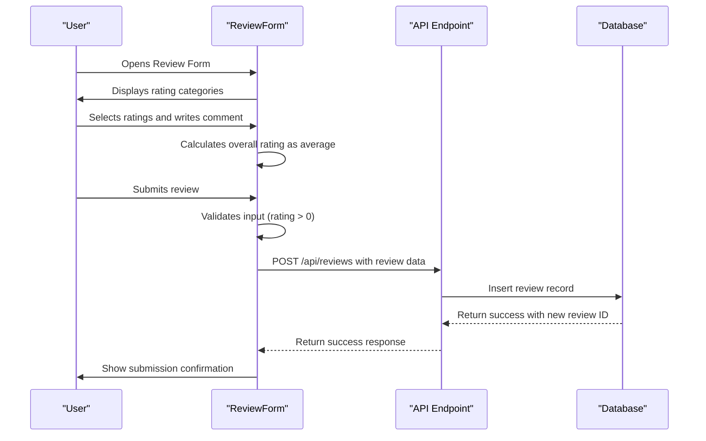
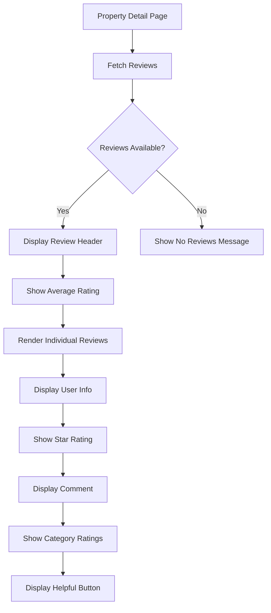

# Review Model

<cite>
**Referenced Files in This Document**  
- [migrations/1.sql](file://migrations/1.sql#L130-L150)
- [src/shared/types.ts](file://src/shared/types.ts#L110-L120)
- [src/worker/index.ts](file://src/worker/index.ts#L1961-L2009)
- [src/react-app/components/ReviewForm.tsx](file://src/react-app/components/ReviewForm.tsx#L47-L81)
- [src/react-app/components/ReviewList.tsx](file://src/react-app/components/ReviewList.tsx#L99-L146)
- [src/react-app/components/ReviewSummary.tsx](file://src/react-app/components/ReviewSummary.tsx#L114-L142)
</cite>

## Table of Contents
1. [Review Model](#review-model)
2. [Database Schema](#database-schema)
3. [TypeScript Interface](#typescript-interface)
4. [API Endpoints](#api-endpoints)
5. [Business Rules and Constraints](#business-rules-and-constraints)
6. [Review Submission Flow](#review-submission-flow)
7. [Review Display and Aggregation](#review-display-and-aggregation)
8. [Indexing Strategy](#indexing-strategy)

## Database Schema

The `reviews` table is defined in the database migration files and contains comprehensive fields to support user feedback, verification, and analytics.

```sql
CREATE TABLE reviews (
  id INTEGER PRIMARY KEY AUTOINCREMENT,
  user_id TEXT NOT NULL,
  property_id INTEGER NOT NULL,
  booking_id INTEGER,
  rating INTEGER NOT NULL CHECK (rating >= 1 AND rating <= 5),
  cleanliness_rating INTEGER CHECK (cleanliness_rating >= 1 AND cleanliness_rating <= 5),
  communication_rating INTEGER CHECK (communication_rating >= 1 AND cleanliness_rating <= 5),
  location_rating INTEGER CHECK (location_rating >= 1 AND location_rating <= 5),
  value_rating INTEGER CHECK (value_rating >= 1 AND value_rating <= 5),
  comment TEXT,
  is_approved BOOLEAN DEFAULT 1,
  created_at DATETIME DEFAULT CURRENT_TIMESTAMP,
  updated_at DATETIME DEFAULT CURRENT_TIMESTAMP,
  FOREIGN KEY (user_id) REFERENCES users(id),
  FOREIGN KEY (property_id) REFERENCES properties(id),
  UNIQUE(user_id, property_id)
);
```

### Field Descriptions
- **id**: Unique identifier for the review
- **user_id**: Reference to the user who submitted the review
- **property_id**: Reference to the reviewed property
- **booking_id**: Optional reference to the booking that generated the review
- **rating**: Overall rating from 1 to 5
- **cleanliness_rating**: Category-specific rating for cleanliness
- **communication_rating**: Category-specific rating for host communication
- **location_rating**: Category-specific rating for location
- **value_rating**: Category-specific rating for value
- **comment**: Textual feedback from the guest
- **is_approved**: Flag indicating if the review has passed moderation
- **created_at**: Timestamp of review creation
- **updated_at**: Timestamp of last update

The schema includes a composite unique constraint on `(user_id, property_id)` to prevent multiple reviews from the same user for the same property.

**Section sources**
- [migrations/1.sql](file://migrations/1.sql#L130-L150)

## TypeScript Interface

The `Review` interface in `types.ts` defines the TypeScript type structure used throughout the frontend application.

```typescript
export const ReviewSchema = z.object({
  id: z.number(),
  user_id: z.string(),
  property_id: z.number(),
  booking_id: z.number().nullable(),
  rating: z.number().int().min(1).max(5),
  comment: z.string().nullable(),
  created_at: z.string(),
  updated_at: z.string(),
});

export type Review = z.infer<typeof ReviewSchema>;
```

Additionally, the `CreateReview` schema is used for form validation:

```typescript
export const CreateReviewSchema = z.object({
  property_id: z.number(),
  booking_id: z.number().optional(),
  rating: z.number().int().min(1).max(5),
  comment: z.string().optional(),
});
```

**Section sources**
- [src/shared/types.ts](file://src/shared/types.ts#L110-L120)

## API Endpoints

The backend exposes several endpoints for review management:

### POST /api/reviews
Creates a new review. Requires authentication and validates input data.

```typescript
app.post('/api/reviews', async (c) => {
  try {
    const data = await c.req.json();
    const { property_id, booking_id, rating, comment, cleanliness_rating, communication_rating, location_rating, value_rating } = data;
    
    const user_id = 1; // In production, this would come from authentication
    
    const stmt = c.env.DB.prepare(`
      INSERT INTO reviews (
        property_id, user_id, booking_id, rating, comment,
        cleanliness_rating, communication_rating, location_rating, value_rating,
        created_at
      ) VALUES (?, ?, ?, ?, ?, ?, ?, ?, ?, datetime('now'))
    `);
    
    const result = await stmt.bind(
      property_id, user_id, booking_id, rating, comment,
      cleanliness_rating, communication_rating, location_rating, value_rating
    ).run();
    
    return c.json({ 
      success: true, 
      data: { id: result.meta.last_row_id } 
    });
  } catch (error) {
    console.error('Error creating review:', error);
    return c.json({ success: false, error: 'Failed to create review' }, 500);
  }
});
```

### POST /api/reviews/:id/helpful
Increments the helpful count for a review.

```typescript
app.post('/api/reviews/:id/helpful', async (c) => {
  try {
    const reviewId = c.req.param('id');
    
    const stmt = c.env.DB.prepare(`
      UPDATE reviews 
      SET helpful_count = COALESCE(helpful_count, 0) + 1
      WHERE id = ?
    `);
    
    await stmt.bind(reviewId).run();
    
    return c.json({ success: true });
  } catch (error) {
    console.error('Error marking review as helpful:', error);
    return c.json({ success: false, error: 'Failed to mark review as helpful' }, 500);
  }
});
```

### GET /api/reviews/summary/:propertyId
Retrieves aggregated review data for a property.

```typescript
app.get('/api/reviews/summary/:propertyId', async (c) => {
  try {
    const propertyId = c.req.param('propertyId');
    
    // Get average rating and total reviews
    const summaryStmt = c.env.DB.prepare(`
      SELECT 
        AVG(rating) as average_rating,
        COUNT(*) as total_reviews,
        AVG(cleanliness_rating) as avg_cleanliness,
        AVG(communication_rating) as avg_communication,
        AVG(location_rating) as avg_location,
        AVG(value_rating) as avg_value
      FROM reviews 
      WHERE property_id = ?
    `);
    const summaryResult = await summaryStmt.bind(propertyId).first();
    
    // Get rating distribution
    const distributionStmt = c.env.DB.prepare(`
      SELECT rating, COUNT(*) as count
      FROM reviews 
      WHERE property_id = ?
      GROUP BY rating
    `);
    const { results: distributionResults } = await distributionStmt.bind(propertyId).all();
    
    const ratingDistribution = { 1: 0, 2: 0, 3: 0, 4: 0, 5: 0 };
    distributionResults.forEach((row: any) => {
      ratingDistribution[row.rating as keyof typeof ratingDistribution] = row.count;
    });
    
    const summary = {
      averageRating: summaryResult?.average_rating || 0,
      totalReviews: summaryResult?.total_reviews || 0,
      ratingDistribution,
      categoryRatings: {
        cleanliness: summaryResult?.avg_cleanliness || 0,
        communication: summaryResult?.avg_communication || 0,
        location: summaryResult?.avg_location || 0,
        value: summaryResult?.avg_value || 0
      }
    };
    
    return c.json({ success: true, data: summary });
  } catch (error) {
    console.error('Error fetching review summary:', error);
    return c.json({ success: false, error: 'Failed to fetch review summary' }, 500);
  }
});
```

**Section sources**
- [src/worker/index.ts](file://src/worker/index.ts#L1961-L2009)

## Business Rules and Constraints

### Review Eligibility
- Users must be authenticated to submit reviews
- Reviews can only be submitted after checkout (implied by requiring a booking_id)
- Each user can only submit one review per property (enforced by unique constraint)

### Moderation Workflow
- All reviews are automatically approved by default (`is_approved BOOLEAN DEFAULT 1`)
- The system is designed to support moderation, with the `is_approved` field ready for manual review processes
- In the future, this could be extended to require admin approval for new reviewers

### Data Integrity Constraints
- Rating values are constrained between 1 and 5
- Composite unique index on `(user_id, property_id)` prevents duplicate reviews
- Foreign key constraints ensure referential integrity with users, properties, and bookings tables

**Section sources**
- [migrations/1.sql](file://migrations/1.sql#L130-L150)
- [src/react-app/components/ReviewForm.tsx](file://src/react-app/components/ReviewForm.tsx#L47-L81)

## Review Submission Flow

The review submission process follows a structured flow from user interaction to data persistence:



### Key Implementation Details
- The overall rating is automatically calculated as the average of category ratings
- Client-side validation ensures users provide a rating before submission
- The form handles authentication checks before allowing submission
- After successful submission, a confirmation message is displayed

**Diagram sources**
- [src/react-app/components/ReviewForm.tsx](file://src/react-app/components/ReviewForm.tsx#L47-L81)
- [src/worker/index.ts](file://src/worker/index.ts#L1961-L2009)

## Review Display and Aggregation

### Property Detail Display
The `ReviewList` component renders reviews on the property detail page:



### Rating Aggregation
The system calculates several aggregate metrics:

```typescript
// In ReviewSummary component
const calculateCategoryPercentages = () => {
  return {
    cleanliness: (categoryRatings.cleanliness / 5) * 100,
    communication: (categoryRatings.communication / 5) * 100,
    location: (categoryRatings.location / 5) * 100,
    value: (categoryRatings.value / 5) * 100
  };
};
```

The `ReviewSummary` component displays:
- Overall average rating
- Total number of reviews
- Category-specific average ratings
- Visual representation of rating distribution

**Section sources**
- [src/react-app/components/ReviewList.tsx](file://src/react-app/components/ReviewList.tsx#L99-L146)
- [src/react-app/components/ReviewSummary.tsx](file://src/react-app/components/ReviewSummary.tsx#L114-L142)

## Indexing Strategy

The database schema includes several indexes to optimize review-related queries:

### Primary Index
- `id`: Primary key index for direct lookups

### Foreign Key Indexes
- `property_id`: Index to support queries by property (e.g., "get all reviews for property X")
- `user_id`: Index to support queries by user (e.g., "get all reviews by user Y")

### Composite Indexes
- `(user_id, property_id)`: Unique composite index that enforces the business rule of one review per user per property and optimizes lookups by both criteria

### Query Optimization
The indexing strategy supports efficient execution of common queries:
- Property detail pages: Fast retrieval of all reviews for a specific property
- User profiles: Fast retrieval of all reviews by a specific user
- Duplicate prevention: Fast lookup to prevent multiple reviews from the same user for the same property
- Moderation: Fast filtering of unapproved reviews if moderation is enabled

**Section sources**
- [migrations/1.sql](file://migrations/1.sql#L130-L150)