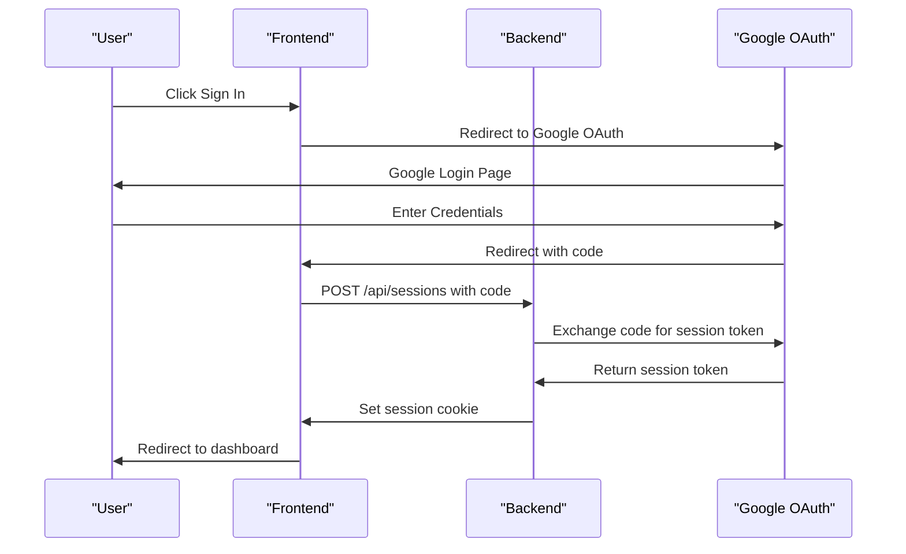
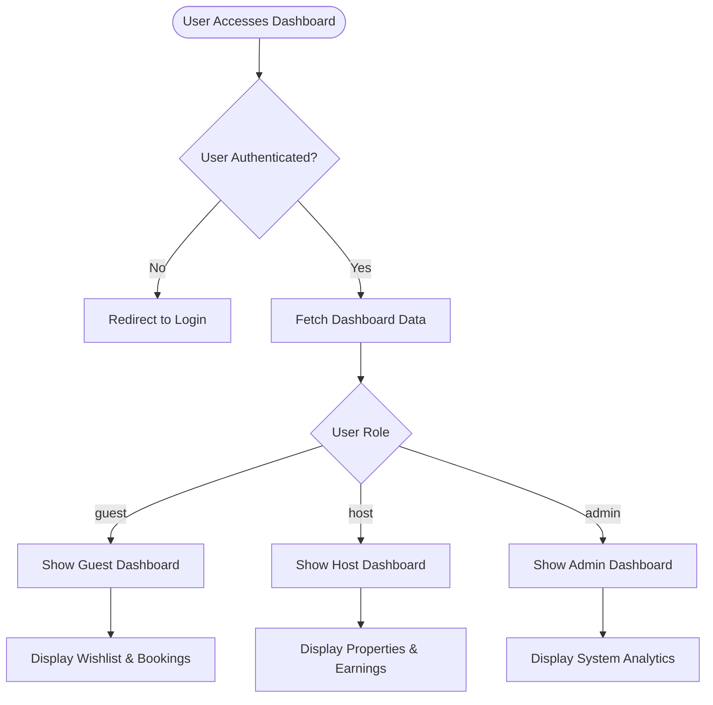
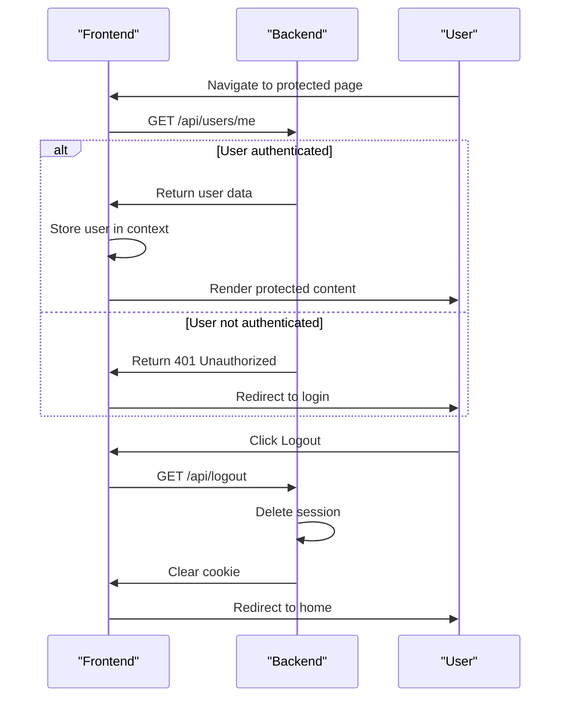

# User Model

<cite>
**Referenced Files in This Document**   
- [1.sql](file://migrations/1.sql)
- [types.ts](file://src/shared/types.ts)
- [Dashboard.tsx](file://src/react-app/pages/Dashboard.tsx)
- [Profile.tsx](file://src/react-app/pages/Profile.tsx)
- [AuthCallback.tsx](file://src/react-app/pages/AuthCallback.tsx)
- [index.ts](file://src/worker/index.ts)
</cite>

## Table of Contents
1. [User Data Model](#user-data-model)
2. [Authentication Flow](#authentication-flow)
3. [Role-Based Access Control](#role-based-access-control)
4. [Session State Management](#session-state-management)
5. [Data Privacy and Indexing](#data-privacy-and-indexing)

## User Data Model

The User data model is defined in the application's database schema and TypeScript interfaces, representing core user information and preferences. The model includes essential fields for identification, authentication, and personalization.

### Database Schema

The user table is created in the initial database migration file with the following structure:

```sql
CREATE TABLE users (
  id TEXT PRIMARY KEY,
  email TEXT UNIQUE NOT NULL,
  name TEXT NOT NULL,
  avatar TEXT,
  phone TEXT,
  role TEXT DEFAULT 'guest' CHECK (role IN ('guest', 'host', 'admin')),
  is_verified BOOLEAN DEFAULT 0,
  is_active BOOLEAN DEFAULT 1,
  created_at DATETIME DEFAULT CURRENT_TIMESTAMP,
  updated_at DATETIME DEFAULT CURRENT_TIMESTAMP
);
```

**Key Fields:**
- **id**: Primary key, serves as the unique identifier for users
- **email**: Unique identifier, used for login and communication
- **name**: Full name of the user
- **avatar**: URL to the user's profile picture
- **phone**: Contact phone number
- **role**: User role with values 'guest', 'host', or 'admin'
- **is_verified**: Boolean flag indicating email verification status
- **is_active**: Boolean flag indicating account status
- **created_at**: Timestamp of account creation
- **updated_at**: Timestamp of last update

### TypeScript Interface

The User interface is defined in the shared types file using Zod for validation:

```typescript
export type UserRole = 'guest' | 'host' | 'admin';

export const UserSchema = z.object({
  id: z.string(),
  email: z.string().email(),
  name: z.string(),
  avatar: z.string().optional(),
  phone: z.string().optional(),
  role: z.enum(['guest', 'host', 'admin']),
  is_verified: z.boolean(),
  is_active: z.boolean(),
  created_at: z.string(),
  updated_at: z.string(),
});

export type User = z.infer<typeof UserSchema>;
```

### User Preferences

User preferences are stored in a separate profile system that extends the core user data:

```typescript
export const UserProfileSchema = z.object({
  id: z.number(),
  user_id: z.string(),
  full_name: z.string().nullable(),
  phone: z.string().nullable(),
  address: z.string().nullable(),
  city: z.string().nullable(),
  country: z.string().nullable(),
  date_of_birth: z.string().nullable(),
  preferred_language: z.string(),
  currency: z.string(),
  bio: z.string().nullable(),
  avatar_url: z.string().nullable(),
  created_at: z.string(),
  updated_at: z.string(),
});
```

**Preferences include:**
- **full_name**: Complete name of the user
- **phone**: Contact number
- **address**: Physical address
- **city**: City of residence
- **country**: Country of residence
- **date_of_birth**: User's birth date
- **preferred_language**: Language preference ('en' or 'ar')
- **currency**: Preferred currency (default 'SAR')
- **bio**: Personal biography
- **avatar_url**: URL to profile picture

**Section sources**
- [1.sql](file://migrations/1.sql#L2-L25)
- [types.ts](file://src/shared/types.ts#L470-L487)

## Authentication Flow

The authentication flow uses Google OAuth for secure user authentication and account creation. The process begins when a user clicks the sign-in button and is redirected to Google's authentication page.

### OAuth Callback Process

When Google redirects back to the application with an authorization code, the AuthCallback page handles the authentication:



**Diagram sources**
- [AuthCallback.tsx](file://src/react-app/pages/AuthCallback.tsx#L0-L36)
- [index.ts](file://src/worker/index.ts#L130-L179)

### User Record Creation

When a user authenticates for the first time via Google OAuth, the system creates a user record. The user data from Google is stored in the session and used to populate the user profile:

```typescript
// Backend processes the OAuth callback
app.post("/api/sessions", async (c) => {
  const body = await c.req.json();
  
  if (!body.code) {
    return c.json({ error: "No authorization code provided" }, 400);
  }
  
  const sessionToken = await exchangeCodeForSessionToken(body.code, {
    apiUrl: c.env.MOCHA_USERS_SERVICE_API_URL,
    apiKey: c.env.MOCHA_USERS_SERVICE_API_KEY,
  });
  
  setCookie(c, MOCHA_SESSION_TOKEN_COOKIE_NAME, sessionToken, {
    httpOnly: true,
    path: "/",
    sameSite: "none",
    secure: true,
    maxAge: 60 * 24 * 60 * 60, // 60 days
  });
  
  return c.json({ success: true }, 200);
});
```

The user object contains Google-specific data accessible as `google_user_data`:

```typescript
// Example user object structure
{
  id: "user123",
  email: "user@example.com",
  name: "John Doe",
  google_user_data: {
    name: "John Doe",
    given_name: "John",
    family_name: "Doe",
    picture: "https://lh3.googleusercontent.com/...",
    email: "user@example.com"
  },
  role: "guest",
  created_at: "2024-01-15T10:30:00Z"
}
```

**Section sources**
- [AuthCallback.tsx](file://src/react-app/pages/AuthCallback.tsx#L38-L70)
- [index.ts](file://src/worker/index.ts#L130-L179)

## Role-Based Access Control

The application implements role-based access control (RBAC) to manage user permissions and dashboard visibility. There are three distinct roles: guest, host, and admin, each with different capabilities.

### Role Definitions

- **guest**: Basic user with limited permissions
- **host**: Property owner with management capabilities
- **admin**: Administrative privileges for system management

### API Route Protection

API routes are protected using middleware that checks user authentication and role:

```typescript
app.get("/api/admin/stats", authMiddleware, async (c) => {
  const user = c.get("user");
  if (!user || (!user.email.includes('admin') && !user.email.includes('owner'))) {
    return c.json<ApiResponse>({
      success: false,
      error: "Unauthorized",
    }, 403);
  }
  // Return admin statistics
});
```

### Dashboard Visibility

The Dashboard component conditionally renders content based on user role and data availability:



**Diagram sources**
- [Dashboard.tsx](file://src/react-app/pages/Dashboard.tsx#L1-L484)
- [index.ts](file://src/worker/index.ts#L810-L842)

The dashboard displays different information based on the user's role:
- **Guests** see their bookings and wishlist
- **Hosts** see property management, bookings, and earnings
- **Admins** have access to system-wide statistics and management tools

**Section sources**
- [Dashboard.tsx](file://src/react-app/pages/Dashboard.tsx#L1-L484)
- [index.ts](file://src/worker/index.ts#L768-L814)

## Session State Management

The application manages user session state across frontend and backend using a combination of cookies and authentication middleware.

### Backend Session Management

The backend handles session creation and validation:

```typescript
// Create session on successful OAuth
app.post("/api/sessions", async (c) => {
  const sessionToken = await exchangeCodeForSessionToken(body.code, config);
  
  setCookie(c, MOCHA_SESSION_TOKEN_COOKIE_NAME, sessionToken, {
    httpOnly: true,
    path: "/",
    sameSite: "none",
    secure: true,
    maxAge: 60 * 24 * 60 * 60, // 60 days
  });
  
  return c.json({ success: true }, 200);
});

// Protect routes with auth middleware
app.get("/api/users/me", authMiddleware, async (c) => {
  return c.json(c.get("user"));
});
```

### Frontend Session Handling

The frontend uses the useAuth hook to manage user state:



**Diagram sources**
- [index.ts](file://src/worker/index.ts#L130-L179)
- [AuthCallback.tsx](file://src/react-app/pages/AuthCallback.tsx#L0-L36)

The session cookie is HTTP-only for security and has a 60-day expiration period. The authMiddleware validates the session token on each protected route request.

**Section sources**
- [index.ts](file://src/worker/index.ts#L130-L179)
- [AuthCallback.tsx](file://src/react-app/pages/AuthCallback.tsx#L0-L36)

## Data Privacy and Indexing

The application implements data privacy considerations and database indexing to ensure performance and protection of personally identifiable information (PII).

### Database Indexing

The user table has built-in indexing for fast lookup:
- **Primary Key**: The `id` field is the primary key with automatic indexing
- **Unique Constraint**: The `email` field has a unique constraint, which creates an index for fast email-based lookups

This indexing strategy ensures that user authentication and retrieval operations are optimized for performance.

### Data Privacy Considerations

The application handles PII with the following considerations:
- **Email**: Used as the primary identifier but displayed only to the user in their profile
- **Phone**: Optional field, stored securely
- **Address**: Stored in the user profile but not shared publicly by default
- **Date of Birth**: Collected for verification purposes but not displayed

The Profile component allows users to control the visibility of their personal information:

```typescript
// Privacy settings in Profile component
const [showPersonalInfo, setShowPersonalInfo] = useState(true);
const [showContactInfo, setShowContactInfo] = useState(true);

// Users can toggle visibility
<button onClick={() => setShowPersonalInfo(!showPersonalInfo)}>
  {showPersonalInfo ? <Eye /> : <EyeOff />}
  <span>{showPersonalInfo ? 'Visible' : 'Hidden'}</span>
</button>
```

### User Data Access Examples

**User creation during OAuth callback:**
```typescript
// When a user authenticates via Google OAuth
// 1. Google returns user data including email, name, and picture
// 2. Backend creates user record with:
//    - id: generated unique identifier
//    - email: from Google profile
//    - name: from Google profile
//    - avatar: Google profile picture URL
//    - role: default 'guest'
//    - created_at: current timestamp
```

**Profile update example:**
```typescript
// User updates their profile information
const saveProfile = async () => {
  setSaving(true);
  try {
    const response = await fetch('/api/users/profile', {
      method: 'PUT',
      headers: { 'Content-Type': 'application/json' },
      body: JSON.stringify({ profile, notifications }),
    });
    
    // Profile update successful
  } catch (error) {
    console.error('Error saving profile:', error);
  } finally {
    setSaving(false);
  }
};
```

**Section sources**
- [1.sql](file://migrations/1.sql#L2-L25)
- [Profile.tsx](file://src/react-app/pages/Profile.tsx#L1-L550)
- [types.ts](file://src/shared/types.ts#L470-L487)