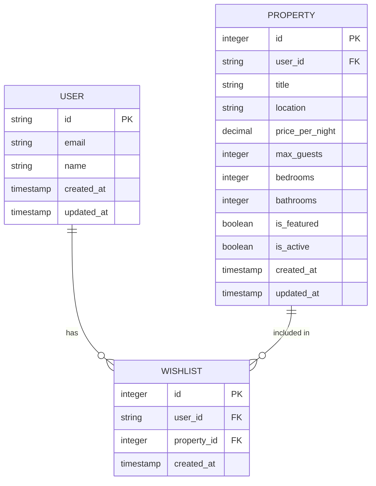
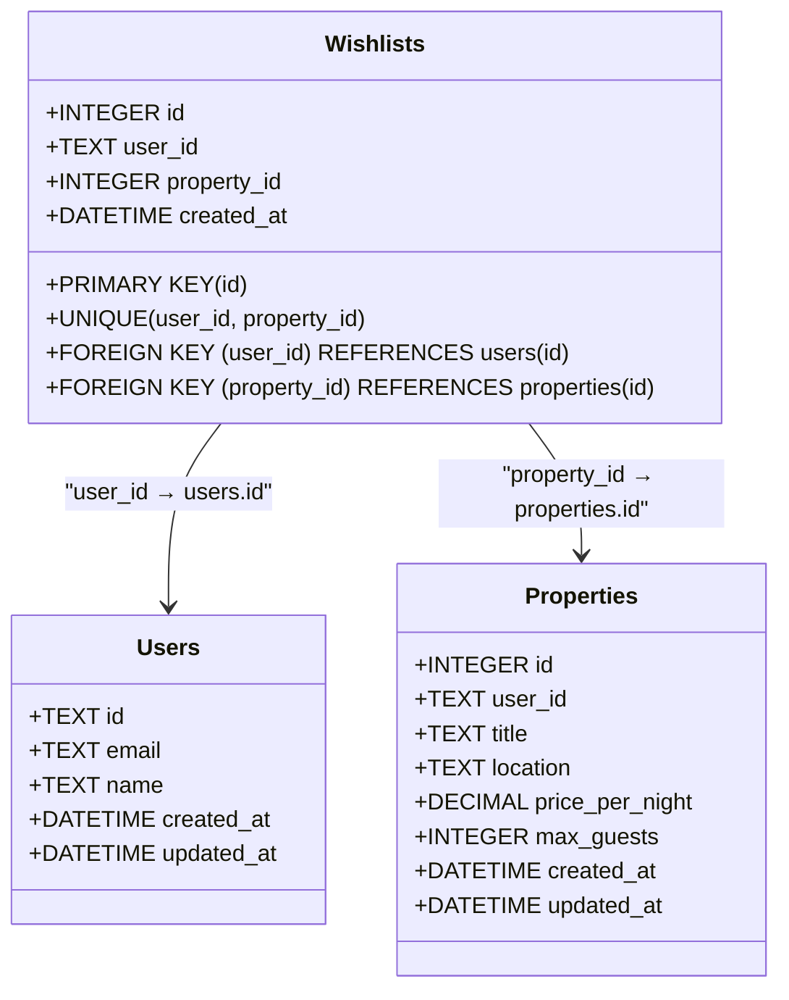
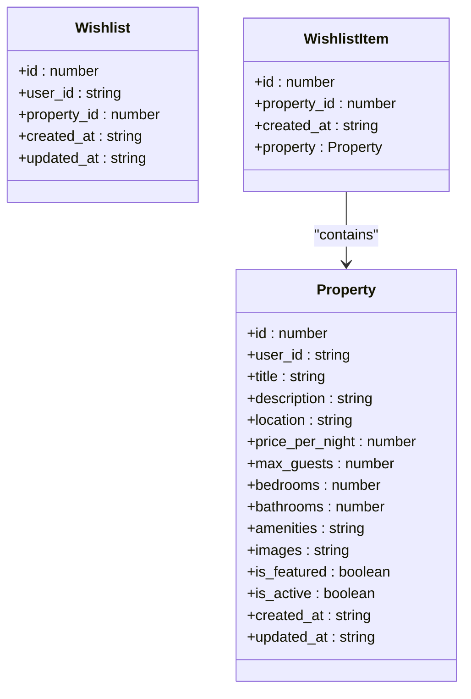
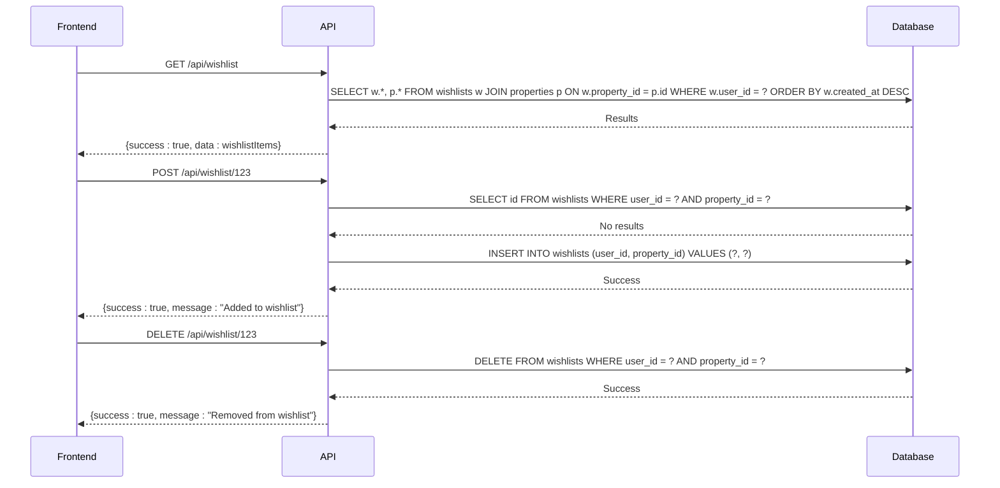
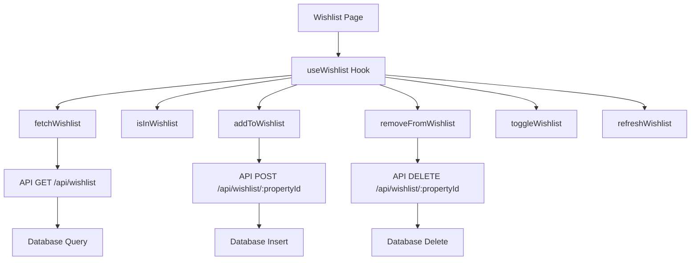
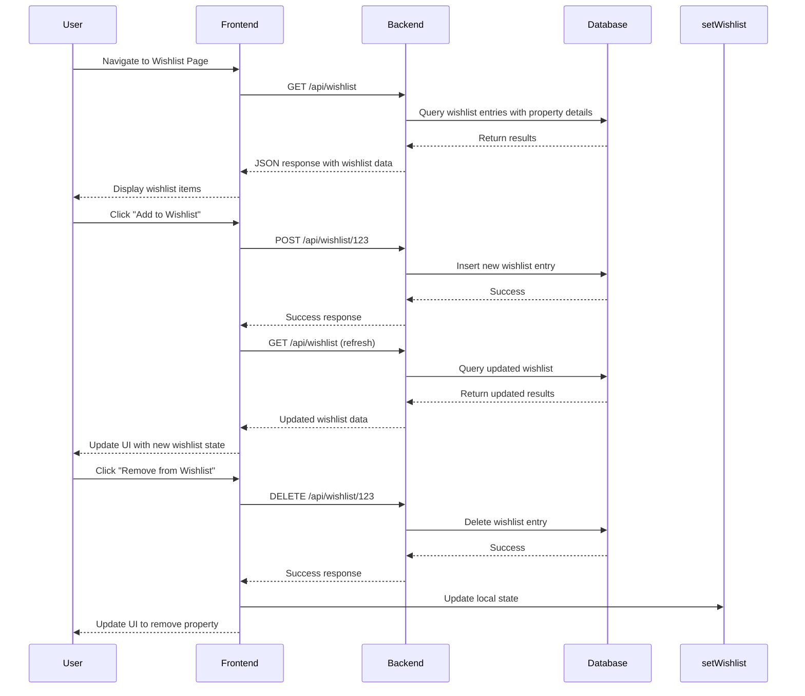
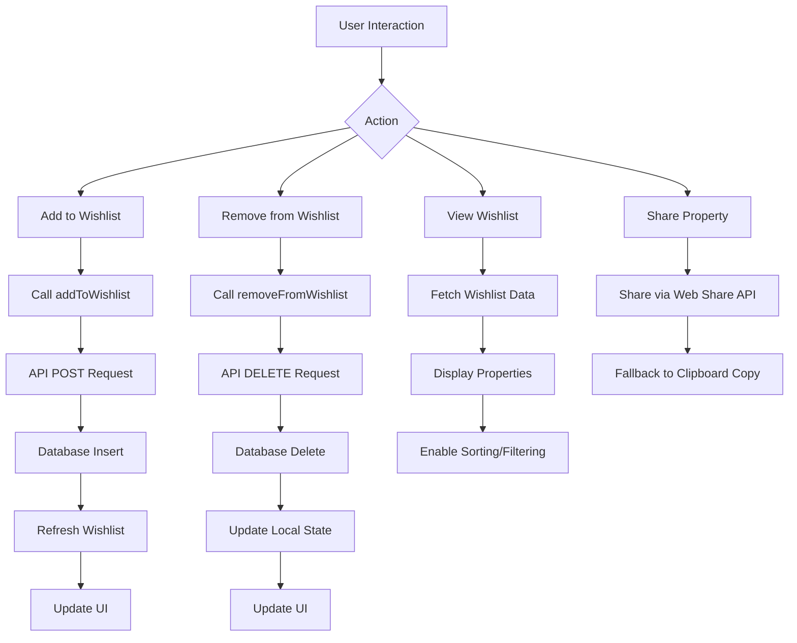
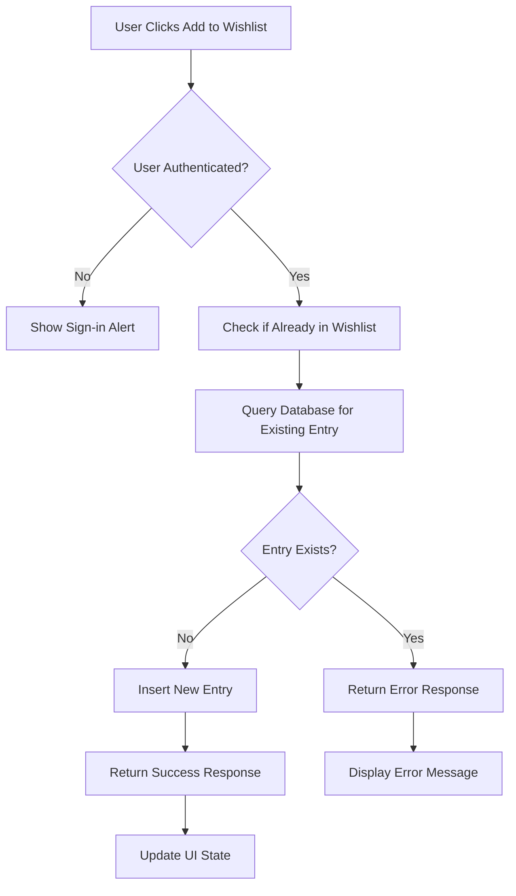
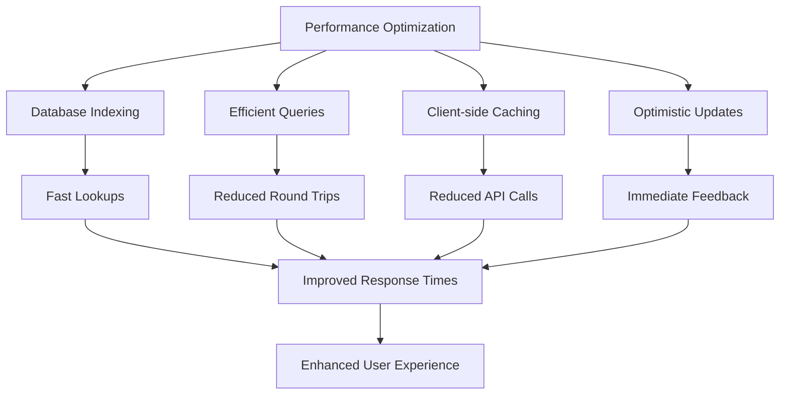
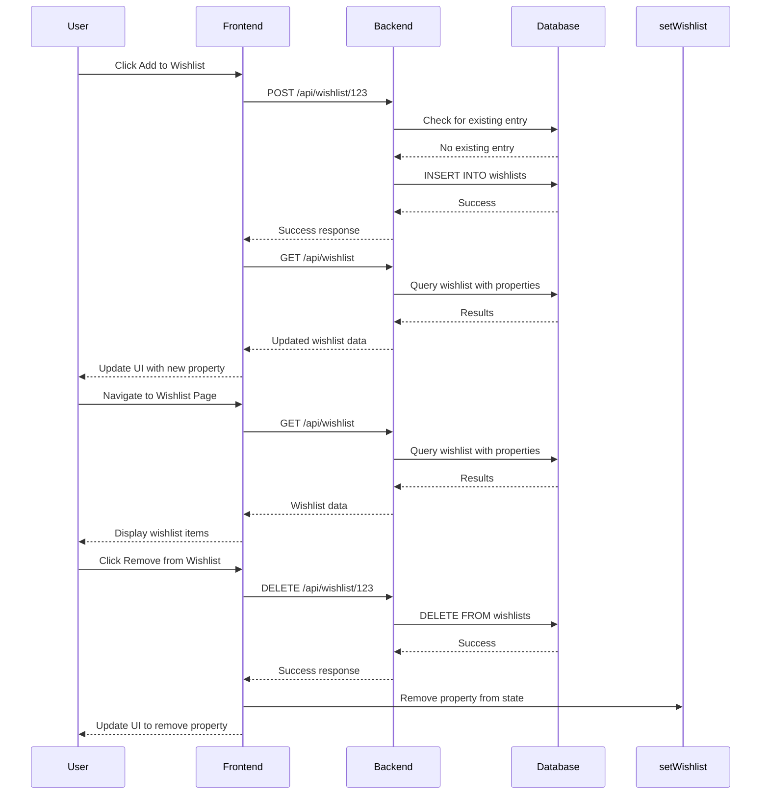

# Wishlist Model

<cite>
**Referenced Files in This Document**   
- [migrations/1.sql](file://migrations/1.sql#L76-L100)
- [src/shared/types.ts](file://src/shared/types.ts#L30-L37)
- [src/worker/index.ts](file://src/worker/index.ts#L600-L685)
- [src/react-app/pages/Wishlist.tsx](file://src/react-app/pages/Wishlist.tsx#L0-L295)
- [src/react-app/hooks/useWishlist.ts](file://src/react-app/hooks/useWishlist.ts#L0-L121)
</cite>

## Table of Contents
1. [Introduction](#introduction)
2. [Wishlist Entity Definition](#wishlist-entity-definition)
3. [Database Schema](#database-schema)
4. [Type Interface Definition](#type-interface-definition)
5. [API Endpoints](#api-endpoints)
6. [Frontend Implementation](#frontend-implementation)
7. [Data Flow and Synchronization](#data-flow-and-synchronization)
8. [Usage Patterns](#usage-patterns)
9. [Duplicate Prevention](#duplicate-prevention)
10. [Performance Optimization](#performance-optimization)
11. [Interaction Flows](#interaction-flows)

## Introduction
The Wishlist model serves as a junction table that enables a many-to-many relationship between Users and Properties in the HabibiStay application. This document provides comprehensive documentation of the Wishlist entity, covering its database schema, type definitions, API endpoints, frontend implementation, and usage patterns. The wishlist functionality allows users to save properties they are interested in for future reference, sharing, or booking.

**Section sources**
- [migrations/1.sql](file://migrations/1.sql#L76-L100)
- [src/shared/types.ts](file://src/shared/types.ts#L30-L37)

## Wishlist Entity Definition
The Wishlist entity is a junction table that connects users with their favorite properties. It captures the relationship between a user and a property they have added to their wishlist, along with metadata about when the property was added.

**Key fields:**
- **id**: Unique identifier for the wishlist entry
- **user_id**: Reference to the user who created the wishlist entry
- **property_id**: Reference to the property that was added to the wishlist
- **created_at**: Timestamp when the property was added to the wishlist

The entity facilitates the many-to-many relationship between users and properties, allowing a single user to have multiple properties in their wishlist and a single property to be in multiple users' wishlists.



**Diagram sources**
- [migrations/1.sql](file://migrations/1.sql#L76-L100)

**Section sources**
- [migrations/1.sql](file://migrations/1.sql#L76-L100)

## Database Schema
The wishlist table is defined in the database migration files with specific constraints and relationships to ensure data integrity.

```sql
CREATE TABLE wishlists (
  id INTEGER PRIMARY KEY AUTOINCREMENT,
  user_id TEXT NOT NULL,
  property_id INTEGER NOT NULL,
  created_at DATETIME DEFAULT CURRENT_TIMESTAMP,
  UNIQUE(user_id, property_id),
  FOREIGN KEY (user_id) REFERENCES users(id),
  FOREIGN KEY (property_id) REFERENCES properties(id)
);
```

**Schema characteristics:**
- **Composite Unique Constraint**: The combination of user_id and property_id is unique, preventing duplicate entries
- **Foreign Key Constraints**: 
  - user_id references the users table with cascade behavior
  - property_id references the properties table with cascade behavior
- **Auto-incrementing Primary Key**: The id field serves as the primary key
- **Timestamp**: created_at field automatically captures when the entry is created

The foreign key constraints ensure referential integrity. When a user or property is deleted, the corresponding wishlist entries are automatically removed through cascade delete operations.



**Diagram sources**
- [migrations/1.sql](file://migrations/1.sql#L76-L100)

**Section sources**
- [migrations/1.sql](file://migrations/1.sql#L76-L100)

## Type Interface Definition
The Wishlist interface is defined in the shared types file, providing type safety across the application.

```typescript
export const WishlistSchema = z.object({
  id: z.number(),
  user_id: z.string(),
  property_id: z.number(),
  created_at: z.string(),
  updated_at: z.string(),
});

export type Wishlist = z.infer<typeof WishlistSchema>;
```

The interface defines the structure of a wishlist item with the following properties:
- **id**: Numeric identifier for the wishlist entry
- **user_id**: String identifier for the user (matches the users table)
- **property_id**: Numeric identifier for the property
- **created_at**: String representation of the creation timestamp
- **updated_at**: String representation of the last update timestamp

The type definition is used throughout the application to ensure consistent data handling between the frontend and backend.



**Diagram sources**
- [src/shared/types.ts](file://src/shared/types.ts#L30-L37)

**Section sources**
- [src/shared/types.ts](file://src/shared/types.ts#L30-L37)

## API Endpoints
The wishlist functionality is exposed through a set of REST API endpoints that handle CRUD operations.

### GET /api/wishlist
Retrieves all wishlist items for the authenticated user.

```typescript
app.get("/api/wishlist", authMiddleware, async (c) => {
  const user = c.get("user");
  if (!user) {
    return c.json<ApiResponse>({
      success: false,
      error: "User not authenticated",
    }, 401);
  }

  const { results } = await c.env.DB.prepare(`
    SELECT w.*, p.* FROM wishlists w
    JOIN properties p ON w.property_id = p.id
    WHERE w.user_id = ? AND p.is_active = 1
    ORDER BY w.created_at DESC
  `).bind(user.id).all();
  // ... response handling
});
```

### POST /api/wishlist/:propertyId
Adds a property to the user's wishlist.

```typescript
app.post("/api/wishlist/:propertyId", authMiddleware, async (c) => {
  const user = c.get("user");
  if (!user) {
    return c.json<ApiResponse>({
      success: false,
      error: "User not authenticated",
    }, 401);
  }

  const propertyId = c.req.param("propertyId");

  // Check if already in wishlist
  const existing = await c.env.DB.prepare(
    "SELECT id FROM wishlists WHERE user_id = ? AND property_id = ?"
  ).bind(user.id, propertyId).first();

  if (existing) {
    return c.json<ApiResponse>({
      success: false,
      error: "Property already in wishlist",
    }, 400);
  }

  const { success } = await c.env.DB.prepare(`
    INSERT INTO wishlists (user_id, property_id)
    VALUES (?, ?)
  `).bind(user.id, propertyId).run();
  // ... response handling
});
```

### DELETE /api/wishlist/:propertyId
Removes a property from the user's wishlist.

```typescript
app.delete("/api/wishlist/:propertyId", authMiddleware, async (c) => {
  const user = c.get("user");
  if (!user) {
    return c.json<ApiResponse>({
      success: false,
      error: "User not authenticated",
    }, 401);
  }

  const propertyId = c.req.param("propertyId");

  const { success } = await c.env.DB.prepare(`
    DELETE FROM wishlists WHERE user_id = ? AND property_id = ?
  `).bind(user.id, propertyId).run();
  // ... response handling
});
```



**Diagram sources**
- [src/worker/index.ts](file://src/worker/index.ts#L600-L685)

**Section sources**
- [src/worker/index.ts](file://src/worker/index.ts#L600-L685)

## Frontend Implementation
The wishlist functionality is implemented in the frontend through a dedicated page and a custom hook that manages the wishlist state.

### Wishlist Page
The Wishlist page displays all properties in the user's wishlist with filtering, sorting, and interaction capabilities.

```tsx
export default function WishlistPage() {
  const { user, redirectToLogin } = useAuth();
  const [wishlistItems, setWishlistItems] = useState<WishlistItem[]>([]);
  const [loading, setLoading] = useState(true);

  useEffect(() => {
    if (!user) {
      redirectToLogin();
      return;
    }
    fetchWishlist();
  }, [user, redirectToLogin]);

  const fetchWishlist = async () => {
    try {
      const response = await fetch('/api/wishlist');
      const data = await response.json();
      
      if (data.success) {
        setWishlistItems(data.data);
      }
    } catch (error) {
      console.error('Error fetching wishlist:', error);
    } finally {
      setLoading(false);
    }
  };
  // ... render logic
}
```

### UseWishlist Hook
The custom hook encapsulates the wishlist functionality and provides a clean API for components to interact with the wishlist.

```tsx
export function useWishlist(): UseWishlistReturn {
  const { user } = useAuth();
  const [wishlist, setWishlist] = useState<WishlistItem[]>([]);
  const [loading, setLoading] = useState(false);

  const fetchWishlist = useCallback(async () => {
    if (!user) {
      setWishlist([]);
      return;
    }

    setLoading(true);
    try {
      const response = await fetch('/api/wishlist');
      const data = await response.json();
      
      if (data.success) {
        setWishlist(data.data || []);
      }
    } catch (error) {
      console.error('Error fetching wishlist:', error);
    } finally {
      setLoading(false);
    }
  }, [user]);

  const isInWishlist = useCallback((propertyId: number): boolean => {
    return wishlist.some(item => item.property_id === propertyId);
  }, [wishlist]);

  const addToWishlist = useCallback(async (propertyId: number): Promise<boolean> => {
    if (!user) {
      alert('Please sign in to add to wishlist');
      return false;
    }

    try {
      const response = await fetch(`/api/wishlist/${propertyId}`, {
        method: 'POST',
      });

      if (response.ok) {
        await fetchWishlist();
        return true;
      }
      return false;
    } catch (error) {
      console.error('Error adding to wishlist:', error);
      return false;
    }
  }, [user, fetchWishlist]);

  const removeFromWishlist = useCallback(async (propertyId: number): Promise<boolean> => {
    if (!user) return false;

    try {
      const response = await fetch(`/api/wishlist/${propertyId}`, {
        method: 'DELETE',
      });

      if (response.ok) {
        setWishlist(prev => prev.filter(item => item.property_id !== propertyId));
        return true;
      }
      return false;
    } catch (error) {
      console.error('Error removing from wishlist:', error);
      return false;
    }
  }, [user]);

  const toggleWishlist = useCallback(async (propertyId: number): Promise<boolean> => {
    const inWishlist = isInWishlist(propertyId);
    
    if (inWishlist) {
      return await removeFromWishlist(propertyId);
    } else {
      return await addToWishlist(propertyId);
    }
  }, [isInWishlist, addToWishlist, removeFromWishlist]);

  const refreshWishlist = useCallback(async () => {
    await fetchWishlist();
  }, [fetchWishlist]);

  return {
    wishlist,
    loading,
    isInWishlist,
    addToWishlist,
    removeFromWishlist,
    toggleWishlist,
    refreshWishlist,
    wishlistCount: wishlist.length,
  };
}
```



**Diagram sources**
- [src/react-app/pages/Wishlist.tsx](file://src/react-app/pages/Wishlist.tsx#L0-L295)
- [src/react-app/hooks/useWishlist.ts](file://src/react-app/hooks/useWishlist.ts#L0-L121)

**Section sources**
- [src/react-app/pages/Wishlist.tsx](file://src/react-app/pages/Wishlist.tsx#L0-L295)
- [src/react-app/hooks/useWishlist.ts](file://src/react-app/hooks/useWishlist.ts#L0-L121)

## Data Flow and Synchronization
The wishlist state is synchronized between the frontend and backend through a well-defined data flow pattern.

### Initial Load
When the user navigates to the wishlist page, the frontend fetches the current wishlist state from the backend API. The backend queries the database to retrieve all wishlist entries for the authenticated user, joining with the properties table to include property details.

### State Updates
When a user adds or removes a property from their wishlist, the frontend makes an API call to update the backend. Upon successful response, the frontend updates its local state to reflect the change, ensuring immediate visual feedback.

### Real-time Synchronization
The useWishlist hook automatically refreshes the wishlist data when the component mounts, ensuring that the displayed information is always up-to-date. The toggleWishlist function provides a convenient way to add or remove properties with a single action.



**Diagram sources**
- [src/worker/index.ts](file://src/worker/index.ts#L600-L685)
- [src/react-app/hooks/useWishlist.ts](file://src/react-app/hooks/useWishlist.ts#L0-L121)

**Section sources**
- [src/worker/index.ts](file://src/worker/index.ts#L600-L685)
- [src/react-app/hooks/useWishlist.ts](file://src/react-app/hooks/useWishlist.ts#L0-L121)

## Usage Patterns
The wishlist functionality supports several key usage patterns that enhance the user experience.

### Adding Properties to Wishlist
Users can add properties to their wishlist from various parts of the application:
- Property detail pages
- Property search results
- Property cards in listings

The process involves:
1. User clicks the heart icon on a property
2. Frontend calls the addToWishlist function
3. API creates a new entry in the wishlists table
4. Frontend refreshes the wishlist data

### Removing Properties from Wishlist
Users can remove properties from their wishlist through:
- The wishlist page (using the trash icon)
- Property detail pages (clicking the filled heart icon)
- Context menus on property cards

The process involves:
1. User clicks the remove option
2. Frontend calls the removeFromWishlist function
3. API deletes the entry from the wishlists table
4. Frontend updates the local state

### Viewing and Managing Wishlist
On the wishlist page, users can:
- View all saved properties
- Filter properties by search query
- Sort properties by various criteria (newest, oldest, price, name)
- Share properties with friends
- Remove properties from the wishlist
- Navigate to property details for booking



**Section sources**
- [src/react-app/pages/Wishlist.tsx](file://src/react-app/pages/Wishlist.tsx#L0-L295)
- [src/react-app/hooks/useWishlist.ts](file://src/react-app/hooks/useWishlist.ts#L0-L121)

## Duplicate Prevention
The system implements multiple layers of duplicate prevention to ensure data integrity.

### Database Level
The database schema includes a unique constraint on the combination of user_id and property_id:

```sql
UNIQUE(user_id, property_id)
```

This prevents the same user from adding the same property to their wishlist multiple times at the database level.

### Application Level
Before attempting to add a property to the wishlist, the backend checks if the entry already exists:

```typescript
const existing = await c.env.DB.prepare(
  "SELECT id FROM wishlists WHERE user_id = ? AND property_id = ?"
).bind(user.id, propertyId).first();

if (existing) {
  return c.json<ApiResponse>({
    success: false,
    error: "Property already in wishlist",
  }, 400);
}
```

### User Experience
The frontend provides immediate feedback when a user attempts to add a duplicate property:

```typescript
if (!user) {
  alert('Please sign in to add to wishlist');
  return false;
}
```

Additionally, the isInWishlist function allows components to display the appropriate state (filled or empty heart icon) based on whether a property is already in the wishlist.



**Diagram sources**
- [src/worker/index.ts](file://src/worker/index.ts#L635-L685)

**Section sources**
- [src/worker/index.ts](file://src/worker/index.ts#L635-L685)

## Performance Optimization
The wishlist system includes several performance optimizations to ensure fast and responsive user experiences.

### Database Indexing
Although not explicitly defined in the migration files, best practices suggest indexing the foreign key columns for faster lookups:

```sql
CREATE INDEX idx_wishlist_user ON wishlists(user_id);
CREATE INDEX idx_wishlist_property ON wishlists(property_id);
CREATE INDEX idx_wishlist_user_property ON wishlists(user_id, property_id);
```

### Efficient Queries
The backend uses optimized queries to retrieve wishlist data with property details in a single database call:

```sql
SELECT w.*, p.* FROM wishlists w
JOIN properties p ON w.property_id = p.id
WHERE w.user_id = ? AND p.is_active = 1
ORDER BY w.created_at DESC
```

This reduces the number of database round trips and improves performance.

### Client-side Caching
The useWishlist hook maintains a local cache of the wishlist data, reducing the need for repeated API calls:

```typescript
const [wishlist, setWishlist] = useState<WishlistItem[]>([]);
```

The hook only fetches data when necessary, such as when the component mounts or when an explicit refresh is requested.

### Optimistic Updates
When removing a property from the wishlist, the frontend optimistically updates the local state before receiving confirmation from the backend:

```typescript
setWishlist(prev => prev.filter(item => item.property_id !== propertyId));
```

This provides immediate visual feedback to the user, improving perceived performance.



**Section sources**
- [src/worker/index.ts](file://src/worker/index.ts#L600-L685)
- [src/react-app/hooks/useWishlist.ts](file://src/react-app/hooks/useWishlist.ts#L0-L121)

## Interaction Flows
This section details common interaction flows involving the wishlist functionality.

### Adding a Property to Wishlist
1. User views a property listing or detail page
2. User clicks the heart icon to add the property to their wishlist
3. If not signed in, user is prompted to sign in
4. Frontend calls addToWishlist function with the property ID
5. Backend checks if the property is already in the user's wishlist
6. If not a duplicate, backend creates a new entry in the wishlists table
7. Backend returns success response
8. Frontend refreshes the wishlist data
9. UI updates to reflect the new state (heart icon fills, count increases)

### Removing a Property from Wishlist
1. User navigates to their wishlist page
2. User clicks the trash icon or "Remove" button on a wishlist item
3. Frontend calls removeFromWishlist function with the property ID
4. Backend deletes the entry from the wishlists table
5. Backend returns success response
6. Frontend updates the local state to remove the property
7. UI updates to reflect the change (property disappears from list)

### Viewing and Sharing Wishlist
1. User navigates to the wishlist page
2. Backend retrieves all wishlist items with property details
3. Frontend displays properties in a grid or list view
4. User can search, filter, and sort properties
5. User clicks the share icon on a property
6. If Web Share API is available, native sharing dialog opens
7. If not, property URL is copied to clipboard
8. User can share the link with friends



**Diagram sources**
- [src/worker/index.ts](file://src/worker/index.ts#L600-L685)
- [src/react-app/pages/Wishlist.tsx](file://src/react-app/pages/Wishlist.tsx#L0-L295)

**Section sources**
- [src/worker/index.ts](file://src/worker/index.ts#L600-L685)
- [src/react-app/pages/Wishlist.tsx](file://src/react-app/pages/Wishlist.tsx#L0-L295)