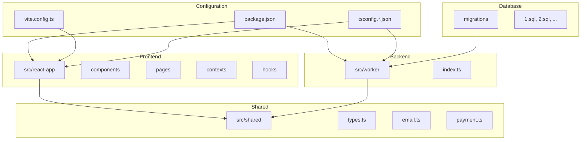
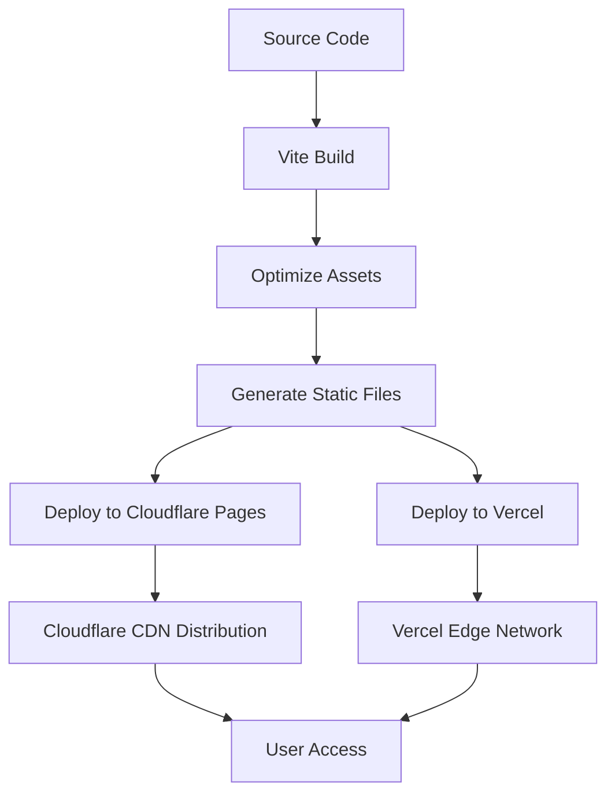
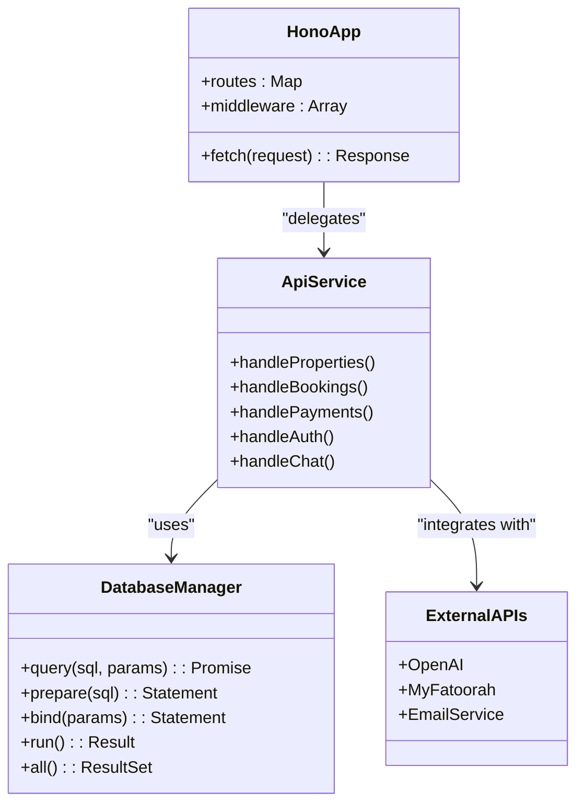
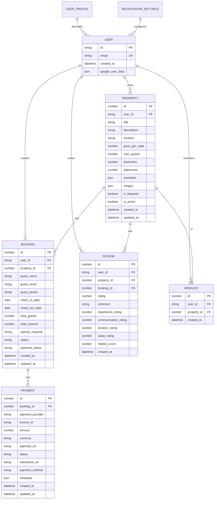
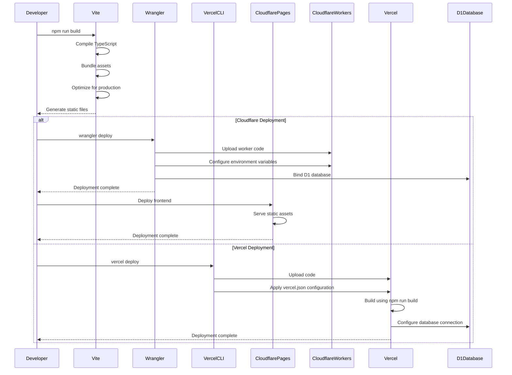
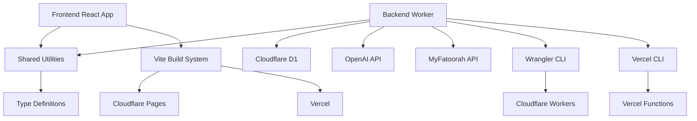

# Deployment Architecture

<cite>
**Referenced Files in This Document**   
- [package.json](file://package.json) - *Updated with Vercel deployment scripts*
- [vite.config.ts](file://vite.config.ts)
- [src/worker/index.ts](file://src/worker/index.ts)
- [src/shared/email.ts](file://src/shared/email.ts)
- [src/shared/payment.ts](file://src/shared/payment.ts)
- [src/shared/types.ts](file://src/shared/types.ts)
- [vercel.json](file://vercel.json) - *Added in recent commit for Vercel deployment configuration*
- [wrangler.toml](file://wrangler.toml) - *Cloudflare Workers configuration*
</cite>

## Update Summary
**Changes Made**   
- Added documentation for Vercel deployment configuration
- Updated deployment workflow section to include Vercel as an alternative deployment option
- Enhanced CLI tools section with Vercel-specific configuration details
- Added new diagram for Vercel routing configuration
- Updated referenced files to include vercel.json and wrangler.toml

## Table of Contents
1. [Introduction](#introduction)
2. [Project Structure](#project-structure)
3. [Core Components](#core-components)
4. [Architecture Overview](#architecture-overview)
5. [Detailed Component Analysis](#detailed-component-analysis)
6. [Dependency Analysis](#dependency-analysis)
7. [Performance Considerations](#performance-considerations)
8. [Troubleshooting Guide](#troubleshooting-guide)
9. [Conclusion](#conclusion)

## Introduction
This document provides a comprehensive overview of the deployment architecture for HabibiStay, a full-stack application built using modern web technologies and supporting multiple deployment platforms. The system leverages Cloudflare Workers for backend API services and Cloudflare Pages for frontend hosting, while also supporting Vercel deployment. The architecture separates frontend and backend concerns while maintaining tight integration through API calls. The backend utilizes Cloudflare D1 for relational data storage and implements various business logic including property management, bookings, payments, AI chat functionality, and user authentication. This documentation details the deployment model, configuration, database integration, workflows, and operational considerations for this serverless application.

## Project Structure
The project follows a modular structure with clear separation between frontend, shared utilities, and backend worker code. The frontend is built using React with Vite as the build tool, while the backend is implemented as a Hono application running on serverless platforms. Shared TypeScript types and utilities are maintained in a separate directory to ensure consistency across both frontend and backend.



**Diagram sources**
- [package.json](file://package.json)
- [vite.config.ts](file://vite.config.ts)
- [src/worker/index.ts](file://src/worker/index.ts)

**Section sources**
- [package.json](file://package.json)
- [vite.config.ts](file://vite.config.ts)
- [src/worker/index.ts](file://src/worker/index.ts)

## Core Components
The application consists of three main components: the frontend React application, the backend Hono worker, and shared utilities. The frontend is responsible for user interface rendering and client-side interactions, while the backend handles API requests, business logic, and database operations. Shared components include TypeScript types, email service utilities, and payment processing logic that are used by both frontend and backend.

The deployment model supports multiple platforms including Cloudflare Pages/Workers and Vercel, allowing for flexible deployment strategies. The frontend is built using Vite and can be deployed to either Cloudflare Pages or Vercel, while the backend runs as a serverless function. This separation allows for independent development and deployment cycles while maintaining API-based integration.

**Section sources**
- [package.json](file://package.json)
- [vite.config.ts](file://vite.config.ts)
- [src/worker/index.ts](file://src/worker/index.ts)

## Architecture Overview
The deployment architecture follows a serverless model with multiple hosting options. The frontend assets can be served from either Cloudflare Pages or Vercel, while the backend API runs as a serverless function on Cloudflare Workers or Vercel Functions. The two components communicate via HTTP requests, with the frontend making API calls to the worker endpoints. The backend worker is connected to a Cloudflare D1 database for persistent storage of application data including properties, bookings, users, and analytics.

```mermaid
graph LR
A[User Browser] --> B[Frontend Hosting]
B --> C[Cloudflare Pages]
B --> D[Vercel]
C --> E[Frontend React App]
D --> E[Frontend React App]
E --> F[Backend API]
F --> G[Cloudflare Worker]
F --> H[Vercel Function]
G --> I[Cloudflare D1 Database]
H --> I[Cloudflare D1 Database]
G --> J[External Services]
H --> J[External Services]
J --> K[OpenAI API]
J --> L[MyFatoorah Payment]
J --> M[Email Services]
style A fill:#f9f,stroke:#333
style B fill:#bbf,stroke:#333
style C fill:#69c,stroke:#333
style D fill:#000,stroke:#333
style E fill:#bbf,stroke:#333
style F fill:#f96,stroke:#333
style G fill:#f69,stroke:#333
style H fill:#000,stroke:#333
style I fill:#6f9,stroke:#333
style J fill:#666,stroke:#333
```



**Diagram sources**
- [package.json](file://package.json)
- [vite.config.ts](file://vite.config.ts)
- [src/worker/index.ts](file://src/worker/index.ts)
- [vercel.json](file://vercel.json)

## Detailed Component Analysis

### Frontend Deployment with Vite and Multiple Platforms
The frontend application is built using React with Vite as the build tool. The Vite configuration includes the Cloudflare Pages plugin, which enables integration with the Cloudflare Pages deployment platform. The build process compiles the React application into static assets that can be served from either Cloudflare's global CDN or Vercel's edge network.



**Diagram sources**
- [vite.config.ts](file://vite.config.ts)
- [package.json](file://package.json)
- [vercel.json](file://vercel.json)

**Section sources**
- [vite.config.ts](file://vite.config.ts)
- [package.json](file://package.json)
- [vercel.json](file://vercel.json)

### Backend API with Hono and Serverless Platforms
The backend is implemented using Hono, a lightweight web framework optimized for serverless environments. The worker handles all API requests, including property management, bookings, payments, user authentication, and AI chat functionality. The entry point is `src/worker/index.ts`, which defines all routes and middleware.

The worker uses environment bindings to access the D1 database and other services. Key features include CORS middleware, error handling, authentication via the Mocha user service, and integration with external APIs like OpenAI for the AI chatbot and MyFatoorah for payment processing. The application supports deployment to both Cloudflare Workers and Vercel Functions through platform-specific configuration.



**Diagram sources**
- [src/worker/index.ts](file://src/worker/index.ts)
- [src/shared/email.ts](file://src/shared/email.ts)
- [src/shared/payment.ts](file://src/shared/payment.ts)

**Section sources**
- [src/worker/index.ts](file://src/worker/index.ts)
- [src/shared/email.ts](file://src/shared/email.ts)
- [src/shared/payment.ts](file://src/shared/payment.ts)

### Database Integration with Cloudflare D1
The application uses Cloudflare D1 as its relational database solution. The database schema includes tables for properties, bookings, users, reviews, payments, and application settings. Migrations are managed through SQL files in the migrations directory, with each migration containing both up and down scripts for version control.

The worker accesses the database through the `env.DB` binding, which provides methods for preparing and executing SQL statements. The application uses parameterized queries to prevent SQL injection and leverages D1's promise-based API for asynchronous operations.



**Diagram sources**
- [src/worker/index.ts](file://src/worker/index.ts)
- [migrations/1.sql](file://migrations/1.sql)
- [migrations/2.sql](file://migrations/2.sql)

**Section sources**
- [src/worker/index.ts](file://src/worker/index.ts)
- [migrations/1.sql](file://migrations/1.sql)

### Vercel Deployment Configuration
The application now supports deployment to Vercel through the vercel.json configuration file. This configuration defines the build process, routing rules, and platform settings for Vercel deployment. The configuration specifies that API routes are handled by the worker code while static assets are served from the build output directory.

```mermaid
graph TD
A[vercel.json] --> B[Build Configuration]
A --> C[Routing Rules]
A --> D[Platform Settings]
B --> E[buildCommand: npm run build]
B --> F[outputDirectory: dist]
B --> G[installCommand: npm install]
C --> H[/api/(.*) -> /src/worker/index.ts]
C --> I[/(.*) -> /dist/$1]
D --> J[framework: vite]
D --> K[version: 2]
D --> L[use: @vercel/node]
```

**Diagram sources**
- [vercel.json](file://vercel.json)

**Section sources**
- [vercel.json](file://vercel.json)
- [package.json](file://package.json)
- [src/worker/index.ts](file://src/worker/index.ts)

### Deployment Workflow and CLI Tools
The deployment process is managed through npm scripts in package.json and platform-specific CLI tools. The devDependencies include wrangler (^4.33.0) and @cloudflare/vite-plugin, which facilitate local development and deployment to Cloudflare, as well as Vercel CLI tools for Vercel deployment.

The package.json defines several key scripts:
- `build`: Compiles TypeScript and builds the Vite frontend
- `check`: Runs type checking and a dry-run deployment
- `dev`: Starts the Vite development server
- `cf-typegen`: Generates types for Cloudflare bindings

The Vite configuration includes the Cloudflare plugin, which enables integration with Cloudflare Pages. The vercel.json file configures Vercel deployment with specific routes and build settings. During deployment, the frontend assets are built and deployed to either Cloudflare Pages or Vercel, while the worker code is deployed to the respective serverless platform using the appropriate CLI tool.



**Diagram sources**
- [package.json](file://package.json)
- [vite.config.ts](file://vite.config.ts)
- [src/worker/index.ts](file://src/worker/index.ts)
- [vercel.json](file://vercel.json)

**Section sources**
- [package.json](file://package.json)
- [vite.config.ts](file://vite.config.ts)
- [vercel.json](file://vercel.json)

## Dependency Analysis
The application has a clear dependency structure with minimal circular dependencies. The frontend depends on shared types and utilities, while the backend also depends on the same shared components. The worker is the central component that integrates with external services and the database.



**Diagram sources**
- [package.json](file://package.json)
- [vite.config.ts](file://vite.config.ts)
- [src/worker/index.ts](file://src/worker/index.ts)
- [vercel.json](file://vercel.json)

**Section sources**
- [package.json](file://package.json)
- [vite.config.ts](file://vite.config.ts)

## Performance Considerations
The serverless architecture provides several performance benefits, including automatic scaling, global distribution, and low-latency responses. Both Cloudflare's and Vercel's edge networks ensure that frontend assets and API responses are served from locations close to users.

The application implements several performance optimizations:
- Vite's code splitting and asset optimization for the frontend
- Efficient database queries with proper indexing
- Caching strategies for frequently accessed data
- Asynchronous processing for non-critical operations like email sending

The worker architecture ensures that API endpoints are highly responsive, with Hono's lightweight framework minimizing overhead. Database queries are optimized to reduce latency, and external API calls are handled asynchronously where possible. Both deployment platforms offer edge caching and CDN distribution for optimal performance.

## Troubleshooting Guide
Common issues in this deployment architecture typically relate to environment configuration, database connectivity, or API integration. Key troubleshooting steps include:

1. Verify environment variables are properly configured in both Wrangler and Vercel
2. Check D1 database binding in the worker configuration
3. Validate CORS settings for API access from the frontend
4. Monitor worker logs for errors and exceptions
5. Test database migrations and schema changes
6. Ensure vercel.json routing rules are correctly configured

The application includes comprehensive error handling in the worker code, with try-catch blocks around critical operations and detailed logging for debugging purposes. The errorHandler middleware captures unhandled exceptions and returns appropriate error responses.

**Section sources**
- [src/worker/index.ts](file://src/worker/index.ts)
- [package.json](file://package.json)
- [vercel.json](file://vercel.json)

## Conclusion
The HabibiStay application demonstrates a modern serverless architecture leveraging multiple platforms including Cloudflare and Vercel for deployment. The separation of concerns between frontend and backend deployment enables flexible hosting options while maintaining consistent functionality. The integration with D1 provides a robust relational database solution, while the use of Vite and Hono ensures high performance and developer productivity.

This architecture supports zero-downtime deployments, automatic scaling, and global content distribution. The deployment workflow is streamlined through npm scripts and platform-specific CLI tools, making it easy to manage both staging and production environments across different platforms. With proper monitoring and logging, this serverless architecture provides a reliable foundation for the application's growth and evolution.