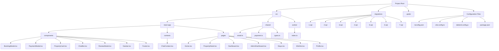
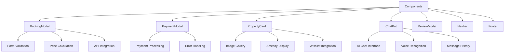
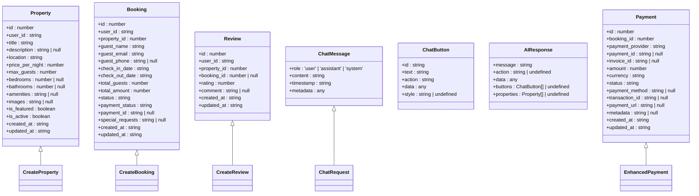
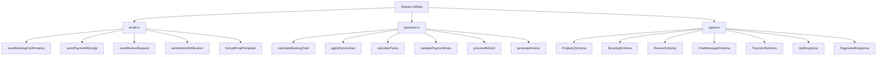
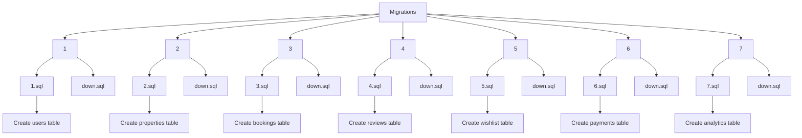
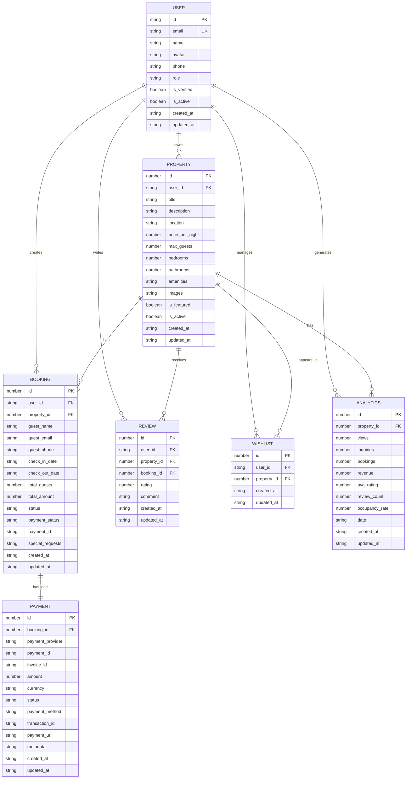
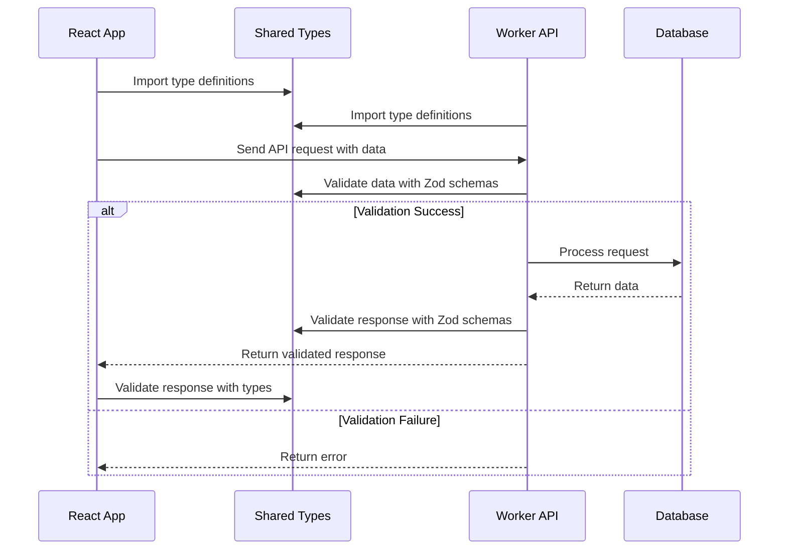

# Directory Structure Breakdown

<cite>
**Referenced Files in This Document**   
- [BookingModal.tsx](file://src/react-app/components/BookingModal.tsx)
- [PaymentModal.tsx](file://src/react-app/components/PaymentModal.tsx)
- [PropertyCard.tsx](file://src/react-app/components/PropertyCard.tsx)
- [PropertyDetail.tsx](file://src/react-app/pages/PropertyDetail.tsx)
- [Home.tsx](file://src/react-app/pages/Home.tsx)
- [ChatContext.tsx](file://src/react-app/contexts/ChatContext.tsx)
- [types.ts](file://src/shared/types.ts)
- [index.ts](file://src/worker/index.ts)
- [tsconfig.json](file://tsconfig.json)
- [vite.config.ts](file://vite.config.ts)
- [tailwind.config.js](file://tailwind.config.js)
- [package.json](file://package.json)
- [1.sql](file://migrations/1.sql)
- [2.sql](file://migrations/2.sql)
- [3.sql](file://migrations/3.sql)
- [4.sql](file://migrations/4.sql)
- [5.sql](file://migrations/5.sql)
- [6.sql](file://migrations/6.sql)
- [7.sql](file://migrations/7.sql)
</cite>

## Table of Contents
1. [Project Structure Overview](#project-structure-overview)
2. [Frontend Architecture: react-app](#frontend-architecture-react-app)
3. [Backend Logic: worker](#backend-logic-worker)
4. [Shared Utilities: shared](#shared-utilities-shared)
5. [Database Management: migrations](#database-management-migrations)
6. [Configuration Files](#configuration-files)
7. [Module Resolution and Aliases](#module-resolution-and-aliases)
8. [File Naming Conventions](#file-naming-conventions)
9. [Architectural Patterns and Best Practices](#architectural-patterns-and-best-practices)
10. [Feature Development Guidelines](#feature-development-guidelines)

## Project Structure Overview

The HabibiStay repository follows a well-organized, scalable architecture that separates concerns between frontend, backend, shared utilities, and database management. The structure enables efficient development workflows, promotes code reuse, and facilitates maintainability across the full stack application.



**Diagram sources**
- [package.json](file://package.json)
- [tsconfig.json](file://tsconfig.json)

**Section sources**
- [package.json](file://package.json)
- [tsconfig.json](file://tsconfig.json)

## Frontend Architecture: react-app

The `src/react-app` directory contains the complete frontend application built with React, organized into three main subdirectories: components, contexts, and pages. This structure follows the component-based architecture pattern, promoting reusability and separation of concerns.

### Component Organization

The components directory houses reusable UI elements that can be composed across different pages and features. The organization follows atomic design principles, with components ranging from simple atoms to complex organisms.



**Diagram sources**
- [BookingModal.tsx](file://src/react-app/components/BookingModal.tsx)
- [PaymentModal.tsx](file://src/react-app/components/PaymentModal.tsx)
- [PropertyCard.tsx](file://src/react-app/components/PropertyCard.tsx)
- [ChatBot.tsx](file://src/react-app/components/ChatBot.tsx)

**Section sources**
- [BookingModal.tsx](file://src/react-app/components/BookingModal.tsx)
- [PaymentModal.tsx](file://src/react-app/components/PaymentModal.tsx)
- [PropertyCard.tsx](file://src/react-app/components/PropertyCard.tsx)

### Pages Structure

The pages directory contains top-level route components that represent different views in the application. Each page orchestrates the composition of multiple components to create complete user experiences.

```mermaid
graph TD
A[Pages] --> B[Home]
A --> C[PropertyDetail]
A --> D[Dashboard]
A --> E[AdminDashboard]
A --> F[Stays]
A --> G[Wishlist]
A --> H[Profile]
A --> I[AuthCallback]
A --> J[PaymentSuccess]
A --> K[PaymentCancel]
A --> L[About]
A --> M[Contact]
A --> N[Invest]
A --> O[Owners]
A --> P[Cookies]
A --> Q[Privacy]
A --> R[Terms]
A --> S[Stories]
B --> T[Hero Section]
B --> U[Featured Properties]
B --> V[Testimonials]
C --> W[Property Gallery]
C --> X[Booking Form]
C --> Y[Reviews]
C --> Z[Amenities]
D --> AA[Booking History]
D --> AB[Upcoming Stays]
D --> AC[Payment Methods]
E --> AD[Property Management]
E --> AE[Booking Analytics]
E --> AF[User Management]
```



**Diagram sources**
- [Home.tsx](file://src/react-app/pages/Home.tsx)
- [PropertyDetail.tsx](file://src/react-app/pages/PropertyDetail.tsx)
- [Dashboard.tsx](file://src/react-app/pages/Dashboard.tsx)
- [AdminDashboard.tsx](file://src/react-app/pages/AdminDashboard.tsx)

**Section sources**
- [Home.tsx](file://src/react-app/pages/Home.tsx)
- [PropertyDetail.tsx](file://src/react-app/pages/PropertyDetail.tsx)

### Context Management

The contexts directory contains React Context providers that manage global application state. This pattern enables state sharing across components without prop drilling, particularly useful for features that require application-wide data access.

```mermaid
classDiagram
class ChatContext {
+messages : ChatMessage[]
+isOpen : boolean
+isLoading : boolean
+conversationId : string | null
+featuredProperties : Property[]
+currentBooking : Partial<CreateBookingData> | null
+voiceEnabled : boolean
+isListening : boolean
+sendMessage(content : string, action? : string) : Promise<void>
+addMessage(message : ChatMessage) : void
+toggleChat() : void
+closeChat() : void
+openChat() : void
+showPropertyCard(property : Property) : void
+initiateBooking(propertyId : number) : void
+updateBookingData(data : Partial<CreateBookingData>) : void
+handleButtonClick(button : ChatButton) : void
+toggleVoice() : void
+startListening() : void
+stopListening() : void
+clearConversation() : void
}
class ChatProvider {
-messages : ChatMessage[]
-isOpen : boolean
-isLoading : boolean
-conversationId : string | null
-featuredProperties : Property[]
-currentBooking : Partial<CreateBookingData> | null
-voiceEnabled : boolean
-isListening : boolean
-recognition : any
-synthesis : SpeechSynthesis | null
+sendMessage(content : string, action? : string) : Promise<void>
+addMessage(message : ChatMessage) : void
+toggleChat() : void
+closeChat() : void
+openChat() : void
+showPropertyCard(property : Property) : void
+initiateBooking(propertyId : number) : void
+updateBookingData(data : Partial<CreateBookingData>) : void
+handleButtonClick(button : ChatButton) : void
+toggleVoice() : void
+startListening() : void
+stopListening() : void
+clearConversation() : void
}
ChatProvider --> ChatContext : "implements"
ChatProvider --> "localStorage" : "persists state"
ChatProvider --> "SpeechRecognition" : "voice interface"
ChatProvider --> "speechSynthesis" : "text-to-speech"
ChatProvider --> "/api/properties/featured" : "fetches data"
ChatProvider --> "/api/chat/enhanced" : "AI communication"
```

**Diagram sources**
- [ChatContext.tsx](file://src/react-app/contexts/ChatContext.tsx)

**Section sources**
- [ChatContext.tsx](file://src/react-app/contexts/ChatContext.tsx)

## Backend Logic: worker

The `src/worker` directory contains the backend API logic implemented as a worker process. This serverless architecture pattern allows for scalable, event-driven backend functionality that handles API requests, database operations, and business logic.

```mermaid
graph TD
A[Worker Entry Point] --> B[API Routes]
B --> C[/api/properties]
B --> D[/api/bookings]
B --> E[/api/payments]
B --> F[/api/reviews]
B --> G[/api/chat]
B --> H[/api/auth]
B --> I[/api/search]
B --> J[/api/analytics]
C --> K[GET /:id]
C --> L[GET /featured]
C --> M[GET /search]
C --> N[POST /create]
C --> O[PUT /:id]
C --> P[DELETE /:id]
D --> Q[POST /create]
D --> R[GET /:id]
D --> S[GET /user/:userId]
D --> T[PUT /:id/status]
E --> U[POST /create]
E --> V[POST /webhook]
E --> W[GET /:id/status]
F --> X[POST /create]
F --> Y[GET /:propertyId]
F --> Z[PUT /:id]
F --> AA[DELETE /:id]
G --> AB[POST /enhanced]
G --> AC[POST /stream]
G --> AD[GET /conversation/:id]
H --> AE[POST /login]
H --> AF[POST /register]
H --> AG[POST /callback]
H --> AH[GET /profile]
I --> AI[POST /properties]
I --> AJ[GET /suggestions]
J --> AK[GET /property/:id]
J --> AL[GET /user/:userId]
J --> AM[GET /dashboard]
```

**Diagram sources**
- [index.ts](file://src/worker/index.ts)

**Section sources**
- [index.ts](file://src/worker/index.ts)

## Shared Utilities: shared

The `src/shared` directory contains cross-cutting utilities and type definitions that are used by both the frontend and backend. This shared codebase ensures consistency across the application and eliminates duplication of common functionality and data structures.

### Type Definitions

The shared types file defines comprehensive TypeScript interfaces and Zod schemas that ensure type safety and data validation across the entire stack. This approach enables end-to-end type checking and reduces runtime errors.



**Diagram sources**
- [types.ts](file://src/shared/types.ts)

**Section sources**
- [types.ts](file://src/shared/types.ts)

### Utility Functions

The shared directory also contains utility functions for common operations such as email handling and payment processing. These utilities provide consistent implementations across the application.



**Diagram sources**
- [email.ts](file://src/shared/email.ts)
- [payment.ts](file://src/shared/payment.ts)
- [types.ts](file://src/shared/types.ts)

**Section sources**
- [email.ts](file://src/shared/email.ts)
- [payment.ts](file://src/shared/payment.ts)

## Database Management: migrations

The `migrations` directory contains SQL scripts that define the database schema evolution over time. This approach enables version-controlled database changes, facilitates team collaboration, and ensures consistent database states across different environments.

### Migration Structure

The migration system follows a sequential numbering pattern with both up and down scripts for each version, enabling both forward and backward database schema changes.



**Diagram sources**
- [1.sql](file://migrations/1.sql)
- [2.sql](file://migrations/2.sql)
- [3.sql](file://migrations/3.sql)
- [4.sql](file://migrations/4.sql)
- [5.sql](file://migrations/5.sql)
- [6.sql](file://migrations/6.sql)
- [7.sql](file://migrations/7.sql)

**Section sources**
- [1.sql](file://migrations/1.sql)
- [2.sql](file://migrations/2.sql)
- [3.sql](file://migrations/3.sql)

### Database Schema Evolution

The migration scripts represent the incremental evolution of the database schema, starting from core entities and expanding to support additional features and relationships.



**Diagram sources**
- [1.sql](file://migrations/1.sql)
- [2.sql](file://migrations/2.sql)
- [3.sql](file://migrations/3.sql)
- [4.sql](file://migrations/4.sql)
- [5.sql](file://migrations/5.sql)
- [6.sql](file://migrations/6.sql)
- [7.sql](file://migrations/7.sql)

## Configuration Files

The project includes several configuration files that define build settings, type checking rules, and styling options. These files ensure consistent development environments and automated tooling across the team.

### TypeScript Configuration

The TypeScript configuration is split across multiple files to support different parts of the application with appropriate type checking rules.

```mermaid
graph TD
A[TypeScript Configuration] --> B[tsconfig.json]
A --> C[tsconfig.app.json]
A --> D[tsconfig.node.json]
A --> E[tsconfig.worker.json]
B --> F[Base Configuration]
B --> G[{
"compilerOptions": {
"target": "ES2020",
"useDefineForClassFields": true,
"lib": ["ES2020", "DOM", "DOM.Iterable"],
"module": "ESNext",
"skipLibCheck": true,
"allowJs": false,
"esModuleInterop": false,
"allowSyntheticDefaultImports": true,
"strict": true,
"forceConsistentCasingInFileNames": true,
"moduleResolution": "node",
"resolveJsonModule": true,
"isolatedModules": true,
"noEmit": true,
"jsx": "react-jsx",
"lib": ["dom", "dom.iterable", "es6"],
"allowJs": true,
"skipLibCheck": true,
"strict": true,
"forceConsistentCasingInFileNames": true,
"noEmit": true,
"incremental": true,
"plugins": [
{
"name": "typescript-plugin-css-modules"
}
],
"paths": {
"@/*": ["src/*"],
"@/react-app/*": ["src/react-app/*"],
"@/shared/*": ["src/shared/*"],
"@/worker/*": ["src/worker/*"]
}
},
"include": ["src"],
"references": [
{ "path": "./tsconfig.app.json" },
{ "path": "./tsconfig.node.json" },
{ "path": "./tsconfig.worker.json" }
]
}]
C --> H[App Configuration]
C --> I[{
"extends": "./tsconfig.json",
"compilerOptions": {
"jsx": "react-jsx",
"lib": ["dom", "dom.iterable", "es6"],
"allowJs": true,
"skipLibCheck": true,
"strict": true,
"forceConsistentCasingInFileNames": true,
"noEmit": true,
"incremental": true,
"plugins": [
{
"name": "typescript-plugin-css-modules"
}
],
"paths": {
"@/*": ["src/*"],
"@/react-app/*": ["src/react-app/*"],
"@/shared/*": ["src/shared/*"],
"@/worker/*": ["src/worker/*"]
}
},
"include": ["src/react-app", "src/shared"]
}]
D --> J[Node Configuration]
D --> K[{
"extends": "./tsconfig.json",
"compilerOptions": {
"module": "ESNext",
"moduleResolution": "node",
"resolveJsonModule": true,
"isolatedModules": true,
"noEmit": true,
"jsx": "preserve",
"lib": ["es2020"],
"types": ["node"]
},
"include": ["vite.config.ts", "src/worker", "src/shared"]
}]
E --> L[Worker Configuration]
E --> M[{
"extends": "./tsconfig.json",
"compilerOptions": {
"module": "ESNext",
"moduleResolution": "node",
"resolveJsonModule": true,
"isolatedModules": true,
"noEmit": true,
"jsx": "preserve",
"lib": ["es2020"],
"types": ["node"]
},
"include": ["src/worker", "src/shared"]
}]
```

**Diagram sources**
- [tsconfig.json](file://tsconfig.json)
- [tsconfig.app.json](file://tsconfig.app.json)
- [tsconfig.node.json](file://tsconfig.node.json)
- [tsconfig.worker.json](file://tsconfig.worker.json)

**Section sources**
- [tsconfig.json](file://tsconfig.json)
- [tsconfig.app.json](file://tsconfig.app.json)
- [tsconfig.node.json](file://tsconfig.node.json)
- [tsconfig.worker.json](file://tsconfig.worker.json)

### Build and Styling Configuration

The project uses Vite for fast development builds and Tailwind CSS for utility-first styling, configured through dedicated configuration files.

```mermaid
graph TD
A[Build Configuration] --> B[vite.config.ts]
A --> C[postcss.config.js]
A --> D[tailwind.config.js]
B --> E[Vite Configuration]
B --> F[{
plugins: [
react(),
eslint(),
svgr()
],
resolve: {
alias: {
'@': path.resolve(__dirname, 'src'),
'@/react-app': path.resolve(__dirname, 'src/react-app'),
'@/shared': path.resolve(__dirname, 'src/shared'),
'@/worker': path.resolve(__dirname, 'src/worker')
}
},
server: {
port: 3000,
open: true,
proxy: {
'/api': {
target: 'http://localhost:8787',
changeOrigin: true
}
}
},
build: {
outDir: 'dist',
sourcemap: true,
minify: 'terser',
terserOptions: {
compress: {
drop_console: true,
drop_debugger: true
}
}
}
}]
C --> G[PostCSS Configuration]
C --> H[{
plugins: {
tailwindcss: {},
autoprefixer: {}
}
}]
D --> I[Tailwind Configuration]
D --> J[{
content: [
"./src/**/*.{js,jsx,ts,tsx}",
],
theme: {
extend: {
colors: {
primary: '#2957c3',
secondary: '#1e40af',
},
fontFamily: {
sans: ['Inter', 'sans-serif'],
},
},
},
plugins: [],
}]
```

**Diagram sources**
- [vite.config.ts](file://vite.config.ts)
- [postcss.config.js](file://postcss.config.js)
- [tailwind.config.js](file://tailwind.config.js)

**Section sources**
- [vite.config.ts](file://vite.config.ts)
- [postcss.config.js](file://postcss.config.js)
- [tailwind.config.js](file://tailwind.config.js)

## Module Resolution and Aliases

The project implements a sophisticated module resolution system using TypeScript path mapping and Vite aliases to enable clean, readable imports across the codebase. This approach eliminates long relative import paths and improves code maintainability.

### Alias Structure

The alias system creates logical namespaces for different parts of the application, making imports more intuitive and less prone to breaking when files are moved.

```mermaid
graph TD
A[Module Aliases] --> B[@/*]
A --> C[@/react-app/*]
A --> D[@/shared/*]
A --> E[@/worker/*]
B --> F[Maps to src/*]
B --> G[Example: import { useChat } from '@/contexts/ChatContext']
C --> H[Maps to src/react-app/*]
C --> I[Example: import PropertyCard from '@/react-app/components/PropertyCard']
D --> J[Maps to src/shared/*]
D --> K[Example: import type { Property } from '@/shared/types']
E --> L[Maps to src/worker/*]
E --> M[Example: import worker from '@/worker/index']
N[Import Resolution Process] --> O[Developer writes import '@/react-app/components/BookingModal']
O --> P[TypeScript compiler resolves to src/react-app/components/BookingModal]
P --> Q[Vite development server serves the module]
Q --> R[Production build includes the resolved module]
```

**Diagram sources**
- [tsconfig.json](file://tsconfig.json)
- [vite.config.ts](file://vite.config.ts)

**Section sources**
- [tsconfig.json](file://tsconfig.json)
- [vite.config.ts](file://vite.config.ts)

## File Naming Conventions

The project follows consistent file naming conventions that enhance code discoverability and maintainability. These conventions align with industry best practices and the React ecosystem.

### Component Naming

React components use PascalCase naming with the .tsx extension, clearly indicating their purpose and type.

**Component File Naming Patterns:**
- **Main Components**: `BookingModal.tsx`, `PaymentModal.tsx`, `PropertyCard.tsx`
- **Context Providers**: `ChatContext.tsx`
- **Pages**: `Home.tsx`, `PropertyDetail.tsx`, `Dashboard.tsx`
- **Utility Components**: `Navbar.tsx`, `Footer.tsx`, `ReviewModal.tsx`

### Type and Interface Naming

TypeScript types and interfaces follow specific naming conventions to distinguish between different kinds of type definitions.

**Type Naming Patterns:**
- **Zod Schemas**: `PropertySchema`, `BookingSchema`, `CreateBookingSchema`
- **Type Inferences**: `Property`, `Booking`, `CreateBooking`
- **Union Types**: `UserRole`, `NotificationType`, `PaymentStatus`
- **Configuration Types**: `AIConfig`, `VoiceConfig`, `PaymentData`

### Migration Naming

Database migrations follow a sequential numbering system with descriptive SQL file names that indicate their purpose.

**Migration File Naming Patterns:**
- **Versioned Migrations**: `1.sql`, `2.sql`, `3.sql`
- **Rollback Scripts**: `down.sql` in versioned directories
- **Descriptive Naming**: The directory number indicates the migration sequence

**Section sources**
- [BookingModal.tsx](file://src/react-app/components/BookingModal.tsx)
- [PaymentModal.tsx](file://src/react-app/components/PaymentModal.tsx)
- [PropertyCard.tsx](file://src/react-app/components/PropertyCard.tsx)
- [ChatContext.tsx](file://src/react-app/contexts/ChatContext.tsx)
- [Home.tsx](file://src/react-app/pages/Home.tsx)
- [PropertyDetail.tsx](file://src/react-app/pages/PropertyDetail.tsx)
- [types.ts](file://src/shared/types.ts)
- [1.sql](file://migrations/1.sql)
- [2.sql](file://migrations/2.sql)
- [3.sql](file://migrations/3.sql)

## Architectural Patterns and Best Practices

The HabibiStay application implements several modern architectural patterns and best practices that contribute to its scalability, maintainability, and developer experience.

### Separation of Concerns

The application strictly separates concerns between frontend, backend, and shared code, ensuring that each part of the system has a clear responsibility.

```mermaid
graph TD
A[Frontend: react-app] --> B[User Interface]
A --> C[User Interactions]
A --> D[Client-Side State]
A --> E[Visual Presentation]
F[Backend: worker] --> G[Business Logic]
F --> H[Data Processing]
F --> I[API Endpoints]
F --> J[Database Operations]
K[Shared: shared] --> L[Type Definitions]
K --> M[Utility Functions]
K --> N[Validation Schemas]
K --> O[Cross-Cutting Concerns]
P[Database: migrations] --> Q[Data Storage]
P --> R[Schema Definition]
P --> S[Data Integrity]
P --> T[Relationships]
A --> F : "API Requests"
F --> K : "Uses Types"
A --> K : "Uses Types"
F --> P : "Database Queries"
K --> A : "Provides Types"
K --> F : "Provides Types"
```

**Diagram sources**
- [BookingModal.tsx](file://src/react-app/components/BookingModal.tsx)
- [PaymentModal.tsx](file://src/react-app/components/PaymentModal.tsx)
- [PropertyDetail.tsx](file://src/react-app/pages/PropertyDetail.tsx)
- [ChatContext.tsx](file://src/react-app/contexts/ChatContext.tsx)
- [index.ts](file://src/worker/index.ts)
- [types.ts](file://src/shared/types.ts)
- [1.sql](file://migrations/1.sql)

**Section sources**
- [BookingModal.tsx](file://src/react-app/components/BookingModal.tsx)
- [PaymentModal.tsx](file://src/react-app/components/PaymentModal.tsx)
- [PropertyDetail.tsx](file://src/react-app/pages/PropertyDetail.tsx)
- [ChatContext.tsx](file://src/react-app/contexts/ChatContext.tsx)
- [index.ts](file://src/worker/index.ts)
- [types.ts](file://src/shared/types.ts)

### Type Safety and Validation

The application implements comprehensive type safety through TypeScript and Zod, ensuring data integrity across the entire stack.



**Diagram sources**
- [types.ts](file://src/shared/types.ts)
- [BookingModal.tsx](file://src/react-app/components/BookingModal.tsx)
- [index.ts](file://src/worker/index.ts)

**Section sources**
- [types.ts](file://src/shared/types.ts)
- [BookingModal.tsx](file://src/react-app/components/BookingModal.tsx)
- [index.ts](file://src/worker/index.ts)

## Feature Development Guidelines

When adding new features to the HabibiStay application, developers should follow these guidelines to maintain consistency with the existing architecture and patterns.

### Adding New Pages

New pages should be added to the `src/react-app/pages` directory with proper routing configuration.

**Steps to Add a New Page:**
1. Create a new file in `src/react-app/pages` using PascalCase naming (e.g., `NewFeature.tsx`)
2. Implement the page component with appropriate imports from shared types
3. Add routing configuration in the main application router
4. Ensure the page follows accessibility and responsive design principles
5. Include proper error handling and loading states

### Adding New Components

New components should be added to the `src/react-app/components` directory based on their reusability.

**Steps to Add a New Component:**
1. Determine if the component is specific to a page or reusable across the application
2. For reusable components, add to `src/react-app/components` with descriptive naming
3. For page-specific components, consider creating a subdirectory within the page directory
4. Implement proper TypeScript typing using shared types
5. Ensure the component is accessible and responsive
6. Include appropriate error handling and loading states

### Adding New API Endpoints

New API endpoints should be added to the `src/worker/index.ts` file with proper request validation.

**Steps to Add a New API Endpoint:**
1. Define the endpoint route and HTTP method in `src/worker/index.ts`
2. Implement request validation using Zod schemas from `src/shared/types`
3. Add proper error handling with meaningful error messages
4. Implement business logic with appropriate data processing
5. Ensure database operations use parameterized queries to prevent SQL injection
6. Add comprehensive logging for debugging and monitoring

### Adding New Database Migrations

New database changes should be implemented as migration scripts in the `migrations` directory.

**Steps to Add a New Migration:**
1. Create a new numbered directory in `migrations` (e.g., `8/`)
2. Create an up migration script (`8.sql`) with the schema changes
3. Create a down migration script (`down.sql`) to revert the changes
4. Ensure the migration is idempotent and can be safely applied multiple times
5. Test the migration in a development environment
6. Document the migration purpose and any data migration steps

**Section sources**
- [BookingModal.tsx](file://src/react-app/components/BookingModal.tsx)
- [PaymentModal.tsx](file://src/react-app/components/PaymentModal.tsx)
- [PropertyCard.tsx](file://src/react-app/components/PropertyCard.tsx)
- [PropertyDetail.tsx](file://src/react-app/pages/PropertyDetail.tsx)
- [ChatContext.tsx](file://src/react-app/contexts/ChatContext.tsx)
- [index.ts](file://src/worker/index.ts)
- [types.ts](file://src/shared/types.ts)
- [1.sql](file://migrations/1.sql)
- [2.sql](file://migrations/2.sql)
- [3.sql](file://migrations/3.sql)