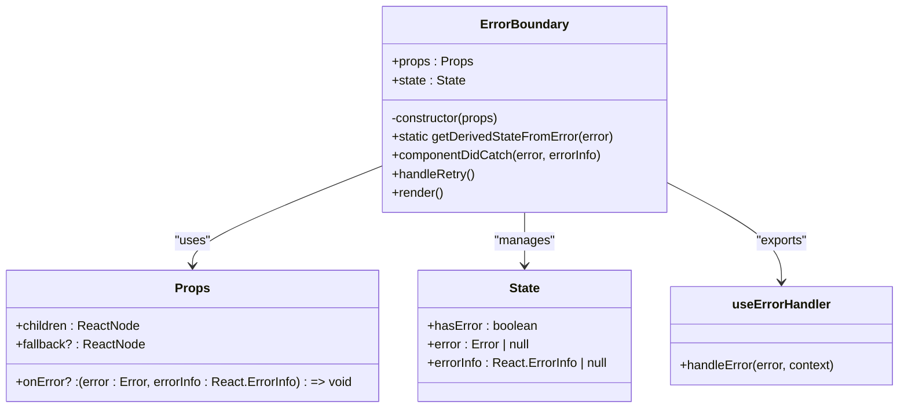
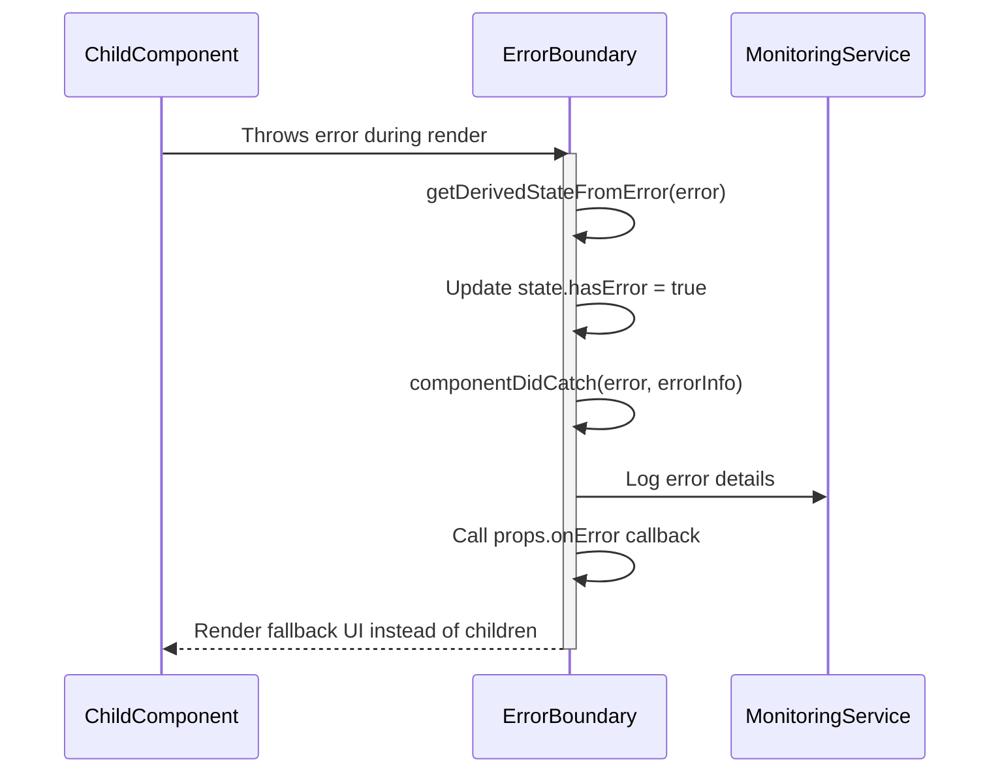
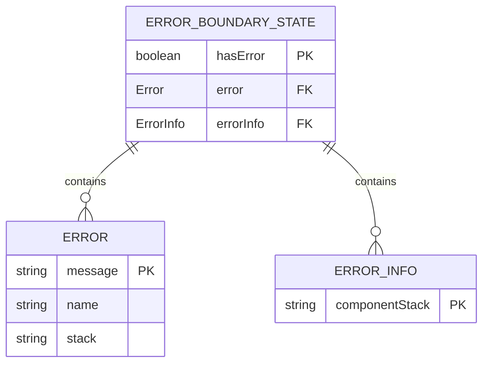
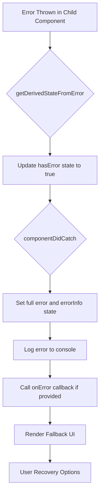
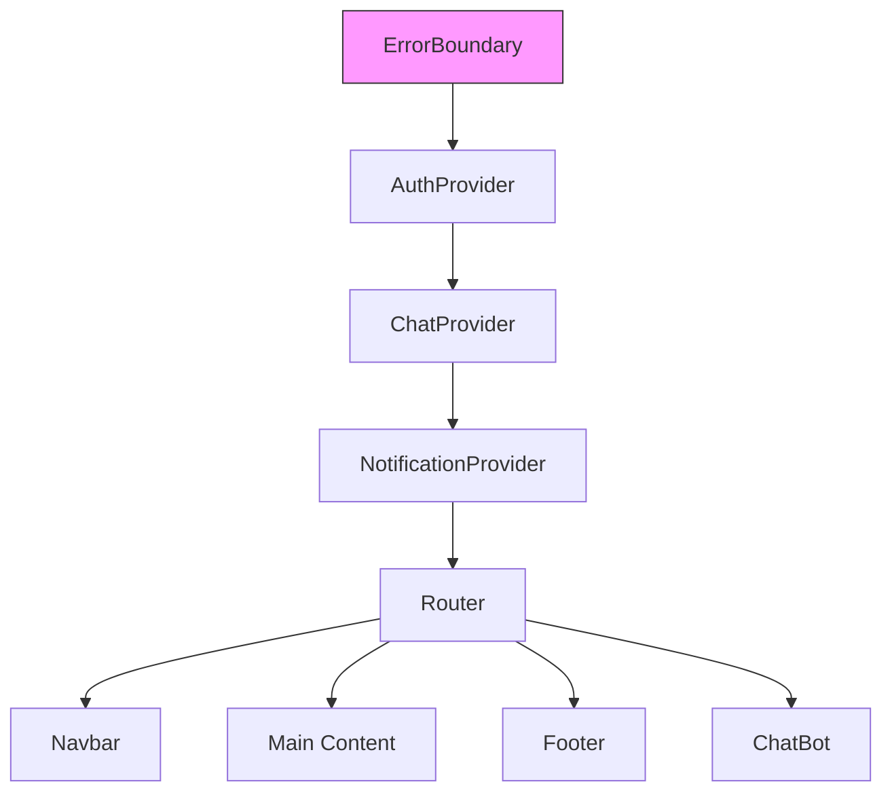
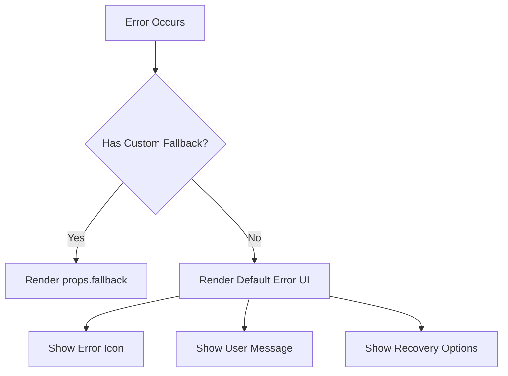
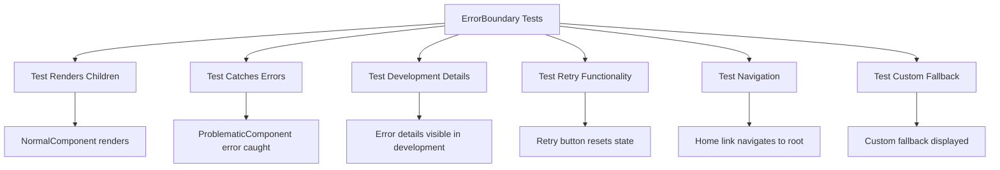
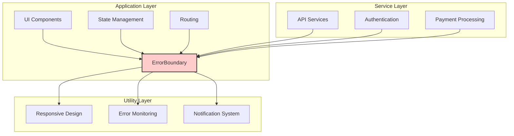

# Error Boundary Implementation

<cite>
**Referenced Files in This Document**   
- [ErrorBoundary.tsx](file://src/react-app/components/ErrorBoundary.tsx#L1-L146)
- [ErrorBoundary.test.tsx](file://src/react-app/components/__tests__/ErrorBoundary.test.tsx#L1-L138)
- [App.tsx](file://src/react-app/App.tsx#L26-L70)
- [responsive.ts](file://src/react-app/utils/responsive.ts#L1-L297)
</cite>

## Table of Contents
1. [Introduction](#introduction)
2. [Core Components](#core-components)
3. [Lifecycle Methods](#lifecycle-methods)
4. [State Management](#state-management)
5. [Error Handling Strategies](#error-handling-strategies)
6. [Integration with Monitoring Services](#integration-with-monitoring-services)
7. [Usage Examples](#usage-examples)
8. [Customizing Error Fallbacks](#customizing-error-fallbacks)
9. [Testing Strategy](#testing-strategy)
10. [Architecture Overview](#architecture-overview)

## Introduction
The ErrorBoundary component is a critical error handling mechanism in the HabibiStay React application. It serves as a safety net for uncaught JavaScript errors anywhere in the component tree, preventing the entire application from crashing when a single component fails. This documentation provides a comprehensive analysis of its implementation, covering lifecycle methods, state management, error handling strategies, and integration patterns.

The component follows React's error boundary pattern, using class-based components to catch errors during rendering, in lifecycle methods, and in constructors of the entire subtree. It provides both default and customizable fallback UIs, supports error monitoring integration, and offers user recovery options such as retrying or navigating home.

**Section sources**
- [ErrorBoundary.tsx](file://src/react-app/components/ErrorBoundary.tsx#L1-L146)

## Core Components

The ErrorBoundary implementation consists of a primary class component and a supporting hook for functional components. The core functionality revolves around React's error boundary lifecycle methods, state management for error conditions, and a well-designed fallback UI.



**Diagram sources**
- [ErrorBoundary.tsx](file://src/react-app/components/ErrorBoundary.tsx#L1-L146)

**Section sources**
- [ErrorBoundary.tsx](file://src/react-app/components/ErrorBoundary.tsx#L1-L146)

## Lifecycle Methods

The ErrorBoundary component implements two key React lifecycle methods that enable its error-catching capabilities:

1. **getDerivedStateFromError**: A static method that is called when an error is thrown in a descendant component. It receives the error as a parameter and returns a state update to trigger the fallback UI.

2. **componentDidCatch**: An instance method that is called after an error has been thrown and the error boundary has displayed the fallback UI. It receives both the error object and an error info object containing the component stack trace.



**Diagram sources**
- [ErrorBoundary.tsx](file://src/react-app/components/ErrorBoundary.tsx#L34-L54)

**Section sources**
- [ErrorBoundary.tsx](file://src/react-app/components/ErrorBoundary.tsx#L34-L54)

## State Management

The ErrorBoundary component maintains a simple but effective state structure to track error conditions and display appropriate error information. The state consists of three properties that work together to manage the error lifecycle.



The state management follows these principles:
- **hasError**: A boolean flag that determines whether the component is in an error state and should display the fallback UI instead of its children
- **error**: Stores the actual Error object thrown by the component tree, used for detailed error information
- **errorInfo**: Contains additional information about the error, particularly the component stack trace showing where the error occurred

The constructor initializes the state with default values, setting `hasError` to false and both error objects to null. When an error occurs, `getDerivedStateFromError` updates the state to set `hasError` to true and store the error object, while `componentDidCatch` updates the full error information including the component stack.

**Section sources**
- [ErrorBoundary.tsx](file://src/react-app/components/ErrorBoundary.tsx#L20-L32)

## Error Handling Strategies

The ErrorBoundary component implements a multi-layered error handling strategy that combines React's built-in error boundary capabilities with application-specific error management features.

### Primary Error Handling Flow


### Key Strategies Implemented

1. **Graceful Degradation**: When an error occurs, the component gracefully degrades to a user-friendly error screen instead of allowing the application to crash or display a blank page.

2. **Conditional Error Display**: The component provides different levels of error information based on the environment:
   - In development: Detailed error information including the error message and component stack trace
   - In production: Generic error message without exposing sensitive implementation details

3. **Recovery Mechanisms**: The component offers users two recovery options:
   - **Try Again**: Resets the error state, allowing the component tree to re-render
   - **Go Home**: Navigates the user back to the home page as a safe fallback

4. **Error Propagation**: While catching the error to prevent application crashes, the component still allows error information to be passed up through the optional `onError` callback prop for external error monitoring services.

**Section sources**
- [ErrorBoundary.tsx](file://src/react-app/components/ErrorBoundary.tsx#L56-L97)

## Integration with Monitoring Services

The ErrorBoundary component is designed to integrate seamlessly with external monitoring and error reporting services, providing hooks for comprehensive error tracking and analysis.

### Current Implementation
The component currently implements basic error logging to the console, which serves as a foundation for more sophisticated monitoring integration:

```typescript
componentDidCatch(error: Error, errorInfo: React.ErrorInfo) {
  this.setState({
    error,
    errorInfo
  });

  // Log error to monitoring service
  console.error('ErrorBoundary caught an error:', error, errorInfo);
  
  // Call optional error handler
  this.props.onError?.(error, errorInfo);
}
```

### Integration Points
The component provides multiple integration points for monitoring services:

1. **Console Logging**: The basic `console.error` call can be replaced or enhanced with calls to services like Sentry, Bugsnag, or Rollbar.

2. **onError Callback**: The optional `onError` prop allows parent components to receive error notifications and handle them according to their specific requirements.

3. **Development Mode Details**: The conditional rendering of error details in development mode facilitates debugging while maintaining security in production.

### Recommended Monitoring Integration
```typescript
// Example integration with Sentry
componentDidCatch(error: Error, errorInfo: React.ErrorInfo) {
  this.setState({
    error,
    errorInfo
  });

  // Send to Sentry
  Sentry.captureException(error, {
    extra: {
      componentStack: errorInfo.componentStack,
    },
    tags: {
      environment: process.env.NODE_ENV,
      component: 'ErrorBoundary'
    }
  });
  
  // Call optional error handler
  this.props.onError?.(error, errorInfo);
}
```

**Section sources**
- [ErrorBoundary.tsx](file://src/react-app/components/ErrorBoundary.tsx#L42-L54)

## Usage Examples

The ErrorBoundary component can be implemented in various ways throughout the application, from top-level wrapping to component-specific error handling.

### Top-Level Application Wrapper
The component is used as a top-level wrapper in the main App component, providing a safety net for the entire application:



**Diagram sources**
- [App.tsx](file://src/react-app/App.tsx#L26-L70)

### Basic Usage
```tsx
<ErrorBoundary>
  <ProblematicComponent />
</ErrorBoundary>
```

### With Custom Error Handler
```tsx
const handleError = (error: Error, errorInfo: React.ErrorInfo) => {
  // Send to custom error reporting service
  analytics.track('Component Error', {
    error: error.message,
    componentStack: errorInfo.componentStack,
    timestamp: new Date().toISOString()
  });
};

<ErrorBoundary onError={handleError}>
  <ProblematicComponent />
</ErrorBoundary>
```

### In Page Components
```tsx
function PropertyDetailPage() {
  return (
    <ErrorBoundary fallback={<PropertyLoadingError />}>
      <PropertyHeader />
      <PropertyGallery />
      <BookingWidget />
      <PropertyDescription />
      <ReviewsSection />
    </ErrorBoundary>
  );
}
```

**Section sources**
- [App.tsx](file://src/react-app/App.tsx#L1-L73)

## Customizing Error Fallbacks

The ErrorBoundary component provides flexible options for customizing the error fallback UI, allowing different error experiences based on context and user needs.

### Custom Fallback via Props
The component accepts a `fallback` prop that allows complete customization of the error UI:



**Diagram sources**
- [ErrorBoundary.tsx](file://src/react-app/components/ErrorBoundary.tsx#L56-L61)

### Implementation Examples

#### Minimal Fallback
```tsx
const MinimalFallback = (
  <div className="p-4 text-center text-red-600">
    <AlertTriangle className="w-6 h-6 mx-auto mb-2" />
    <p>Content failed to load</p>
  </div>
);

<ErrorBoundary fallback={MinimalFallback}>
  <SuspiciousComponent />
</ErrorBoundary>
```

#### Context-Specific Fallback
```tsx
const PaymentErrorFallback = () => (
  <div className="bg-red-50 p-6 rounded-lg">
    <h3 className="text-red-800 font-bold">Payment Processing Error</h3>
    <p className="text-red-700 mb-4">
      We couldn't process your payment. Please check your card details and try again.
    </p>
    <button 
      onClick={() => window.location.reload()}
      className="bg-red-600 text-white px-4 py-2 rounded"
    >
      Retry Payment
    </button>
  </div>
);

<ErrorBoundary fallback={<PaymentErrorFallback />}>
  <PaymentForm />
</ErrorBoundary>
```

#### Brand-Consistent Fallback
The default fallback UI demonstrates several customization aspects:
- Uses brand colors (blue #2957c3 for primary button)
- Implements responsive design through utility classes
- Provides clear user instructions
- Offers multiple recovery options
- Includes development-mode debugging information

The fallback UI leverages the responsive design system from `responsive.ts`, using utility functions like `cn()` for conditional class composition and predefined style constants for consistent UI patterns.

**Section sources**
- [ErrorBoundary.tsx](file://src/react-app/components/ErrorBoundary.tsx#L56-L97)
- [responsive.ts](file://src/react-app/utils/responsive.ts#L1-L297)

## Testing Strategy

The ErrorBoundary component is thoroughly tested with a comprehensive suite of unit tests that validate its core functionality and edge cases.



**Diagram sources**
- [ErrorBoundary.test.tsx](file://src/react-app/components/__tests__/ErrorBoundary.test.tsx#L1-L138)

The test suite covers the following scenarios:
- **Normal Operation**: Verifies that the component renders its children when no errors occur
- **Error Catching**: Confirms that the component catches errors from child components and displays the error UI
- **Development Mode**: Tests that detailed error information is shown only in development environment
- **Retry Functionality**: Ensures the retry button works correctly by resetting the error state
- **Navigation**: Validates that the home link navigates to the root path
- **Custom Fallbacks**: Confirms that custom fallback UI is displayed when provided via props

The tests use React Testing Library with Vitest, employing `BrowserRouter` to support the Link component, and include proper mocking of console.error to avoid noisy test output.

**Section sources**
- [ErrorBoundary.test.tsx](file://src/react-app/components/__tests__/ErrorBoundary.test.tsx#L1-L138)

## Architecture Overview

The ErrorBoundary component fits into the overall application architecture as a critical reliability layer that enhances user experience by preventing application crashes and providing graceful error recovery.



**Diagram sources**
- [ErrorBoundary.tsx](file://src/react-app/components/ErrorBoundary.tsx#L1-L146)
- [App.tsx](file://src/react-app/App.tsx#L1-L73)

The component serves as a bridge between the UI layer and utility services, catching errors from any component in the tree and providing a consistent interface for error reporting and user recovery. Its placement at the top level of the component hierarchy in App.tsx ensures comprehensive coverage, while its design allows for nested instances for more granular error handling when needed.