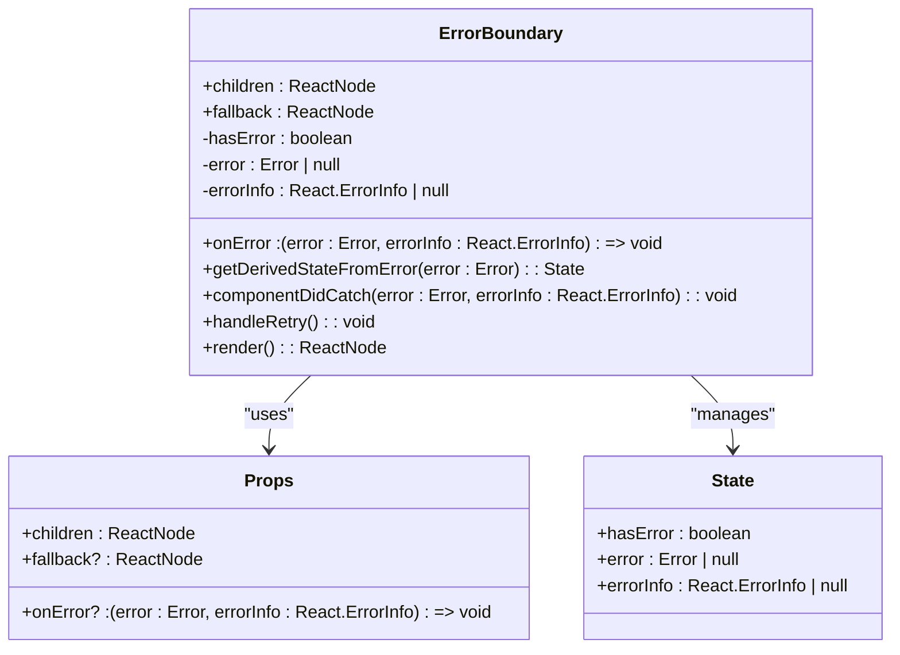
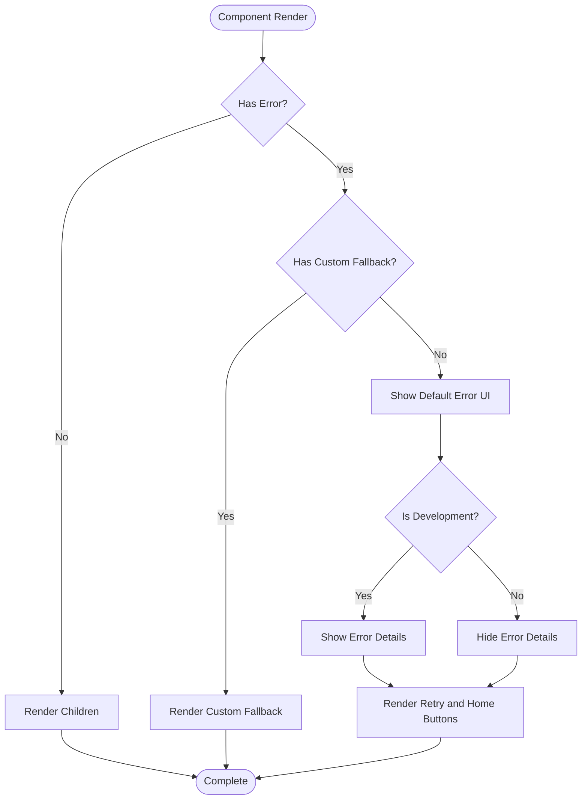
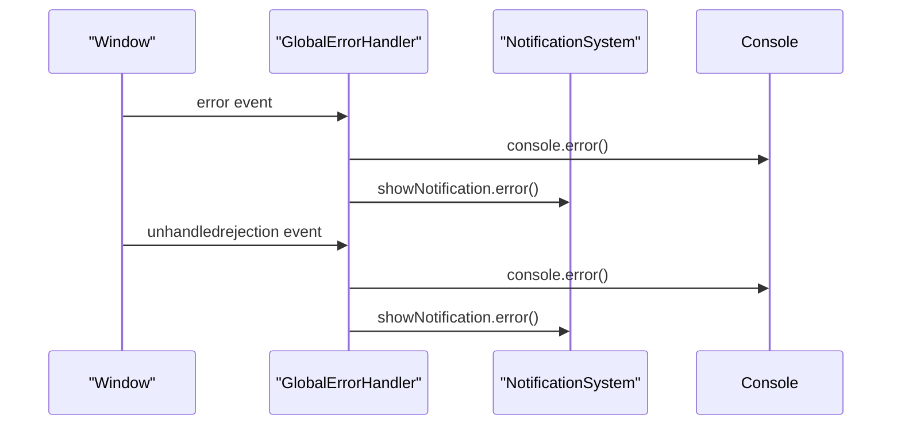
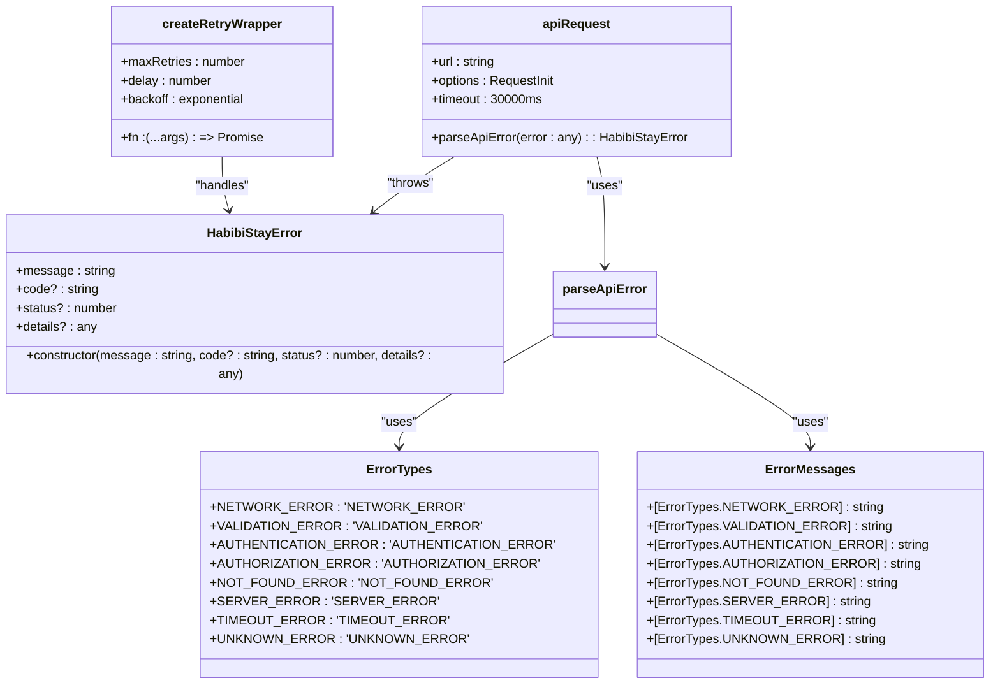
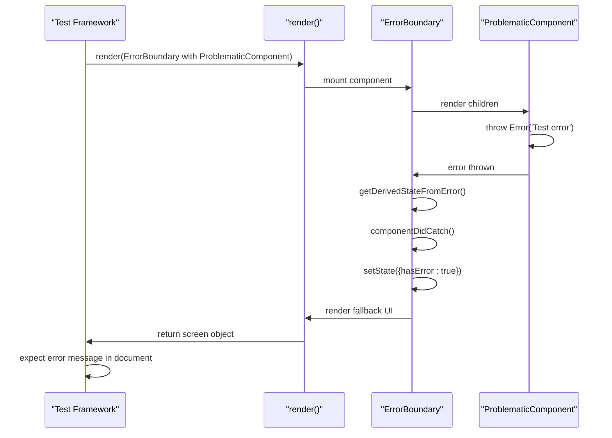

# Error Handling Patterns

<cite>
**Referenced Files in This Document**   
- [ErrorBoundary.tsx](file://src/react-app/components/ErrorBoundary.tsx)
- [ErrorBoundary.test.tsx](file://src/react-app/components/__tests__/ErrorBoundary.test.tsx)
- [errorHandling.ts](file://src/react-app/utils/errorHandling.ts)
- [globalErrorHandler.ts](file://src/react-app/utils/globalErrorHandler.ts)
</cite>

## Table of Contents
1. [Introduction](#introduction)
2. [Error Boundary Implementation](#error-boundary-implementation)
3. [Global Error Handling](#global-error-handling)
4. [API Error Handling](#api-error-handling)
5. [Error Reporting and Monitoring](#error-reporting-and-monitoring)
6. [Testing Error Scenarios](#testing-error-scenarios)
7. [Best Practices](#best-practices)

## Introduction
This document provides comprehensive documentation for the error handling patterns implemented in the HabibiStay application. The system employs a multi-layered approach to error management, combining React's error boundary mechanism with custom error handling utilities and global error listeners. The goal is to provide a robust, user-friendly experience while ensuring developers have sufficient information to diagnose and fix issues.

The error handling strategy includes:
- Component-level error boundaries to prevent UI crashes
- Custom error types for consistent error management
- API request wrappers with automatic error parsing
- Global handlers for uncaught exceptions and promise rejections
- User-friendly error messages and recovery options

**Section sources**
- [ErrorBoundary.tsx](file://src/react-app/components/ErrorBoundary.tsx#L1-L146)
- [errorHandling.ts](file://src/react-app/utils/errorHandling.ts#L1-L280)
- [globalErrorHandler.ts](file://src/react-app/utils/globalErrorHandler.ts#L1-L44)

## Error Boundary Implementation

The ErrorBoundary component is a React class component that implements the error boundary pattern to catch JavaScript errors anywhere in the component tree, log those errors, and display a fallback UI instead of crashing the entire application.



**Diagram sources**
- [ErrorBoundary.tsx](file://src/react-app/components/ErrorBoundary.tsx#L15-L146)

**Section sources**
- [ErrorBoundary.tsx](file://src/react-app/components/ErrorBoundary.tsx#L1-L146)

### Key Features

#### Error Detection and State Management
The ErrorBoundary uses React's lifecycle methods to detect and manage errors:

- `getDerivedStateFromError`: A static method that updates the component's state when an error is thrown in a child component. It sets `hasError` to true and stores the error object.
- `componentDidCatch`: A lifecycle method that captures additional error information (errorInfo) and optionally calls a user-provided error handler callback.

```typescript
static getDerivedStateFromError(error: Error): State {
  return {
    hasError: true,
    error,
    errorInfo: null
  };
}

componentDidCatch(error: Error, errorInfo: React.ErrorInfo) {
  this.setState({
    error,
    errorInfo
  });

  // Log error to monitoring service
  console.error('ErrorBoundary caught an error:', error, errorInfo);
  
  // Call optional error handler
  this.props.onError?.(error, errorInfo);
}
```

#### Fallback UI and Recovery Options
When an error occurs, the component renders a user-friendly fallback UI with recovery options:

- **Custom Fallback**: If a `fallback` prop is provided, it will be rendered instead of the default error UI.
- **Default Error UI**: Shows an error message with an alert icon and recovery buttons.
- **Retry Functionality**: Users can click "Try Again" to reset the error state and re-render the children.
- **Navigation Option**: Users can click "Go Home" to navigate to the root route.

In development mode, additional error details are displayed to help developers diagnose issues.



**Diagram sources**
- [ErrorBoundary.tsx](file://src/react-app/components/ErrorBoundary.tsx#L70-L140)

### Usage Examples

#### Basic Usage
The simplest way to use the ErrorBoundary is to wrap components that might throw errors:

```tsx
<ErrorBoundary>
  <ProblematicComponent />
</ErrorBoundary>
```

#### Custom Fallback
You can provide a custom fallback UI for specific error scenarios:

```tsx
<ErrorBoundary fallback={<div>Something went wrong with the booking form</div>}>
  <BookingForm />
</ErrorBoundary>
```

#### Error Callback
You can provide an error handler callback to perform additional actions when an error occurs:

```tsx
<ErrorBoundary onError={(error, errorInfo) => {
  // Send to analytics service
  analytics.track('ComponentError', { error, errorInfo });
}}>
  <CriticalComponent />
</ErrorBoundary>
```

## Global Error Handling

The global error handling system captures unhandled exceptions and promise rejections at the application level, ensuring that no error goes unreported.



**Diagram sources**
- [globalErrorHandler.ts](file://src/react-app/utils/globalErrorHandler.ts#L1-L44)

**Section sources**
- [globalErrorHandler.ts](file://src/react-app/utils/globalErrorHandler.ts#L1-L44)

### Implementation Details

The global error handler is implemented in `globalErrorHandler.ts` and sets up event listeners for two types of global errors:

1. **Window Errors**: Captures uncaught exceptions using `window.addEventListener('error')`
2. **Unhandled Promise Rejections**: Captures unhandled promise rejections using `window.addEventListener('unhandledrejection')`

```typescript
// Global error handler for uncaught exceptions
window.addEventListener('error', (event) => {
  console.error('Global error caught:', event.error);
  if (process.env.NODE_ENV === 'development') {
    showNotification.error('An unexpected error occurred. Check the console for details.');
  }
});

// Global error handler for unhandled promise rejections
window.addEventListener('unhandledrejection', (event) => {
  console.error('Unhandled promise rejection:', event.reason);
  if (process.env.NODE_ENV === 'development') {
    showNotification.error('An unexpected error occurred. Check the console for details.');
  }
});
```

### Notification Integration
The global error handler integrates with the application's notification system to provide user feedback when errors occur. It makes the `showNotification` function available globally for legacy code that might need to trigger notifications directly.

```typescript
// Make notification helpers available globally for legacy code
if (typeof window !== 'undefined') {
  (window as any).showNotification = (type: string, message: string) => {
    switch (type) {
      case 'success':
        showNotification.success(message);
        break;
      case 'error':
        showNotification.error(message);
        break;
      case 'warning':
        showNotification.warning(message);
        break;
      case 'info':
        showNotification.info(message);
        break;
      default:
        console.log(message);
    }
  };
}
```

## API Error Handling

The API error handling system provides a comprehensive solution for managing errors that occur during HTTP requests. It includes custom error types, error parsing, and retry mechanisms.



**Diagram sources**
- [errorHandling.ts](file://src/react-app/utils/errorHandling.ts#L1-L280)

**Section sources**
- [errorHandling.ts](file://src/react-app/utils/errorHandling.ts#L1-L280)

### Custom Error Types

The system defines a custom `HabibiStayError` class that extends the native JavaScript Error class with additional properties:

- `code`: A string identifier for the error type
- `status`: HTTP status code (for API errors)
- `details`: Additional error information

```typescript
export class HabibiStayError extends Error {
  public code?: string;
  public status?: number;
  public details?: any;

  constructor(message: string, code?: string, status?: number, details?: any) {
    super(message);
    this.name = 'HabibiStayError';
    this.code = code;
    this.status = status;
    this.details = details;
  }
}
```

### Error Type Classification

The system categorizes errors into specific types using the `ErrorTypes` enum:

```typescript
export const ErrorTypes = {
  NETWORK_ERROR: 'NETWORK_ERROR',
  VALIDATION_ERROR: 'VALIDATION_ERROR',
  AUTHENTICATION_ERROR: 'AUTHENTICATION_ERROR',
  AUTHORIZATION_ERROR: 'AUTHORIZATION_ERROR',
  NOT_FOUND_ERROR: 'NOT_FOUND_ERROR',
  SERVER_ERROR: 'SERVER_ERROR',
  TIMEOUT_ERROR: 'TIMEOUT_ERROR',
  UNKNOWN_ERROR: 'UNKNOWN_ERROR'
} as const;
```

### User-Friendly Error Messages

Each error type has a corresponding user-friendly message in the `ErrorMessages` object:

```typescript
export const ErrorMessages = {
  [ErrorTypes.NETWORK_ERROR]: 'Unable to connect to the server. Please check your internet connection.',
  [ErrorTypes.VALIDATION_ERROR]: 'Please check your input and try again.',
  [ErrorTypes.AUTHENTICATION_ERROR]: 'Please sign in to continue.',
  [ErrorTypes.AUTHORIZATION_ERROR]: 'You don\'t have permission to perform this action.',
  [ErrorTypes.NOT_FOUND_ERROR]: 'The requested resource could not be found.',
  [ErrorTypes.SERVER_ERROR]: 'A server error occurred. Please try again later.',
  [ErrorTypes.TIMEOUT_ERROR]: 'The request timed out. Please try again.',
  [ErrorTypes.UNKNOWN_ERROR]: 'An unexpected error occurred. Please try again.'
};
```

### API Request Wrapper

The `apiRequest` function is an enhanced fetch wrapper that handles common error scenarios:

- **Timeout Handling**: Uses AbortController to implement a 30-second timeout
- **Error Parsing**: Automatically parses API responses and converts them to `HabibiStayError` instances
- **JSON Handling**: Sets appropriate headers and parses JSON responses

```typescript
export async function apiRequest<T = any>(
  url: string,
  options: RequestInit = {}
): Promise<T> {
  const controller = new AbortController();
  const timeoutId = setTimeout(() => controller.abort(), 30000); // 30 second timeout

  try {
    const response = await fetch(url, {
      ...options,
      signal: controller.signal,
      headers: {
        'Content-Type': 'application/json',
        ...options.headers,
      },
    });

    clearTimeout(timeoutId);

    if (!response.ok) {
      throw {
        response: {
          status: response.status,
          data: await response.json().catch(() => ({}))
        }
      };
    }

    const data = await response.json();
    return data;
  } catch (error: any) {
    clearTimeout(timeoutId);

    if (error.name === 'AbortError') {
      throw new HabibiStayError(
        ErrorMessages[ErrorTypes.TIMEOUT_ERROR],
        ErrorTypes.TIMEOUT_ERROR
      );
    }

    throw parseApiError(error);
  }
}
```

### Retry Mechanism

The `createRetryWrapper` function provides an automatic retry mechanism for failed operations with exponential backoff:

```typescript
export function createRetryWrapper<T extends (...args: any[]) => Promise<any>>(
  fn: T,
  maxRetries: number = 3,
  delay: number = 1000
): T {
  return (async (...args: Parameters<T>): Promise<ReturnType<T>> => {
    let lastError: Error;

    for (let attempt = 1; attempt <= maxRetries; attempt++) {
      try {
        return await fn(...args);
      } catch (error) {
        lastError = error as Error;
        
        // Don't retry client errors (4xx) except for 429 (rate limit)
        if (error instanceof HabibiStayError && 
            error.status && 
            error.status >= 400 && 
            error.status < 500 && 
            error.status !== 429) {
          throw error;
        }

        if (attempt === maxRetries) {
          throw lastError;
        }

        // Exponential backoff
        const backoffDelay = delay * Math.pow(2, attempt - 1);
        await new Promise(resolve => setTimeout(resolve, backoffDelay));
      }
    }

    throw lastError!;
  }) as T;
}
```

## Error Reporting and Monitoring

The error handling system includes multiple mechanisms for reporting and monitoring errors:

### Component-Level Error Reporting
The ErrorBoundary component logs errors to the console and can optionally call a user-provided error handler:

```typescript
componentDidCatch(error: Error, errorInfo: React.ErrorInfo) {
  this.setState({
    error,
    errorInfo
  });

  // Log error to monitoring service
  console.error('ErrorBoundary caught an error:', error, errorInfo);
  
  // Call optional error handler
  this.props.onError?.(error, errorInfo);
}
```

### API Error Reporting
The API error handling system includes a hook for handling API errors with user notifications:

```typescript
export function useApiErrorHandler() {
  const { handleError } = useErrorHandler();
  const { showError } = useNotificationHelpers();

  const handleApiError = (error: unknown, context?: string) => {
    if (error instanceof HabibiStayError) {
      console.error(`API Error ${context ? `in ${context}` : ''}:`, {
        message: error.message,
        code: error.code,
        status: error.status,
        details: error.details
      });
      
      // Show user-friendly error notification
      showError('Error', error.message);
    } else {
      handleError(error as Error, context);
    }
  };

  return { handleApiError };
}
```

### Global Error Reporting
The global error handler captures unhandled exceptions and promise rejections:

```typescript
window.addEventListener('error', (event) => {
  console.error('Global error caught:', event.error);
  // In production, you might want to send this to your error reporting service
  if (process.env.NODE_ENV === 'development') {
    showNotification.error('An unexpected error occurred. Check the console for details.');
  }
});
```

### Notification System Integration
The error handling system integrates with the application's notification system to provide user feedback:

```typescript
export const showNotification = {
  success: (message: string) => {
    if (typeof window !== 'undefined' && (window as any).showNotification) {
      (window as any).showNotification('success', message);
    } else {
      console.log('✅ Success:', message);
    }
  },
  error: (message: string) => {
    if (typeof window !== 'undefined' && (window as any).showNotification) {
      (window as any).showNotification('error', message);
    } else {
      console.error('❌ Error:', message);
    }
  }
};
```

## Testing Error Scenarios

The error handling system includes comprehensive tests to ensure reliability and correctness.



**Diagram sources**
- [ErrorBoundary.test.tsx](file://src/react-app/components/__tests__/ErrorBoundary.test.tsx#L1-L138)

**Section sources**
- [ErrorBoundary.test.tsx](file://src/react-app/components/__tests__/ErrorBoundary.test.tsx#L1-L138)
- [errorHandling.test.ts](file://src/react-app/utils/__tests__/errorHandling.test.ts#L1-L327)

### ErrorBoundary Tests
The ErrorBoundary component is thoroughly tested with the following scenarios:

1. **Normal Operation**: Verifies that the component renders its children when no error occurs
2. **Error Catching**: Confirms that the component catches errors and displays the error UI
3. **Development Mode**: Tests that error details are shown in development mode
4. **Retry Functionality**: Ensures the retry button works correctly
5. **Navigation**: Verifies the home button navigates to the root route
6. **Custom Fallback**: Tests that a custom fallback UI is displayed when provided

```typescript
it('catches errors and displays error UI', () => {
  const consoleErrorSpy = vi.spyOn(console, 'error').mockImplementation(() => {});
  
  render(
    <BrowserRouter>
      <ErrorBoundary>
        <ProblematicComponent />
      </ErrorBoundary>
    </BrowserRouter>
  );
  
  expect(screen.getByText('Oops! Something went wrong')).toBeInTheDocument();
  expect(screen.getByText(/unexpected error/i)).toBeInTheDocument();
  
  consoleErrorSpy.mockRestore();
});
```

### Error Handling Utility Tests
The error handling utilities are tested with comprehensive unit tests:

1. **HabibiStayError**: Tests that the custom error class creates instances with correct properties
2. **Error Types**: Verifies that all error types are correctly defined
3. **Error Messages**: Confirms that user-friendly messages are correctly mapped to error types
4. **parseApiError**: Tests error parsing for various scenarios (network, authentication, validation, etc.)
5. **apiRequest**: Tests successful requests and various error scenarios
6. **createRetryWrapper**: Tests retry logic, backoff strategy, and exception handling
7. **extractValidationErrors**: Verifies validation error extraction from error objects

```typescript
it('should handle authentication errors', () => {
  const error = {
    response: {
      status: 401,
      data: { message: 'Unauthorized' }
    }
  };
  const result = parseApiError(error);
  
  expect(result).toBeInstanceOf(HabibiStayError);
  expect(result.code).toBe(ErrorTypes.AUTHENTICATION_ERROR);
  expect(result.status).toBe(401);
  expect(result.message).toBe('Unauthorized');
});
```

## Best Practices

### Component Error Boundaries
When implementing error boundaries in your components:

1. **Strategic Placement**: Place error boundaries around major sections of your UI rather than wrapping individual components
2. **Custom Fallbacks**: Provide meaningful custom fallbacks that guide users on what to do next
3. **Error Tracking**: Use the `onError` callback to send error information to your monitoring service
4. **Recovery Options**: Always provide recovery options like retry or navigation

```tsx
// Good: Wrapping a major section
<ErrorBoundary fallback={<BookingErrorState />} onError={logError}>
  <BookingFlow />
</ErrorBoundary>

// Avoid: Wrapping every small component
<ErrorBoundary><Button /></ErrorBoundary>
<ErrorBoundary><Input /></ErrorBoundary>
```

### API Error Handling
When making API requests:

1. **Use the Wrapper**: Always use `apiRequest` instead of raw fetch calls
2. **Handle Specific Errors**: Use `useApiErrorHandler` to handle API errors with appropriate user feedback
3. **Retry When Appropriate**: Use `createRetryWrapper` for operations that might succeed on retry
4. **Extract Validation Errors**: Use `extractValidationErrors` to display field-specific validation messages

```tsx
const { handleApiError } = useApiErrorHandler();

const submitForm = async (data) => {
  try {
    const result = await apiRequest('/api/bookings', {
      method: 'POST',
      body: JSON.stringify(data)
    });
    showNotification.success('Booking created successfully');
    return result;
  } catch (error) {
    handleApiError(error, 'submitForm');
    // Additional specific handling if needed
    if (error.code === ErrorTypes.VALIDATION_ERROR) {
      const fieldErrors = extractValidationErrors(error);
      setFieldErrors(fieldErrors);
    }
  }
};
```

### Global Error Considerations
For global error handling:

1. **Monitor Production**: In production, send global errors to your monitoring service rather than just showing notifications
2. **Graceful Degradation**: Design your application to continue functioning as much as possible after non-critical errors
3. **User Communication**: Always inform users when errors occur, even if the application can continue

```typescript
// In production, send to monitoring service
if (process.env.NODE_ENV === 'production') {
  Sentry.captureException(event.error);
  showNotification.error('An unexpected error occurred. Our team has been notified.');
}
```

### Testing Error Scenarios
When testing components that might throw errors:

1. **Test Error States**: Always test how your components behave when errors occur
2. **Verify Recovery**: Test that recovery mechanisms (retry, navigation) work correctly
3. **Check User Feedback**: Ensure that appropriate user feedback is provided
4. **Validate Error Logging**: Verify that errors are properly logged or reported

```tsx
it('displays validation errors in form', async () => {
  // Mock API to return validation error
  mockFetch.mockRejectedValueOnce({
    response: {
      status: 422,
      data: {
        errors: {
          email: 'Email is invalid',
          name: 'Name is required'
        }
      }
    }
  });

  render(<BookingForm />);

  // Fill form and submit
  await userEvent.type(screen.getByLabelText('Email'), 'invalid-email');
  await userEvent.click(screen.getByText('Submit'));

  // Verify error messages are displayed
  expect(screen.getByText('Email is invalid')).toBeInTheDocument();
  expect(screen.getByText('Name is required')).toBeInTheDocument();
});
```