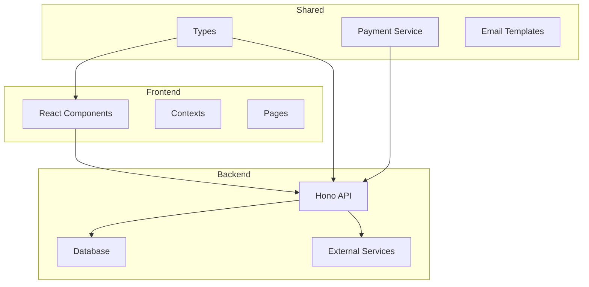
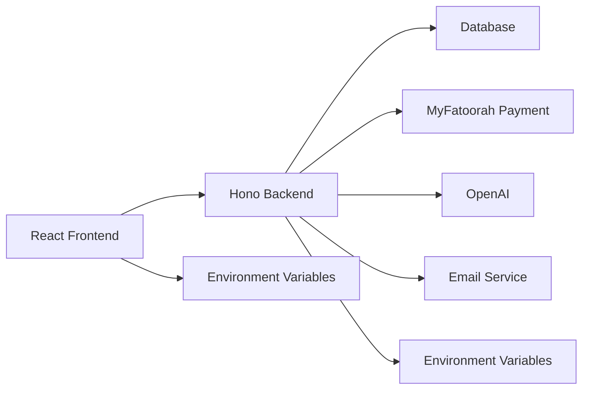
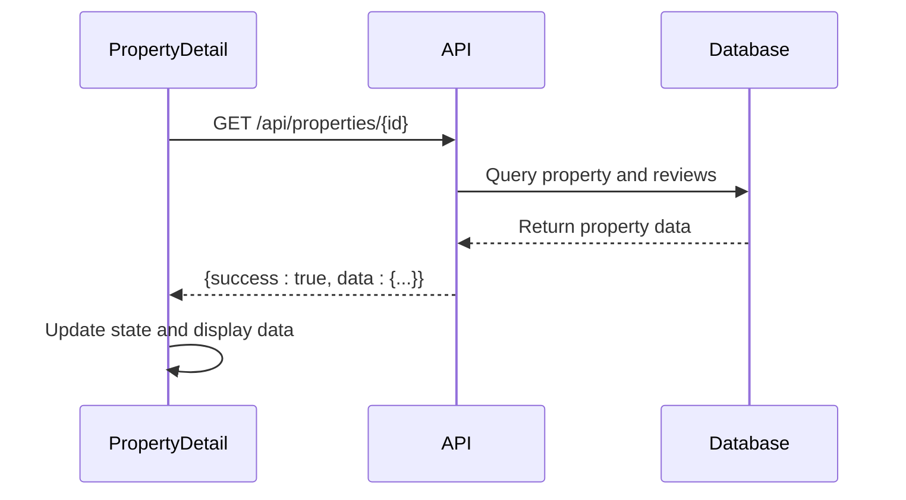
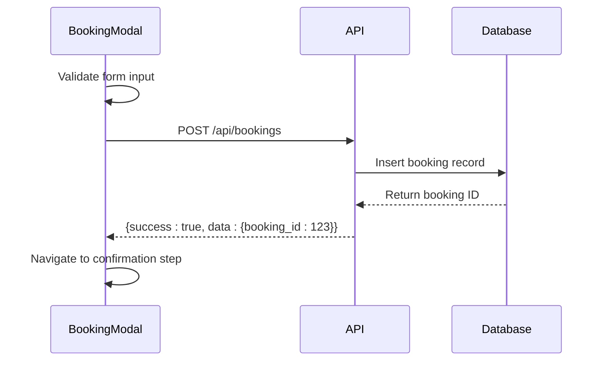
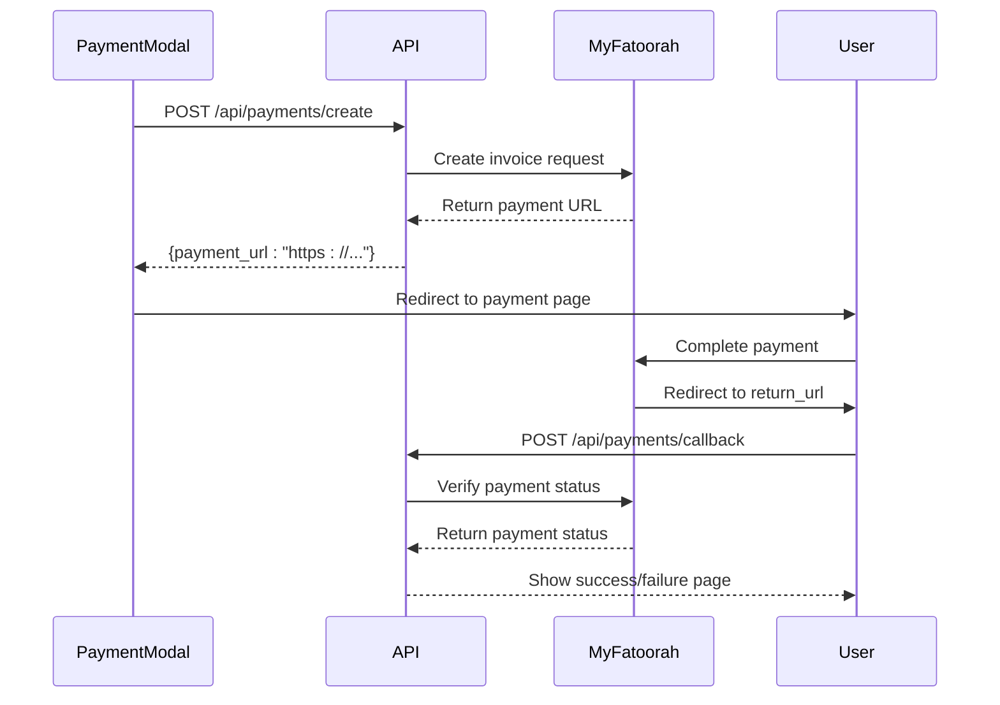
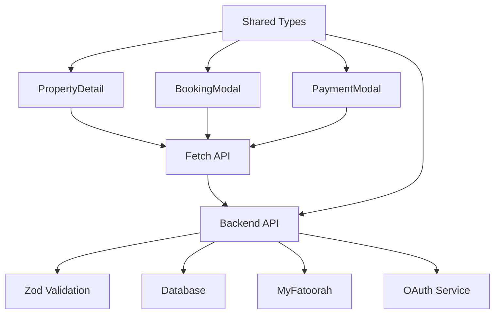

# API Integration Layer

<cite>
**Referenced Files in This Document**   
- [PropertyDetail.tsx](file://src/react-app/pages/PropertyDetail.tsx)
- [BookingModal.tsx](file://src/react-app/components/BookingModal.tsx)
- [index.ts](file://src/worker/index.ts)
- [types.ts](file://src/shared/types.ts)
- [payment.ts](file://src/shared/payment.ts)
- [vite.config.ts](file://vite.config.ts)
</cite>

## Table of Contents
1. [Introduction](#introduction)
2. [Project Structure](#project-structure)
3. [Core Components](#core-components)
4. [Architecture Overview](#architecture-overview)
5. [Detailed Component Analysis](#detailed-component-analysis)
6. [Dependency Analysis](#dependency-analysis)
7. [Performance Considerations](#performance-considerations)
8. [Troubleshooting Guide](#troubleshooting-guide)
9. [Conclusion](#conclusion)

## Introduction
This document provides a comprehensive analysis of the API integration layer in the HabibiStay application, focusing on how React components interact with a Hono-powered backend API. The system enables property browsing, booking management, and payment processing through a secure, well-structured API layer. Frontend components use fetch calls to communicate with backend endpoints, handling data retrieval, form submissions, authentication, and real-time updates. The integration leverages environment variables, type safety via Zod, and robust error handling to ensure reliability and maintainability.

## Project Structure
The project follows a modular architecture with clear separation between frontend, shared utilities, and backend worker logic. The frontend is built with React and Vite, while the backend runs on a Cloudflare Worker using Hono as the web framework. Shared types and utilities are used across both layers to ensure consistency.

**Diagram sources**
- [Project structure](file://src/react-app/pages/PropertyDetail.tsx)
- [Project structure](file://src/worker/index.ts)

**Section sources**
- [Project structure](file://src/react-app/pages/PropertyDetail.tsx)
- [Project structure](file://src/worker/index.ts)

## Core Components
The API integration is primarily handled by key components such as PropertyDetail and BookingModal, which demonstrate common patterns for data fetching, form submission, and state management. These components use the Fetch API to communicate with backend endpoints, manage loading states, handle errors gracefully, and update UI in response to API responses.

**Section sources**
- [PropertyDetail.tsx](file://src/react-app/pages/PropertyDetail.tsx#L0-L562)
- [BookingModal.tsx](file://src/react-app/components/BookingModal.tsx#L0-L474)

## Architecture Overview
The application follows a client-server architecture where the React frontend consumes RESTful APIs provided by a Hono backend running on Cloudflare Workers. The backend exposes endpoints for property data, bookings, payments, and user authentication. All API calls are type-safe using Zod schemas defined in shared types, ensuring consistency between frontend and backend.

**Diagram sources**
- [index.ts](file://src/worker/index.ts#L0-L2336)
- [vite.config.ts](file://vite.config.ts#L0-L22)

## Detailed Component Analysis

### PropertyDetail Component Analysis
The PropertyDetail component demonstrates a typical GET request pattern for retrieving property data. It uses useEffect to trigger data fetching when the component mounts or when route parameters change. The component manages loading states and handles errors gracefully.

**Diagram sources**
- [PropertyDetail.tsx](file://src/react-app/pages/PropertyDetail.tsx#L50-L150)
- [index.ts](file://src/worker/index.ts#L350-L400)

**Section sources**
- [PropertyDetail.tsx](file://src/react-app/pages/PropertyDetail.tsx#L0-L562)

### BookingModal Component Analysis
The BookingModal component handles the booking workflow, including form validation, submission, and navigation to payment processing. It demonstrates a POST request pattern for creating bookings and managing multi-step processes.

**Diagram sources**
- [BookingModal.tsx](file://src/react-app/components/BookingModal.tsx#L100-L200)
- [index.ts](file://src/worker/index.ts#L441-L479)

**Section sources**
- [BookingModal.tsx](file://src/react-app/components/BookingModal.tsx#L0-L474)

### Payment Integration Analysis
The payment flow integrates with MyFatoorah for secure payment processing. The PaymentModal component initiates payment creation, redirects to MyFatoorah's payment page, and handles callback processing upon return.

**Diagram sources**
- [PaymentModal.tsx](file://src/react-app/components/PaymentModal.tsx#L0-L49)
- [payment.ts](file://src/shared/payment.ts#L0-L166)
- [index.ts](file://src/worker/index.ts#L1113-L1152)

**Section sources**
- [PaymentModal.tsx](file://src/react-app/components/PaymentModal.tsx#L0-L474)
- [payment.ts](file://src/shared/payment.ts#L0-L166)

## Dependency Analysis
The API integration layer depends on several key modules and services. The frontend relies on shared types for type safety, while the backend uses Zod for request validation. The payment system depends on MyFatoorah's API, and authentication is handled through an external OAuth service.

**Diagram sources**
- [types.ts](file://src/shared/types.ts#L0-L600)
- [index.ts](file://src/worker/index.ts#L0-L2336)

**Section sources**
- [types.ts](file://src/shared/types.ts#L0-L600)
- [index.ts](file://src/worker/index.ts#L0-L2336)

## Performance Considerations
The API integration includes several performance optimizations:
- Loading states are displayed during data fetching to improve perceived performance
- Form validation is performed client-side to reduce unnecessary API calls
- Error handling prevents application crashes and provides user feedback
- Environment variables are used to manage API endpoints and configuration
- Type safety reduces runtime errors and improves development experience

The backend implements rate limiting (1000 requests per 15 minutes) and input validation to protect against abuse and ensure data integrity.

## Troubleshooting Guide
Common issues in the API integration layer and their solutions:

**Section sources**
- [PropertyDetail.tsx](file://src/react-app/pages/PropertyDetail.tsx#L100-L150)
- [index.ts](file://src/worker/index.ts#L100-L200)
- [payment.ts](file://src/shared/payment.ts#L100-L150)

## Conclusion
The API integration layer in HabibiStay demonstrates a robust, type-safe approach to frontend-backend communication. By leveraging React's useEffect and useState hooks, the frontend efficiently manages data fetching, form submission, and state updates. The Hono backend provides well-structured RESTful endpoints with comprehensive validation and error handling. Shared types ensure consistency across the stack, while environment variables enable flexible configuration. The payment integration with MyFatoorah follows secure redirect patterns, and authentication is handled through a dedicated OAuth service. This architecture provides a solid foundation for a scalable, maintainable application.