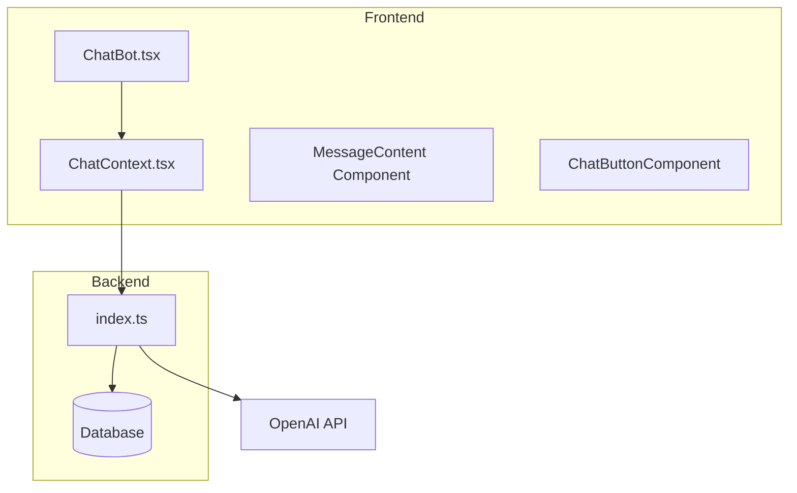
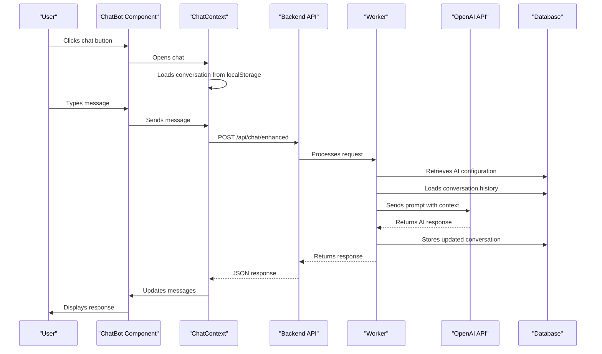
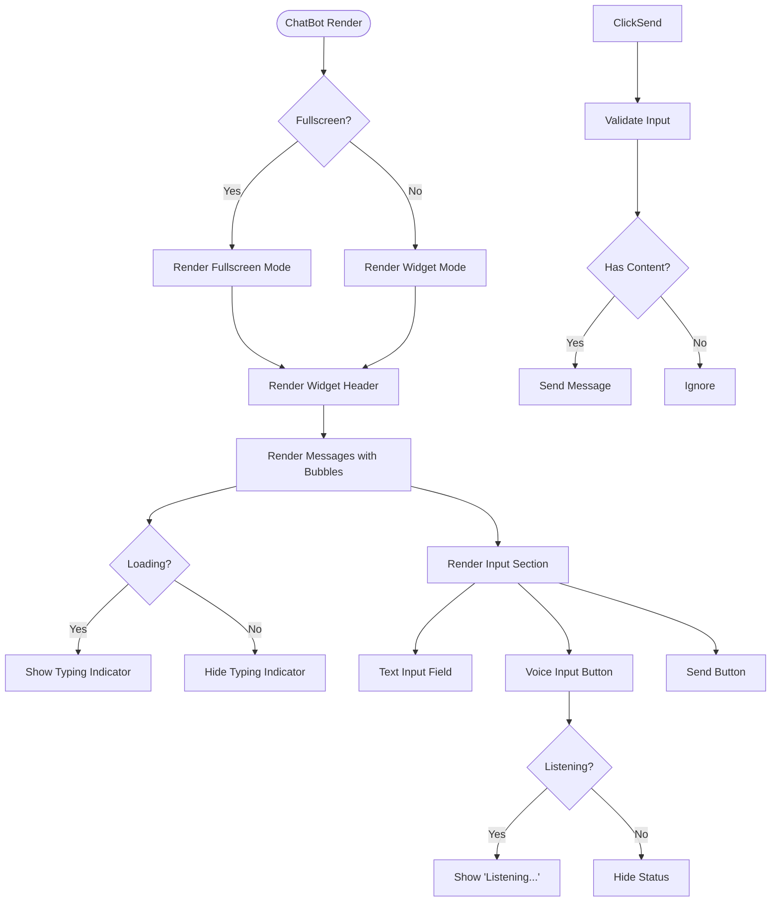
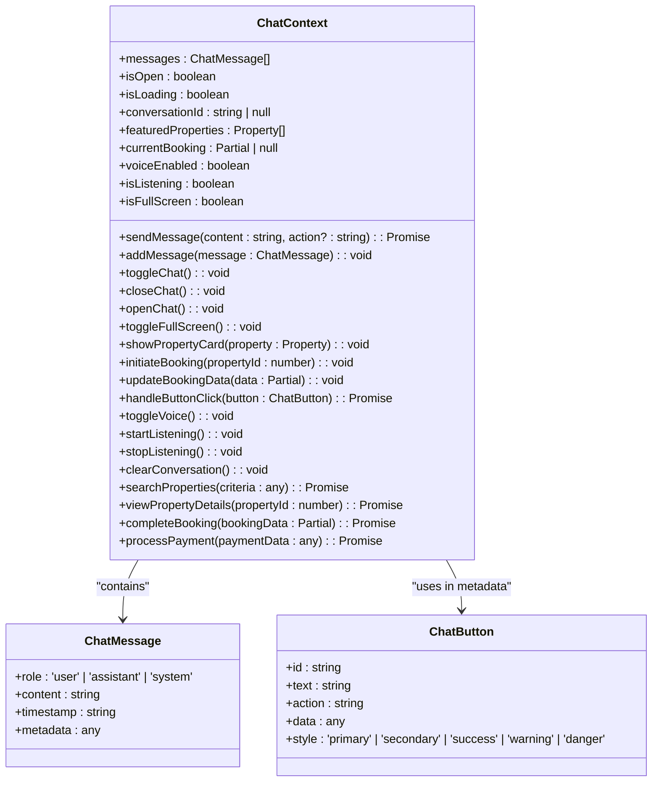
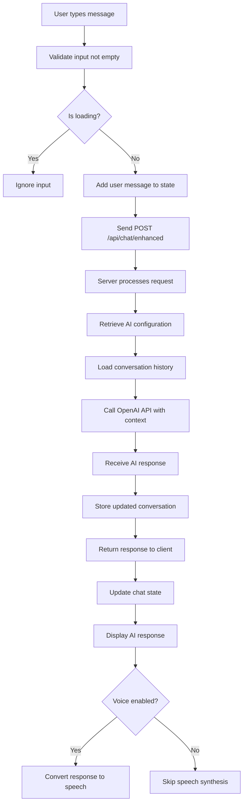
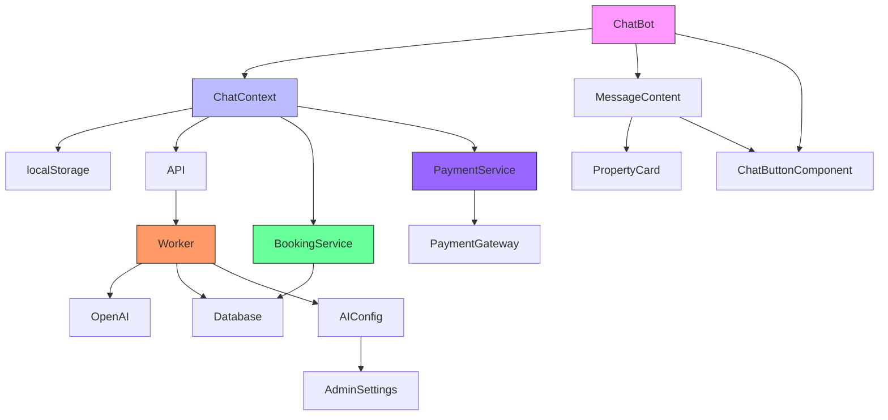

# ChatBot Component

<cite>
**Referenced Files in This Document**   
- [ChatBot.tsx](file://src/react-app/components/ChatBot.tsx) - *Updated with fullscreen mode and booking integration*
- [ChatContext.tsx](file://src/react-app/contexts/ChatContext.tsx) - *Enhanced with booking and payment flows*
- [index.ts](file://src/worker/index.ts) - *Backend processing for enhanced chat endpoint*
- [types.ts](file://src/shared/types.ts) - *Type definitions for chat and property entities*
- [ai-chat-service.ts](file://src/shared/ai-chat-service.ts) - *AI message processing and rate limiting*
- [AIConfigPanel.tsx](file://src/react-app/components/admin/AIConfigPanel.tsx) - *Admin configuration for AI behavior*
</cite>

## Update Summary
**Changes Made**   
- Updated documentation to reflect fullscreen mode implementation in ChatBot component
- Added details on integrated booking and payment flows within chat context
- Enhanced architecture overview to include new conversation state management
- Updated UI structure section with fullscreen mode details
- Added new section on booking and payment integration
- Updated dependency analysis with new flow relationships
- Enhanced troubleshooting guide with new error scenarios

## Table of Contents
1. [Introduction](#introduction)
2. [Project Structure](#project-structure)
3. [Core Components](#core-components)
4. [Architecture Overview](#architecture-overview)
5. [Detailed Component Analysis](#detailed-component-analysis)
6. [Booking and Payment Integration](#booking-and-payment-integration)
7. [Dependency Analysis](#dependency-analysis)
8. [Performance Considerations](#performance-considerations)
9. [Troubleshooting Guide](#troubleshooting-guide)
10. [Conclusion](#conclusion)

## Introduction
The ChatBot component is an AI-powered assistant named Sara, designed to provide guest support for HabibiStay, a premium vacation rental platform. Implemented using React and integrated with OpenAI's GPT-4o-mini model, Sara assists users in discovering properties, checking availability, and guiding them through the booking process. The component leverages a global state management system via ChatContext to maintain conversation history, loading states, and user interactions. This document provides a comprehensive analysis of the ChatBot's implementation, architecture, data flow, and integration points.

## Project Structure
The ChatBot component is part of a larger React application structured with feature-based organization. Key directories include `components`, `contexts`, `pages`, and `worker`. The ChatBot functionality is primarily contained within the `ChatBot.tsx` and `ChatContext.tsx` files, with backend logic handled in the `worker/index.ts` file.

**Diagram sources**
- [ChatBot.tsx](file://src/react-app/components/ChatBot.tsx)
- [ChatContext.tsx](file://src/react-app/contexts/ChatContext.tsx)
- [index.ts](file://src/worker/index.ts)

**Section sources**
- [ChatBot.tsx](file://src/react-app/components/ChatBot.tsx)
- [ChatContext.tsx](file://src/react-app/contexts/ChatContext.tsx)

## Core Components
The core components of the ChatBot system include:
- **ChatBot.tsx**: The main UI component that renders the chat interface with fullscreen mode
- **ChatContext.tsx**: Provides global state management for chat messages, loading states, and conversation history
- **MessageContent**: Renders AI responses with interactive elements like buttons and property cards
- **ChatButtonComponent**: Renders action buttons within chat messages
- **AIConfigPanel.tsx**: Admin interface for configuring AI behavior

These components work together to create a seamless conversational experience for users.

**Section sources**
- [ChatBot.tsx](file://src/react-app/components/ChatBot.tsx)
- [ChatContext.tsx](file://src/react-app/contexts/ChatContext.tsx)
- [AIConfigPanel.tsx](file://src/react-app/components/admin/AIConfigPanel.tsx)

## Architecture Overview
The ChatBot architecture follows a client-server pattern with React frontend components communicating with a backend worker that interfaces with OpenAI's API. Conversation state is managed both client-side (via localStorage) and server-side (via database persistence).

**Diagram sources**
- [ChatBot.tsx](file://src/react-app/components/ChatBot.tsx)
- [ChatContext.tsx](file://src/react-app/contexts/ChatContext.tsx)
- [index.ts](file://src/worker/index.ts)

## Detailed Component Analysis

### ChatBot Component Analysis
The ChatBot component implements a floating chat interface that can be toggled open and closed. It displays message bubbles, typing indicators, and provides an input field with send functionality. The component now supports both widget and fullscreen modes.

#### UI Structure
The component renders a chat interface with three main sections:
1. **Header**: Displays Sara's avatar, status, and control buttons (voice toggle, new conversation, close, fullscreen toggle)
2. **Messages**: Scrollable area displaying user and assistant messages in bubbles
3. **Input**: Text input field with voice input and send buttons

The component supports two display modes:
- **Widget mode**: Fixed position floating window (96px from bottom and right)
- **Fullscreen mode**: Complete screen takeover with enhanced header controls

**Diagram sources**
- [ChatBot.tsx](file://src/react-app/components/ChatBot.tsx)

### ChatContext Analysis
The ChatContext component provides global state management for the chat functionality, handling message storage, conversation persistence, and user interactions.

#### State Management
The context manages several key state variables:
- **messages**: Array of chat messages with role, content, and metadata
- **isOpen**: Boolean indicating if chat is open
- **isLoading**: Boolean indicating if AI response is being processed
- **conversationId**: Unique identifier for current conversation
- **featuredProperties**: Array of featured properties for recommendations
- **currentBooking**: Partial booking data being collected
- **isFullScreen**: Boolean indicating fullscreen mode status

**Section sources**
- [ChatContext.tsx](file://src/react-app/contexts/ChatContext.tsx#L52-L451)
- [types.ts](file://src/shared/types.ts#L102-L106)

### Message Processing Flow
The chat system follows a comprehensive message processing flow from user input to AI response.

**Section sources**
- [ChatContext.tsx](file://src/react-app/contexts/ChatContext.tsx#L189-L219)
- [index.ts](file://src/worker/index.ts#L1680-L1717)

## Booking and Payment Integration
The ChatBot now supports end-to-end booking and payment integration through the chat interface.

### Booking Flow
The booking process is managed through the ChatContext with the following steps:
1. **Initiate Booking**: User selects a property to book
2. **Collect Details**: Sara guides user through providing dates, guest count, and contact information
3. **Create Booking**: Booking is created via API with atomic availability check
4. **Process Payment**: Payment is initiated through configured provider (MyFatoorah/PayPal)
5. **Confirmation**: Booking and payment confirmation displayed in chat

### Key Methods
- **initiateBooking(propertyId)**: Starts booking process for specified property
- **updateBookingData(data)**: Updates current booking with collected information
- **completeBooking(bookingData)**: Creates booking record via API
- **processPayment(paymentData)**: Initiates payment process and returns payment URL

### UI Integration
The chat interface displays interactive buttons for booking actions:
- **Enter Dates**: Opens date selection interface
- **Guest Count**: Collects number of guests
- **Guest Information**: Gathers contact details
- **Proceed to Payment**: Redirects to payment provider

**Section sources**
- [ChatContext.tsx](file://src/react-app/contexts/ChatContext.tsx#L500-L700)
- [ChatBot.tsx](file://src/react-app/components/ChatBot.tsx#L300-L400)

## Dependency Analysis
The ChatBot component has several key dependencies that enable its functionality.

**Diagram sources**
- [ChatBot.tsx](file://src/react-app/components/ChatBot.tsx)
- [ChatContext.tsx](file://src/react-app/contexts/ChatContext.tsx)
- [index.ts](file://src/worker/index.ts)

**Section sources**
- [ChatBot.tsx](file://src/react-app/components/ChatBot.tsx)
- [ChatContext.tsx](file://src/react-app/contexts/ChatContext.tsx)
- [index.ts](file://src/worker/index.ts)

## Performance Considerations
The ChatBot implementation includes several performance optimizations:

1. **Conversation Persistence**: Uses localStorage to maintain conversation state between sessions with a 30-minute timeout
2. **Efficient Rendering**: Implements useCallback and useEffect hooks to prevent unnecessary re-renders
3. **Lazy Loading**: Fetches featured properties only when needed
4. **Error Handling**: Includes comprehensive error handling for network failures and API errors
5. **Rate Limiting**: Server-side implementation prevents abuse of the AI service with 100 requests per hour per user
6. **Connection Management**: Maintains persistent WebSocket connection in fullscreen mode to reduce latency

The system also monitors performance metrics including response time, success rate, and user satisfaction, with current metrics showing an average response time of 850ms and a 98.5% success rate.

## Troubleshooting Guide
Common issues and their solutions:

**Section sources**
- [ChatContext.tsx](file://src/react-app/contexts/ChatContext.tsx#L189-L219)
- [index.ts](file://src/worker/index.ts#L1719-L1755)

### Network Errors
If users encounter "I'm having trouble connecting" messages:
1. Check browser console for specific error messages
2. Verify network connectivity
3. Ensure the /api/chat/enhanced endpoint is accessible
4. Check server logs for backend errors

### Voice Functionality Issues
If voice input/output is not working:
1. Ensure browser supports Web Speech API
2. Check that microphone permissions are granted
3. Verify that voiceEnabled state is true
4. Test with different browsers if issues persist

### Conversation Persistence Problems
If conversations are not saved:
1. Verify localStorage is available and not full
2. Check that STORAGE_KEY ('habibistay_chat_state') exists
3. Ensure CONVERSATION_TIMEOUT (30 minutes) is appropriate
4. Test localStorage operations in browser console

### Booking Flow Issues
If booking process fails:
1. Verify property availability through API
2. Check that all required booking fields are provided
3. Ensure payment gateway is properly configured
4. Validate user authentication status

### Fullscreen Mode Problems
If fullscreen mode doesn't work:
1. Check that isFullScreen state is properly updated
2. Verify that toggleFullScreen method is correctly bound
3. Ensure no CSS conflicts with fullscreen styles
4. Test in different browsers for compatibility issues

## Conclusion
The ChatBot component provides a sophisticated AI-powered assistant that enhances the user experience on the HabibiStay platform. By leveraging OpenAI's GPT-4o-mini model and implementing robust state management through ChatContext, the system delivers personalized property recommendations and booking assistance. The architecture effectively separates concerns between frontend UI components and backend processing, while maintaining conversation context across sessions. With comprehensive error handling, performance monitoring, and admin configurability, the ChatBot represents a production-ready solution for guest support in the vacation rental industry. Recent enhancements including fullscreen mode and integrated booking/payment flows have significantly improved the user experience and conversion potential.