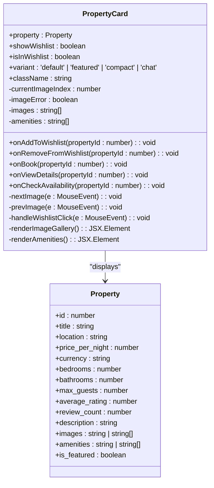
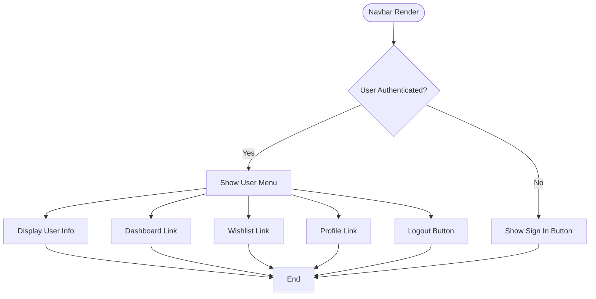
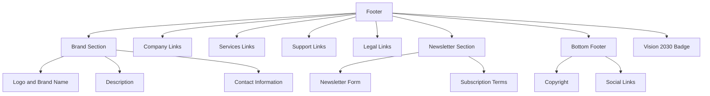
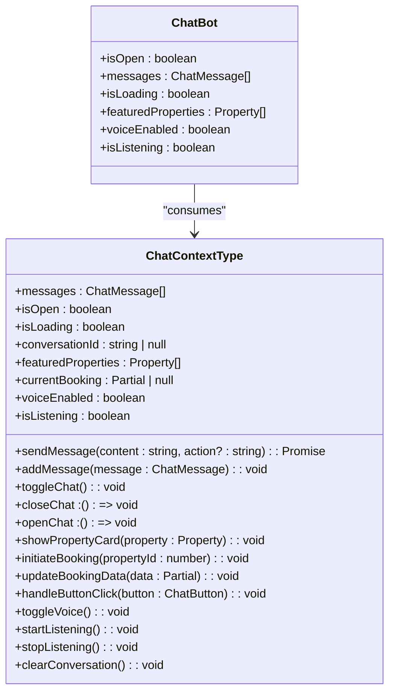
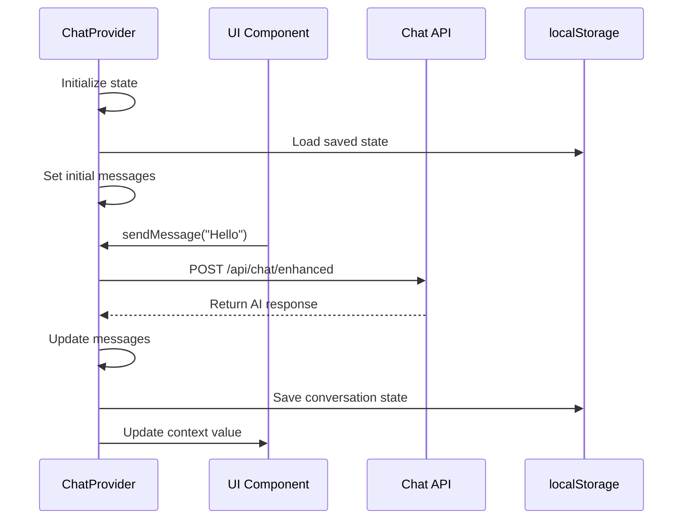
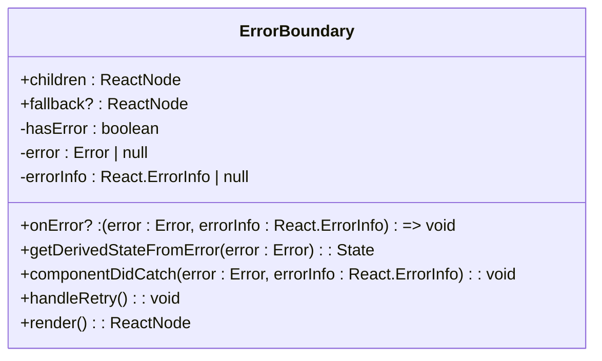
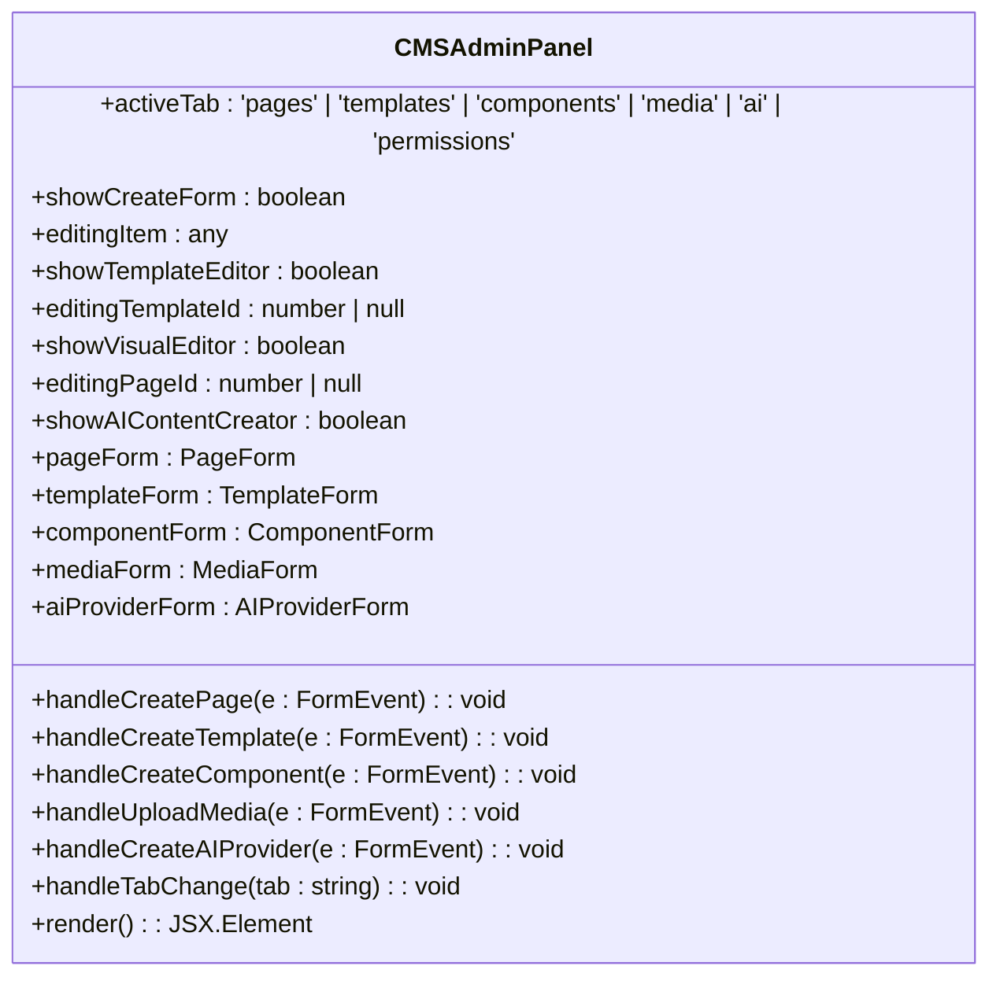
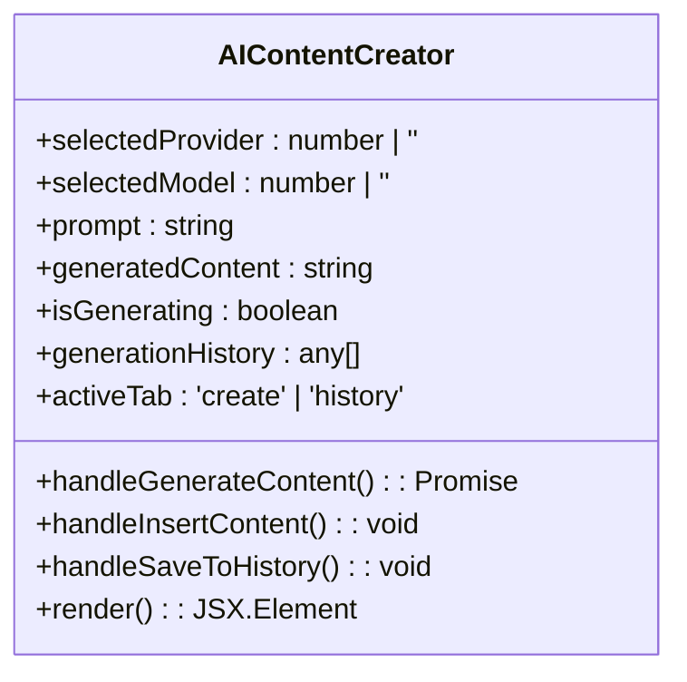
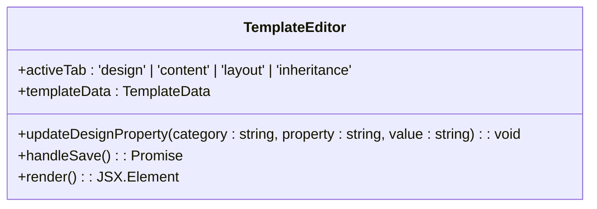
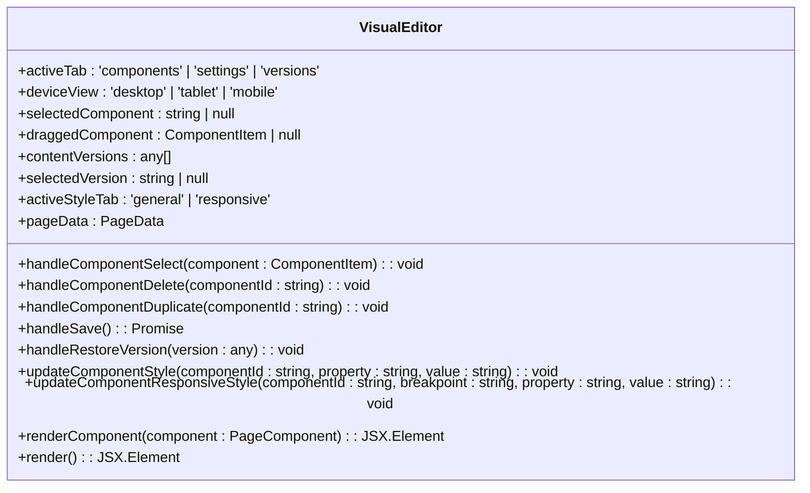

# Component Architecture

<cite>
**Referenced Files in This Document**   
- [PropertyCard.tsx](file://src/react-app/components/PropertyCard.tsx)
- [Navbar.tsx](file://src/react-app/components/Navbar.tsx)
- [Footer.tsx](file://src/react-app/components/Footer.tsx)
- [ChatBot.tsx](file://src/react-app/components/ChatBot.tsx)
- [ChatContext.tsx](file://src/react-app/contexts/ChatContext.tsx)
- [Home.tsx](file://src/react-app/pages/Home.tsx)
- [Stays.tsx](file://src/react-app/pages/Stays.tsx)
- [ErrorBoundary.tsx](file://src/react-app/components/ErrorBoundary.tsx) - *Added in recent commit*
- [LoadingStates.tsx](file://src/react-app/components/LoadingStates.tsx) - *Added in recent commit*
- [CMSAdminPanel.tsx](file://src/react-app/components/admin/CMSAdminPanel.tsx) - *Added in recent commit*
- [AIContentCreator.tsx](file://src/react-app/components/cms/AIContentCreator.tsx) - *Added in recent commit*
- [TemplateEditor.tsx](file://src/react-app/components/cms/TemplateEditor.tsx) - *Added in recent commit*
- [VisualEditor.tsx](file://src/react-app/components/cms/VisualEditor.tsx) - *Added in recent commit*
- [CMSContext.tsx](file://src/react-app/contexts/CMSContext.tsx) - *Added in recent commit*
</cite>

## Update Summary
**Changes Made**   
- Added new section for CMSAdminPanel component
- Added new section for AIContentCreator component
- Added new section for TemplateEditor component
- Added new section for VisualEditor component
- Added new section for CMSContext integration
- Updated Core Components Overview to include new CMS components
- Enhanced source tracking with new CMS-related file references
- Added documentation for content management system architecture and AI-powered content creation

## Table of Contents
1. [Introduction](#introduction)
2. [Core Components Overview](#core-components-overview)
3. [PropertyCard Component](#propertycard-component)
4. [Navbar Component](#navbar-component)
5. [Footer Component](#footer-component)
6. [ChatBot Component](#chatbot-component)
7. [Component Composition Patterns](#component-composition-patterns)
8. [Responsive Design Implementation](#responsive-design-implementation)
9. [Global State Management](#global-state-management)
10. [Accessibility Considerations](#accessibility-considerations)
11. [ErrorBoundary Component](#errorboundary-component)
12. [Loading States Components](#loading-states-components)
13. [CMSAdminPanel Component](#cmsadminpanel-component)
14. [AIContentCreator Component](#ai-content-creator-component)
15. [TemplateEditor Component](#template-editor-component)
16. [VisualEditor Component](#visual-editor-component)
17. [CMS Context Integration](#cms-context-integration)

## Introduction
This document provides a comprehensive analysis of the React component architecture for HabibiStay, a full-stack accommodation platform. The architecture centers around reusable UI components that maintain consistency across the application while supporting various use cases through flexible props and variants. The system leverages React's component model to create a maintainable and scalable codebase with clear separation of concerns between presentation and logic. Key components include PropertyCard for property listings, Navbar for navigation, Footer for site-wide information, ChatBot for AI-powered assistance, ErrorBoundary for error handling, LoadingStates for UX feedback, and a new suite of CMS components for content management. These components work together through shared types, context providers, and consistent design patterns to deliver a cohesive user experience.

## Core Components Overview
The application's UI architecture is built around ten primary components that serve distinct purposes while maintaining visual and functional consistency:

- **PropertyCard**: Displays property information with interactive elements for booking and details
- **Navbar**: Provides site navigation with authentication state awareness
- **Footer**: Contains site information, links, and newsletter functionality
- **ChatBot**: Offers AI-powered assistance through the Sara chat interface
- **ErrorBoundary**: Handles runtime errors with graceful fallback UI
- **LoadingStates**: Provides consistent loading, skeleton, and empty state components
- **CMSAdminPanel**: Central interface for managing website content and templates
- **AIContentCreator**: AI-powered content generation tool with multiple provider support
- **TemplateEditor**: Visual editor for creating and customizing page templates
- **VisualEditor**: Drag-and-drop page builder for creating content with responsive design

These components are designed with reusability in mind, using TypeScript interfaces to define clear contracts and supporting multiple variants for different contexts. The architecture follows React best practices with proper state management, event handling, and accessibility considerations.

**Section sources**
- [PropertyCard.tsx](file://src/react-app/components/PropertyCard.tsx)
- [Navbar.tsx](file://src/react-app/components/Navbar.tsx)
- [Footer.tsx](file://src/react-app/components/Footer.tsx)
- [ChatBot.tsx](file://src/react-app/components/ChatBot.tsx)
- [ErrorBoundary.tsx](file://src/react-app/components/ErrorBoundary.tsx)
- [LoadingStates.tsx](file://src/react-app/components/LoadingStates.tsx)
- [CMSAdminPanel.tsx](file://src/react-app/components/admin/CMSAdminPanel.tsx)
- [AIContentCreator.tsx](file://src/react-app/components/cms/AIContentCreator.tsx)
- [TemplateEditor.tsx](file://src/react-app/components/cms/TemplateEditor.tsx)
- [VisualEditor.tsx](file://src/react-app/components/cms/VisualEditor.tsx)

## PropertyCard Component

### Design Principles and Implementation
The PropertyCard component serves as the primary interface for displaying property listings throughout the application. It follows a card-based design pattern with a consistent layout that includes property images, details, amenities, pricing, and action buttons.



**Diagram sources**
- [PropertyCard.tsx](file://src/react-app/components/PropertyCard.tsx#L30-L425)
- [types.ts](file://src/shared/types.ts#L1-L50)

### Props Interface and Variants
The PropertyCard component accepts a comprehensive set of props that define its behavior and appearance:

```typescript
interface PropertyCardProps {
  property: Property;
  showWishlist?: boolean;
  isInWishlist?: boolean;
  onAddToWishlist?: (propertyId: number) => void;
  onRemoveFromWishlist?: (propertyId: number) => void;
  onBook: (propertyId: number) => void;
  onViewDetails: (propertyId: number) => void;
  onCheckAvailability?: (propertyId: number) => void;
  variant?: 'default' | 'featured' | 'compact' | 'chat';
  className?: string;
}
```

The component supports four variants:
- **default**: Standard card layout used in property listings
- **featured**: Enhanced version with additional contact information
- **compact**: Simplified version for space-constrained layouts
- **chat**: Specialized version for use within the chat interface

### Usage in Home and Stays Pages
The PropertyCard is used extensively in both the Home and Stays pages to display property listings. In the Home page, it shows featured properties:

```tsx
// Home.tsx usage
{featuredProperties.map((property) => (
  <PropertyCard key={property.id} property={property} />
))}
```

In the Stays page, it displays search results with full functionality:

```tsx
// Stays.tsx usage
{properties.map((property) => (
  <PropertyCard key={property.id} property={property} />
))}
```

The component handles dynamic data binding through the Property interface, which includes fields for title, location, price, bedrooms, bathrooms, and other property details. Amenities are displayed using icon mapping for common amenities like WiFi, parking, and pool.

**Section sources**
- [PropertyCard.tsx](file://src/react-app/components/PropertyCard.tsx#L30-L425)
- [Home.tsx](file://src/react-app/pages/Home.tsx#L150-L162)
- [Stays.tsx](file://src/react-app/pages/Stays.tsx#L450-L454)

## Navbar Component

### Authentication State Handling
The Navbar component dynamically renders content based on the user's authentication state using the useAuth hook from the @getmocha/users-service/react package. When a user is authenticated, the navbar displays user information, dashboard link, wishlist, profile, and logout button. For unauthenticated users, it shows a "Sign In" button that triggers the login flow.



**Diagram sources**
- [Navbar.tsx](file://src/react-app/components/Navbar.tsx#L1-L221)

### Responsive Design Implementation
The Navbar implements responsive design patterns using Tailwind CSS classes to adapt to different screen sizes:

- **Desktop view**: Full navigation menu and user menu displayed horizontally
- **Mobile view**: Hamburger menu that expands to show navigation and user options

The component uses the `md:block` and `md:hidden` classes to control visibility based on screen size, and maintains a sticky position at the top of the viewport with `sticky top-0 z-50`.

```tsx
// Desktop navigation
<div className="hidden md:block">
  <div className="ml-10 flex items-baseline space-x-4">
    {navigation.map((item) => (
      <Link
        key={item.name}
        to={item.href}
        className={`px-3 py-2 rounded-md text-sm font-medium transition-colors ${
          isActive(item.href)
            ? 'text-[#2957c3] bg-blue-50'
            : 'text-gray-700 hover:text-[#2957c3] hover:bg-gray-50'
        }`}
      >
        {item.name}
      </Link>
    ))}
  </div>
</div>

// Mobile menu button
<div className="md:hidden">
  <button
    onClick={() => setIsOpen(!isOpen)}
    className="inline-flex items-center justify-center p-2 rounded-md text-gray-400 hover:text-gray-500 hover:bg-gray-100"
  >
    {isOpen ? <X className="block h-6 w-6" /> : <Menu className="block h-6 w-6" />}
  </button>
</div>
```

**Section sources**
- [Navbar.tsx](file://src/react-app/components/Navbar.tsx#L1-L221)

## Footer Component

### Structure and Content Organization
The Footer component is organized into multiple sections for optimal information hierarchy:



**Diagram sources**
- [Footer.tsx](file://src/react-app/components/Footer.tsx#L1-L283)

### Newsletter Functionality
The Footer includes a NewsletterForm component that handles email subscription with proper state management and form validation:

```tsx
function NewsletterForm() {
  const [email, setEmail] = useState('');
  const [isSubmitting, setIsSubmitting] = useState(false);
  const [isSubmitted, setIsSubmitted] = useState(false);

  const handleSubmit = async (e: React.FormEvent) => {
    e.preventDefault();
    if (!email) return;

    setIsSubmitting(true);
    
    try {
      const response = await fetch('/api/newsletter/subscribe', {
        method: 'POST',
        headers: {
          'Content-Type': 'application/json',
        },
        body: JSON.stringify({ email, source: 'footer' }),
      });

      const data = await response.json();

      if (data.success) {
        setIsSubmitted(true);
        setEmail('');
        setTimeout(() => setIsSubmitted(false), 3000);
      } else {
        alert(data.error || 'Failed to subscribe');
      }
    } catch (error) {
      console.error('Newsletter subscription error:', error);
      alert('Failed to subscribe. Please try again.');
    } finally {
      setIsSubmitting(false);
    }
  };
}
```

The form provides visual feedback during submission and success states, enhancing user experience.

**Section sources**
- [Footer.tsx](file://src/react-app/components/Footer.tsx#L1-L283)

## ChatBot Component

### Integration with ChatContext
The ChatBot component relies on the ChatContext for state management and functionality. The context provides essential data and methods:



**Diagram sources**
- [ChatContext.tsx](file://src/react-app/contexts/ChatContext.tsx#L15-L105)
- [ChatBot.tsx](file://src/react-app/components/ChatBot.tsx#L1-L50)

### Property Display Functionality
The ChatBot integrates with PropertyCard through the showPropertyCard function in ChatContext, which creates a message with property metadata that renders as a PropertyCard with variant="chat":

```tsx
const showPropertyCard = useCallback((property: Property) => {
  const propertyMessage: ChatMessage = {
    role: 'assistant',
    content: `Here's detailed information about ${property.title}:`,
    timestamp: new Date().toISOString(),
    metadata: {
      type: 'property_card',
      property,
      buttons: [
        { id: 'book_property', text: '🏠 Book This Property', action: 'book', style: 'primary', data: { property_id: property.id } },
        { id: 'check_availability', text: '📅 Check Availability', action: 'availability', style: 'secondary', data: { property_id: property.id } },
        { id: 'view_details', text: '👁️ View Full Details', action: 'view_details', style: 'secondary', data: { property_id: property.id } },
        { id: 'add_wishlist', text: '❤️ Add to Wishlist', action: 'wishlist', style: 'secondary', data: { property_id: property.id } },
      ],
    },
  };
  
  addMessage(propertyMessage);
}, [addMessage]);
```

This approach allows the chat interface to display property information in a consistent format while maintaining the interactive capabilities of the PropertyCard component.

**Section sources**
- [ChatContext.tsx](file://src/react-app/contexts/ChatContext.tsx#L280-L318)
- [PropertyCard.tsx](file://src/react-app/components/PropertyCard.tsx#L400-L425)

## Component Composition Patterns

### Reusable Variants
The application implements a pattern of creating specialized variants of core components through wrapper components:

```tsx
// PropertyCard variants
export const FeaturedPropertyCard = (props: Omit<PropertyCardProps, 'variant'>) => (
  <PropertyCard {...props} variant="featured" />
);

export const CompactPropertyCard = (props: Omit<PropertyCardProps, 'variant'>) => (
  <PropertyCard {...props} variant="compact" />
);

export const ChatPropertyCard = (props: Omit<PropertyCardProps, 'variant'>) => (
  <PropertyCard {...props} variant="chat" />
);
```

This pattern allows for consistent styling and behavior while reducing code duplication.

### Conditional Rendering
Components use conditional rendering extensively to show different content based on props and state:

```tsx
// PropertyCard conditional rendering
{property.is_featured && variant === 'featured' && (
  <div className="border-t border-gray-100 pt-2">
    {/* Quick contact information */}
  </div>
)}

// Navbar authentication state
{user ? (
  // User menu
) : (
  // Sign in button
)}
```

### Dynamic Data Binding
Components bind to dynamic data through props and state, with PropertyCard handling potential JSON string inputs:

```tsx
const images = React.useMemo(() => {
  if (Array.isArray(property.images)) return property.images;
  if (typeof property.images === 'string') {
    try {
      return JSON.parse(property.images) || [];
    } catch {
      return [];
    }
  }
  return [];
}, [property.images]);
```

**Section sources**
- [PropertyCard.tsx](file://src/react-app/components/PropertyCard.tsx#L65-L85)
- [PropertyCard.tsx](file://src/react-app/components/PropertyCard.tsx#L385-L425)
- [Navbar.tsx](file://src/react-app/components/Navbar.tsx#L80-L140)

## Responsive Design Implementation

### Tailwind CSS Strategy
The application uses Tailwind CSS for responsive design with a mobile-first approach:

```tsx
// Example from PropertyCard
<div className={clsx(
  'bg-white border border-gray-200 rounded-lg shadow-sm overflow-hidden transition-all duration-200',
  {
    'hover:shadow-md': variant !== 'chat',
    'cursor-pointer': variant !== 'chat',
    'max-w-sm': variant === 'compact',
    'w-full': variant === 'chat',
  },
  className
)}>
```

Breakpoints are used to adapt layouts:
- **Default**: Mobile layout
- **md:** (768px+): Desktop layout for navigation
- **lg:** (1024px+): Enhanced desktop layout

### Component-Specific Responsiveness
Each component implements responsive patterns appropriate to its context:

- **PropertyCard**: Adjusts image height and text size based on variant
- **Navbar**: Switches between hamburger menu (mobile) and full menu (desktop)
- **Footer**: Changes from single column to multi-column layout on larger screens

```tsx
// Footer responsive grid
<div className="grid grid-cols-1 md:grid-cols-2 lg:grid-cols-6 gap-8">
  {/* Content sections */}
</div>
```

**Section sources**
- [PropertyCard.tsx](file://src/react-app/components/PropertyCard.tsx#L232-L245)
- [Navbar.tsx](file://src/react-app/components/Navbar.tsx#L1-L221)
- [Footer.tsx](file://src/react-app/components/Footer.tsx#L100-L110)

## Global State Management

### ChatContext Implementation
The ChatContext provides global state management for the chat functionality using React's Context API:



**Diagram sources**
- [ChatContext.tsx](file://src/react-app/contexts/ChatContext.tsx#L1-L452)

### State Persistence
The ChatContext implements state persistence using localStorage to maintain conversation history:

```tsx
// Load state from localStorage
useEffect(() => {
  const savedState = localStorage.getItem(STORAGE_KEY);
  if (savedState) {
    try {
      const { messages: savedMessages, conversationId: savedId, timestamp } = JSON.parse(savedState);
      
      // Check if conversation is still valid
      if (timestamp && Date.now() - timestamp < CONVERSATION_TIMEOUT) {
        setMessages(savedMessages || []);
        setConversationId(savedId);
      } else {
        // Clear expired conversation
        localStorage.removeItem(STORAGE_KEY);
      }
    } catch (error) {
      console.error('Error loading chat state:', error);
      localStorage.removeItem(STORAGE_KEY);
    }
  }
}, []);

// Save state to localStorage
useEffect(() => {
  saveConversationState();
}, [saveConversationState]);
```

The context also manages voice recognition and speech synthesis capabilities when available in the browser.

**Section sources**
- [ChatContext.tsx](file://src/react-app/contexts/ChatContext.tsx#L100-L150)
- [ChatContext.tsx](file://src/react-app/contexts/ChatContext.tsx#L160-L180)

## Accessibility Considerations

### Semantic HTML and ARIA
Components use semantic HTML elements and ARIA attributes to enhance accessibility:

```tsx
// Navbar uses proper semantic elements
<nav className="bg-white shadow-sm border-b border-gray-100 sticky top-0 z-50">
  <div className="max-w-7xl mx-auto px-4 sm:px-6 lg:px-8">
    <div className="flex justify-between items-center h-16">
      {/* Logo */}
      <div className="flex-shrink-0">
        <Link to="/" className="flex items-center space-x-2">
          
          <span className="text-xl font-bold text-[#2957c3]">HabibiStay</span>
        </Link>
      </div>
    </div>
  </div>
</nav>
```

### Keyboard Navigation
Interactive elements are designed to be keyboard accessible:

- **PropertyCard**: Clickable card with proper click handling
- **Navbar**: Focusable links and buttons with visible focus states
- **ChatBot**: Accessible form controls and message navigation

### Screen Reader Support
Components include appropriate alt text, labels, and ARIA attributes:

```tsx
// PropertyCard image with dynamic alt text
 setImageError(true)}
/>
```

The application follows accessibility best practices to ensure usability for all users, including those using assistive technologies.

**Section sources**
- [PropertyCard.tsx](file://src/react-app/components/PropertyCard.tsx#L130-L135)
- [Navbar.tsx](file://src/react-app/components/Navbar.tsx#L1-L221)
- [Footer.tsx](file://src/react-app/components/Footer.tsx#L1-L283)

## ErrorBoundary Component

### Global Error Handling Strategy
The ErrorBoundary component provides a robust error handling mechanism that prevents the entire application from crashing when a component fails to render. It uses React's error boundary pattern to catch JavaScript errors anywhere in the child component tree, log those errors, and display a fallback UI.



**Diagram sources**
- [ErrorBoundary.tsx](file://src/react-app/components/ErrorBoundary.tsx#L1-L146)

### Implementation Details
The ErrorBoundary implements the standard React error boundary pattern with additional features:

```typescript
interface Props {
  children: ReactNode;
  fallback?: ReactNode;
  onError?: (error: Error, errorInfo: React.ErrorInfo) => void;
}

interface State {
  hasError: boolean;
  error: Error | null;
  errorInfo: React.ErrorInfo | null;
}
```

The component uses `getDerivedStateFromError` to set state when an error is detected and `componentDidCatch` to log the error and call the optional error handler. In development mode, it displays detailed error information including the component stack.

```tsx
// Default error UI
return (
  <div className="min-h-screen bg-gray-50 flex items-center justify-center">
    <div className={containers.narrow}>
      <div className={cn(
        responsiveClasses.card.base,
        responsiveClasses.card.padding,
        'text-center'
      )}>
        <div className="mb-6">
          <AlertTriangle className="w-16 h-16 text-red-500 mx-auto mb-4" />
          <h1 className={cn(
            responsiveClasses.text.h2,
            'text-gray-900 mb-2'
          )}>
            Oops! Something went wrong
          </h1>
          <p className={cn(
            responsiveClasses.text.body,
            'text-gray-600 mb-6'
          )}>
            We encountered an unexpected error. Please try refreshing the page or contact support if the problem persists.
          </p>
        </div>

        {/* Error details in development */}
        {process.env.NODE_ENV === 'development' && this.state.error && (
          <div className="mb-6 p-4 bg-gray-100 rounded-lg text-left">
            <h3 className="font-semibold text-gray-900 mb-2">Error Details:</h3>
            <pre className="text-xs text-red-600 whitespace-pre-wrap overflow-x-auto">
              {this.state.error.toString()}
              {this.state.errorInfo?.componentStack}
            </pre>
          </div>
        )}

        <div className={cn(
          responsiveClasses.button.group,
          'justify-center'
        )}>
          <button
            onClick={this.handleRetry}
            className={cn(
              utils.touchButton,
              utils.focusVisible,
              'bg-[#2957c3] text-white px-6 py-3 rounded-lg font-semibold hover:bg-blue-700 transition-colors inline-flex items-center'
            )}
          >
            <RefreshCw className="w-4 h-4 mr-2" />
            Try Again
          </button>
          <Link
            to="/"
            className={cn(
              utils.touchButton,
              utils.focusVisible,
              'border border-gray-300 text-gray-700 px-6 py-3 rounded-lg font-semibold hover:bg-gray-50 transition-colors inline-flex items-center'
            )}
          >
            <Home className="w-4 h-4 mr-2" />
            Go Home
          </Link>
        </div>
      </div>
    </div>
  </div>
);
```

The component provides two recovery options: "Try Again" to reset the error state and attempt to re-render the component tree, and "Go Home" to navigate to the main page.

**Section sources**
- [ErrorBoundary.tsx](file://src/react-app/components/ErrorBoundary.tsx#L1-L146)

## Loading States Components

### Comprehensive Loading State System
The LoadingStates module provides a suite of components for handling various loading scenarios throughout the application. This ensures a consistent user experience during data fetching, processing, and network operations.

```mermaid
classDiagram
class LoadingSpinner {
+size? : 'sm' | 'md' | 'lg' | 'xl'
+className? : string
+color? : 'primary' | 'white' | 'gray'
+render() : JSX.Element
}
class LoadingState {
+type? : 'page' | 'section' | 'inline' | 'overlay'
+message? : string
+size? : 'sm' | 'md' | 'lg'
+className? : string
+render() : JSX.Element
}
class Skeleton {
+className? : string
+variant? : 'text' | 'circular' | 'rectangular'
+width? : string | number
+height? : string | number
+lines? : number
+render() : JSX.Element
}
class EmptyState {
+icon? : React.ReactNode
+title : string
+description? : string
+action? : { label : string, onClick : () => void }
+className? : string
+render() : JSX.Element
}
class NetworkError {
+onRetry? : () => void
+className? : string
+render() : JSX.Element
}
class PropertyCardSkeleton {
+render() : JSX.Element
}
class FormFieldSkeleton {
+render() : JSX.Element
}
```

**Diagram sources**
- [LoadingStates.tsx](file://src/react-app/components/LoadingStates.tsx#L1-L325)

### Component Variants and Usage
The LoadingStates module includes several specialized components for different use cases:

#### LoadingSpinner
A basic animated spinner that can be customized by size and color:

```tsx
<LoadingSpinner size="md" color="primary" />
```

#### LoadingState
A higher-level component that provides different loading UI patterns:

```tsx
// Full page loading
<LoadingState type="page" message="Loading your properties..." />

// Section loading
<LoadingState type="section" message="Fetching data..." />

// Inline loading
<LoadingState type="inline" message="Saving..." />

// Overlay loading
<LoadingState type="overlay" message="Processing your request..." />
```

#### Skeleton Components
Provide visual placeholders that maintain layout during loading:

```tsx
// Text skeleton with multiple lines
<Skeleton variant="text" lines={3} />

// Circular skeleton (for avatars)
<Skeleton variant="circular" width={40} height={40} />

// Property card skeleton for consistent loading states
<PropertyCardSkeleton />

// Form field skeleton
<FormFieldSkeleton />
```

#### Empty and Error States
Handle cases where no data is available or network issues occur:

```tsx
// Empty state with action
<EmptyState 
  title="No properties found"
  description="Try adjusting your search criteria"
  action={{ label: "Clear Filters", onClick: handleClearFilters }}
/>

// Network error state
<NetworkError onRetry={handleRetry} />
```

These components use consistent styling through the responsiveClasses and utils from the shared utilities, ensuring visual harmony across the application.

**Section sources**
- [LoadingStates.tsx](file://src/react-app/components/LoadingStates.tsx#L1-L325)

## CMSAdminPanel Component

### Central Content Management Interface
The CMSAdminPanel component serves as the central hub for managing all aspects of the website's content, templates, and AI integrations. It provides a comprehensive interface for administrators to create and manage pages, templates, components, media, and AI-powered content generation.



**Diagram sources**
- [CMSAdminPanel.tsx](file://src/react-app/components/admin/CMSAdminPanel.tsx#L1-L1141)

### Tab-Based Navigation System
The CMSAdminPanel implements a tab-based navigation system that organizes content management functionality into logical categories:

- **Pages**: Create, edit, and manage website pages with status tracking (draft, published, archived)
- **Templates**: Manage page templates with design inheritance and content structure configuration
- **Components**: Create and manage reusable UI components with type-specific properties
- **Media**: Upload and manage media assets with metadata and alt text
- **AI**: Configure AI providers, generate content, and process AI jobs
- **Permissions**: Manage user permissions and access control for CMS features

The component uses React state to manage the active tab and form visibility, providing a seamless user experience when switching between different content management tasks.

```tsx
// Tab navigation
<div className="mb-6 border-b border-gray-200">
  <nav className="-mb-px flex space-x-8">
    {tabs.map((tab) => {
      const Icon = tab.icon;
      return (
        <button
          key={tab.key}
          onClick={() => handleTabChange(tab.key as any)}
          className={`flex items-center py-3 px-1 border-b-2 font-medium text-sm ${
            activeTab === tab.key
              ? 'border-[#2957c3] text-[#2957c3]'
              : 'border-transparent text-gray-500 hover:text-gray-700 hover:border-gray-300'
          }`}
        >
          <Icon className="w-5 h-5 mr-2" />
          {tab.label}
        </button>
      );
    })}
  </nav>
</div>
```

**Section sources**
- [CMSAdminPanel.tsx](file://src/react-app/components/admin/CMSAdminPanel.tsx#L1-L1141)

## AI Content Creator Component

### AI-Powered Content Generation
The AIContentCreator component provides a user-friendly interface for generating content using AI models from various providers. It allows users to create content by providing a prompt and selecting an AI provider and model.



**Diagram sources**
- [AIContentCreator.tsx](file://src/react-app/components/cms/AIContentCreator.tsx#L1-L351)

### Content Generation Workflow
The AIContentCreator implements a multi-step workflow for content generation:

1. **Provider and Model Selection**: Users select an AI provider (e.g., OpenAI, Anthropic) and a specific model
2. **Prompt Input**: Users enter a detailed prompt describing the desired content
3. **Content Generation**: The component sends the prompt to the selected AI model and displays a loading state
4. **Content Review**: Generated content is displayed with options to save to history, copy to clipboard, or insert into the current context
5. **History Management**: Users can view and reuse previously generated content

The component uses the CMSContext to access available AI providers and models, and handles the content generation process with proper error handling and loading states.

```tsx
// Content generation handler
const handleGenerateContent = async () => {
  if (!selectedProvider || !selectedModel || !prompt) return;
  
  setIsGenerating(true);
  
  try {
    const job = await createAIJob({
      provider_id: Number(selectedProvider),
      model_id: Number(selectedModel),
      prompt,
      content: '',
      metadata: JSON.stringify({
        task_type: 'content_generation',
        created_at: new Date().toISOString()
      })
    });
    
    if (job) {
      // Simulate content generation (in a real app, this would be handled by a background process)
      setTimeout(() => {
        const mockContent = `This is AI-generated content based on your prompt: "${prompt}". 
        
In a real implementation, this would be replaced with actual content generated by the selected AI model (${aiModels.find(m => m.id === selectedModel)?.name}).`;
        
        setGeneratedContent(mockContent);
        setIsGenerating(false);
        
        // Add to history
        setGenerationHistory(prev => [{
          id: Date.now(),
          provider: aiProviders.find(p => p.id === selectedProvider)?.name,
          model: aiModels.find(m => m.id === selectedModel)?.name,
          prompt,
          content: mockContent,
          timestamp: new Date().toISOString()
        }, ...prev]);
      }, 2000);
    }
  } catch (error) {
    console.error('Failed to generate content:', error);
    setIsGenerating(false);
  }
};
```

**Section sources**
- [AIContentCreator.tsx](file://src/react-app/components/cms/AIContentCreator.tsx#L1-L351)

## Template Editor Component

### Visual Template Design
The TemplateEditor component provides a comprehensive interface for creating and customizing page templates with visual design controls. It allows users to define template properties, design settings, content structure, and inheritance relationships.



**Diagram sources**
- [TemplateEditor.tsx](file://src/react-app/components/cms/TemplateEditor.tsx#L1-L769)

### Design Customization Features
The TemplateEditor offers extensive design customization options organized into multiple tabs:

- **Design Tab**: Configure color schemes, typography, and spacing
- **Layout Tab**: Define the structural layout of the template with header, main content, sidebar, and footer
- **Content Structure Tab**: Define the content sections and custom fields for the template
- **Inheritance Tab**: Set up template inheritance with parent templates and responsive design controls

The component uses nested state objects to manage design properties and provides real-time preview of changes. It supports template inheritance, allowing child templates to inherit properties from parent templates while allowing overrides.

```tsx
// Design property update
const updateDesignProperty = (category: string, property: string, value: string) => {
  setTemplateData(prev => ({
    ...prev,
    design: {
      ...prev.design,
      [category]: {
        ...prev.design[category as keyof typeof prev.design],
        [property]: value
      }
    }
  }));
};
```

**Section sources**
- [TemplateEditor.tsx](file://src/react-app/components/cms/TemplateEditor.tsx#L1-L769)

## Visual Editor Component

### Drag-and-Drop Page Builder
The VisualEditor component implements a drag-and-drop interface for creating and editing pages using pre-defined components. It provides a WYSIWYG (What You See Is What You Get) experience for content creation.



**Diagram sources**
- [VisualEditor.tsx](file://src/react-app/components/cms/VisualEditor.tsx#L1-L849)

### Responsive Design Controls
The VisualEditor includes comprehensive responsive design controls that allow users to create content that adapts to different screen sizes:

- **Device Preview**: Toggle between desktop, tablet, and mobile views to preview content
- **Component Settings**: Configure general and responsive styles for selected components
- **Content Versioning**: Save and restore previous versions of content with comments
- **Component Library**: Drag and drop components from a library to build pages

The component uses a canvas-based interface with real-time rendering of components and supports responsive styling with different properties for mobile, tablet, and desktop breakpoints.

```tsx
// Responsive style update
const updateComponentResponsiveStyle = (componentId: string, breakpoint: string, property: string, value: string) => {
  setPageData(prev => ({
    ...prev,
    components: prev.components.map(comp => 
      comp.id === componentId 
        ? { 
            ...comp, 
            responsive: {
              ...comp.responsive,
              [breakpoint]: {
                ...comp.responsive?.[breakpoint],
                [property]: value
              }
            }
          } 
        : comp
    )
  }));
};
```

**Section sources**
- [VisualEditor.tsx](file://src/react-app/components/cms/VisualEditor.tsx#L1-L849)

## CMS Context Integration

### Central State Management for CMS
The CMSContext provides global state management for all CMS-related functionality using React's Context API. It serves as the single source of truth for content management operations and data.

```mermaid
classDiagram
class CMSContextType {
+pages : Page[]
+templates : Template[]
+components : Component[]
+media : Media[]
+aiProviders : AIProvider[]
+aiModels : AIModel[]
+aiJobs : AIContentJob[]
+loading : boolean
+error : string | null
+fetchPages() : Promise<void>
+fetchTemplates() : Promise<void>
+fetchComponents() : Promise<void>
+fetchMedia() : Promise<void>
+fetchAIProviders() : Promise<void>
+fetchAIModels(providerId : number) : Promise<void>
+fetchAIJobs() : Promise<void>
+refreshAIModels(providerId : number) : Promise<void>
+processAIJobs() : Promise<void>
+createPage(page : Omit<Page, 'id' | 'created_at' | 'updated_at'>) : Promise<Page | null>
+updatePage(id : number, page : Partial<Page>) : Promise<Page | null>
+deletePage(id : number) : Promise<boolean>
+createTemplate(template : Omit<Template, 'id' | 'created_at' | 'updated_at'>) : Promise<Template | null>
+updateTemplate(id : number, template : Partial<Template>) : Promise<Template | null>
+deleteTemplate(id : number) : Promise<boolean>
+createComponent(component : Omit<Component, 'id' | 'created_at' | 'updated_at'>) : Promise<Component | null>
+updateComponent(id : number, component : Partial<Component>) : Promise<Component | null>
+deleteComponent(id : number) : Promise<boolean>
+uploadMedia(media : Omit<Media, 'id' | 'created_at'>) : Promise<Media | null>
+deleteMedia(id : number) : Promise<boolean>
+createAIProvider(provider : Omit<AIProvider, 'id' | 'created_at' | 'updated_at'>) : Promise<AIProvider | null>
+updateAIProvider(id : number, provider : Partial<AIProvider>) : Promise<AIProvider | null>
+deleteAIProvider(id : number) : Promise<boolean>
+createAIModel(model : Omit<AIModel, 'id' | 'created_at'>) : Promise<AIModel | null>
+updateAIModel(id : number, model : Partial<AIModel>) : Promise<AIModel | null>
+deleteAIModel(id : number) : Promise<boolean>
+createAIJob(job : Omit<AIContentJob, 'id' | 'created_at' | 'status'>) : Promise<AIContentJob | null>
+updateAIJob(id : number, job : Partial<AIContentJob>) : Promise<AIContentJob | null>
+createContentVersion(version : Omit<ContentVersion, 'id' | 'created_at'>) : Promise<ContentVersion | null>
+getContentVersions(contentId : number, contentType : string) : Promise<ContentVersion[]>
+getUserPermissions() : Promise<string[]>
+getAllPermissions() : Promise<{name : string, description : string}[]>
+checkPermission(permission : string) : Promise<boolean>
+grantPermission(userId : string, permission : string) : Promise<void>
+revokePermission(userId : string, permission : string) : Promise<void>
+getUsersWithPermission(permission : string) : Promise<any[]>
}
```

**Diagram sources**
- [CMSContext.tsx](file://src/react-app/contexts/CMSContext.tsx#L1-L647)

### API Integration and Data Management
The CMSContext handles all API integration for content management operations, providing a clean interface between the UI components and backend services:

- **Data Fetching**: Methods to retrieve pages, templates, components, media, and AI-related data
- **CRUD Operations**: Complete set of create, read, update, and delete methods for all CMS entities
- **AI Integration**: Methods to manage AI providers, models, and content generation jobs
- **Content Versioning**: Support for content versioning with history and restoration
- **Permission Management**: User permission system for access control

The context uses a centralized `apiCall` helper function to handle API requests with consistent error handling and loading states, ensuring a reliable user experience.

```tsx
// API call helper
const apiCall = async (url: string, options: RequestInit = {}) => {
  try {
    setLoading(true);
    setError(null);
    
    const response = await fetch(url, {
      headers: {
        'Content-Type': 'application/json',
        ...options.headers,
      },
      ...options,
    });
    
    const data = await response.json();
    
    if (!data.success) {
      throw new Error(data.error || 'API call failed');
    }
    
    return data.data;
  } catch (err) {
    const errorMessage = err instanceof Error ? err.message : 'An unknown error occurred';
    setError(errorMessage);
    throw err;
  } finally {
    setLoading(false);
  }
};
```

**Section sources**
- [CMSContext.tsx](file://src/react-app/contexts/CMSContext.tsx#L1-L647)