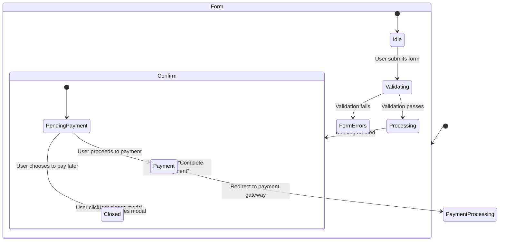
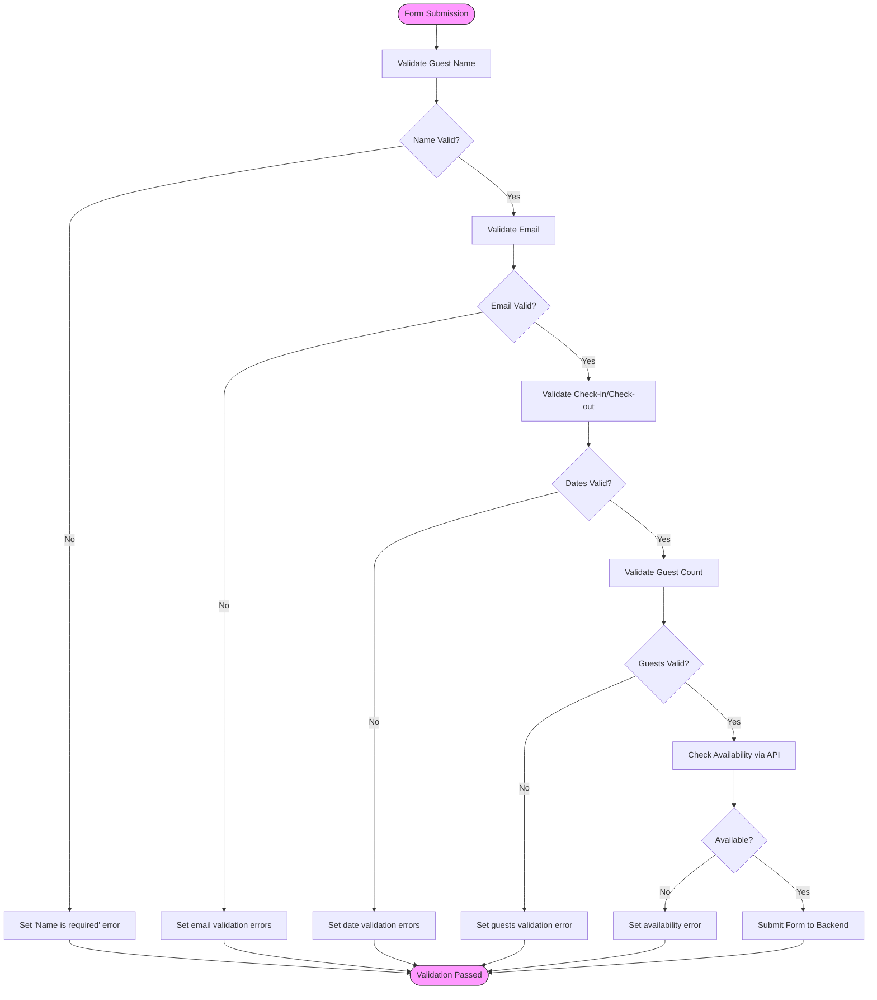
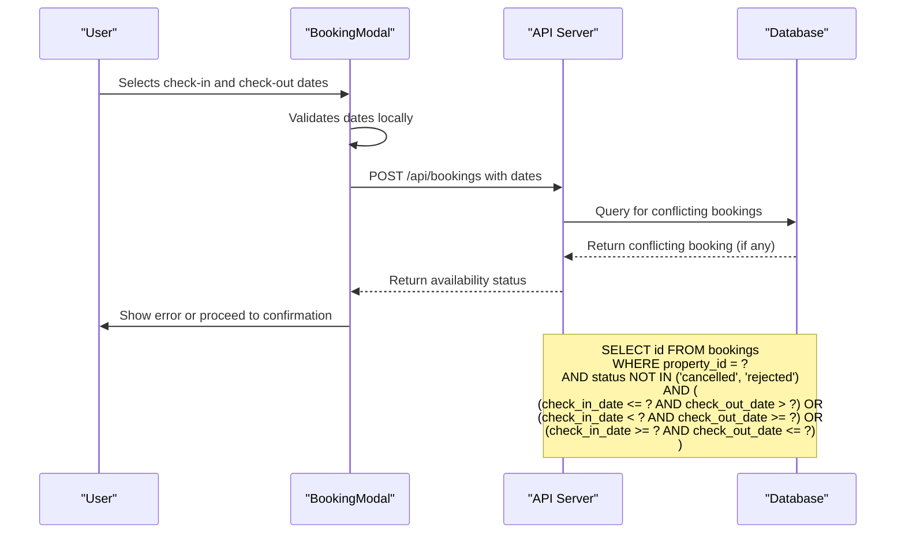
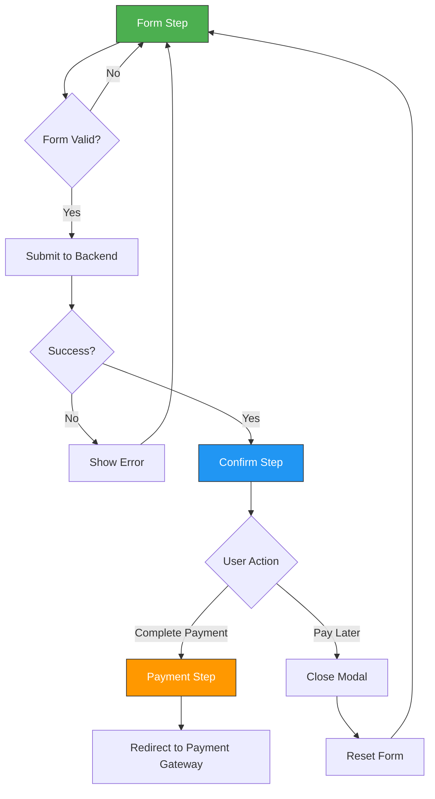
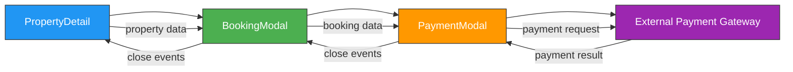
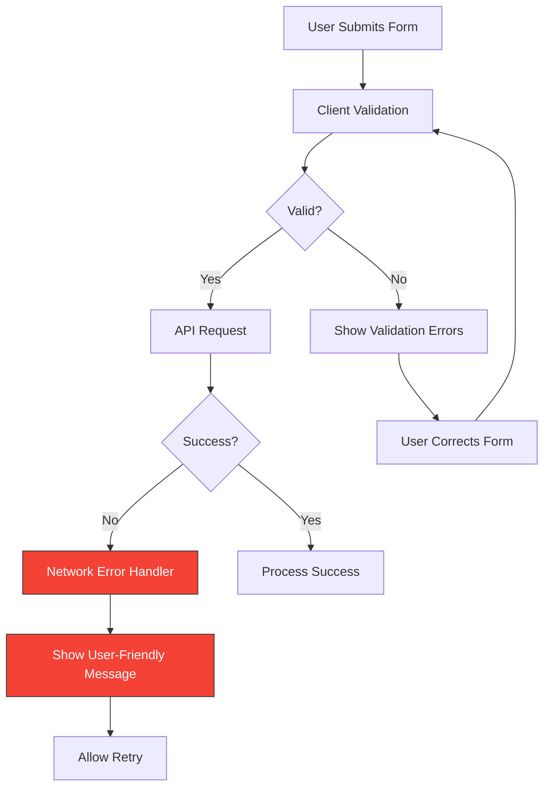

# Booking Modal

<cite>
**Referenced Files in This Document**   
- [BookingModal.tsx](file://src/react-app/components/BookingModal.tsx)
- [PaymentModal.tsx](file://src/react-app/components/PaymentModal.tsx)
- [ChatContext.tsx](file://src/react-app/contexts/ChatContext.tsx)
- [types.ts](file://src/shared/types.ts)
- [index.ts](file://src/worker/index.ts)
</cite>

## Table of Contents
1. [Introduction](#introduction)
2. [Component Overview](#component-overview)
3. [State Management](#state-management)
4. [Form Implementation and Validation](#form-implementation-and-validation)
5. [Integration with Date Picker and Backend Availability](#integration-with-date-picker-and-backend-availability)
6. [Booking Flow and State Transitions](#booking-flow-and-state-transitions)
7. [Real-Time Price Calculation](#real-time-price-calculation)
8. [Accessibility Features](#accessibility-features)
9. [Integration with PropertyDetail Component](#integration-with-propertydetail-component)
10. [Error Handling and Troubleshooting](#error-handling-and-troubleshooting)

## Introduction
The BookingModal component is a critical user interface element in the HabibiStay application that enables guests to book accommodations. It functions as a controlled form component that manages local state for booking details such as check-in/check-out dates, guest count, and special requests. The modal integrates with backend services to validate availability, calculate pricing, and process bookings through a multi-step workflow that culminates in payment processing. This document provides a comprehensive analysis of the component's implementation, functionality, and integration points.

## Component Overview
The BookingModal is implemented as a React functional component that manages a multi-step booking process through a state-driven interface. It serves as the primary booking interface for property reservations, coordinating between user input, backend validation, and payment processing.

### Key Features
- **Controlled Form**: Manages all form inputs through React state
- **Multi-Step Workflow**: Guides users through form submission, confirmation, and payment
- **Real-Time Validation**: Validates inputs and calculates pricing as users interact
- **Integrated Payment Flow**: Seamlessly transitions to payment processing
- **AI Assistant Integration**: Provides alternative booking path through AI chat

**Section sources**
- [BookingModal.tsx](file://src/react-app/components/BookingModal.tsx#L12-L472)

## State Management
The BookingModal component maintains several state variables to manage the booking process, form data, and UI state transitions.

### State Variables
```typescript
const [step, setStep] = useState<'form' | 'confirm' | 'payment'>('form');
const [loading, setLoading] = useState(false);
const [booking, setBooking] = useState<Booking | null>(null);
const [showPaymentModal, setShowPaymentModal] = useState(false);
const [formData, setFormData] = useState({
  guest_name: '',
  guest_email: '',
  guest_phone: '',
  check_in_date: '',
  check_out_date: '',
  total_guests: 1,
  special_requests: '',
});
const [errors, setErrors] = useState<Record<string, string>>({});
```

### State Flow Diagram


**Diagram sources**
- [BookingModal.tsx](file://src/react-app/components/BookingModal.tsx#L12-L472)

**Section sources**
- [BookingModal.tsx](file://src/react-app/components/BookingModal.tsx#L12-L472)

## Form Implementation and Validation
The BookingModal implements a comprehensive form validation system that ensures data integrity before submission to the backend.

### Form Fields and Validation Rules
| Field | Validation Rules | Error Messages |
|-------|------------------|---------------|
| **Guest Name** | Required, non-empty | "Name is required" |
| **Email Address** | Required, valid email format | "Email is required", "Please enter a valid email" |
| **Check-in Date** | Required, not in past | "Check-in date is required", "Check-in date cannot be in the past" |
| **Check-out Date** | Required, after check-in | "Check-out date is required", "Check-out must be after check-in" |
| **Guest Count** | Must not exceed property maximum | "Maximum X guests allowed" |

### Validation Implementation


**Diagram sources**
- [BookingModal.tsx](file://src/react-app/components/BookingModal.tsx#L12-L472)

**Section sources**
- [BookingModal.tsx](file://src/react-app/components/BookingModal.tsx#L12-L472)

## Integration with Date Picker and Backend Availability
The BookingModal integrates with HTML5 date input elements and validates date ranges against backend availability through API calls.

### Date Selection Implementation
The component uses native HTML5 date inputs with appropriate constraints:
- Check-in date cannot be in the past (min attribute set to current date)
- Check-out date minimum is set to the selected check-in date
- Visual feedback for invalid date ranges

### Backend Availability Validation
The component validates date ranges against the backend `/api/properties/:id/availability` endpoint:



**Diagram sources**
- [BookingModal.tsx](file://src/react-app/components/BookingModal.tsx#L12-L472)
- [index.ts](file://src/worker/index.ts#L1480-L1540)

**Section sources**
- [BookingModal.tsx](file://src/react-app/components/BookingModal.tsx#L12-L472)
- [index.ts](file://src/worker/index.ts#L1480-L1540)

## Booking Flow and State Transitions
The BookingModal implements a three-step booking process that guides users from form submission to payment completion.

### State Transition Flow


### Step Implementation Details
**Form Step**: Collects all booking information with real-time validation and price calculation
**Confirm Step**: Displays booking confirmation with reference number and payment pending status
**Payment Step**: Triggers the PaymentModal component to handle payment processing

The transition between steps is managed by the `step` state variable, which controls which UI is displayed to the user.

**Diagram sources**
- [BookingModal.tsx](file://src/react-app/components/BookingModal.tsx#L12-L472)

**Section sources**
- [BookingModal.tsx](file://src/react-app/components/BookingModal.tsx#L12-L472)

## Real-Time Price Calculation
The BookingModal includes a real-time price calculation system that updates as users modify their booking parameters.

### Price Calculation Logic
```typescript
const calculateBookingDetails = () => {
  if (!formData.check_in_date || !formData.check_out_date) return null;

  const checkIn = new Date(formData.check_in_date);
  const checkOut = new Date(formData.check_out_date);
  const nights = Math.ceil((checkOut.getTime() - checkIn.getTime()) / (1000 * 60 * 60 * 24));
  
  const baseAmount = nights * property.price_per_night;
  const serviceFee = Math.round(baseAmount * 0.05); // 5% service fee
  const taxes = Math.round(baseAmount * 0.15); // 15% VAT
  const total = baseAmount + serviceFee + taxes;

  return {
    nights,
    baseAmount,
    serviceFee,
    taxes,
    total,
  };
};
```

### Price Breakdown Structure
The component displays a detailed price breakdown including:
- **Base Amount**: Number of nights × price per night
- **Service Fee**: 5% of base amount
- **Taxes**: 15% VAT on base amount
- **Total**: Sum of all components

The price breakdown updates automatically whenever check-in/check-out dates change, providing immediate feedback to users.

**Section sources**
- [BookingModal.tsx](file://src/react-app/components/BookingModal.tsx#L12-L472)

## Accessibility Features
The BookingModal implements several accessibility features to ensure usability for all users.

### Keyboard Navigation
- Full keyboard operability with tab navigation through form elements
- Escape key closes the modal
- Enter key submits the form when focused on the primary action button

### ARIA Labels and Roles
- Proper labeling of form inputs with associated `<label>` elements
- ARIA attributes for interactive elements
- Semantic HTML structure with appropriate heading hierarchy
- Visual focus indicators for keyboard navigation

### Focus Management
- Focus trapping within the modal when open
- Initial focus set to the first interactive element
- Focus restoration to the triggering element when modal closes

### Assistive Technology Support
- Screen reader compatibility with descriptive labels
- High contrast mode support
- Responsive design for various viewport sizes
- Clear visual feedback for form validation errors

**Section sources**
- [BookingModal.tsx](file://src/react-app/components/BookingModal.tsx#L12-L472)

## Integration with PropertyDetail Component
The BookingModal is integrated into the PropertyDetail page, where it is triggered by user interaction with booking controls.

### Trigger Mechanism
The modal is conditionally rendered based on state managed in the PropertyDetail component:
- Displayed when user clicks "Book Now" button
- Receives property data as a prop for context
- Coordinates with other UI states (e.g., disabling booking during payment processing)

### Data Flow


### Component Coordination
The BookingModal works in concert with other components:
- **ChatBot**: Provides alternative booking path through AI assistant
- **PaymentModal**: Handles the final payment processing step
- **PropertyCard**: Shares consistent UI patterns and data structure

**Diagram sources**
- [BookingModal.tsx](file://src/react-app/components/BookingModal.tsx#L12-L472)
- [PaymentModal.tsx](file://src/react-app/components/PaymentModal.tsx#L10-L166)
- [PropertyDetail.tsx](file://src/react-app/pages/PropertyDetail.tsx)

**Section sources**
- [BookingModal.tsx](file://src/react-app/components/BookingModal.tsx#L12-L472)
- [PaymentModal.tsx](file://src/react-app/components/PaymentModal.tsx#L10-L166)

## Error Handling and Troubleshooting
The BookingModal implements comprehensive error handling for various failure scenarios.

### Common Issues and Solutions

**Date Conflicts**
- **Symptom**: User selects dates that overlap with existing bookings
- **Solution**: Backend returns conflict information; modal displays appropriate error message
- **Prevention**: Real-time availability checking during date selection

**Stale Availability Data**
- **Symptom**: Availability status changes between viewing and booking
- **Solution**: Final availability check at booking submission time
- **Mitigation**: Short cache durations for availability data

**Form Validation Failures**
- **Symptom**: Required fields missing or invalid data
- **Solution**: Client-side validation with clear error messages
- **Enhancement**: Visual highlighting of problematic fields

**Network Errors**
- **Symptom**: API requests fail due to connectivity issues
- **Solution**: Try-catch blocks with user-friendly error messages
- **Recovery**: Allow form resubmission after error

### Error Handling Implementation


**Diagram sources**
- [BookingModal.tsx](file://src/react-app/components/BookingModal.tsx#L12-L472)

**Section sources**
- [BookingModal.tsx](file://src/react-app/components/BookingModal.tsx#L12-L472)