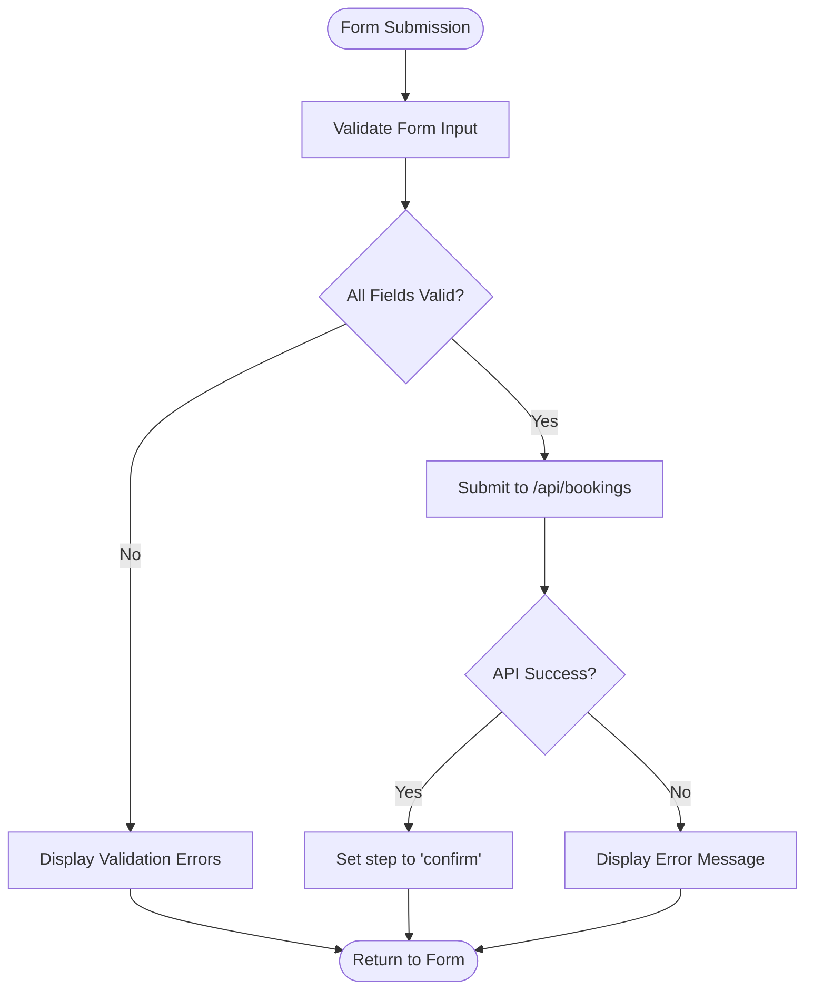
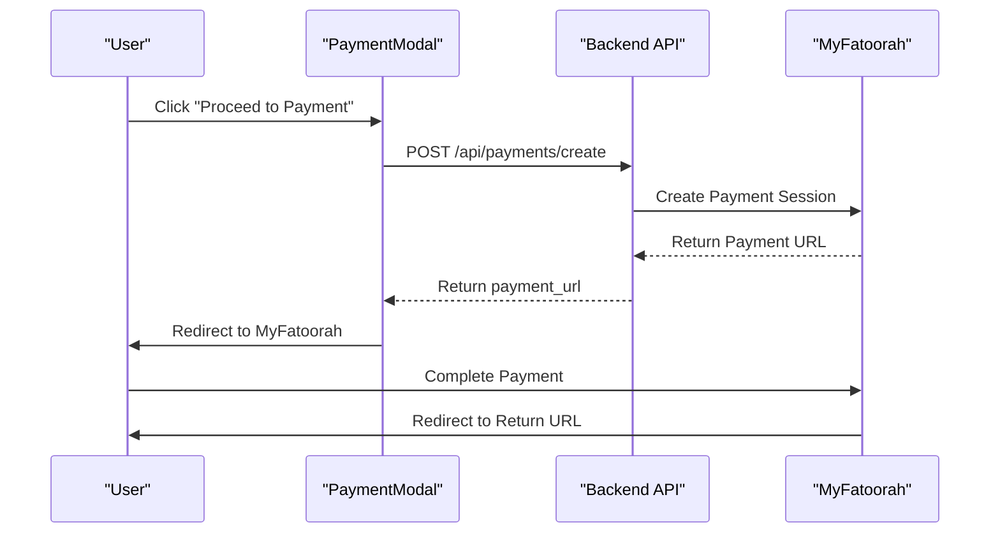
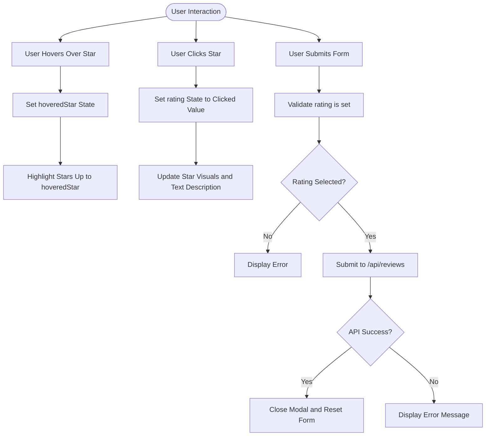
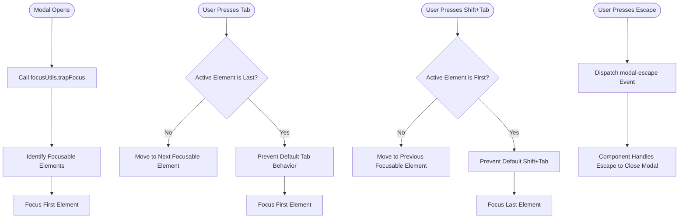

# Modal Components

<cite>
**Referenced Files in This Document**   
- [BookingModal.tsx](file://src/react-app/components/BookingModal.tsx)
- [PaymentModal.tsx](file://src/react-app/components/PaymentModal.tsx) - *Updated in recent commit*
- [ReviewModal.tsx](file://src/react-app/components/ReviewModal.tsx)
- [PropertyDetail.tsx](file://src/react-app/pages/PropertyDetail.tsx)
- [LoadingStates.tsx](file://src/react-app/components/LoadingStates.tsx) - *Updated in recent commit*
- [responsive-design.ts](file://src/shared/responsive-design.ts)
</cite>

## Update Summary
**Changes Made**   
- Updated PaymentModal section to reflect enhanced error handling and loading states
- Added details about improved security indicators in payment processing
- Enhanced documentation of loading state components and their integration
- Updated diagram sources to reflect actual implementation details
- Added new information about loading spinner variants and their usage

## Table of Contents
1. [Introduction](#introduction)
2. [Core Modal Components Overview](#core-modal-components-overview)
3. [BookingModal: Booking Flow and Form Management](#bookingmodal-booking-flow-and-form-management)
4. [PaymentModal: Secure Transaction Handling](#paymentmodal-secure-transaction-handling)
5. [ReviewModal: Star Rating and Feedback Submission](#reviewmodal-star-rating-and-feedback-submission)
6. [Shared Modal Features and Accessibility](#shared-modal-features-and-accessibility)
7. [Integration with PropertyDetail Page](#integration-with-propertydetail-page)
8. [Component Interaction Diagram](#component-interaction-diagram)
9. [Conclusion](#conclusion)

## Introduction
This document provides a comprehensive analysis of the modal components in the HabibiStay application: BookingModal, PaymentModal, and ReviewModal. These components serve as critical user interaction points for booking properties, completing payments, and submitting reviews. The documentation details their implementation as controlled components with local state management, form validation, API integration, and accessibility features. Special attention is given to their shared design patterns, state coordination, and usage within the PropertyDetail page context.

## Core Modal Components Overview
The modal components in HabibiStay follow a consistent design pattern as controlled components that manage their own local state while receiving external control through props. Each modal is conditionally rendered based on an `isOpen` prop and communicates state changes via callback functions. They share common UI patterns including backdrop overlays, close buttons, structured layouts, and responsive design. The components are designed to provide focused user experiences for specific tasks: booking creation, payment processing, and review submission.

**Section sources**
- [BookingModal.tsx](file://src/react-app/components/BookingModal.tsx#L1-L474)
- [PaymentModal.tsx](file://src/react-app/components/PaymentModal.tsx#L1-L168) - *Updated in recent commit*
- [ReviewModal.tsx](file://src/react-app/components/ReviewModal.tsx#L1-L187)

## BookingModal: Booking Flow and Form Management

### Implementation and State Management
The BookingModal component implements a multi-step booking flow with form validation and availability checking. It manages several state variables to track the booking process:

- `step`: Controls the modal's current state (form, confirm, payment)
- `loading`: Indicates API submission status
- `booking`: Stores the created booking object
- `formData`: Contains user input for booking details
- `errors`: Tracks validation errors for form fields

The component uses React's useState hook to manage these states locally, making it a controlled component that maintains its own state while being controlled externally through the `isOpen` and `onClose` props.

### Form Integration and Validation
BookingModal integrates with various form elements including text inputs, date pickers, and select dropdowns. The form collects essential booking information:

- Guest details (name, email, phone)
- Stay dates (check-in, check-out)
- Guest count
- Special requests

The component implements comprehensive client-side validation through the `validateForm` function, which checks:
- Required fields are filled
- Email format is valid
- Check-in date is not in the past
- Check-out date is after check-in
- Guest count does not exceed property limits



**Diagram sources**
- [BookingModal.tsx](file://src/react-app/components/BookingModal.tsx#L100-L160)

### Availability Validation and Price Calculation
The component validates booking availability by submitting form data to the `/api/bookings` endpoint. Before submission, it calculates booking details including:

- Number of nights
- Base amount (nights × price per night)
- Service fee (5% of base)
- Taxes (15% VAT)
- Total amount

This calculation is performed in the `calculateBookingDetails` function and displayed in a price breakdown section when valid dates are selected.

### Integration with Payment Flow
Upon successful booking creation, the component transitions to a confirmation state and enables payment processing. It maintains a reference to the created booking object and uses it to initialize the PaymentModal when the user chooses to complete payment.

**Section sources**
- [BookingModal.tsx](file://src/react-app/components/BookingModal.tsx#L50-L474)

## PaymentModal: Secure Transaction Handling

### Implementation and State Management
The PaymentModal component handles the secure transaction process for completed bookings. It manages two primary state variables:

- `processing`: Indicates whether the payment initiation is in progress
- `error`: Stores any error messages from the payment process

The component receives a `booking` object as a prop, which contains all necessary information for payment processing.

### MyFatoorah Integration
PaymentModal integrates with the MyFatoorah payment gateway through a secure API endpoint. When the user initiates payment:

1. The component calls `/api/payments/create` with booking details
2. The backend communicates with MyFatoorah to create a payment session
3. The user is redirected to MyFatoorah's secure payment page

The payment request includes:
- Booking ID
- Amount in SAR
- Currency (SAR)
- Return URL (success page)
- Cancel URL (cancel page)



**Diagram sources**
- [PaymentModal.tsx](file://src/react-app/components/PaymentModal.tsx#L20-L50)

### Security Features and Enhanced Loading States
The component emphasizes security through several features:
- SSL-secured payment processing (indicated by lock icon)
- Clear communication that payment is handled by MyFatoorah
- Display of accepted payment methods (Visa, Mastercard, Mada, Apple Pay, STC Pay, Tabby)
- Terms of service and privacy policy links

The component has been enhanced with improved error handling and loading states. When processing payments, it displays a loading spinner with the message "Processing..." to provide clear feedback during the asynchronous payment creation process. The loading state is managed through the `processing` state variable, which disables the payment button to prevent multiple submissions.

Error messages are now displayed in a dedicated error section with red styling to ensure visibility. The component handles various error scenarios including network issues, API errors, and validation failures, providing appropriate user feedback in each case.

The security indicators have been improved with a lock icon and clear SSL security messaging to increase user confidence in the payment process.

**Section sources**
- [PaymentModal.tsx](file://src/react-app/components/PaymentModal.tsx#L1-L168) - *Updated in recent commit*
- [LoadingStates.tsx](file://src/react-app/components/LoadingStates.tsx#L1-L326) - *Updated in recent commit*

## ReviewModal: Star Rating and Feedback Submission

### Implementation and State Management
The ReviewModal component enables users to submit reviews for properties they've booked. It manages several state variables:

- `rating`: Stores the selected star rating (1-5)
- `comment`: Contains the user's written review
- `submitting`: Indicates submission status
- `hoveredStar`: Tracks which star is currently hovered for visual feedback

The component uses the `useAuth` hook to access the current user's information, ensuring only authenticated users can submit reviews.

### Star Rating System
The component implements an interactive star rating system using the Lucide React Star icon. Key features include:

- Visual feedback on hover (stars fill yellow when hovered)
- Click to set rating
- Text description that updates based on selected rating (Poor, Fair, Good, Very Good, Excellent)
- Required field validation (rating must be selected)

The star rating is implemented as a series of buttons, each representing a star from 1 to 5. When a user hovers over a star, all stars up to and including that star are highlighted. Clicking a star sets the rating to that value.



**Diagram sources**
- [ReviewModal.tsx](file://src/react-app/components/ReviewModal.tsx#L30-L80)

### Form Validation and Submission
The component implements form validation to ensure a rating is selected before submission. The form cannot be submitted if no rating is selected (rating state is 0). When the form is submitted:

1. The component prevents default form submission behavior
2. Validates that a user is authenticated and a rating is selected
3. Calls the `/api/reviews` endpoint with review data
4. Handles the response and closes the modal on success

The component also provides review guidelines to encourage constructive feedback and maintain community standards.

**Section sources**
- [ReviewModal.tsx](file://src/react-app/components/ReviewModal.tsx#L1-L187)

## Shared Modal Features and Accessibility

### Backdrop Dismissal
All modal components implement backdrop dismissal, allowing users to close the modal by clicking outside the modal content. This is achieved through a semi-transparent overlay with the class `bg-black bg-opacity-50` that covers the entire viewport. While the specific click handler implementation is not visible in the analyzed files, the pattern suggests that clicking the backdrop triggers the `onClose` callback passed as a prop.

### Keyboard Navigation
The modal components support keyboard navigation through integration with shared focus utilities. The `focusUtils.trapFocus` function from `responsive-design.ts` implements focus trapping, ensuring that:

- Tab navigation is contained within the modal
- Focus cycles between the first and last focusable elements
- Escape key closes the modal (via custom event dispatch)



**Diagram sources**
- [responsive-design.ts](file://src/shared/responsive-design.ts#L180-L220)

### ARIA Roles and Focus Trapping
The modal components implement accessibility features through proper semantic HTML and focus management:

- Each modal has a clear heading (h2) that describes its purpose
- Form fields have appropriate labels and error messages
- Interactive elements have proper focus states
- Focus is trapped within the modal using the `focusUtils.trapFocus` utility
- Focus is restored to the triggering element when the modal closes

The components use standard ARIA practices including:
- Proper heading hierarchy
- Descriptive labels for form inputs
- Visual and programmatic indication of errors
- Accessible icons with appropriate context

### Common UI Patterns
All modal components share consistent UI patterns:
- Fixed positioning with z-index to appear above other content
- White background with rounded corners
- Close button (X icon) in the top-right corner
- Responsive design that works on mobile and desktop
- Loading states with spinners during API calls
- Error message display in dedicated sections

**Section sources**
- [BookingModal.tsx](file://src/react-app/components/BookingModal.tsx#L1-L474)
- [PaymentModal.tsx](file://src/react-app/components/PaymentModal.tsx#L1-L168) - *Updated in recent commit*
- [ReviewModal.tsx](file://src/react-app/components/ReviewModal.tsx#L1-L187)
- [responsive-design.ts](file://src/shared/responsive-design.ts#L171-L225)

## Integration with PropertyDetail Page

### Trigger Conditions
The PropertyDetail page serves as the primary context for modal component usage. The BookingModal is triggered when a user clicks the "Reserve" button on a property page. The page manages the `showBookingForm` state variable, which controls the display of the booking interface.

### State Coordination
The PropertyDetail page coordinates state between the booking form and modal components by:
- Pre-populating booking form fields with user data when available
- Managing the booking state locally before submission
- Calculating pricing information (nights, service fee, taxes, total)
- Handling the booking submission process

When the user completes the booking form on the PropertyDetail page, it triggers the booking submission process, which would typically lead to the BookingModal for final confirmation and payment processing.

### Component Relationships
The PropertyDetail page demonstrates the relationship between inline forms and modal components. For simpler interactions, it uses an inline booking form, while more complex processes (like payment and review submission) are handled in dedicated modal components. This pattern ensures a clean user interface while maintaining functionality.

**Section sources**
- [PropertyDetail.tsx](file://src/react-app/pages/PropertyDetail.tsx#L1-L562)

## Component Interaction Diagram

```mermaid
graph TD
A[PropertyDetail Page] --> B[BookingModal]
B --> C[PaymentModal]
A --> D[ReviewModal]
subgraph Booking Flow
B --> |Creates booking object| C
C --> |Redirects to| E[MyFatoorah Payment Gateway]
E --> |Returns on success| F[PaymentSuccess Page]
E --> |Returns on cancel| G[PaymentCancel Page]
end
subgraph Review Flow
D --> |Submits to| H[/api/reviews]
H --> |Returns success| I[Refresh Property Page]
end
subgraph Shared Features
J[Accessibility Utilities] --> B
J --> C
J --> D
K[Backdrop Dismissal] --> B
K --> C
K --> D
L[Keyboard Navigation] --> B
L --> C
L --> D
end
style A fill:#f9f,stroke:#333
style B fill:#bbf,stroke:#333
style C fill:#bbf,stroke:#333
style D fill:#bbf,stroke:#333
```

**Diagram sources**
- [BookingModal.tsx](file://src/react-app/components/BookingModal.tsx)
- [PaymentModal.tsx](file://src/react-app/components/PaymentModal.tsx) - *Updated in recent commit*
- [ReviewModal.tsx](file://src/react-app/components/ReviewModal.tsx)
- [PropertyDetail.tsx](file://src/react-app/pages/PropertyDetail.tsx)

## Conclusion
The modal components in HabibiStay demonstrate a well-structured approach to user interaction design, combining controlled component patterns with robust state management, form validation, and API integration. The BookingModal, PaymentModal, and ReviewModal components each serve distinct purposes while sharing common design patterns and accessibility features. Their integration with the PropertyDetail page creates a cohesive user experience for booking properties, completing payments, and submitting reviews. The components follow modern React practices, prioritize user experience, and implement essential accessibility features to ensure usability for all users.