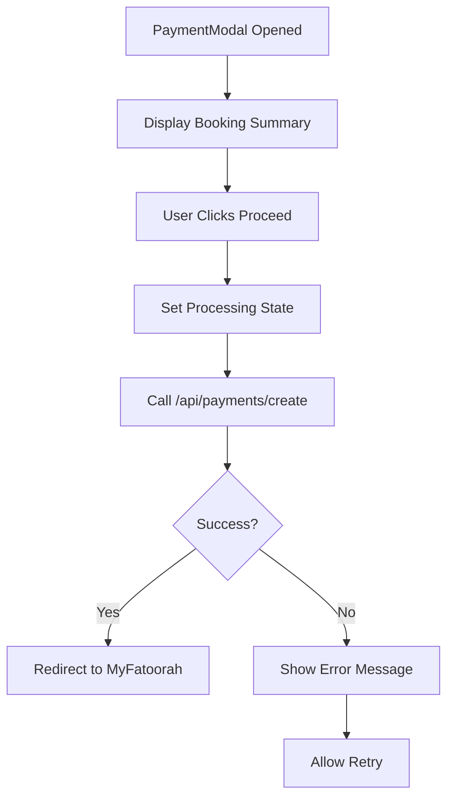
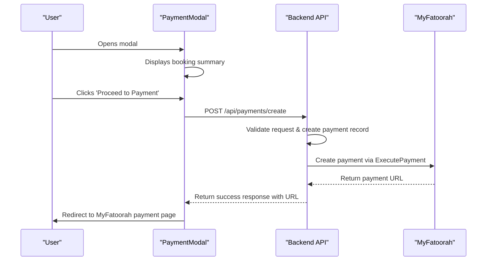
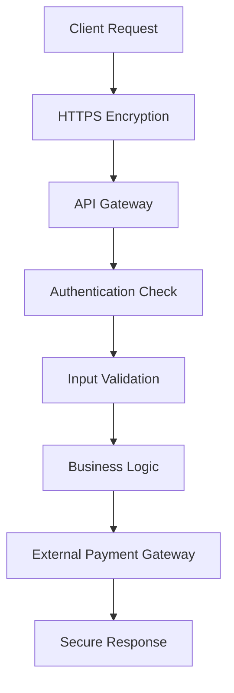
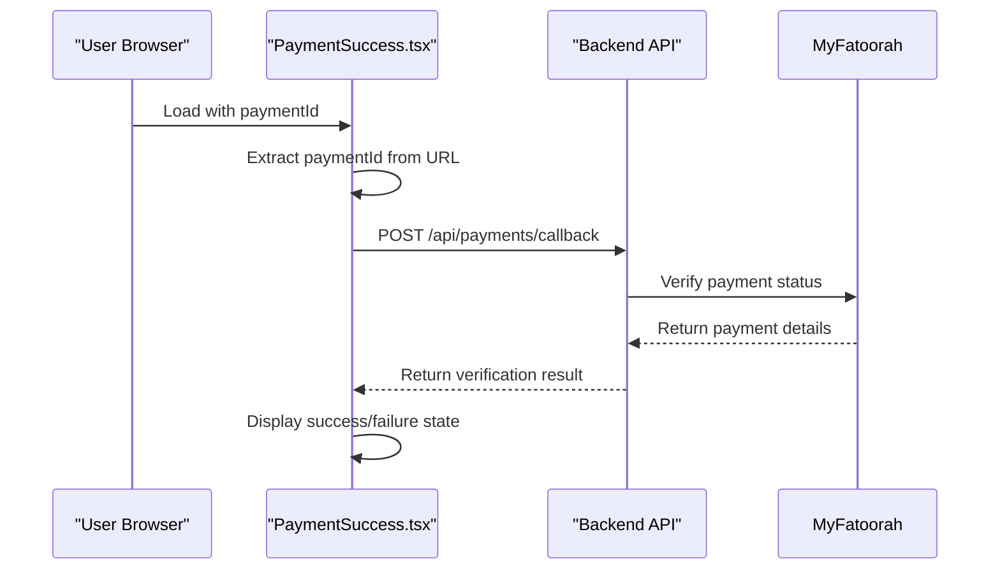

# Payment Modal

<cite>
**Referenced Files in This Document**   
- [PaymentModal.tsx](file://src/react-app/components/PaymentModal.tsx) - *Updated with enhanced error handling and loading states*
- [PaymentSuccess.tsx](file://src/react-app/pages/PaymentSuccess.tsx) - *Enhanced with processing state and improved UX*
- [PaymentService.ts](file://src/server/services/PaymentService.ts) - *Supports multiple payment providers*
- [payment.ts](file://src/shared/payment.ts) - *Shared payment utilities*
- [index.ts](file://src/worker/index.ts) - *Payment callback processing*
</cite>

## Update Summary
**Changes Made**   
- Updated UI/UX Implementation section with enhanced loading states and payment methods
- Added Payment Provider Support section to document multi-provider integration
- Enhanced Payment Success Flow with detailed processing state
- Updated code examples to reflect current implementation
- Added security considerations for multiple payment providers
- Updated section sources to reflect analyzed files

## Table of Contents
1. [Introduction](#introduction)
2. [Core Functionality](#core-functionality)
3. [Integration Flow](#integration-flow)
4. [Security Considerations](#security-considerations)
5. [UI/UX Implementation](#uiux-implementation)
6. [Error Handling](#error-handling)
7. [Payment Success Flow](#payment-success-flow)
8. [Payment Provider Support](#payment-provider-support)
9. [Code Examples](#code-examples)

## Introduction
The PaymentModal component serves as the primary interface for initiating secure payments within the HabibiStay application. It collects minimal user input and delegates payment processing to MyFatoorah, a PCI-compliant third-party payment gateway. This documentation details the component's architecture, integration points, security measures, and user experience design.

**Section sources**
- [PaymentModal.tsx](file://src/react-app/components/PaymentModal.tsx#L1-L167)

## Core Functionality
The PaymentModal component enables users to complete bookings by securely processing payments through MyFatoorah. It receives booking data from the BookingModal, constructs a payment payload, and communicates with the backend API to generate a secure payment URL.

Key responsibilities:
- Display booking summary information
- Collect user confirmation for payment
- Initiate payment creation via API call
- Handle redirection to external payment gateway
- Manage loading states and error conditions

The component follows a controlled state pattern using React's useState hook to manage processing status and error messages during payment initiation.



**Diagram sources**
- [PaymentModal.tsx](file://src/react-app/components/PaymentModal.tsx#L1-L167)

**Section sources**
- [PaymentModal.tsx](file://src/react-app/components/PaymentModal.tsx#L1-L167)

## Integration Flow
The payment integration follows a multi-step process that coordinates between frontend components, backend services, and the MyFatoorah payment gateway.

### Data Flow Sequence


**Diagram sources**
- [PaymentModal.tsx](file://src/react-app/components/PaymentModal.tsx#L45-L65)
- [PaymentService.ts](file://src/server/services/PaymentService.ts#L149-L191)

**Section sources**
- [PaymentModal.tsx](file://src/react-app/components/PaymentModal.tsx#L45-L65)
- [PaymentService.ts](file://src/server/services/PaymentService.ts#L149-L191)

### Payload Structure
When initiating a payment, the PaymentModal sends the following payload to the backend:

```json
{
  "booking_id": 123,
  "amount": 1500.00,
  "currency": "SAR",
  "return_url": "https://habibistay.com/payment/success",
  "cancel_url": "https://habibistay.com/payment/cancel"
}
```

The backend then forwards relevant data to MyFatoorah in this format:

```json
{
  "PaymentMethodId": 0,
  "InvoiceValue": 1500.00,
  "DisplayCurrencyIso": "SAR",
  "CustomerName": "John Doe",
  "CustomerEmail": "john@example.com",
  "CustomerMobile": "+966501234567",
  "CustomerReference": "123",
  "InvoiceItemsCreate": [
    {
      "ItemName": "Property Booking",
      "Quantity": 1,
      "UnitPrice": 1500.00
    }
  ],
  "CallBackUrl": "https://habibistay.com/api/payments/callback/myfatoorah",
  "ErrorUrl": "https://habibistay.com/api/payments/error/myfatoorah",
  "Language": "en",
  "UserDefinedField": "PAY_123456789"
}
```

**Section sources**
- [PaymentModal.tsx](file://src/react-app/components/PaymentModal.tsx#L45-L65)
- [PaymentService.ts](file://src/server/services/PaymentService.ts#L285-L319)

## Security Considerations
The payment implementation prioritizes security through multiple layers of protection and compliance measures.

### PCI Compliance
The system achieves PCI DSS compliance by offloading sensitive payment processing to MyFatoorah. The application never handles or stores credit card information directly. As stated in the Privacy Policy, "Payment information (processed securely through MyFatoorah)".

### API Key Management
Payment provider API keys are managed through environment variables, ensuring they are not exposed in client-side code:

```typescript
this.myFatoorahConfig = {
  apiKey: process.env.MYFATOORAH_API_KEY || '',
  baseUrl: process.env.MYFATOORAH_BASE_URL || 'https://api.myfatoorah.com',
  webhookSecret: process.env.MYFATOORAH_WEBHOOK_SECRET || ''
};
```

This environment-based configuration allows different credentials for development, staging, and production environments.

### Tamper Protection
The system implements multiple safeguards against tampering:
- Server-side validation of all payment requests
- Use of secure HTTPS connections for all API calls
- JWT authentication for API endpoints (implied by context)
- Input validation on both client and server sides
- Unique payment identifiers to prevent replay attacks



**Diagram sources**
- [PaymentService.ts](file://src/server/services/PaymentService.ts#L71-L106)
- [payment.ts](file://src/shared/payment.ts#L0-L41)

**Section sources**
- [PaymentService.ts](file://src/server/services/PaymentService.ts#L71-L106)
- [payment.ts](file://src/shared/payment.ts#L0-L41)

## UI/UX Implementation
The PaymentModal provides a clean, user-friendly interface that guides users through the payment process with clear feedback and minimal friction.

### Loading States
The component implements visual feedback during payment processing:
- Disables the payment button during processing
- Shows a loading spinner animation
- Displays "Processing..." text
- Maintains the modal state to prevent user confusion

```tsx
{processing ? (
  <span className="flex items-center justify-center">
    <div className="animate-spin rounded-full h-4 w-4 border-b-2 border-white mr-2"></div>
    Processing...
  </span>
) : (
  'Proceed to Payment'
)}
```

### Confirmation Messaging
The modal displays a comprehensive booking summary before payment, including:
- Guest name
- Check-in and check-out dates
- Number of guests
- Total amount in SAR (Saudi Riyal)

This allows users to verify their booking details before committing to payment.

### Payment Methods
The updated PaymentModal displays accepted payment methods including:
- Visa and Mastercard credit/debit cards
- Mada (Saudi national payment network)
- Digital wallets: Apple Pay, STC Pay, and Tabby installments

This information helps users understand their payment options before proceeding.

**Section sources**
- [PaymentModal.tsx](file://src/react-app/components/PaymentModal.tsx#L131-L166)

## Error Handling
The payment system implements comprehensive error handling at multiple levels to ensure reliability and user satisfaction.

### Client-Side Error Handling
In the PaymentModal component, errors are caught and displayed to users:

```typescript
try {
  const response = await fetch('/api/payments/create', { /* ... */ });
  const data = await response.json();

  if (data.success) {
    window.location.href = data.data.payment_url;
  } else {
    setError(data.error || 'Failed to create payment');
  }
} catch (error) {
  console.error('Payment error:', error);
  setError('Something went wrong. Please try again.');
} finally {
  setProcessing(false);
}
```

### Server-Side Error Handling
The PaymentService implements structured error handling with specific validation:

```typescript
private async validatePaymentRequest(request: PaymentRequest): Promise<void> {
  if (!request.bookingId) {
    throw new Error('Booking ID is required');
  }

  if (!request.amount || request.amount <= 0) {
    throw new Error('Valid payment amount is required');
  }

  if (!request.currency) {
    throw new Error('Currency is required');
  }

  if (!request.customerInfo.name || !request.customerInfo.email) {
    throw new Error('Customer name and email are required');
  }
}
```

### Payment Callback Error Handling
The worker handles payment callback errors gracefully:

```typescript
catch (error) {
  console.error('Payment callback processing failed:', error);
  return c.json<ApiResponse>({
    success: false,
    error: "Failed to process payment callback",
  }, 500);
}
```

**Section sources**
- [PaymentModal.tsx](file://src/react-app/components/PaymentModal.tsx#L45-L65)
- [PaymentService.ts](file://src/server/services/PaymentService.ts#L672-L717)
- [index.ts](file://src/worker/index.ts#L1112-L1151)

## Payment Success Flow
After successful payment processing, users are redirected to the PaymentSuccess page which confirms their transaction.

### Success Callback Processing
The PaymentSuccess page handles the callback from the payment system:



**Diagram sources**
- [PaymentSuccess.tsx](file://src/react-app/pages/PaymentSuccess.tsx#L0-L34)
- [index.ts](file://src/worker/index.ts#L1112-L1151)

**Section sources**
- [PaymentSuccess.tsx](file://src/react-app/pages/PaymentSuccess.tsx#L0-L34)
- [index.ts](file://src/worker/index.ts#L1112-L1151)

### User Experience
The PaymentSuccess page provides:
- Clear visual indication of success (green checkmark) or failure (warning icon)
- Transaction ID display for successful payments
- Actionable next steps for both success and failure scenarios
- Support contact options
- Navigation to browse other properties

For failed payments, users can:
- Try payment again
- Contact support
- Browse other properties

This ensures users always have clear next steps regardless of payment outcome.

## Payment Provider Support
The payment system now supports multiple payment providers through a unified interface.

### Available Providers
The system supports two primary payment providers:
- **MyFatoorah**: Primary provider for Saudi Arabia and Gulf region
- **PayPal**: International provider for global customers

Provider availability is determined by environment configuration:

```typescript
async getPaymentProviders(): Promise<PaymentProvider[]> {
  return [
    {
      id: 'myfatoorah',
      name: 'MyFatoorah',
      isActive: !!this.myFatoorahConfig.apiKey,
      supportedCurrencies: ['SAR', 'AED', 'KWD', 'BHD', 'QAR', 'OMR', 'JOD', 'EGP'],
      supportedCountries: ['SA', 'AE', 'KW', 'BH', 'QA', 'OM', 'JO', 'EG']
    },
    {
      id: 'paypal',
      name: 'PayPal',
      isActive: !!this.paypalConfig.clientId,
      supportedCurrencies: ['USD', 'EUR', 'GBP', 'SAR', 'AED'],
      supportedCountries: ['US', 'GB', 'CA', 'AU', 'DE', 'FR', 'IT', 'ES', 'SA', 'AE']
    }
  ];
}
```

### Provider Selection
The system automatically selects the appropriate provider based on:
- Customer's country and currency preferences
- Availability of provider credentials in environment
- Business rules for regional payment processing

**Section sources**
- [PaymentService.ts](file://src/server/services/PaymentService.ts#L110-L149)

## Code Examples

### Payment Initiation Function
```typescript
const handlePayment = async () => {
  setProcessing(true);
  setError(null);

  try {
    const response = await fetch('/api/payments/create', {
      method: 'POST',
      headers: {
        'Content-Type': 'application/json',
      },
      body: JSON.stringify({
        booking_id: booking.id,
        amount: booking.total_amount,
        currency: 'SAR',
        return_url: `${window.location.origin}/payment/success`,
        cancel_url: `${window.location.origin}/payment/cancel`,
      }),
    });

    const data = await response.json();

    if (data.success) {
      window.location.href = data.data.payment_url;
    } else {
      setError(data.error || 'Failed to create payment');
    }
  } catch (error) {
    console.error('Payment error:', error);
    setError('Something went wrong. Please try again.');
  } finally {
    setProcessing(false);
  }
};
```

### Payment Service Creation
```typescript
constructor(private db: Database) {
  this.myFatoorahConfig = {
    apiKey: process.env.MYFATOORAH_API_KEY || '',
    baseUrl: process.env.MYFATOORAH_BASE_URL || 'https://api.myfatoorah.com',
    webhookSecret: process.env.MYFATOORAH_WEBHOOK_SECRET || ''
  };
}
```

### MyFatoorah API Integration
```typescript
private async createMyFatoorahPayment(paymentId: string, request: PaymentRequest): Promise<PaymentResponse> {
  try {
    const response = await fetch(`${this.myFatoorahConfig.baseUrl}/v2/ExecutePayment`, {
      method: 'POST',
      headers: {
        'Authorization': `Bearer ${this.myFatoorahConfig.apiKey}`,
        'Content-Type': 'application/json'
      },
      body: JSON.stringify({
        PaymentMethodId: 0,
        InvoiceValue: request.amount,
        DisplayCurrencyIso: request.currency,
        CustomerName: request.customerInfo.name,
        CustomerEmail: request.customerInfo.email,
        CustomerMobile: request.customerInfo.phone,
        CustomerReference: request.bookingId,
        InvoiceItemsCreate: [
          {
            ItemName: request.description,
            Quantity: 1,
            UnitPrice: request.amount
          }
        ],
        CallBackUrl: `${process.env.APP_URL}/api/payments/callback/myfatoorah`,
        ErrorUrl: `${process.env.APP_URL}/api/payments/error/myfatoorah`,
        Language: 'en',
        UserDefinedField: paymentId
      })
    });

    const data = await response.json();

    if (!data.IsSuccess) {
      throw new Error(data.Message || 'Payment creation failed');
    }

    return {
      success: true,
      paymentId,
      transactionId: data.Data.InvoiceId.toString(),
      status: 'pending',
      amount: request.amount,
      currency: request.currency,
      paymentUrl: data.Data.PaymentURL,
      provider: 'myfatoorah',
      metadata: {
        invoiceId: data.Data.InvoiceId,
        invoiceStatus: data.Data.InvoiceStatus
      }
    };
  } catch (error) {
    return {
      success: false,
      paymentId,
      status: 'failed',
      amount: request.amount,
      currency: request.currency,
      provider: 'myfatoorah',
      error: error.message
    };
  }
}
```

**Section sources**
- [PaymentModal.tsx](file://src/react-app/components/PaymentModal.tsx#L45-L65)
- [PaymentService.ts](file://src/server/services/PaymentService.ts#L285-L319)
- [payment.ts](file://src/shared/payment.ts#L115-L164)